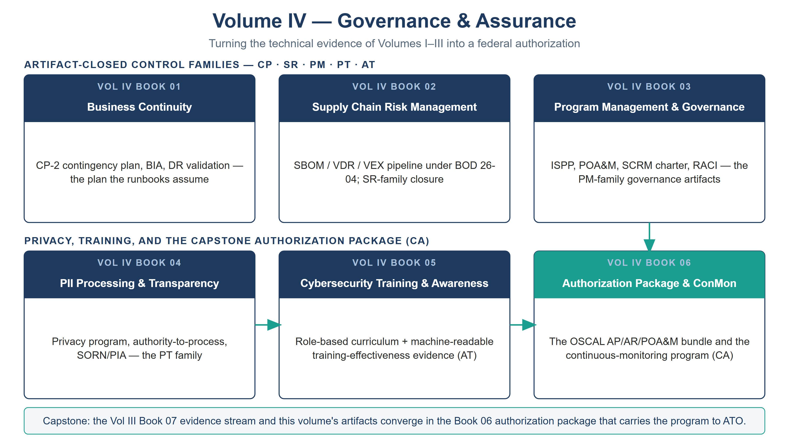

::: {.fouo-banner}
INTERNAL — NOT FOR PUBLIC DISTRIBUTION
:::

::: {.aan-warning}
## Draft Proposal — Subject to Review

This document is a **draft proposal** developed by the **CSI Team (Cloud Services Infrastructure)**. It has not been reviewed or approved by the SSA CIO Office, the Office of Information Security (OIS), or organizational leadership.

**Date Code:** 2026-07-08 16:23 ET
:::

# Volume Purpose

**Volume IV turns the technical evidence of Volumes I–III into a federal
authorization.** The infrastructure volumes produce capabilities and
machine-readable evidence; Volume IV supplies the layer that infrastructure alone
cannot — the **documents, signatures, processes, and the OSCAL package** that an
authorizing official and an assessor actually consume. The volume's books carry
the closures for the control families that are satisfied by artifacts rather than
configuration — contingency planning (CP), supply-chain risk (SR), program
management (PM), privacy/PII processing (PT), awareness and training (AT), and
assessment/authorization/continuous monitoring (CA) — registered per book in the
compliance spine as each book is finalized.

The volume's recurring lesson is the series' sharpest governance point: *a
perfectly configured control that cannot produce a signed, tested, machine-
readable artifact is, from the assessor's chair, an open finding.* Volume IV
manufactures the artifacts.

{#fig-vol4-map fig-alt="A house-style volume map for Volume IV, Governance & Assurance, on a white background with a navy title and grey subtitle. Two labeled rows of book nodes are shown. The top row, ARTIFACT-CLOSED CONTROL FAMILIES — CP, SR, PM, PT, AT, holds Book 01 Business Continuity (CP-2 plan, BIA, DR validation), Book 02 Supply Chain Risk Management (SBOM/VDR/VEX under BOD 26-04), and Book 03 Program Management & Governance (ISPP, POA&M, SCRM charter, RACI). The bottom row, PRIVACY, TRAINING, AND THE CAPSTONE AUTHORIZATION PACKAGE (CA), holds Book 04 PII Processing & Transparency and Book 05 Cybersecurity Training & Awareness feeding Book 06 Authorization Package & ConMon, which is drawn with a teal header to mark it as the capstone; teal arrows flow across the bottom row and a vertical teal arrow descends from Book 03 into Book 06. A footer band states that the Vol III Book 07 evidence stream and this volume's artifacts converge in the Book 06 authorization package that carries the program to ATO. White background. Authored house-style diagram." width="100%"}

# Books in This Volume

| Book | Title | Role |
|---|---|---|
| **Vol IV Book 01** | Business Continuity | CP-2 contingency plan, BIA, DR validation — the plan the runbooks assume |
| **Vol IV Book 02** | Supply Chain Risk Management | SBOM / VDR / VEX pipeline under BOD 26-04; SR-family closure |
| **Vol IV Book 03** | Program Management & Governance | ISPP, POA&M, SCRM charter, RACI — the PM-family governance artifacts |
| **Vol IV Book 04** | PII Processing & Transparency | Privacy program, authority-to-process, SORN/PIA — the PT family |
| **Vol IV Book 05** | Cybersecurity Training & Awareness | Role-based curriculum + machine-readable training-effectiveness evidence (AT) |
| **Vol IV Book 06** | Authorization Package & ConMon | The OSCAL AP/AR/POA&M bundle and the continuous-monitoring program (CA) |

: Volume IV — Governance & Assurance {.striped .hover}

# How This Volume Fits the Program

Volume IV is the **capstone**. It consumes the correlated evidence stream from
the Multi-Cloud Evidence Fabric (Vol III Book 07) and the continuity, supply-
chain, and training evidence its own books generate, and assembles them into the
authorization package (Vol IV Book 06) that carries the whole program to an
authorization decision. Where Volumes I–III demonstrate that the controls are
*closed*, Volume IV demonstrates it in the idiom — OSCAL, KSI, POA&M — that
FedRAMP 20x and the agency's authorizing official require.
