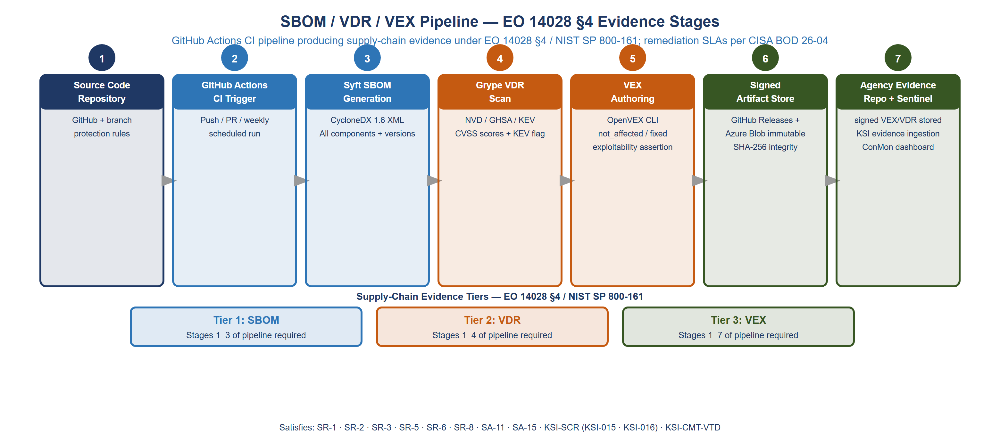
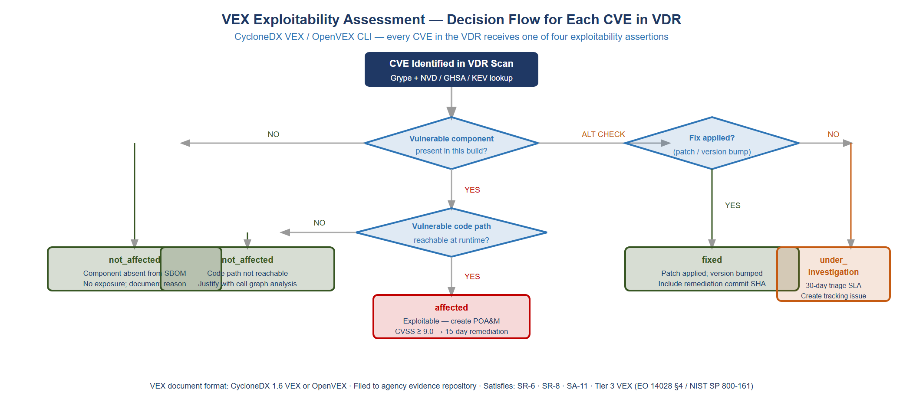
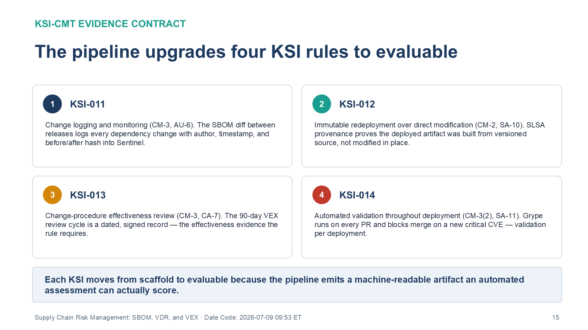
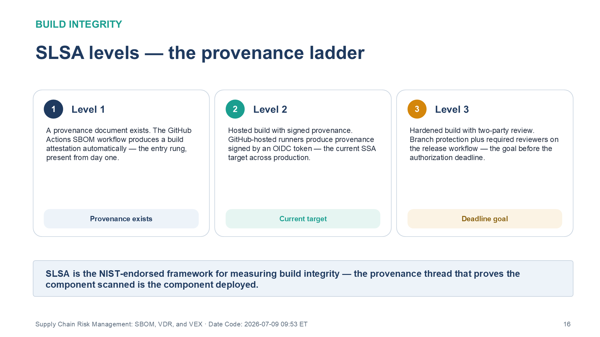

::: {.fouo-banner}
INTERNAL — NOT FOR PUBLIC DISTRIBUTION
:::

::: {.callout-warning}
## Draft Proposal — Subject to Review

This document is a **draft proposal** developed by the **CSI Team (Cloud Services Infrastructure)**. It is an attempt at a comprehensive SSA-wide technical roadmap and has not been reviewed or approved by the SSA CIO Office, the Office of Information Security (OIS), or organizational leadership. All recommendations, vendor selections, control mappings, and implementation timelines are subject to revision pending formal review by the SSA CIO Office and organizational components.

**Date Code:** 2026-07-08 16:07 ET
:::

## What This Document Addresses

Supply chain risk is the fastest-growing attack vector in the federal technology
landscape. Executive Order 14028 (May 2021) §4, NIST SP 800-161r1, OMB M-22-18
and M-23-16, and the NIST SP 800-53 SR control family together establish a
mandatory framework: agencies must be able to enumerate every software component
in their production systems, disclose vulnerability status for those components,
and demonstrate that exploitable vulnerabilities are tracked, triaged, and
remediated. CISA Binding Operational Directive 26-04 governs the last of these —
the risk-tiered *remediation* timelines — but does not itself mandate the SBOM or
disclosure artifacts; those trace to EO 14028 §4 and NIST SP 800-161.

Two independent things converge on **December 7, 2026**, and this document keeps
them distinct:

1. **The supply-chain evidence artifacts** (below), mandated by EO 14028 §4 /
   NIST SP 800-161 / the SR family and expressed in the OWASP CycloneDX formats.
2. **FedRAMP's Vulnerability Detection & Response (VDR) and Vulnerability
   Evaluation & Reporting (VER) rule sets** (Public Notice NTC-0014), which
   become mandatory for FedRAMP offerings on the same date BOD 26-04's
   remediation timelines take effect. Note the acronym collision: FedRAMP's
   "VDR/VER" are *rule sets*, distinct from the OWASP CycloneDX *Vulnerability
   Disclosure Report* this pipeline generates.

The supply-chain evidence framework requires:

1. A **Software Bill of Materials (SBOM)** for every system — a machine-readable
   inventory of every software component, version, and supplier in production
   (EO 14028 §4; CISA/NTIA minimum elements)
2. A **Vulnerability Disclosure Report (VDR)** — the OWASP CycloneDX artifact
   enumerating known vulnerabilities in SBOM components (NIST SP 800-161)
3. A **Vulnerability Exploitability eXchange (VEX)** document — a machine-readable
   assertion for each CVE: is this vulnerability exploitable in this product, in
   this deployment context?

This document establishes the technical architecture, pipeline, and governance
process for all three. It closes eight NIST SP 800-53 Rev 5 SR family controls
and provides the evidence contract that upgrades KSI-011 through KSI-014 from
scaffold to evaluable status.

---

# The Supply-Chain Evidence Framework and the December 7, 2026 Deadline

The supply-chain evidence artifacts are mandated by EO 14028 §4, NIST SP 800-161,
and the SR control family — **not** by BOD 26-04 — and are produced in three
CycloneDX evidence tiers:

| Tier | Artifact | Authority |
|------|----------|-----------|
| **Tier 1** | SBOM present for all production systems | EO 14028 §4; CISA/NTIA minimum elements |
| **Tier 2** | VDR present — CycloneDX Vulnerability Disclosure Report for all SBOM components | NIST SP 800-161; OWASP CycloneDX |
| **Tier 3** | VEX present — exploitability assertions for all CVEs in the VDR | NIST SP 800-161; OWASP CycloneDX |

: Supply-chain evidence tiers {.striped .hover}

Two instruments then carry a **December 7, 2026** deadline that this program
aligns to. **CISA BOD 26-04** sets risk-tiered *remediation* timelines — a
four-variable KEV/exposure/automatability/impact model with 3/14/60-day bands,
the SLAs the pipeline's blocking gate enforces — and does not mandate the
artifacts above. **FedRAMP NTC-0014** makes the FedRAMP VDR/VER rule sets
mandatory for FedRAMP offerings on the same date. The evidence pipeline serves
both: it produces the SBOM/VDR/VEX artifacts (EO 14028 §4) and enforces the
BOD 26-04 remediation SLAs against what they surface.

Under FedRAMP 20x Consolidated Rules, the same data serves as the machine-readable
evidence package for KSI-SCR (Supply Chain Risk), KSI-CMT-VTD (Validation
Throughout Deployment), and the SR control family assessment.

---

# Architecture: The SBOM/VDR/VEX Pipeline

## Pipeline Overview

```
┌─────────────────────────────────────────────────────────────────────┐
│  Source Code + Dependencies                                          │
│  (GitHub repos, container images, IaC artifacts)                    │
└───────────────────┬─────────────────────────────────────────────────┘
                    │
                    ▼
┌─────────────────────────────────────────────────────────────────────┐
│  SBOM Generation (GitHub Actions CI)                                 │
│  Tool: Syft (Anchore) — outputs CycloneDX 1.6 XML                  │
│  Triggered: every push to main, every release tag                   │
└───────────────────┬─────────────────────────────────────────────────┘
                    │
                    ▼
┌─────────────────────────────────────────────────────────────────────┐
│  Vulnerability Scan (VDR Generation)                                 │
│  Tool: Grype (Anchore) or Trivy — matches SBOM components to NVD   │
│  Input: CycloneDX SBOM  Output: CycloneDX VDR (CVE list + scores)  │
└───────────────────┬─────────────────────────────────────────────────┘
                    │
                    ▼
┌─────────────────────────────────────────────────────────────────────┐
│  VEX Authoring (Exploitability Assertion)                            │
│  Tool: OpenVEX CLI or CycloneDX VEX tooling                        │
│  Output: VEX document asserting not_affected / affected / fixed     │
│  per CVE per product component                                       │
└───────────────────┬─────────────────────────────────────────────────┘
                    │
                    ▼
┌─────────────────────────────────────────────────────────────────────┐
│  Artifact Storage (GitHub Releases + Azure Blob immutable tier)     │
│  Retention: 7 years (NARA standard)                                  │
│  Access: Signed URLs for agency evidence repo + downstream sharing   │
└───────────────────┬─────────────────────────────────────────────────┘
                    │
                    ▼
┌─────────────────────────────────────────────────────────────────────┐
│  Agency Evidence Repository + Sentinel KSI Dashboard Ingestion      │
│  Feedback loop: new CVEs trigger Defender VM alert (Part 11 chain)   │
└─────────────────────────────────────────────────────────────────────┘
```

{fig-alt="Seven-stage pipeline diagram for SBOM/VDR/VEX evidence. Stage 1: Source Code Repository (GitHub with branch protection). Stage 2: GitHub Actions CI Trigger (push, PR, or weekly scheduled). Stage 3: Syft SBOM Generation (CycloneDX 1.6 XML). Stage 4: Grype vulnerability scan producing the VDR (NVD/GHSA/KEV lookup, CVSS scores). Stage 5: VEX Authoring (OpenVEX CLI, exploitability assertions). Stage 6: Signed Artifact Store (S3 + KMS, SHA-256 integrity, immutable). Stage 7: Agency evidence repository + Sentinel (KSI evidence ingestion). Bottom shows three evidence tiers mandated by EO 14028 section 4 / NIST SP 800-161: Tier 1 SBOM (stages 1-3), Tier 2 VDR (stages 1-4), Tier 3 VEX (stages 1-7). Remediation SLAs for surfaced vulnerabilities follow CISA BOD 26-04. White background." width="100%"}

## SBOM Generation with Syft

Syft (Anchore) is a widely used SBOM generator for federal systems. It
produces CycloneDX 1.6 XML natively, a format consistent with CISA's VEX
minimum requirements and the 2025 CISA SBOM minimum elements.

### GitHub Actions Integration

```yaml
# .github/workflows/sbom.yml
name: SBOM + VDR Generation

on:
  push:
    branches: [main]
  release:
    types: [published]

jobs:
  sbom:
    runs-on: ubuntu-latest
    permissions:
      contents: write
      security-events: write

    steps:
      - uses: actions/checkout@v4

      - name: Generate SBOM (CycloneDX 1.6)
        uses: anchore/sbom-action@v0
        with:
          format: cyclonedx-xml
          output-file: sbom-${{ github.sha }}.xml

      - name: Scan SBOM for Vulnerabilities (VDR)
        uses: anchore/scan-action@v3
        with:
          sbom: sbom-${{ github.sha }}.xml
          output-format: cyclonedx-xml
          fail-build: false
        id: scan

      - name: Upload SBOM + VDR as release assets
        if: github.event_name == 'release'
        uses: softprops/action-gh-release@v2
        with:
          files: |
            sbom-${{ github.sha }}.xml
            ${{ steps.scan.outputs.sarif }}

      - name: Store to Azure Blob immutable tier
        env:
          AZURE_STORAGE_ACCOUNT: ${{ secrets.SBOM_STORAGE_ACCOUNT }}
          AZURE_STORAGE_SAS: ${{ secrets.SBOM_STORAGE_SAS }}
        run: |
          az storage blob upload \
            --account-name "$AZURE_STORAGE_ACCOUNT" \
            --sas-token "$AZURE_STORAGE_SAS" \
            --container-name sbom-archive \
            --name "$(date +%Y/%m/%d)/sbom-${{ github.sha }}.xml" \
            --file sbom-${{ github.sha }}.xml \
            --tier Archive
```

### SBOM Content Requirements (NTIA Minimum Elements)

The National Telecommunications and Information Administration (NTIA) defines
minimum SBOM elements. Syft satisfies all of them automatically:

| NTIA Element | CycloneDX Field | Syft Output |
|---|---|---|
| Supplier name | `supplier.name` | Extracted from package metadata |
| Component name | `component.name` | Package name |
| Version | `component.version` | Exact version string |
| Other unique identifiers | `component.purl` | Package URL (PURL) — unique per version |
| Dependency relationships | `dependencies` | Full dependency graph |
| SBOM author | `metadata.author` | Set from CI environment |
| Timestamp | `metadata.timestamp` | UTC build timestamp |

: NTIA Minimum SBOM Elements — Syft CycloneDX Coverage {.striped .hover}

---

# Vulnerability Disclosure Report (VDR)

The VDR is a machine-readable enumeration of all CVEs affecting components in
the SBOM. Grype (Anchore) takes the CycloneDX SBOM as input and produces a
CycloneDX VDR with NVD-sourced CVE data.

## VDR Fields

```xml
<!-- Example CycloneDX 1.6 VDR entry -->
<vulnerability>
  <id>CVE-2024-12345</id>
  <source>
    <name>NVD</name>
    <url>https://nvd.nist.gov/vuln/detail/CVE-2024-12345</url>
  </source>
  <ratings>
    <rating>
      <score>
        <base>9.8</base>
        <vector>CVSS:3.1/AV:N/AC:L/PR:N/UI:N/S:U/C:H/I:H/A:H</vector>
      </score>
      <severity>critical</severity>
      <method>CVSSv31</method>
    </rating>
  </ratings>
  <affects>
    <target>
      <ref>urn:cdx:package-purl/pkg:pypi/requests@2.28.0</ref>
    </target>
  </affects>
  <analysis>
    <state>exploitable</state>
    <detail>Network-accessible API endpoint uses this version</detail>
    <response>patch_available</response>
  </analysis>
</vulnerability>
```

## CISA KEV Integration

The VDR pipeline integrates with the CISA Known Exploited Vulnerabilities (KEV)
catalog. Any CVE in the SBOM that appears in the KEV catalog is automatically
escalated to P0 — 14-day remediation SLA per BOD 22-01.

```python
# scripts/kev_triage.py — CI step after VDR generation
import json, requests

KEV_URL = "https://www.cisa.gov/sites/default/files/feeds/known_exploited_vulnerabilities.json"

def triage_against_kev(vdr_path: str) -> list[dict]:
    kev = {e["cveID"] for e in requests.get(KEV_URL).json()["vulnerabilities"]}
    vdr = json.loads(open(vdr_path).read())
    escalations = []
    for vuln in vdr.get("vulnerabilities", []):
        cve_id = vuln.get("id", "")
        if cve_id in kev:
            escalations.append({
                "cve": cve_id,
                "severity": vuln.get("ratings", [{}])[0].get("severity", "unknown"),
                "kev_escalated": True,
                "sla_days": 14,
            })
    return escalations
```

---

# Vulnerability Exploitability eXchange (VEX)

VEX is the assertion layer — for every CVE in the VDR, the agency asserts
whether it is exploitable in the specific deployment context.

{fig-alt="Decision flow diagram for VEX exploitability assessment. Starting from CVE Identified in VDR Scan, first decision: Is the vulnerable component present in this build? If NO: not_affected (component absent). If YES: Is the vulnerable code path reachable at runtime? If NO: not_affected (code path not reachable, justify with call graph). If YES: affected (exploitable, create POA&M, CVSS 9+ requires 15-day remediation). Parallel check: Was a fix applied (patch/version bump)? If YES: fixed (include remediation commit SHA). If NO: under_investigation (30-day triage SLA). VEX format: CycloneDX 1.6 VEX or OpenVEX. Satisfies SR-6, SR-8, SA-11, and the Tier 3 VEX evidence requirement (EO 14028 section 4 / NIST SP 800-161)." width="100%"}

## VEX Status Values

| Status | Meaning | Example |
|--------|---------|---------|
| `not_affected` | Vulnerability exists in component but cannot be exploited | Library function not called; OS feature not enabled |
| `affected` | Vulnerability is exploitable — remediation underway | Production system uses the affected code path |
| `fixed` | Component has been patched to a non-vulnerable version | CVE remediated in current deployment |
| `under_investigation` | Exploitability being analyzed | New CVE, analysis in progress (max 7-day window) |

: VEX Status Values {.striped .hover}

## VEX Document Structure (OpenVEX)

```json
{
  "@context": "https://openvex.dev/ns/v0.2.0",
  "@id": "https://sbom.ssa.gov/vex/2026-Q3/vex-20260703.json",
  "author": "SSA Cloud Services Team",
  "timestamp": "2026-07-03T00:00:00Z",
  "version": 1,
  "statements": [
    {
      "vulnerability": {
        "@id": "https://nvd.nist.gov/vuln/detail/CVE-2024-12345",
        "name": "CVE-2024-12345"
      },
      "products": [
        {
          "@id": "pkg:pypi/requests@2.28.0",
          "subcomponents": []
        }
      ],
      "status": "not_affected",
      "justification": "protected_by_mitigating_control",
      "impact_statement": "SSA API gateway enforces input validation upstream of the affected code path. The vulnerable deserialization function is never called in production configuration.",
      "action_statement": "No action required. Controlled via API gateway policy.",
      "action_statement_timestamp": "2026-07-03T00:00:00Z"
    }
  ]
}
```

## VEX Authoring Process

VEX assertions require human judgment — automated tools can identify whether
a code path is reachable but cannot assert deployment-context exploitability.
The authoring process:

1. **Automated**: Grype + SBOM produce the VDR (all CVEs)
2. **Triage**: KEV check escalates P0 CVEs for immediate human review
3. **Analysis**: Security team reviews each CVE for deployment-context exploitability
4. **Assertion**: Security team authors VEX assertion with justification
5. **Sign + Publish**: VEX signed with GPG key; filed to the agency evidence repository and shared with downstream consumers per CISA VEX guidance
6. **Ingest**: Signed VEX stored in Azure Blob immutable tier; hash published to SBOM manifest

---

# Vendor Disclosure Matrix

SR-6 requires documented supplier assessments. The vendor disclosure matrix
maps each third-party component supplier to their security disclosure program
and FedRAMP authorization status.

| Supplier | Products in SBOM | FedRAMP Authorization | SBOM Program | VEX Accepted |
|---|---|---|---|---|
| Anchore | Syft, Grype | N/A (tooling) | Native CycloneDX | Yes |
| Microsoft | Defender VM, Sentinel, Purview, Key Vault | Yes — GCC Moderate | MSRC Security Update Guide | Yes (MSRC VEX) |
| Cisco | SD-WAN (IOS XE, vManage) | Yes — FedRAMP Moderate | Cisco PSIRT | Yes (OpenVEX) |
| Infoblox | NIOS Grid, BloxOne DDI | Yes — FR2017257053 | Infoblox Security Portal | Yes |
| Anchore/CISA | NVD data feed | N/A (data source) | NVD JSON feed | N/A |

: Vendor Disclosure Matrix — SR-6 Evidence {.striped .hover}

---

# NIST SP 800-53 Rev 5 Control Closure

## SR Family Controls

| NIST Control | Control Title | Gap Under Current State | Closed By | Evidence |
|---|---|---|---|---|
| **SR-1** | Supply Chain Risk Management Policy and Procedures | No documented SCRM policy; procurement decisions lack security evaluation criteria | SCRM Policy document + SBOM pipeline governance charter | Pipeline run log; policy document in SSP |
| **SR-2** | Supply Chain Risk Management Plan | No SCRM plan; supplier risk not assessed systematically | SBOM pipeline + vendor disclosure matrix + KEV integration | SBOM manifest; vendor matrix; KEV triage log |
| **SR-3** | Supply Chain Controls and Processes | Software acquisition lacks SBOM requirements; no contractual SBOM delivery clause | Acquisition policy update requiring CycloneDX SBOM delivery from suppliers; SBOM ingest pipeline | Acquisition policy; SBOM pipeline job log |
| **SR-5** | Acquisition Strategies, Tools, and Methods | No software composition analysis in procurement evaluation | SCA tooling (Syft + Grype) integrated into CI/CD before production promotion | Pipeline artifact; pre-approval gate log |
| **SR-6** | Supplier Assessments and Reviews | No structured supplier security review; FedRAMP authorization status not tracked per supplier | Vendor disclosure matrix; annual supplier assessment schedule; MSRC/PSIRT feed subscriptions | Vendor matrix; assessment calendar; feed subscription records |
| **SR-8** | Notification Agreements | No documented process for receiving and responding to supplier vulnerability notifications | MSRC Security Update Guide subscription; Cisco PSIRT subscription; Infoblox security portal registration | Notification feed subscriptions; incident response playbook for supplier CVEs |
| **SR-10** | Inspection of Systems or Components | No component integrity verification at build or deployment | Syft SBOM hash verification at container pull; GPG-signed SBOM manifest; supply chain attestation in SLSA Level 2 | SLSA provenance records; container image hash verification log |
| **SR-11** | Component Authenticity | No cryptographic verification of component authenticity; no process for detecting counterfeit components | GPG-signed SBOMs; SLSA provenance attestation; sigstore (Cosign) for container image signing | Cosign signature verification log; SLSA provenance; SBOM manifest with component hashes |

: Vol IV Book 02 — NIST SP 800-53 Rev 5 Control Closure: SR Family {.striped .hover}

**Controls closed: 8** (SR-1, SR-2, SR-3, SR-5, SR-6, SR-8, SR-10, SR-11)

> **Closure Necessity — SR family.** These eight controls close through
> governance artifacts — the SBOM manifest, the VDR, signed VEX assertions, and
> the acquisition language that compels them from suppliers — not through the
> network substrate. No IPAM record, SD-WAN overlay, or TIC 3.0 enforcement
> point produces a software bill of materials or a supplier attestation. This
> series claims a technology as required only where control text, physics, or
> protocol behavior makes it the sole closure path; stating plainly that supply
> chain risk management is not such a case is what keeps those necessity claims
> credible elsewhere.

## KSI-CMT Evidence Contract (KSI-011–014)

The SBOM/VDR/VEX pipeline provides the VER (Vulnerability Exploitability
Report) evidence contract required to upgrade KSI-CMT rules from scaffold
to evaluable. The pipeline produces machine-readable artifacts that satisfy
the KSI-CMT sub-control requirements:

| KSI Rule | KSI Title | NIST Controls | Evidence from Vol IV Book 02 Pipeline |
|---|---|---|---|
| **KSI-011** | Change Logging and Monitoring | CM-3, AU-6 | SBOM diff between releases: every dependency change is logged as a structured artifact with author, timestamp, and before/after hash. Ingested by Sentinel (Vol III Book 06) as a structured change event. |
| **KSI-012** | Immutable Redeployment over Direct Modification | CM-2, SA-10 | SLSA provenance attestation: every production artifact is built from a versioned source, not modified in-place. The SBOM manifest + SLSA Level 2 record proves the deployed artifact matches the build artifact. |
| **KSI-013** | Change-Procedure Effectiveness Review | CM-3, CA-7 | VEX quarterly review cycle: VEX assertions must be reviewed every 90 days or upon new CVE disclosure. Review completion is a dated, signed record — the change-procedure effectiveness evidence. |
| **KSI-014** | Automated Validation Throughout Deployment | CM-3(2), SA-11 | Grype scan runs on every PR and blocks merge if a new critical CVE appears in the SBOM. Scan result = machine-readable validation artifact per deployment. |

: KSI-CMT Evidence Contract — Vol IV Book 02 Provides VER Evidence for KSI-011–014 {.striped .hover}

{#fig-scrm04 fig-alt="Four-quadrant card grid titled 'The pipeline upgrades four KSI rules to evaluable' under the KSI-CMT Evidence Contract heading. Card 1, KSI-011: Change logging and monitoring (CM-3, AU-6) — the SBOM diff between releases logs every dependency change with author, timestamp, and before/after hash into Sentinel. Card 2, KSI-012: Immutable redeployment over direct modification (CM-2, SA-10) — SLSA provenance proves the deployed artifact was built from versioned source, not modified in place. Card 3, KSI-013: Change-procedure effectiveness review (CM-3, CA-7) — the 90-day VEX review cycle is a dated, signed record, the effectiveness evidence the rule requires. Card 4, KSI-014: Automated validation throughout deployment (CM-3(2), SA-11) — Grype runs on every PR and blocks merge on a new critical CVE, validation per deployment. A summary banner states each KSI moves from scaffold to evaluable because the pipeline emits a machine-readable artifact an automated assessment can actually score. White background. Source: Vol IV Book 02 Supply Chain Risk Management briefing deck, Date Code 2026-07-09 17:00 ET." width="100%"}

---

# SLSA Supply Chain Levels for Software Artifacts

SLSA (Supply Chain Levels for Software Artifacts) is the NIST-endorsed framework
for measuring build integrity. The pipeline targets **SLSA Level 2** for initial
compliance, progressing to Level 3 before the authorization deadline.

| SLSA Level | Requirements | SSA Implementation |
|---|---|---|
| **Level 1** | Provenance document exists | GitHub Actions SBOM workflow produces attestation automatically |
| **Level 2** | Hosted build, signed provenance | GitHub Actions runs on GitHub-hosted runners; provenance signed by OIDC token |
| **Level 3** | Hardened build, two-party review | Level 3 target — requires branch protection + required reviewers for release workflow |

: SLSA Levels and SSA Implementation Path {.striped .hover}

{#fig-scrm03 fig-alt="Three-column comparison grid titled 'SLSA levels — the provenance ladder' under a Build Integrity heading. Column 1, Level 1: a provenance document exists — the GitHub Actions SBOM workflow produces a build attestation automatically, the entry rung present from day one, tagged 'Provenance exists.' Column 2, Level 2: hosted build with signed provenance — GitHub-hosted runners produce provenance signed by an OIDC token, tagged 'Current target' as the SSA production posture. Column 3, Level 3: hardened build with two-party review — branch protection plus required reviewers on the release workflow, tagged 'Deadline goal' before the authorization deadline. A summary banner notes SLSA is the NIST-endorsed framework for measuring build integrity — the provenance thread that proves the component scanned is the component deployed. White background. Source: Vol IV Book 02 Supply Chain Risk Management briefing deck, Date Code 2026-07-09 17:00 ET." width="100%"}

---

# Continuous Monitoring Integration

## Sentinel Dashboard (KSI-MLA Integration)

The SBOM/VDR/VEX pipeline integrates with Microsoft Sentinel (Vol III Book 06) via a
custom data connector that ingests:

- Daily SBOM diff (new/removed/updated components)
- VDR CVE count by severity (critical/high/medium/low)
- VEX assertion status distribution (not_affected / affected / fixed / under_investigation)
- KEV hit count (number of SBOM components with active KEV entries)
- Days-since-last-VEX-review per product

KQL analytic rule for KEV breach:

```kql
SBOMVulnerabilities_CL
| where TimeGenerated > ago(1d)
| where kev_listed_b == true
| where vex_status_s in ("affected", "under_investigation")
| where days_since_disclosure_d > 14
| project CVE = cve_id_s, Component = component_name_s,
          CVSS = cvss_score_d, KEVDate = kev_date_added_t,
          DaysOverdue = days_since_disclosure_d - 14
| order by DaysOverdue desc
```

## Evidence Manifest

Every SBOM generation run produces a signed manifest:

```json
{
  "manifest_version": "1.0",
  "generated_at": "2026-07-03T00:00:00Z",
  "commit_sha": "abc123...",
  "sbom_hash_sha256": "e3b0c44298fc1c149...",
  "vdr_hash_sha256": "a87ff679a2f3e71d9...",
  "vex_hash_sha256": "1679091c5a880faf6...",
  "component_count": 312,
  "cve_count_critical": 0,
  "cve_count_high": 3,
  "kev_hits": 0,
  "slsa_level": 2,
  "slsa_provenance_url": "https://github.com/WhalerMike/uiao/attestations/...",
  "storage_uri": "https://sbomarchive.blob.core.windows.net/sbom-archive/2026/07/03/sbom-abc123.xml"
}
```

---

# Implementation Checklist

| Phase | Action | Owner | Target |
|---|---|---|---|
| **Immediate** | Install Syft and Grype in GitHub Actions CI | DevOps | Jul 2026 |
| **Immediate** | Generate initial SBOM for all production repos | DevOps | Jul 2026 |
| **Immediate** | Register with MSRC, Cisco PSIRT, Infoblox security portals | ISSO | Jul 2026 |
| **Phase 1** | Author initial VEX for all critical/high CVEs | Security Team | Aug 2026 |
| **Phase 1** | Publish SBOM + VDR to the agency evidence repository (test run) | ISSO | Aug 2026 |
| **Phase 1** | Update acquisition policy to require SBOM from suppliers | Contracting | Sep 2026 |
| **Phase 2** | Achieve SLSA Level 2 for all production release workflows | DevOps | Oct 2026 |
| **Phase 3** | Complete VEX quarterly review cycle | Security Team | Nov 2026 |
| **Phase 4** | Final FedRAMP VDR/VER submission (NTC-0014); BOD 26-04 remediation SLAs in force | ISSO | Dec 7, 2026 |

: Vol IV Book 02 — Implementation Checklist {.striped .hover}

---

# Technology Stack Summary

| Component | Tool | Format | Standard |
|---|---|---|---|
| SBOM Generation | Syft (Anchore) | CycloneDX 1.6 XML | NTIA minimum elements; CISA preferred |
| Vulnerability Scan | Grype (Anchore) | CycloneDX VDR | NVD CVE data; CVSS 3.1 |
| VEX Authoring | OpenVEX CLI | OpenVEX JSON | CISA VEX format; submitted via VEX Portal |
| Container Signing | Cosign (sigstore) | OCI attestation | SLSA provenance |
| CI Integration | GitHub Actions | YAML workflow | SLSA Level 2 build |
| Archive Storage | Azure Blob immutable tier | Archive tier | 7-year NARA retention |
| Monitoring | Microsoft Sentinel (Vol III Book 06) | KQL analytics | KSI-MLA evidence chain |
| KEV Integration | CISA KEV JSON feed | JSON | BOD 22-01 14-day SLA |

: Vol IV Book 02 — Technology Stack {.striped .hover}

---

# References

| Document | Relevance |
|---|---|
| EO 14028 — Improving the Nation's Cybersecurity (May 2021) | Mandates SBOM for software sold to the federal government |
| NIST SP 800-161r1 — Supply Chain Risk Management | Normative reference for SR family controls |
| CISA BOD 26-04 (June 2026) | Risk-tiered remediation timelines (3/14/60-day); supersedes BOD 19-02/22-01. Does not mandate SBOM/VDR/VEX artifacts |
| FedRAMP NTC-0014 (June 2026) | FedRAMP VDR (Vulnerability Detection & Response) / VER (Vulnerability Evaluation & Reporting) rule sets mandatory Dec 7, 2026 |
| CISA/NTIA Minimum Elements for an SBOM (July 2021; CISA 2025 update) | NTIA-aligned minimum content requirements |
| CycloneDX 1.6 Specification | SBOM, VDR, and VEX document format |
| OpenVEX v0.2.0 | VEX statement format and submission protocol |
| SLSA v1.0 Framework | Build integrity levels and provenance requirements |
| NIST SP 800-53 Rev 5 — SR Family | SR-1 through SR-11 control requirements |
| FedRAMP 20x Consolidated Rules (Jun 25, 2026) | KSI-SCR and KSI-CMT requirements |
| [Vol III Book 02 — Vulnerability Management](Vol_III_Book_02_FedAAN_Vulnerability_Management.qmd) | Defender VM + KEV integration; extends to SBOM-sourced CVE triage |
| [Vol III Book 06 — SIEM / XDR / Detection Engineering](Vol_III_Book_06_FedAAN_SIEM_XDR_Detection.qmd) | Sentinel ingestion of SBOM/VDR telemetry; KQL analytic rules |

: Reference Documents {.striped .hover}
