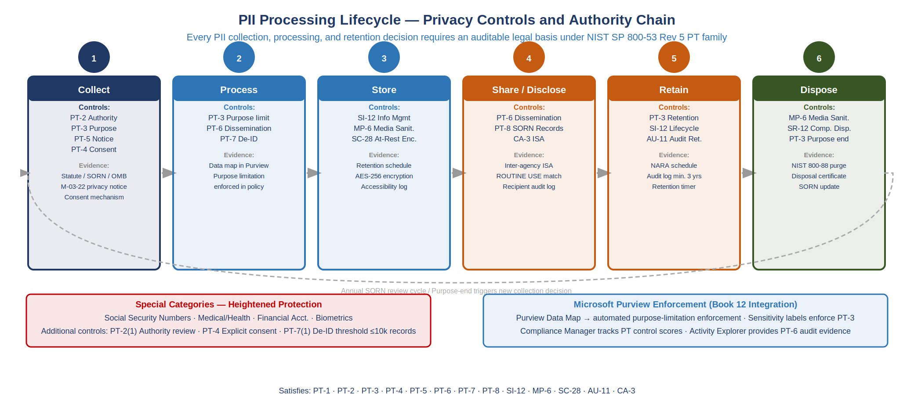
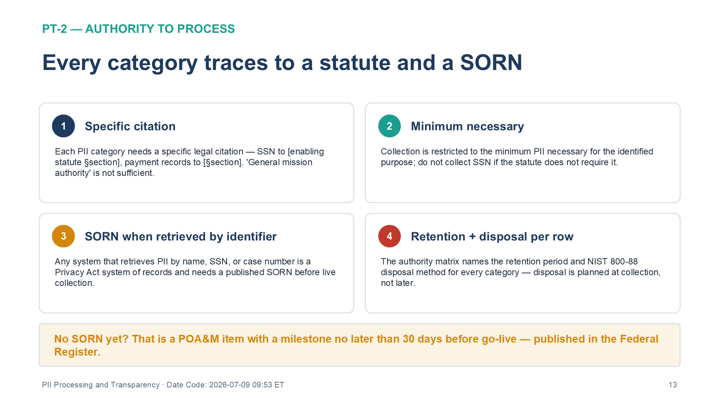
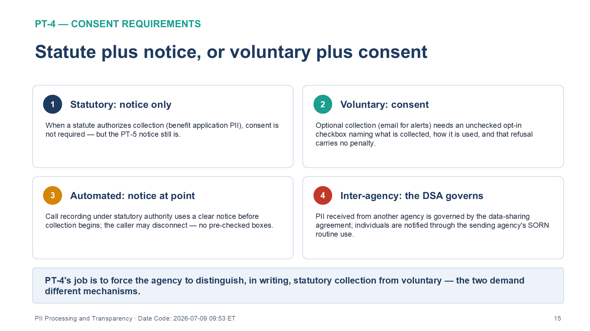
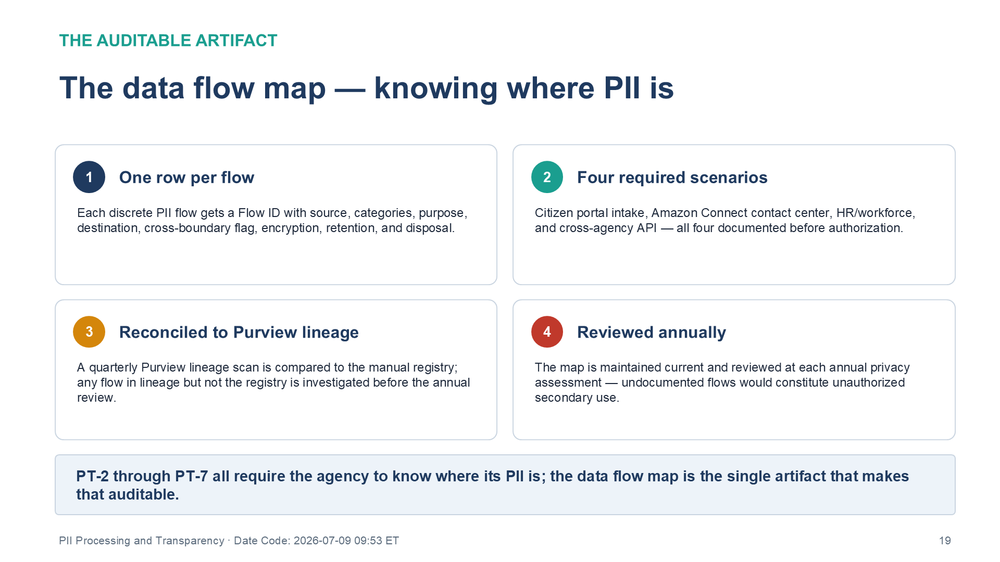

::: {.fouo-banner}
INTERNAL — NOT FOR PUBLIC DISTRIBUTION
:::

::: {.aan-warning}
## Draft Proposal — Subject to Review

This document is a **draft proposal** developed by the **CSI Team (Cloud Services Infrastructure)**. It is an attempt at a comprehensive SSA-wide technical roadmap and has not been reviewed or approved by the SSA CIO Office, the Office of Information Security (OIS), or organizational leadership. All recommendations, vendor selections, control mappings, and implementation timelines are subject to revision pending formal review by the SSA CIO Office and organizational components.

**Date Code:** 2026-07-08 16:07 ET
:::

## What This Document Addresses

Federal systems that process Personally Identifiable Information (PII) carry
obligations beyond the security control baseline. The NIST SP 800-53 Rev 5
Personally Identifiable Information Processing and Transparency (PT) control
family codifies those obligations as auditable, ATO-ready
requirements: an agency must be able to demonstrate *why* it collects PII,
*what* authority permits collection, *how* individuals are notified, and *where*
special categories receive heightened protection. Without this documentation,
a FedRAMP Moderate system that touches citizen data cannot complete a privacy-
sensitive ATO boundary without a significant POA&M gap.

This document provides:

1. **Privacy Program Plan Template (PT-1)** — organizational privacy governance
   structure with SAOP accountability, authority citations, and program cadence
2. **Authority to Process Template (PT-2)** — legal basis matrix linking each
   PII category to its authorizing statute, SORN reference, and retention period
3. **Purpose Specification Template (PT-3)** — purpose-limitation framework with
   Purview Data Map attribute mapping for automated enforcement
4. **Consent Requirements Template (PT-4)** — consent mechanism matrix covering
   web forms, automated collection, and inter-agency data sharing
5. **Privacy Notice Template (PT-5)** — OMB M-03-22 compliant model notice with
   machine-accessible URL requirement for FedRAMP 20x SSPs
6. **Special Categories Framework (PT-7)** — heightened protection requirements
   for SSN, PHI, biometrics, and other sensitive PII categories
7. **PII Data Flow Map Template** — end-to-end flow documentation for citizen
   portal, contact center, HR, and cross-agency sharing scenarios
8. **FedRAMP 20x KSI Alignment** — compliance milestones and control closure
   traceability across the PT family

Together these artifacts close six NIST SP 800-53 Rev 5 PT family controls
(PT-1, PT-2, PT-3, PT-4, PT-5, PT-7), satisfy Privacy Act 1974 and E-Gov Act
2002 documentation requirements, and provide the Privacy Impact Assessment (PIA)
scaffolding required at system boundary establishment for all SSA GCC Moderate
systems that process PII.

---

# Purpose and Scope

## Document Purpose

This document closes the Personally Identifiable Information Processing and
Transparency (PT) control family gap for
FedRAMP 20x GCC Moderate systems operated by or on behalf of the Social
Security Administration. The PT control family is the documentation layer that
converts statutory privacy obligations into auditable program artifacts.

**Relationship to Prior Parts in This Series:**

- **Vol III Book 05 (Purview + Key Vault)** — established the technical data
  classification, sensitivity labeling, and encryption controls that enforce
  the policies defined in this document. PT-3 purpose fields are mapped to
  Purview Data Map custom attributes; PT-7 special categories are enforced
  through auto-labeling rules defined in Vol III Book 05.
- **Vol IV Book 03 (Program Management Governance)** — established the organizational
  governance structure within which this Privacy Program Plan operates. PT-1
  is the privacy complement to the PM-1 Information Security Program Plan (ISPP);
  they share the same SAOP/CISO leadership cadence and the same AO approval chain.
  The RACI defined in Vol IV Book 03 §3 assigns Privacy Officer accountability across
  all PT controls.

{fig-alt="Horizontal lifecycle diagram with six stages: 1 Collect (PT-2 Authority, PT-3 Purpose, PT-5 Notice, PT-4 Consent — statute/SORN/OMB M-03-22 notice, consent mechanism); 2 Process (PT-3 Purpose limit, PT-7 De-ID — Purview data map enforcement); 3 Store (SI-12, MP-6, SC-28 at-rest encryption — retention schedule, AES-256, accessibility log); 4 Share/Disclose (PT-6 SORN, PT-8 Computer Matching, CA-3 ISA — inter-agency ISA, ROUTINE USE match, recipient audit log); 5 Retain (PT-3 retention, SI-12, AU-11 — NARA schedule, audit log min 3 years); 6 Dispose (MP-6, SR-12, PT-3 purpose end — NIST 800-88 purge, disposal certificate). Return arrow shows annual SORN review cycle. Bottom left: Special Categories (SSN, medical, financial, biometric) requiring heightened protection. Bottom right: Microsoft Purview integration for automated purpose-limitation enforcement." width="100%"}

## Scope

This document applies to any SSA GCC Moderate system that processes PII, including
but not limited to:

- **Citizen portals** — my Social Security, online benefit applications, appeals
  submissions
- **Contact center platforms** — Amazon Connect deployments handling citizen
  calls and case management (CRM integration)
- **HR and workforce systems** — employee records, payroll, benefits
  administration within the SSA Azure GCC Moderate boundary
- **API integrations** — cross-agency data sharing with HHS, CMS, IRS, and
  state agencies under data-sharing agreements

Systems that do not process PII (infrastructure-only, analytics on de-identified
data) are out of scope for PT controls but remain subject to all other control
families.

---

# Privacy Program Plan (PT-1)

## Control Requirement

PT-1 requires the organization to develop, document, disseminate, and review a
privacy policy and procedures that address the purpose, scope, roles,
responsibilities, management commitment, coordination, and compliance for
the privacy program.

**Linkage:** PT-1 is the privacy parallel to PM-1 (ISPP, Vol IV Book 03 §2). The
Privacy Program Plan must be co-signed by both the SAISO/CISO and the Senior
Agency Official for Privacy (SAOP), and reviewed on the same annual cadence
as the ISPP. Cross-reference Vol IV Book 03 §3 RACI for the Privacy Officer role.

## Privacy Program Plan Template

**Section 1 — Purpose and Scope**

> [FILLABLE] This Privacy Program Plan (PPP) establishes the privacy governance
> framework for [SYSTEM NAME], a GCC Moderate impact system operated by the
> Social Security Administration under FedRAMP 20x Authorization. This plan
> implements the privacy requirements of the Privacy Act of 1974 (5 U.S.C.
> §552a), the E-Government Act of 2002 (Pub. L. 107-347, §208; 44 U.S.C. §3501 note), OMB Circular A-130
> (Appendix II), and OMB Memorandum M-03-22.
>
> **Authorization Boundary:** [Reference boundary diagram. Must match the
> data flow map in §8 and the SSP boundary description.]
>
> **Effective Date:** [DATE]  **Review Cycle:** Annual / After major system change
>
> **Document Owner:** [NAME, TITLE] — Senior Agency Official for Privacy (SAOP)
>
> **Co-Owner:** [NAME, TITLE] — SAISO/CISO
>
> **Approver:** [NAME, TITLE] — Authorizing Official (AO)

**Section 2 — Legal and Regulatory Authority**

- Privacy Act of 1974, 5 U.S.C. §552a
- E-Government Act of 2002, Pub. L. 107-347, §208 (44 U.S.C. §3501 note)
- Federal Information Security Modernization Act (FISMA), 44 U.S.C. §3551 et seq.
- OMB Memorandum M-03-22, OMB Guidance for Implementing the Privacy Provisions
  of the E-Government Act of 2002
- OMB Circular A-130, Appendix II, Responsibilities for Managing PII
- OMB Memorandum M-17-12, Preparing for and Responding to a Breach of PII
- NIST SP 800-53 Rev 5, Privacy Control Family (PT)
- NIST SP 800-122, Guide to Protecting Confidentiality of PII
- FedRAMP 20x Authorization Framework (GSA, 2026)

**Section 3 — Roles and Responsibilities**

| Role | Responsibility | PT Control Ownership |
|------|---------------|----------------------|
| **SAOP** | Chairs Privacy Council; approves PIAs and SORNs; annual program review | PT-1, PT-2, PT-5 |
| **System Privacy Officer (SPO)** | System-level privacy representative; maintains PT artifacts | PT-3, PT-4, PT-7 |
| **ISSO** | Integrates privacy controls into security assessment; POA&M | PT-1, PT-7 |
| **Legal Counsel** | Reviews SORN language; validates legal authority citations | PT-2 |
| **DevSecOps Lead** | Implements Purview labels; data flow automation | PT-3, PT-7 |
| **Communications / Web** | Publishes privacy notices; maintains notice URLs | PT-5 |

**Section 4 — Program Oversight Cadence**

| Activity | Owner | Cadence | Artifact Produced |
|----------|-------|---------|-------------------|
| Privacy Program Plan review | SAOP | Annual | Updated PPP with AO signature |
| Privacy Impact Assessment (PIA) | SPO | At boundary establishment; after major change | PIA Report |
| SORN review and update | Legal + SAOP | Every 3 years or upon significant change | SORN Amendment (Federal Register) |
| Privacy control assessment | ISSO + independent assessor (3PAO if engaged) | Annual (aligned with security assessment) | Privacy Assessment Report |
| Purpose limitation review (PT-3) | SPO | Annual | PT-3 Checklist (§4) |
| Breach response exercise | SAOP + ISSO | Annual | Tabletop AAR |
| Data flow map update (§8) | DevSecOps + SPO | After each major data flow change | Updated data flow map |

> [FILLABLE] Confirm cadence dates align with the FedRAMP 20x Continuous
> Monitoring plan. The annual privacy assessment must be completed within
> 365 days of the prior assessment. Document the next scheduled date for each
> activity in the column above.

---

# Authority to Process PII (PT-2)

## Control Requirement

PT-2 requires the organization to identify the legal authority that permits the
collection, use, maintenance, and sharing of PII and restricts the collection
of PII to the minimum necessary for the identified purpose.

{#fig-pii02 fig-alt="Four-quadrant card grid titled 'Every category traces to a statute and a SORN' under a PT-2 Authority to Process heading. Card 1, Specific citation: each PII category needs a specific legal citation, such as SSN to Social Security Act section 205(c) and benefit records to section 1106, and general mission authority is not sufficient. Card 2, Minimum necessary: collection is restricted to the minimum PII necessary for the identified purpose, and SSN is not collected if the statute does not require it. Card 3, SORN when retrieved by identifier: any system that retrieves PII by name, SSN, or case number is a Privacy Act system of records and needs a published SORN before live collection. Card 4, Retention plus disposal per row: the authority matrix names the retention period and NIST 800-88 disposal method for every category, so disposal is planned at collection, not later. A caution banner states that no SORN yet is a POA&M item with a milestone no later than 30 days before go-live, published in the Federal Register. White background. Source: Vol IV Book 04 PII Processing and Transparency briefing deck, Date Code 2026-07-09 17:00 ET." width="100%"}

## Legal Authority Matrix

> [FILLABLE] Complete the following matrix for every PII category the system
> collects. Each row requires a specific legal citation — "general mission
> authority" is not sufficient. Consult SSA Legal Counsel for each entry.

| PII Category | Legal Basis | Statutory / Regulatory Citation | Retention Period | Disposal Method |
|-------------|-------------|--------------------------------|-----------------|-----------------|
| Social Security Number (SSN) | Statutory | Social Security Act §205(c)(2)(C)(i), 42 U.S.C. §405 | [N years per records schedule] | NIST 800-88 purge |
| Name and date of birth | Statutory | Social Security Act §202, 42 U.S.C. §402 | [N years per records schedule] | NIST 800-88 purge |
| Benefit payment records | Statutory | Social Security Act §1106, 42 U.S.C. §1306 | 7 years post-case closure | NIST 800-88 purge |
| Medical / disability records | Statutory | Social Security Act §223, 42 U.S.C. §423 | 5 years post-determination | Secure destruction + purge |
| Contact information (address, phone, email) | Statutory / Voluntary | Social Security Act §702, voluntary collection per E-Gov Act §208 | Duration of case + [N years] | NIST 800-88 purge |
| Financial account data (direct deposit) | Statutory | Social Security Act §205(j), 42 U.S.C. §405(j) | 7 years | NIST 800-88 purge |
| [ADDITIONAL PII CATEGORY] | [BASIS] | [CITATION] | [RETENTION] | [DISPOSAL] |

## SORN Requirements (Privacy Act Systems)

Any system that retrieves PII by a personal identifier (name, SSN, case number)
is a **system of records** under the Privacy Act and requires a published System
of Records Notice (SORN).

**SORN Publication Requirements:**

1. Draft SORN reviewed by SAOP and Legal Counsel
2. SAOP submits to OMB and Congress for the 40-day advance review (OMB Circular A-108); the Federal Register notice carries a 30-day routine-use comment period (5 U.S.C. §552a(e)(11)), with SORN publication itself required under §552a(e)(4)
3. As agency practice, published in the Federal Register at least **30 days before** live PII collection begins
4. SORN updated whenever the system's purpose, categories of records, or routine
   uses change materially

> [FILLABLE] Record the SORN reference number and Federal Register citation for
> each system of records within the authorization boundary. Reference the SSA
> SORN database at ssa.gov/privacy/sorns.html. If a SORN does not yet exist,
> add a POA&M item with a milestone date no later than 30 days before go-live.

| System of Records Name | SORN Reference | Federal Register Citation | Date Published | Next Review |
|------------------------|---------------|--------------------------|---------------|-------------|
| [SYSTEM NAME] | SSA/[NUMBER] | [Vol. FR Page, Date] | [DATE] | [DATE] |

**OMB Circular A-130 Cross-Reference:** Section 5 of A-130 requires agencies to
maintain an accurate accounting of disclosures and to ensure SORNs reflect all
routine uses. The SPO must review SORNs against actual data flows using the
data flow map in §8 at each annual privacy review.

---

# Purpose Specification (PT-3)

## Control Requirement

PT-3 requires the organization to identify and document the specific purpose(s)
for which PII is collected and used. Collection of PII must be limited to the
identified purpose(s), and any use of PII for secondary purposes must be
explicitly authorized.

## Purpose Specification Matrix

> [FILLABLE] Complete the following table for each PII field collected by the
> system. "Secondary Use Permitted" means a use beyond the original collection
> purpose that is authorized by the legal authority in §3 or a Privacy Act
> routine use. Uses not listed here require a new PIA and, for Privacy Act
> systems, a SORN amendment.

| PII Field | Collection Purpose | Secondary Use Permitted? | Secondary Use Authorization | Minimization Action |
|-----------|-------------------|-------------------------|----------------------------|---------------------|
| SSN | Unique beneficiary identification | No — primary identifier only | N/A | Mask to last 4 digits in UI; full SSN stored encrypted only |
| Name | Beneficiary identification and correspondence | Yes — cross-agency identity verification | Data-sharing agreement (DSA) with [AGENCY] per Privacy Act routine use [N] | Truncate to first name in non-case contexts |
| Date of Birth | Age eligibility verification | Yes — fraud detection analytics | Same legal authority; de-identified for analytics | Do not expose in API responses unless required |
| Medical records | Disability determination | No — determination purpose only | N/A | Restrict access to adjudicators; Purview PHI label |
| Email address | Electronic notification delivery | Yes — optional account alerts | Voluntary consent at enrollment | Allow user withdrawal at any time |
| Financial account (direct deposit) | Payment disbursement | No — payment only | N/A | Display masked; never log in plain text |
| [PII FIELD] | [PURPOSE] | [YES/NO] | [AUTHORIZATION] | [ACTION] |

## Purview Data Map Integration

PT-3 purpose fields map to Microsoft Purview Data Map custom attributes as
follows. This integration (established in Vol III Book 05) enables automated enforcement
of purpose limitations at the data asset level:

| PT-3 Field | Purview Custom Attribute | Enforcement Mechanism |
|-----------|--------------------------|----------------------|
| Collection Purpose | `pii_collection_purpose` | Data asset tag; DLP policy condition |
| Secondary Use Permitted | `pii_secondary_use_authorized` | Boolean; triggers alert if data crosses boundary without flag |
| Minimization Action | `pii_minimization_policy` | Linked to Information Protection label |
| Legal Authority | `pii_legal_authority` | Audit trail attribute; populated from §3 matrix |

## Purpose Limitation Review Checklist (Annual — PT-3)

> [FILLABLE] Complete this checklist at each annual privacy review. SAOP sign-
> off is required before the checklist is filed in the ATO package.

- [ ] All PII fields in the system data dictionary appear in the PT-3 matrix above
- [ ] No PII field is used for a purpose not listed in the matrix
- [ ] Secondary use authorizations have been verified against current SORNs and DSAs
- [ ] Purview custom attributes match the current PT-3 matrix (verified by DevSecOps)
- [ ] Any new PII fields added since last review have been assessed for purpose and minimization
- [ ] Data flow map (§8) reviewed for undocumented flows that would constitute unauthorized secondary use
- [ ] SAOP has reviewed and signed this checklist: [NAME] / [DATE]

---

# Consent Requirements (PT-4)

## Control Requirement

PT-4 requires the organization to implement consent mechanisms that provide
individuals with the opportunity to consent to the collection and use of their
PII. For federal systems, many collections are authorized by statute rather
than consent; PT-4 requires the agency to explicitly distinguish the two cases.

{#fig-pii03 fig-alt="Four-quadrant card grid titled 'Statute plus notice, or voluntary plus consent' under a PT-4 Consent Requirements heading. Card 1, Statutory notice only: when a statute authorizes collection such as benefit application PII, consent is not required but the PT-5 notice still is. Card 2, Voluntary consent: optional collection such as email for alerts needs an unchecked opt-in checkbox naming what is collected, how it is used, and that refusal carries no penalty. Card 3, Automated notice at point: call recording under statutory authority uses a clear notice before collection begins and the caller may disconnect, with no pre-checked boxes. Card 4, Inter-agency the DSA governs: PII received from another agency is governed by the data-sharing agreement, and individuals are notified through the sending agency's SORN routine use. A summary banner states PT-4's job is to force the agency to distinguish, in writing, statutory collection from voluntary, because the two demand different mechanisms. White background. Source: Vol IV Book 04 PII Processing and Transparency briefing deck, Date Code 2026-07-09 17:00 ET." width="100%"}

## Federal Consent vs. Statutory Authority

**Key Principle:** Federal agencies generally do not rely on consent as the
legal basis for PII collection. When a statute authorizes collection, consent
is not required — but notice is still required (PT-5). Consent applies when:

1. Collection is *voluntary* (e.g., email address for optional notifications)
2. A secondary use requires individual authorization beyond the original statutory basis
3. A web feature involves tracking technologies (cookies, analytics) subject to
   OMB M-10-22 and the E-Gov Act

## Consent Mechanism Matrix

> [FILLABLE] For each data source and interaction type, document whether consent
> is required, the mechanism used, and the withdrawal process. Column "Purview
> Label" references the sensitivity label applied in Vol III Book 05.

| Data Source | Interaction Type | Statutory Authority? | Consent Required? | Consent Mechanism | Withdrawal Process | Purview Label |
|------------|-----------------|---------------------|------------------|-------------------|-------------------|---------------|
| Citizen portal — online application | Statutory PII collection | Yes — Social Security Act | No — notice only (PT-5) | Privacy notice displayed at form entry | N/A | `Confidential-PII` |
| Citizen portal — email notifications | Voluntary enrollment | Yes (application); No (email) | Yes — voluntary email | Opt-in checkbox at account creation; plain-language description | User account settings; immediate effect | `General-PII` |
| Contact center (Amazon Connect) — call recording | Voluntary continuation of call | No — consent required for recording | Yes | Automated voice notice at call start; caller may disconnect | Caller disconnects; no further recording | `Confidential-PII` |
| Analytics cookies on citizen portal | Tracking technology | No statutory basis | Yes — OMB M-10-22 | Cookie consent banner on first visit; DoNotTrack respected | Cookie preference center; opt-out | `General` |
| Cross-agency data sharing (API inbound) | Data received from [AGENCY] | Yes — DSA + Privacy Act routine use | No — DSA governs | Data-sharing agreement on file; individuals notified via sending agency | N/A — governed by originating SORN | `Confidential-PII` |
| HR system — employee records | Employment relationship | Yes — 5 U.S.C. §552a, OPM schedules | No — statutory | SF-2809/2810 enrollment forms include Privacy Act statement | N/A — statutory | `Restricted-HR` |
| [DATA SOURCE] | [INTERACTION] | [YES/NO] | [YES/NO] | [MECHANISM] | [PROCESS] | [LABEL] |

## Consent Pattern Notes

**Web Form Pattern (Explicit Checkbox):** For voluntary collection on web forms,
use an unchecked opt-in checkbox. Pre-checked boxes do not constitute valid
consent. The checkbox label must identify: (1) what data is collected, (2) how
it will be used, and (3) that participation is voluntary with no penalty for
refusal.

**Automated Collection Pattern (Notice at Point of Collection):** Where consent
is not required but notice is (e.g., call recording under statutory authority),
provide a clear notice before collection begins. Document the notice text in the
PT-5 template (§6).

**Inter-Agency Sharing Pattern (Data Sharing Agreement):** When PII is received
from another federal agency, the DSA serves as the legal instrument. Individuals
are deemed notified through the originating agency's SORN. Verify the sending
agency's SORN includes a routine use that covers the receiving use case.

---

# Privacy Notice (PT-5)

## Control Requirement

PT-5 requires the organization to provide notice to individuals regarding the
collection, use, maintenance, and dissemination of PII. Notice must be provided
at or before the time of collection. For web-based systems, OMB M-03-22 and
the E-Gov Act §208 specify required notice elements.

## Required Notice Elements (OMB M-03-22)

Every privacy notice for a federal web-based system must include:

1. The **identity** of the agency collecting the information
2. The **legal authority** for the collection (statute or executive order)
3. The **principal purpose(s)** for which the information will be used
4. The **routine uses** — disclosures permitted outside the originating system
5. Whether providing the information is **mandatory or voluntary**
6. The **effects of non-disclosure** — what happens if the individual does not provide the information

## Model Privacy Notice — SSA Citizen Portal

> [FILLABLE] The following model notice may be adapted for any SSA citizen-
> facing system. Replace all [PLACEHOLDER] values with system-specific content.
> Legal Counsel and SAOP must review the final text before publication.

---

**PRIVACY ACT STATEMENT**

*[SYSTEM NAME] — [AGENCY PROGRAM NAME]*

**Collecting Agency:** Social Security Administration (SSA), [PROGRAM OFFICE]

**Legal Authority:** [CITATION — e.g., "Section 205(c) of the Social Security
Act (42 U.S.C. §405(c)) authorizes SSA to collect this information."]

**Purpose:** SSA collects this information to [PRIMARY PURPOSE — e.g.,
"process your application for retirement, disability, or survivor benefits and
to verify your eligibility"]. Your information may also be used to [SECONDARY
PURPOSE IF ANY — e.g., "detect and prevent fraud in connection with SSA
programs"].

**Routine Uses:** SSA may disclose information from this system as permitted
by the Privacy Act, including to: [LIST KEY ROUTINE USES FROM SORN —
e.g., "the Department of Justice for litigation support; state agencies for
Medicaid coordination; the Internal Revenue Service for tax record matching
under the Social Security Act §1106"]. A complete list of routine uses appears
in the System of Records Notice [SORN REFERENCE], published in the Federal
Register at [FR CITATION].

**Disclosure:** Providing this information is [MANDATORY / VOLUNTARY].

> [FILLABLE — MANDATORY CASE:] Providing your [SPECIFIC FIELD, e.g., Social
> Security Number] is mandatory under [LEGAL CITATION]. Failure to provide
> this information will result in [CONSEQUENCE — e.g., "delay or denial of
> your benefit application"].

> [FILLABLE — VOLUNTARY CASE:] Providing your [SPECIFIC FIELD, e.g., email
> address for notifications] is voluntary. There is no penalty for choosing
> not to provide this information.

---

## Web Notice Placement Requirements

Privacy notices must appear at the following touchpoints on SSA web systems:

| Placement | Requirement | OMB / E-Gov Reference |
|-----------|------------|----------------------|
| Website privacy policy page | Full notice; linked from every page footer | E-Gov Act §208(b)(1) |
| Online forms (before submission) | Privacy Act Statement or link to full notice above each form | OMB M-03-22 §III.A |
| Cookie / tracking notice banner | Disclosure of tracking technologies on first visit | OMB M-10-22 |
| Mobile apps (if applicable) | In-app privacy notice at first launch; link to full policy | OMB M-03-22 §III.B |
| Email confirmation of submission | Reference to full privacy notice URL | Agency best practice |

## FedRAMP 20x Machine-Accessible Notice Requirement

FedRAMP 20x requires machine-accessible privacy notices for the CSOs it
authorizes; this series adopts the same standard for the agency package — a
stable, publicly reachable URL that independent assessors can validate without
manual intervention. The SSP must include:

> [FILLABLE] **Privacy Notice URL:** `https://[AGENCY-DOMAIN]/[SYSTEM-PATH]/privacy`
>
> This URL must return a valid HTTP 200 response and contain the OMB-required
> notice elements. The URL must be recorded in the SSP System Description
> section under "Privacy Posture." Verify URL availability as part of each
> annual privacy assessment.

---

# Specific Categories of PII (PT-7)

## Control Requirement

PT-7 requires the organization to apply heightened privacy protections to
special categories of PII in accordance with applicable laws, Executive Orders,
directives, regulations, policies, standards, and guidelines. Special categories
require controls beyond those applied to general PII.

## Special Categories Applicable to SSA Systems

| PII Category | Special Category? | Authority for Heightened Protection |
|-------------|-------------------|-------------------------------------|
| Social Security Number (SSN) | Yes | OMB M-17-12; SSN limitation laws |
| Financial account numbers | Yes | Gramm-Leach-Bliley Act; OMB M-17-12 |
| Medical / health records (PHI) | Yes | HIPAA Privacy Rule (45 C.F.R. §164); SSA Act §1106 |
| Biometric data | Yes | OMB M-22-10; agency biometric policy |
| Geolocation data (precise) | Yes | OMB M-14-06; Fourth Amendment implications |
| Citizenship / immigration status | Yes | OMB guidance; agency policy; heightened sensitivity |
| Mental health records | Yes | HIPAA; 42 C.F.R. Part 2 (substance use records) |
| Genetic information | Yes | GINA (42 U.S.C. §2000ff et seq.); HIPAA |

## Special Category Control Matrix

> [FILLABLE] For each special category processed by the system, document the
> Purview sensitivity label (from Vol III Book 05), encryption requirement, access
> control tier, and audit logging posture.

| PII Category | Purview Sensitivity Label | Encryption Requirement | Access Control | Audit Logging |
|-------------|--------------------------|----------------------|----------------|---------------|
| SSN (full) | `Restricted-SSN` | AES-256 at rest; TLS 1.3 in transit; CMK-managed (Vol III Book 05 §4) | Role-based; least privilege; MFA required; no service account access | All reads and writes logged to Sentinel; 7-year retention |
| SSN (masked — last 4) | `Confidential-PII` | Standard GCC Moderate encryption | Standard role-based | Standard audit log |
| Financial account numbers | `Restricted-Financial` | AES-256 at rest; CMK-managed; never logged in plain text | Payment processing roles only; dual-approval for changes | All access logged; anomaly alert threshold: [N] accesses per day |
| Medical / PHI records | `Restricted-PHI` | AES-256 at rest; CMK-managed; column-level encryption for PHI fields | Medical review roles only; adjudicators scoped to assigned cases | All PHI access logged; HIPAA-compliant audit trail; 6-year retention |
| Biometric data | `Restricted-Biometric` | AES-256 at rest; at-rest encryption separate from application encryption | Biometric system service account only; no human read access to raw data | All access logged; alert on any human read of raw biometric |
| Geolocation (if collected) | `Confidential-PII` | Standard GCC Moderate | Limited to fraud analytics roles | All reads logged |
| Citizenship / immigration status | `Restricted-Sensitive` | AES-256 at rest; CMK-managed | Need-to-know; no bulk export; legal review for sharing | All access logged; alert on bulk export |

## PHI Subset — HIPAA Applicability

SSA systems that process health information in connection with Medicare Part B
coordination (CMS data exchanges), disability determination (medical records),
or employee health programs are subject to HIPAA where SSA acts as a covered
entity or business associate.

**HIPAA Applicability Determination:**

> [FILLABLE] Complete a HIPAA applicability determination for each data flow
> involving health information. Document in the data flow map (§8) whether
> SSA is acting as a covered entity, business associate, or neither for each
> flow. If HIPAA applies, the Business Associate Agreement (BAA) with [CSP /
> AZURE] must be on file. Reference Vol III Book 05 §5 for the Azure BAA status under
> the GCC Moderate agreement.

## SSN Handling — OMB M-17-12 Requirements

OMB Memorandum M-17-12 imposes specific requirements on SSN use and exposure:

1. **SSN as Identifier:** Agencies must eliminate unnecessary use of SSN as a
   system identifier where an alternative identifier is available
2. **Truncation Policy:** When SSNs must be displayed, display only the last
   four digits (XXX-XX-1234) except where full SSN is operationally required
3. **Collection Minimization:** Do not collect SSN if the statutory authority
   does not require it; document in PT-2 the specific authority for each
   collection point
4. **Breach Response:** SSN exposure triggers OMB M-17-12 breach notification
   procedures; see the Breach Response SOP (reference Vol IV Book 03 §5 for incident
   management framework)

**SSN Masking Policy for [SYSTEM NAME]:**

> [FILLABLE] Document where in the system SSNs are displayed and confirm
> that each display point uses masked format. Example:
>
> | Display Location | Format Used | Full SSN Accessible? | Justification |
> |-----------------|-------------|---------------------|---------------|
> | Citizen portal account page | Last 4 digits only | No | Identity confirmation only |
> | Case worker UI — case header | Last 4 digits only | No | Case association only |
> | Case worker UI — identity verification screen | Full SSN | Yes — role required | Statutory identity match requirement |
> | API response (external) | Never included | N/A | Excluded from all API schemas |

## Purview Auto-Labeling for Special Categories

Vol III Book 05 §6 established auto-labeling rules in Microsoft Purview. The following
rules apply to special categories under PT-7:

| Special Category | Purview Classifier | Auto-Label Applied | Policy Action |
|-----------------|-------------------|-------------------|---------------|
| SSN pattern | Built-in: U.S. SSN | `Restricted-SSN` | Block external sharing; require justification for download |
| Credit/debit card numbers | Built-in: Credit Card Number | `Restricted-Financial` | Block external sharing; DLP alert |
| Medical terms + patient context | Trainable classifier: PHI | `Restricted-PHI` | Block external sharing; require HIPAA workflow |
| Passport / visa numbers | Built-in: U.S. Passport | `Restricted-Sensitive` | Block external sharing |
| [CUSTOM CATEGORY] | [CLASSIFIER] | [LABEL] | [ACTION] |

---

# PII Data Flow Map Template

## Template Purpose

PT-2 through PT-7 collectively require the agency to *know where its PII is*.
The data flow map is the single artifact that makes that knowledge auditable.
It must be maintained current and reviewed at each annual privacy assessment.
Microsoft Purview Data Map lineage (Vol III Book 05 §3) provides automated discovery of
data flows; this template captures the authoritative human-reviewed record.

{#fig-pii04 fig-alt="Four-quadrant card grid titled 'The data flow map — knowing where PII is' under a heading, The Auditable Artifact. Card 1, One row per flow: each discrete PII flow gets a Flow ID with source, categories, purpose, destination, cross-boundary flag, encryption, retention, and disposal. Card 2, Four required scenarios: citizen portal intake, Amazon Connect contact center, HR/workforce, and cross-agency API — all four documented before authorization. Card 3, Reconciled to Purview lineage: a quarterly Purview lineage scan is compared to the manual registry, and any flow in lineage but not the registry is investigated before the annual review. Card 4, Reviewed annually: the map is maintained current and reviewed at each annual privacy assessment, because undocumented flows would constitute unauthorized secondary use. A summary banner states PT-2 through PT-7 all require the agency to know where its PII is, and the data flow map is the single artifact that makes that auditable. White background. Source: Vol IV Book 04 PII Processing and Transparency briefing deck, Date Code 2026-07-09 17:00 ET." width="100%"}

## PII Data Flow Registry

> [FILLABLE] Assign a unique Flow ID to each PII data flow in the system.
> Every row represents one discrete flow of PII from source to destination.
> Review against Purview lineage scan results to identify undocumented flows.

| Flow ID | Source System | PII Categories | Processing Purpose | Destination | Cross-Boundary? | Encryption In Transit | Encryption At Rest | Retention Period | Disposal Method |
|---------|--------------|---------------|-------------------|-------------|----------------|----------------------|-------------------|-----------------|-----------------|
| DFL-001 | Citizen portal (intake form) | Name, DOB, SSN, address, contact info | Benefit application intake | SSA case management system | No (internal) | TLS 1.3 | AES-256 CMK | [N years] | NIST 800-88 purge |
| DFL-002 | SSA case management | SSN, medical records, benefit amounts | Disability determination | [CASE ADJUDICATION SYSTEM] | No (internal) | TLS 1.3 | AES-256 CMK | 5 years post-determination | Secure destruction + purge |
| DFL-003 | Contact center (Amazon Connect) | Name, SSN (last 4), case number, call recording | Citizen service delivery | CRM ([SYSTEM NAME]) | No (internal) | TLS 1.3 (Connect to CRM) | AES-256 at rest | 7 years | NIST 800-88 purge |
| DFL-004 | SSA case management | SSN, benefit amount, tax withholding | Annual tax statement (1099) | IRS (FEDS Pay or direct filing system) | Yes — external federal | TLS 1.3 | AES-256 CMK | 7 years | NIST 800-88 purge |
| DFL-005 | SSA — Medicare Part B records | PHI, SSN, Medicare ID | CMS coordination | Centers for Medicare & Medicaid Services | Yes — external federal | TLS 1.3 + payload encryption | AES-256 CMK | Per CMS DSA | Per CMS DSA |
| DFL-006 | HR system | Employee PII, payroll, health benefit enrollment | Workforce administration | OPM retirement system; FEHB carriers | Yes — external federal / commercial | TLS 1.3 | AES-256 CMK | Per OPM schedule | NIST 800-88 purge |
| [DFL-NNN] | [SOURCE] | [PII CATEGORIES] | [PURPOSE] | [DESTINATION] | [YES/NO] | [PROTOCOL] | [STANDARD] | [PERIOD] | [METHOD] |

## Required Data Flow Scenarios

The following four scenarios must be documented in the registry above before
the system can achieve FedRAMP 20x authorization:

**Scenario 1 — Citizen Portal Intake**

Document all flows from initial web form submission through case creation.
Confirm PT-5 notice is displayed before any PII is collected. Confirm SSN
auto-labeling triggers on intake (Vol III Book 05 §6).

**Scenario 2 — Contact Center (Amazon Connect)**

Document call routing, call recording storage, CRM write, and any screen-pop
of PII from case management. Confirm call recording consent notice (PT-4 §5).
Confirm recording retention aligns with PT-2 matrix (§3).

**Scenario 3 — HR / Workforce**

Document all HR PII flows including payroll, benefits, and disciplinary records.
Confirm OPM SORN coverage. Confirm FEHB carrier data sharing is covered by
DSA and SORN routine use.

**Scenario 4 — Cross-Agency Sharing via API**

Document each external API that sends or receives PII. For each: (a) confirm
a signed DSA is on file, (b) confirm the sending agency's SORN covers the
receiving use, (c) confirm encryption and authentication standards meet GCC
Moderate requirements (FIPS-validated TLS 1.2+; this series standardizes on
TLS 1.3 with mutual TLS preferred for cross-agency API calls).

## Azure Purview Lineage Integration

Microsoft Purview Data Map scans registered data sources and builds an automated
lineage graph showing data asset relationships. This scan does not replace manual
documentation but identifies gaps:

1. Register all data sources in Purview (databases, storage accounts, data
   factories) per Vol III Book 05 §3
2. Run a lineage scan quarterly; export the lineage report
3. Compare automated lineage report against this manual registry
4. Any flow appearing in Purview lineage but not in this registry must be
   investigated, documented, or remediated before the next annual privacy review

> [FILLABLE] Record the date of the most recent Purview lineage scan and the
> name of the person who reviewed the comparison output:
>
> Last Purview lineage scan date: [DATE]
> Reviewed by: [NAME, TITLE]
> Findings: [NUMBER] undocumented flows identified / [NUMBER] remediated /
> [NUMBER] accepted with documented justification

---

# FedRAMP 20x KSI Alignment

## PT Control Closure Summary

The templates in this document, when completed, close the following NIST SP
800-53 Rev 5 PII Processing and Transparency (PT) controls for a GCC Moderate
authorization (pending registration in the compliance spine):

| Control | Title | Closing Artifact | Document Section |
|---------|-------|-----------------|-----------------|
| PT-1 | Policy and Procedures | Privacy Program Plan (PPP) | §2 |
| PT-2 | Authority to Process PII | Legal Authority Matrix + SORN Registry | §3 |
| PT-3 | Personally Identifiable Information Processing Purposes | Purpose Specification Matrix + Purview Attribute Mapping | §4 |
| PT-4 | Consent | Consent Mechanism Matrix | §5 |
| PT-5 | Privacy Notice | Model Privacy Notice + Placement Requirements | §6 |
| PT-7 | Specific Categories of PII | Special Category Control Matrix + SSN Policy | §7 |

> **Closure Necessity — PT family.** These six controls close through privacy
> artifacts — the Privacy Program Plan, the legal-authority matrix, published
> SORNs, the PIA, and the data flow maps — not through the network substrate.
> Purview labeling and DLP (Vol III Book 05) *enforce* the purposes and categories those
> artifacts define, but no classifier, resolver, or enforcement point can supply
> the statutory authority or the published notice the Privacy Act requires. The
> series claims a technology as required only where no alternate closure path
> exists; privacy transparency is closed by documentation, and saying so is what
> preserves the credibility of the necessity claims made elsewhere in the
> series.

## KSI Indirect Coverage

PT controls do not yet have direct mappings to the FedRAMP 20x CR26 Key
Security Indicator rules. However, PT controls contribute to the **KSI-PIY (Policy and Inventory)**
theme — the agency's policy governance and asset/data inventory — through its
privacy policies and PII data inventory. (CR26 has no privacy-specific theme;
KSI-PIY is a general policy-and-inventory indicator, not a PII-holdings
measure.) The following indirect connections apply:

| KSI Theme | Indirect PT Dependency | Mechanism |
|-----------|----------------------|-----------|
| KSI-PIY (Policy and Inventory) | PT-2, PT-3, PT-7 | Purview data inventory populated through PT-3 purpose mapping and PT-7 special category labeling |
| KSI-SVC (Service Configuration) | PT-7 | Special category encryption and access-control requirements feed data-protection KSI evidence |
| KSI-IAM (Identity and Access Management) | PT-4 | Consent records linked to identity; withdrawal workflows touch IAM |
| KSI-MLA (Monitoring, Logging, and Auditing) | PT-1 | Privacy oversight cadence integrates with the ConMon plan |

> **Note for Package Reviewers:** Until FedRAMP PMO publishes explicit
> PT → KSI mappings for the 20x schema, document PT control evidence in the
> SSP privacy section and reference this document's section numbers. The
> independent privacy assessment report (3PAO-produced if one is engaged)
> should include PT-1 through PT-7 findings as a distinct section,
> cross-referenced to the security assessment report.

## Compliance Milestones

The following milestones are required before a PII-processing system may go live
in the SSA GCC Moderate boundary:

| Milestone | Requirement | Timing | Owner |
|-----------|------------|--------|-------|
| Privacy Threshold Analysis (PTA) | Determine whether system is a system of records; whether a PIA is required | At system concept approval | SPO |
| Privacy Impact Assessment (PIA) | Full PIA if PTA indicates privacy risk | Before system design is finalized; updated before go-live | SAOP + SPO |
| SORN Publication | Required for all Privacy Act systems of records | Published in Federal Register at least **30 days before** live PII collection | Legal + SAOP |
| PT-1 Privacy Program Plan | Approved by SAOP and AO | Before ATO submission | SAOP |
| PT-2 Legal Authority Matrix | Completed for all PII categories | Before ATO submission | SPO + Legal |
| PT-3 Purpose Specification | Completed and Purview attributes configured | Before ATO submission | SPO + DevSecOps |
| PT-5 Privacy Notice | Published at stable URL; URL recorded in SSP | Before go-live; at least 30 days before live PII collection | Web team + SAOP |
| Data Flow Map (§8) | All four required scenarios documented | Before the AO's authorization decision | DevSecOps + SPO |
| First Annual Privacy Review | Full review of all PT artifacts; independent assessment | Within 365 days of ATO grant | SAOP + independent assessor |

---

*End of Vol IV Book 04 — PII Processing and Transparency*

*Previous: [Vol IV Book 03 — Program Management Governance](Vol_IV_Book_03_FedAAN_Program_Management_Governance.qmd)*

*Series: Federal Application-Aware Networking for SSA GCC Moderate FedRAMP 20x*
