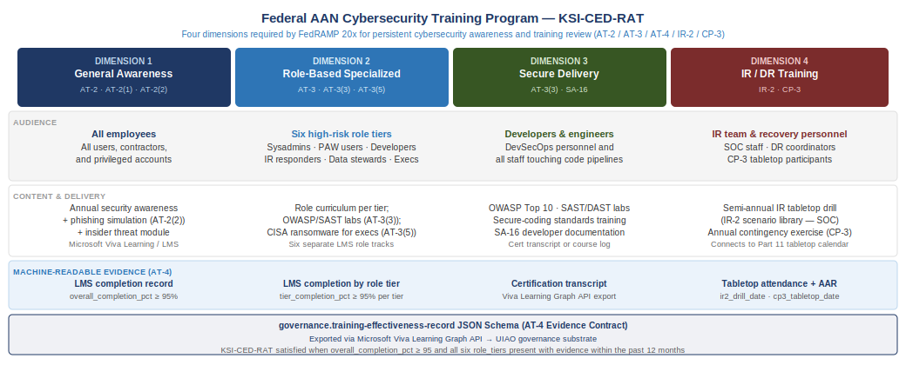
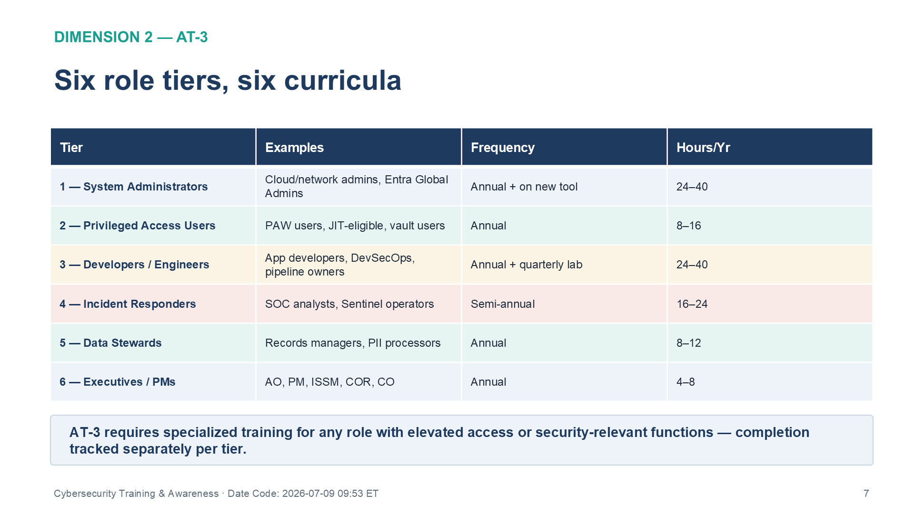
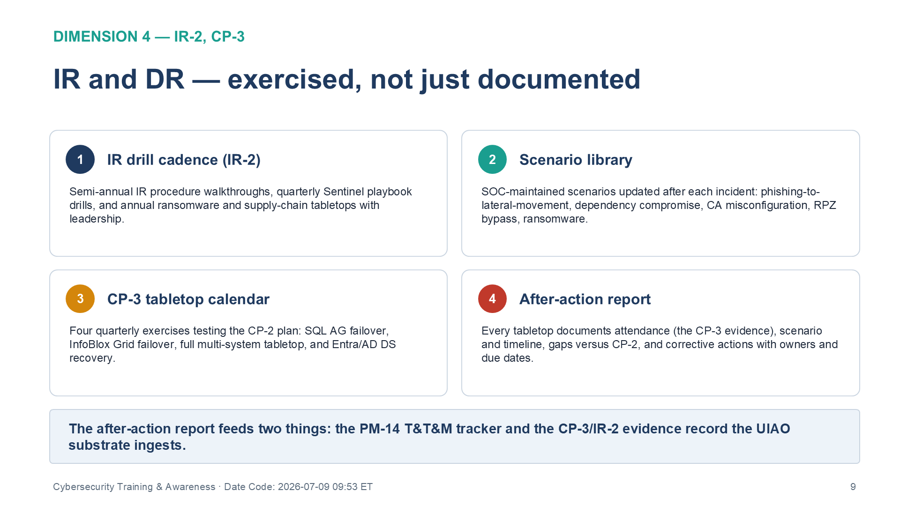
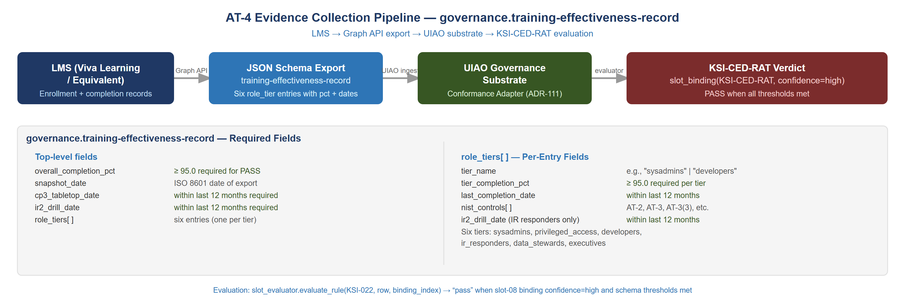

::: {.fouo-banner}
INTERNAL — NOT FOR PUBLIC DISTRIBUTION
:::

::: {.callout-warning}
## Draft Proposal — Subject to Review

This document is a **draft proposal** developed by the **CSI Team (Cloud Services Infrastructure)**. It is an attempt at a comprehensive SSA-wide technical roadmap and has not been reviewed or approved by the SSA CIO Office, the Office of Information Security (OIS), or organizational leadership. All recommendations, vendor selections, control mappings, and implementation timelines are subject to revision pending formal review by the SSA CIO Office and organizational components.

**Date Code:** 2026-07-15 06:26 ET
:::

::: {.callout-note}
**Scope — control closure here; the academy in Volume V** — This book specifies the **AT-family training program and its control closure** (AT-2, AT-3, AT-4, CP-3, IR-2) and the shape of the KSI-CED training record. The full curriculum, labs, assessment rubrics, and certification are delivered by **Volume V — Training & Certification** (`Vol_V_Book_00_FedAAN_Training_Certification_Overview.qmd`), which operationalizes this program and produces the `training-effectiveness-record` that evidences the KSI-CED closure. This book remains the AT-family control-closure reference; Volume V is the enablement layer that teaches and certifies it. The two cross-reference rather than duplicate.
:::

## What This Document Addresses

FedRAMP 20x authorization requires that a cybersecurity training program be
continuously demonstrable — not as a policy assertion, but as a
machine-readable record of completion across four distinct training
dimensions. This is the last remaining KSI that the seventeen-book series
cannot close through network, identity, or security architecture artifacts
alone: training requires a human participation record.

This document provides:

1. **Training Program Architecture** — the four-dimension model required by
   KSI-CED-RAT, mapped to AT-2, AT-3, AT-4, CP-3, and IR-2
2. **General Security Awareness Training (AT-2)** — annual all-employee
   program design, content requirements, and GCC Moderate delivery options
3. **Role-Based Training Program (AT-3)** — training matrices for six
   high-risk role categories: system administrators, developers/engineers,
   privileged access users, incident responders, data stewards, and
   executives/program managers
4. **Training Records and LMS Integration (AT-4)** — machine-readable
   completion record schema, Microsoft Viva Learning integration, and
   export format for the UIAO governance substrate
5. **Contingency Training (CP-3)** — tabletop exercise calendar and
   attendance documentation linking to Vol IV Book 01 (Business Continuity) DR runbooks
6. **Incident Response Training (IR-2)** — drill cadence, scenario library,
   and after-action documentation linking to Vol III Book 06 (SIEM / XDR Detection) Sentinel playbooks
7. **KSI-CED-RAT Activation** — evidence contract wiring for KSI-022,
   completing all 29 internal KSI-decomposition rules to evaluable status

Together these artifacts close five NIST SP 800-53 Rev 5 controls across
the AT, CP, and IR families, activate the final scaffold KSI in the UIAO
ruleset, and produce the machine-readable training-effectiveness record
required for FedRAMP 20x continuous monitoring.

---

# Cybersecurity Training in the FedRAMP 20x Context

## Why Training Cannot Be Closed by Architecture Alone

Every other control family in this series can be closed by infrastructure
configuration — a DNS resolver enforces SC-7, an Entra Conditional Access
policy enforces AC-3, a Sentinel rule satisfies AU-6. Training controls are
different. AT-2, AT-3, and AT-4 require human participation recorded in a
system that produces queryable completion evidence.

FedRAMP 20x KSI-CED-RAT ("Reviewing All Training") evaluates whether the
organization **persistently reviews** training effectiveness across four
dimensions. The word "persistently" is deliberate — a one-time training
event satisfies nothing. The KSI evaluates whether the organization
maintains a continuous, structured review of training coverage, and whether
that review is backed by evidence in machine-readable form.

The four dimensions KSI-CED-RAT evaluates:

| Dimension | Coverage | NIST Control | Evidence Type |
|-----------|----------|--------------|---------------|
| General awareness | All employees | AT-2 | LMS completion record — all staff |
| Role-specific | High-risk roles | AT-3 | LMS completion record — by role |
| Secure delivery | Developers / engineers | AT-3, AT-3(3) | Training certification or course transcript |
| IR/DR | Incident response and recovery personnel | IR-2, CP-3 | Tabletop attendance record + after-action report |

: KSI-CED-RAT — Four Required Training Dimensions {.striped .hover}

## The Relationship to Vol IV Book 01 and Vol IV Book 03

Vol IV Book 01 (Business Continuity) established the CP-2 Contingency Plan and
defined RTO/RPO/MTD targets. Vol IV Book 03 (Program Management) established the
PM-14 Testing, Training, and Monitoring Plan that schedules tabletop
exercises on an annual cadence. This document provides the training content,
role matrices, and evidence record schema that those frameworks reference.

The PM-14 T&T&M Plan names training as a required activity. Vol IV Book 05
defines what that training contains, who must complete it, and how
completion is recorded in a form that the UIAO governance substrate can
ingest as a machine-readable KSI evidence signal.

## Controls Closed by This Document

| Control | Title | Closure Mechanism |
|---------|-------|-------------------|
| **AT-2** | Literacy Training and Awareness | Annual all-employee security awareness via Microsoft Viva Learning or equivalent; LMS completion record as evidence |
| **AT-2(1)** | Practical Exercises | Phishing simulation exercises integrated into awareness program; simulation result record as evidence |
| **AT-2(2)** | Insider Threat Awareness | Insider threat module within annual awareness program; included in LMS completion record |
| **AT-3** | Role-Based Training | Role training matrix with six categories; role-specific LMS tracks with separate completion evidence |
| **AT-3(3)** | Practical Exercises for High-Risk Roles | Hands-on labs and scenario exercises for sysadmins, developers, and IR personnel |
| **AT-3(5)** | Processing Personally Identifiable Information | PII awareness module for data stewards, connecting to Vol IV Book 04 (PII Processing & Transparency) PT family |
| **AT-4** | Training Records | LMS export in JSON/CSV format; monthly snapshot to UIAO governance substrate |
| **CP-3** | Contingency Training | Annual tabletop exercise with attendance record; after-action report archived |
| **IR-2** | Incident Response Training | Semi-annual IR drill; scenario library maintained by SOC; connects to Vol III Book 06 Sentinel playbooks |

: AT Family Control Closure — Vol IV Book 05 {.striped .hover}

> **Closure Necessity — AT family and KSI-CED.** These controls close through
> training evidence — LMS completion records, drill attendance, and
> after-action reports — not through the network substrate. What the substrate
> supplies is the curriculum: the program trains personnel on the architecture
> the rest of this series builds — the authoritative naming and addressing
> plane (Vol I Book 01), device identity at the port (Vol I Book 02), and certificate- and
> token-based cryptographic identity (Vol I Book 03) — so the people operating the
> substrate understand why it is configured the way it is. A trained workforce
> is the one closure mechanism no configuration setting can substitute for, and
> the series' necessity claims elsewhere stay credible precisely because it
> does not pretend otherwise.

---

# Training Program Architecture

## The Four-Dimension Model

The training program is organized around the four dimensions KSI-CED-RAT
requires the organization to persistently review. Each dimension has a
distinct audience, delivery mechanism, frequency, and evidence type.

{fig-alt="Four-column diagram showing the four dimensions of the FedRAMP 20x cybersecurity training program required by KSI-CED-RAT. Dimension 1 (General Awareness, AT-2/AT-2(1)/AT-2(2)): audience is all employees and contractors; content is annual security awareness plus phishing simulation plus insider threat module; evidence is LMS completion record with overall_completion_pct at least 95 percent. Dimension 2 (Role-Based Specialized, AT-3/AT-3(3)/AT-3(5)): audience is six high-risk role tiers — sysadmins, privileged access users, developers, IR responders, data stewards, executives; content is role curriculum per tier with OWASP and SAST labs for developers and CISA ransomware guidance for executives; evidence is LMS completion by role tier. Dimension 3 (Secure Delivery, AT-3/AT-3(3)): audience is developers and engineers in DevSecOps pipelines; content is OWASP Top 10, SAST and DAST labs, and secure-coding standards; evidence is certification transcript or course log. Dimension 4 (IR/DR Training, IR-2/CP-3): audience is IR team and recovery personnel; content is semi-annual IR tabletop drill and annual contingency exercise connecting to the Part 14 tabletop calendar; evidence is tabletop attendance record and after-action report. Footer shows governance.training-effectiveness-record JSON schema exported via Microsoft Viva Learning Graph API to the UIAO governance substrate; KSI-CED-RAT is satisfied when overall_completion_pct is at least 95 and all six role tiers are present with evidence dated within the past 12 months." width="100%"}

## Program Governance

The training program is governed by the following roles, which connect
directly to the RACI established in Vol IV Book 03:

| Role | Responsibility |
|------|----------------|
| **ISSO** | Program owner; approves training content annually; signs off on AT-4 record accuracy |
| **ISSM** | Escalation point for role-based training gaps; receives quarterly completion dashboards |
| **HR / Training Coordinator** | Manages LMS enrollment, completion tracking, and export to UIAO substrate |
| **SOC Lead** | Owns IR drill calendar; authors scenario library; produces after-action reports |
| **COR / Program Manager** | Ensures contractor workforce completes applicable training tracks |
| **Supervisor (all levels)** | Accountable for direct report completion within their organization |

: Training Program RACI — Key Roles {.striped .hover}

---

# Dimension 1 — General Security Awareness Training (AT-2)

## Program Design

AT-2 requires security awareness training for all users of organizational
systems, including contractors and privileged users, before they are granted
access and on a recurring basis thereafter. For FedRAMP 20x, the recurring
basis must produce a persistent completion record — annual is the standard
minimum; quarterly refreshers are best practice for GCC Moderate systems.

The general awareness program covers:

| Module | Content | Regulatory Driver |
|--------|---------|-------------------|
| **Zero Trust Fundamentals** | Why implicit trust is gone; verify explicitly, least privilege, assume breach | EO 14028, OMB M-22-09 |
| **Phishing and Social Engineering** | Recognition, reporting, GCC-tenant spoofing patterns | AT-2, CISA guidance |
| **Password and MFA Hygiene** | Entra MFA, FIDO2 keys, authenticator apps; why SMS is deprecated | IA-5, CISA MFA guidance |
| **Insider Threat Awareness** | Behavioral indicators, reporting obligations, DISA Insider Threat program | AT-2(2), EO 13587 |
| **Data Classification and Handling** | CUI markings, GCC-only sharing, Purview sensitivity labels | Vol III Book 05, CUI policy |
| **Incident Reporting** | How to report a suspected incident; SOC contact; IR playbook entry points | IR-6, Vol III Book 06 |
| **Acceptable Use and Legal** | System use notice acknowledgment; FISMA obligations; personal device policy | PL-4, AC-8 |
| **Remote Work Security** | VPN, ZTNA, home network risks, shoulder surfing | AC-17, Vol I Book 06 |

: AT-2 General Awareness — Required Modules {.striped .hover}

## Delivery Options for GCC Moderate

Federal agencies operating in GCC Moderate have several compliant delivery
options for general awareness training:

| Platform | GCC Availability | Cost | Evidence Format |
|----------|-----------------|------|-----------------|
| **Microsoft Viva Learning** | Native GCC / GCC High | M365 E3/E5 included | JSON via Graph API; exports to UIAO substrate directly |
| **DoD Cyber Awareness Challenge** | Free; DoD-approved; GCC accessible | Free | ATCTS completion certificate (PDF/CSV export) |
| **CISA Cybersecurity Training** | free.cisa.gov; public access | Free | Manual transcript; requires AT-4 manual entry |
| **KnowBe4 / Proofpoint** | Commercial; GCC-compatible deployments | Licensed | API or CSV export; FedRAMP Moderate authorized |
| **SANS Security Awareness** | Commercial; FedRAMP-authorized | Licensed | API export; direct UIAO substrate integration possible |

: AT-2 Delivery Platform Options — GCC Moderate {.striped .hover}

**Recommended:** Microsoft Viva Learning for organizations already on M365
E3/E5 GCC. The Microsoft Graph API provides a structured JSON export of
completion records that maps directly to the AT-4 evidence schema and can
be automated into the UIAO governance substrate on a monthly pull cadence.

> **The evidence contract is LMS-agnostic; Viva Learning is the current
> adapter, not the contract.** KSI-CED-RAT is satisfied by the
> `governance.training-effectiveness-record` JSON schema — any LMS in the
> table above that can populate that schema satisfies the control identically.
> This distinction is deliberate concentration-risk management: Microsoft has
> retired other Viva components (Viva Goals, December 2025; Viva Topics,
> February 2025) while redirecting investment toward Copilot, and although
> Viva Learning itself is not retired, the evidence pipeline must not assume
> its permanence. **Verify Viva Learning GCC feature parity at time of
> deployment**, and treat an LMS swap as an adapter change (new export
> mapping), not a control change.

## Phishing Simulation (AT-2(1))

Practical exercises are required under AT-2(1). Phishing simulation is the
standard federal mechanism. The simulation program must:

1. Run at minimum **quarterly** campaigns across the full user population
2. Track click rate, report rate, and training completion for those who
   click (remedial training trigger)
3. Export results in a structured format tied to user identity (not just
   aggregate statistics) for AT-4 purposes
4. Scenarios must include GCC-tenant spoof patterns — attackers impersonating
   `.mil` or `.gov` domains, or spoofing legitimate Microsoft 365 service
   notifications

**GCC Moderate options:** Microsoft Attack Simulator (Defender for Office
365 Plan 2, included in M365 E5 GCC) or KnowBe4 GCC-compatible deployment.

---

# Dimension 2 — Role-Based Training (AT-3)

## Role Classification and Training Matrix

AT-3 requires specialized training for personnel with assigned security
responsibilities. For FedRAMP 20x, this means any role that has elevated
access, system administration duties, or security-relevant functions. The
following six role tiers cover the GCC Moderate environment:

| Role Tier | Examples | Training Requirement | Frequency | Hours/Year |
|-----------|----------|---------------------|-----------|-----------|
| **Tier 1 — System Administrators** | Cloud admins, network engineers, InfoBlox admins, Entra Global Admins | Azure Security fundamentals, Entra ID hardening, InfoBlox DDI security, Sentinel administration | Annual + on new tool deployment | 24–40 hrs |
| **Tier 2 — Privileged Access Users** | PAW users, JIT-eligible roles, CyberArk vault users | PAW architecture, Entra PIM workflow, session recording awareness | Annual | 8–16 hrs |
| **Tier 3 — Developers / Engineers** | Application developers, DevSecOps engineers, pipeline owners | Secure coding (OWASP Top 10), SBOM generation, dependency scanning, GitHub Actions security | Annual + quarterly lab | 24–40 hrs |
| **Tier 4 — Incident Responders** | SOC analysts, IR team members, Sentinel operators | KQL query writing, Sentinel playbook operation, IR procedure walkthroughs | Semi-annual | 16–24 hrs |
| **Tier 5 — Data Stewards** | Records managers, HR system owners, PII processors | CUI handling, Purview DLP policies, sensitivity label application, SORN obligations | Annual | 8–12 hrs |
| **Tier 6 — Executives / Program Managers** | AO, PM, ISSM, COR, Contracting Officer | Risk posture briefing, FedRAMP 20x obligation overview, POA&M review process | Annual | 4–8 hrs |

: AT-3 Role-Based Training Matrix {.striped .hover}

{#fig-ced03 fig-alt="Table titled 'Six role tiers, six curricula' under a Dimension 2 AT-3 heading, with columns Tier, Examples, Frequency, and Hours per Year. Tier 1 System Administrators — cloud and network admins, Entra Global Admins — annual plus on new tool, 24 to 40 hours. Tier 2 Privileged Access Users — PAW users, JIT-eligible, vault users — annual, 8 to 16 hours. Tier 3 Developers / Engineers — app developers, DevSecOps, pipeline owners — annual plus quarterly lab, 24 to 40 hours. Tier 4 Incident Responders — SOC analysts, Sentinel operators — semi-annual, 16 to 24 hours. Tier 5 Data Stewards — records managers, PII processors — annual, 8 to 12 hours. Tier 6 Executives / PMs — AO, PM, ISSM, COR, CO — annual, 4 to 8 hours. A summary banner states AT-3 requires specialized training for any role with elevated access or security-relevant functions, with completion tracked separately per tier. White background. Source: Vol IV Book 05 Cybersecurity Training & Awareness briefing deck, Date Code 2026-07-09 17:00 ET." width="100%"}

## Tier 1 — System Administrator Training Curriculum

System administrators represent the highest-risk role category in a FedRAMP
Moderate environment. Their training curriculum must cover the specific
technologies deployed in this series:

| Course Area | Content | Connects To |
|-------------|---------|-------------|
| InfoBlox DDI Security | DNSSEC key management, RPZ rule maintenance, IPAM audit log review | Vol I Book 01 |
| SD-WAN / SASE Administration | IPsec key rotation, SASE policy updates, DIA circuit failover procedures | Vol I Book 06 |
| Entra ID and Conditional Access | Conditional Access policy design, MFA enforcement exceptions, break-glass account procedures | Vol I Book 05 |
| Azure Arc and SQL Security | Managed Identity token lifecycle, Arc extension updates, SQL login audit review | Vol II Books 01–02 |
| Microsoft Sentinel Operations | Connector health monitoring, analytics rule tuning, UEBA threshold calibration | Vol III Book 06 |
| Privileged Access Management | Entra PIM role activation, PAW maintenance, JIT request approval | Vol III Book 01 |
| Vulnerability Management | Defender MDVM dashboard interpretation, KEV remediation SLA tracking, WUfB ring management | Vol III Book 02 |
| Backup and DR Operations | Azure Site Recovery test procedures, SQL AG failover validation, RTO/RPO measurement | Vol IV Book 01 |

: Tier 1 Sysadmin Training — AAN-Aligned Curriculum {.striped .hover}

## Tier 3 — Developer / Engineer Secure Delivery Training (AT-3, AT-3(3))

Developer training under AT-3 and AT-3(3) covers the secure delivery
practices established by the SBOM/VDR pipeline in Vol IV Book 02 (Supply Chain Risk Management):

| Topic | Content | Evidence Produced |
|-------|---------|-------------------|
| **Dependency Management** | Pinning dependencies, evaluating transitive dependencies, understanding VDR/VEX fields | SBOM generation fluency |
| **SBOM Generation (Syft)** | Running Syft against container images and repositories, CycloneDX format, attestation signing | Vol IV Book 02 pipeline competency |
| **Vulnerability Triage (Grype)** | Interpreting Grype output, VEX exploitability assertions, BOD 26-04 D1–D5 SLA obligations | Vol IV Book 02 pipeline competency |
| **GitHub Actions Security** | Secrets management, workflow permissions, OIDC token scoping, supply chain attack patterns | Vol IV Book 02 pipeline integrity |
| **OWASP Top 10** | Injection, broken access control, cryptographic failures, XSS patterns | SA-11, SA-15 |
| **Secure Code Review** | What to look for in pull request review, dependency diff review | SA-11(1) |
| **Incident Reporting from Dev** | How to report a suspected supply chain event; who to contact | IR-6, Vol III Book 06 |

: Tier 3 Developer Secure Delivery Curriculum {.striped .hover}

## Tier 5 — Data Steward Training (AT-3(5))

AT-3(5) requires training for personnel who process personally identifiable
information. This connects to Vol IV Book 04 (PII Processing and Transparency):

- **Purview sensitivity label application** — when to apply which label,
  how auto-labeling works, and what happens when a document is shared
- **DLP policy understanding** — what the DLP policies in Vol III Book 05 block
  and why, so data stewards don't attempt workarounds
- **SORN and PIA obligations** — what triggers a Privacy Impact Assessment,
  how to initiate one, and the role of the System of Records Notice
- **Breach notification procedure** — what constitutes a PII breach, the
  72-hour reporting window, and the SOC notification path

---

# Dimension 3 — Secure Delivery Training

## Developer Security in the FedRAMP 20x Context

FedRAMP 20x KSI-PIY-RSD ("Reviewing Security in the SDLC") — activated
by Vol IV Book 02's SBOM pipeline and Vol III Book 02's Defender VM integration — requires
that security is reviewed throughout the software delivery process. Training
is the human layer of that review: developers who understand what Syft
produces, what Grype flags, and what a VEX assertion means will engage with
the automated pipeline as partners rather than treating it as a compliance
hurdle.

The secure delivery training program connects KSI-PIY-RSD evidence
(Vol IV Book 02) with the human competency layer (this document). Together they
satisfy the full CR26 intent: automated scanning provides the
machine-readable signal; trained developers make the triage decisions that
determine whether findings are remediated or suppressed with a justified
exploitability assertion.

## Training Delivery for Developers

Developer training must be practical, not lecture-based. Effective formats:

| Format | Purpose | Minimum Frequency |
|--------|---------|-------------------|
| **Hands-on SBOM lab** | Generate a CycloneDX SBOM from a real repository; inspect the output | Annual |
| **Grype triage exercise** | Given a Grype scan result, classify findings and write VEX assertions | Annual |
| **Secure code review session** | Pair review of a deliberately vulnerable PR; identify and remediate | Quarterly |
| **Supply chain scenario tabletop** | What do we do if a critical dependency is compromised? | Annual with IR tabletop |
| **CTF / security challenge** | Team-based challenge covering OWASP Top 10 patterns | Annual (optional but high-value) |

: Secure Delivery Training Formats {.striped .hover}

---

# Dimension 4 — Incident Response and DR Training (IR-2, CP-3)

## Incident Response Training (IR-2)

IR-2 requires that personnel with incident response responsibilities
receive training on their specific roles in the IR plan. This training
connects directly to Vol III Book 06 (SIEM/XDR Detection Engineering) — the
Sentinel playbooks defined there are the operational tools; this training
is what ensures personnel can operate them under pressure.

{#fig-ced04 fig-alt="Four-quadrant card grid titled 'IR and DR — exercised, not just documented' under a Dimension 4 IR-2, CP-3 heading. Card 1, IR drill cadence (IR-2): semi-annual IR procedure walkthroughs, quarterly Sentinel playbook drills, and annual ransomware and supply-chain tabletops with leadership. Card 2, Scenario library: SOC-maintained scenarios updated after each incident — phishing-to-lateral-movement, dependency compromise, Conditional Access misconfiguration, RPZ bypass, and ransomware. Card 3, CP-3 tabletop calendar: four quarterly exercises testing the CP-2 plan — SQL AG failover, InfoBlox Grid failover, full multi-system tabletop, and Entra/AD DS recovery. Card 4, After-action report: every tabletop documents attendance (the CP-3 evidence), scenario and timeline, gaps versus CP-2, and corrective actions with owners and due dates. A summary banner states the after-action report feeds two things, the PM-14 T&T&M tracker and the CP-3/IR-2 evidence record the UIAO substrate ingests. White background. Source: Vol IV Book 05 Cybersecurity Training & Awareness briefing deck, Date Code 2026-07-09 17:00 ET." width="100%"}

### IR Training Cadence

| Event | Frequency | Participants | Documentation |
|-------|-----------|-------------|---------------|
| **IR procedure walkthrough** | Semi-annual | Full SOC + IR team | Attendance record |
| **Sentinel playbook drill** | Quarterly | SOC analysts | Drill report |
| **Tabletop — ransomware scenario** | Annual | IR team + leadership | After-action report |
| **Tabletop — supply chain incident** | Annual | IR + development + leadership | After-action report |
| **Full simulation (red/blue)** | Annual (recommended) | SOC + sysadmins | Exercise report |

: IR-2 Training Cadence {.striped .hover}

### IR Scenario Library

The SOC maintains a scenario library that is updated after each real incident
and after each after-action review. Minimum scenarios for GCC Moderate:

1. **Phishing → credential theft → lateral movement** — the most common
   federal attack pattern; covers how Sentinel UEBA detects the anomaly and
   which Logic App playbook fires
2. **Supply chain dependency compromise** — a critical npm/NuGet/PyPI package
   is found malicious after deployment; what is the response chain from Grype
   alert to containment
3. **Entra Conditional Access misconfiguration** — a policy change exposes
   a gap; how is it detected in Sentinel and how is the access revoked
4. **InfoBlox RPZ bypass attempt** — DNS exfiltration pattern not covered by
   current RPZ rules; detection via Sentinel CEF connector and response
5. **Ransomware encryption event** — endpoint detection via Defender MDE,
   containment via Intune device action, recovery via Azure Site Recovery
   failover to DR replica (Vol IV Book 01 procedure)

## Contingency Training (CP-3)

CP-3 requires that contingency plan personnel are trained on their specific
roles and responsibilities. Vol IV Book 01 established the Contingency Plan,
RTO/RPO/MTD targets, and DR runbooks. This training ensures the people
named in those runbooks can execute them.

### CP-3 Tabletop Exercise Calendar

The annual tabletop exercise directly tests the CP-2 Contingency Plan
established in Vol IV Book 01:

| Quarter | Exercise Focus | Participants | Output |
|---------|----------------|-------------|--------|
| **Q1** | SQL AG failover to DR replica | DBAs, sysadmins, SOC | Failover time measurement vs. RTO target |
| **Q2** | InfoBlox Grid Manager failover | Network engineers, DNS admins | Recovery time vs. RTO; RPZ rule restoration check |
| **Q3** | Full CP-2 tabletop — multi-system outage | All DR-designated personnel + leadership | After-action report; plan updates |
| **Q4** | Entra ID + Azure AD DS recovery scenario | Identity admins, sysadmins | Token reissuance time; break-glass procedure validation |

: CP-3 Annual Tabletop Calendar {.striped .hover}

### After-Action Report Requirements

Every tabletop produces an after-action report that:

1. Documents attendance (names, roles, date) — this is the CP-3 evidence record
2. Records the scenario, injects, and timeline
3. Identifies gaps found versus the CP-2 plan
4. Assigns corrective actions with owners and due dates
5. Is reviewed by the ISSO and archived in the governance record system

The after-action report feeds two things: the PM-14 T&T&M tracker
(Vol IV Book 03) and the CP-3 evidence record that the UIAO substrate ingests.

---

# Training Records and LMS Integration (AT-4)

## The Machine-Readable Evidence Requirement

AT-4 requires the organization to retain individual training records and
review them. For FedRAMP 20x KSI-CED-RAT, "review" must be persistent and
machine-readable — the UIAO governance substrate needs to query whether all
four training dimensions have been reviewed, for which populations, and
when.

The evidence contract for KSI-022 specifies:

```
Substrate_Signal: governance.training-effectiveness-record
Data_Type:        Document
Evidence:         LMS training completion record demonstrating all four
                  training dimensions are reviewed
```

This means the LMS must produce an exportable record that the UIAO can
ingest and query. The record must answer four questions:

1. Did **all employees** complete annual security awareness training (AT-2)?
2. Did **all role-designated personnel** complete their role-specific track (AT-3)?
3. Did **all developers / engineers** complete secure delivery training (AT-3(3))?
4. Did **all IR/DR personnel** attend the required drills and tabletops (IR-2, CP-3)?

## Training Completion Record Schema

The training-effectiveness-record exported to the UIAO substrate follows
this schema:

```json
{
  "record_type": "training-effectiveness-review",
  "review_period": "2026-Q3",
  "generated_date": "2026-10-01",
  "generated_by": "Viva Learning Graph API export",
  "dimensions": {
    "general_awareness_at2": {
      "population": 347,
      "completed": 341,
      "completion_rate": 0.983,
      "overdue": 6,
      "platform": "Microsoft Viva Learning",
      "course_id": "AAN-AT2-2026",
      "phishing_simulation": {
        "campaigns_run": 3,
        "average_click_rate": 0.042,
        "remedial_training_triggered": 14
      }
    },
    "role_based_at3": {
      "tiers": {
        "tier1_sysadmin": { "population": 12, "completed": 12, "completion_rate": 1.0 },
        "tier2_privileged": { "population": 28, "completed": 27, "completion_rate": 0.964 },
        "tier3_developer": { "population": 45, "completed": 44, "completion_rate": 0.978 },
        "tier4_ir_responder": { "population": 8, "completed": 8, "completion_rate": 1.0 },
        "tier5_data_steward": { "population": 31, "completed": 30, "completion_rate": 0.968 },
        "tier6_executive": { "population": 9, "completed": 9, "completion_rate": 1.0 }
      }
    },
    "secure_delivery_at3": {
      "population": 45,
      "completed": 44,
      "labs_completed": 42,
      "completion_rate": 0.978
    },
    "ir_dr_training_ir2_cp3": {
      "ir_drills": { "scheduled": 2, "conducted": 2, "attendance_rate": 1.0 },
      "tabletop_exercises": { "scheduled": 1, "conducted": 1, "attendance_rate": 0.923 },
      "after_action_reports": 2
    }
  },
  "ksi_ced_rat_status": "PASS",
  "attestation": {
    "isso_name": "[ISSO Name]",
    "review_date": "2026-10-01",
    "next_review": "2027-01-01"
  }
}
```

{fig-alt="Flow diagram showing four stages of the AT-4 evidence collection pipeline. Stage 1 (dark navy): LMS (Viva Learning or equivalent) stores enrollment and completion records. Stage 2 (federal blue): JSON Schema Export produces the training-effectiveness-record document with six role_tier entries carrying completion percentages and dates. Stage 3 (dark green): UIAO Governance Substrate ingests the record via the Conformance Adapter. Stage 4 (dark red): KSI-CED-RAT Verdict is produced by calling slot_binding(KSI-CED-RAT, confidence=high) — result is PASS when all thresholds are met. Below the flow, a detail panel shows required schema fields: top-level fields include overall_completion_pct (must be at least 95), snapshot_date, cp3_tabletop_date (within 12 months), ir2_drill_date (within 12 months), and role_tiers array; per-tier fields include tier_name, tier_completion_pct (must be at least 95 per tier), last_completion_date (within 12 months), nist_controls array, and ir2_drill_date for IR responder tier. Six tiers required: sysadmins, privileged_access, developers, ir_responders, data_stewards, executives." width="100%"}

## Microsoft Viva Learning Integration

For organizations on Microsoft 365 GCC E3 or E5, Viva Learning is the
recommended LMS platform because its completion data is accessible via the
Microsoft Graph API without additional integration effort:

### Graph API Query for AT-4 Evidence

```powershell
# Get training completion records for AT-4 evidence export
# Requires: LearningAssignmentReport.Read.All permission

$headers = @{
    Authorization = "Bearer $accessToken"
    "Content-Type" = "application/json"
}

# Query all learning assignments in the review period
$response = Invoke-RestMethod -Uri `
    "https://graph.microsoft.com/v1.0/employeeExperience/learningCourseActivities" `
    -Headers $headers -Method GET

# Filter by course IDs in the AAN training program
$aanCourses = $response.value | Where-Object {
    $_.courseId -in @("AAN-AT2-2026", "AAN-AT3-SYSADMIN-2026",
                       "AAN-AT3-DEV-2026", "AAN-AT3-IR-2026")
}

# Export to JSON for UIAO substrate ingestion
$aanCourses | ConvertTo-Json -Depth 5 | Out-File "training-record-$(Get-Date -Format 'yyyyQq').json"
```

### Automated Monthly Export

The training completion export should run on a monthly schedule so the
UIAO substrate always reflects current completion status. The recommended
pattern:

1. **Logic App or Azure Automation runbook** triggers on the 1st of each month
2. **Graph API call** retrieves completion records for all AAN training courses
3. **Transform** maps Graph API response to the UIAO `training-effectiveness-record` schema
4. **Storage** writes the JSON to the governance record store (Azure Storage, GCC-compliant)
5. **UIAO substrate pull** ingests the record on the next evidence collection cycle

---

# NIST Control Closure

## AT Family — Awareness and Training

| Control | Requirement | How This Document Closes It |
|---------|-------------|----------------------------|
| **AT-2** | Security awareness training for all personnel before access and annually | Annual Viva Learning program covering all 8 modules; phishing simulation quarterly; LMS completion record as AT-4 evidence |
| **AT-2(1)** | Practical exercises | Quarterly phishing simulation with click-rate tracking and remedial training trigger |
| **AT-2(2)** | Insider threat awareness | Dedicated insider threat module in annual awareness program |
| **AT-3** | Role-based training for personnel with security responsibilities | Six-tier role matrix with distinct curricula; completion tracked separately per tier |
| **AT-3(3)** | Practical exercises for high-risk roles | Hands-on SBOM/Grype labs for Tier 3; Sentinel drill exercises for Tier 4; tabletop participation for Tier 1 |
| **AT-3(5)** | Processing Personally Identifiable Information | Purview DLP and sensitivity label training for Tier 5 data stewards; connects to Vol IV Book 04 |
| **AT-4** | Training records | LMS-agnostic `governance.training-effectiveness-record` JSON schema (the evidence contract); current adapter: Viva Learning Graph API export; monthly automated pull to UIAO governance substrate |

: AT Family Control Closure {.striped .hover}

## CP and IR Family Contributions

| Control | How This Document Contributes |
|---------|------------------------------|
| **CP-3** | Annual tabletop calendar with four quarterly exercises; attendance and after-action records archived; feeds PM-14 T&T&M tracker |
| **IR-2** | Semi-annual IR procedure drills; quarterly Sentinel playbook exercises; scenario library maintained by SOC; after-action reports archived |

: CP-3 and IR-2 Contributions {.striped .hover}

## Net New Controls Closed by Vol IV Book 05

| Family | Controls | Count |
|--------|---------|-------|
| AT — Awareness and Training | AT-2, AT-2(1), AT-2(2), AT-3, AT-3(3), AT-3(5), AT-4 | 7 |
| CP — Contingency Planning | CP-3 (tabletop evidence; plan execution link) | 1 |
| IR — Incident Response | IR-2 (drill evidence; playbook link) | 1 |
| **Total** | | **9 controls** |

: Vol IV Book 05 — Net New NIST SP 800-53 Rev 5 Controls Closed {.striped .hover}

---

# KSI-CED-RAT Activation

## Evidence Contract

KSI-022 (KSI-CED-RAT — "Reviewing All Training") is the final scaffold
rule in the UIAO CR26 ruleset. Its activation requires a
`governance.training-effectiveness-record` that demonstrates persistent
review of all four training dimensions.

This document provides:

1. **Dimension 1 (AT-2):** Annual Viva Learning program with monthly LMS
   export — the record shows completion rate, population covered, and
   phishing simulation results

2. **Dimension 2 (AT-3 role-based):** Six-tier completion record in the
   JSON schema — each tier tracked separately, completion rate and overdue
   count visible

3. **Dimension 3 (AT-3 secure delivery):** Developer lab completion
   records and course transcripts — Syft/Grype labs produce a
   participation record

4. **Dimension 4 (IR-2/CP-3):** Tabletop attendance records and after-action
   reports — archived documents with dates, attendees, and findings

When the monthly LMS export is running and the UIAO substrate is ingesting
it, the `ksi_ced_rat_status` field in the record evaluates to `PASS` when:

- AT-2 completion rate ≥ 95% (allowing for onboarding lag and approved exceptions)
- AT-3 completion rate ≥ 95% per tier
- AT-3 secure delivery completion rate ≥ 95%
- IR/DR drills conducted on schedule (both semi-annual drills run; tabletop run)

## KSI-022 Status After Vol IV Book 05

Once the monthly LMS export is operational and the first
`training-effectiveness-record` is ingested by the UIAO substrate:

- **KSI-022 status:** scaffold → **active**
- **Confidence:** low → **high** (pending first full-year completion cycle)
- **Internal KSI rule-set coverage:** 28/29 → **29/29 active** — all 29
  internal rules are now evaluable (this is the series' internal KSI
  decomposition, **not**
  the CR26 Moderate indicator catalog).
- **CR26 indicator coverage:** **19 of 46** CR26 indicators explicitly mapped 1:1
  to an internal rule (themes CMT · PIY · SCR · CED · INR · RPL fully mapped);
  the remaining **27** indicators (IAM · CNA · SVC · MLA) are attested at the
  CISA ScuBA baseline level only, not yet bound to a CR26 indicator ID. See
  [`AAN_CR26_Reconciliation.md`](AAN_CR26_Reconciliation.md).

**This makes all 29 internal KSI rules active/evaluable; it does not complete
CR26 indicator coverage** — that stands at 19/46, with 27 indicators pending
reconciliation to the finalized CR26 Moderate list and independent SCA. The
ten-volume Federal Application-Aware Networking series is **self-assessed against
the series' internal KSI decomposition** — pending CR26 reconciliation and
independent SCA.

## Series Completion Summary

| Book | Domain | Controls Closed | KSIs Activated |
|------|--------|----------------|----------------|
| Vol I Book 01 | InfoBlox DDI Landing Zone | 16 | IAM, MLA, SVC (addressing) |
| Vol I Book 06 | Telecommunications (SD-WAN/SASE) | 7 | SVC (boundary), MLA |
| Vol I Book 05 | Network and Identity Modernization | 12 | IAM, SVC (network) |
| Vol II Books 01–02 | SQL Server Authentication | auth surface | IAM (SQL tier) |
| Vol II Book 03 | Database Architecture and Network Physics | 7 | SVC (data) |
| Vol III Book 01 | Privileged Access Management | AC-5/6/11/12, IA-11 | IAM-ELP |
| Vol III Book 02 | Vulnerability Management | RA-5, SI-2, CM-7 | MLA-ALA, SVC |
| Vol III Book 05 | Data Protection and Purview | MP, SC-12/13/28 | SVC (data protection) |
| Vol III Book 06 | SIEM / XDR / Detection Engineering | AU-6/7/8, SI-4, IR-4/6/8 | MLA (primary) |
| Vol IV Book 01 | Business Continuity | CP-2 through CP-10 | RPL |
| Vol IV Book 02 | Supply Chain Risk Management | SR-1 through SR-11 | SCR-MIT, SCR-MON |
| Vol IV Book 03 | Program Management and Governance | PM-1/2/5/7/9/11/14/15/30 | SCR (governance) |
| Vol IV Book 04 | PII Processing and Transparency | PT-1 through PT-7 | PIY-RSD |
| Vol IV Book 05 | Cybersecurity Training and Awareness | AT-2/3/4, CP-3, IR-2 | **CED-RAT** |

: Federal AAN Series — Complete Control and KSI Coverage {.striped .hover}

---

# Implementation Checklist

## Phase 1 — Program Setup (Weeks 1–4)

- [ ] Designate training program owner (ISSO or delegate)
- [ ] Select LMS platform (Viva Learning recommended for M365 GCC E3/E5)
- [ ] Define role tier assignments — map all users to Tier 1–6
- [ ] Configure Graph API export with `LearningAssignmentReport.Read.All`
- [ ] Create course library in Viva Learning (or import CISA/DoD content)
- [ ] Enroll all employees in AT-2 general awareness track

## Phase 2 — Content and Delivery (Weeks 5–12)

- [ ] Launch AT-2 general awareness campaign (all employees)
- [ ] Launch AT-3 Tier 1 (sysadmin) and Tier 3 (developer) tracks — highest priority
- [ ] Configure phishing simulation platform (Attack Simulator or KnowBe4)
- [ ] Run first phishing simulation campaign
- [ ] Deliver first Tier 3 SBOM/Grype hands-on lab
- [ ] Schedule IR drill with SOC team

## Phase 3 — Evidence Integration (Weeks 13–16)

- [ ] Deploy Logic App / Automation Runbook for monthly LMS export
- [ ] Map Graph API output to `training-effectiveness-record` JSON schema
- [ ] Integrate export into UIAO governance substrate
- [ ] Validate KSI-022 query returns PASS on first ingested record
- [ ] Archive first tabletop after-action report in governance record store

## Phase 4 — Steady State (Ongoing)

- [ ] Monthly LMS export running and ingesting automatically
- [ ] Quarterly phishing simulation campaigns on calendar
- [ ] Semi-annual IR drill scheduled for H1 and H2
- [ ] Annual tabletop calendar set (Q1–Q4 per CP-3 schedule)
- [ ] ISSO reviews training-effectiveness-record quarterly dashboard
- [ ] Annual AT-2 content refresh cycle (update for emerging threats)

---

# Document References

| Document | Description |
|----------|-------------|
| Federal AAN — SSA Landing Zone IPAM / FedRAMP | Vol I Book 01: InfoBlox DDI, four-environment landing zone, NIST control mapping, FedRAMP 20x KSI evidence |
| Federal AAN — Federal Telecommunications Modernization | Vol I Book 06: Amazon Connect, Teams Phone, SD-WAN/SASE, G.114 compliance |
| Federal AAN — Network Modernization | Vol I Book 05: AD-to-Entra migration, ZTNA, Active Governance, FedRAMP 20x alignment |
| Federal AAN — SQL Server Authentication Modernization | Vol II Book 01: Arc Managed Identity, Kerberos/NTLM elimination, login migration |
| Federal AAN — SQL Server Implementation Guide | Vol II Book 02: 10-book runbook — estate discovery, Arc deployment, monitoring |
| Federal AAN — Database Consolidation and Network Physics | Vol II Book 03: SSOT architecture, speed-of-light floor, SD-WAN for database traffic |
| Federal AAN — Privileged Access Management | Vol III Book 01: Entra PIM JIT, PAW architecture, AC-6 least privilege |
| Federal AAN — Vulnerability Management | Vol III Book 02: Defender MDVM, CISA KEV, BOD 22-01 SLAs, RA-5 continuous scanning |
| Federal AAN — Data Protection and Purview | Vol III Book 05: Purview DLP, sensitivity labels, Key Vault CMK |
| Federal AAN — SIEM / XDR / Detection Engineering | Vol III Book 06: Sentinel connectors, KQL analytics, UEBA, Logic App playbooks |
| Federal AAN — Business Continuity | Vol IV Book 01: CP-2 Contingency Plan, BIA, SQL AG and DDI DR integration |
| Federal AAN — Supply Chain Risk Management | Vol IV Book 02: Syft SBOM, Grype VDR, OpenVEX, GitHub Actions pipeline |
| Federal AAN — Program Management and Governance | Vol IV Book 03: ISPP, POA&M, SCRM Charter, PM-30 closure |
| Federal AAN — PII Processing and Transparency | Vol IV Book 04: PT family templates, Privacy Program Plan, Purview Data Map |
| NIST SP 800-53 Rev 5 | Security and Privacy Controls — AT, CP, IR families |
| NIST SP 800-50 | Building an Information Technology Security Awareness and Training Program |
| NIST SP 800-16 | Information Technology Security Training Requirements |
| FedRAMP 20x Consolidated Rules (June 25, 2026) | KSI-CED-RAT — Reviewing All Training |
| CISA Cybersecurity Training | free.cisa.gov — federal workforce awareness resources |
| DoD Cyber Awareness Challenge | Annual awareness training; ATCTS completion records |
| Microsoft Graph API — Viva Learning | LearningCourseActivities endpoint for AT-4 evidence export |
| EO 14028 | Improving the Nation's Cybersecurity — training requirements for federal workforce |
