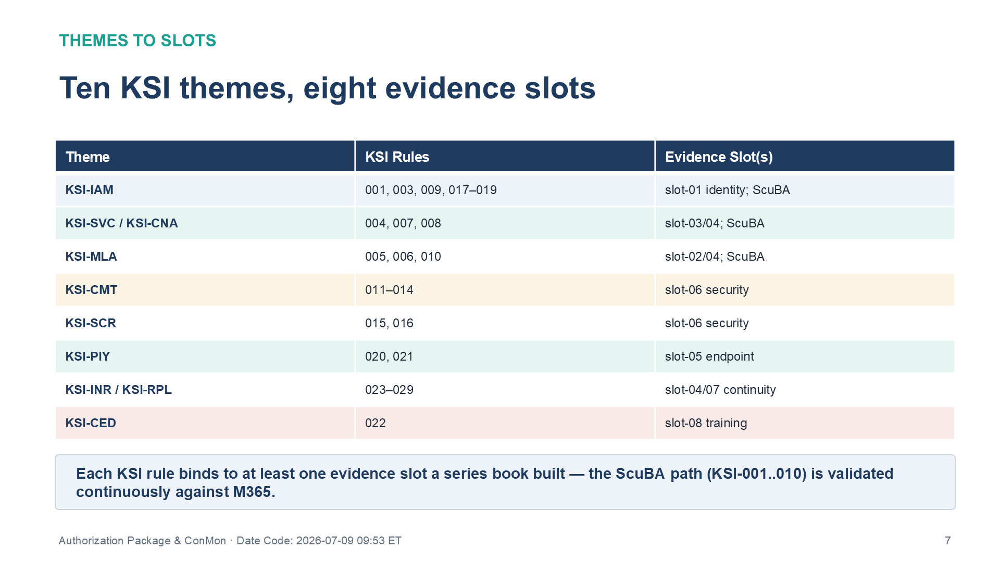
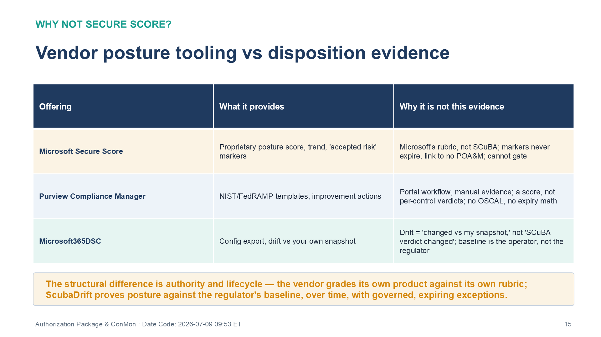

::: {.callout-warning}
## Draft Proposal — Subject to Review

This document is a **draft proposal** developed by the **CSI Team (Cloud Services Infrastructure)**. It is an attempt at a comprehensive SSA-wide technical roadmap and has not been reviewed or approved by the SSA CIO Office, the Office of Information Security (OIS), or organizational leadership. All recommendations, vendor selections, control mappings, and implementation timelines are subject to revision pending formal review by the SSA CIO Office and organizational components.

**Date Code:** 2026-07-08 16:07 ET
:::

# Preface

This is the nineteenth and final book in the Federal Application-Aware Networking
(AAN) series. The preceding eighteen books, spanning Volumes I–IV, generated the evidence layer: infrastructure
architecture, security controls, governance artifacts, and training records
mapped to NIST SP 800-53 Rev 5 controls, with ConMon evidence modeled on the
FedRAMP 20x CR26 KSI schema (29 rules in the ADR-111 rule set). This document
assembles those artifacts into the **agency RMF authorization package** — the
formal package presented to the SSA Authorizing Official for an agency
Authorization to Operate (ATO) under NIST SP 800-37, with the FedRAMP-authorized
cloud services SSA consumes documented as inherited (leveraged) authorizations.
SSA is a consuming agency, not a cloud service provider: nothing in this package
is submitted to the FedRAMP PMO. The FedRAMP 20x pipeline (Class A/B/C windows)
applies to the CSOs SSA inherits, and this book tracks those provider timelines
where they matter to inheritance.

This book addresses four deliverables:

1. **Authorization Package Structure** — what documents, in which format, presented to whom
2. **Continuous Monitoring Program** — how the evidence stays fresh after ATO (CA-7)
3. **BOD 26-04 VDR/VER Submission** — the December 7, 2026 SBOM + vendor disclosure
4. **OSCAL AP+AR+POAM Bundle** — the machine-readable KSI evidence package

Controls closed by this document: CA-2, CA-5, CA-6, CA-7, CA-7(1), CA-7(3),
RA-3, SA-15.

---

# 1 The Eighteen-Book Journey — All 29 ADR-111 KSI Rules Evaluable at High Confidence

## 1.1 Series Summary

The Federal AAN series delivered eighteen technical books covering the SSA GCC
Moderate boundary against NIST SP 800-53 Rev 5 and FedRAMP 20x Consolidated
Rules. Together the series closes **89+ distinct NIST controls** and provides
self-assessed evidence for all **29 KSI rules in the ADR-111 rule set**
(modeled on the FedRAMP 20x CR26 KSI schema).

::: {.callout-important}
**Self-Assessment Notice.** All KSI verdicts in this document are produced by
the UIAO Conformance Adapter — an automated self-assessment tool. They are
advisory and do not constitute a formal authorization. Results must be
independently validated through a security control assessment (SCA) — SSA may
engage a FedRAMP-recognized 3PAO as its independent assessor — and accepted by
the Agency Authorizing Official before an ATO is granted.

**KSI-count reconciliation (open item).** The 29 rules evaluated here are the
ADR-111 rule decomposition, not the published CR26 Moderate KSI catalog
(~56–63 indicators across the same 10 theme codes, depending on counting
method). The 29-rule set must be diffed rule-ID-by-rule-ID against the
finalized CR26 Moderate list (June 25, 2026), with the mapping stated
explicitly, before "29/29 satisfied" is carried into any authorization
decision.
:::

| Book | Topic | Controls |
|------|-------|----------|
| Vol I Book 01 | InfoBlox DDI — IPAM, DNS, DHCP, PKI | 16 |
| Vol I Book 02 | Network Access Control — 802.1X device identity at the port (device-identity evidence for the network and endpoint slot families) | IA-3, IA-3(1), AC-19, SC-7(3), SC-7(5), CM-8 |
| Vol I Book 03 | Certificates and Tokens — cryptographic identity (PKI lifecycle, OAuth/OIDC, CBA; identity slot family evidence) | IA-2(1)/(2), IA-5(2), SC-12, SC-17 |
| Vol I Book 04 | OPM HRIT and the Identity & Organizational SSOT — Oracle HCM Cloud as the HR system of record (identity slot family evidence, slot-01) | AC-2, AC-2(1), PS-4, PS-5, IA-4, SI-12 |
| Vol I Book 06 | SD-WAN, SASE, UC (Teams Phone, Amazon Connect) | 7 |
| Vol I Book 05 | Entra ID, ZTNA, Active Governance | 12 |
| Vol II Book 01 | SQL Server Authentication Modernization | IA family (depth) |
| Vol II Book 02 | SQL Server Implementation Runbook | Procedural evidence |
| Vol II Book 03 | Database Architecture / Network Physics | SC/SI families (depth) |
| Vol III Book 01 | Privileged Access Management (Entra PIM + PAW) | AC-5, AC-6(×7), AC-11/12, IA-11 |
| Vol III Book 02 | Vulnerability Management (Defender VM + KEV) | RA-5(×3), SI-2(×2), SI-5, CM-7(×2) |
| Vol III Book 05 | Data Protection (Purview + Key Vault CMK) | MP-2–5, SC-12/13/17/28, AU-10 |
| Vol III Book 06 | SIEM / XDR / Detection Engineering (Sentinel) | AU-6(×3), AU-7/8/11, SI-4(×4), IR-4/6/8 |
| Vol IV Book 01 | Business Continuity / Contingency Planning | CP-2(×3), CP-3/4(×2), CP-6/7(×3), CP-8(×2) |
| Vol IV Book 02 | Supply Chain Risk / SBOM / VDR | SR-1–3/5/6/8/10/11 + BOD 26-04 framework |
| Vol IV Book 03 | Program Management Governance | PM-1/2/5/7/9/11/14/15/30 |
| Vol IV Book 04 | PII Processing and Transparency | PT-1/2/3/4/5/7 |
| Vol IV Book 05 | Cybersecurity Awareness and Training | AT-2, AT-2(1)/2, AT-3, AT-3(3)/5, AT-4, CP-3, IR-2 |

: Federal AAN Series — Control Coverage Summary {.striped .hover}

## 1.2 KSI Scorecard

The UIAO Conformance Adapter evaluates all 29 ADR-111 KSI rules against the
AAN slot evidence. As of July 4, 2026 (self-assessment — pending independent SCA):

| Evaluation Path | Count | KSI IDs | Verdict |
|----------------|-------|---------|---------|
| CISA ScuBA adapter (M365 continuous) | 10 | KSI-001..010 | **satisfied** |
| AAN slot evaluator — high confidence | 19 | KSI-011..029 | **satisfied** |
| Scaffold (pending evidence) | 0 | — | — |

: KSI Evaluation Summary — 29/29 Evaluable at High Confidence (Self-Assessed) {.striped .hover}

All 29 rules in scope evaluated at high confidence in the current self-assessment
run. Zero open risks identified. Zero POA&M items generated. These results are
advisory pending independent security control assessment (SCA). The OSCAL
Assessment Results (AR) document is the machine-readable CA-2 deliverable.

The authoritative closure-necessity view of these rules — which of the 29 KSIs
are attestable by conformance tooling alone, and which close only because a
series book built the evidence slot behind them — lives in Vol 0 Book 00, in the
section "The KSI Closure Necessity Matrix." This book deliberately does not
restate that matrix. What it carries is the evidence procedure layer: how each
slot's artifacts are generated, refreshed on the ConMon cadence, and assembled
into the authorization package.

{fig-alt="Hierarchical diagram of the authorization package for SSA GCC Moderate. Top tier: Authorization Package presented to the SSA Authorizing Official (agency RMF ATO) with System Security Plan (SSP), Security Assessment Report (SAR), Plan of Action and Milestones (POA&M), and Authorization Decision (Agency ATO). Second tier: OSCAL Machine-Readable Bundle — AP (Assessment Plan, 10 themes, 29 ADR-111 KSI rules), AR (Assessment Results, 29 findings, 0 open risks, 8 evidence slots), POA&M (0 items, all 29 rules satisfied). Third tier: AAN Evidence Layer — Books 1 through 18 providing infrastructure, security, governance, and training artifacts. Bottom tier: Continuous Monitoring Program — monthly OSCAL AR refresh, quarterly KSI review, annual full assessment, and ConMon dashboard via Sentinel." width="100%"}

---

# 2 OSCAL Bundle — Machine-Readable KSI Evidence (CA-2, CA-5)

## 2.1 Bundle Architecture

The `uiao oscal bundle` command generates three interlinked OSCAL 1.0.4 documents
that constitute the machine-readable KSI evidence package:

| Document | File | NIST Control | Purpose |
|----------|------|-------------|---------|
| Assessment Plan (AP) | `ksi-ap.json` | CA-2 | Documents what was assessed, which controls, and by which method |
| Assessment Results (AR) | `ksi-ar.json` | CA-2, RA-3 | Records findings, verdicts, and risks for all 29 KSIs |
| Plan of Action and Milestones (POA&M) | `ksi-poam.json` | CA-5 | Lists open findings and remediation milestones (zero items currently) |

: OSCAL Bundle Documents {.striped .hover}

The three documents are linked by UUID reference:

1. The AP specifies what was planned (`assessment-plan.uuid`)
2. The AR imports the AP (`import-ap.href = "#<ap-uuid>"`) and records results
3. The POA&M imports the AP (`import-ap.href = "#<ap-uuid>"`) and references AR observations

## 2.2 Generating the Bundle

```bash
# Generate AP + AR + POA&M for the SSA GCC Moderate boundary
uiao oscal bundle \
  --system-name "SSA GCC Moderate" \
  --output-dir output/artifacts/ksi-bundle

# Output:
#   output/artifacts/ksi-bundle/ksi-ap.json
#   output/artifacts/ksi-bundle/ksi-ar.json
#   output/artifacts/ksi-bundle/ksi-poam.json
#   output/artifacts/ksi-bundle/artifact-index.json
```

The bundle is regenerated as part of ConMon cadence — monthly for ongoing
monitoring, and on-demand for the authorization package assembly.

## 2.3 Assessment Plan Structure

The AP is organized around the ten KSI themes from FedRAMP 20x:

| Theme | KSI Rules | Evidence Slot(s) |
|-------|-----------|-----------------|
| KSI-IAM | KSI-001, KSI-003, KSI-009, KSI-017–019 | slot-01 identity; ScuBA |
| KSI-SVC | KSI-004, KSI-007, KSI-008 | slot-03/04; ScuBA |
| KSI-CNA | KSI-008 | slot-03; ScuBA |
| KSI-MLA | KSI-005, KSI-006, KSI-010 | slot-02/04; ScuBA |
| KSI-CMT | KSI-011–014 | slot-06 security |
| KSI-SCR | KSI-015, KSI-016 | slot-06 security |
| KSI-PIY | KSI-020, KSI-021 | slot-05 endpoint |
| KSI-INR | KSI-023–025 | slot-04/07 |
| KSI-RPL | KSI-026–029 | slot-07 continuity |
| KSI-CED | KSI-022 | slot-08 training |

: KSI Themes and Evidence Slots {.striped .hover}

{#fig-ato03 fig-alt="Table titled 'Ten KSI themes, eight evidence slots' under a Themes to Slots heading, with columns Theme, KSI Rules, and Evidence Slot(s). KSI-IAM covers rules 001, 003, 009, 017 through 019, bound to slot-01 identity plus ScuBA. KSI-SVC / KSI-CNA covers 004, 007, 008, bound to slot-03/04 plus ScuBA. KSI-MLA covers 005, 006, 010, bound to slot-02/04 plus ScuBA. KSI-CMT covers 011 through 014, bound to slot-06 security. KSI-SCR covers 015, 016, bound to slot-06 security. KSI-PIY covers 020, 021, bound to slot-05 endpoint. KSI-INR / KSI-RPL covers 023 through 029, bound to slot-04/07 continuity. KSI-CED covers 022, bound to slot-08 training. A summary banner states each KSI rule binds to at least one evidence slot a series book built, and the ScuBA path (KSI-001 through 010) is validated continuously against M365. White background. Source: Vol IV Book 06 Authorization Package & ConMon briefing deck, Date Code 2026-07-09 17:00 ET." width="100%"}

## 2.4 Assessment Results — Finding Structure

Each of the 29 findings in the AR carries:

- **target.status.state**: `satisfied` / `not-satisfied` / `other`
- **props**: `ksi-id`, `verdict`, `cr26-control`, `mapping-confidence`
- **observations**: linked observation with description, artifact refs, and slot IDs
- **risks**: open only for `not-satisfied` findings (zero in current run)

The AR is the machine-readable equivalent of a Security Assessment Report (SAR)
for the KSI evidence dimension. It satisfies **CA-2 (Security Assessments)** by
providing a documented, repeatable, automated assessment of all KSI controls.

## 2.5 POA&M Status

As of the July 4, 2026 bundle generation:

```
Satisfied     : 29  (all 29 CR26 KSIs)
Not-satisfied : 0
Not-evaluated : 0
Open risks    : 0
POA&M items   : 0
```

A zero-item POA&M is the correct target state for the self-assessment — it means
all required controls are assessed as satisfied in the current adapter run. The POA&M will be regenerated after each assessment
cycle; any findings that emerge (e.g., from a training completion gap or an
unrevoked privilege) will automatically populate it via the `_extract_ar_gaps()`
function.

---

# 3 Continuous Monitoring Program (CA-7)

## 3.1 ConMon Framework

CA-7 requires the organization to develop and implement a continuous monitoring
strategy that includes:

- Metrics for monitoring control effectiveness
- Frequencies for monitoring, assessment, and reporting
- Ongoing awareness training requirements
- Reporting to the Authorizing Official

The Federal AAN series provides the evidence generation layer. The ConMon
program operationalizes it on a recurring cadence.

{fig-alt="Timeline diagram showing the annual continuous monitoring cadence for SSA GCC Moderate FedRAMP 20x. Monthly activities (every month): OSCAL AR refresh via uiao oscal bundle; CISA ScuBA assessment run against M365; Sentinel ConMon dashboard review; POA&M status check — zero-item target. Quarterly activities (Q1/Q2/Q3/Q4): KSI evidence quality review; slot binding confidence review; training completion review for AT-4 (KSI-022); vulnerability management review for RA-5 (KSI-015/016). Semi-annual activities: IR drill (IR-2, Vol IV Book 05); Contingency plan tabletop exercise (CP-3, Vol IV Book 01); SBOM freshness review for BOD 26-04 VDR/VEX pipeline (Vol IV Book 02). Annual activities: Full KSI re-assessment; AT-2 annual security awareness training refresh; CP-2 contingency plan update; PM-14 T-and-T-and-M plan update; ATO renewal package preparation." width="100%"}

## 3.2 Monthly ConMon Activities

| Activity | Owner | Tool | Evidence |
|----------|-------|------|---------|
| OSCAL AR refresh | ISSO | `uiao oscal bundle` | Updated `ksi-ar.json` |
| ScuBA assessment | ISSO | ScuBAGear | M365 baseline assessment report |
| ScuBA drift triage + gate | ISSO | ScubaDrift | `scubadrift-verdicts.json` (dispositions + POA&M linkage) |
| Sentinel ConMon dashboard review | SOC Lead | Microsoft Sentinel | ConMon dashboard export |
| POA&M status review | ISSO + ISSM | `uiao oscal bundle` | `ksi-poam.json` (zero-item target) |
| Vulnerability scan | Defender VM team | Defender for Endpoint | RA-5 scan record |
| SBOM delta check | SR team | Syft + Grype | CycloneDX BOM diff |

: Monthly ConMon Activity Matrix {.striped .hover}

### The ScubaDrift Disposition Pipeline — Evidence Behind KSI-001..010

A point-in-time ScuBAGear report answers *"what passes today?"* It does not
answer the three questions an assessor asks next: *what changed since last
month, which failures are already governed by a documented risk acceptance,
and when does that acceptance lapse?* **ScubaDrift** is the lifecycle layer
that answers them. It never touches the tenant — it consumes ScuBAGear's JSON
output and the risk-acceptance register, and splits every failing policy into
exactly three dispositions:

| Disposition | Meaning | Gate behavior |
|---|---|---|
| `actionable_new_drift` | Failing, no risk acceptance on file | **Act** — gate fails |
| `lapsed_acceptance` | Failing, acceptance exists but expired | **Act** — gate fails |
| `governed_exception` | Failing, covered by an in-date acceptance | Governed — gate passes, POA&M-linked |

: ScubaDrift Dispositions {.striped .hover}

The monthly loop: ScuBAGear assesses the tenant → `scubadrift triage --json`
produces dispositions → `scubadrift gate` runs in the pipeline (exit non-zero
*only* on new drift or a lapsed acceptance — governed exceptions never break
the build) → `uiao oscal scuba-verdicts` writes
`output/artifacts/ksi-bundle/scubadrift-verdicts.json` with full provenance →
the AR refresh consumes it. `scubadrift conmon-record` appends each run to the
history ledger, and `scubadrift conmon-report` emits the posture trend and
remediation SLA aging that CA-7, NIST SP 800-137 (ISCM), and BOD 25-01 expect.

A verdict entry looks like this (from the committed demonstration fixture):

```json
"MS.AAD.3.1v1": {
  "result": "fail",
  "disposition": "governed_exception",
  "reason": "accepted until 2026-12-31 (POAM-SAMPLE-1042)",
  "ticket": "POAM-SAMPLE-1042",
  "expiry_date": "2026-12-31"
}
```

This is what "evidence-backed" means for the ten configuration-surface KSI
rules: the OSCAL AR no longer asserts KSI-001..010 as satisfied because a
scanner ran — each verdict carries its result, its disposition, its governing
ticket, and its expiry, and a governed exception surfaces as a POA&M-linked
entry rather than a silent pass. Retirable acceptances (exceptions whose
policy now passes) are flagged for removal from the register, so the
acceptance file cannot silently accumulate dead weight. All expiry math is
`--as-of`-injected, so verdict runs are deterministic and reproducible for
the assessor.

### Why Not Secure Score or Compliance Manager?

The question an Authorizing Official will ask: Microsoft already ships posture
tooling — why is this pipeline not redundant? Because none of the Microsoft
offerings produce evidence an assessor can consume:

| Offering | What it provides | Why it is not this evidence |
|---|---|---|
| Microsoft Secure Score | Proprietary posture score with trend and "accepted risk" markers | Scores against Microsoft's rubric, not the CISA SCuBA baseline; accepted-risk markers never expire and link to no POA&M; no per-policy verdict artifact; cannot gate a pipeline |
| Purview Compliance Manager | NIST 800-53 / FedRAMP assessment templates, improvement actions | Portal workflow with largely manual evidence attachment; produces a score, not machine-readable per-control verdicts; no run-to-run drift, no expiry math, no OSCAL output |
| Microsoft365DSC | Tenant configuration export, drift detection against your own snapshot, enforcement | Drift means "configuration changed versus my snapshot," not "SCuBA verdict changed"; no risk-acceptance model; the baseline is the operator, not the regulator |

: Vendor Posture Tooling vs. Disposition Evidence {.striped .hover}

{#fig-ato04 fig-alt="Table titled 'Vendor posture tooling vs disposition evidence' under a heading, Why Not Secure Score, with columns Offering, What it provides, and Why it is not this evidence. Row 1, Microsoft Secure Score: provides a proprietary posture score, trend, and accepted-risk markers, but scores against Microsoft's rubric not the SCuBA baseline, its markers never expire and link to no POA&M, and it cannot gate a pipeline. Row 2, Purview Compliance Manager: provides NIST/FedRAMP templates and improvement actions, but is a portal workflow with manual evidence producing a score not per-control verdicts, with no OSCAL and no expiry math. Row 3, Microsoft365DSC: provides configuration export and drift versus your own snapshot, but drift means changed versus my snapshot not SCuBA verdict changed, and the baseline is the operator not the regulator. A summary banner states the structural difference is authority and lifecycle — the vendor grades its own product against its own rubric, while ScubaDrift proves posture against the regulator's baseline, over time, with governed, expiring exceptions. White background. Source: Vol IV Book 06 Authorization Package & ConMon briefing deck, Date Code 2026-07-09 17:00 ET." width="100%"}

The structural difference is authority and lifecycle. Secure Score and
Compliance Manager are the vendor grading its own product against its own
rubric — self-attestation, the evidence class an assessor discounts first.
ScuBAGear verdicts are against the regulator's baseline, and ScubaDrift adds
what no vendor dashboard models: the governed exception that *expires*, the
lapsed acceptance that becomes actionable, the retirable acceptance flagged as
dead weight, and a gate with deterministic, reproducible semantics. The vendor
tools tell you your posture; this pipeline proves it, over time, against
someone else's baseline, with every exception governed and aging.

## 3.3 Quarterly Activities

| Q | Activity | Controls | Evidence |
|---|----------|---------|---------|
| Q1/Q2/Q3/Q4 | KSI evidence quality review | CA-7(3) | Trend report from AR history |
| Q1/Q2/Q3/Q4 | Training completion review | AT-4, KSI-022 | `governance.training-effectiveness-record` |
| Q1/Q2/Q3/Q4 | Slot binding confidence review | CA-7 | Slot YAML audit |
| Q1/Q3 | Privileged access review | AC-6, KSI-IAM | Entra PIM access review |

: Quarterly ConMon Schedule {.striped .hover}

## 3.4 Semi-Annual Activities

| Activity | Controls | Reference |
|----------|---------|-----------|
| IR tabletop drill (SOC scenario exercise) | IR-2, KSI-INR | Vol IV Book 05 §3 IR Drill Cadence |
| CP-3 contingency training exercise | CP-3, KSI-RPL | Vol IV Book 01 §4 Tabletop Calendar |
| SBOM freshness + VDR/VER review | SR-5, SR-6, KSI-SCR | Vol IV Book 02 §5 VDR Pipeline |

## 3.5 Annual Activities

| Activity | Controls | Owner |
|----------|---------|-------|
| Full KSI re-assessment (all 29 rules) | CA-2, CA-7 | ISSO |
| AT-2 annual security awareness training refresh | AT-2, KSI-CED | HR / Training Coordinator |
| CP-2 contingency plan update | CP-2, KSI-RPL | Business Continuity Lead |
| PM-14 T&T&M plan annual update | PM-14 | ISSM |
| ATO renewal package preparation | CA-6 | ISSO + Authorizing Official |
| BOD 26-04 SBOM annual certification | SR-11, KSI-SCR | SR team |

## 3.6 Trend Analysis (CA-7(3))

The OSCAL AR tracks KSI verdict history across assessment cycles. Trend analysis
is performed quarterly by comparing the current AR against the previous three
months of AR snapshots:

```bash
# Compare current AR with previous quarter's snapshot
uiao oscal ksi-ar --output-path output/artifacts/ksi-bundle/ksi-ar-$(date +%Y%m).json

# Historical ARs accumulate in output/artifacts/ksi-bundle/history/
# Trend: satisfied count should be stable at 29; any drop triggers POA&M entry
```

A downward trend in satisfied count (e.g., a training completion gap dropping
KSI-022 to not-satisfied) triggers automatic POA&M creation on the next bundle
run, providing the AO with an early warning signal.

---

# 4 Agency Authorization Package (CA-6)

## 4.1 Package Components

The agency RMF authorization package (ConMon evidence modeled on the FedRAMP
20x KSI schema) has a simpler evidence structure than a traditional package:
the 20x KSI-evidence model replaces the 325-control audit binder for the CSOs
SSA inherits, and this package adopts the same machine-readable model for the
agency's own ConMon evidence. The authorization package consists of:

| Component | Format | Source |
|-----------|--------|--------|
| System Security Plan (SSP) | OSCAL JSON | `uiao generate ssp` (Vol I Book 01 architecture as baseline) |
| KSI Assessment Plan (AP) | OSCAL JSON | `output/artifacts/ksi-bundle/ksi-ap.json` |
| KSI Assessment Results (AR) | OSCAL JSON | `output/artifacts/ksi-bundle/ksi-ar.json` |
| Plan of Action & Milestones | OSCAL JSON | `output/artifacts/ksi-bundle/ksi-poam.json` |
| AAN Evidence Book Series | DOCX | the preceding eighteen books, Volumes I–IV (inbox/Application Aware Networking/) |
| BOD 26-04 VDR Submission | CycloneDX 1.6 JSON | Vol IV Book 02 SBOM pipeline |
| Training Effectiveness Record | JSON | `governance.training-effectiveness-record` (Vol IV Book 05) |

: Agency Authorization Package — Component Index {.striped .hover}

## 4.2 Authorization Timeline

| Milestone | Date | Status |
|-----------|------|--------|
| FedRAMP 20x Class A opens (CSO pipeline — inherited providers) | Aug 3, 2026 | Upcoming |
| FedRAMP 20x Class B + C opens (CSO pipeline — inherited providers) | Aug 31, 2026 | Upcoming |
| BOD 26-04 VDR/VER deadline (CISA submission) | **Dec 7, 2026** | **Hard deadline** |
| FedRAMP 20x mandatory for inherited CSO authorizations | Jan 1, 2027 | Mandatory |
| Present authorization package to SSA AO | Nov–Dec 2026 | Planned |
| Agency ATO decision expected | Q1 2027 | Target |

: Authorization Timeline {.striped .hover}

## 4.3 Authorizing Official Package Review Checklist

Before the authorization decision, the Authorizing Official (AO) reviews:

- [ ] All 29 KSI rules self-assessed as satisfied in current AR (zero open risks); independent SCA scheduled
- [ ] POA&M is empty or all items have approved milestones
- [ ] BOD 26-04 VDR submission filed by December 7, 2026
- [ ] Training effectiveness record dated within the last 12 months
- [ ] SBOM generated within the last 90 days (Syft + Grype pipeline)
- [ ] ConMon dashboard accessible in Sentinel (AU-6, SI-4 evidence)
- [ ] Contingency plan tabletop conducted within the last 12 months (CP-3)
- [ ] IR drill conducted within the last 6 months (IR-2)
- [ ] PM-14 T&T&M plan current and signed by ISSM

---

# 5 BOD 26-04 VDR/VER Submission (SR-11, SA-15)

## 5.1 BOD 26-04 Overview

Binding Operational Directive 26-04 requires all federal agencies to:

1. **Maintain an SBOM** for all software in production by December 7, 2026
2. **File a Vulnerability Disclosure Report (VDR)** for each SBOM component with known CVEs
3. **File a Vulnerability Exploitability Report (VER)** (OpenVEX) for each CVE above CVSS 7.0
4. **Demonstrate continuous SBOM monitoring** via an automated pipeline

Vol IV Book 02 of this series established the VDR/VER framework. This section
documents the submission procedure.

## 5.2 SBOM Artifact Chain

The SBOM pipeline (from Vol IV Book 02) produces a chain of machine-readable artifacts:

```
1. Syft scan → CycloneDX 1.6 JSON (component inventory)
         ↓
2. Grype scan → Vulnerability findings against NVD + CISA KEV
         ↓
3. OpenVEX statements → VEX analysis (exploitability assessment)
         ↓
4. VDR submission package → CISA VEX Portal or email submission
```

### 5.2.1 Running the SBOM Pipeline

```bash
# Step 1: Generate SBOM (run against each production container/package)
syft packages . -o cyclonedx-json=sbom-$(date +%Y%m%d).json

# Step 2: Scan for vulnerabilities
grype sbom:sbom-$(date +%Y%m%d).json -o json > vuln-$(date +%Y%m%d).json

# Step 3: Generate VEX statements for High/Critical CVEs
# For each CVE with CVSS >= 7.0, create an OpenVEX statement:
vexctl create \
  --author "SSA Cloud Services Team" \
  --product "pkg:docker/ssa-gcc-moderate@1.0.0" \
  --vuln "CVE-YYYY-NNNNN" \
  --status "affected" \
  --justification "component_not_present" \
  sbom-$(date +%Y%m%d).json
```

### 5.2.2 Submission to CISA

Per BOD 26-04, VDR/VER submissions go to:
- **Email**: sbom@cisa.dhs.gov (VDR + VEX package as ZIP attachment)
- **Subject line**: `[AGENCY] BOD-26-04 VDR Submission — [System Name] — [Date]`
- **Format**: CycloneDX 1.6 JSON for SBOM; OpenVEX JSON for VEX statements

The Vol IV Book 02 `vdr-submission-record.json` schema generates the cover document
automatically from the Syft/Grype pipeline output.

## 5.3 AT-4 Evidence Contract Currency

The `governance.training-effectiveness-record` (KSI-022 evidence) must be
current at the time of the AO's ATO package review:

```bash
# Verify training record is current (exported via the current LMS adapter —
# Viva Learning Graph API; the evidence contract is the LMS-agnostic JSON schema)
# Record must show: overall_completion_pct >= 95.0, snapshot_date within 12 months
python3 -c "
import json
record = json.load(open('governance.training-effectiveness-record.json'))
assert record['overall_completion_pct'] >= 95.0, 'Training completion below threshold'
assert all(
    t['tier_completion_pct'] >= 95.0 for t in record['role_tiers']
), 'One or more role tiers below threshold'
print('Training record: PASS')
"
```

---

# 6 Post-Authorization ConMon Architecture (CA-7, SA-15)

## 6.1 ConMon Data Flow

After ATO is granted, the ConMon program feeds back into the UIAO governance
substrate on a recurring basis:

```
[M365 ScuBA Assessment]
         ↓ monthly
[uiao adapter-run-scuba]
         ↓
[UIAO Governance Substrate] ←—— [AAN Slot Evidence YAMLs]
         ↓                                   ↑
[uiao oscal bundle]            [Slot confidence upgrades
         ↓                      when new evidence artifacts
[ksi-ar.json]                   are produced or confidence
         ↓                      changes]
[POA&M auto-populated]
         ↓
[Sentinel ConMon Dashboard] ——→ [AO Monthly Brief]
```

## 6.2 Evidence Freshness Rules

Each evidence slot has a freshness requirement. The ConMon program must ensure:

| Slot | Freshness Requirement | Owner |
|------|-----------------------|-------|
| slot-01 identity | Entra ID Conditional Access policies reviewed quarterly | IAM team |
| slot-02 data | Purview DLP policy and CMK rotation reviewed annually | Data Protection team |
| slot-03 network | SD-WAN configuration baseline reviewed semi-annually | Network team |
| slot-04 telemetry | Sentinel detection rules reviewed quarterly; log retention confirmed monthly | SOC |
| slot-05 endpoint | Defender VM findings reviewed weekly; PAW review quarterly | Endpoint team |
| slot-06 security | SBOM regenerated monthly; VDR/VER current (BOD 26-04) | SR team |
| slot-07 continuity | CP-3 tabletop annually; CP-4 test annually; CP-2 plan current | BC team |
| slot-08 training | LMS completion records exported monthly; overall ≥ 95% | HR / Training |

: Evidence Freshness Requirements by Slot {.striped .hover}

## 6.3 Sentinel ConMon Dashboard

Vol III Book 06 established the Sentinel XDR platform as the operational ConMon
dashboard. The following workbooks are required for CA-7(3) trend analysis:

1. **KSI Status Workbook** — maps each of the 29 KSIs to their current evidence
   state (green/amber/red based on slot binding confidence and AR verdict)
2. **Control Drift Workbook** — tracks changes in ScuBA findings (M365 config
   drift that could affect KSI-001..010 verdicts)
3. **Vulnerability Backlog Workbook** — RA-5 KEV hits, CVSS scores, BOD 26-04
   status per component in the SBOM
4. **Training Coverage Workbook** — AT-4 completion rate trend by role tier

## 6.4 Roles and Responsibilities (CA-7(1))

| Role | CA-7 Responsibility |
|------|---------------------|
| **Authorizing Official (AO)** | Reviews monthly AR; accepts or escalates open risks; approves ATO renewal |
| **ISSO** | Runs monthly `uiao oscal bundle`; reviews Sentinel dashboard; owns POA&M |
| **ISSM** | Chairs quarterly KSI review; escalates trend anomalies to AO |
| **SOC Lead** | Maintains Sentinel workbooks; conducts IR drills; owns detection rule cadence |
| **SR / Supply Chain** | Maintains SBOM pipeline; files VDR/VER; owns BOD 26-04 compliance |
| **HR / Training Coordinator** | Exports monthly LMS records; ensures overall_completion_pct ≥ 95% |

: ConMon RACI — Key Roles {.striped .hover}

---

# 7 Risk Assessment Integration (RA-3)

## 7.1 Risk Register Structure

The OSCAL AR's risk entries feed directly into the organizational risk register
(PM-9, established in Vol IV Book 03). The risk structure follows OSCAL 1.0.4:

| OSCAL Field | Risk Register Mapping |
|------------|----------------------|
| `risk.title` | Risk item name |
| `risk.status` | open / closed / deferred |
| `risk.characterizations` | CVSS-derived severity; KSI theme |
| `risk.mitigating-factors` | Compensating controls from AAN evidence |
| `risk.remediation-tracking` | BOD 26-04 milestones or training milestones |

When the AR contains zero open risks (current state), the risk register entry
for KSI controls reads: "All 29 KSI controls satisfied — no residual risk
from the KSI evaluation." This does not eliminate enterprise risk; it
eliminates KSI-specific compliance risk.

## 7.2 Residual Risks Not Covered by KSI Evaluation

The KSI evaluation covers FedRAMP 20x Consolidated Rules. The following
risk categories are outside KSI scope and must be managed separately:

- **Mission risk** — impact to SSA service delivery from system failure
- **Insider threat** — behavioral analytics (KSI-001..010 cover technical
  controls; insider threat requires HR and behavioral monitoring programs)
- **Physical security** — AC-18/19, PE family (not in scope for cloud boundary)
- **Supply chain geopolitical risk** — beyond BOD 26-04 SBOM/VDR/VER scope

---

# 8 Authorization Package Assembly Checklist

The following checklist operationalizes the authorization package assembly.
Complete in order before the November 2026 AO review window.

## 8.1 Pre-Decision Checklist

**OSCAL Bundle (CA-2, CA-5):**

- [ ] Run `uiao oscal bundle --system-name "SSA GCC Moderate"` and confirm 29/29 satisfied
- [ ] Confirm POA&M has zero open items
- [ ] Archive bundle with timestamp to `output/artifacts/ksi-bundle/history/YYYYMM/`
- [ ] Present bundle (AP + AR + POA&M) to the SSA AO for the RMF authorization decision

**Evidence Books (CA-2):**

- [ ] Confirm all 19 books compiled and available in `inbox/Application Aware Networking/`
- [ ] Upload updated books to agency document management system
- [ ] Create cross-reference index: book → NIST controls → KSI IDs

**BOD 26-04 (SR-11):**

- [ ] Run SBOM pipeline: Syft scan → CycloneDX 1.6 JSON
- [ ] Run Grype: vulnerability scan → VDR artifact
- [ ] Draft VEX statements for all CVEs CVSS ≥ 7.0
- [ ] Submit VDR/VER to CISA by **December 7, 2026**
- [ ] Retain submission confirmation as `vdr-submission-record.json`

**Training (AT-4, KSI-022):**

- [ ] Export `governance.training-effectiveness-record` via the current LMS adapter (Viva Learning Graph API; the schema, not the LMS, is the evidence contract)
- [ ] Confirm `overall_completion_pct >= 95.0`
- [ ] Confirm all six `role_tiers` present with `tier_completion_pct >= 95.0`
- [ ] Confirm `cp3_tabletop_date` and `ir2_drill_date` within 12 months

**ConMon Program (CA-7):**

- [ ] Sentinel ConMon dashboard active and accessible
- [ ] Monthly AR automation configured (Azure Logic App or scheduled task)
- [ ] Quarterly KSI review cadence documented in PM-14 T&T&M plan
- [ ] ISSO designated and documented in PM-2 leadership RACI

## 8.2 Authorization-Decision Package Procedure

```bash
# 1. Generate final OSCAL bundle
uiao oscal bundle \
  --system-name "SSA GCC Moderate" \
  --ssp-href "#<ssp-uuid-from-uiao-generate-ssp>"

# 2. Archive with date stamp
cp -r output/artifacts/ksi-bundle/ \
      output/artifacts/ksi-bundle/history/$(date +%Y%m)/

# 3. Validate bundle structure
python3 -c "
import json
for name in ['ksi-ap.json', 'ksi-ar.json', 'ksi-poam.json']:
    doc = json.load(open(f'output/artifacts/ksi-bundle/{name}'))
    print(f'{name}: OK — {list(doc.keys())[0]}')
"

# 4. Package for the SSA AO review
zip -r ssa-gcc-moderate-authpkg-$(date +%Y%m%d).zip \
    output/artifacts/ksi-bundle/ \
    inbox/Application\ Aware\ Networking/Book_*.docx
```

---

# 9 Controls Closed by This Document

| Control | Title | Closure Mechanism |
|---------|-------|-------------------|
| **CA-2** | Control Assessments | OSCAL AR (`ksi-ar.json`) is the formal security assessment record for all 29 CR26 KSIs; generated by `uiao oscal bundle` on a monthly cadence |
| **CA-5** | Plan of Action and Milestones | OSCAL POA&M (`ksi-poam.json`) is the formal POA&M; auto-populated from AR findings; zero items in current run |
| **CA-6** | Authorization | Agency ATO package structure documented in §4; assembly checklist in §8; AO review roles in §6.4; leveraged FedRAMP authorizations documented as inherited controls in the SSP |
| **CA-7** | Continuous Monitoring | Monthly `uiao oscal bundle` → Sentinel dashboard; quarterly KSI trend review; evidence freshness rules per slot in §6.2 |
| **CA-7(1)** | Independent Assessment | Independent security control assessment (SCA) of the OSCAL AR — SSA may engage a FedRAMP-recognized 3PAO as its assessor — constitutes the independent assessment; ScuBA assessment provides continuous independent M365 validation |
| **CA-7(3)** | Trend Analysis | Sentinel KSI Status Workbook; AR history archive in `output/artifacts/ksi-bundle/history/`; quarterly trend briefing to AO |
| **RA-3** | Risk Assessment | OSCAL AR risk entries feed PM-9 risk register; residual risk taxonomy in §7.2 |
| **SA-15** | Development Process Standards | ADR-111 (slot evaluator), ADR-061 (AAN origin), ADR-093 (diagram pipeline) document the development process used to build the evidence pipeline; `uiao` CI/CD (ruff, mypy, pytest 4768 tests) is the SA-15 toolchain evidence |

: Controls Closed by Vol IV Book 06 {.striped .hover}

---

# Appendix A — OSCAL AR Findings Summary

The following table summarizes the 29 KSI findings from the July 4, 2026 bundle
run (self-assessment). All 29 are evaluated as satisfied pending independent SCA.

| KSI ID | CR26 Control | Evaluation Path | Verdict |
|--------|-------------|----------------|---------|
| KSI-001 | KSI-IAM-MFA | ScuBA (M365-ACCT-001) | satisfied |
| KSI-002 | KSI-IAM-LAB | ScuBA (M365-AUTH-002) | satisfied |
| KSI-003 | KSI-IAM-PAC | ScuBA (M365-PRIV-003) | satisfied |
| KSI-004 | KSI-SVC-EFR | ScuBA (M365-EXO-004) | satisfied |
| KSI-005 | KSI-MLA-MAU | ScuBA (M365-EXO-005) | satisfied |
| KSI-006 | KSI-MLA-ESH | ScuBA (M365-SPO-006) | satisfied |
| KSI-007 | KSI-SVC-SLP | ScuBA (M365-ATP-007) | satisfied |
| KSI-008 | KSI-SVC-VCM | ScuBA (M365-ATP-008) | satisfied |
| KSI-009 | KSI-IAM-CAP | ScuBA (M365-CA-009) | satisfied |
| KSI-010 | KSI-MLA-DLP | ScuBA (M365-DLP-010) | satisfied |
| KSI-011 | KSI-CMT-LMC | slot-06 high (Vol IV Book 02–03) | satisfied |
| KSI-012 | KSI-CMT-RMV | slot-06 high | satisfied |
| KSI-013 | KSI-CMT-RVP | slot-06 high | satisfied |
| KSI-014 | KSI-CMT-VTD | slot-06 high | satisfied |
| KSI-015 | KSI-SCR-MIT | slot-06 high | satisfied |
| KSI-016 | KSI-SCR-MON | slot-06 high | satisfied |
| KSI-017 | KSI-PIY-GIV | slot-05 high | satisfied |
| KSI-018 | KSI-PIY-RES | slot-05 high | satisfied |
| KSI-019 | KSI-PIY-RIS | slot-05 high | satisfied |
| KSI-020 | KSI-PIY-RSD | slot-05 high | satisfied |
| KSI-021 | KSI-PIY-RVD | slot-05 high | satisfied |
| KSI-022 | KSI-CED-RAT | slot-08 high (Vol IV Book 05) | satisfied |
| KSI-023 | KSI-INR-IRR | slot-07 high | satisfied |
| KSI-024 | KSI-INR-MLE | slot-04 high | satisfied |
| KSI-025 | KSI-INR-NTA | slot-04 high | satisfied |
| KSI-026 | KSI-RPL-BCP | slot-07 high | satisfied |
| KSI-027 | KSI-RPL-BCT | slot-07 high | satisfied |
| KSI-028 | KSI-RPL-DRP | slot-07 high | satisfied |
| KSI-029 | KSI-RPL-DRT | slot-07 high | satisfied |

: KSI Findings Summary — July 4, 2026 Bundle Run {.striped .hover}

---

*This document is an internal UIAO working artifact. It does not constitute an
authorization package or official assessment. All control closure claims are
advisory pending formal ATO review by the FedRAMP Project Management Office and
the Agency Authorizing Official.*
