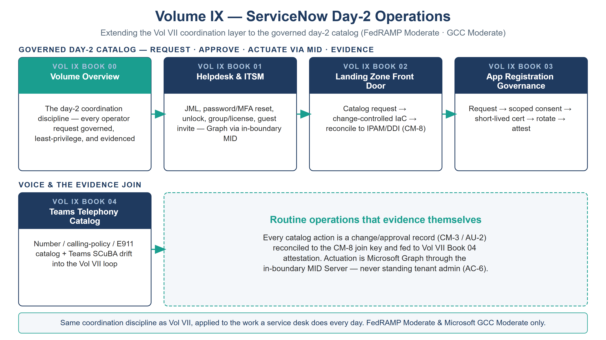

::: {.fouo-banner}
INTERNAL — NOT FOR PUBLIC DISTRIBUTION
:::

::: {.aan-warning}
## Draft Proposal — Subject to Review

This document is a **draft proposal** developed by the **CSI Team (Cloud Services Infrastructure)**. It has not been reviewed or approved by the SSA CIO Office, the Office of Information Security (OIS), or organizational leadership.

**Date Code:** 2026-07-12 15:00 ET
:::

::: {.aan-important}
**Series Context** — This is the Volume IX overview of the Federal Application-Aware Networking series. Volume VII established the ServiceNow **coordination layer** for control-compliance drift on M365 and Azure. **Volume IX extends that same layer to day-2 operations** — the governed catalog for the common Entra / M365 / Azure helpdesk tasks, the landing-zone front door, app-registration governance, and Teams telephony. Where Vol VII asks *"is this control drifting?"*, Volume IX asks *"is this operator request governed, least-privilege, and evidenced?"* — the same coordination discipline, applied to the work a service desk does every day.
:::

::: {.aan-note}
## Scope — FedRAMP Moderate & Microsoft GCC Moderate

This volume targets **FedRAMP Moderate + Microsoft GCC Moderate** exclusively (M365 GCC + Moderate-targeted Azure). Actuation is via **Microsoft Graph through the in-boundary MID Server**; other CSPs and higher boundaries are deferred, consistent with the rest of the current program.

Volume IX runs on the same ServiceNow Government Cloud coordination hub as Volume VII, which holds **FedRAMP High** authorization. The High-on-Moderate boundary treatment — why a High-authorized hub coordinating a Moderate boundary is a conservative, documented posture — is stated once in **Vol VII Book 00 §"Authorization Boundary Treatment — ServiceNow High-on-Moderate"** and inherited here without restatement.
:::

# What This Volume Addresses

Volume VII established the pattern for operating *compliance drift* as owned, evidenced work. But the highest-volume work a federal cloud team does is not drift remediation — it is **day-2 operations**: onboarding a user, resetting an authenticator, granting a group, standing up a subscription, registering an app, assigning a phone number. Done as portal clicks, each of these is an ungoverned, unevidenced change to an identity-attributed or configuration-controlled surface — exactly the gap an assessor probes.

This volume applies the Vol VII discipline to that work: **every operator request is a typed, control-mapped catalog item; the approval gate is the one the control requires; actuation is Graph through the in-boundary MID (never standing tenant admin); and every action is an audited change record reconciled to the CM-8 join key.** The result is that routine operations *produce* compliance evidence instead of eroding it.

# The Day-2 Discipline

Four rules govern every catalog item in this volume — the same coordination contract as Vol VII, expressed for request-driven work:

1. **Typed, control-mapped request.** No day-2 action is a free-text ticket or a portal click; it is a catalog item bound in the compliance spine to the NIST control it satisfies (see each book's Authorities table).
2. **The approval gate the control requires.** A password reset is identity-verified; a Conditional-Access exception needs a security approver; a privileged group is time-bound and reviewed. The gate is a property of the control, not a workflow convenience.
3. **Graph via the in-boundary MID; never standing admin.** The connector holds scoped, logged, individually-approved write — never blanket tenant administration over the estate it serves (AC-6).
4. **Audited and reconciled.** Every action emits a change/approval record (CM-3 / AU-2) reconciled to the IPAM/DDI-keyed CMDB (CM-8), feeding Vol VII Book 04 attestation.

# Books in This Volume

| Book | Title | Focus | Roadmap lane / issue |
|---|---|---|---|
| **Vol IX Book 00** | Volume Overview (this book) | The day-2 coordination discipline | — |
| **Vol IX Book 01** | Helpdesk & ITSM Catalog | JML, password/MFA reset, unlock, group/license, guest invite | Lane C · #1139 |
| **Vol IX Book 02** | Landing Zone Front Door | Catalog request → change-controlled IaC → CMDB reconcile | Lane D |
| **Vol IX Book 03** | App Registration Governance | Request → scoped consent → secret/cert lifecycle → attestation | Lane E · #1140 |
| **Vol IX Book 04** | Teams Telephony Catalog | Number/calling-policy/E911 catalog + Teams SCuBA drift | §4 · #1141 |
| **Vol IX Book 05** | SaaS Integration Governance | The Entra app gallery as a governed SA-9 event — SaaS provisioning gated on a recorded FedRAMP authorization (Lane F) | Lane F |

: Volume IX — ServiceNow Day-2 Operations {.striped .hover}

{#fig-vol9-map fig-alt="A house-style volume map for Volume IX, ServiceNow Day-2 Operations, on a white background with a navy title and the scope line 'Extending the Vol VII coordination layer to the governed day-2 catalog (FedRAMP Moderate, GCC Moderate)'. A top row labeled GOVERNED DAY-2 CATALOG — REQUEST, APPROVE, ACTUATE VIA MID, EVIDENCE holds four cards joined by teal arrows: Book 00 Volume Overview with a teal header (the day-2 coordination discipline — every operator request governed, least-privilege, and evidenced); Book 01 Helpdesk and ITSM (JML, password/MFA reset, unlock, group/license, guest invite — Graph via the in-boundary MID); Book 02 Landing Zone Front Door (catalog request to change-controlled IaC to reconcile to IPAM/DDI, CM-8); Book 03 App Registration Governance (request to scoped consent to short-lived cert to rotate to attest). A bottom row labeled VOICE AND THE EVIDENCE JOIN holds Book 04 Teams Telephony Catalog (number, calling-policy, and E911 catalog plus Teams SCuBA drift into the Vol VII loop), beside a teal dashed panel titled Routine operations that evidence themselves, noting every catalog action is a change/approval record (CM-3/AU-2) reconciled to the CM-8 join key and fed to Vol VII Book 04 attestation, with actuation via Microsoft Graph through the in-boundary MID Server — never standing tenant admin (AC-6). A footer states this is the same coordination discipline as Vol VII applied to daily service-desk work, FedRAMP Moderate and Microsoft GCC Moderate only. White background. Authored house-style diagram." width="100%"}

# Closure Necessity — Operations That Evidence Themselves

::: {.aan-tip}
## Closure Necessity — an ungoverned routine action is a standing finding
Volume IX does not re-close the identity and configuration mechanisms Volumes I, VI, and VII establish. Its necessity is operational: **the highest-frequency changes to the estate are day-2 requests, and if they are not governed, approved, least-privilege, and evidenced, they are the largest continuous source of control erosion an assessor will find.** AC-2 is not satisfied by a JML someone does by hand; IA-5 is not satisfied by a help-desk password reset with no identity proofing; AC-6 is not satisfied by a standing-admin group grant. This volume makes routine operations *produce* the evidence the authorization package needs.
:::

# How This Volume Fits the Program

Volume IX **depends on** Volume I's naming plane (the CM-8 join key), Volume VII's coordination pattern and scoped-app discipline, and Volume VI's landing-zone and identity-as-code artifacts (the IaC the landing-zone front door drives). It **produces** the audited, control-mapped operational record that Vol VII Book 04 lifts into attestation and the FedRAMP 20x KSI feed. Truth is separated from enforcement throughout: IPAM/DDI and HRIT remain the truth planes; the day-2 catalog is a coordination/enforcement plane on top of them.

# Cross-References

- **Vol VII (all books)** — the compliance-coordination layer this volume extends to day-2 work.
- **Vol I Book 04 (HRIT Identity SSOT)** — the identity source of truth the JML catalog provisions from.
- **Vol VI Book 01/02 (Landing Zone / Identity as Code)** — the IaC the landing-zone front door drives.
- **Vol I Book 06 (Federal Telecommunications Modernization)** — the telephony architecture Book 04 puts a catalog on.
- **`servicenow-day2/helpdesk-control-map.json`** — the machine-readable catalog → control binding.
- **`aan-compliance-spine.yml`** — the SSOT registering this volume (`vol-9`) and its closures.

# Provenance

This overview establishes the day-2 operations layer of the series, extending Volume VII's coordination doctrine. Functions and planes are named, not organizations; ServiceNow is the deployed coordination example; the substitution path is preserved where a workflow platform is interchangeable. Every book carries a Date Code. The volume map above is authored as committed house-style SVG, rendered to PNG at 3× for crisp `.docx` zoom; further per-book figures follow in the figure pass.
