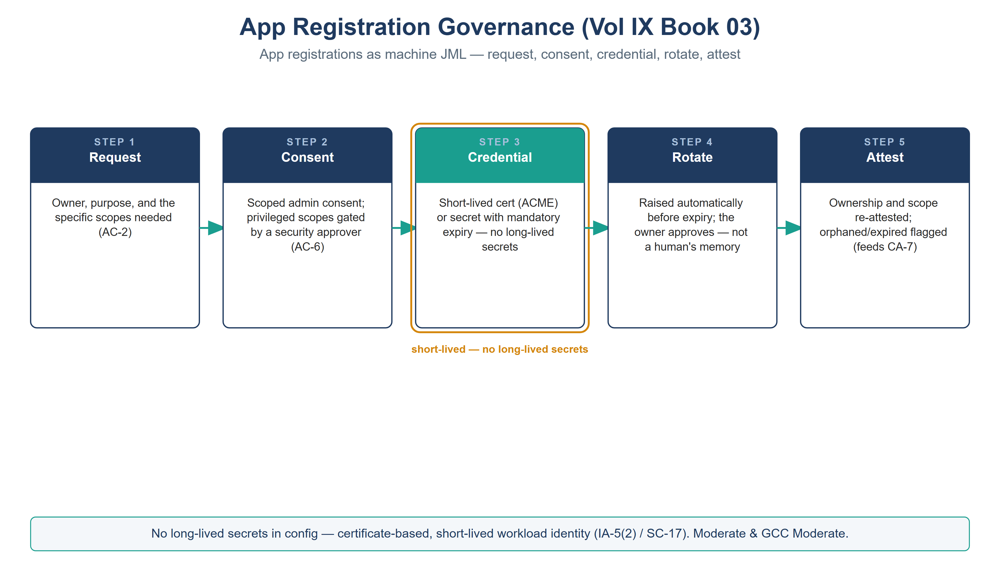

::: {.fouo-banner}
INTERNAL — NOT FOR PUBLIC DISTRIBUTION
:::

::: {.callout-warning}
## Draft Proposal — Subject to Review
Developed by the **CSI Team (Cloud Services Infrastructure)**; not yet reviewed or approved by the SSA CIO Office, OIS, or leadership. **Date Code:** 2026-07-12 15:00 ET
:::

::: {.callout-important}
**Series Context** — Volume IX Book 03. App registrations are the machine analogue of the joiner/mover/leaver lifecycle — and the largest source of long-lived-secret and over-consent risk in an Entra estate. The architecture is set (Vol I Book 03 Certificates & Tokens; Vol VI Book 02 Identity & Access as Code); this book adds the *governed lifecycle*: request, scoped consent, short-lived credentials, automated rotation, and attestation.
:::

# What This Document Addresses

An app registration is a workload identity: a service principal with credentials and consented permissions. Left ungoverned, it is where credential sprawl lives — long-lived client secrets pasted into config, over-broad admin consent granted "to make it work," and orphaned apps whose owner left months ago. Each is a standing violation of least privilege (AC-6) and secure authenticator management (IA-5).

This book governs the whole lifecycle as catalog work, closing IA-5(2), SC-17, and AC-6, and feeding Vol VII Book 04 attestation.

# The Lifecycle

{#fig-vol9b03-lifecycle fig-alt="A house-style five-step pipeline titled App Registration Governance (Vol IX Book 03), subtitle 'App registrations as machine JML — request, consent, credential, rotate, attest', on a white background. Five navy-headed cards joined left to right by teal arrows: Step 1 Request — owner, purpose, and the specific scopes needed (AC-2); Step 2 Consent — scoped admin consent, privileged scopes gated by a security approver (AC-6); Step 3 Credential, drawn with a teal header and an amber ring labeled 'short-lived — no long-lived secrets' — a short-lived certificate (ACME) or a secret with a mandatory expiry; Step 4 Rotate — automated rotation before expiry, never dependent on a human remembering; Step 5 Attest — ownership and scope re-attested, orphaned or expired registrations flagged (feeds CA-7). A footer states no long-lived secrets in config — certificate-based, auto-rotated workload identity (IA-5(2) / SC-17), Moderate and GCC Moderate. White background. Authored house-style diagram." width="100%"}

| Stage | What happens | Control |
|---|---|---|
| **1. Request** | An app-registration request captures owner, purpose, and the *specific* scopes needed | AC-2 |
| **2. Approve** | Any privileged or write scope requires a **security approver**; least privilege is the default | AC-6 |
| **3. Consent** | Scoped, admin-consented permissions only — no blanket delegation | AC-6 |
| **4. Credential** | A **short-lived certificate (ACME)** or a secret with a **mandatory expiry** — no long-lived secrets in config | IA-5(2), SC-17 |
| **5. Rotate** | Automated rotation before expiry; the app never depends on a human remembering | IA-5(2) |
| **6. Attest** | Ownership and scope re-attested on a cadence; orphaned or expired registrations flagged | AC-6, CA-7 |

::: {.callout-important}
**No long-lived secrets.** The single highest-value rule in this book: credentials are short-lived and rotated automatically. A client secret with a two-year expiry sitting in a pipeline variable is the credential an attacker wants most; certificate-based, auto-rotated identity removes the target. This is the IA-5(2) / SC-17 closure, applied to workload identity.
:::

# App Registrations Are Machine JML

The lifecycle above is deliberately the same shape as the human joiner/mover/leaver catalog (Book 01): a request with an owner, a governed change of scope, and an evidenced retirement. The **leaver** step is the one most often skipped for apps — an orphaned service principal with live credentials is exactly the ghost-credential risk that human de-provisioning is meant to close. Attestation (stage 6) is the machine-identity equivalent of an access review.

# Closure Necessity

::: {.callout-tip}
## Closure Necessity — a workload identity with no lifecycle is a permanent liability
Volume I/VI prove that certificate-based, short-lived, least-privilege credentials are the mechanism. This book makes the *lifecycle* of a workload identity governed and evidenced. Without it, app registrations accumulate long-lived secrets and over-broad consent that no scanner authored and no owner reviews — IA-5(2), SC-17, and AC-6 quietly regress with every "temporary" secret that never expires. Governing the lifecycle is what keeps the mechanism true over time.
:::

# NIST SP 800-53 Rev 5 Control Closure — Authorities Closed Here

Generated from the compliance spine (`aan-compliance-spine.yml`); not hand-edited here.

<!-- authorities:book-day2-appreg — generated from aan-compliance-spine.yml; do not hand-edit -->
| Control | Title | Closing mechanism (function, not product) | Accreditation gate | Authority drivers | Evidence slot | FedRAMP 20x KSI | Tool-attestable? |
|---|---|---|---|---|---|---|---|
| AC-6 | Least Privilege | Scoped admin consent; over-broad/privileged scopes gated by a security approver; orphaned/expired app registrations flagged for attestation | FedRAMP Moderate | NIST SP 800-53 Rev 5 | Identity | KSI-IAM | No |
| IA-5(2) | Public Key-Based Authentication | App-registration credentials issued as short-lived certs (ACME) with mandatory expiry and automated rotation — no long-lived secrets in config | FedRAMP Moderate | NIST SP 800-53 Rev 5; EO 14028 | Identity | KSI-IAM | No |
| SC-17 | Public Key Infrastructure Certificates | Certificate issuance and rotation for service principals via the governed catalog | FedRAMP Moderate | NIST SP 800-53 Rev 5 | Identity | KSI-IAM | No |

: Authorities Closed Here — App Registration Governance (request · consent · secret/cert lifecycle) († = Closure-Necessity anchor: no alternate closure path) {.striped .hover}

# Honest Limits

- Not every app supports certificate credentials; where a secret is unavoidable, the expiry is short and rotation is still automated — the exception is documented, not silent.
- Consent governance covers *new* grants; a sweep of existing over-consented apps is a one-time remediation the attestation cadence then maintains.
- Rotation depends on the certificate authority chosen in Vol I Book 03 / Vol VI Book 02; this book governs the workflow, not the CA.

# Cross-References

- **Vol I Book 03 (Certificates & Tokens)** and **Vol VI Book 02 (Identity & Access as Code)** — the cryptographic-identity architecture this book governs the lifecycle for.
- **Vol IX Book 01** — the human JML this app lifecycle mirrors.
- **Vol VII Book 04** — where attestation of app-registration ownership/scope lands (CA-7).

# Provenance

Draft. Entra app registrations, ACME, and certificate-based service-principal auth are deployed examples; the request→scoped-consent→short-lived-credential→rotate→attest discipline is the invariant. The figure above is authored as committed house-style SVG, rendered to PNG at 3× for crisp `.docx` zoom.
