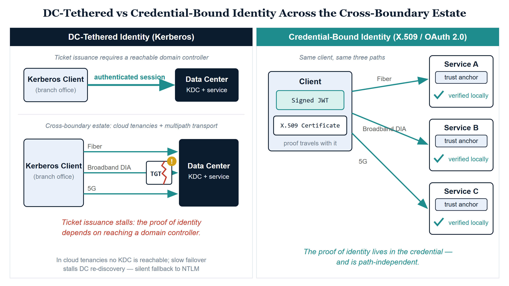
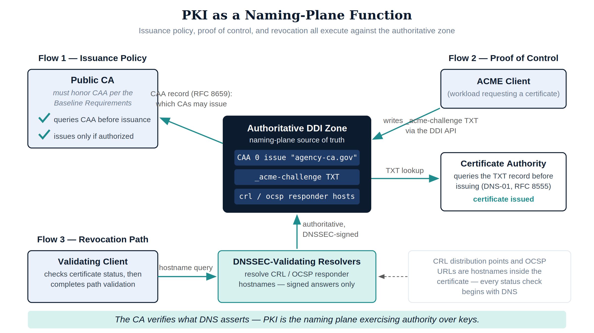
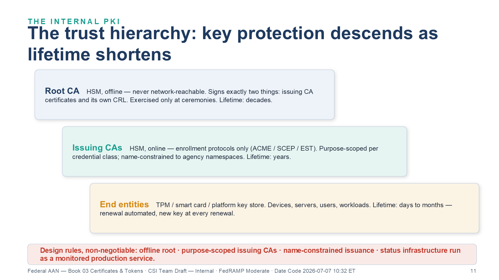
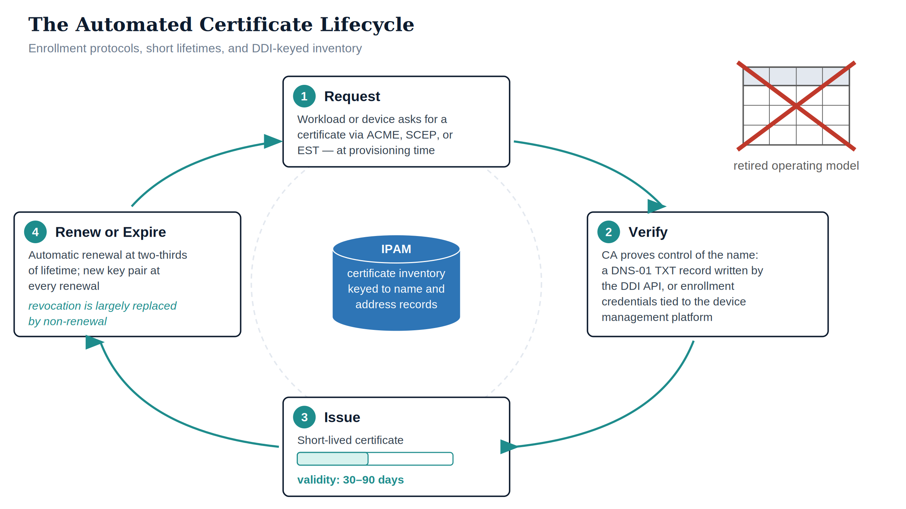
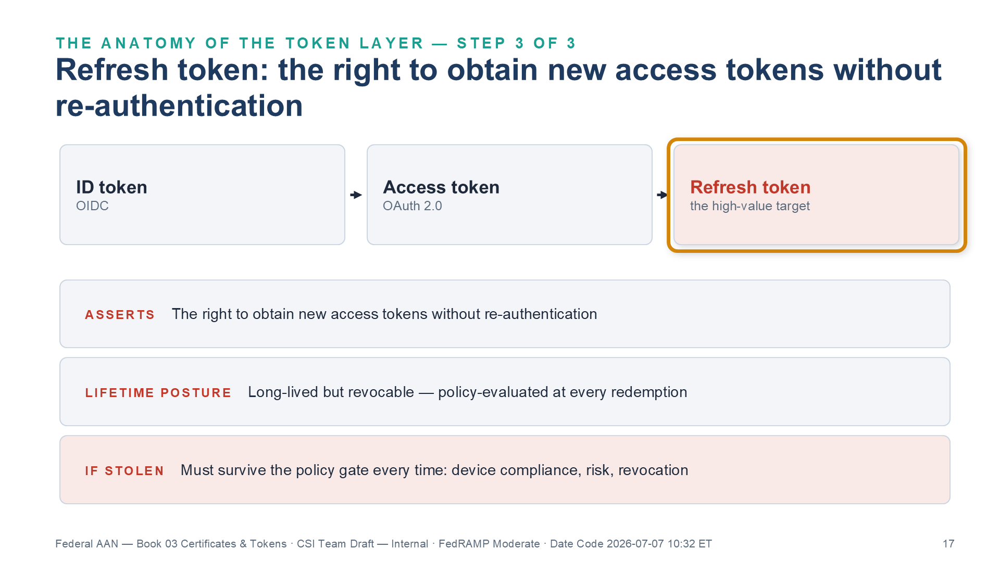
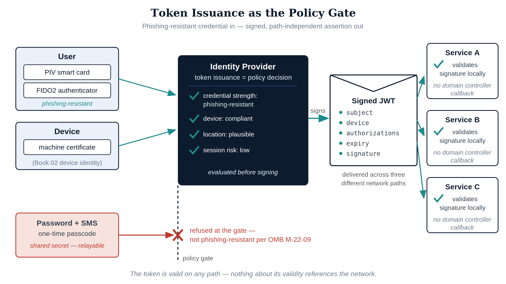
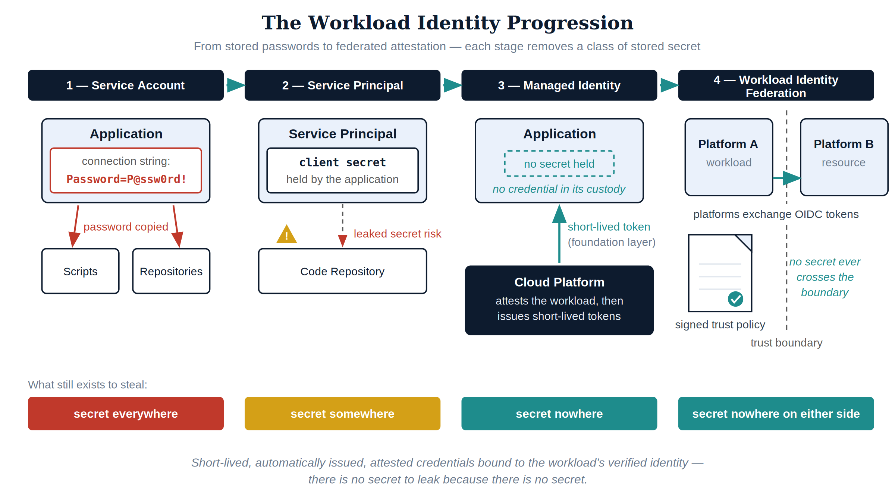
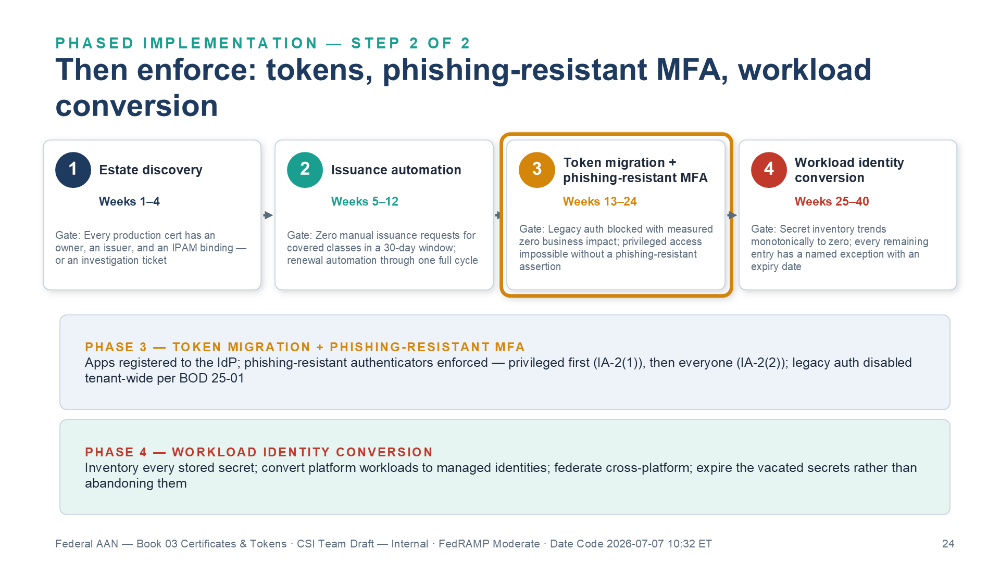

::: {.fouo-banner}
INTERNAL — NOT FOR PUBLIC DISTRIBUTION
:::

::: {.callout-warning}
## Draft Proposal — Subject to Review

This document is a **draft proposal** developed by the **CSI Team (Cloud Services Infrastructure)**. It is an attempt at a comprehensive SSA-wide technical roadmap and has not been reviewed or approved by the SSA CIO Office, the Office of Information Security (OIS), or organizational leadership. All recommendations, vendor selections, control mappings, and implementation timelines are subject to revision pending formal review by the SSA CIO Office and organizational components.

**Date Code:** 2026-07-08 16:07 ET
:::

::: {.callout-important}
**Series Context** — This document is Vol I Book 03 of the Federal Application-Aware Networking series. [Vol I Book 01](Vol_I_Book_01_FedAAN_SSA_Landing_Zone_IPAM_FedRAMP.qmd) established the naming and addressing plane — authoritative DNS, DHCP, and IPAM as the landing-zone source of truth. [Vol I Book 02](Vol_I_Book_02_FedAAN_Network_Access_Control_802_1X.qmd) established device identity at the network port — 802.1X, EAP-TLS, and the machine certificate as the admission credential. This part completes the identity plane's cryptographic foundation: how certificates are issued, revoked, and automated as a function of the naming plane, and how tokens replace network sessions as the carrier of identity. [Vol II Books 01](Vol_II_Book_01_FedAAN_SQL_Server_Authentication_Modernization.qmd) and [02](Vol_II_Book_02_FedAAN_SQL_Server_Implementation_Guide.qmd) — SQL Server authentication modernization — are direct applications of the doctrine this part establishes.
:::

::: {.exec-summary}
**For decision makers: read this page first.**

Your agency's authentication architecture still assumes the network is a place. Kerberos — the protocol beneath most federal application sign-ins — proves identity by demonstrating a relationship to the network: a reachable domain controller for ticket issuance, an uninterrupted session, a network the agency controls end to end. The transport modernization your agency is executing (SD-WAN with inline inspection, direct internet access under TIC 3.0, multi-cloud landing zones) removes every one of those assumptions *on purpose*, because removing them is what makes the network fast and resilient.

**Four things this document establishes:**

1. **You cannot keep both the modern network and the legacy credential.** When session-based authentication fails on modern transport, it does not stop — it silently falls back to NTLM, a protocol that cannot be audited, cannot be gated by policy, and is replayable by attackers. Modernizing the WAN without modernizing the credential converts an unknown fraction of your authentication to your weakest protocol without anyone deciding to.

2. **Certificates are a naming-plane function, not a parallel bureaucracy.** Which authorities may issue for your names is published and enforced *in DNS* (CAA records); automated issuance proves control of a name *through DNS* (ACME DNS-01); revocation checking *resolves through DNS*. The authoritative DDI platform built in Vol I Book 01 is the issuance gate. Certificate operations belong to the same functional plane.

3. **Manual certificate management is ending by arithmetic, not by preference.** Industry policy is driving public certificate lifetimes from 398 days toward 47 days by 2029. At those lifetimes, a mid-size estate generates a renewal event faster than any ticket queue can process one. Automation is the only operating model that closes.

4. **Phishing-resistant MFA is PKI wearing a usability layer.** The only credential families federal policy accepts as phishing-resistant — PIV certificates and FIDO2 authenticators — are hardware-held key pairs bound to names. The mandates of OMB M-22-09 and BOD 25-01 are implementable exactly to the degree that this document's certificate and token architecture exists.

The controls this document addresses — IA-5(2), SC-12, SC-17, IA-2(1), IA-2(2) — each depend on the certificate and token architecture established here; every claim is demonstrated against control text and protocol behavior in the closure table at the end.
:::

# What This Document Addresses

Every book in this series ultimately depends on one substitution: **identity carried by the network path is replaced by identity carried in the credential.** Vol I Book 01 built the authoritative naming plane. Vol I Book 02 used a machine certificate to authenticate devices at the port. This book explains where those certificates come from, why they must be automated, why tokens rather than sessions must carry user and workload identity, and which NIST SP 800-53 Rev 5 controls have **no closure path that does not run through this architecture**.

The argument proceeds in five movements:

1. **Why domain-controller-tethered authentication died.** Kerberos binds identity to *KDC reachability* — a domain controller must be reachable to issue and renew tickets, and client and DC must share a clock. The modern estate breaks that dependency — not through multipath or NAT (Kerberos tolerates both: the SD-WAN overlay resequences packets and holds the transport session across path switches, and Windows omits client addresses from tickets by default *precisely because of* NAT and DHCP), but through cloud tenancies where no KDC is reachable for ticket issuance at all, and slow active-passive WAN failover that stalls domain-controller re-discovery. This is not a tuning problem — it is a protocol-versus-boundary contradiction, and its failure mode is a silent fallback to NTLM or a 30-to-45-second logon.
2. **PKI is a naming-plane function.** Certificate issuance, revocation checking, and DNS are one substrate. CAA records put issuance policy *in* DNS; ACME DNS-01 challenges make the authoritative zone the issuance gate; CRL/OCSP reachability is a DNS resolution dependency.
3. **Certificate lifecycle automation.** ACME, SCEP/EST, and short-lived certificates end the spreadsheet-tracked certificate authority — an operational model that industry lifetime policy has made arithmetically impossible to sustain.
4. **Token-based identity.** OAuth 2.0/OIDC, certificate-based authentication, and phishing-resistant MFA — the BOD 25-01 and OMB M-22-09 alignment layer.
5. **Machine and workload identity.** Service principals, managed identities, and workload identity federation — the elimination of stored secrets from the non-human identity estate.

::: {.callout-note}
**Where this sits in the Functional Plane Model** — Certificates and tokens are **identity-plane truth**. The policy enforcement plane (conditional access, ZTNA, SASE PEPs) *consumes* this truth; it does not create it. Per the series hierarchy rule: enforcement planes can be re-platformed or absorbed; truth planes can only be depended on. A conditional access policy evaluating a forged or stale identity assertion enforces the wrong answer very efficiently. This book is about making the assertion true.
:::

::: {.callout-note}
**What this document does not cover** — Directory rationalization and the authorization data model (which attributes a token should assert) are Vol I Book 05's Principle 1 territory; privileged session management built *on* these credentials is Vol III Book 01 (Privileged Access Management); the SIEM content that consumes identity telemetry is Vol III Book 06 (SIEM/XDR Detection). This document is the credential layer those parts assume: where keys come from, how they are governed, and how identity travels once it no longer rides the network session.
:::

# The Death of Session-Based, Location-Bound Authentication

## The Three Bindings Kerberos Makes

Kerberos (RFC 4120) was engineered for a network that no longer exists, and its engineering was excellent *for that network*. A client obtains a ticket from a Key Distribution Center, presents it to a service, and the service validates it — all across a flat LAN measured in single-digit milliseconds. To make that work, Kerberos binds identity three ways:

| Binding | What Kerberos Assumes | What the Modern Transport Provides |
|---|---|---|
| **Session binding** | The authenticated exchange rides one stateful, continuous connection between client and service | The SD-WAN overlay itself preserves the stream — it resequences multipath packets and holds the transport session across path switches. What interrupts session state is what sits *on* the modern path: inline inspection, NAT rebinding, and decrypt/re-encrypt middleboxes |
| **Location binding** | A domain controller is reachable within sub-5 ms round-trip; the client and the KDC share a network | Workloads span on-premises virtualization, two hyperscale government clouds, and an externally managed tenancy; the KDC is co-located with none of them — and while service-side ticket validation is offline, ticket *issuance and renewal* require that reachability |
| **Time binding** | Client and KDC clocks agree within five minutes | The only binding that survives — NTP disciplining is solvable everywhere |

: The three bindings of session-based authentication and their fate on modern transport {.striped .hover}

Two of the three bindings fail on the modern estate — not because the overlay mishandles packets, but because the estate now spans inspection points and trust boundaries the protocol never contemplated. That is the structural point: **the transport and boundary modernization mandated by TIC 3.0 and demonstrated in [Vol I Book 05](Vol_I_Book_05_FedAAN_Network_Modernization.qmd) is incompatible with the authentication model most federal application estates still run.** You cannot keep both.

## What the Modern Path Does to a Session-Bound Ticket

[Vol I Book 05](Vol_I_Book_05_FedAAN_Network_Modernization.qmd) develops this argument in full — the security-stacking history in which inline proxies, NAT tiers, and stacked firewalls broke Kerberos sessions across the 2010s, and why the cross-boundary estate finishes the job. The load-bearing facts, restated:

- Under **active-passive failover**, a Kerberos exchange that is mid-flight when a path fails times out over several seconds — the "logon takes 45 seconds" symptom field offices report.
- Under **active-active multipath**, packets of one conversation traverse multiple physical paths simultaneously by design. The overlay resequences them into one ordered stream, and a transport-layer path switch costs roughly 50 ms. The *transport* problem is solved — multipath itself does not break a Kerberos exchange.
- But the authentication contract is not solved, because the modernized path is not just plural — it is *inspected, translated, and boundary-spanning*. A protocol that binds its proof of identity to the continuity of a network session inherits every discontinuity the session suffers — every NAT rebind, every inline decrypt/re-encrypt, every stateful device that sees only half a flow. And a protocol whose ticket issuance and renewal require a reachable KDC cannot issue tickets in a cloud tenancy that has no path to one, however healthy the transport. Token-based authentication survives all of these, because the proof travels *in the credential*, not in the connection.

{#fig-ct01 fig-alt="Two-panel comparison diagram. Left panel labeled DC-Tethered Identity shows a Kerberos client that must reach a domain controller to obtain a ticket; when the estate spans cloud tenancies where no KDC is reachable and slow active-passive failover paths, the ticket-issuance step stalls, with a red annotation reading the proof of identity depended on reaching a domain controller, and the modern estate removes that reach. Right panel labeled Credential-Bound Identity shows the same client presenting a signed JWT token and an X.509 certificate directly to services across all three paths — fiber, broadband DIA, and 5G — each service verifying the signature locally against a trust anchor with green checkmarks, annotated the proof of identity lives in the credential and is transport-independent. Navy, teal, amber palette on white background." width="100%"}

## The Fallback Nobody Chose

When Kerberos cannot complete — unreachable KDC, missing SPN, clock skew — Windows does not fail closed. It falls back to NTLM. [Vol II Book 01](Vol_II_Book_01_FedAAN_SQL_Server_Authentication_Modernization.qmd) documents what that means for the database estate: authentication that cannot be audited at the token level, cannot be gated by conditional access, and is replayable via pass-the-hash. The fallback is silent, which means **an agency that modernizes its WAN without modernizing its credential architecture does not keep Kerberos — it converts an unknown fraction of its authentication traffic to NTLM without anyone deciding to.**

BOD 25-01's secure configuration baselines and OMB M-22-09 both point the same direction: legacy authentication off, modern token-based authentication on, phishing-resistant MFA underneath it. The remainder of this book is the architecture that makes those directives implementable rather than aspirational.

## The Property Table

The full comparison, stated as protocol properties rather than preferences — each row is checkable against protocol behavior, which is what the series' consistency rules require of every claim:

| Property | Session-Based (Kerberos/NTLM) | Credential-Based (X.509 / OAuth 2.0 / OIDC) |
|---|---|---|
| Proof of identity lives in | The authenticated network session | The signed credential itself |
| Verification requires | Reachable KDC at ticket issuance and renewal (service-side validation is offline against the service's key — the dependency is the issuance path, not a per-request callback) | Local signature check against published trust anchors and keys |
| Survives path switch / NAT rebind | Path switch: yes at the transport layer (the overlay resequences); NAT rebind and stateful-middlebox session breaks: no | Yes — nothing about validity references the path |
| Survives inline decrypt/re-encrypt | No — the middlebox is a session break | Yes — the assertion is opaque to the path |
| Works across boundaries the agency does not control | No — requires domain reachability | Yes — requires only the issuer's published keys |
| Failure mode | Silent fallback to a weaker protocol (NTLM) | Explicit denial at the policy gate |
| Policy evaluation point | At initial ticket grant, then inert | At every issuance and every refresh-token redemption |
| Audit granularity | Logon events without cryptographic binding | Per-token, per-scope, per-device structured events |
| Latency dependency | Sub-5 ms round-trip assumption to the KDC | None beyond the request itself |

: Session-based versus credential-based identity as protocol properties {.striped .hover}

> **The one-sentence version:** the network stopped being a place, so identity can no longer be proof of place. Identity must be proof of *key possession* — a certificate or a token, verified by signature, valid anywhere the mathematics is valid, which is everywhere.

## Why This Cannot Be Patched

Three remediation strategies are regularly proposed to keep session-based authentication alive on modern transport. Each fails for a structural reason, and naming the reason matters because the series' Closure Necessity doctrine requires it:

- **"Pin authentication traffic to a single path."** SD-WAN overlays can steer an application class onto one transport. But pinning authentication to a single path re-creates the active-passive failure mode for exactly the traffic least able to tolerate it, forfeits the multipath resilience the agency bought, and does nothing about the inline inspection and NAT that broke sessions before multipath existed. The remedy un-modernizes the WAN for the benefit of a 1999 protocol.
- **"Deploy read-only domain controllers everywhere."** Replicating KDCs to every branch and cloud region restores the location binding by copying the location everywhere. It multiplies the credential estate's attack surface (every KDC replica is a Tier-0 asset), does not fix session binding at all, and is impossible in environments the agency does not control — the externally managed tenancy has no domain controller and never will.
- **"Extend the domain into the cloud."** Site-to-site tunnels carrying domain traffic to cloud regions recreate the hairpin that [Vol I Book 05](Vol_I_Book_05_FedAAN_Network_Modernization.qmd)'s physics argument closed: authentication round-trips ride the tunnel back to wherever the domain controllers live, re-importing the latency floor into every logon. The tunnel moves the problem; it cannot shorten the distance.

Every patch preserves the premise — that identity is proven by network relationship — and the premise is what died. The remediation is not a better session; it is a credential that does not need one.

# PKI as a Naming-Plane Function

## A Certificate Is a Naming Claim

Strip the ceremony away and an X.509 certificate is one sentence: *the holder of this private key is entitled to this name.* The name — a DNS name in a subject alternative name entry, a service principal name, a device identifier mapped to a directory object — comes from the naming plane. The key comes from the subject. The certificate authority's entire job is to verify that the entity requesting the binding actually controls the name.

That verification is a **DNS operation.** This is the fact that makes PKI a naming-plane function rather than a parallel bureaucracy:

- **CAA records (RFC 8659)** publish issuance policy *in the zone itself*. A Certification Authority Authorization record declares which CAs are authorized to issue for a domain, and public CAs are required by the CA/Browser Forum Baseline Requirements to check and honor CAA at issuance time. Issuance policy enforcement is therefore a property of the authoritative DNS zone — the zone [Vol I Book 01](Vol_I_Book_01_FedAAN_SSA_Landing_Zone_IPAM_FedRAMP.qmd) placed under unified DDI control. A policy memo asks CAs nicely; a CAA record is checked by protocol.
- **ACME DNS-01 challenges (RFC 8555)** prove control of a name by provisioning a `_acme-challenge` TXT record that the CA queries before issuing. Only an entity with write access to the authoritative zone can complete the challenge. The authoritative DNS server — the DDI platform — is literally the gate through which automated issuance passes.
- **Revocation checking is a resolution dependency.** CRL distribution points and OCSP responder addresses are URLs inside the certificate; every validation that checks certificate status begins with a DNS query. An agency whose resolvers fail has not lost name lookup — it has lost the ability to *authenticate anything* whose validation requires a status check. DNSSEC validation on those lookups (Vol I Book 01, SC-20/21) protects the revocation path itself from spoofing.

{#fig-ct02 fig-alt="Architecture diagram with the authoritative DDI zone at center shown as the naming-plane source of truth. Three labeled flows radiate from it. Flow one, Issuance Policy: a CAA record in the zone pointing to a public CA icon with a checklist labeled CA must honor CAA per Baseline Requirements. Flow two, Proof of Control: an ACME client provisioning an acme-challenge TXT record via the DDI API, with the CA querying the record before issuing a certificate. Flow three, Revocation Path: a validating client resolving CRL and OCSP responder hostnames through DNSSEC-validating resolvers before completing certificate path validation. A caption reads: the CA verifies what DNS asserts — PKI is the naming plane exercising authority over keys. Navy, teal, amber palette." width="100%"}

## One Substrate, Three Consumers

This framing is not aesthetic — it dictates ownership of function. Because issuance authorization (CAA), issuance proof (DNS-01), and validation reachability (CRL/OCSP resolution) all execute against the authoritative zone, **certificate operations belong to the same functional plane as DNS, DHCP, and IPAM.** The series has already met the consumers:

| Consumer | Certificate Function | Series Home |
|---|---|---|
| Device identity at the port | Machine certificates enrolled via SCEP at device provisioning, validated by RADIUS/EAP-TLS | [Vol I Book 02](Vol_I_Book_02_FedAAN_Network_Access_Control_802_1X.qmd) |
| Workload transport identity | Server and service certificates issued at IP allocation time, revoked atomically at decommission | [Vol I Book 01](Vol_I_Book_01_FedAAN_SSA_Landing_Zone_IPAM_FedRAMP.qmd) |
| User and application authentication | Certificate-based authentication and token signing keys | This book, applied in [Vol II Books 01](Vol_II_Book_01_FedAAN_SQL_Server_Authentication_Modernization.qmd)–[02](Vol_II_Book_02_FedAAN_SQL_Server_Implementation_Guide.qmd) |

: Certificate consumers across the series {.striped .hover}

When Vol I Book 01 described a workload spin-up that allocates an IP, creates DNS A/PTR records, and enrolls a machine certificate in one automated transaction, that was this doctrine in motion: **name, address, and key bound together at birth, revoked together at death.** A certificate tracked separately from the naming plane is a certificate whose name can silently stop being true.

::: {.callout-note}
**Cross-Book Link — The Same Binding for NAC-Enrolled Endpoints (Vol I Books 01 and 02):**
The "name, address, and key bound together" compound guarantee applies equally to **NAC-enrolled endpoint devices**:

- [Vol I Book 02](Vol_I_Book_02_FedAAN_Network_Access_Control_802_1X.qmd) covers the machine certificate side — Intune/SCEP enrollment issues a certificate with `CN={{DeviceName}}` at 802.1X admission.
- [Vol I Book 01](Vol_I_Book_01_FedAAN_SSA_Landing_Zone_IPAM_FedRAMP.qmd) owns the DNS hostname side — the InfoBlox DHCP lease assignment should confirm or create a DNS A/PTR record binding the device's name to its admitted IP.

The bridging proposition — that **every NAC-admitted endpoint has both a DNS hostname and a machine certificate, and that InfoBlox holds the authoritative binding record** — is currently a design gap across the series. The intent is that this compound guarantee holds for both cloud workloads (IP allocation → DNS A → SCEP) and for endpoint devices (Intune enrollment → machine cert → DNS A confirmation at DHCP lease). OIS must validate this design and the SCEP-to-DNS linkage implementation before it is treated as a closed control.
:::

## The Internal Trust Hierarchy

Public CAs cover names the public Internet must trust. Everything else — device certificates, internal service listeners, user authentication certificates, token-signing keys — chains to the agency's internal hierarchy. The design rules are few and non-negotiable:

- **An offline root.** The root CA signs exactly two things — issuing CA certificates and its own CRL — and spends its life powered off, its key in a hardware security module, exercised only at ceremonies. The root is a trust anchor under SC-17(b); its compromise is unrecoverable short of re-establishing trust on every relying party in the estate, which is why it is never network-reachable.
- **Purpose-scoped issuing CAs.** Separate issuing CAs (or at minimum separate certificate profiles with disjoint extended key usage) for device identity, server transport, and user authentication. Scoping limits the blast radius of an issuing-CA compromise to one credential class and makes trust-store policy expressible: the RADIUS infrastructure of [Vol I Book 02](Vol_I_Book_02_FedAAN_Network_Access_Control_802_1X.qmd) trusts the device-identity chain, not every certificate the agency ever minted.
- **Name-constrained issuance.** Issuing CAs carry name constraints limiting them to the agency's namespaces. A constrained CA that is compromised can still only issue for names the constraint permits — the naming plane exerting authority even over a subverted issuer.
- **Status infrastructure as production service.** CRL distribution points and OCSP responders are highly available, monitored services whose hostnames live in DNSSEC-signed zones. Relying parties additionally maintain local revocation caches — the IA-5(2)(b)(2) requirement — so that a status-infrastructure outage degrades to cached answers rather than to authentication failure or, worse, to silently skipped checking.

| Tier | Key Protection | Network Posture | Signs | Lifetime Order |
|---|---|---|---|---|
| Root CA | HSM, offline | Never connected | Issuing CA certificates, root CRL | Decades |
| Issuing CAs | HSM, online | Enrollment protocols only (ACME/SCEP/EST) | End-entity certificates, CRLs, OCSP responses | Years |
| End entities | TPM / platform key store / smart card | N/A | Authentication and transport exchanges | Days to months |

: The internal trust hierarchy — key protection descends as lifetime shortens {.striped .hover}

{#fig-ct06 fig-alt="Cascading three-tier diagram of the internal PKI trust hierarchy. Tier 1, Root CA: HSM, offline, never network-reachable; signs exactly two things — issuing CA certificates and its own CRL; exercised only at ceremonies; lifetime decades. Tier 2, Issuing CAs: HSM, online, enrollment protocols only (ACME, SCEP, EST); purpose-scoped per credential class and name-constrained to agency namespaces; lifetime years. Tier 3, End entities: TPM, smart card, or platform key store; devices, servers, users, workloads; lifetime days to months with automated renewal and a new key at every renewal. Red banner: design rules, non-negotiable — offline root, purpose-scoped issuing CAs, name-constrained issuance, status infrastructure run as a monitored production service. White background. Source: Vol I Book 03 Certificates & Tokens briefing deck, Date Code 2026-07-07 10:32 ET." width="100%"}

> **Closure Necessity — SC-17 certificate issuance under policy.** SC-17 requires certificates to be issued under an organization-defined certificate policy and requires trust stores to contain only approved trust anchors. A written certificate policy constrains no one at the moment of issuance; the only machine-enforced expression of issuance policy is the CAA record in the authoritative zone, checked by protocol at every public issuance, paired with an internal CA whose enrollment gates (SCEP/EST/ACME) execute against the same authoritative naming plane. There is no scanner, memo, or procurement clause that prevents an unauthorized issuance after the fact — only the naming plane can refuse it before the fact.

# Certificate Lifecycle Automation — The End of the Spreadsheet CA

## The Failure Mode Being Retired

The legacy operating model for federal certificate management is a spreadsheet: a list of certificates, expiry dates, owning contacts, and renewal reminders maintained by hand. Its failure modes are so uniform they are practically a curriculum:

- **The expiry outage.** A certificate expires because the reminder went to a departed employee's mailbox. The application fails closed at 2 a.m. The post-incident action item is a better spreadsheet.
- **The unknown certificate.** A scan finds a certificate on a production listener that appears in no inventory. Nobody knows which CA issued it, who holds the private key, or what breaks if it is revoked. It is left alone, which is the worst available answer.
- **The immortal key.** A service has presented the same key pair for six years across three re-issuances because renewal reused the CSR. Key compromise anywhere in that window is compromise everywhere in it.

These are not staffing failures. They are the arithmetic of manual custody at machine scale: an estate of thousands of certificates with lifetimes measured in weeks cannot be operated by calendar reminders even in principle.

## The Arithmetic Just Got Worse — Deliberately

The CA/Browser Forum has adopted a schedule that reduces the maximum validity of publicly trusted TLS certificates from 398 days stepwise down to **47 days by 2029**, with the first reductions already in force in 2026. The browser ecosystem is doing this *on purpose*: short-lived certificates shrink the window in which a mis-issued or compromised certificate is useful, and they reduce the load-bearing role of revocation (a 30-day certificate is "revoked" by simply not renewing it). The policy consequence for agencies is blunt:

> **At 47-day lifetimes, manual certificate management is not risky — it is impossible.** An estate of 2,000 certificates renewing every 47 days generates a renewal event roughly every 34 minutes, around the clock. No ticket queue processes that. Automation is not a maturity milestone; it is the only arithmetic that closes.

## The Automation Stack

{#fig-ct03 fig-alt="Circular lifecycle diagram with four stations: Request, where a workload or device asks for a certificate via ACME, SCEP, or EST at provisioning time; Verify, where the CA proves name control through a DNS-01 TXT record written by the DDI API or through enrollment credentials tied to the device management platform; Issue, showing a short-lived certificate with a 30 to 90 day validity bar; and Renew or Expire, showing automatic renewal at two-thirds of lifetime with an annotation that revocation is largely replaced by non-renewal. At center, an IPAM database icon labeled certificate inventory keyed to name and address records. A crossed-out spreadsheet icon sits outside the circle labeled retired operating model. Navy, teal, amber palette." width="100%"}

The replacement stack has three layers, all already procured by an agency that built Vol I Books 01–02:

1. **Enrollment protocols.** ACME (RFC 8555) for anything that can complete an HTTP-01 or DNS-01 challenge; SCEP or EST for managed devices enrolled through the device management platform (the Vol I Book 02 pipeline); platform-native issuance for cloud workloads. In every case the credential arrives at provisioning time, without a human in the loop.

   | Protocol | Proof of Entitlement | Primary Consumers | Naming-Plane Dependency |
   |---|---|---|---|
   | ACME (RFC 8555) | DNS-01 TXT record or HTTP-01 token at the name being certified | Web listeners, load-balanced services, anything with a resolvable name | The DDI API writes the challenge record; the authoritative zone is the gate |
   | SCEP | Enrollment challenge delivered through the device management channel | Managed endpoints, network devices (the Vol I Book 02 machine certificates) | Device record and certificate bound to the IPAM inventory object |
   | EST (RFC 7030) | TLS-authenticated enrollment, including re-enrollment on an existing certificate | Infrastructure and IoT/OT devices requiring certificate-authenticated renewal | Same inventory binding; renewal authenticated by the expiring credential |
   | Platform-native issuance | Cloud control-plane attestation of the workload | Managed identities, platform-issued transport certificates | Name and identity issued in the same provisioning transaction |

   : Enrollment protocols and their naming-plane dependencies {.striped .hover}
2. **Short lifetimes as policy.** Internal CA profiles align with where the public ecosystem is going: lifetimes in days to low months, renewal at two-thirds of lifetime, new key pair at every renewal. Short lifetimes convert revocation from an emergency procedure into a default behavior — the certificate that is not renewed is the certificate that is revoked.
3. **Inventory as a DDI attribute.** Every certificate is recorded against the IPAM object for the name and address it serves — issuer, serial, expiry, enrollment protocol, and the automation that renews it. The certificate inventory is not a new system; it is a column set on the authoritative inventory that CM-8 already requires. An unknown certificate becomes a *detectable* condition: a listener presenting a certificate with no corresponding IPAM record is, by definition, drift.

## Revocation in a Short-Lived World

Short lifetimes change what revocation is *for*. With multi-year certificates, revocation carries the entire burden of undoing a bad issuance or a compromised key — and it carries it badly: CRLs grow monotonically, OCSP adds a per-connection dependency, and many clients soft-fail when status infrastructure is unreachable, which converts the revocation check into a formality an on-path attacker can suppress. The modern division of labor:

- **Expiry does the routine work.** A 30-day certificate that stops renewing is functionally revoked within days, with no status query involved. The overwhelming majority of "revocations" — decommissioned services, role changes, superseded keys — become non-renewals executed by the same automation that issued the credential.
- **Revocation does the emergency work.** Confirmed key compromise still triggers actual revocation, published to CRL/OCSP immediately, *and* the compensating actions that matter more at short lifetimes: the automation re-keys and re-issues the affected identity in minutes, and the old certificate ages out shortly regardless.
- **OCSP stapling inverts the reachability dependency.** Where supported, the certificate presenter fetches and staples its own time-stamped status proof, so the relying party validates status without its own network fetch — removing the soft-fail window and the resolver dependency from the client side of the exchange.
- **Local revocation caches are the control-text backstop.** IA-5(2)(b)(2)'s required local cache of revocation data means a status-infrastructure outage degrades gracefully instead of silently disabling checking.

## Certificate Telemetry as Evidence

Every lifecycle event — enrollment, renewal, revocation, failed challenge, expiry-without-renewal — is a structured log record streamed to the evidence plane (the SIEM/XDR architecture of Vol III Book 06). Three analytics matter operationally:

1. **Expiry horizon without renewal automation.** Any certificate inside two renewal windows of expiry with no bound renewal job is an incident *now*, not on expiry day.
2. **Issuance outside the pipeline.** A certificate observed on a listener (via the scanning estate of Vol III Book 02, Vulnerability Management) that has no corresponding enrollment record and no IPAM binding is unauthorized issuance or shadow infrastructure — either way, a finding.
3. **Challenge-failure clustering.** Repeated DNS-01 failures against one zone indicate either DDI API breakage (an availability problem) or an attempt to obtain certificates for names the requester does not control (a security problem). The same signal, triaged by source.

::: {.callout-tip}
**The operational tell that this is working:** certificate expiry disappears as an incident category, and certificate *questions* become DNS queries. "What is presenting on this name, issued by whom, expiring when?" is answered by the naming plane in one lookup — because issuance was never allowed to happen anywhere else.
:::

# Token-Based Identity — OAuth 2.0, OIDC, and Phishing-Resistant MFA

## The Token Inverts the Trust Model

Session-based authentication asks the *network* to vouch for continuity: the service trusts that the connection it authenticated is the connection still talking. Token-based authentication asks *mathematics* to vouch for the claim itself. An OAuth 2.0 / OpenID Connect token is a signed assertion — this user, this device posture, these authorizations, this time window, this signature — that any service can verify offline against the issuer's published signing keys. As [Vol I Book 05](Vol_I_Book_05_FedAAN_Network_Modernization.qmd) states: Kerberos assumes client and server are in the same room; tokens assume they are strangers on the Internet.

The properties that follow are exactly the ones the multipath analysis demanded:

- **Path independence.** The token is valid on any path, across any number of path switches, through any NAT. Nothing about its validity references the network.
- **Verification without callback.** The service validates a signature; it does not open a connection to a domain controller. The sub-5 ms location binding is gone.
- **Policy at issuance.** Every token issuance is a policy decision point: the identity provider evaluates user credential strength, device compliance (the Vol I Book 02 machine identity, surfaced as a device claim), location plausibility, and session risk *before* signing. Conditional access is the policy-enforcement plane consuming identity-plane truth — the plane separation the series hierarchy requires.
- **Audit at the token level.** Every issuance, refresh, and revocation is a structured event. This is the telemetry NTLM structurally cannot produce and that the evidence plane (Vol III Book 06, Vol IV Book 06) requires.

## The Anatomy of the Token Layer

"Token" names three artifacts with different jobs, lifetimes, and theft values. Conflating them produces bad policy; separating them makes the policy write itself:

| Artifact | Asserts | Presented To | Lifetime Posture | If Stolen |
|---|---|---|---|---|
| **ID token** (OIDC) | Who authenticated, how, and when — the authentication event itself | The requesting application, once | Minutes; consumed at sign-in | Low direct value; not an access credential |
| **Access token** (OAuth 2.0) | What the bearer may do against one resource, for a bounded window | The resource (API, database, service) on every call | Short — typically around an hour, shorter for sensitive scopes | Usable until expiry; the reason lifetimes stay short and scopes stay narrow |
| **Refresh token** | The right to obtain new access tokens without re-authentication | Only the identity provider | Long-lived but revocable, bound to the client and evaluated against policy at every redemption | The high-value target; every redemption re-enters the policy gate, so revocation and risk signals cut it off |

: The three token artifacts and their theft economics {.striped .hover}

{#fig-ct07 fig-alt="Three-chip progression diagram of the token layer: ID token (OIDC), access token (OAuth 2.0), and refresh token (highlighted, labeled the high-value target). Below, three attribute bars for the refresh token: Asserts — the right to obtain new access tokens without re-authentication; Lifetime posture — long-lived but revocable, policy-evaluated at every redemption; If stolen — must survive the policy gate every time: device compliance, risk, revocation. White background. Source: Vol I Book 03 Certificates & Tokens briefing deck, Date Code 2026-07-07 10:32 ET." width="100%"}

Two engineering consequences follow. First, **the policy gate runs more than once**: refresh-token redemption re-evaluates conditional access, so a device that falls out of compliance or a user whose risk score spikes loses access at the next refresh — continuous access evaluation tightens this further by pushing revocation events to resources between refreshes. Second, **token signing keys are SC-12 objects**: the identity provider's signing keys, published for verification and rotated on schedule, are cryptographic keys whose generation, rotation, and retirement follow the same lifecycle discipline as every certificate in this book. Relying services fetch current keys from the issuer's published metadata; key rotation is invisible to applications *because* verification was built against the published set, not against a hardcoded key — the same "automation, not custody" doctrine, applied to the trust fabric itself.

## Certificate-Based Authentication and Phishing-Resistant MFA

Tokens answer *how identity travels*. The credential ceremony underneath them — how the human proves presence to the identity provider — is where federal policy has drawn its sharpest line. OMB M-22-09 requires phishing-resistant MFA for agency staff, contractors, and partners; BOD 25-01's secure configuration baselines for the federal cloud productivity estate enforce modern authentication and the retirement of legacy protocols that bypass it.

"Phishing-resistant" is a protocol property, not a marketing adjective. It means **verifier-impersonation resistance**: the credential cannot be replayed to the identity provider by a look-alike site, because the authentication is cryptographically bound to the origin or channel it terminates in. Exactly two credential families in general federal deployment have this property:

| Credential | Mechanism | Why It Cannot Be Phished |
|---|---|---|
| **PIV / smart card (certificate-based authentication)** | Private key on hardware token; authentication is a signature over a challenge bound to the TLS channel | The key never leaves the card; a proxied challenge fails channel binding; there is no shared secret to capture |
| **FIDO2 / WebAuthn platform or roaming authenticator** | Origin-bound key pair per relying party; the browser signs the *actual* origin into the assertion | A credential registered to the legitimate origin produces an assertion a look-alike origin cannot use; the phishing site receives a signature for the wrong name |
| One-time passcodes, push approval, SMS | Shared secret or human approval relayed out of band | *Not phishing-resistant* — the human can be induced to relay the secret or approve the attacker's session; excluded by M-22-09 for this reason |

: Credential families and verifier-impersonation resistance {.striped .hover}

Note what both phishing-resistant rows have in common: **they are certificates and key pairs.** Certificate-based authentication *is* PKI applied to the user; WebAuthn is PKI with per-origin key issuance. The naming-plane doctrine of this book does not stop at TLS listeners — the human credential layer is the same cryptography, bound to names (origins, principals) the same way.

{#fig-ct04 fig-alt="Left-to-right flow diagram. On the left, a user presents a PIV smart card or FIDO2 authenticator, and the device presents its machine certificate from Book 02. Both feed into a central identity provider box labeled token issuance equals policy decision, with an evaluation checklist: credential strength phishing-resistant, device compliant, location plausible, session risk low. Output on the right is a signed JWT shown as a sealed envelope with claims listed — subject, device, authorizations, expiry, signature — flowing to three relying services across different network paths, each validating the signature locally without contacting a domain controller. A rejected branch below shows a password-plus-SMS attempt refused at the gate, labeled not phishing-resistant per OMB M-22-09. Navy, teal, amber palette." width="100%"}

## Token Theft Is the New Credential Theft — and It Is a Smaller Problem

Moving identity into tokens does not end credential attacks; it relocates them. An attacker who cannot phish a FIDO2 assertion will attempt to steal the *token* — from process memory, from a compromised endpoint, from an intercepted session. Honest accounting requires stating both halves:

- **The exposure is real.** A bearer token is usable by whoever bears it. Stolen access tokens work until expiry; stolen refresh tokens work until revoked or rejected by policy.
- **The exposure is structurally smaller than what it replaced.** A stolen password is durable, reusable everywhere it was reused, and invisible in use. A stolen access token is scoped to one resource, dead within the hour, and every use is a logged, attributable event. A stolen refresh token must survive the policy gate at every redemption — device compliance claims it cannot fake (the Vol I Book 02 machine identity surfacing as a token claim), location and risk evaluation, and revocation that takes effect at the next redemption rather than at the next password reset campaign.
- **The countermeasures are the rest of this series.** Endpoint protection and posture (Vol I Book 02, Vol III Book 01) shrink the theft surface; token-level telemetry (Vol III Book 06) makes anomalous use detectable — a token minted to one device presenting from another is a high-fidelity signal that password architectures could never emit; proof-of-possession binding, where supported, ties the token to a key the bearer must hold, converting the bearer artifact back into a cryptographic one.

The correct summary is not "tokens cannot be stolen." It is: **the token architecture bounds what theft buys — in scope, in time, and in silence — and each bound is a protocol property, not a promise.**

> **The dependency that makes this a series, not a shopping list:** the token asserts authorizations; the authorizations must be *true*. Vol I Book 05's Principle 1 — restore a single source of truth — is a precondition, not a preference: an identity provider signing group memberships inherited from twelve drifted regional directory trees produces well-formed tokens asserting broken facts. Cryptography transports truth; it does not manufacture it.

# Federal Policy Alignment

The architecture in this book is not one option among several for satisfying the identity mandates — the mandates were written assuming it. The mapping, directive by directive:

| Directive / Framework | What It Requires | What in This Book Satisfies It |
|---|---|---|
| **OMB M-22-09** (Federal Zero Trust Strategy) | Phishing-resistant MFA for agency staff, contractors, and partners; enterprise identity systems; per-request authorization | PIV/CBA and FIDO2 as the enforced credential families; token issuance as the per-request policy gate |
| **CISA BOD 25-01** (Implementing Secure Practices for Cloud Services) | SCuBA secure configuration baselines for the federal cloud productivity estate, including modern authentication and retirement of legacy protocols | Phase 3's legacy-authentication shutdown; token-based authentication as the only remaining path through the identity provider |
| **NIST SP 800-207** (Zero Trust Architecture) | Access decided per-session by policy, using identity, device, and context signals; no implicit trust from network location | Tokens as the per-session decision artifact; device certificates (Vol I Book 02) surfaced as claims; location removed from the trust calculus entirely |
| **NIST SP 800-63** (Digital Identity Guidelines) | Authenticator assurance levels; verifier-impersonation resistance at the highest assurance level | Hardware-held, origin/channel-bound key pairs — the only authenticator class that satisfies verifier-impersonation resistance |
| **CISA Zero Trust Maturity Model v2.0** — Identity pillar | Advanced/Optimal maturity requires phishing-resistant MFA and continuous validation with automated identity lifecycle | The full stack of this book: automated credential lifecycle, phishing-resistant enforcement, continuous access evaluation |
| **FedRAMP 20x** (Consolidated Rules, 2026) | Continuous, machine-readable KSI evidence rather than periodic assessment | Every issuance, renewal, token grant, and policy evaluation is a structured event; the identity plane's evidence stream binds to slot-01 (see KSI alignment below) |

: Directive-to-mechanism mapping for the cryptographic identity layer {.striped .hover}

::: {.callout-note}
**Reading the table honestly** — none of these directives names a product, and this book names products only as examples of functions. What the directives *do* name are protocol properties: phishing resistance, per-session decisions, machine-readable evidence, elimination of implicit network trust. Protocol properties are exactly what cannot be procured as adjectives; they exist where the mechanism exists. That is why this table maps each requirement to a mechanism rather than to a purchase.
:::

# Machine and Workload Identity

## The Non-Human Majority

In a modernized federal environment, human authentications are a rounding error. Every application-to-database connection, every pipeline deployment, every API call between services, every scheduled job authenticates — and historically, each did so with the worst credential in the estate: a service account password, stored in a connection string, rotated never, known to an unknowable set of people and scripts. The workload identity progression retires this in three steps, each removing a class of stored secret:

| Generation | Credential | What Still Exists to Steal | Residual Failure Mode |
|---|---|---|---|
| **Service account** | Password in configuration | The password, everywhere the configuration goes | Pass-the-hash, credential sprawl, rotation outages |
| **Service principal with secret or certificate** | Client secret or certificate held by the application | The secret/key material, in the application's custody | Leaked secrets in code repositories; expiry outages |
| **Managed identity** | Platform-issued token; no credential in application custody | Nothing in the application; the platform attests the workload | Compromise requires compromising the workload itself — which is the irreducible case |
| **Workload identity federation** | External workload exchanges its own platform's OIDC token for access; no secret crosses the boundary | Nothing stored on either side | Trust misconfiguration — governed as policy, not as secret custody |

: The workload identity progression — each step removes a class of stored secret {.striped .hover}

{#fig-ct05 fig-alt="Four-stage left-to-right progression diagram. Stage one shows an application with a password visibly embedded in a connection string and red arrows showing the password copied into scripts and repositories. Stage two shows a service principal holding a client secret with a warning icon on a code repository. Stage three shows a managed identity: the application box contains no credential at all, and the cloud platform beneath it issues short-lived tokens after attesting the workload, drawn as a foundation layer. Stage four shows workload identity federation: two cloud platforms exchange OIDC tokens across a trust boundary with a signed trust-policy document icon and the caption no secret ever crosses the boundary. A progress bar underneath labels the stages: secret everywhere, secret somewhere, secret nowhere, secret nowhere on either side. Navy, teal, amber palette." width="100%"}

The direction of travel is the same one the SPIFFE model formalizes for platform-agnostic environments: **short-lived, automatically issued, attested credentials bound to a workload's verified identity rather than to a stored secret.** Whether the implementation is a cloud platform's managed identity, federation between platforms' token issuers, or a SPIFFE-style identity document, the doctrine is identical — the workload's identity is *attested by the platform that runs it*, at runtime, and expires in minutes. There is no secret to leak because there is no secret.

## Where Keys Live

The workload progression works only if private keys are held somewhere theft-resistant. The storage hierarchy is a policy decision made once and enforced by enrollment profiles — the certificate template or identity platform simply refuses to issue to software-held keys where hardware exists:

| Key Class | Storage | Non-Exportability | Applies To |
|---|---|---|---|
| Trust anchors, issuing CA keys, token-signing keys | HSM (FIPS 140-validated) | Hardware-enforced; keys are used, never read | The trust fabric itself |
| Device and user credentials | TPM / smart card / platform authenticator | Hardware-enforced; attestation available at enrollment | Vol I Book 02 machine certificates, PIV, FIDO2 |
| Workload transport and application keys | Platform key service / managed key vault | Platform-enforced; access is an audited API call under its own policy | Service certificates, application secrets in transition |
| Ephemeral session and federation keys | Memory, minutes-scale lifetime | Lifetime is the control | Token exchange, TLS session keys |

: Key storage descends in ceremony as lifetime descends in duration {.striped .hover}

The pattern repeats the trust-hierarchy rule from the PKI section: **the longer a key lives and the more it signs, the deeper in hardware it sits.** Enrollment-time attestation — the platform proving the key was generated in hardware before the CA issues against it — turns this from an aspiration into an issuance gate, which is IA-5(2)(a)(1)'s "enforce authorized access to the corresponding private key" implemented as protocol rather than as procedure.

## What This Sets Up

This is the hinge to the application books. [Vol II Book 01](Vol_II_Book_01_FedAAN_SQL_Server_Authentication_Modernization.qmd) replaces domain credentials in the SQL Server estate with managed identities and token-based authentication; [Vol II Book 02](Vol_II_Book_02_FedAAN_SQL_Server_Implementation_Guide.qmd) is its implementation runbook. Read them as **applications of this chapter** — the database is simply the first large estate where the workload-identity progression is executed end-to-end:

| Vol II Books 01–02 Mechanism | The Vol I Book 03 Doctrine It Applies |
|---|---|
| Domain credential replaced by a platform-attested identity on each database host | The workload identity progression, stage three: secret nowhere |
| Connection strings stripped of passwords; the application requests a token at connect time | Token-based identity: the proof travels in the credential, verified without a callback to a domain controller |
| NTLM eliminated by removing Kerberos's reason to fall back, not by blocking a port | "The Fallback Nobody Chose": fallback ends when the session-based protocol is no longer in the path at all |
| Every database authentication becomes a policy-gated, logged token issuance | Token issuance as the policy decision point; audit at the token level |
| Migration sequenced by estate inventory and dependency mapping before any login is disabled | Phase 1's rule: establish truth before demanding it |

: Vol II Books 01–02 as applications of this book's doctrine {.striped .hover}

Later parts repeat the same move against other estates — privileged sessions (Vol III Book 01), data-plane access (Vol III Book 05), detection surfaces (Vol III Book 06) — and none of them introduces new identity doctrine, because after this part there is none left to introduce.

# Phased Implementation

The sequencing principle: **establish truth before demanding it.** Each phase creates the inventory and telemetry that make the next phase's enforcement decisions safe. Durations are indicative for a mid-size federal estate; the ordering is not optional, because each phase's gate is the previous phase's output.

{#fig-ct08 fig-alt="Four-phase implementation flow with gates. Phase 1, estate discovery (weeks 1-4): scan every listener, export every CA database, audit trust stores, correlate against IPAM, enable authentication-protocol auditing; gate — every production certificate has an owner, an issuer, and an IPAM binding, or an investigation ticket. Phase 2, issuance automation (weeks 5-12): offline root ceremony, purpose-scoped issuing CAs on HSMs, CAA published in every public zone, ACME wired to the DDI API, SCEP/EST confirmed on the Book 02 pipeline; gate — zero manual issuance requests for covered classes in a 30-day window. Phase 3 (highlighted), token migration and phishing-resistant MFA (weeks 13-24): applications registered to the IdP, phishing-resistant authenticators enforced privileged-first per IA-2(1) then everyone per IA-2(2), legacy authentication disabled tenant-wide per BOD 25-01; gate — legacy auth blocked with measured zero business impact. Phase 4, workload identity conversion (weeks 25-40): inventory every stored secret, convert to managed identities, federate cross-platform, expire vacated secrets; gate — secret inventory trends monotonically to zero with named, expiring exceptions. White background. Source: Vol I Book 03 Certificates & Tokens briefing deck, Date Code 2026-07-07 10:32 ET." width="100%"}

## Phase 1 — Certificate Estate Discovery (Weeks 1–4)

Enumerate before automating. Network scanning of every listener, CA database exports from every issuing authority (including the departmental ones nobody admits to), trust-store audits on representative endpoint and server populations, and correlation of all of it against the IPAM inventory. The outputs: a certificate inventory keyed to DDI records, a list of unknown-issuer certificates for investigation, and a trust-anchor census against which SC-17(b) cleanup is scoped. In parallel, enable authentication-protocol auditing across the estate — the Kerberos/NTLM fallback measurement that [Vol II Book 01](Vol_II_Book_01_FedAAN_SQL_Server_Authentication_Modernization.qmd) requires begins here.

**Gate:** every production certificate has an owner, an issuer, and an IPAM binding — or an investigation ticket.

## Phase 2 — Issuance Automation (Weeks 5–12)

Stand up (or rationalize) the internal hierarchy: offline root ceremony, purpose-scoped issuing CAs on HSMs, CAA records published in every public zone, ACME service wired to the DDI API for DNS-01, SCEP/EST confirmed against the Vol I Book 02 device pipeline. New issuance flows through automation from this phase forward; existing certificates migrate at their next renewal rather than by forced re-issuance. Shorten internal lifetimes profile by profile as renewal automation proves itself.

**Gate:** zero manual issuance requests for covered certificate classes in a 30-day window; renewal automation demonstrated through at least one full cycle.

## Phase 3 — Token Migration and Phishing-Resistant Enforcement (Weeks 13–24)

Register applications against the identity provider; enforce phishing-resistant authenticators for privileged accounts first (IA-2(1)), then for the general population (IA-2(2)); disable legacy authentication protocols tenant-wide per the BOD 25-01 baseline posture — the step that converts MFA from a setting into a fact, because a protocol that bypasses the policy gate is a bypass of every policy the gate enforces. Report-only conditional access precedes enforcement at each step, using the token telemetry to find the applications that would break before they break.

**Gate:** legacy authentication blocked with a measured zero business impact; privileged access impossible without a phishing-resistant assertion.

## Phase 4 — Workload Identity Conversion (Weeks 25–40)

Execute the progression of the workload identity table against the service estate: inventory every stored secret (connection strings, pipeline variables, configuration files), convert platform-resident workloads to managed identities, establish federation for cross-platform workloads, and expire the vacated secrets rather than merely abandoning them. [Vol II Book 02](Vol_II_Book_02_FedAAN_SQL_Server_Implementation_Guide.qmd) is the worked example of this phase for the database estate; its runbook structure generalizes.

**Gate:** the secret inventory trends monotonically to zero for covered workload classes, and every remaining entry has a named exception with an expiry date.

# NIST SP 800-53 Rev 5 Control Closure

The table maps each control this document closes to its state without the architecture, its state with it, and — per the series' Closure Necessity doctrine — why no alternate mechanism closes it. Control language follows NIST SP 800-53 Rev 5.

| Control | Title | Without This Architecture | With This Architecture | Why No Alternative Closes It |
|---------|-------|---------------------------|------------------------|------------------------------|
| **IA-5(2)** | Authenticator Management — Public Key-Based Authentication | Certificates are validated inconsistently or not at all; revocation status is unchecked because CRL/OCSP endpoints are unreachable or unknown; private keys accumulate in files and spreadsheets with no access enforcement; certificate identities are not reliably mapped to accounts | Path validation to approved trust anchors with status checking on every authentication; private keys generated and held in hardware (TPM, HSM, smart card) with enforced access; certificate-to-account mapping maintained in the directory; local revocation caches per IA-5(2)(b)(2) preserve validation when the network path to revocation data fails | Rev 5 IA-5(2) requires constructing and verifying a certification path *including status information* at authentication time — a per-authentication protocol act. No manual process, periodic audit, or scanner can perform path validation for a live authentication; only validating infrastructure wired into the authentication flow can, and its revocation endpoints resolve through the authoritative naming plane |
| **SC-12** | Cryptographic Key Establishment and Management | Keys are generated ad hoc by whoever needs them, distributed by file copy, stored in configuration, never destroyed; key custody is undocumentable because it was never a system property | Keys are generated in platform key services and hardware modules at provisioning time, distributed only as protocol artifacts (never as files), stored in non-exportable hardware where the platform supports it, and destroyed by lifecycle automation at decommission — the same atomic transaction that retires the name and address | SC-12 governs generation, distribution, storage, access, and destruction as managed properties. At workload scale (thousands of keys, lifetimes in days) these properties can only hold if the key lifecycle is executed by the provisioning platform itself; human custody cannot demonstrate destruction or constrain distribution of material it handles by hand |
| **SC-17** | Public Key Infrastructure Certificates | Certificates issued by any CA a project happens to use, under no enforced policy; trust stores accumulate unapproved anchors that no process reviews | All issuance flows through policy-gated enrollment (ACME/SCEP/EST) against the authoritative naming plane; CAA records make public issuance policy protocol-enforced; trust stores are configuration-managed to contain only approved anchors, with drift detected against the DDI-keyed certificate inventory | SC-17 requires issuance *under a certificate policy* and trust stores containing *only approved trust anchors*. A policy document cannot refuse an issuance; only issuance-time gates can — CAA checked by protocol at every public issuance, enrollment authentication at every internal issuance. Trust-anchor governance requires an authoritative inventory to diff against; no scanner creates one |
| **IA-2(1)** | Identification and Authentication — Multi-Factor Authentication to Privileged Accounts | Privileged access gated by passwords or phishable MFA (OTP, push); a relayed credential yields the estate's highest privileges | Privileged accounts require phishing-resistant, verifier-impersonation-resistant authenticators (PIV/CBA or FIDO2), enforced at token issuance; no phishing-resistant assertion, no privileged token | The control requires MFA; M-22-09 requires the phishing-resistant form. Phishing resistance is a protocol property — origin/channel binding of a hardware-held key. No training program, detection rule, or policy makes a relayable secret non-relayable; only a credential with nothing to relay does |
| **IA-2(2)** | Identification and Authentication — Multi-Factor Authentication to Non-Privileged Accounts | Standard users authenticate with passwords plus phishable second factors; phishing any user yields a foothold that lateral movement converts into privilege | All user access requires MFA with phishing-resistant authenticators as the enforced default; legacy authentication protocols that bypass MFA are disabled per the BOD 25-01 baseline posture | Same mechanism as IA-2(1); additionally, MFA enforcement is real only if unenforceable paths are closed — legacy protocols that skip the token-issuance policy gate must be disabled at the identity provider, because a control bypassed by protocol selection is not a control |

: NIST SP 800-53 Rev 5 control closure for Vol I Book 03 — Certificates & Tokens {.striped .hover}

> **Closure Necessity — IA-5(2) revocation checking.** Rev 5 IA-5(2)(b)(1) requires validating certificates "by constructing and verifying a certification path to an accepted trust anchor, including checking certificate status information." Status checking is a network act against CRL/OCSP endpoints whose addresses resolve through DNS — which makes authoritative, DNSSEC-protected resolution a *precondition of every PKI authentication in the estate*. No alternative exists: a spreadsheet cannot answer a status query, an annual audit cannot check status at authentication time, and an unvalidated resolver turns the revocation check itself into a spoofing target. The naming plane of Vol I Book 01 is not adjacent to this control; it is inside it.

> **Closure Necessity — SC-12 at machine scale.** SC-12 makes key generation, distribution, storage, access, and destruction managed properties of the system. Short-lived certificates and workload identities multiply key events by orders of magnitude — an estate that once rotated hundreds of keys annually now cycles thousands weekly. The only mechanism that satisfies the control's five verbs at that rate is lifecycle automation executed by the provisioning platform, with keys born in hardware and destroyed in the decommission transaction. There is no staffing level at which manual key custody closes SC-12 for a machine-scale estate; the arithmetic, not the ambition, is the constraint.

> **Closure Necessity — IA-2(1)/(2) phishing resistance.** The MFA controls close only with authenticators that are impossible to relay, not merely inconvenient to phish. Verifier-impersonation resistance is a cryptographic property — a private key that never leaves hardware, signing a challenge bound to the origin or channel it terminates in. Any credential a human can read, forward, or approve can be extracted by deceiving the human; no awareness campaign changes that. The only closure path is a credential with no relayable secret — which is to say, the certificate and key-pair infrastructure this book builds. Phishing-resistant MFA is PKI wearing a usability layer.

::: {.callout-note}
**FedRAMP 20x KSI Alignment — slot-01 identity**

In the series' continuous-monitoring architecture, this book's evidence binds to the **slot-01 identity** evidence slot, which carries the **KSI-IAM** theme rules in the evaluation engine. Slot-01 was previously fed by the identity-plane and privileged-access parts of the original series; under the current series structure it additionally binds this book's certificate-lifecycle and token-issuance evidence — enrollment and renewal logs from the automated CA pipeline, token issuance and conditional-access evaluation records, and the authenticator-strength posture for privileged and non-privileged accounts.

Per the series' conformance-tooling doctrine (Theme E): the ScuBA-based configuration rules attest that identity *settings* match the baseline. They measure drift from an intended state — they cannot author one. The intended state — which CA may issue for which names, which authenticators count as phishing-resistant, which workloads hold which identities — is authored by the architecture in this book, and the slot-01 evidence stream is what makes that authored state continuously attestable. The authoritative KSI Closure Necessity Matrix lives in [Vol 0 Book 00](Vol_0_Book_00_FedAAN_Executive_Summary.qmd); [Vol IV Book 06](Vol_IV_Book_06_FedAAN_Authorization_Package_ConMon.qmd) carries the evidence procedures behind it.
:::

# Series Context — Vol I Book 03

This part completes the foundation trilogy:

- **[Vol I Book 01](Vol_I_Book_01_FedAAN_SSA_Landing_Zone_IPAM_FedRAMP.qmd)** — the naming and addressing plane: authoritative DNS, DHCP, IPAM, and the landing zone that makes every workload enumerable.
- **[Vol I Book 02](Vol_I_Book_02_FedAAN_Network_Access_Control_802_1X.qmd)** — device identity at the port: the machine certificate as the admission credential, quarantine as the default.
- **Vol I Book 03 (this document)** — cryptographic identity as a whole: certificates as naming-plane artifacts, lifecycle automation as the only sustainable operating model, tokens as the path-independent carrier of user and workload identity.

Everything after this point is application and evidence. [Vol I Book 05](Vol_I_Book_05_FedAAN_Network_Modernization.qmd) and [Vol I Book 06](Vol_I_Book_06_FedAAN_Federal_Telecommunications_Modernization.qmd) modernize the transport that made this identity model mandatory. [Vol II Books 01](Vol_II_Book_01_FedAAN_SQL_Server_Authentication_Modernization.qmd)–[02](Vol_II_Book_02_FedAAN_SQL_Server_Implementation_Guide.qmd) execute this book's doctrine against the database estate — the first proof that session-bound authentication can be *removed*, not merely deprecated. The privileged access, detection, and continuity parts consume the token-level telemetry this architecture emits, and [Vol IV Book 06](Vol_IV_Book_06_FedAAN_Authorization_Package_ConMon.qmd) assembles it into the authorization package.

## How the Series Doctrine Lands in This Part

For readers tracking the five doctrine themes across the series:

| Theme | Its Expression in This Book |
|---|---|
| **A — Closure Necessity** | IA-5(2), SC-12, SC-17, IA-2(1)/(2) each addressed by a named mechanism — path validation as a protocol act, key lifecycle as provisioning-platform behavior, CAA as protocol-enforced issuance policy, verifier-impersonation resistance as a cryptographic property |
| **B — DIA Fixes Nothing** | The transport half of this book's premise: the modern path is faster *and* carries no identity; the pipe cannot vouch for anyone. Identity had to move into the credential because the network stopped carrying it |
| **C — The ADC/Proxy Dissolution** | The session-terminating middleboxes that broke Kerberos across the 2010s dissolve into planes that verify signatures instead of holding state; TLS termination points become certificate consumers of the automated lifecycle, not session anchors |
| **D — Functional Planes, Not Divisions** | Certificates and tokens are identity-plane *truth*; conditional access and ZTNA are enforcement-plane *consumers*. Issuance authority lives in the naming plane. No owner is named anywhere in this book, because none needs to be |
| **E — Conformance Tooling Coverage Gap** | Configuration baselines attest that identity settings match an intended state; this book authors the intended state. The slot-01 evidence stream is what makes the authored state continuously attestable |

: The five doctrine themes as they appear in Vol I Book 03 {.striped .hover}

The doctrine in one paragraph: **names are authoritative (Vol I Book 01), devices prove themselves with keys bound to names (Vol I Book 02), and every identity — human, device, workload — is a cryptographic claim about a name, issued under policy the naming plane enforces, carried in a credential no network path can break (Vol I Book 03).** The network stopped being a place. After this part, identity no longer cares.

---

*Federal Application-Aware Networking — Vol I Book 03. Vol I Books 01–02 established the naming plane and device identity; Vol I Book 03 establishes cryptographic identity for users, devices, and workloads; Vol I Book 04 (HRIT Identity & Org SSOT) anchors those identities in the authoritative HR and organizational source of truth. The books that follow across Volumes I–IV apply this foundation to transport, applications, operations, and the authorization package.*
