::: {.fouo-banner}
INTERNAL — NOT FOR PUBLIC DISTRIBUTION
:::

::: {.callout-warning}
## Draft Proposal — Subject to Review

This document is a **draft proposal** developed by the **CSI Team (Cloud Services Infrastructure)**. It is an attempt at a comprehensive SSA-wide technical roadmap and has not been reviewed or approved by the SSA CIO Office, the Office of Information Security (OIS), or organizational leadership. All recommendations, vendor selections, control mappings, and implementation timelines are subject to revision pending formal review by the SSA CIO Office and organizational components.

**Date Code:** 2026-07-08 16:07 ET
:::

::: {.exec-summary}
**For decision makers:** This document establishes that the agency's two most visible telecommunications platforms — the national inbound contact center on Amazon Connect and the internal unified communications platform transitioning to Microsoft Teams Phone — share a single, solvable network problem and a single network solution. Voice quality on the N8NN is not a preference: it is a measurable, auditable obligation with a pass/fail threshold defined by international standard. The SD-WAN investment that fixes Amazon Connect fixes Teams Phone simultaneously. That investment does not need to be made twice.

**Four things this document establishes:**

1. **Voice has a pass/fail threshold, not a performance preference.** ITU-T G.114 specifies one-way voice delay must not exceed 150 ms. Field office agents in western locations already exceed this limit before a call begins under MPLS hairpin architecture.

2. **Amazon Connect runs on AWS commercial (.com) by specific authorized exception.** The exception is documented in the ATO, must be maintained at each renewal, and carries specific boundary obligations described in this document.

3. **Teams Phone in GCC Moderate is the correct path for internal telephony replacement.** It introduces no new authorization boundary beyond the existing GCC Moderate ATO — the PSTN/SBC interconnect is the one new boundary interface, and it is documented in this book — while its network dependencies are identical to Amazon Connect.

4. **One network modernization investment enables both platforms.** SD-WAN local breakout, per-DSCP steering, active-active multipath, and FEC apply to both platforms without modification.
:::

# The N8NN: The Front Door to the Agency

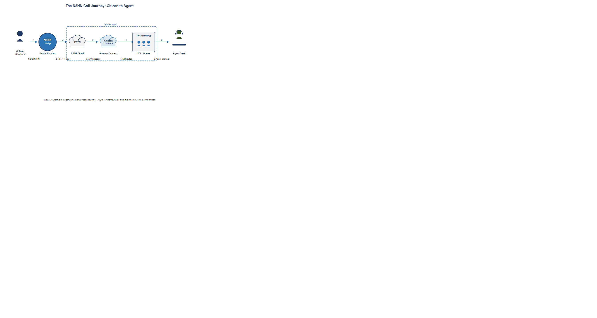{fig-alt="Left-to-right journey showing citizen with phone dialing the N8NN number, call traveling through PSTN to Amazon Connect cloud, entering IVR routing, waiting in queue with three person icons, then connecting to agent at desk with headset. Steps numbered 1 through 5. Note: steps 1 through 3 happen inside AWS and are unaffected by agency network. Step 5 agent-to-cloud path is determined by agency network architecture and is where G.114 compliance is won or lost." width="100%"}

The N8NN is not a telephone feature. It is the primary channel through which citizens reach the agency. Every call that fails to connect, every conversation degraded by choppy audio, every dropped session during a complex transaction represents a citizen who did not receive the service the agency exists to provide.

Behind the N8NN sits Amazon Connect processing calls on AWS commercial infrastructure, a network carrying voice from the platform to agents at field offices across fifty states, and agents whose ability to hear and be heard clearly is determined entirely by the network segment between their desk and the cloud. That segment — the agency's own network — is where the problem lives and where the solution must be built.

> **Why voice exposes network problems that other applications hide:** A web application with 200 ms of extra latency loads slowly. A file transfer with 2% packet loss retransmits and completes. A Teams meeting with moderate jitter buffers and recovers. A voice call with 200 ms of one-way delay is barely intelligible. A voice call with 2% packet loss has audible dropouts every few seconds. Voice does not hide network problems behind buffers and retransmissions. It makes them immediately, publicly audible — to the citizen, to the agent, and to the supervisor on quality monitoring. **That is why network modernization must begin with voice: voice is the canary.**

# The Physics of Voice: Standards With a Pass/Fail Threshold

Unlike most enterprise applications, voice quality has internationally standardized, measurable pass/fail thresholds that are not preferences or benchmarks but engineering specifications with a direct relationship to intelligibility.

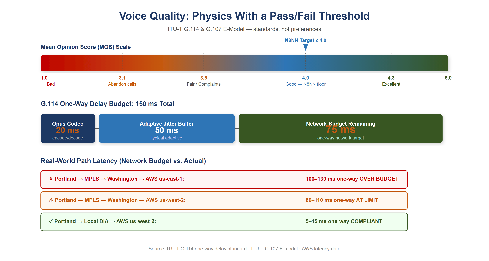{fig-alt="Illustrative diagram showing the MOS scale from 1 (Bad) to 5 (Excellent) with the N8NN target at 4.0 Good, and the G.114 150ms one-way delay budget broken into Opus codec 20ms, adaptive jitter buffer 55ms, and network budget remaining 75ms. Real-world path comparison shows Portland MPLS at 100-130ms over budget, and Portland local DIA at 5-15ms well within budget." width="100%"}

## ITU-T G.114: The One-Way Delay Limit

ITU-T G.114 is the international standard governing one-way delay in voice communications. Its specification: **one-way mouth-to-ear delay must not exceed 150 ms for most applications.** Above 150 ms, talker echo becomes perceptible and conversation degrades. Above 400 ms, the call becomes unusable for interactive conversation. These are not targets — they are ceilings.

The 150 ms limit covers the entire path: codec encoding (~20 ms for Opus), network propagation and queuing, jitter buffer at the receiver (~55 ms adaptive), and decoding. Subtracting the ~20 ms codec and ~55 ms jitter buffer from the 150 ms ceiling leaves approximately **75 ms of budget for the network itself.** That is the target.

## MOS and the E-Model: Quantifying Call Quality

The ITU-T G.107 E-model translates network conditions into an R-factor (0–100), which maps to the Mean Opinion Score (MOS, 1–5) reported by call quality monitoring systems.

| R-Factor | MOS | Quality | User Perception |
|----------|-----|---------|----------------|
| 90–100 | 4.3–5.0 | Excellent | Imperceptible impairment |
| 80–90 | 4.0–4.3 | Good | Perceptible but not annoying |
| 70–80 | 3.6–4.0 | Fair | Slightly annoying |
| 60–70 | 3.1–3.6 | Poor | Annoying |
| Below 60 | Below 3.1 | Bad | Very annoying; many callers abandon |

The N8NN contact center must sustain MOS above 4.0 consistently across all agent locations. Below 3.6 generates citizen complaints. Below 3.1, calls are abandoned and reported.

## Jitter and Packet Loss

{fig-alt="Three horizontal rows of packet squares. Row 1 GOOD: ten evenly spaced green squares, less than 30ms jitter, MOS 4.3 Excellent. Row 2 JITTER: ten amber squares with uneven spacing bunched and gapped, 80ms variance, MOS 3.2 Annoying. Row 3 PACKET LOSS: ten squares with two shown as red dashed outlines indicating lost packets, 2 percent loss, audible gaps every few seconds. Time axis arrow below. Note: Opus codec conceals single lost packet; consecutive losses are unintelligible." width="100%"}

**Jitter** — the variance in packet arrival time — must stay below 30 ms. Jitter buffers compensate by holding packets briefly, but a buffer large enough to absorb 80 ms of variance adds 80 ms of delay, breaching the G.114 ceiling. You can absorb jitter or meet the delay budget; a jittery network forces the choice.

**Packet loss** above 1% produces audible dropouts. Voice RTP does not retransmit lost packets — they are concealed or skipped. The Opus codec handles occasional single-packet loss gracefully; consecutive losses or rates above 3% produce gaps no concealment algorithm can hide.

# Amazon Connect: Architecture, .com Exception, and Network Dependencies

## Platform Overview

Amazon Connect is AWS's cloud-native contact center platform, providing inbound and outbound call handling, IVR via contact flows, skills-based routing, real-time and historical analytics, call recording, and the agent desktop (Contact Control Panel) as a managed SaaS service. Agents access all contact center functionality through a browser-based WebRTC softphone. There is no proprietary hardware at the agent's desk, no on-premises call processing equipment, and no PBX to maintain.

{fig-alt="Two cloud panels side by side. Left AWS GovCloud: navy background with lock icon, FedRAMP High and ITAR badge, physical separation, screened personnel, GovCloud controls, but capability gaps at evaluation time. Right AWS Commercial (.com): light panel with FedRAMP Moderate badge, Contact Lens real-time transcription, Amazon Q agent assist, full integration ecosystem. AUTHORIZED EXCEPTION amber banner noting the FedRAMP Moderate baseline is maintained. Center decision diamond showing which platform to choose. Note: current evaluation required before any new deployment as capability gaps may have closed." width="100%"}

## The GovCloud vs. Commercial Decision and the Authorized Exception

AWS structures its federal cloud offerings differently from Microsoft and Oracle:

| Provider | Moderate Delivery Model | High / Sovereign Model |
|----------|------------------------|----------------------|
| AWS | US East/West commercial regions (FedRAMP Moderate P-ATO) | GovCloud us-gov-east-1 / us-gov-west-1 (FedRAMP High P-ATO; ITAR; US-persons operations; physically separate) |
| Microsoft | Partitioned .com (GCC Moderate on Azure Commercial) | GCC High / DoD on physically separate infrastructure |
| Oracle | Partitioned .com (OCI Moderate) | OCI Government Cloud (separate) |

AWS has exactly two FedRAMP boundaries — there is no middle tier. Amazon Connect is available in **AWS GovCloud, where it holds FedRAMP High authorization**. At the time the agency evaluated platforms for the N8NN contact center, the GovCloud version presented operational capability gaps relative to the commercial (.com) version in three categories:

- **AI-assisted contact center capabilities:** Contact Lens (real-time speech transcription, sentiment analysis, supervisor alerting) and Amazon Q agent assist availability lagged in GovCloud at time of evaluation.
- **Third-party integration ecosystem:** AWS Marketplace integrations for CRM connectors, workforce management, and reporting were predominantly certified for commercial Connect.
- **Operational tooling and support maturity:** AWS support procedures and feature release cadence in GovCloud lagged commercial, creating a growing capability gap.

Stated as the trade it actually was: **the agency accepted commercial-at-Moderate with the capabilities it needed over GovCloud-at-High without them.** That is a starker trade than a tier label suggests — and it is exactly the kind of trade an AO can own explicitly, which is what the authorized-exception process did.

> **Current evaluation required before any new agency deployment.** AWS continuously updates GovCloud service parity. The capability gaps identified at the time of this agency's evaluation may have closed. Any agency evaluating Amazon Connect for a new deployment **must conduct a current-state evaluation of GovCloud Connect against its specific requirements** before concluding that a commercial exception is necessary.

## What the .com Exception Means Structurally

The agency's use of Amazon Connect on AWS commercial (.com) is the same structural pattern as GCC Moderate on Azure Commercial: a federally authorized service running on commercial infrastructure with FedRAMP Moderate controls applied. AWS commercial data centers are US-based. Data is encrypted in transit and at rest. Amazon Connect holds FedRAMP Moderate authorization in the commercial regions (and FedRAMP High in GovCloud). But the personnel screening, physical separation, ITAR/US-persons handling, and High control baseline of GovCloud do not apply on the commercial side.

This does not make the deployment less secure — FedRAMP Moderate controls are extensive. It means the authorization boundary is explicitly a commercial environment with federal controls applied, and that boundary must be accurately reflected in the SSP, understood by the AO, and re-evaluated at each authorization renewal.

## The Call Path: From Citizen to Agent

1. Citizen dials the N8NN from any PSTN telephone
2. Call terminates at an AWS voice connector into Amazon Connect on AWS commercial
3. Contact flow answers, runs IVR, and routes to a queue
4. Agent selected; Connect establishes WebRTC session to the agent's browser
5. Voice travels: agent desktop → agency network → internet → AWS .com → Amazon Connect → citizen

Steps 1–3 happen inside AWS commercial and are unaffected by the agency's network. Step 5 — the agent-to-cloud path — is determined entirely by the agency's network architecture and is where G.114 compliance is won or lost.

## The MPLS Hairpin Applied to the N8NN

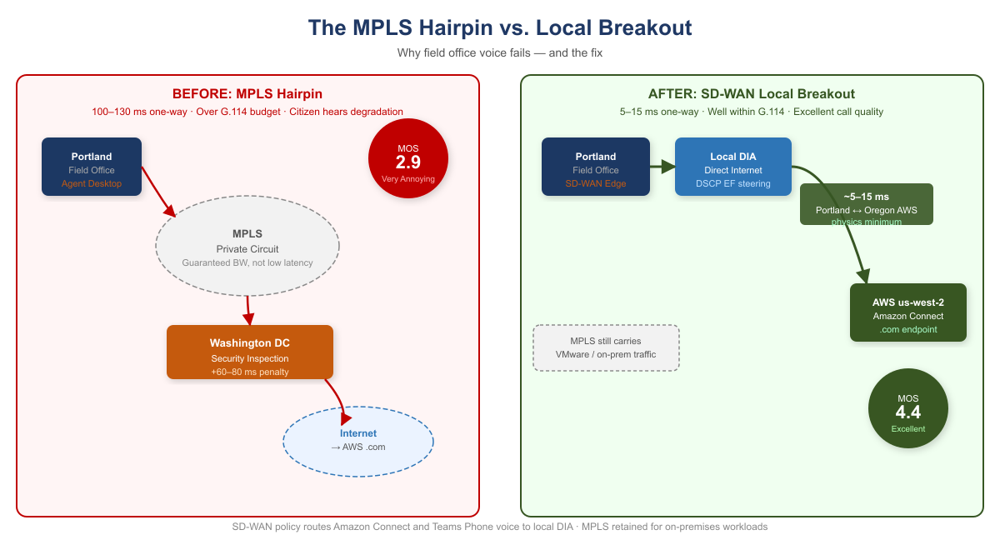{fig-alt="Side-by-side comparison showing BEFORE: Portland agent routes via MPLS through Washington DC security inspection then to AWS, resulting in 100-130ms one-way latency and MOS score of 2.9 Very Annoying. AFTER: Portland agent routes via local DIA directly to AWS us-west-2, resulting in 5-15ms one-way latency and MOS score of 4.4 Excellent. MPLS is retained for on-premises VMware workloads." width="100%"}

An agent in Portland whose network routes all internet traffic through Washington before egress reaches AWS us-west-2 as follows:

**Portland → MPLS → Washington → internet → AWS us-west-2 (.com) → Amazon Connect**

One-way network latency: 100–130 ms (engineering estimate: ~50 ms coast-to-coast propagation plus inspection-stack and queuing overhead; validate with per-site measurement during discovery). G.114 network budget: 75 ms. **Over spec.** The citizen hears the degradation.

The same agent with local internet breakout:

**Portland → local DIA → AWS us-west-2 (.com) → Amazon Connect**

One-way network latency: 5–15 ms. Portland and us-west-2 are geographically adjacent. This is the physics minimum for this path, and it is far within budget.

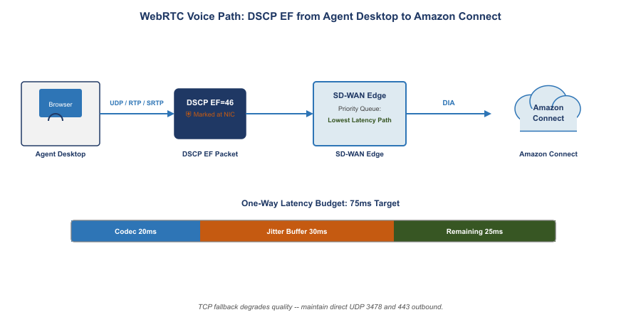{fig-alt="Left to right data flow showing agent desktop browser with headset generating UDP RTP SRTP stream marked DSCP EF 46 with shield icon. Stream passes through SD-WAN edge device with Priority Lowest Latency Path label. Continues via DIA to AWS cloud with Connect logo. Below main flow: horizontal 150ms G.114 delay budget gauge showing 20ms codec in teal, 55ms jitter buffer in amber, 75ms network budget in green. Note: TCP fallback degrades quality, maintain direct UDP 3478 and 443 outbound." width="100%"}

## WebRTC Network Requirements

| Parameter | Requirement | Notes |
|-----------|-------------|-------|
| One-way delay | ≤75 ms network budget | G.114 limit minus codec and jitter buffer overhead |
| Jitter | <30 ms | Above this, buffer compensation breaches delay budget |
| Packet loss | <1% | Above 1% audible; above 3% unintelligible |
| Bandwidth per agent | ~100 Kbps | Opus codec including RTP overhead |
| Protocol | RTP/SRTP over UDP | TCP fallback degrades quality; avoid |
| DSCP marking | EF (46) | SD-WAN must honor, not remark |
| NAT traversal | STUN/TURN | Direct UDP path preferred; TURN relay adds latency |
| Firewall | UDP 3478, 443 outbound | Must reach AWS .com endpoints without hairpin inspection delay |

## Asymmetric Routing: The Session Killer Latency Does Not Explain

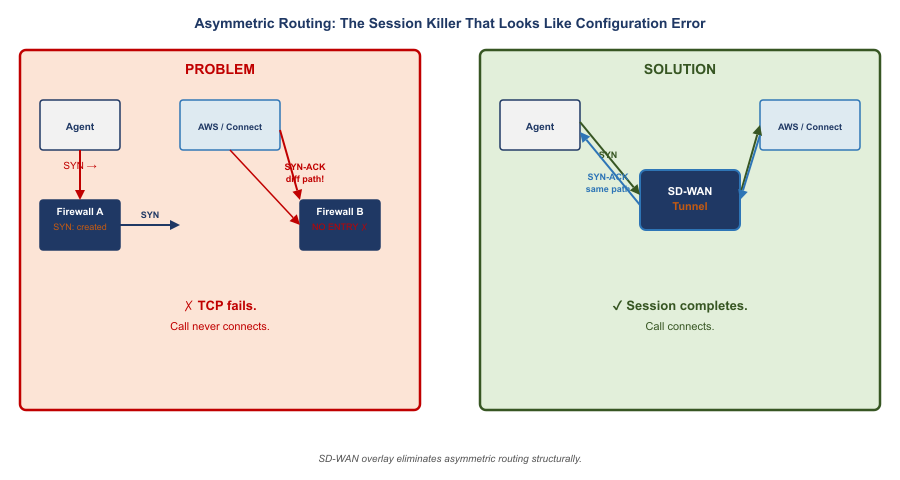{fig-alt="Two panels. PROBLEM left with red border: agent laptop SYN arrow goes through Firewall A which creates session table entry. SYN-ACK returns from AWS via different Firewall B which has no session entry and drops the packet. Red X showing TCP fails call never connects. SOLUTION right with green border: both SYN and SYN-ACK pass through single SD-WAN tunnel endpoint which sees both directions. Green checkmark showing session completes call connects. Note: SD-WAN overlay eliminates asymmetric routing structurally." width="100%"}

Asymmetric routing occurs when the outbound path of a session (client to server) and the return path (server to client) traverse different physical or logical routes through stateful network devices. A stateful firewall maintains a session table. When the SYN for a TCP connection passes through Firewall A, Firewall A creates an entry expecting the SYN-ACK to return through it. If the SYN-ACK returns via a different path through Firewall B, Firewall B drops it as unsolicited.

**For Amazon Connect WebRTC, asymmetric routing means the TLS handshake that establishes the agent's voice session may fail completely.** The HTTPS session setup for the Contact Control Panel is TCP-based. If the request goes through one stateful device and the response through a different one, the session fails before audio is ever established.

> **Asymmetric routing produces call failures that look like configuration errors.** An agent whose Amazon Connect sessions fail to establish will report "the phone system is broken." A Teams Phone call that fails at SIP signaling will be attributed to "SBC misconfiguration." The diagnostic path requires capturing TCP session establishment and verifying that both directions traverse the same stateful devices.

**SD-WAN overlay eliminates asymmetric routing as a failure mode.** The SD-WAN tunnel is established between two edge devices as a single logical connection. Stateful inspection happens at the tunnel endpoint, which sees both directions. Asymmetric physical routing below the tunnel is structurally invisible to the application.

# Microsoft Teams Phone: Replacing the Legacy PBX in GCC Moderate

## What Teams Phone Is

Microsoft Teams Phone is the cloud PBX capability within Microsoft 365 that enables Teams to replace a traditional on-premises telephone system — extension dialing, voicemail, call transfer, call queues, auto attendants, and PSTN connectivity, all delivered through the Teams client. For the agency, Teams Phone operates within GCC Moderate, subject to the same FedRAMP Moderate authorization, data residency requirements, and feature availability constraints as the rest of the Microsoft 365 GCC environment.

Teams Phone is not a separate application or interface. An agent answering a Teams Phone call and an agent joining a Teams meeting use the same client, the same audio path, the same DSCP EF marking for audio streams, and the same network dependency on low-latency, low-jitter connectivity to Microsoft's GCC infrastructure. **Fixing the network for Teams meetings fixes it for Teams Phone simultaneously.**

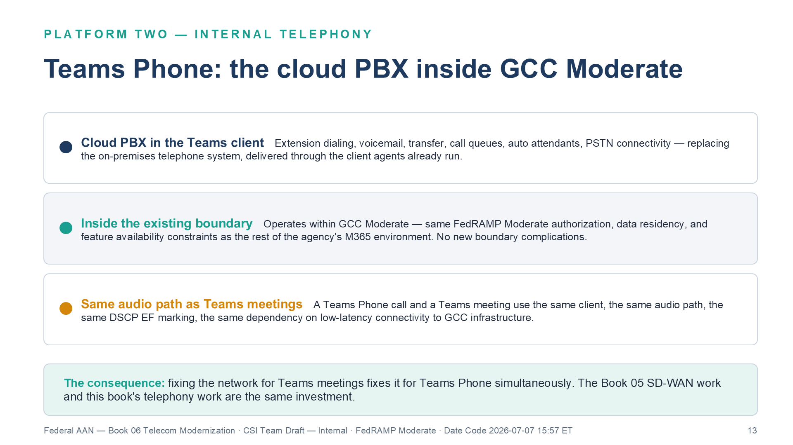{fig-alt="Three stacked summary rows. Row 1, cloud PBX in the Teams client: extension dialing, voicemail, transfer, call queues, auto attendants, PSTN connectivity — replacing the on-premises telephone system through the client agents already run. Row 2, inside the existing boundary: operates within GCC Moderate with the same FedRAMP Moderate authorization, data residency, and feature availability constraints as the rest of the agency M365 environment — no new boundary complications. Row 3, same audio path as Teams meetings: a Teams Phone call and a Teams meeting use the same client, audio path, DSCP EF marking, and dependency on low-latency connectivity to GCC infrastructure. Teal consequence bar: fixing the network for Teams meetings fixes it for Teams Phone simultaneously — the Book 05 SD-WAN work and this book's telephony work are the same investment. White background. Source: Vol I Book 06 Telecom Modernization briefing deck, Date Code 2026-07-07 15:57 ET." width="100%"}

## PSTN Connectivity: Direct Routing and the SBC

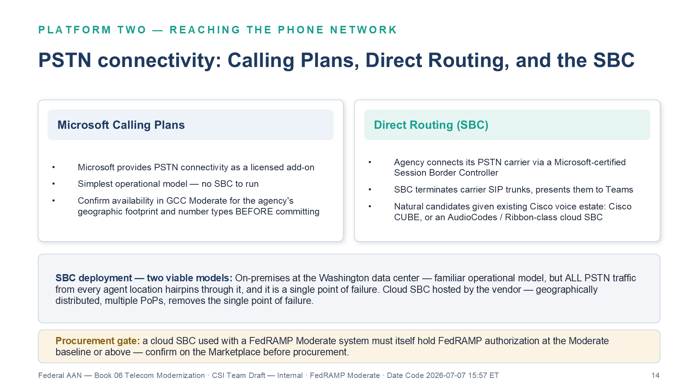{fig-alt="Two side-by-side option cards. Left, Microsoft Calling Plans: PSTN connectivity as a licensed add-on, simplest operational model with no SBC to run, confirm availability in GCC Moderate for the agency's geographic footprint and number types before committing. Right, Direct Routing with SBC: the agency connects its PSTN carrier via a Microsoft-certified Session Border Controller that terminates carrier SIP trunks and presents them to Teams — natural candidates given the existing Cisco voice estate are Cisco CUBE or an AudioCodes or Ribbon-class cloud SBC. Grey panel below: two viable SBC deployment models — on-premises at the Washington data center is a familiar model but hairpins all PSTN traffic and is a single point of failure; a vendor-hosted cloud SBC is geographically distributed with multiple PoPs and removes the single point of failure. Amber procurement gate: a cloud SBC used with a FedRAMP Moderate system must itself hold FedRAMP authorization at the Moderate baseline or above — confirm on the Marketplace before procurement. White background. Source: Vol I Book 06 Telecom Modernization briefing deck, Date Code 2026-07-07 15:57 ET." width="100%"}

Connecting Teams Phone to the PSTN requires one of two approaches:

**Microsoft Calling Plans** — Microsoft provides PSTN connectivity as a licensed add-on. Availability in GCC Moderate should be confirmed for the agency's specific geographic footprint and number types before committing to this path.

**Direct Routing** — the agency connects its PSTN carrier to Teams Phone via a certified Session Border Controller. The SBC terminates SIP trunks from the carrier and presents them to Teams via a Microsoft-certified SIP interface. For the agency, which operates existing Cisco voice infrastructure at data center locations, a Cisco CUBE or a cloud-hosted SBC from an AudioCodes or Ribbon-class vendor are the natural candidates.

> **SBC deployment guidance:** Two deployment models are viable. **On-premises SBC:** Deployed at the Washington data center. All PSTN traffic from any agent location hairpins through the SBC. Familiar operational model; creates a single point of failure. **Cloud SBC (hosted by SBC vendor):** Runs in the vendor's FedRAMP-authorized cloud, geographically distributed, with multiple PoPs. Removes the single point of failure. **The cloud SBC used with a FedRAMP Moderate system must itself hold a FedRAMP Moderate or High authorization** — confirm before procurement.

## E911: Federal Legal Requirements

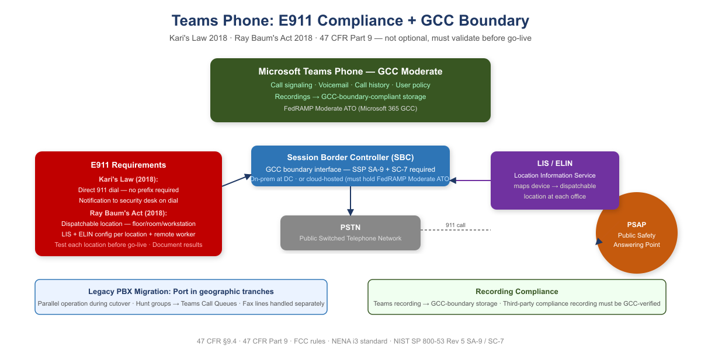{fig-alt="Diagram showing Teams Phone GCC Moderate connecting through SBC to PSTN and PSAP. E911 requirements panel shows Kari's Law 2018 requiring direct 911 dial and notification, and Ray Baum's Act 2018 requiring dispatchable location via LIS and ELIN. Number porting and recording compliance callouts also shown." width="100%"}

Two federal laws impose specific requirements on any multi-line telephone system, including cloud PBX:

**Kari's Law (2018):** Users must be able to dial 911 directly without dialing an access code or prefix. A notification must be sent to a central point when 911 is dialed. Teams Phone satisfies both requirements when emergency calling policies are correctly configured.

**Ray Baum's Act (2018):** The "dispatchable location" — not just a building address but the specific floor, room, or workstation — must be transmitted with the 911 call to the PSAP. Teams Phone supports dispatchable location via the Location Information Service (LIS) and Emergency Location Identification Number (ELIN) configuration.

> **E911 is not optional and must be validated before go-live.** E911 compliance is a federal legal requirement under 47 CFR Part 9. For each location where Teams Phone will be activated, the agency must: (1) configure a Location Information Service entry with dispatchable location, (2) configure an emergency calling policy that routes to the correct PSAP, (3) test 911 dialing and callback from a representative device at that location, and (4) document the test in the deployment record. Remote workers present an additional challenge — location awareness policy must capture the remote worker's current location at sign-in.

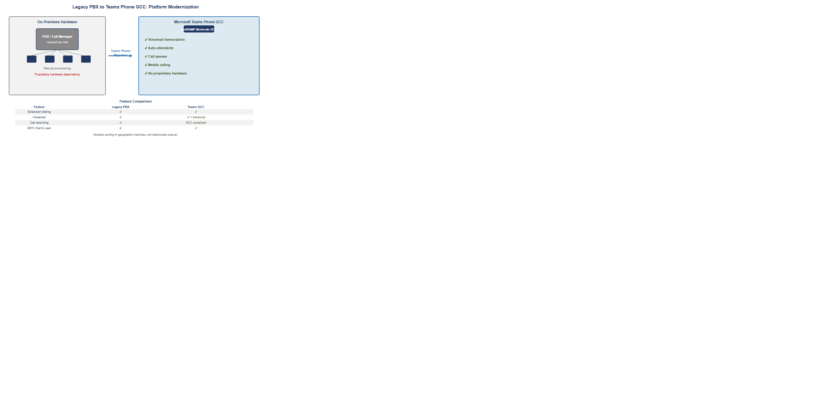{fig-alt="Left panel shows old grey PBX Call Manager server hardware with wires going to multiple desk phones below. On-premises hardware licensed per seat with manual provisioning. Large right arrow labeled Teams Phone Migration. Right panel shows cloud with Teams logo and GCC badge, modern icon. Features gained: voicemail transcription, auto attendants, call queues, mobile calling, FedRAMP Moderate GCC, no proprietary hardware. Feature comparison row below: extension dialing check both, voicemail check plus, call recording GCC compliant, direct dial 911 Karis Law both check. Note: number porting in geographic tranches not nationwide cutover." width="100%"}

## Legacy PBX Migration: Number Porting and Transition

**Porting in tranches.** Number porting should be done in geographic tranches — one field office region at a time — rather than as a single nationwide cutover.

**Parallel operation.** During transition, the legacy PBX and Teams Phone must operate in parallel. Calls to ported numbers must route correctly to Teams. Calls to un-ported numbers must still reach the legacy system.

**Hunt groups and call queues.** Legacy PBX hunt groups must be recreated as Teams Call Queues. Auto attendant menus must be recreated as Teams Auto Attendants.

**Fax lines.** Legacy analog fax lines cannot be replaced with Teams Phone without a fax-over-IP (FoIP) solution or a cloud fax service. Fax lines should be inventoried and handled separately from voice number porting.

# One Investment: Two Platforms

## The Architecture Both Platforms Require

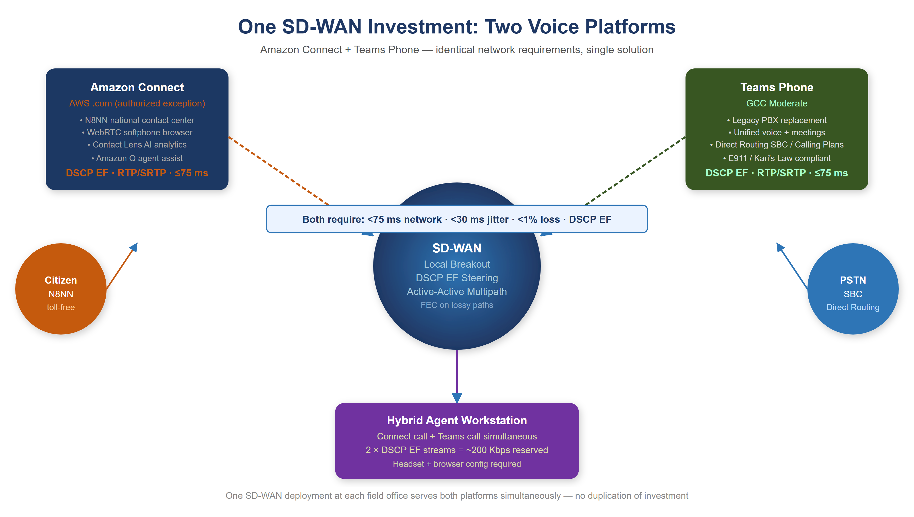{fig-alt="Hub-and-spoke diagram showing SD-WAN at center providing local breakout, DSCP EF steering, active-active multipath, and FEC. Amazon Connect (AWS .com) connects on top-left, Teams Phone (GCC Moderate) on top-right. Citizen N8NN on far left, PSTN SBC on far right. Hybrid Agent workstation at bottom. Both platforms share identical network requirements: under 75ms, under 30ms jitter, under 1% loss, DSCP EF." width="100%"}

Both Amazon Connect and Teams Phone are cloud SaaS voice platforms. Both generate real-time RTP/SRTP streams. Both are broken by the same MPLS hairpin and repaired by the same network solution. That solution is not simply "add a DIA circuit." It is Application-Aware Networking — a network architecture in which policy decisions, path selection, security enforcement, and traffic treatment are determined by the full context of a transaction: application identity, user identity, device posture, and behavioral characteristics. Not by source IP and port alone.

## The Hybrid Agent: Two Simultaneous DSCP EF Streams

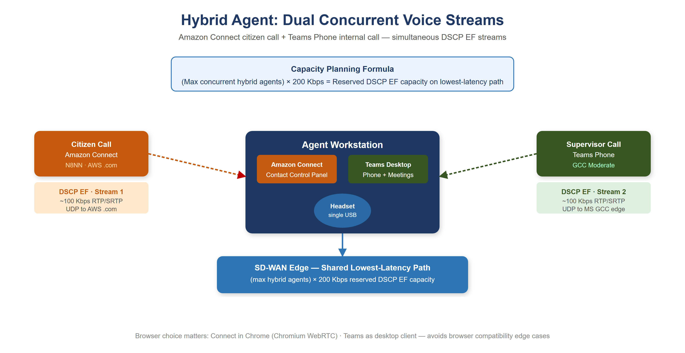{fig-alt="Workstation diagram showing agent simultaneously running Amazon Connect Contact Control Panel (browser) and Teams Desktop client. Two DSCP EF streams flow simultaneously: Stream 1 to Citizen via AWS .com at 100 Kbps, Stream 2 to Supervisor via GCC Moderate at 100 Kbps. Both pass through SD-WAN edge with 200 Kbps reserved DSCP EF capacity. Capacity formula shown: max concurrent hybrid agents times 200 Kbps." width="100%"}

When an agent has an active Amazon Connect call and simultaneously receives a Teams Phone call, the workstation is generating two concurrent voice streams, both marked at the highest QoS priority (DSCP EF). The SD-WAN per-DSCP policy must provide sufficient bandwidth on the lowest-latency path to carry both streams simultaneously.

**Capacity planning formula: (maximum concurrent hybrid agents) × 200 Kbps = reserved DSCP EF capacity on lowest-latency path.**

At a field office with 20 concurrent hybrid agents, this is 4 Mbps of DSCP EF traffic that must be accommodated on the lowest-latency path at peak.

### Headset and Browser Configuration

**Browser selection matters:** Amazon Connect's Contact Control Panel is optimized for Chromium-based browsers. Microsoft Teams Phone is optimized for the Teams desktop client. Running Connect in Chrome and Teams as the desktop client avoids browser compatibility edge cases.

**Headset standardization:** Headset configuration must be standardized across the agent population before go-live on both platforms. Ad hoc headset choices create support complexity and inconsistent audio quality that confounds troubleshooting.

## Per-DSCP Steering for the Hybrid Agent Workstation

A hybrid agent workstation generates three simultaneous traffic classes during active calls:

- **Amazon Connect voice (DSCP EF):** citizen call audio. Lowest-latency path, unconditionally. FEC enabled if path loss ≥0.5%.
- **Teams Phone voice (DSCP EF):** supervisor or internal call audio. Same lowest-latency path.
- **Contact Control Panel web app and Teams UI (HTTPS):** the browser interface for Amazon Connect and the Teams application interface. Highest-throughput path. These tolerate 200–500 ms of latency without affecting call quality and should not compete with voice for the latency-sensitive path.

## SD-WAN and SASE Stack Architecture

The telecommunications modernization in this book requires three distinct components that operate at different layers and are frequently conflated:

| Component | Layer | Function | Representative vendors |
|-----------|-------|----------|------------------------|
| **SD-WAN overlay** | Layer 3 — Network | IPsec encrypted transport; intelligent path selection; QoS traffic classification; DIA local breakout | Cisco Catalyst SD-WAN / VMware VeloCloud (Broadcom) / Palo Alto SD-WAN |
| **SASE SSE** (Secure Service Edge) | Layer 7 — Application | SWG, CASB, FWaaS, SSL/TLS inspection; TIC 3.0 security capabilities catalog | Zscaler Internet Access (ZIA) / Netskope SSE / Palo Alto Prisma Access |
| **ZTNA** (Zero Trust Network Access) | Layer 7 — Application | Per-application micro-tunnels; device posture enforcement; least-privilege session access | Zscaler Private Access (ZPA) / Netskope Private Access / Palo Alto Prisma Access ZTNA |

: SD-WAN and SASE Stack Components *(agency selection pending for all three)* {.striped .hover}

SD-WAN and SASE SSE are distinct products procured separately (though some vendors bundle them). These transport components are where several boundary controls are *implemented* on the field-office path; the formal closures are registered to other books, and this book cross-references them rather than re-claiming them. The SD-WAN overlay provides the SC-8 network-layer encryption on DIA circuits (SC-8 closure anchored in [Vol I Book 07](Vol_I_Book_07_FedAAN_Network_Enforcement_Substrate.qmd)). The SASE SSE stack provides AC-4 information-flow enforcement, SC-7 boundary protection, and SI-3 malware protection via SSL inspection (AC-4 and SC-7 anchored in Vol I Book 07), plus CA-7 continuous-monitoring records (anchored in the multi-cloud evidence fabric). The application-aware layer above them supplies the audit and monitoring telemetry — SI-4 (application-layer telemetry and behavioral analysis) and AU-2/AU-12 (application-layer audit logging: user, device, app, action, data type, timestamp) — whose closures are likewise owned by the enforcement-substrate and evidence-fabric books. Neither the SD-WAN overlay nor the SASE stack substitutes for the other; all are required to satisfy TIC 3.0 and the controls cited in this book.

::: {.callout-note}
## Vendor Selection Pending
The shortlists above reflect FedRAMP authorization status and federal use-case alignment at time of writing. Agency procurement authority, current FedRAMP Marketplace listings, and environment-specific testing must inform final selection. OIS should participate in vendor evaluation for all three components.
:::

# Why Direct Internet Access Alone Does Not Satisfy NIST Controls

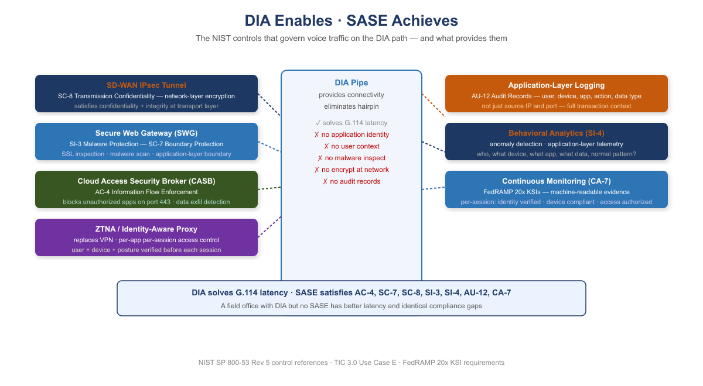{fig-alt="Layered architecture showing DIA pipe in center providing connectivity and eliminating hairpin, but lacking application identity, user context, malware inspection, network encryption, and audit records. Left side shows SASE components: SD-WAN IPsec Tunnel satisfying SC-8, SWG satisfying SI-3 and SC-7, CASB satisfying AC-4, ZTNA replacing VPN. Right side shows Application-Layer Logging for AU-12, Behavioral Analytics for SI-4, Continuous Monitoring for CA-7. Summary: DIA solves G.114 latency, SASE satisfies the six NIST controls." width="100%"}

When telecommunications modernization proposals include "we will add DIA at field offices," the technical response must be precise: DIA is a pipe. It solves the geographic hairpin problem. It does not solve any NIST control requirement.

| NIST Control | Requirement | What Provides It |
|---|---|---|
| AC-4 | Information Flow Enforcement | CASB — application-layer identification |
| SC-7 | Boundary Protection | SWG — application-layer inspection and malware scanning |
| SC-8 | Transmission Confidentiality and Integrity | SD-WAN IPsec tunnel — network-layer encryption |
| SI-3 | Malicious Code Protection | SWG — SSL inspection and malware scanning |
| SI-4 | System Monitoring | AAN — application-layer telemetry, behavioral analysis |
| AU-12 | Audit Record Generation | AAN logging — user, device, app, action, data type, timestamp |
| CA-7 | Continuous Monitoring | SASE stack — per-session identity, posture, access records |

> **Why SC-8 Cannot Be Inherited — the voice path.** A DIA circuit carries traffic unencrypted at the network layer. SRTP protects the media payload of a call; it does not protect the signaling, the softphone HTTPS session's metadata, or any of the non-voice traffic sharing the circuit — and application-layer TLS covers no non-TLS flows at all. The only mechanism that encrypts *all* traffic on a DIA path regardless of application behavior is an IPsec overlay — i.e., SD-WAN. There is no configuration setting, scanner finding, or policy document that closes SC-8 on a bare pipe. The formal SC-8 closure-necessity anchor is registered in [Vol I Book 07](Vol_I_Book_07_FedAAN_Network_Enforcement_Substrate.qmd); this book applies that mechanism on the telecommunications path.

> **DIA enables; SASE and AAN achieve.** For Amazon Connect and Teams Phone, DIA solves the G.114 latency problem by eliminating the geographic hairpin. That is its entire contribution to the compliance picture. A field office deployment that adds DIA without the SASE control stack has better latency and the same compliance gaps. The NIST controls are not satisfied by the pipe. They are satisfied by what governs the pipe.

# TIC 3.0: The Policy That Makes Local Breakout Lawful

The G.114 argument is the physics half of the case for local breakout: the 150 ms one-way ceiling is an engineering specification, the MPLS hairpin spends the budget before the call begins, and no procurement decision changes the propagation delay of a Portland-to-Washington detour. Physics explains why the agency *needs* DIA at field offices. It does not answer whether the agency *may have* it. That is a policy question, and the policy is TIC 3.0.

{fig-alt="A two-row table mapping the TIC 3.0 use cases that govern agency voice. Branch Office, Use Case E: field office agents on Amazon Connect and Teams Phone, traffic path field office to local DIA to AWS .com or M365 GCC, policy enforcement point at or near the branch egress as SD-WAN edge plus SASE services. Remote User, Use Case F: teleworking agents and staff, home network to internet to cloud voice platforms, PEP as the cloud-delivered SASE PoP with ZTNA replacing VPN. Teal permissibility panel: TIC 3.0 under OMB M-19-26 replaced mandatory consolidation with a use-case model — both use cases permit traffic to leave without hairpinning through a TIC access point, and neither permits it to leave ungoverned; the security-capabilities catalog must be satisfied at the distributed PEP, and the SASE stack is that PEP. Red panel: an ungoverned DIA circuit is not modernization, it is a finding — the bare circuit that fixes G.114 deletes the SC-7 boundary the MPLS-to-TIC path did provide, while with the SASE PEP in place the same circuit is the TIC 3.0 target architecture. White background. Source: Vol I Book 06 Telecom Modernization briefing deck, Date Code 2026-07-07 15:57 ET." width="100%"}

Under the TIC 2.x model, every byte of agency internet traffic was required to egress through a small number of consolidated TIC access points — the architecture that created the hairpin in the first place. TIC 3.0 (OMB M-19-26) replaced mandatory consolidation with a use-case model: agencies may distribute their internet egress, provided the protections that the consolidated boundary used to provide are re-established at each distributed egress point. Those protections are enumerated in the **TIC 3.0 Security Capabilities Catalog**, and the place they must be applied is the **policy enforcement point (PEP)** governing each traffic path.

## The Two Use Cases That Govern Agency Voice

Two TIC 3.0 use cases map directly onto the telecommunications populations in this document — the Branch Office use case (elsewhere in this series shorthand-labeled Use Case E) and the Remote User use case (Use Case F):

| TIC 3.0 Use Case | Agency Population | Traffic Path It Governs | Where the PEP Must Be |
|---|---|---|---|
| **Branch Office** | Field office agents on Amazon Connect and Teams Phone | Field office → local DIA → AWS .com / M365 GCC | At or near the branch egress: SD-WAN edge + SASE security services |
| **Remote User** | Teleworking agents and staff on agency or managed devices | Home network → internet → cloud voice platforms | Cloud-delivered SASE PoP the user's traffic traverses; ZTNA replacing VPN |

Both use cases *permit* traffic to leave for the internet without hairpinning through a TIC access point. Neither use case permits the traffic to leave *ungoverned*. The condition attached to both is the same: the applicable security capabilities from the catalog — the universal capabilities (auditable central log management among them) and the relevant PEP capability groups spanning web protections, network protections, and DNS resolution protections — must be demonstrably in place at the distributed PEP for that path.

**This is the formal statement of the permissibility rule: under TIC 3.0, DIA requires a distributed PEP providing protection commensurate with the agency's risk tolerance — in practice the applicable security-capabilities catalog entries — and the SASE stack is that PEP.** The mapping is one-to-one with the NIST table in the previous section: the SD-WAN IPsec overlay provides encryption in transit, the SWG provides traffic inspection and malware protection, the CASB provides application-layer flow enforcement, protective DNS provides resolution security, and the telemetry pipeline to the SIEM provides the auditing and continuous-monitoring capabilities. An agency that deploys the SASE stack at its breakout points has not found a loophole around the TIC — it has implemented TIC 3.0 as designed.

> **Why SC-7 / SC-7(7) Cannot Be Inherited — distributed egress.** SC-7 requires communications at external boundaries to be monitored and controlled at managed interfaces. Local breakout creates an external boundary interface at every field office, and remote work creates one at every home — while removing the central boundary stack from the path entirely. SC-7(7) makes the remote-user case explicit: split tunneling on remote devices is prohibited *unless the split tunneling capability is provisioned securely* — and local breakout for voice is precisely a split tunnel. The only mechanism that puts a managed, monitored interface on every distributed egress path is the distributed PEP — the TIC 3.0 SASE stack. The central firewall cannot close it (it is no longer in the path), the circuit provider cannot close it (a carrier hands off packets, not policy), and no document closes a boundary that has no enforcement point. The formal SC-7 closure-necessity anchor is registered in [Vol I Book 07](Vol_I_Book_07_FedAAN_Network_Enforcement_Substrate.qmd); this book shows why the distributed PEP is mandatory on the telecommunications egress path.

> **An ungoverned DIA circuit is not modernization; it is a finding.** The bare circuit that fixes G.114 simultaneously deletes the SC-7 boundary that the MPLS-to-TIC path, whatever its latency, did provide. Presented to an assessor, that trade is a regression. Presented with the SASE PEP in place, it is the TIC 3.0 target architecture. The difference between the two deployments is not the circuit — it is the control stack riding on it.

The operational conclusion joins the two halves. The physics half — G.114's budget — remains the driver: it is why the network must be modernized before either voice platform goes live, and it is measured in milliseconds at every agent location. The policy half — TIC 3.0's catalog-at-the-PEP condition — is what makes the resulting architecture authorizable. The same SD-WAN + SASE investment satisfies both at once, which is why this document treats them as one program: local breakout to meet the delay budget, and the distributed PEP to make that breakout lawful.

# FedRAMP Boundary Considerations for Telecommunications

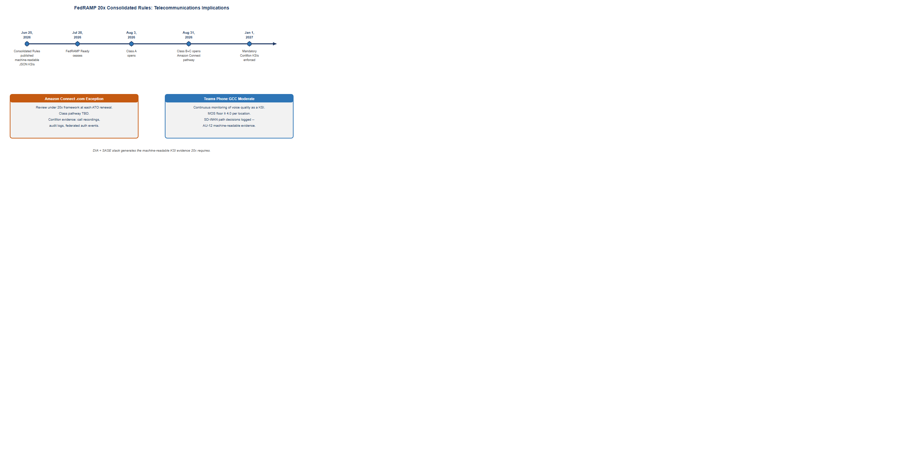{fig-alt="Timeline showing FedRAMP 20x Consolidated Rules key dates with telecom implications: June 25 2026 rules published machine-readable JSON KSIs, July 28 FedRAMP Ready ceases, August 3 Class A opens, August 31 Class B plus C open — candidate Amazon Connect pathway, class pending evaluation, January 1 2027 mandatory ConMon KSIs enforced. Two callout boxes: Amazon Connect .com exception review under 20x framework with call audit logs and authentication events as KSI evidence. Teams Phone GCC continuous monitoring with MOS floor 4.0 per location and SD-WAN path decisions as AU-12 machine-readable evidence. Note: DIA plus SASE stack generates the machine-readable KSI evidence 20x requires." width="100%"}

## FedRAMP 20x Consolidated Rules — June 2026 Update {#sec-fedramp-20x-telecom}

FedRAMP published its **Consolidated Rules for 2026** on June 25, 2026. Three key implications for agencies operating Amazon Connect and Teams Phone:

**Timeline agencies must track:**

| Date | Event | Telecommunications Implication |
|------|-------|-------------------------------|
| July 28, 2026 | FedRAMP Ready submissions cease | No new Ready pathway for Connect or SBC vendors |
| August 3, 2026 | Class A pipeline opens | Evaluate whether Connect .com falls under Class A |
| August 31, 2026 | Class B and C open | Multi-platform unified comms likely Class B or C |
| January 1, 2027 | Consolidated Rules mandatory | All ConMon evidence must align to 20x KSI format |
| June 11, 2027 | No new Rev5 certification applications accepted | Plan for 20x pathway on next ATO cycle |

**What 20x means for Amazon Connect continuous monitoring:** FedRAMP 20x replaces periodic evidence assembly with continuously-verified Key Security Indicators (KSIs) in machine-readable format. For Amazon Connect, this means:

- **Call audit logs** (AU-12): every agent session, call recording access, and contact flow execution must generate structured, queryable records — not just archived log files
- **Federated authentication events** (IA-2): Entra ID → Amazon Connect SAML assertions must produce KSI-verifiable authentication telemetry — the agents are agency (organizational) users authenticating through the agency IdP, so this is IA-2 rather than the non-organizational-user control IA-8
- **Boundary traffic logs** (SA-9): API calls crossing the .com boundary (CRM integration, recording access, contact flow analytics) must be captured in machine-readable format
- **ATO exception documentation**: The .com exception itself must be maintained in a format compatible with 20x continuous review rather than point-in-time SSP snapshots

**What 20x means for Teams Phone GCC Moderate:** Teams Phone in GCC Moderate inherits Microsoft's existing FedRAMP authorization. The 20x transition requires that the *agency's* continuous monitoring evidence — voice quality monitoring, E911 testing records, SBC boundary documentation — align to machine-readable KSI format.

::: {.callout-tip}
**SD-WAN as 20x Evidence Generator:** The SD-WAN overlay that solves the G.114 latency problem also generates the machine-readable evidence 20x requires. Every path decision, every jitter measurement, every FEC activation is a logged, queryable event. **The network investment that enables Amazon Connect to meet G.114 is simultaneously the compliance evidence generator for FedRAMP 20x continuous monitoring.** These are not separate investments.
:::

## Amazon Connect: .com Boundary Documentation Requirements

The agency's use of Amazon Connect on AWS commercial (.com) requires specific boundary documentation:

- **SSP SA-9 documentation:** Amazon Connect is an external information system service. The SSP must identify Amazon Connect, its FedRAMP authorization status, the specific authorized exception, and data types (voice audio, call recordings, call metadata, citizen interaction logs).
- **Call recordings:** Stored in S3 on AWS commercial. Access controls, encryption key management (KMS), and data lifecycle policies must be documented. Recordings containing PII must be classified accordingly, and access logging must satisfy AU-9 requirements.
- **CRM and case management integration:** API calls between Amazon Connect contact flows and agency systems cross the .com boundary. The data flow diagram in the SSP must trace these calls.
- **Agent authentication federation:** Agents authenticate to Amazon Connect via the agency IdP (Entra ID in GCC Moderate). The SAML/OIDC federation is a cross-boundary credential flow that must be documented in the SSP.
- **ATO exception maintenance:** The specific authorization permitting .com Connect must be reviewed at each ATO renewal. The exception is not a permanent waiver; it is a time-bounded, condition-bounded authorization that requires active maintenance.

## Teams Phone: GCC Boundary and PSTN

Teams Phone in GCC Moderate operates within the GCC boundary for all call signaling, voicemail storage, call history, and user policy management. The PSTN interconnect (via Direct Routing SBC or Calling Plans) is a boundary crossing by definition: the PSTN is a public network. The SBC in Direct Routing handles the crossing point. Its configuration must be documented in the SSP as a boundary interface.

## Amazon Connect vs. Teams Phone: Complementary, Not Competing

| Dimension | Amazon Connect (N8NN Contact Center) | Microsoft Teams Phone (Internal UC) |
|-----------|--------------------------------------|--------------------------------------|
| Primary function | Citizen-facing inbound contact center | Employee-to-employee and PSTN calling |
| Users | Contact center agents, supervisors | All agency employees |
| Call volume | High-volume inbound (thousands concurrent at peak) | Standard enterprise PBX volume |
| IVR / routing | Sophisticated contact flows, skills-based routing, queuing | Auto attendants and call queues |
| AI capabilities | Contact Lens (transcription, sentiment, analytics), Amazon Q agent assist | Teams transcription, voicemail transcription (GCC availability varies) |
| Agent interface | Browser-based Contact Control Panel (WebRTC) | Teams desktop client or browser |
| Recording | S3 on AWS .com; SA-9 boundary documentation required | GCC-boundary-compliant storage |
| Authorization | FedRAMP Moderate (AWS .com by specific agency exception) | FedRAMP Moderate (M365 GCC Moderate; partitioned .com) |
| PSTN connectivity | AWS Voice Connector | Direct Routing SBC or Calling Plans |
| Voice protocol | WebRTC / RTP / DSCP EF | WebRTC / RTP / DSCP EF |
| **Network requirement** | **Identical: <75 ms one-way, <30 ms jitter, <1% loss** | **Identical: <75 ms one-way, <30 ms jitter, <1% loss** |
| **SD-WAN solution** | **Identical: local breakout, DSCP EF steering, multipath, FEC** | **Identical: local breakout, DSCP EF steering, multipath, FEC** |

The shared network requirement row is the most operationally significant in this table. The SD-WAN investment that enables Amazon Connect to meet G.114 from all field office locations is the same investment that enables Teams Phone to deliver acceptable call quality. These are not separate network projects. They are **one network modernization that enables both platforms.**

{fig-alt="Four-phase Gantt chart across 8 plus months. Phase 1 Months 1-3 Network Foundation in teal: SD-WAN, DIA, DSCP EF steering, G.114 validation. Milestone G.114 Compliance Verified at Month 3. Phase 2 Months 2-5 Amazon Connect in navy: contact flows, agent auth federation, call recording pipeline. Milestone N8NN Live at Month 5. Phase 3 Months 4-8 Teams Phone in teal: SBC config, E911 testing, number porting tranches, parallel PBX operation. Milestone PBX Decommission at Month 8. Phase 4 Month 6 plus Continuous Monitoring in amber: MOS alerting, ConMon dashboards, ATO renewal review, 20x KSI alignment. Prerequisites bar at Month 1: No migration before G.114 validation. Note: voice quality failures post-migration cost dramatically more than pre-migration network investment." width="100%"}

# Implementation Roadmap

> **Prerequisite: no telecommunications migration before network validation.** Voice quality failures discovered after contact center or PBX migration are dramatically more expensive to remediate than network infrastructure investments made before migration. No field office should go live on Amazon Connect or Teams Phone until the network foundation for that office is validated against G.114 requirements. Validation means measuring actual one-way latency, jitter, and packet loss from each agent workstation to AWS us-west-2 and to the Microsoft GCC edge, with local breakout active, and confirming all three parameters are within specification.

## Phase 1 — Network Foundation (Months 1–3)

- Deploy SD-WAN at all field offices with contact center agents or significant phone populations
- Configure local internet breakout for Amazon Connect (.com AWS IP ranges/FQDNs) and Microsoft 365 GCC endpoints
- Enable per-DSCP steering: DSCP EF → lowest-latency path; standard HTTPS → highest-throughput path
- Enable FEC on any path with measured loss rate ≥0.5%
- Verify direct outbound UDP to Amazon Connect and GCC endpoints without hairpin or deep inspection delay
- **Measure and document G.114 compliance at each agent location before proceeding to Phase 2**
- Size DSCP EF capacity for peak hybrid agent load: (max concurrent hybrid agents) × 200 Kbps

## Phase 2 — Amazon Connect Deployment (Months 2–5)

- Confirm .com exception is current in ATO; update SSP SA-9 for Amazon Connect with current architecture
- Design and build contact flows replicating and improving current N8NN IVR routing
- Configure agent authentication via IdP federation (Entra ID GCC Moderate → Amazon Connect)
- Pilot with single queue and agent cohort; measure MOS, jitter, and loss from pilot locations
- Validate call recording pipeline to S3; confirm KMS key management, access controls, and AU-9 logging
- Validate CRM/case management integration; document data flow in SSP

## Phase 3 — Teams Phone Deployment (Months 4–8)

- Confirm Teams Phone feature availability in GCC tenant: Calling Plans availability, voicemail transcription, mobile calling
- Deploy and configure SBC (on-premises or cloud-hosted); validate Microsoft certification and FedRAMP authorization
- Configure E911 with dispatchable location for every office location; verify PSAP connectivity; document testing
- Inventory legacy PBX numbers: classify each as voice, fax, emergency, or special service
- Build Teams Call Queues and Auto Attendants replicating legacy PBX hunt groups and menus
- Port numbers in geographic tranches; maintain parallel PBX operation through each tranche

## Phase 4 — Continuous Monitoring and FedRAMP 20x Alignment (Months 6+)

- Instrument SD-WAN dashboards to surface G.114 violations by location before they become citizen complaints
- Integrate Amazon Connect Call Analytics with agency SIEM for AU-12 continuous monitoring
- Establish MOS floor SLA (≥4.0) per agent location; alert when sustained MOS drops below threshold
- Review Amazon Connect commercial exception at each ATO renewal; evaluate whether GovCloud capability gaps have been resolved
- **FedRAMP 20x alignment (mandatory January 1, 2027):** Configure SD-WAN telemetry exports in machine-readable JSON format; ensure Connect audit logs, authentication events, and boundary crossing records meet structured KSI format requirements; validate SBC event logs feed SIEM in queryable format

# Federal Framework Alignment

| Concept / Requirement | Federal Mandate | Standard / Reference |
|---|---|---|
| Voice one-way delay ≤75 ms (network budget) | Agency SLA obligation; G.114 | ITU-T G.114; ITU-T G.107 E-model |
| Jitter <30 ms; packet loss <1% | Agency SLA obligation | ITU-T G.107; RFC 3550 (RTP) |
| Amazon Connect on AWS .com; specific authorized exception | FedRAMP (FISMA); agency ATO | FedRAMP Moderate P-ATO; NIST SP 800-53 Rev 5 SA-9 |
| Amazon Connect .com boundary documentation | FedRAMP; Privacy Act | NIST SP 800-53 Rev 5 SA-9, AU-9, SC-28; agency SSP |
| ATO exception maintenance at each renewal cycle | FedRAMP ConMon | NIST SP 800-53 Rev 5 CA-7; NIST SP 800-37 Rev 2 (Monitor step); FedRAMP ConMon requirements |
| Teams Phone in GCC Moderate boundary | FedRAMP Moderate (M365 GCC) | Microsoft 365 GCC FedRAMP Moderate ATO |
| E911 direct dialing without prefix (Kari's Law) | Kari's Law (2018) | 47 CFR §9.4; FCC rules |
| E911 dispatchable location (Ray Baum's Act) | Ray Baum's Act (2018) | 47 CFR Part 9; FCC rules; NENA i3 standard |
| Local internet breakout for voice | TIC 3.0, OMB M-22-09 | TIC 3.0 Branch Office Use Case; NIST SP 800-207 |
| Per-DSCP steering for voice (DSCP EF) | OMB M-22-09 §4 | RFC 3246 (DSCP EF); IETF RFC 4594 |
| Active-active multipath; sub-second failover | TIC 3.0; OMB M-22-09 | CISA ZTMM v2.0 Networks pillar |
| SBC as PSTN boundary interface | FedRAMP; agency SSP | NIST SP 800-53 Rev 5 SA-9; SC-7 |
| Call recording access controls and audit logging | FedRAMP; Privacy Act | NIST SP 800-53 Rev 5 AU-9, SC-28; 5 U.S.C. §552a |
| Agent IdP federation across .com boundary | OMB M-22-09; FICAM | NIST SP 800-63; SAML 2.0 / OIDC federation documentation |
| Continuous call quality monitoring | FedRAMP ConMon; OMB A-130 | NIST SP 800-53 Rev 5 CA-7; NIST SP 800-37 Rev 2 (Monitor step) |
