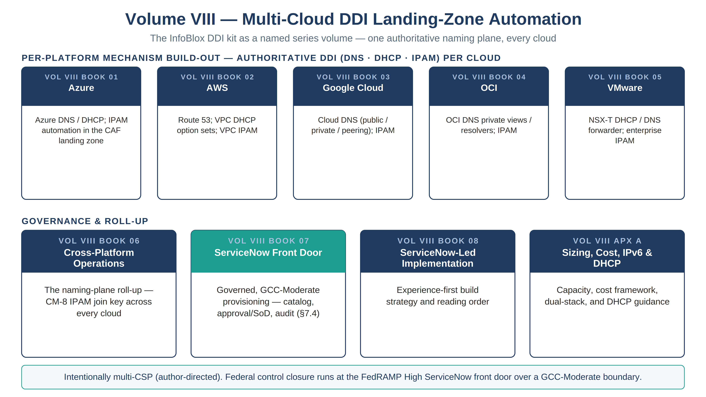

::: {.fouo-banner}
INTERNAL — NOT FOR PUBLIC DISTRIBUTION
:::

::: {.callout-warning}
## Draft Proposal — Subject to Review

This document is a **draft proposal** developed by the **CSI Team (Cloud Services Infrastructure)**. It has not been reviewed or approved by the SSA CIO Office, the Office of Information Security (OIS), or organizational leadership.

**Date Code:** 2026-07-12 15:00 ET
:::

::: {.callout-important}
**Series Context** — This is the Volume VIII overview of the Federal Application-Aware Networking series. Volume VIII is the **multi-cloud DDI (DNS, DHCP, IPAM) landing-zone automation kit** — the deep, per-platform implementation of the naming plane that Vol I Book 01 (Cloud Landing Zone, IPAM/DDI) establishes at the architecture level. Its chapter content is the repo-root **`infoblox-ddi-book/`** kit, an independently distributable book; this volume binds it into the series through the compliance spine, this overview, and cross-references — the series' "one program, one spine, named volumes" model.
:::

::: {.callout-note}
## Scope note — this volume is intentionally multi-CSP

The rest of this task narrows to **FedRAMP Moderate + Microsoft GCC Moderate** (Vol VII). **Volume VIII is the one deliberate breadth exception, by author direction (2026-07-12): it spans Azure, AWS, Google Cloud, OCI, and VMware.** DDI is a foundation service every landing zone needs regardless of CSP, and the kit's value is precisely the *cross-cloud* comparison — so it is merged whole rather than trimmed to Azure. The GCC-Moderate governance boundary still applies to the ServiceNow orchestration chapter (its §7.4), which is where federal control closure is operated; the per-CSP chapters are the mechanism build-out beneath it.
:::

{#fig-vol8-map fig-alt="A house-style volume map for Volume VIII, Multi-Cloud DDI Landing-Zone Automation, on a white background with a navy title and the subtitle 'The InfoBlox DDI kit as a named series volume — one authoritative naming plane, every cloud'. A top row labeled PER-PLATFORM MECHANISM BUILD-OUT — AUTHORITATIVE DDI (DNS, DHCP, IPAM) PER CLOUD holds five navy cards: Book 01 Azure (Azure DNS/DHCP; IPAM in the CAF landing zone); Book 02 AWS (Route 53; VPC DHCP option sets; VPC IPAM); Book 03 Google Cloud (Cloud DNS public/private/peering; IPAM); Book 04 OCI (OCI DNS private views/resolvers; IPAM); Book 05 VMware (NSX-T DHCP/DNS forwarder; enterprise IPAM). A bottom row labeled GOVERNANCE AND ROLL-UP holds Book 06 Cross-Platform Operations (the naming-plane roll-up, the CM-8 IPAM join key across every cloud); Book 07 ServiceNow Front Door, drawn with a teal header (governed, GCC-Moderate provisioning — catalog, approval and separation of duties, audit, section 7.4); Book 08 ServiceNow-Led Implementation; and Appendix A Sizing, Cost, IPv6 and DHCP. A footer band states the volume is intentionally multi-CSP by author direction, and that federal control closure runs at the FedRAMP High ServiceNow front door coordinating a GCC-Moderate boundary (High-on-Moderate; see Vol VII Book 00). White background. Authored house-style diagram." width="100%"}

# What This Volume Addresses

The architecture volumes name the naming plane as a truth plane: authoritative DNS, DHCP, and IP address management are the source of truth every other plane depends on to find, address, and inventory what it governs (SC-20/21/22, CM-8). Vol I Book 01 argues *why* that plane is required and why no scanner can author it. **This volume is the deployable realization of that plane, worked one CSP at a time** — a platform engineer can take any chapter from a blank landing zone to a production-grade Infoblox DDI and DNS-security layer inside it, then read the ServiceNow chapter to put a governed, audited front door on the whole thing.

Because DDI is the join key the rest of the series reconciles to — the CMDB (Vol VII Book 01), the multi-CSP patch queue (Vol III Book 03), and the evidence fabric (Vol III Book 07) all key on the authoritative asset identity IPAM owns — this volume is upstream of much of the program. It is placed last in reading order only because it is the deepest implementation detail; in dependency order it is near the root.

# Books in This Volume

Each book below is a chapter of the `infoblox-ddi-book/` kit; the volume overview (this book) is the series front door to it. Chapter files are referenced by path, not relocated, so the kit stays independently distributable and its existing cross-references and CI coverage are undisturbed.

| Book | Chapter (in `infoblox-ddi-book/`) | Role |
|---|---|---|
| **Vol VIII Book 00** | (this overview) | Series front door; scope note; the volume's control-closure roll-up |
| **Vol VIII Book 01** | `01-azure.md` | DDI on Microsoft Azure (Azure DNS/DHCP; IPAM automation) |
| **Vol VIII Book 02** | `02-aws.md` | DDI on Amazon Web Services (Route 53; VPC IPAM) |
| **Vol VIII Book 03** | `03-gcp.md` | DDI on Google Cloud (Cloud DNS; IPAM) |
| **Vol VIII Book 04** | `04-oci.md` | DDI on Oracle Cloud Infrastructure (OCI DNS; IPAM) |
| **Vol VIII Book 05** | `05-vmware.md` | DDI on VMware (VCF / vSphere / NSX-T) |
| **Vol VIII Book 06** | `06-cross-platform-operations.md` | Cross-platform operations & multi-cloud governance (the naming-plane roll-up) |
| **Vol VIII Book 07** | `07-servicenow-orchestration.md` | ServiceNow orchestration — the governed, GCC-Moderate front door (§7.4 control mapping) |
| **Vol VIII Book 08** | `08-servicenow-led-implementation.md` | ServiceNow-led implementation strategy |
| **Vol VIII Appendix A** | `appendix-A-sizing-cost-ipv6-dhcp.md` | Sizing, cost, IPv6/dual-stack, and DHCP guidance |

: Volume VIII — Multi-Cloud DDI Landing-Zone Automation {.striped .hover}

# How This Volume Fits the Program

Volume VIII is the deployable realization of **Vol I Book 01**'s naming plane and the multi-cloud build-out of the DDI/IPAM necessity the series anchors there. It is depended on by:

- **Vol VII Book 01 (CMDB Reconciliation)** — the ServiceNow CMDB reconciles every M365/Azure CI to the authoritative IPAM/DDI identity this volume stands up (the CM-8 join key).
- **Vol VII Book 05 (The ServiceNow Compliance App)** — generalizes this volume's ServiceNow orchestration pattern (Book VIII-07: catalog → approval/SoD → apply → validation gate → CMDB close) from DDI provisioning to control-compliance work.
- **Vol III Book 03 / Book 07** — the multi-CSP patch queue and evidence fabric key on the same authoritative asset identity.

Truth is separated from enforcement, as everywhere in the series: the DDI/IPAM plane this volume builds is a **truth plane** (depended on, not re-platformed casually); the per-cloud provisioning pipelines and the ServiceNow front door are **enforcement/coordination planes** on top of it.

# Governance Boundary

The per-CSP chapters are the mechanism build-out and are CSP-agnostic by design. **Federal control closure is operated at the ServiceNow front door (Book VIII-07 §7.4), which coordinates the GCC-Moderate boundary**: the ServiceNow Government Cloud platform holds **FedRAMP High** authorization and coordinates a Moderate boundary — the High-on-Moderate boundary treatment (High conservatively encompasses the Moderate baseline; the CMDB reconciles to IPAM/DDI, never replaces it) is stated once in **Vol VII Book 00 §"Authorization Boundary Treatment — ServiceNow High-on-Moderate"** and inherited here without restatement. The instance runs a MID Server in-boundary so credentials and Terraform execution never leave the ATO boundary, and the Universal DDI SaaS path is gated by an explicit boundary acknowledgment. The catalog approval, the change record, the validation-gate verdict, and the CMDB reconcile are the audit evidence — the same coordination discipline Volume VII applies to M365 and Azure compliance.

# Authorities Closed Here — Volume VIII (cross-cutting books)

The per-CSP chapters *realize* the naming plane; the two cross-cutting books carry the volume's spine-generated control closures. Both tables below are generated from the series compliance spine (`aan-compliance-spine.yml`) by `render_authorities_table.py`; they are not hand-edited here. Necessity for the naming plane itself is anchored in Vol I Book 01 — these rows are the multi-cloud realization and the governed-front-door closures, not a re-anchoring.

## Cross-Platform Operations & Multi-Cloud Governance (Book VIII-06)

<!-- authorities:book-ddi-xplat — generated from aan-compliance-spine.yml; do not hand-edit -->
| Control | Title | Closing mechanism (function, not product) | Accreditation gate | Authority drivers | Evidence slot | FedRAMP 20x KSI | Tool-attestable? |
|---|---|---|---|---|---|---|---|
| CM-8 | System Component Inventory | IPAM as the authoritative multi-cloud address/subnet inventory (CM-8 join key) reconciled across per-CSP discovery adapters | FedRAMP Moderate | NIST SP 800-53 Rev 5; CISA BOD 23-01 | Network | KSI-PIY | No |
| SC-20 | Secure Name/Address Resolution Service (Authoritative Source) | One authoritative Infoblox DDI naming plane spanning Azure/AWS/GCP/OCI/VMware, per-cloud discovery adapters reconciling to it | FedRAMP Moderate | NIST SP 800-53 Rev 5; CISA TIC 3.0 | Network | KSI-CNA | No |
| SC-22 | Architecture and Provisioning for Name/Address Resolution Service | HA/anycast DDI service architecture with fault-tolerant resolution across cloud boundaries | FedRAMP Moderate | NIST SP 800-53 Rev 5 | Network | KSI-CNA | No |

: Authorities Closed Here — Cross-Platform Operations & Multi-Cloud Governance († = Closure-Necessity anchor: no alternate closure path) {.striped .hover}

## ServiceNow Orchestration — Governed Front Door (Book VIII-07)

<!-- authorities:book-ddi-servicenow — generated from aan-compliance-spine.yml; do not hand-edit -->
| Control | Title | Closing mechanism (function, not product) | Accreditation gate | Authority drivers | Evidence slot | FedRAMP 20x KSI | Tool-attestable? |
|---|---|---|---|---|---|---|---|
| CM-5 | Access Restrictions for Change | Separation-of-duties gate in the catalog approval flow (requester ≠ approver) over DDI changes | FedRAMP Moderate | NIST SP 800-53 Rev 5 | Identity | KSI-IAM | No |
| AU-2 | Event Logging | Immutable request/approval/apply/validation audit trail emitted from the ServiceNow closed loop into the evidence contract | FedRAMP Moderate | NIST SP 800-53 Rev 5; OMB M-21-31 | Telemetry | KSI-MLA | No |
| CM-3 | Configuration Change Control | Service Catalog → Flow Designer approval/SoD → Terraform apply → validation gate → CMDB close: DDI provisioning gated by an approved, audited change record | FedRAMP Moderate | NIST SP 800-53 Rev 5; OMB Circular A-130 | Security / supply chain | KSI-CMT | No |

: Authorities Closed Here — ServiceNow Orchestration — Governed Front Door for DDI († = Closure-Necessity anchor: no alternate closure path) {.striped .hover}

# Cross-References

- **`infoblox-ddi-book/`** — the chapter content of this volume (independently distributable kit).
- **Vol I Book 01 (Cloud Landing Zone, IPAM/DDI, FedRAMP)** — the architecture-level naming-plane necessity this volume realizes.
- **Vol VII Book 01 / Book 05** — the CMDB reconcile and the ServiceNow compliance app that build on this volume's IPAM/DDI identity and orchestration pattern.
- **`aan-compliance-spine.yml`** — the SSOT registering this volume (`vol-8`) and its control closures.

# Provenance

This overview merges the InfoBlox DDI landing-zone kit into the Federal Application-Aware Networking series as Volume VIII, by author direction. The chapter content is not relocated — it remains the repo-root `infoblox-ddi-book/` kit and keeps its own conventions and figures; this volume binds it to the series via the spine, this overview, and cross-references. The multi-CSP breadth is a deliberate, author-directed exception to the task's GCC-Moderate scope. Vendor claims in the chapters cite vendor documentation per the kit's own references. The volume map above is authored as committed house-style SVG (rasterized to PNG).
