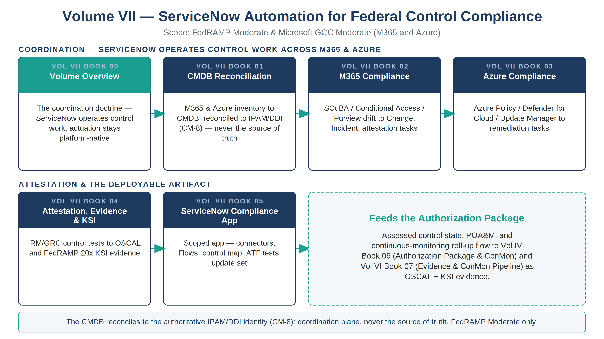

::: {.fouo-banner}
INTERNAL — NOT FOR PUBLIC DISTRIBUTION
:::

::: {.callout-warning}
## Draft Proposal — Subject to Review

This document is a **draft proposal** developed by the **CSI Team (Cloud Services Infrastructure)**. It has not been reviewed or approved by the SSA CIO Office, the Office of Information Security (OIS), or organizational leadership. All recommendations, vendor selections, control mappings, and workflow designs are subject to revision pending formal review.

**Date Code:** 2026-07-12 15:00 ET
:::

::: {.callout-important}
**Series Context** — This is the Volume VII overview of the Federal Application-Aware Networking series. Volumes I–IV establish the architecture (*what must be true and why*); Volume V covers training; Volume VI carries the deployable infrastructure-as-code, detection, and evidence artifacts. **Volume VII is the coordination layer: the ServiceNow workflow, CMDB, and governance-risk-compliance (GRC) automation that turns M365 and Azure control state into tracked tasks, reviewable change, machine-readable evidence, and authorization-package input.** Where Volume VI *deploys* a control as code, Volume VII *operates* it — routing drift to an owner, gating change, and rolling posture up into the continuous-monitoring package.
:::

::: {.callout-note}
## Scope of this volume — FedRAMP Moderate & Microsoft GCC Moderate

This volume targets **FedRAMP Moderate** and the **Microsoft GCC Moderate** boundary
exclusively: Microsoft 365 GCC (Moderate) as the SaaS control plane and the agency's
FedRAMP-authorized Azure resources targeted at the Moderate boundary. The ServiceNow
instance runs on **ServiceNow Government Cloud, which holds FedRAMP High
authorization** — High fully encompasses the Moderate control baseline this series
targets, so the platform over-satisfies the boundary rather than falling short of it.
Because that is a High-on-Moderate treatment (not a Moderate authorization), it is
documented explicitly in the *Authorization Boundary Treatment* subsection below rather
than left as a footnote. **Other cloud service providers
(AWS, Oracle/OCI, VMware) and higher boundaries (GCC High, DoD) are explicit follow-ups,
out of scope here** — the coordination loop is designed so those surfaces reconcile into
the same ServiceNow queues later without reworking this volume's M365-and-Azure core.
:::

# What This Volume Addresses

The architecture volumes prove that a mechanism closes a control. Volume VI expresses that mechanism as code and emits an evidence record when it deploys. But a federal estate is not run by artifacts alone — it is run by **work**: a misconfiguration someone must own and fix, a privileged-access request someone must approve, a patch cycle someone must schedule, a control someone must test and attest before an assessor will accept it. That work needs a system of record with an approval trail, an SLA clock, and a reconcilable link to the authoritative asset it touches.

This volume makes that system of record concrete. It uses **ServiceNow** — the agency's workflow, CMDB, and GRC platform, FedRAMP-authorized for the Moderate boundary this series targets — to coordinate federal control-compliance work across the two surfaces that carry the most of it: **Microsoft 365** (the SaaS control plane — identity, Conditional Access, SCuBA baselines, Purview data protection) and **Azure** (the IaaS/PaaS control plane — Azure Policy, Defender for Cloud, Update Manager). The volume shows how control drift on either surface becomes a tracked ServiceNow task, how that task's closure produces evidence, and how the rolled-up posture feeds the authorization package.

# The Coordination Doctrine — ServiceNow Coordinates, It Does Not Actuate

The series' Management-Plane Coordination Doctrine (Vol 0 Book 00, Executive Summary) splits the management plane in two, and Volume VII sits squarely on the governance half of that split:

1. **Actuation is platform-native and non-negotiable.** M365 is configured by Graph, Conditional Access, and the SCuBA/secure-baseline tooling; Azure is configured by Azure Policy, Defender for Cloud, and Update Manager. ServiceNow does **not** patch a VM, flip a Conditional Access policy, or rewrite an Azure Policy assignment as its primary job. It orchestrates *who does, when, under what approval, and with what evidence.*
2. **Governance and evidence are unified — coordination lives here, as a contract, not a tool.** Every native surface emits its control state into one workflow-and-evidence system so that a single compliance picture, an approval trail, and an authorization-package feed exist. ServiceNow is where that contract is operated.

::: {.callout-important}
**Doctrine guardrail — the CMDB reconciles to the naming plane; it does not replace it.** ServiceNow's CMDB is a *workflow projection* of asset state, reconciled to the authoritative IPAM/DDI asset identity (the CM-8 join key established in Vol I Book 01). DDI and HRIT remain the truth planes; the CMDB and the GRC workflow are enforcement/coordination planes — depended on for *routing and evidence*, never for *truth*. A CMDB that drifts from IPAM/DDI is a reconciliation defect, not a new source of truth. This guardrail is the difference between coordination and a second, competing inventory.
:::

# Books in This Volume

| Book | Title | Role |
|---|---|---|
| **Vol VII Book 00** | Volume Overview (this book) | The coordination doctrine; how ServiceNow operates M365 & Azure control work |
| **Vol VII Book 01** | CMDB Reconciliation & Asset Identity | Discovery/Service Graph populate the CMDB; reconcile to IPAM/DDI (CM-8) |
| **Vol VII Book 02** | M365 Federal Control Compliance Automation | SCuBA/CA/Purview drift → Change/Incident/attestation tasks |
| **Vol VII Book 03** | Azure Federal Control Compliance Automation | Azure Policy / Defender for Cloud / Update Manager → remediation tasks |
| **Vol VII Book 04** | Control Attestation, Evidence & KSI | IRM/GRC control tests → OSCAL/KSI → authorization package |
| **Vol VII Book 05** | The ServiceNow Compliance App | Scoped app, Flows, Catalog, ATF, Update Set — the deployable artifact |

: Volume VII — ServiceNow Automation for Federal Control Compliance {.striped .hover}

{#fig-vol7-map fig-alt="A house-style volume map for Volume VII, ServiceNow Automation for Federal Control Compliance, on a white background with a navy title and the scope line 'FedRAMP Moderate and Microsoft GCC Moderate (M365 and Azure)'. A top row labeled COORDINATION — SERVICENOW OPERATES CONTROL WORK ACROSS M365 AND AZURE holds four cards joined by teal arrows: Book 00 Volume Overview with a teal header (the coordination doctrine; actuation stays platform-native); Book 01 CMDB Reconciliation (M365 and Azure inventory to the CMDB, reconciled to IPAM/DDI by the CM-8 key, never the source of truth); Book 02 M365 Compliance (SCuBA, Conditional Access, and Purview drift to Change, Incident, and attestation tasks); Book 03 Azure Compliance (Azure Policy, Defender for Cloud, and Update Manager to remediation tasks). A bottom row labeled ATTESTATION AND THE DEPLOYABLE ARTIFACT holds Book 04 Attestation, Evidence and KSI and Book 05 the ServiceNow Compliance App, with a teal dashed panel titled Feeds the Authorization Package noting that assessed control state, POA&M, and the continuous-monitoring roll-up flow to Vol IV Book 06 and Vol VI Book 07 as OSCAL and KSI evidence. A footer band states the CMDB reconciles to the authoritative IPAM/DDI identity (CM-8) as a coordination plane, never the source of truth — FedRAMP Moderate only. White background. Authored house-style diagram." width="100%"}

# The Boundary Discipline

Volume VII inherits the series' in-boundary rule without exception. Three constraints govern every workflow in it:

1. **FedRAMP High platform, GCC Moderate boundary.** ServiceNow Government Cloud holds FedRAMP High authorization and operates against the Microsoft GCC Moderate surface (M365 GCC + Moderate-targeted Azure). This High-on-Moderate posture is treated explicitly in the subsection below; it is verified on the FedRAMP Marketplace at procurement.
2. **MID Server in-boundary.** Any callout that reaches an agency surface — Graph, Azure Resource Manager, a DDI grid — runs through a **MID Server registered inside the ATO boundary**, so credentials and execution never leave it. Cloud-to-cloud integrations use the platform's in-boundary integration surface, not a commercial multi-tenant relay.
3. **Least-privilege service identity.** ServiceNow reaches M365 and Azure through a scoped, auditable app registration / managed identity with only the read and task-creation permissions the coordination role needs — never standing write authority over the estate it is meant to *govern*.

## Authorization Boundary Treatment — ServiceNow High-on-Moderate

::: {.callout-important}
## The coordination hub is FedRAMP High; the boundary it coordinates is Moderate — treat this explicitly, not as a footnote

ServiceNow Government Cloud (the coordination hub for Volumes VII and IX) holds a
**FedRAMP High** authorization, while the boundary it coordinates — Microsoft GCC
Moderate — is **FedRAMP Moderate**. A reviewer is entitled to ask how a High-only
service sits inside a Moderate architecture. The series' position:

- **Direction of the delta is conservative.** FedRAMP High's control baseline is a
  strict superset of Moderate's. A High-authorized service *over-satisfies* every
  Moderate control requirement; the risk direction of a High tool coordinating a
  Moderate boundary is toward more assurance, not less. (The inverse — a Moderate
  tool handling High data — is the one that fails, and is not the case here.)
- **The hub coordinates; it does not become the boundary's system of record.** The
  ServiceNow CMDB **reconciles to** the authoritative IPAM/DDI plane on the CM-8
  join key and never replaces it (Vol VII Book 01). Identity-attributed compliance
  data handled by the hub is commensurate with a High authorization.
- **Documented boundary treatment, or a named Moderate alternative.** The agency
  either (a) records a risk-acceptance for running a FedRAMP High coordination
  platform against a Moderate boundary — the recommended path, given the
  conservative delta — or (b) selects a FedRAMP **Moderate** workflow/CMDB platform
  instead. Moderate-authorized alternatives already named in the Product Inventory
  Questionnaire include Atlassian Government Cloud (Jira/Confluence, Moderate) and
  Ivanti Neurons for ITSM (Moderate); the mechanism-not-product doctrine (Vol 0
  Book 00) means the coordination loop in this volume is unchanged by the choice.

**Single source of truth:** the platform's authorization status is pinned in the
Product Inventory Questionnaire (Vol 0 Book 01 §product-status). Every other book —
including this one — references that entry rather than restating the level. Verify on
the FedRAMP Marketplace at procurement.
:::

# Closure Necessity — Coordination Operationalizes, It Does Not Re-Close

::: {.callout-tip}
## Closure Necessity — a control that is not owned, tracked, and attested is not operationally managed

Volume VII does **not** claim to close controls the architecture and implementation volumes already close; that would double-count. Its necessity is of the same kind Volume VI carries, one plane further out: **a control-closure claim with no owner, no change gate, no SLA clock, and no evidence feed is not an operating control — it is a hope.** CM-3 is not satisfied by good intentions; it is satisfied by an approved, reviewable change record. CA-7 is not satisfied by a dashboard nobody actions; it is satisfied by drift that becomes a task that becomes closure that becomes evidence. Remove the coordination layer and the SSP describes controls that are deployed but not *run* — the gap between a configured control and a governed one.
:::

# How This Volume Fits the Program

Volume VII **depends on** Volume I's naming plane (Vol I Book 01) for the CM-8 join key its CMDB reconciles to, and on Volume VI's deployable artifacts for the control state it coordinates. It **produces** the tracked-work record, the approval trail, and the rolled-up attestation that Volume IV's Authorization Package & ConMon book (Vol IV Book 06) and Volume VI's Evidence & ConMon Pipeline (Vol VI Book 07) carry into the OSCAL bundle and the FedRAMP 20x KSI evidence. Truth is separated from enforcement throughout: IPAM/DDI and HRIT are truth planes the CMDB reconciles to; the ServiceNow workflow is an enforcement/coordination plane, re-platformable in principle, load-bearing in practice.

# Cross-References

- **Vol 0 Book 00 (Executive Summary)** — the Management-Plane Coordination Doctrine this volume operates on.
- **Vol I Book 01 (Landing Zone, IPAM/DDI)** — the CM-8 asset-identity SSOT the CMDB reconciles to.
- **Vol III Book 07 (Multi-Cloud Evidence Fabric)** — the telemetry lake; ServiceNow coordinates workflow over the same evidence contract.
- **Vol VI Book 07 (Evidence & ConMon Pipeline)** and **Vol IV Book 06 (Authorization Package & ConMon)** — where this volume's attestation output lands.
- **`infoblox-ddi-book/servicenow-app/`** — the in-repo ServiceNow scoped-app skeleton this volume's app book (Vol VII Book 05) generalizes from DDI provisioning to control compliance.

# Provenance

This overview establishes the coordination layer of the Federal Application-Aware Networking series. It follows the series authoring conventions: functions and planes are named, not organizations; ServiceNow is the deployed coordination example named because the coordination role is itself a named product decision (Expansion Plan §16), and the substitution path is preserved where a workflow/GRC platform is interchangeable. Every book carries a Date Code and cites vendor sources for vendor-specific claims. The volume map above is authored as committed house-style SVG (rasterized to PNG); further per-book figures follow in the PPTX→DOCX sync pass.
