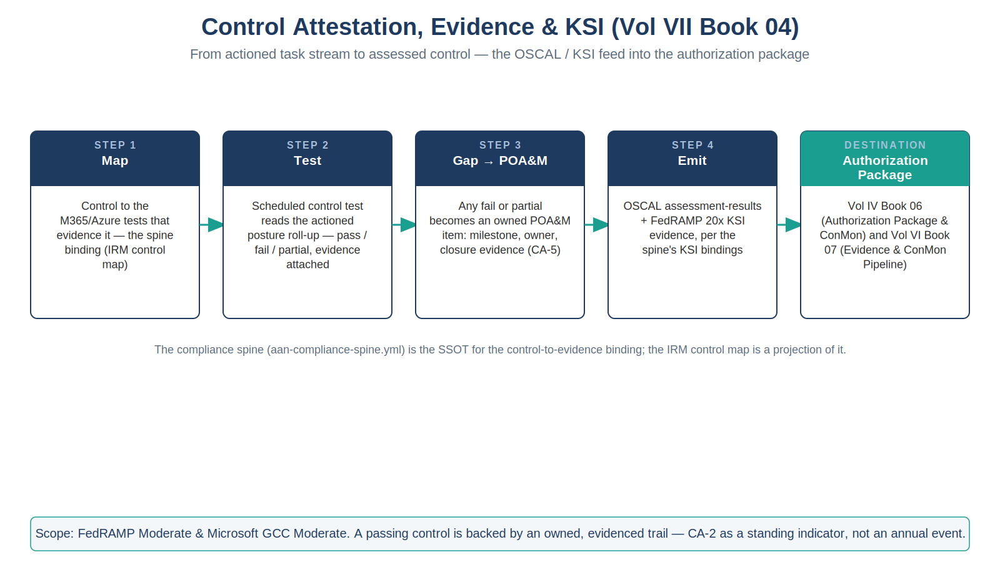

::: {.fouo-banner}
INTERNAL — NOT FOR PUBLIC DISTRIBUTION
:::

::: {.callout-warning}
## Draft Proposal — Subject to Review
Developed by the **CSI Team (Cloud Services Infrastructure)**; not yet reviewed or approved by the SSA CIO Office, OIS, or leadership. **Date Code:** 2026-07-12 15:00 ET
:::

::: {.callout-important}
**Series Context** — Volume VII Book 04. The output stage of the coordination layer. Books 02 and 03 turn M365 and Azure control state into tracked work; this book turns the *rolled-up result* of that work into **assessed control state** — the ServiceNow IRM/GRC control tests, POA&M items, and the OSCAL/KSI evidence feed that Vol IV Book 06 (Authorization Package & ConMon) and Vol VI Book 07 (Evidence & ConMon Pipeline) carry into the ATO package.
:::

# What This Document Addresses

A closed remediation task is operational hygiene; an *assessed control* is what an authorizing official signs. Between the two sits attestation: the periodic control test, the evidence that the test passed, the POA&M for what did not, and the machine-readable roll-up that lets a continuous authorization run instead of a once-a-year scramble.

This book covers how ServiceNow's IRM/GRC surface consumes the tracked-work stream from Books 01–03 and produces the three artifacts the authorization package needs: **assessed control state (CA-2)**, **a plan of action and milestones for gaps (CA-5)**, and **a continuous-monitoring roll-up emitted as OSCAL and FedRAMP 20x KSI evidence (CA-7)**. It is the join between the coordination layer and the series' existing evidence spine — it does not replace that spine, it feeds it.

# The Attestation Model — Task Stream to Assessed Control

Control state arrives as work; attestation lifts it to evidence in four steps:

| Step | Input | ServiceNow surface | Output |
|---|---|---|---|
| **1. Map** | Control → the M365/Azure tests and tasks that evidence it (the compliance spine binding) | IRM control map | Each control knows which tests attest it |
| **2. Test** | Scheduled control test reads the current posture roll-up (Books 02/03) + spot evidence | IRM control test / indicator | Pass / fail / partial per control, with evidence attached |
| **3. Gap** | Any fail/partial | IRM issue → POA&M | Owned POA&M item: milestone, owner, closure evidence (CA-5) |
| **4. Emit** | Assessed control state + POA&M | Evidence export | OSCAL component/assessment + KSI evidence into the ConMon package |

::: {.callout-important}
**The compliance spine is the SSOT for the control-to-evidence binding.** Which controls this volume attests, and which slot/KSI each maps to, is defined in `aan-compliance-spine.yml` — the same generated spine that renders every book's "Authorities Closed Here" table. ServiceNow's IRM control map is a *projection* of that binding, not an independent authority. If the two disagree, the spine wins and the IRM map is out of date — the identical truth-vs-projection discipline the CMDB follows toward IPAM/DDI.
:::

{#fig-vol7b04-attest fig-alt="A house-style four-step pipeline titled Control Attestation, Evidence and KSI (Vol VII Book 04), subtitle 'From actioned task stream to assessed control — the OSCAL / KSI feed into the authorization package', on a white background. Four navy-headed cards are joined left to right by teal arrows: Step 1 Map — control to the M365/Azure tests that evidence it, the spine binding held as the IRM control map; Step 2 Test — a scheduled control test reads the actioned posture roll-up and renders pass, fail, or partial with evidence attached; Step 3 Gap to POA&M — any fail or partial becomes an owned POA&M item with milestone, owner, and closure evidence (CA-5); Step 4 Emit — OSCAL assessment-results plus FedRAMP 20x KSI evidence, per the spine's KSI bindings. A fifth teal-headed destination card reads Authorization Package — Vol IV Book 06 (Authorization Package and ConMon) and Vol VI Book 07 (Evidence and ConMon Pipeline). A caption below notes the compliance spine (aan-compliance-spine.yml) is the SSOT for the control-to-evidence binding and the IRM control map is a projection of it. A footer band gives the scope as FedRAMP Moderate and Microsoft GCC Moderate and states a passing control is backed by an owned, evidenced trail — CA-2 as a standing indicator, not an annual event. White background. Authored house-style diagram." width="100%"}

# Assessed Control State (CA-2)

The IRM control test is the attestation primitive. Each control this volume covers carries a test that reads the rolled-up posture from Books 02/03 (SCuBA pass rate, CA-exception review currency, Azure Policy compliance, Defender open-finding age, patch SLA conformance) and renders a pass/fail/partial with the underlying evidence attached. Because the test reads *actioned* posture — drift that became a task that became closure — a passing control is backed by an owned, evidenced trail, not a point-in-time screenshot. That is the difference between CA-2 as an annual event and CA-2 as a standing indicator.

# Plan of Action & Milestones (CA-5)

Every fail or partial becomes a POA&M item with a single owner, a milestone date, and a required closure evidence type. POA&M items are ServiceNow IRM issues, so they inherit the same SLA, approval, and audit-trail machinery as remediation tasks — and they *link back* to the Books 02/03 tasks that will close them, so the POA&M is never a parallel spreadsheet that drifts from the operational work. A POA&M whose linked remediation task closes with passing re-test evidence closes automatically; one whose milestone slips escalates. This is CA-5 as a living record joined to the work, not a quarterly reconciliation.

# The OSCAL / KSI Emit (CA-7)

The roll-up is emitted in the two machine-readable forms the series already consumes:

1. **OSCAL** — assessed control state and POA&M are exported as OSCAL assessment-results / POA&M models into the authorization package that Vol IV Book 06 owns. This keeps the ATO package generated, not hand-assembled, and diffable release to release.
2. **FedRAMP 20x KSI evidence** — each attested control's result is mapped to its KSI theme (per the spine's `ksi` bindings) and emitted as KSI evidence into the pipeline Vol VI Book 07 and the Multi-Cloud Evidence Fabric (Vol III Book 07) carry to CDM and the KSI scorer.

::: {.callout-note}
**ServiceNow is the workflow hub, not the evidence lake.** The telemetry lake and the KSI scorer live in the evidence fabric (Vol III Book 07); ServiceNow contributes the *workflow-and-attestation* record — the owned test, the approval trail, the POA&M — into that fabric via the same evidence contract every native stack emits to. Coordination plane feeds truth plane; it does not become it.
:::

# Closure Necessity

::: {.callout-tip}
## Closure Necessity — an unattested control is a claim, not a control
Books 02 and 03 make M365 and Azure controls *operate*; this book makes them *assessable*. Without the attestation stage, the authorization package is a static document that describes controls no one has tested against live posture, and the FedRAMP 20x KSI feed has no workflow-attested input. CA-2, CA-5, and CA-7 are not closed by a dashboard — they are closed by an owned test, an owned gap, and a machine-readable emit that an authorizing official and a KSI scorer can both consume. Remove this book and the coordination layer produces tidy tasks that never reach the AO.
:::

# NIST SP 800-53 Rev 5 Control Closure — Authorities Closed Here

Generated from the series compliance spine (`aan-compliance-spine.yml`) by `render_authorities_table.py`; not hand-edited here.

<!-- authorities:book-sn-attestation — generated from aan-compliance-spine.yml; do not hand-edit -->
| Control | Title | Closing mechanism (function, not product) | Accreditation gate | Authority drivers | Evidence slot | FedRAMP 20x KSI | Tool-attestable? |
|---|---|---|---|---|---|---|---|
| CA-2 | Control Assessments | ServiceNow IRM/GRC control tests and evidence tasks produce assessed control state feeding the authorization package | FedRAMP Moderate | NIST SP 800-53 Rev 5 | Telemetry | KSI-MLA | No |
| CA-5 | Plan of Action and Milestones | POA&M items tracked as ServiceNow IRM issues/tasks with owner, milestone, and closure evidence | FedRAMP Moderate | NIST SP 800-53 Rev 5; OMB Circular A-130 | Security / supply chain | KSI-MLA | No |
| CA-7 | Continuous Monitoring | Compliance posture rolled up in ServiceNow and emitted as OSCAL/KSI evidence into the ConMon package (Vol IV Book 06 / Vol VI Book 07) | FedRAMP Moderate | NIST SP 800-53 Rev 5; NIST SP 800-137; CISA CDM; FedRAMP 20x KSIs | Telemetry | KSI-MLA | No |

: Authorities Closed Here — Control Attestation, Evidence & KSI († = Closure-Necessity anchor: no alternate closure path) {.striped .hover}

# Honest Limits

- An attestation is only as strong as the test behind it; a control test that reads a shallow posture signal attests shallowly. Test depth is co-owned with Vol VI Book 08 (validation harnesses) — the attestation inherits that book's coverage, good or bad.
- ServiceNow IRM produces the workflow-attested record; the authoritative OSCAL SSP and the KSI score live downstream (Vol IV Book 06, Vol VI Book 07). This book emits *into* them, and must not fork a second authorization narrative.
- Continuous authorization is a discipline, not a feature: the emit is only continuous if the tests run on cadence and the POA&M is worked. An idle IRM module produces a stale attestation that reads worse than an honest annual one.

# Cross-References

- **`aan-compliance-spine.yml`** — the SSOT control-to-evidence binding the IRM control map projects.
- **Vol IV Book 06 (Authorization Package & ConMon)** — the OSCAL package this book emits into.
- **Vol VI Book 07 (Evidence & ConMon Pipeline)** and **Vol III Book 07 (Evidence Fabric)** — the KSI/CDM pipeline this book's attestations feed.
- **Vol VII Book 02 / 03** — the M365 and Azure task streams this book attests over.

# Provenance

Draft. ServiceNow IRM/GRC, OSCAL, and the FedRAMP 20x KSI pipeline are deployed examples of the attestation-and-emit mechanism; the spine-as-SSOT and coordination-feeds-truth disciplines are the invariants. Vendor-source citations for the ServiceNow IRM/GRC capability claims are pending. The attestation-pipeline figure is authored as committed house-style SVG (rasterized to PNG).
