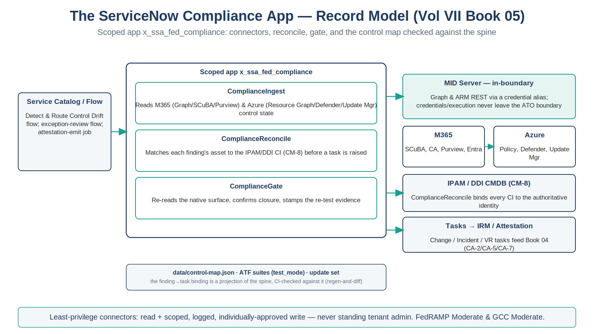

::: {.fouo-banner}
INTERNAL — NOT FOR PUBLIC DISTRIBUTION
:::

::: {.aan-warning}
## Draft Proposal — Subject to Review
Developed by the **CSI Team (Cloud Services Infrastructure)**; not yet reviewed or approved by the SSA CIO Office, OIS, or leadership. **Date Code:** 2026-07-14 11:56 ET
:::

::: {.aan-important}
**Series Context** — Volume VII Book 05. The deployable counterpart to Books 00–04: a scoped ServiceNow app that carries the connectors, Flows, catalog items, control map, ATF tests, and update set implementing the coordination loop. It generalizes the in-repo DDI-provisioning app skeleton (`infoblox-ddi-book/servicenow-app/`) from *provisioning* to *control compliance* — same boundary discipline (in-boundary MID Server, FedRAMP-authorized instance, machine-readable + CI-checked artifacts), new purpose.
:::

# What This Document Addresses

Books 00–04 describe the coordination loop as doctrine and control mapping. This book is the artifact that runs it: a scoped app an admin can import into a sub-production instance, wire to the M365 and Azure surfaces through an in-boundary MID Server, and stand up — rather than hand-build from prose. It follows the series' *everything-as-code* rule (Vol VI Book 00): the app is an importable update set, its control map is machine-readable data, and its behavior is covered by runnable ATF tests.

::: {.aan-note}
**Starter skeleton, not a signed product.** The scoped app described here ships as an importable DRAFT skeleton at [`x_ssa_fed_compliance/`](x_ssa_fed_compliance/) — Script Includes, control map (CI-validated against the spine by `validate_day2_control_maps.py`), Flow blueprints, MID validate script, ATF spec, and update-set spec — registered in the spine's `kits:` section so the distribution kit bundles it automatically. Review the records, complete the connector credential aliases and the control map per tenant, pin API versions, and test in a sub-prod instance before any production use. This mirrors the disposition of the DDI app skeleton and the day-2 kit.
:::

# App Record Model

The scoped app is `x_ssa_fed_compliance`. Its records implement the five-step loop (test → detect → raise → actuate-native → close+evidence) as reusable ServiceNow building blocks.

| Path (in the app) | Record / artifact | Role |
|---|---|---|
| `script-includes/ComplianceIngest.js` | `sys_script_include` | Server-side reader — pulls M365 (Graph/SCuBA/Purview) and Azure (Resource Graph / Defender / Update Manager) control state via the MID-routed REST messages; normalizes to a control-finding shape |
| `script-includes/ComplianceReconcile.js` | `sys_script_include` | Matches each finding's asset to the authoritative IPAM/DDI CI (CM-8 join) before a task is raised; routes unmatched assets to the reconcile-exception queue (Vol VII Book 01) |
| `script-includes/ComplianceGate.js` | `sys_script_include` | Post-actuation validation — re-reads the native surface, confirms closure, and stamps the re-test evidence on the task |
| `rest/` (spec — `rest/README.md`) | `sys_rest_message` (+ `_fn`) | Outbound REST to Microsoft Graph and Azure Resource Manager — endpoint/auth from a credential alias, **routed via the MID Server**. Exported per tenant per `rest/README.md`; the XML is deliberately not committed |
| `data/control-map.json` | app data (machine-readable) | The finding→(control, task type, approval, actuation, KSI slot) binding — a projection of `aan-compliance-spine.yml`; CI-checked against the spine |
| `flow/flow-blueprint.md` | Flow Designer blueprint | The "Detect & Route Control Drift" flow, the exception-review flow, and the attestation-emit job, with inline Action scripts |
| `mid/compliance-validate.sh` | MID Server script | Runs the per-surface read/validate scripts on the in-boundary MID host; emits one JSON verdict |
| `atf/` (spec — `atf/README.md`) | ATF test suites | Happy-path (drift→task→close→evidence) + negative (unreconciled asset, self-approval block, SLA breach escalation), runnable via `test_mode` with no live cloud. Built per `atf/README.md` |
| `update-set/` (spec — `update-set/README.md`) | update set | The whole app assembled into one importable XML — assembled in sub-prod per `update-set/README.md`; the XML is deliberately not committed |

{#fig-vol7b05-app fig-alt="A house-style record-model diagram titled The ServiceNow Compliance App — Record Model (Vol VII Book 05), subtitle 'Scoped app x_ssa_fed_compliance: connectors, reconcile, gate, and the control map checked against the spine', on a white background. On the left, a Service Catalog / Flow box (Detect and Route Control Drift flow, exception-review flow, attestation-emit job) points via a teal arrow into a large box labeled Scoped app x_ssa_fed_compliance, which contains three teal-bordered Script Include cards: ComplianceIngest (reads M365 via Graph, SCuBA, Purview and Azure via Resource Graph, Defender, Update Manager control state); ComplianceReconcile (matches each finding's asset to the IPAM/DDI CI by the CM-8 key before a task is raised); and ComplianceGate (re-reads the native surface, confirms closure, stamps the re-test evidence). Teal arrows on the right connect the app to a teal-tinted MID Server — in-boundary card (Graph and ARM REST via a credential alias; credentials and execution never leave the ATO boundary), which fronts two cards, M365 (SCuBA, CA, Purview, Entra) and Azure (Policy, Defender, Update Manager); to an IPAM/DDI CMDB (CM-8) card (ComplianceReconcile binds every CI to the authoritative identity); and to a Tasks to IRM/Attestation card (Change, Incident, and Vulnerability Response tasks feed Book 04, CA-2/CA-5/CA-7). A bottom strip reads data/control-map.json, ATF suites in test_mode, and update set, noting the finding-to-task binding is a projection of the spine, CI-checked against it by regen-and-diff. A footer band states least-privilege connectors use read plus scoped, logged, individually-approved write — never standing tenant admin — at FedRAMP Moderate and GCC Moderate. White background. Authored house-style diagram." width="100%"}

# Connectors & Prerequisites

- **Microsoft Graph** app registration (or managed identity) with **read** over Conditional Access, directory, and secure-configuration state, plus the narrowly-scoped write used only for approved, logged remediations — never standing tenant admin.
- **Azure Resource Manager / Defender / Update Manager** read via a scoped service principal or managed identity per subscription.
- **A MID Server registered inside the ATO boundary** so every callout's credentials and execution stay in-boundary.
- **Discovery / Service Graph Connectors** for the CMDB population (Vol VII Book 01); the reconcile job binds their output to IPAM/DDI.
- **ServiceNow IRM/GRC** for the attestation surface (Vol VII Book 04) — the control tests and POA&M consume this app's task stream.

# Import & Wire-Up

1. Create the scoped app `x_ssa_fed_compliance` (or import the update set) in a sub-prod instance.
2. Add the three **Script Includes** and the two **REST Messages**.
3. Create **Connection & Credential aliases** `x_ssa_fed_compliance.graph` and `x_ssa_fed_compliance.arm`, each with the MID Server selected, pointing at the in-boundary Graph and ARM endpoints (GCC/Gov cloud hosts per the tenant).
4. Set app properties: `x_ssa_fed_compliance.mid_server`, `x_ssa_fed_compliance.boundary` (fixed to `gcc-moderate` for this scope), `x_ssa_fed_compliance.mid_scripts_dir`, and `x_ssa_fed_compliance.acknowledge_saas_boundary`. Under GCC Moderate the Graph and ARM callouts resolve to the commercial endpoints that serve the GCC Moderate boundary (`graph.microsoft.com` / `management.azure.com`, per the series cloud-resolution convention). The GCC High and DoD endpoints are a later follow-up and are intentionally not offered here.
5. Load `data/control-map.json` and run the CI check against `aan-compliance-spine.yml` so the app's control bindings match the series SSOT.
6. Copy `mid/compliance-validate.sh` and the per-surface read scripts to the MID host under `mid_scripts_dir/<surface>/`.
7. Build the **Flows** per `flow/flow-blueprint.md`, publish the **catalog items** (control-exception request, POA&M item, remediation change), and run the **ATF suites** in `test_mode` before enabling live connectors.

# Boundary & Governance

Identical discipline to the rest of the series and the in-repo DDI app: a FedRAMP-authorized ServiceNow instance; the **MID Server in-boundary** so credentials and execution never leave the ATO boundary; any SaaS-surface reach gated by `acknowledge_saas_boundary`; and least-privilege connector identities that hold read plus scoped, logged, individually-approved write — never standing admin over the estate being governed. The catalog approval, the change record, the gate verdict, and the CMDB reconcile are the audit evidence.

# The Control Map — Data, Checked Against the Spine

The finding-to-task binding lives in `data/control-map.json`, not in code, so it is reviewable and CI-checked. Each entry corresponds to a control closed in `aan-compliance-spine.yml`:

```jsonc
// data/control-map.json — finding class → task binding. Projection of the spine.
// Structure: { boundary, catalog: { <finding-class>: {…} } }; CI-validated by validate_day2_control_maps.py.
{
  "boundary": "gcc-moderate",
  "catalog": {
    "m365.baseline.drift": {
      "title": "M365 SCuBA / secure-baseline drift", "control": "CM-6",
      "task_type": "change", "approval": "owner", "actuation": "platform-native",
      "ksi": ["KSI-CMT"], "slot": "slot-06-security"
    },
    "azure.patch.remediation": {
      "title": "Azure patch / flaw-remediation task", "control": "SI-2",
      "task_type": "change", "approval": "owner", "actuation": "platform-native",
      "ksi": ["KSI-SVC"], "slot": "slot-05-endpoint"
    },
    "azure.vuln.finding": {
      "title": "Defender / MDVM vulnerability finding", "control": "RA-5",
      "task_type": "change", "approval": "owner", "actuation": "platform-native",
      "ksi": ["KSI-MLA"], "slot": "slot-06-security"
    }
    // … plus m365.account.exception (AC-2), attest.control.test (CA-2),
    //   attest.poam.item (CA-5), attest.conmon.rollup (CA-7)
  }
}
```

A CI check (the same regen-and-diff pattern as `render_authorities_table.py --check`) fails when the app's control **set** diverges from the spine's closures, or when a slot or KSI theme is invalid vocabulary — so the deployable app and the series SSOT cannot silently drift on *which controls are covered*. Per-entry attribute bindings (the KSI, slot, and task type on a given entry) remain review items, not gate-enforced against specific spine rows.

# Closure Necessity

::: {.aan-tip}
## Closure Necessity — the loop has to be an artifact, or it is a slideware promise
Books 00–04 describe the coordination loop; a described loop deploys nothing. This book is the buildable artifact that makes it real — connectors, reconcile job, typed-task flows, ATF coverage, and one update set — carrying the same boundary and change-control discipline the series requires. Without it, "ServiceNow coordinates M365 and Azure compliance" is an intention; with it, it is a scoped app an admin imports, tests, and stands up.
:::

# Honest Limits

- The records here are a starter skeleton, not a signed store app; connector scopes, the control map, and API versions are completed per tenant and tested in sub-prod first.
- Connector permission scope is the sharpest risk: the app must resist scope creep toward standing tenant admin. The least-privilege posture is a review item every time a new remediation is automated.
- The ATF `test_mode` exercises the loop with no live cloud; it validates the *workflow*, not the native surfaces' behavior — live-connector validation is a separate, gated step.

# Cross-References

- **`infoblox-ddi-book/servicenow-app/`** — the in-repo DDI scoped-app skeleton (Script Includes, REST Message, Flow blueprint, MID gate, ATF, update set) this app generalizes to control compliance.
- **Vol VII Book 01** — the CMDB reconcile the app's `ComplianceReconcile.js` implements.
- **Vol VII Book 02 / 03** — the M365 and Azure loops the Flows and control map encode.
- **Vol VII Book 04** — the IRM/GRC attestation surface that consumes this app's task stream.
- **Vol VI Book 00 (Implementation Overview)** — the everything-as-code / in-boundary / evidence-emitting deploy model this app conforms to.

# Provenance

Draft. `x_ssa_fed_compliance`, Microsoft Graph, and Azure Resource Manager are deployed examples; the in-boundary-MID, least-privilege-connector, control-map-checked-against-the-spine disciplines are the invariants. This is a vendor-integration skeleton independent of UIAO governance canon. The record-model figure is authored as committed house-style SVG (rasterized to PNG).
