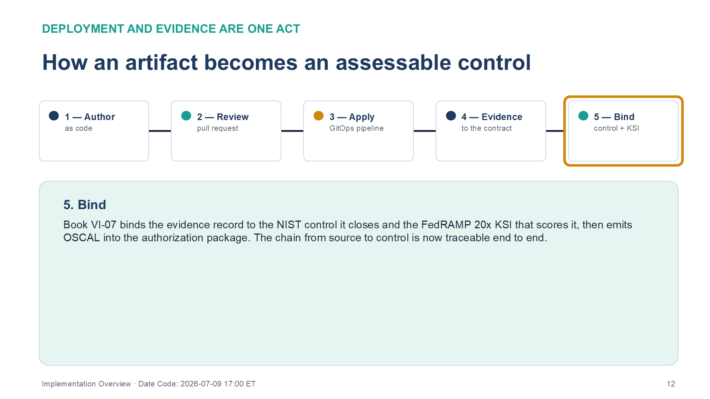
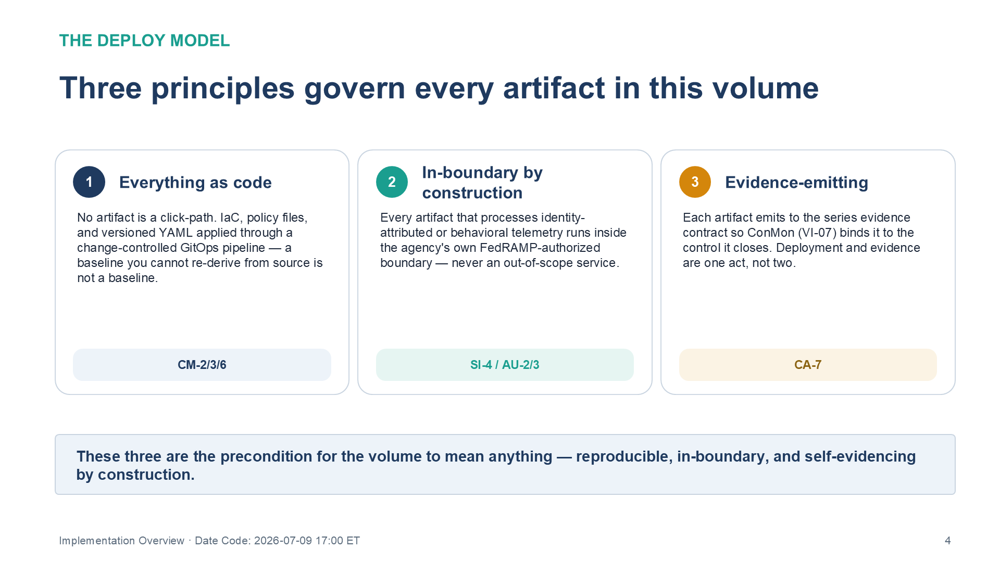
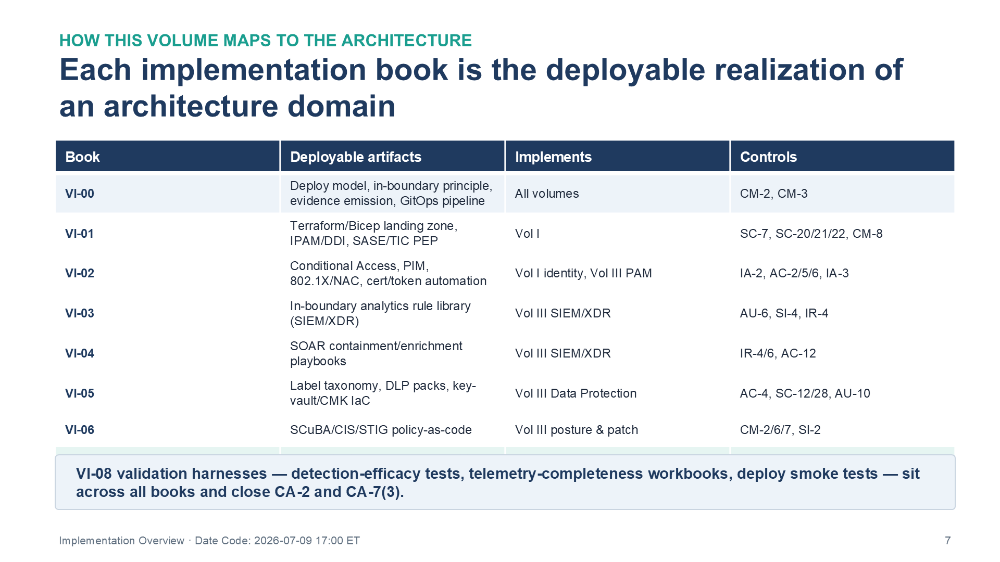

::: {.fouo-banner}
INTERNAL — NOT FOR PUBLIC DISTRIBUTION
:::

::: {.callout-warning}
## Draft Proposal — Subject to Review

This document is a **draft proposal** developed by the **CSI Team (Cloud Services Infrastructure)**. It is an attempt at a comprehensive SSA-wide technical roadmap and has not been reviewed or approved by the SSA CIO Office, the Office of Information Security (OIS), or organizational leadership. All recommendations, vendor selections, control mappings, and implementation timelines are subject to revision pending formal review by the SSA CIO Office and organizational components.

**Date Code:** 2026-07-09 15:13 ET
:::

::: {.callout-important}
**Series Context** — This is the Volume VI overview of the Federal Application-Aware Networking series. Volumes I–IV establish the architecture — the network and transport plane, the data platform, security operations, and governance and assurance — as *what must be true and why*, argued from control text, physics, and protocol behavior. Volume V addresses training and certification. **Volume VI is the deployable counterpart to the architecture volumes: the infrastructure-as-code, detection rules, response playbooks, configuration baselines, and evidence wiring that actually stand the architecture up.** Where an architecture book says a control is closed by a mechanism, the corresponding Volume VI book carries the artifact that deploys that mechanism.
:::

# What This Document Addresses

The architecture volumes answer *what* and *why*: which controls a mechanism closes, and why no alternate mechanism closes them. They deliberately stop short of the deployment detail, because architecture that is entangled with a specific tenant's wiring ages badly and reads as advocacy for a product rather than demonstration of a control.

This volume answers *how*. It carries the artifacts an engineering team applies to a tenant to make the architecture real: landing-zone and network infrastructure-as-code, identity and access policy expressed as code, the detection-engineering rule library, response-automation playbooks, data-protection deployment packs, configuration baselines, the evidence-and-continuous-monitoring pipeline, and the validation harnesses that prove the deployment works.

A control-closure claim in an architecture volume is a *design assertion*. The matching Volume VI artifact is the *operational realization* of that assertion — and the thing an assessor can actually run, inspect, and trace to a control. This volume is where "the SSP says we do X" becomes "here is the code that does X and the evidence that it ran."

{#fig-vol6b00-pipeline fig-alt="A horizontal five-stage pipeline diagram, left to right, showing how a deployable artifact becomes an assessable control. Stage 1, Author — the intended state is expressed as code (Terraform, Bicep, or versioned YAML), never a portal click. Stage 2, Review — the change is proposed in a pull request and reviewed against intent, where CM-3 change control becomes a gate in the path to production. Stage 3, Apply — the change-controlled GitOps pipeline applies the approved source to the tenant idempotently, so deployed state equals reviewed source. Stage 4, Evidence — the artifact emits a normalized record to the series evidence contract as it deploys, so deployment and evidence are the same act. Stage 5, Bind (highlighted) — Book VI-07 binds the evidence record to the NIST control it closes and the FedRAMP 20x Key Security Indicator that scores it, then emits OSCAL into the authorization package, making the chain from source to control traceable end to end. All five stages are shown connected in sequence with the final Bind stage emphasized. White background. Source: Vol VI Book 00 — Federal Application-Aware Networking — Implementation Overview briefing deck, Date Code 2026-07-09 17:00 ET." width="100%"}

::: {.callout-note}
**Architecture vs. Implementation** — The architecture volumes are mechanism-level and, by design, product-neutral: they name the *function* that closes a control. This volume is necessarily more concrete — you cannot deploy a function, you deploy a product that realizes it. Every artifact here therefore names a **deployed example** (for the SSA estate, most often the Microsoft-cloud realization) while preserving a substitution column, because the series is multi-CSP and the mechanism, not the product, is the load-bearing claim. Swapping the deployed example changes the artifact's syntax, never the control it closes.
:::

# The Deploy Model

Three principles govern every artifact in this volume.

{#fig-vol6b00-principles fig-alt="Three side-by-side principle cards summarizing the Volume VI deploy model. Card 1, Everything as code — no artifact is a click-path; infrastructure-as-code, policy files, and versioned YAML are applied through a change-controlled GitOps pipeline, because a baseline you cannot re-derive from source is not a baseline; tagged with controls CM-2/3/6. Card 2, In-boundary by construction — every artifact that processes identity-attributed or behavioral telemetry runs inside the agency's own FedRAMP-authorized boundary, never an out-of-scope service; tagged SI-4 / AU-2/3. Card 3, Evidence-emitting — each artifact emits to the series evidence contract so continuous monitoring (Book VI-07) binds it to the control it closes, making deployment and evidence one act, not two; tagged CA-7. A banner beneath the cards states these three are the precondition for the volume to mean anything: reproducible, in-boundary, and self-evidencing by construction. White background. Source: Vol VI Book 00 — Federal Application-Aware Networking — Implementation Overview briefing deck, Date Code 2026-07-09 17:00 ET." width="100%"}

## Everything as code, applied through a pipeline

No artifact in this volume is a click-path. Landing zones are Terraform or Bicep; Conditional Access, DLP policy, and sensitivity labels are declarative policy files; detection rules and playbooks are versioned YAML. Each is applied through a change-controlled pipeline (GitOps), so that the deployed state is reproducible, reviewable, and diffable against its intended state. This is the precondition for CM-2/CM-3/CM-6 to mean anything: a baseline you cannot re-derive from source is not a baseline.

## In-boundary by construction

Every artifact that processes identity-attributed or behavioral telemetry runs **inside the agency's own FedRAMP-authorized boundary**. The constraint a modern SaaS boundary imposes is about the *destination* of raw telemetry, not the data itself: the same sign-in, audit, device, and data-protection telemetry that may not be exported to a vendor's commercial multi-tenant analytics service may be analyzed inside the agency's own workspace, because that is exactly the in-boundary monitoring SI-4 and AU-2/AU-3 contemplate. The moment an artifact ships that telemetry to an out-of-scope service for convenience, it recreates the very flow the boundary forbids — as the agency's own finding. Every component an artifact depends on must itself carry an authorization commensurate with the data it handles.

## Evidence-emitting by default

An artifact that deploys a control but produces no machine-readable evidence of doing so has done half the job. Each Volume VI artifact emits to the series **evidence contract** — the normalized record every deployed mechanism writes so that the continuous-monitoring pipeline (Book VI-07) can bind it to the control it closes and carry it into the authorization package. Deployment and evidence are one act, not two.

# How This Volume Maps to the Architecture

Each implementation book is the deployable realization of one or more architecture books. The volume is organized by **artifact class** rather than by re-mirroring the architecture domains, because deployable artifacts share tooling and lifecycle regardless of which domain they serve.

{#fig-vol6b00-map fig-alt="A four-column table mapping each Volume VI implementation book to the architecture it deploys. Columns are Book, Deployable artifacts, Implements, and Controls. Rows: VI-00 — deploy model, in-boundary principle, evidence emission, GitOps pipeline — implements all volumes — CM-2, CM-3. VI-01 — Terraform/Bicep landing zone, IPAM/DDI, SASE/TIC PEP — implements Vol I — SC-7, SC-20/21/22, CM-8. VI-02 — Conditional Access, PIM, 802.1X/NAC, cert/token automation — implements Vol I identity and Vol III PAM — IA-2, AC-2/5/6, IA-3. VI-03 — in-boundary analytics rule library (SIEM/XDR) — implements Vol III SIEM/XDR — AU-6, SI-4, IR-4. VI-04 — SOAR containment/enrichment playbooks — implements Vol III SIEM/XDR — IR-4/6, AC-12. VI-05 — label taxonomy, DLP packs, key-vault/CMK IaC — implements Vol III Data Protection — AC-4, SC-12/28, AU-10. VI-06 — SCuBA/CIS/STIG policy-as-code — implements Vol III posture and patch — CM-2/6/7, SI-2. A banner notes that the VI-08 validation harnesses — detection-efficacy tests, telemetry-completeness workbooks, and deploy smoke tests — sit across all books and close CA-2 and CA-7(3). White background. Source: Vol VI Book 00 — Federal Application-Aware Networking — Implementation Overview briefing deck, Date Code 2026-07-09 17:00 ET." width="100%"}

| Book | Deployable artifacts | Implements | Representative controls operationalized |
|---|---|---|---|
| **VI-00** (this book) | Deploy model, in-boundary principle, evidence emission, GitOps pipeline | all volumes | CM-2, CM-3 (the pipeline itself) |
| **VI-01 — Landing Zone & Network as Code** | Terraform/Bicep: landing zone, IPAM/DDI, SASE/TIC PEP | Vol I | SC-7, SC-20/21/22, CM-8 |
| **VI-02 — Identity & Access as Code** | Conditional Access-as-code, PIM config, 802.1X/NAC profiles, cert/token automation | Vol I identity, Vol III PAM | IA-2, AC-2/5/6, IA-3 |
| **VI-03 — Detection Engineering** | The in-boundary analytics rule library (SIEM/XDR) | Vol III SIEM/XDR | AU-6, SI-4, IR-4 |
| **VI-04 — Response Automation (SOAR)** | Containment/enrichment playbooks | Vol III SIEM/XDR | IR-4/6, AC-12 |
| **VI-05 — Data Protection Deployment** | Label taxonomy-as-code, DLP policy packs, key-vault/CMK IaC | Vol III Data Protection | AC-4, SC-12/28, AU-10 |
| **VI-06 — Configuration Baselines & Hardening** | SCuBA/CIS/STIG policy-as-code | Vol III posture & patch | CM-2/6/7, SI-2 |
| **VI-07 — Evidence & ConMon Pipeline** | Telemetry→evidence-contract→KSI wiring, OSCAL emission | Vol III Evidence Fabric, Vol IV | CA-7, AU-6(1) |
| **VI-08 — Validation & Test Harnesses** | Detection-efficacy tests, telemetry-completeness workbooks, deploy smoke tests | all | CA-2, CA-7(3) |

# Closure Necessity — What Implementation Does and Does Not Close

::: {.callout-tip}
## Closure Necessity — Implementation operationalizes, it does not re-close

Volume VI does **not** claim to close controls the architecture volumes already claim; that would double-count. Its necessity is of a different kind: **a control-closure claim that is not deployed as code, and does not emit evidence, is not assessable.** AU-6 is not satisfied by a SIEM with no rules; CM-6 is not satisfied by a baseline no pipeline enforces; CA-7 is not satisfied by evidence no pipeline emits. The architecture volumes prove the mechanism is *sufficient*; this volume is what makes the closure *demonstrable*. Remove it and the SSP describes controls no assessor can exercise — the gap between a designed control and an operating one.
:::

# What This Volume Is and Is Not

It **is** the agency-side build layer — the code and evidence that turn the architecture into an operating, assessable posture. It **is not** a claim that any single product is the only way to deploy the architecture: every artifact names a deployed example and preserves the substitution path, because the mechanism is the invariant. And it **is not** a replacement for the operate-and-tune discipline: deployed detections rot, baselines drift, and sources silently stop emitting — the standing engineering capability that maintains these artifacts is the real cost, addressed per-book and validated in Book VI-08.

# Cross-References

- **Architecture spine:** the four doctrine volumes (I–IV) each carry the control-closure claims this volume operationalizes.
- **Evidence contract:** the normalized deployment-evidence record every artifact emits (Book VI-07).
- **Series compliance spine:** `aan-compliance-spine.yml` — the single source of truth for the control × book closure map.

# Provenance

This overview establishes the deployable-artifact layer of the Federal Application-Aware Networking series. It follows the series authoring conventions: functions and planes are named, not organizations; products are deployed examples of a mechanism, never the mechanism itself; and every artifact carries a Date Code and cites vendor sources for vendor-specific claims.
