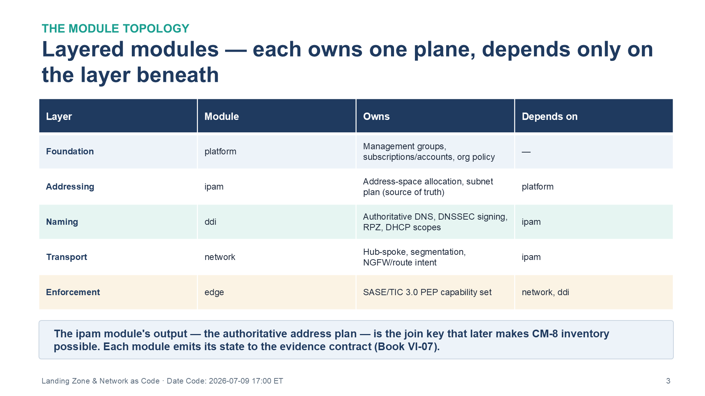
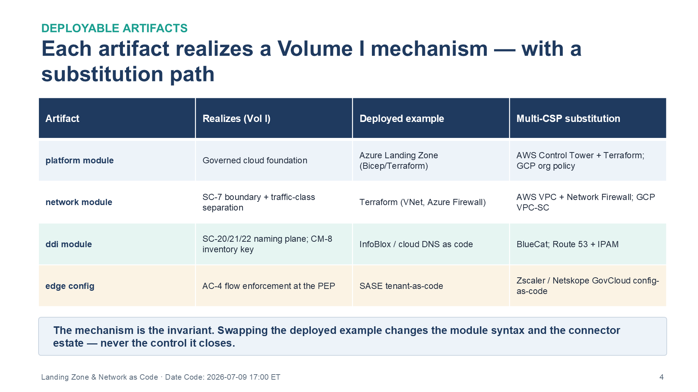
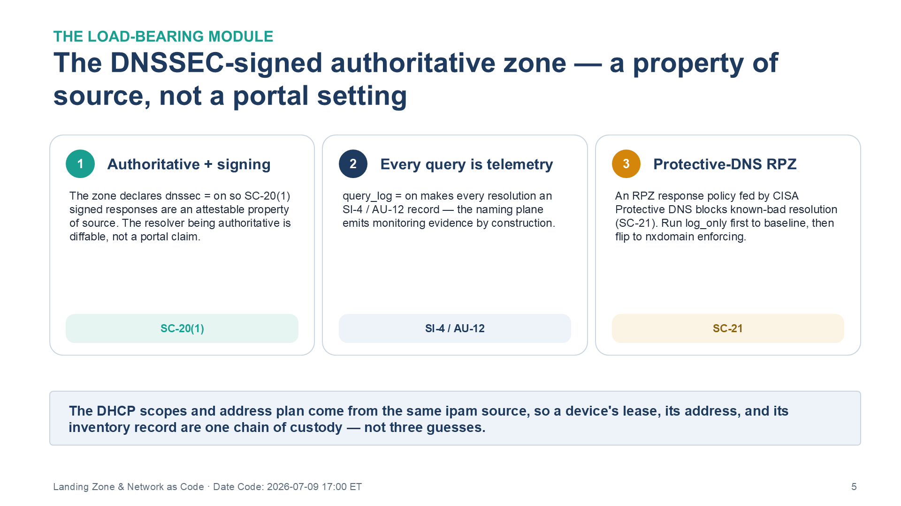

::: {.fouo-banner}
INTERNAL — NOT FOR PUBLIC DISTRIBUTION
:::

::: {.aan-warning}
## Draft Proposal — Subject to Review
Developed by the **CSI Team (Cloud Services Infrastructure)**; not yet reviewed or approved by the  CIO Office, OIS, or leadership. **Date Code:** 2026-07-09 15:13 ET
:::

::: {.aan-important}
**Series Context** — Volume VI Book 01. This is the deployable realization of **Volume I (Foundation & Transport)**: the landing zone, IPAM/DDI naming-and-addressing plane, and the SASE/TIC distributed policy-enforcement edge, expressed as infrastructure-as-code applied through the Book VI-00 pipeline.
:::

# What This Document Addresses

Volume I argues that authoritative naming/addressing and a distributed enforcement edge are the only mechanisms that close the DNS-authority, boundary-protection, and component-inventory controls: you cannot attest authoritative name resolution without an authoritative resolver, and you cannot inventory what you cannot enumerate. No scanner creates that source of truth; it can only measure drift from one.

This book carries the code that stands the source of truth up. It expresses the landing-zone scaffolding, the DDI plane, and the enforcement-edge configuration as version-controlled modules, so the closure Volume I designs is reproducible from source and diffable against intent — not assembled by hand and then hoped to be correct.

# The Module Topology

The deployment is a layered set of modules, each owning one plane and depending only on the layer beneath it. The layering is deliberate: the naming/addressing plane must exist before workloads can be enumerated against it, and the enforcement edge must read from it.

{#fig-vol6b01-topology fig-alt="A four-column table showing the layered infrastructure-as-code module topology for the landing zone. Columns are Layer, Module, Owns, and Depends on. Rows, bottom-up in dependency order: Foundation layer — platform module — owns management groups, subscriptions/accounts, and org policy — depends on nothing. Addressing layer — ipam module — owns address-space allocation and the subnet plan, which is the source of truth — depends on platform. Naming layer — ddi module — owns authoritative DNS, DNSSEC signing, RPZ, and DHCP scopes — depends on ipam. Transport layer — network module — owns hub-spoke topology, segmentation, and NGFW/route intent — depends on ipam. Enforcement layer — edge module — owns the SASE/TIC 3.0 policy-enforcement-point capability set — depends on network and ddi. A banner beneath the table states the ipam module's output, the authoritative address plan, is the join key that later makes CM-8 inventory possible, and each module emits its state to the evidence contract in Book VI-07. White background. Source: Vol VI Book 01 — Federal Application-Aware Networking — Landing Zone & Network as Code briefing deck, Date Code 2026-07-09 17:00 ET." width="100%"}

| Layer | Module | Owns | Depends on |
|---|---|---|---|
| Foundation | `platform` | Management groups, subscriptions/accounts, org policy | — |
| Addressing | `ipam` | Address-space allocation, subnet plan (source of truth) | `platform` |
| Naming | `ddi` | Authoritative DNS, DNSSEC signing, RPZ, DHCP scopes | `ipam` |
| Transport | `network` | Hub-spoke, segmentation, NGFW/route intent | `ipam` |
| Enforcement | `edge` | SASE/TIC 3.0 PEP capability set | `network`, `ddi` |

Each module emits its state to the evidence contract (Book VI-07); the `ipam` module's output — the authoritative address plan — is the join key that later makes CM-8 inventory possible.

# Deployable Artifacts

| Artifact | Realizes (Vol I) | Deployed example | Multi-CSP substitution |
|---|---|---|---|
| `platform` module | Governed cloud foundation | Azure Landing Zone (Bicep/Terraform) | AWS Control Tower + Terraform; GCP org policy |
| `network` module (hub-spoke, segmentation, NGFW/route intent) | SC-7 boundary + traffic-class separation | Terraform (VNet, Azure Firewall) | AWS VPC + Network Firewall; GCP VPC-SC |
| `ddi` module (authoritative DNS, DNSSEC signing, RPZ, DHCP scopes) | SC-20/21/22 naming plane; CM-8 address-keyed inventory | InfoBlox / cloud DNS as code | BlueCat; Route 53 + IPAM |
| `edge` config (SASE/TIC 3.0 PEP capability set) | AC-4 flow enforcement at the distributed PEP | SASE tenant-as-code | Zscaler/Netskope GovCloud config-as-code |

{#fig-vol6b01-artifacts fig-alt="A four-column table listing the deployable landing-zone artifacts. Columns are Artifact, Realizes (Vol I), Deployed example, and Multi-CSP substitution. Rows: platform module — realizes a governed cloud foundation — deployed example Azure Landing Zone in Bicep/Terraform — substitution AWS Control Tower plus Terraform, or GCP org policy. network module (hub-spoke, segmentation, NGFW/route intent) — realizes SC-7 boundary plus traffic-class separation — deployed example Terraform with VNet and Azure Firewall — substitution AWS VPC plus Network Firewall, or GCP VPC-SC. ddi module — realizes the SC-20/21/22 naming plane and CM-8 inventory key — deployed example InfoBlox or cloud DNS as code — substitution BlueCat, or Route 53 plus IPAM. edge config — realizes AC-4 flow enforcement at the PEP — deployed example SASE tenant-as-code — substitution Zscaler or Netskope GovCloud config-as-code. A banner states the mechanism is the invariant: swapping the deployed example changes the module syntax and the connector estate, never the control it closes. White background. Source: Vol VI Book 01 — Federal Application-Aware Networking — Landing Zone & Network as Code briefing deck, Date Code 2026-07-09 17:00 ET." width="100%"}

## Illustrative module — the DNSSEC-signed authoritative zone

The naming plane is the load-bearing one, because it is the source of truth SC-20/21/22 and CM-8 depend on. The zone, its DNSSEC signing posture, and its protective-DNS (RPZ) response policy are all declared, so "the resolver is authoritative and signing" is an attestable property of source, not a portal setting.

{#fig-vol6b01-dnssec fig-alt="Three side-by-side cards describing the load-bearing ddi naming module declared as code. Card 1, Authoritative plus signing — the zone declares dnssec = on, so SC-20 signed responses are an attestable property of source; the resolver being authoritative is diffable, not a portal claim; tagged SC-20. Card 2, Every query is telemetry — query_log = on makes every resolution an SI-4 / AU-12 record, so the naming plane emits monitoring evidence by construction; tagged SI-4 / AU-12. Card 3, Protective-DNS RPZ — the recursive resolver performs DNSSEC validation for SC-21, and an RPZ response policy fed by CISA Protective DNS blocks known-bad resolution as the SC-21 protective-DNS complement, run in log_only mode first to baseline benign traffic, then flipped to nxdomain enforcing; tagged SC-21. A banner beneath the cards states the DHCP scopes and address plan come from the same ipam source, so a device's lease, its address, and its inventory record are one chain of custody rather than three guesses. White background. Source: Vol VI Book 01 — Federal Application-Aware Networking — Landing Zone & Network as Code briefing deck, Date Code 2026-07-09 17:00 ET." width="100%"}

```hcl
# ddi module — authoritative, DNSSEC-signed zone with protective-DNS RPZ (deployed example: cloud DNS)
resource "dns_zone" "agency" {
  name        = var.zone_fqdn          # e.g. 
  dnssec      = "on"                    # SC-20: signed responses (data origin authentication)
  query_log   = "on"                    # SI-4 / AU-12: every resolution is telemetry
}

resource "dns_resolver" "agency" {
  dnssec_validation = "on"              # SC-21: recursive resolver validates upstream signatures
}

resource "dns_rpz_policy" "protective" {
  zone            = dns_zone.agency.id
  feed            = var.protective_dns_feed   # CISA Protective DNS / commercial TI
  action          = "nxdomain"                # SC-21 protective-DNS complement: block known-bad resolution
  log_only        = false                     # TUNE: run log_only first to baseline
}

output "authoritative_zone_id" {              # consumed by CM-8 inventory join
  value = dns_zone.agency.id
}
```

The DHCP scopes and the address plan come from the same `ipam` source, so a device's lease, its address, and its inventory record are one chain of custody rather than three independent guesses.

# Deployment

1. Apply `platform`, then `ipam`, then `ddi`/`network` in dependency order through the change-controlled pipeline (Book VI-00) — never a portal.
2. Run `ddi` in RPZ `log_only` mode first to baseline benign resolution, then flip to enforcing.
3. Register the `ipam` output as the authoritative inventory source the CM-8 join reads.
4. Point the `edge` (SASE/TIC PEP) at the `ddi` resolver so egress name resolution is governed at the enforcement point.

# Closure Necessity

::: {.aan-tip}
## Closure Necessity — a source of truth you cannot re-derive is not one
Volume I's claim is that no scanner *creates* authoritative naming or inventory — it only measures drift from a source of truth. This book is what makes that source of truth **reproducible**: an IPAM/DDI plane and a boundary defined in code can be re-derived, diffed, and attested. A hand-built landing zone weakens the accuracy and completeness evidence CM-8's System Component Inventory demands, because there is no authority to point at — only a snapshot no one can regenerate.
:::

# Controls Operationalized

| Control | Title | How this book deploys it |
|---|---|---|
| SC-7 | Boundary Protection | Segmentation + NGFW/route intent as code at the enforcement edge |
| SC-20 | Secure Name/Address Resolution Service (Authoritative Source) | DNSSEC-signing authoritative resolver as code |
| SC-21 | Secure Name/Address Resolution Service (Recursive or Caching Resolver) | Validating recursive resolver + RPZ protective DNS |
| SC-22 | Architecture and Provisioning for Name/Address Resolution Service | Authoritative and recursive resolver roles declared as distinct resources in the `ddi` module |
| CM-8 | System Component Inventory | Address-keyed inventory derived from the IPAM source of truth |
| AC-4 | Information Flow Enforcement | Application-aware flow policy at the SASE/TIC PEP |

# Honest Limits

- The IaC deploys the *mechanism*; it does not repeal operational discipline — an out-of-band portal change still causes drift, which is why Book VI-08's smoke tests re-assert the intended state.
- Protective-DNS efficacy is bounded by the threat-intelligence feed the agency subscribes to (the RPZ is only as current as its feed).
- Multi-CSP substitution changes the module syntax and the connector estate; the naming/addressing/enforcement mechanism it realizes is invariant.

# Cross-References

- **Volume I — Foundation & Transport** — the architecture this book deploys.
- **Book VI-00** — the pipeline and evidence-emission model.
- **Book VI-06** — the baselines that harden the deployed platform.
- **Book VI-07** — where deployment state emits to the evidence contract.
- **Book VI-08** — smoke tests that re-assert the deployed boundary.

# Provenance

Draft. Products named are deployed examples of the naming/addressing and enforcement mechanisms Volume I identifies; multi-CSP substitutions preserve the mechanism. The Terraform above is an illustrative pattern to adapt, not a drop-in module — validate against the agency's cloud and current provider schema. Vendor-specific IaC claims cite vendor documentation as the source.
