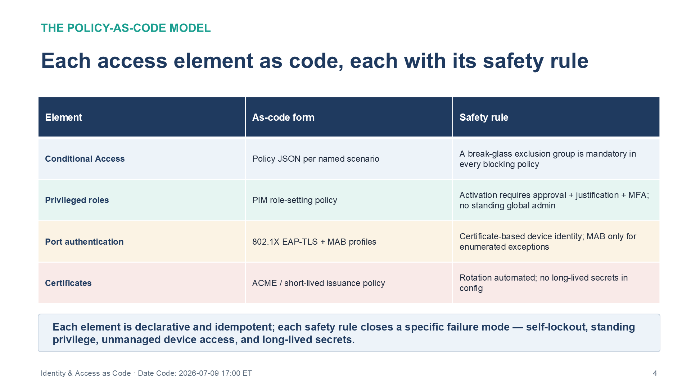
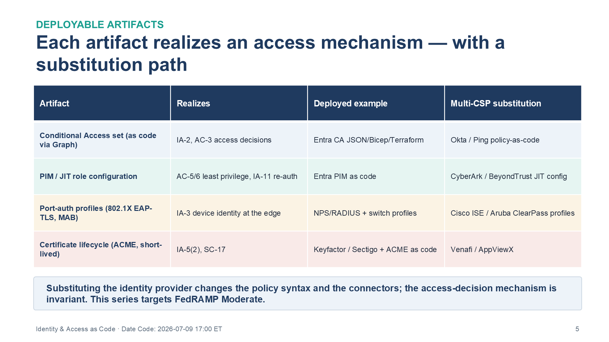
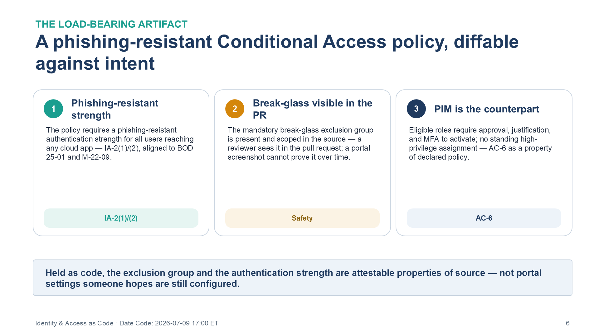

::: {.fouo-banner}
INTERNAL — NOT FOR PUBLIC DISTRIBUTION
:::

::: {.aan-warning}
## Draft Proposal — Subject to Review
Developed by the **CSI Team (Cloud Services Infrastructure)**; not yet reviewed or approved by the  CIO Office, OIS, or leadership. **Date Code:** 2026-07-09 15:13 ET
:::

::: {.aan-important}
**Series Context** — Volume VI Book 02. Deployable realization of the identity plane of **Volume I** and the privileged-access architecture of **Volume III (PAM)**: Conditional Access, PIM/JIT, port authentication, and certificate lifecycle as versioned policy applied through the Book VI-00 pipeline.
:::

# What This Document Addresses

The architecture volumes establish that a verified identity, phishing-resistant authentication, and just-in-time elevation are the mechanisms that gate access. Those decisions are worthless as portal clicks — a Conditional Access estate no one can diff is a control no assessor can trace, and IA-2/AC-6 become assertions rather than evidence.

This book expresses the access decisions as code: Conditional Access as a reviewable policy set, privileged roles as declarative JIT configuration, port authentication as profiles, and certificates as an automated lifecycle. The invariant it enforces is that **every access decision has a reviewable source of truth** that the pipeline applies and Book VI-08 re-asserts.

# The Policy-as-Code Model

Access policy is held as declarative files, applied idempotently, and guarded by two safety rules that prevent the classic self-lockout and silent-drift failures.

{#fig-vol6b02-elements fig-alt="A three-column table mapping each access element to its as-code form and its safety rule. Columns are Element, As-code form, and Safety rule. Rows: Conditional Access — as-code form is policy JSON per named scenario — safety rule is a break-glass exclusion group mandatory in every blocking policy. Privileged roles — as-code form is a PIM role-setting policy — safety rule is that activation requires approval plus justification plus MFA, with no standing global admin. Port authentication — as-code form is 802.1X EAP-TLS plus MAB profiles — safety rule is certificate-based device identity, with MAB only for enumerated exceptions. Certificates — as-code form is an ACME or short-lived issuance policy — safety rule is automated rotation with no long-lived secrets in config. A banner states each element is declarative and idempotent, and each safety rule closes a specific failure mode: self-lockout, standing privilege, unmanaged device access, and long-lived secrets. White background. Source: Vol VI Book 02 — Federal Application-Aware Networking — Identity & Access as Code briefing deck, Date Code 2026-07-09 17:00 ET." width="100%"}

| Element | As-code form | Safety rule |
|---|---|---|
| Conditional Access | Policy JSON per named scenario | A **break-glass** exclusion group is mandatory in every blocking policy |
| Privileged roles | PIM role-setting policy | Activation requires approval + justification + MFA; no standing global admin |
| Port authentication | 802.1X EAP-TLS + MAB profiles | Certificate-based device identity; MAB only for enumerated exceptions |
| Certificates | ACME / short-lived issuance policy | Rotation automated; no long-lived secrets in config |

# Deployable Artifacts

| Artifact | Realizes | Deployed example | Multi-CSP substitution |
|---|---|---|---|
| Conditional Access policy set (as code via Graph) | IA-2, AC-3 access decisions | Entra CA JSON/Bicep/Terraform | Okta/Ping policy-as-code |
| PIM / JIT role configuration | AC-5/6 separation of duties and least privilege, IA-11 re-auth | Entra PIM as code | CyberArk/BeyondTrust JIT config |
| Port-authentication profiles (802.1X EAP-TLS, MAB) | IA-3 device identity at the edge | NPS/RADIUS + switch profiles | Cisco ISE / Aruba ClearPass profiles |
| Certificate lifecycle automation (ACME, short-lived certs) | IA-5(2), SC-17 | Keyfactor/Sectigo + ACME as code | Venafi / AppViewX |

{#fig-vol6b02-artifacts fig-alt="A four-column table listing the deployable identity-and-access artifacts. Columns are Artifact, Realizes, Deployed example, and Multi-CSP substitution. Rows: Conditional Access set (as code via Graph) — realizes IA-2 and AC-3 access decisions — deployed example Entra CA JSON/Bicep/Terraform — substitution Okta or Ping policy-as-code. PIM / JIT role configuration — realizes AC-5/6 separation of duties and least privilege and IA-11 re-auth — deployed example Entra PIM as code — substitution CyberArk or BeyondTrust JIT config. Port-auth profiles (802.1X EAP-TLS, MAB) — realizes IA-3 device identity at the edge — deployed example NPS/RADIUS plus switch profiles — substitution Cisco ISE or Aruba ClearPass profiles. Certificate lifecycle (ACME, short-lived) — realizes IA-5(2) and SC-17 — deployed example Keyfactor or Sectigo plus ACME as code — substitution Venafi or AppViewX. A banner states substituting the identity provider changes the policy syntax and the connectors while the access-decision mechanism is invariant, and that this series targets FedRAMP Moderate. White background. Source: Vol VI Book 02 — Federal Application-Aware Networking — Identity & Access as Code briefing deck, Date Code 2026-07-09 17:00 ET." width="100%"}

## Illustrative artifact — a phishing-resistant Conditional Access policy as code

The policy below requires a phishing-resistant authentication strength for all users reaching any cloud app, with the mandatory break-glass exclusion. Held as code, it is diffable against intent; a reviewer can see in the pull request that the exclusion group is present and scoped, which a portal screenshot can never prove over time.

```jsonc
// Conditional Access policy (deployed example: Entra, applied via Graph) — IA-2(1)/(2)
{
  "displayName": "CA001 - Require phishing-resistant MFA for all cloud apps",
  "state": "enabled",
  "conditions": {
    "users":        { "includeUsers": ["All"], "excludeGroups": ["grp-breakglass"] }, // SAFETY: break-glass
    "applications": { "includeApplications": ["All"] },
    "clientAppTypes": ["all"]
  },
  "grantControls": {
    "operator": "OR",
    "authenticationStrength": { "id": "phishing-resistant" }   // BOD 25-01 / M-22-09 alignment
  }
}
```

{#fig-vol6b02-ca fig-alt="Three side-by-side cards describing the load-bearing Conditional Access artifact held as code and diffable against intent. Card 1, Phishing-resistant strength — the policy requires a phishing-resistant authentication strength for all users reaching any cloud app, aligned to BOD 25-01 and M-22-09; tagged IA-2(1)/(2). Card 2, Break-glass visible in the PR — the mandatory break-glass exclusion group is present and scoped in the source, so a reviewer sees it in the pull request, which a portal screenshot cannot prove over time; tagged Safety. Card 3, PIM is the counterpart — eligible roles require approval, justification, and MFA to activate with no standing high-privilege assignment, making AC-6 a property of the declared policy; tagged AC-6. A banner states that, held as code, the exclusion group and the authentication strength are attestable properties of source, not portal settings someone hopes are still configured. White background. Source: Vol VI Book 02 — Federal Application-Aware Networking — Identity & Access as Code briefing deck, Date Code 2026-07-09 17:00 ET." width="100%"}

The PIM configuration is the privileged-access counterpart: it declares that eligible roles require approval, justification, and MFA to activate, and that no principal holds a standing high-privilege assignment — so AC-6 least privilege is a property of the declared role policy, not an audit finding waiting to happen.

# Deployment

1. Apply Conditional Access in **report-only** first, review the impact against sign-in logs, then enable — the break-glass exclusion is verified present before any policy is set to `enabled`.
2. Apply PIM role settings; migrate any standing privileged assignments to eligible-with-approval.
3. Deploy 802.1X EAP-TLS profiles (Vol I Book 03 supplies the cert authority they trust).
4. Stand up ACME/short-lived certificate automation so no long-lived credential lives in a config file.

# Closure Necessity

::: {.aan-tip}
## Closure Necessity — a policy you cannot review is a policy you cannot assess
Volume I/III prove that phishing-resistant, JIT-scoped identity is the closure mechanism. This book makes those decisions **reviewable**: Conditional Access and privileged-role settings held as code can be diffed against intent and attested. Portal-clicked access policy has no reviewable source — IA-2 and AC-6 become assertions no assessor can trace, and drift is invisible until it is a finding.
:::

# Controls Operationalized

| Control | Title | How this book deploys it |
|---|---|---|
| IA-2(1)/(2) | Identification & Authentication (MFA) | Phishing-resistant CA policy set as code |
| AC-2/5/6 | Account Management / Separation of Duties / Least Privilege | PIM/JIT role config |
| IA-3 | Device Identification & Authentication | 802.1X EAP-TLS profiles |
| IA-5(2)/SC-17 | Public Key-based Authentication / Public Key Infrastructure Certificates | Certificate lifecycle automation |
| IA-11 | Re-authentication | PIM activation re-auth; sign-in frequency in CA |

# Honest Limits

- Conditional Access as code governs the *policy*; a global administrator can still change it out of band — Book VI-08 diffs deployed state against the source to catch that.
- The break-glass account is a deliberate, monitored exception; its use must itself be a high-severity Book VI-03 detection.
- Substituting the identity provider changes the policy syntax and the connectors; the access-decision mechanism is invariant.

# Cross-References

- **Volume I (identity plane)** and **Volume III (PAM)** — the architecture this book deploys.
- **Vol I Book 03** — the certificate authority the port-auth profiles trust.
- **Book VI-04** — SOAR playbooks that consume identity risk to drive revocation.
- **Book VI-07** — access-policy state and reviews emit to the evidence contract.
- **Book VI-08** — deployed-vs-intended policy diffing.

# Provenance

Draft. Products are deployed examples; substitution columns preserve the mechanism. The policy JSON is an illustrative pattern to adapt, not a drop-in policy — validate against the tenant and current Graph schema. Vendor capability claims name deployed examples and substitution candidates; their vendor-documentation sources are carried in the briefing deck spec, not inline here.
