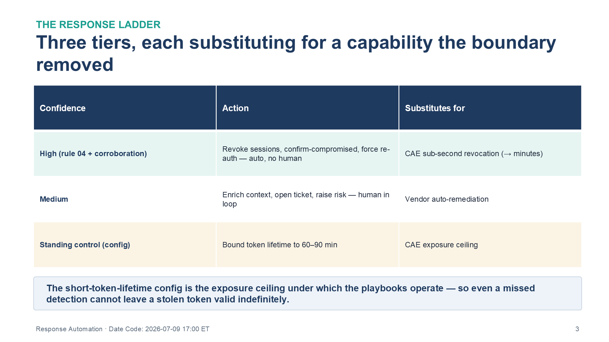
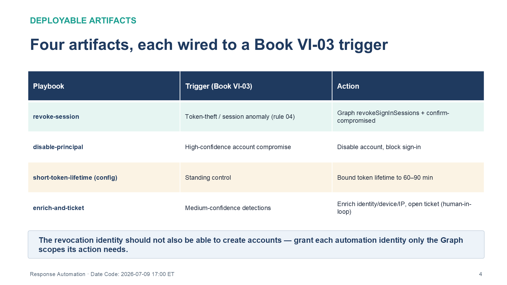
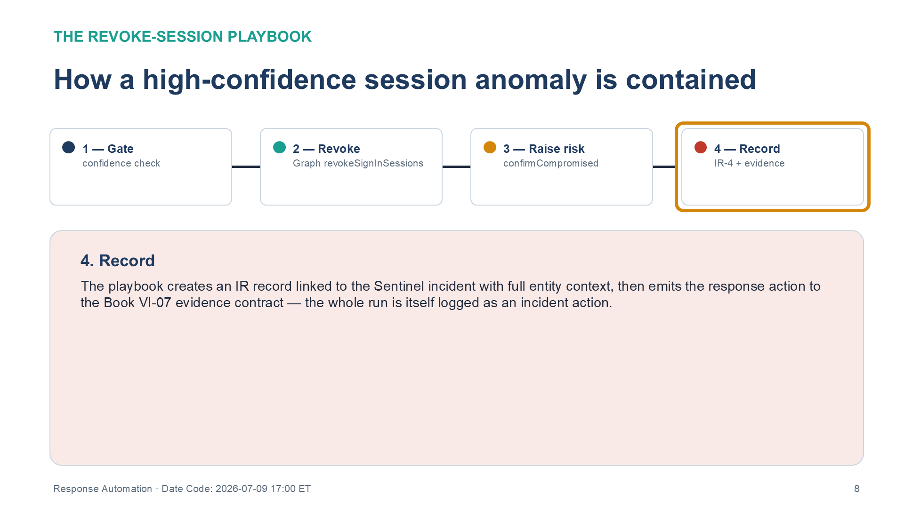

::: {.fouo-banner}
INTERNAL — NOT FOR PUBLIC DISTRIBUTION
:::

::: {.aan-warning}
## Draft Proposal — Subject to Review
Developed by the **CSI Team (Cloud Services Infrastructure)**; not yet reviewed or approved by the SSA CIO Office, OIS, or leadership. **Date Code:** 2026-07-09 15:13 ET
:::

::: {.aan-important}
**Series Context** — Volume VI Book 04. The response half of the detection engine: the playbooks that Book VI-03's rules trigger. It rebuilds the *containment speed* that a commercial cloud's real-time revocation provides, approximated in-boundary to minutes.
:::

# What This Document Addresses

Detection without response only shortens the investigation, not the exposure. The Volume III SIEM/XDR architecture ends at the alert; this book carries the automation that acts on it. It is the in-boundary substitute for the sub-second Continuous Access Evaluation revocation the boundary removes — and it is honest that the substitute lands at minutes, not sub-second, because a playbook triggered by a scheduled analytic cannot beat the analytic's cadence.

The design rule for every playbook here is **confidence-gated action**: high-confidence detections auto-contain; medium-confidence detections enrich and ticket for a human; nothing low-confidence auto-acts. Auto-containment on a noisy rule is its own denial-of-service.

# The Response Ladder

{#fig-vol6b04-ladder fig-alt="A three-column table describing the confidence-gated response ladder. Columns are Confidence, Action, and Substitutes for. Rows: High (rule 04 plus corroboration) — action is revoke sessions, confirm-compromised, and force re-auth, executed automatically with no human — substitutes for CAE sub-second revocation, approximated to minutes. Medium — action is enrich context, open a ticket, and raise risk, with a human in the loop — substitutes for vendor auto-remediation. Standing control (config) — action is to bound token lifetime to 60 to 90 minutes — substitutes for the CAE exposure ceiling. A banner beneath the table states the short-token-lifetime config is the exposure ceiling under which the playbooks operate, so even a missed detection cannot leave a stolen token valid indefinitely. White background. Source: Vol VI Book 04 — Federal Application-Aware Networking — Response Automation: The SOAR Playbook Library briefing deck, Date Code 2026-07-09 17:00 ET." width="100%"}

| Confidence | Action | Human in loop? | Substitutes for |
|---|---|---|---|
| High (e.g. rule 04 session-anomaly with corroboration) | Revoke sessions, confirm-compromised, force re-auth | No — auto | CAE sub-second revocation (→ minutes) |
| Medium | Enrich (identity/device/IP context), open ticket, raise risk | Yes | Vendor auto-remediation |
| Standing control | Bound token lifetime to 60–90 min | n/a — config | CAE exposure ceiling |

# Deployable Artifacts

| Playbook | Trigger (Book VI-03) | Action | Substitutes for |
|---|---|---|---|
| `revoke-session` | Token-theft / session-anomaly (rule 04) | Graph `revokeSignInSessions` + confirm-compromised | CAE sub-second revocation (→ minutes) |
| `disable-principal` | High-confidence account compromise | Disable account, block sign-in | Automated account containment |
| `short-token-lifetime` (config) | Standing control | Bound token lifetime to 60–90 min | CAE exposure ceiling |
| `enrich-and-ticket` | Medium-confidence detections | Enrich with identity/device context, open ticket (human-in-loop) | Vendor auto-remediation |

{#fig-vol6b04-playbooks fig-alt="A three-column table listing the four deployable SOAR playbooks. Columns are Playbook, Trigger (Book VI-03), and Action. Rows: revoke-session — triggered by token-theft / session anomaly (rule 04) — action is Graph revokeSignInSessions plus confirm-compromised. disable-principal — triggered by high-confidence account compromise — action is disable account and block sign-in. short-token-lifetime (config) — a standing control — action is to bound token lifetime to 60 to 90 minutes. enrich-and-ticket — triggered by medium-confidence detections — action is to enrich with identity, device, and IP context and open a ticket with a human in the loop. A banner states the revocation identity should not also be able to create accounts, so each automation identity should be granted only the Graph scopes its action needs. White background. Source: Vol VI Book 04 — Federal Application-Aware Networking — Response Automation: The SOAR Playbook Library briefing deck, Date Code 2026-07-09 17:00 ET." width="100%"}

## Illustrative playbook — session revocation on a high-confidence session anomaly

The `revoke-session` playbook is the containment path for Book VI-03 rule 04. It runs entirely in-boundary against the management plane; the containment action is a Graph call, and the whole run is itself logged as an incident action into the evidence contract.

```jsonc
// Logic App / Automation runbook (deployed example) — pseudocode of the revoke-session flow
{
  "trigger": "Sentinel incident: rule 'token-theft-session-anomaly'",
  "steps": [
    { "guard": "incident.severity == 'High' && entities.Account != null" },        // confidence gate
    { "graph": "POST /users/{account}/revokeSignInSessions" },                      // AC-12 containment
    { "graph": "PATCH /identityProtection/riskyUsers/confirmCompromised",
      "body": { "userIds": ["{account}"] } },                                       // raise risk state
    { "ticket": "create IR record, link Sentinel incident, attach entity context" },// IR-4 record
    { "evidence": "emit response-action to the evidence contract (Book VI-07)" }     // CA-7 evidence
  ],
  "notes": "Containment latency = detection cadence (minutes), not CAE sub-second. TUNE the confidence gate."
}
```

{#fig-vol6b04-revoke fig-alt="A horizontal four-stage pipeline diagram showing how a high-confidence session anomaly is contained, left to right. Stage 1, Gate — the playbook fires on a Sentinel incident from rule 04 and first evaluates the confidence guard, requiring severity High and a non-null Account entity; anything below the gate stops here and routes to enrich-and-ticket. Stage 2, Revoke — a Graph POST to revokeSignInSessions invalidates the account's refresh tokens, the AC-12 session-termination action, executed in-boundary against the management plane. Stage 3, Raise risk — a confirmCompromised call raises the identity risk state. Stage 4, Record — the playbook creates an IR-4 incident record linked to the Sentinel incident with full entity context, then emits the response action to the Book VI-07 evidence contract, so the whole run is itself logged as an incident action. All four stages are shown connected in sequence. White background. Source: Vol VI Book 04 — Federal Application-Aware Networking — Response Automation: The SOAR Playbook Library briefing deck, Date Code 2026-07-09 17:00 ET." width="100%"}

The `short-token-lifetime` artifact is not a playbook but a standing configuration: it bounds the maximum exposure window so that even a *missed* detection cannot leave a stolen token valid indefinitely. It is the exposure ceiling under which the playbooks operate.

# Deployment

1. Deploy playbooks through the pipeline (Book VI-00); grant the automation identity only the Graph scopes each action needs (least privilege — the revocation identity should not also be able to create accounts).
2. Wire each Book VI-03 rule to its playbook via the SIEM automation rules; start every auto-containment playbook in **alert-only** mode and promote to auto-action only after the triggering rule's false-positive rate is measured (Vol III Book 06).
3. Set the standing token-lifetime bound in the certificate & token identity plane (Vol I Book 03).

# Closure Necessity

::: {.aan-tip}
## Closure Necessity — a detection with no response is exposure, not control
IR-4 requires incident *handling*, not just detection. These playbooks are what convert a Book VI-03 firing into a bounded containment action and a documented incident record — the artifact an assessor asks for. Without them, the detection layer shortens time-to-know but not time-to-contain, and the token-theft window stays open for the full token lifetime.
:::

# Controls Operationalized

| Control | Title | How this book deploys it |
|---|---|---|
| IR-4/6 | Incident Handling / Reporting | Automated containment + enriched incident records |
| AC-12 | Session Termination | Session revocation + short token lifetime |
| AC-2(13) | Disable Accounts (high-risk) | `disable-principal` on high-confidence compromise |

# Honest Limits

- Containment is **minutes, not sub-second** — bounded by the detection cadence. The `short-token-lifetime` config is the standing ceiling that makes that latency tolerable.
- Auto-containment amplifies a noisy rule into an availability incident; the confidence gate and the alert-only ramp (Vol III Book 06) are mandatory, not optional.
- The playbooks act only on the agency's own tenant; a compromised identity federated elsewhere is outside their reach.

# Cross-References

- **Book VI-03** — the detections these playbooks respond to.
- **Vol I Book 03** — the token-lifetime standing control (short-lived tokens, refresh-token policy gate).
- **Volume III — SIEM/XDR** — the incident-workflow architecture.
- **Book VI-07** — response actions emit to the evidence contract.
- **Vol III Book 06** — false-positive measurement that gates auto-action.

# Provenance

Draft. Containment latency is honestly minutes, not sub-second. The playbook pseudocode is an illustrative flow to adapt, not a deployable runbook. Products are deployed examples of the SOAR-containment mechanism, which is portable across automation engines.
