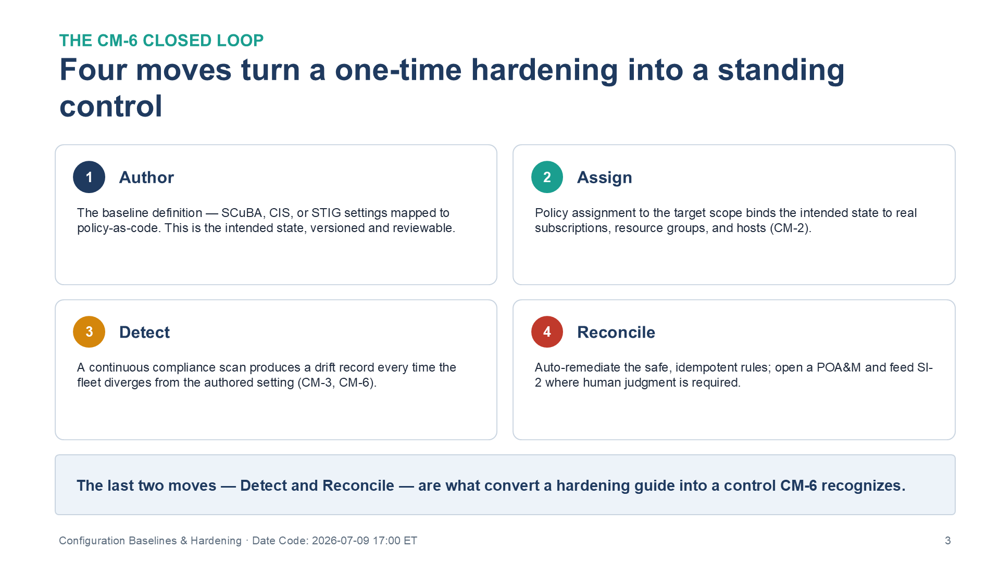
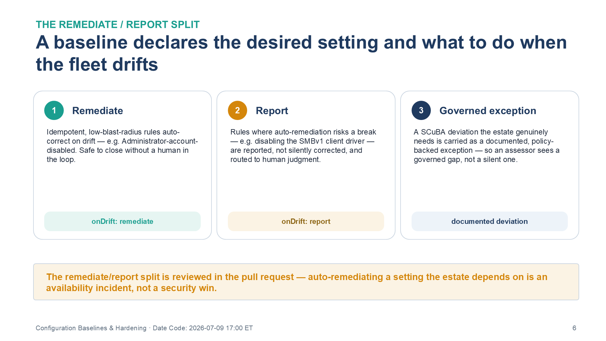
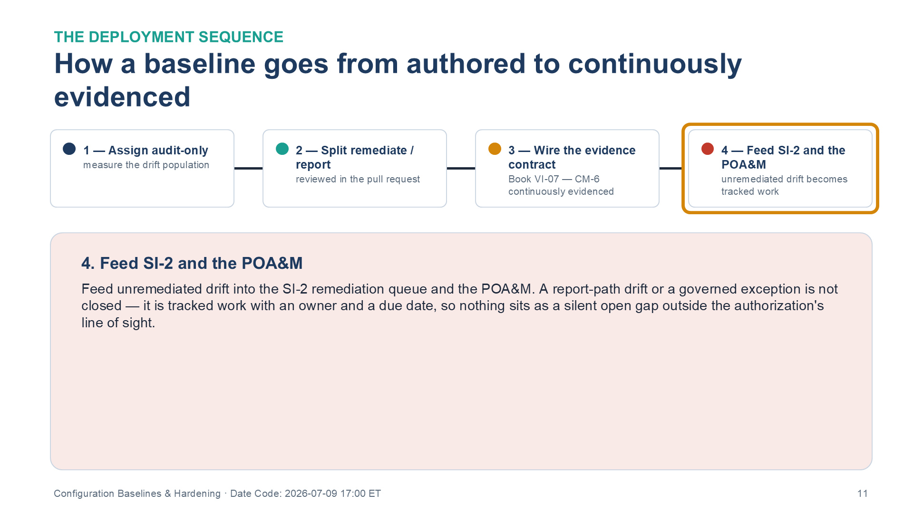

::: {.fouo-banner}
INTERNAL — NOT FOR PUBLIC DISTRIBUTION
:::

::: {.callout-warning}
## Draft Proposal — Subject to Review
Developed by the **CSI Team (Cloud Services Infrastructure)**; not yet reviewed or approved by the SSA CIO Office, OIS, or leadership. **Date Code:** 2026-07-09 15:13 ET
:::

::: {.callout-important}
**Series Context** — Volume VI Book 06. Deployable realization of the configuration and posture architecture of **Volume III (Cloud-Native Posture, Patch & Systems Management)**: secure-baseline policy-as-code with continuous drift detection, applied through the Book VI-00 pipeline.
:::

# What This Document Addresses

A baseline that no pipeline enforces is a document, not a control. Volume III establishes the required secure-configuration posture — SCuBA for the cloud business applications, CIS/STIG for the platforms — and makes the sharp point that conformance tooling *measures drift from an intended state; it cannot author one.*

This book authors the intended state as machine-enforced policy, detects drift against it continuously, and reconciles or reports it. It closes the loop CM-6 actually requires: an enforced configuration, a detection of deviation, and a documented reconciliation — not a spreadsheet of settings someone once applied.

# The Baseline Lifecycle

Each baseline moves through four as-code stages; the last two are what turn a one-time hardening into a standing control.

{#fig-vol6b06-loop fig-alt="A four-card diagram titled 'Four moves turn a one-time hardening into a standing control' under the eyebrow 'The CM-6 closed loop.' Card 1 (navy), Author: the baseline definition — SCuBA, CIS, or STIG settings mapped to policy-as-code; the intended state, versioned and reviewable. Card 2 (teal), Assign: policy assignment to the target scope binds the intended state to real subscriptions, resource groups, and hosts (CM-2). Card 3 (amber), Detect: a continuous compliance scan produces a drift record every time the fleet diverges from the authored setting (CM-3, CM-6). Card 4 (red), Reconcile: auto-remediate the safe, idempotent rules; open a POA&M and feed SI-2 where human judgment is required. A summary bar states the last two moves — Detect and Reconcile — are what convert a hardening guide into a control CM-6 recognizes. White background. Source: Vol VI Book 06 — Federal Application-Aware Networking — Configuration Baselines & Hardening briefing deck, Date Code 2026-07-09 17:00 ET." width="100%"}

| Stage | Artifact | Control tie |
|---|---|---|
| Author | Baseline definition (SCuBA/CIS/STIG mapped to policy) | CM-6 settings |
| Assign | Policy assignment to the target scope | CM-2 baseline |
| Detect | Continuous compliance scan → drift record | CM-3 change; CM-6 |
| Reconcile / report | Auto-remediate where safe; POA&M where not | CM-6; SI-2 feed |

# Deployable Artifacts

| Artifact | Realizes (Vol III) | Deployed example | Multi-CSP substitution |
|---|---|---|---|
| SCuBA baseline conformance packs | CM-6 cloud business-app baseline | ScubaGear assessment + policy-as-code | equivalent CIS cloud benchmark packs |
| Guest/machine-config baselines | CM-2/6 OS configuration | Azure Machine Config (Guest Config) | AWS SSM State Manager; GCP OS Config |
| Host hardening roles | CM-6/7 least functionality | Ansible/DSC roles mapped to STIG/CIS | Chef/Puppet equivalents |
| Drift detection + reconciliation | CM-3 change control; SI-2 flaw feed | Config drift export to evidence contract | native config-compliance exports |

## Illustrative artifact — a machine-config baseline with drift export

The baseline declares the desired setting *and* what to do when the fleet drifts from it. The drift record is not a dashboard tile — it is emitted to the evidence contract so CM-6 compliance is continuously attestable and SI-2 sees the remediation feed.

```yaml
# Guest/machine-config baseline (deployed example: Azure Machine Config) — CM-6
baseline: cis-l1-win-server
assignment:
  scope: /subscriptions/*/resourceGroups/prod
  enforcementMode: AuditThenRemediate     # detect first, remediate the safe rules
rules:
  - id: 2.3.1.1
    setting: "Accounts: Administrator account status"
    desired: "Disabled"
    onDrift: remediate
  - id: 18.9.x
    setting: "Configure SMBv1 client driver"
    desired: "Disabled"
    onDrift: report          # TUNE: report-only where auto-remediation risks a break
driftExport:
  target: evidence-contract  # Book VI-07: every drift + reconciliation is an evidence record
```

The SCuBA conformance packs are the cloud-business-application counterpart: the assessment output is diffed against the intended SCuBA baseline, and any governed exception is carried as a documented deviation rather than an open drift — so an assessor sees a governed exception backed by policy, not a silent gap.

{#fig-vol6b06-split fig-alt="A three-card diagram titled 'A baseline declares the desired setting and what to do when the fleet drifts,' under the eyebrow 'The remediate / report split.' Card 1 (teal), Remediate: idempotent, low-blast-radius rules auto-correct on drift — e.g. Administrator-account-disabled — safe to close without a human in the loop; tagged onDrift: remediate. Card 2 (amber), Report: rules where auto-remediation risks a break — e.g. disabling the SMBv1 client driver — are reported, not silently corrected, and routed to human judgment; tagged onDrift: report. Card 3 (navy), Governed exception: a SCuBA deviation the estate genuinely needs is carried as a documented, policy-backed exception so an assessor sees a governed gap, not a silent one; tagged documented deviation. A summary bar states the remediate/report split is reviewed in the pull request — auto-remediating a setting the estate depends on is an availability incident, not a security win. White background. Source: Vol VI Book 06 — Federal Application-Aware Networking — Configuration Baselines & Hardening briefing deck, Date Code 2026-07-09 17:00 ET." width="100%"}

# Deployment

{#fig-vol6b06-sequence fig-alt="A four-step horizontal sequence titled 'How a baseline goes from authored to continuously evidenced,' with the fourth step highlighted and all connectors filled to show the completed order. Step 1 (navy), Assign audit-only — measure the drift population. Step 2 (teal), Split remediate / report — reviewed in the pull request. Step 3 (amber), Wire the evidence contract — Book VI-07, CM-6 continuously evidenced. Step 4 (red, highlighted), Feed SI-2 and the POA&M — unremediated drift becomes tracked work. The detail panel for step 4 reads: feed unremediated drift into the SI-2 remediation queue and the POA&M; a report-path drift or a governed exception is not closed — it is tracked work with an owner and a due date, so nothing sits as a silent open gap outside the authorization's line of sight. White background. Source: Vol VI Book 06 — Federal Application-Aware Networking — Configuration Baselines & Hardening briefing deck, Date Code 2026-07-09 17:00 ET." width="100%"}

1. Assign each baseline in **audit-only** first; measure the drift population before enabling any auto-remediation — a baseline that auto-remediates a setting the estate depends on is an availability incident.
2. Split rules into `remediate` (safe, idempotent) and `report` (needs human judgment); the split is itself reviewed in the pull request.
3. Wire drift and reconciliation records to the evidence contract (Book VI-07) so CM-6 is continuously evidenced.
4. Feed unremediated drift into the SI-2 remediation queue and the POA&M.

# Closure Necessity

::: {.callout-tip}
## Closure Necessity — an unenforced baseline is not a baseline
Volume III proves conformance tooling *measures drift from an intended state; it cannot author one.* This book authors the intended state as code and enforces it. CM-6 is satisfied only when the baseline is machine-enforced and drift is detected and dispositioned — a spreadsheet of settings no pipeline applies closes nothing, and a scanner with no authored baseline has nothing to measure against.
:::

# Controls Operationalized

| Control | Title | How this book deploys it |
|---|---|---|
| CM-2/6 | Baseline Configuration / Settings | Policy-as-code baselines + drift detection |
| CM-3 | Configuration Change Control | Drift records + reconciliation through the pipeline |
| CM-7 | Least Functionality | Host hardening roles; admission control |
| SI-2 | Flaw Remediation | Drift/patch-state feed into the remediation queue |

# Honest Limits

- Auto-remediation is safe only for idempotent, low-blast-radius settings; the `report` path exists precisely because not every drift can be closed without human judgment.
- SCuBA/CIS/STIG baselines are point-in-time; they must track the publishing authority's updates, or the "baseline" silently ages out of currency.
- Cloud-native posture (CSPM) findings on multi-CSP estates require per-CSP packs; the mechanism is uniform, the pack content is not.

# Cross-References

- **Volume III — Cloud-Native Posture / Patch & Systems Management** — the architecture this book deploys.
- **Book VI-07** — drift and conformance results emit to the evidence contract.
- **Book VI-08** — baseline conformance is validated by the test harnesses.

# Provenance

Draft. Products are deployed examples; substitution columns preserve the mechanism. The baseline YAML is an illustrative pattern to adapt, not a drop-in pack. Baseline sources (CISA SCuBA, CIS Benchmarks, DISA STIG) cite their publishing authority.
