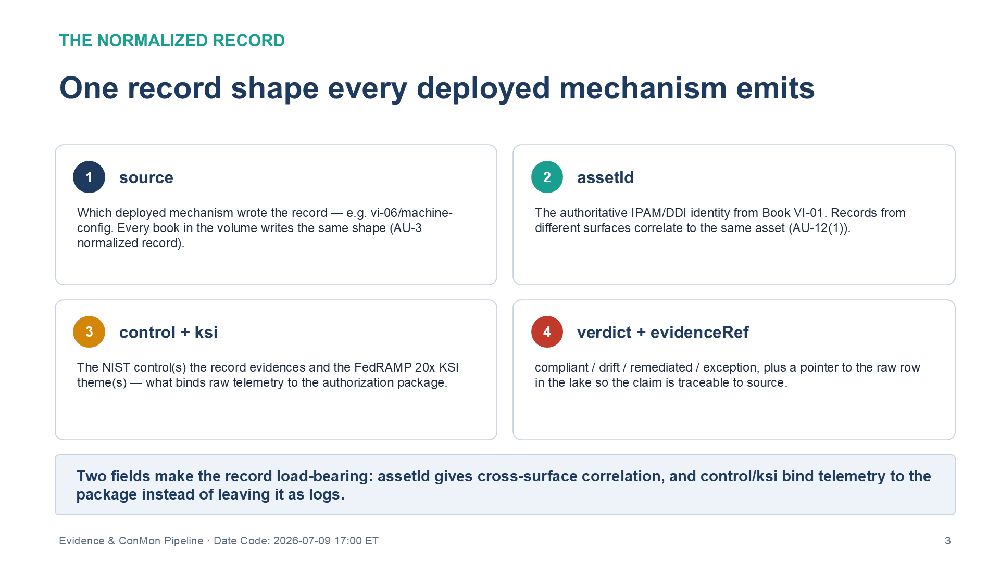
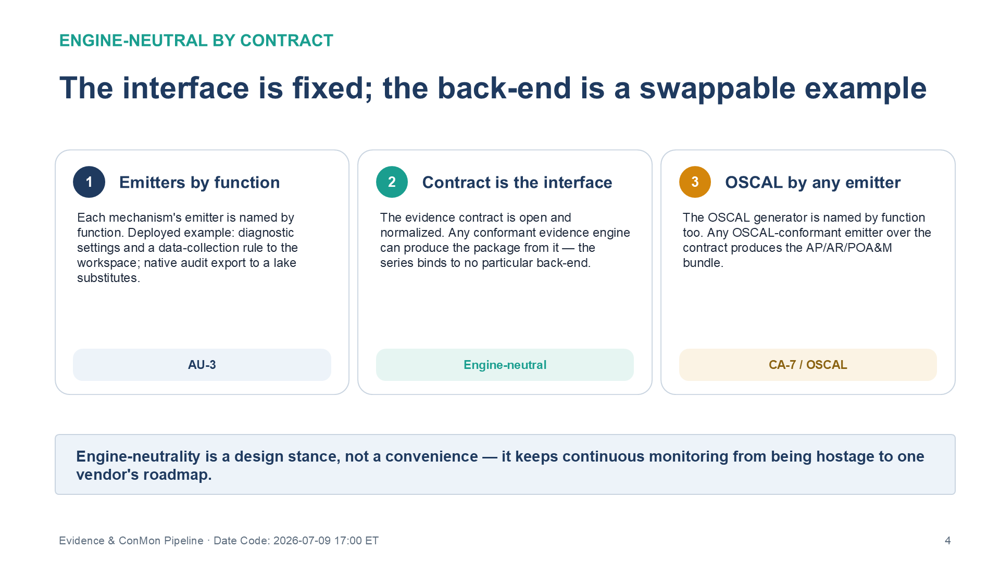
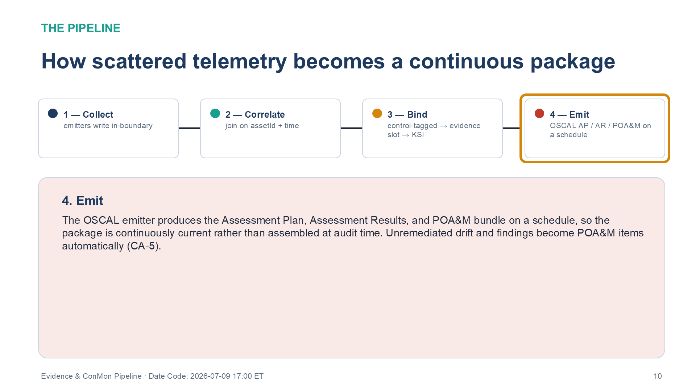

::: {.fouo-banner}
INTERNAL — NOT FOR PUBLIC DISTRIBUTION
:::

::: {.callout-warning}
## Draft Proposal — Subject to Review
Developed by the **CSI Team (Cloud Services Infrastructure)**; not yet reviewed or approved by the SSA CIO Office, OIS, or leadership. **Date Code:** 2026-07-09 15:13 ET
:::

::: {.callout-important}
**Series Context** — Volume VI Book 07. Deployable realization of the **Volume III Multi-Cloud Evidence Fabric** and the **Volume IV** continuous-monitoring and authorization-package architecture: the pipeline that turns the telemetry every deployed mechanism emits into machine-readable, control-bound continuous-monitoring evidence.
:::

# What This Document Addresses

Each Volume VI book emits deployment and operating evidence — a drift record, a detection firing, a revocation action, a key rotation. Scattered, that telemetry proves nothing. This book carries the pipeline that consumes it: the normalized **evidence contract** every mechanism writes to, the correlation keyed to authoritative asset identity and time, the binding of each record to the control and Key Security Indicator it satisfies, and the emission of the machine-readable authorization package.

It is where "we deploy the control" becomes "here is continuously-refreshed evidence, bound to the control, in the package an assessor reads."

# The Evidence Contract

The contract is a single normalized record shape that every deployed mechanism emits. It is the interface that keeps the pipeline **engine-neutral**: any conformant back-end can consume the contract and produce the package.

{#fig-vol6b07-record fig-alt="A four-card diagram titled 'One record shape every deployed mechanism emits,' under the eyebrow 'The normalized record,' describing the fields of the evidence-contract record. Card 1 (navy), source: which deployed mechanism wrote the record — e.g. vi-06/machine-config; every book in the volume writes the same shape (AU-3 normalized record). Card 2 (teal), assetId: the authoritative IPAM/DDI identity from Book VI-01, so records from different surfaces correlate to the same asset (AU-12(1)). Card 3 (amber), control + ksi: the NIST control(s) the record evidences and the FedRAMP 20x KSI theme(s) — what binds raw telemetry to the authorization package. Card 4 (red), verdict + evidenceRef: compliant / drift / remediated / exception, plus a pointer to the raw row in the lake so the claim is traceable to source. A summary bar states two fields make the record load-bearing: assetId gives cross-surface correlation, and control/ksi bind telemetry to the package instead of leaving it as logs. White background. Source: Vol VI Book 07 — Federal Application-Aware Networking — Evidence & ConMon Pipeline Deployment briefing deck, Date Code 2026-07-09 17:00 ET." width="100%"}

```jsonc
// evidence-contract record — the normalized shape every Vol VI mechanism emits
{
  "source":      "vi-06/machine-config",     // which deployed mechanism
  "assetId":     "ipam:10.4.2.17",           // authoritative identity (Book VI-01 IPAM/DDI join key)
  "timestamp":   "2026-07-09T15:13:00Z",
  "control":     ["CM-6"],                    // control(s) this record evidences
  "ksi":         ["KSI-CMT"],                 // FedRAMP 20x KSI theme(s)
  "verdict":     "compliant",                 // compliant | drift | remediated | exception
  "detail":      { "rule": "2.3.1.1", "desired": "Disabled", "observed": "Disabled" },
  "evidenceRef": "loganalytics://.../row/abc123"
}
```

Two properties make the record load-bearing: the `assetId` is the authoritative IPAM/DDI identity from Book VI-01, so records from different surfaces correlate to the same asset (AU-12(1)); and the `control`/`ksi` fields are what bind raw telemetry to the authorization package rather than leaving it as undifferentiated logs.

# Deployable Artifacts

| Artifact | Realizes | Deployed example | Multi-CSP substitution |
|---|---|---|---|
| Evidence-contract emitters (per mechanism) | AU-3 normalized record | Diagnostic settings + DCR to the workspace | native audit export to the lake |
| Cross-surface correlation (asset-id + time) | AU-12(1) time-correlated trail | Workspace joins keyed to IPAM/DDI identity | equivalent lake correlation |
| KSI binding layer | FedRAMP 20x KSI attestation | evidence-slot → KSI mapping as code | same mapping over any lake |
| Machine-readable package emission | CA-7 ConMon; OSCAL AP/AR/POA&M | OSCAL emitter over the evidence contract | any OSCAL-conformant emitter |

::: {.callout-note}
**Engine-neutral by contract** — The evidence contract is an open, normalized record; the emitters and the OSCAL generator are named by *function*. Any conformant evidence engine can produce the package from the contract. The series does not bind the pipeline to a particular back-end — the contract is the interface, and the back-end is a swappable deployed example.
:::

{#fig-vol6b07-neutral fig-alt="A three-card diagram titled 'The interface is fixed; the back-end is a swappable example,' under the eyebrow 'Engine-neutral by contract.' Card 1 (navy), Emitters by function: each mechanism's emitter is named by function; deployed example — diagnostic settings and a data-collection rule to the workspace, with native audit export to a lake as a substitute; tagged AU-3. Card 2 (teal), Contract is the interface: the evidence contract is open and normalized, so any conformant evidence engine can produce the package from it — the series binds to no particular back-end; tagged Engine-neutral. Card 3 (amber), OSCAL by any emitter: the OSCAL generator is named by function too — any OSCAL-conformant emitter over the contract produces the AP/AR/POA&M bundle; tagged CA-7 / OSCAL. A summary bar states engine-neutrality is a design stance, not a convenience — it keeps continuous monitoring from being hostage to one vendor's roadmap. White background. Source: Vol VI Book 07 — Federal Application-Aware Networking — Evidence & ConMon Pipeline Deployment briefing deck, Date Code 2026-07-09 17:00 ET." width="100%"}

# The Pipeline

{#fig-vol6b07-pipeline fig-alt="A four-step horizontal sequence titled 'How scattered telemetry becomes a continuous package,' under the eyebrow 'The pipeline,' with the fourth step highlighted and all connectors filled to show the completed flow. Step 1 (navy), Collect — emitters write in-boundary. Step 2 (teal), Correlate — join on assetId plus time. Step 3 (amber), Bind — control-tagged record to evidence slot to KSI. Step 4 (red, highlighted), Emit — OSCAL AP / AR / POA&M on a schedule. The detail panel for step 4 reads: the OSCAL emitter produces the Assessment Plan, Assessment Results, and POA&M bundle on a schedule, so the package is continuously current rather than assembled at audit time; unremediated drift and findings become POA&M items automatically (CA-5). White background. Source: Vol VI Book 07 — Federal Application-Aware Networking — Evidence & ConMon Pipeline Deployment briefing deck, Date Code 2026-07-09 17:00 ET." width="100%"}

1. **Collect** — each mechanism's emitter writes evidence-contract records (via diagnostic settings / data-collection rules) to the telemetry lake, in-boundary.
2. **Correlate** — records are joined on `assetId` + time, producing the system-wide time-correlated trail AU-12(1) expects.
3. **Bind** — the KSI binding layer maps each control-tagged record to its evidence slot and KSI theme.
4. **Emit** — the OSCAL emitter produces the Assessment Plan / Assessment Results / POA&M bundle on a schedule, so the package is continuously current rather than assembled at audit time.

# Closure Necessity

::: {.callout-tip}
## Closure Necessity — evidence no pipeline emits does not exist to an assessor
Volume III/IV prove the evidence fabric is the mechanism that makes continuous monitoring real. This book deploys it: CA-7 is satisfied by a pipeline that continuously refreshes control-bound evidence and emits the package, not by a claim that monitoring occurs. Remove it and every other Volume VI deployment is invisible to the authorization process — the controls operate but cannot be shown to.
:::

# Controls Operationalized

| Control | Title | How this book deploys it |
|---|---|---|
| CA-7 | Continuous Monitoring | Telemetry→evidence→KSI→package pipeline |
| AU-6(1) | Automated Process Integration | Automated aggregation and analysis across surfaces |
| AU-12(1) | System-wide and Time-correlated Audit Trail | Asset-id + time correlation across the lake |
| CA-5 | Plan of Action & Milestones | POA&M items emitted from unremediated drift/findings |

# Honest Limits

- The pipeline is only as complete as its emitters — a mechanism that deploys but does not emit an evidence-contract record is invisible; Book VI-08's telemetry-completeness workbook is the guard against silent emitter failure.
- Correlation depends on the authoritative `assetId`; where the IPAM/DDI identity is missing, records cannot be joined and the trail fragments.
- The OSCAL package reflects the evidence present; it cannot attest a control whose mechanism emits nothing.

# Cross-References

- **Volume III — Multi-Cloud Evidence Fabric** and **Volume IV — Authorization Package & ConMon** — the architecture this book deploys.
- **Books VI-01…VI-06** — the mechanisms whose evidence this pipeline consumes.
- **Book VI-08** — telemetry-completeness validation that guards the emitters.

# Provenance

Draft. The pipeline is engine-neutral by contract; back-ends named are deployed examples. The evidence-contract record is an illustrative shape to adapt. Format standards (OSCAL, the FedRAMP 20x KSI schema) cite their publishing authority.
