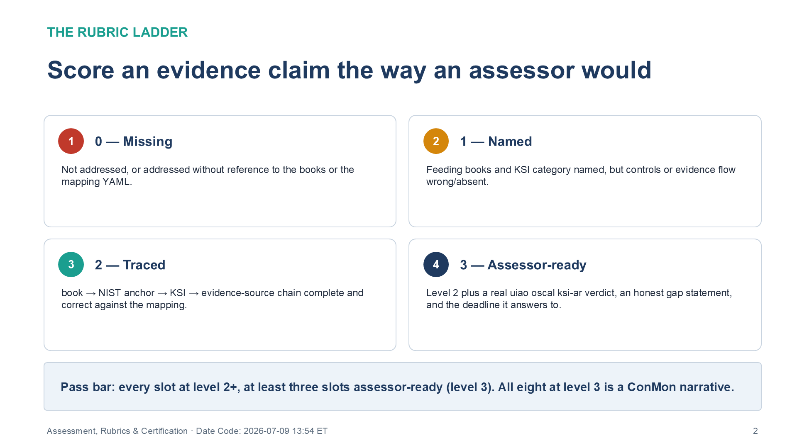
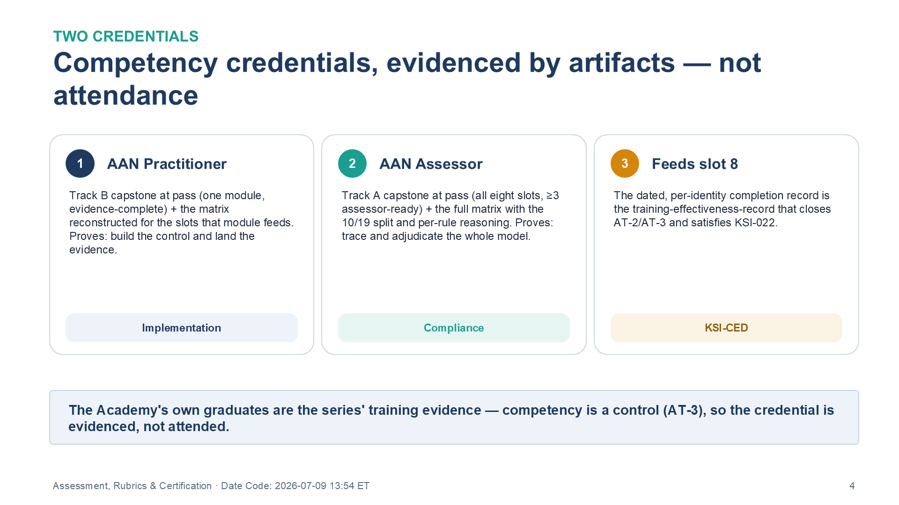

::: {.fouo-banner}
INTERNAL — NOT FOR PUBLIC DISTRIBUTION
:::

::: {.callout-warning}
## Draft Proposal — Subject to Review

This document is a **draft proposal** developed by the **CSI Team (Cloud Services Infrastructure)**. It has not been reviewed or approved by the SSA CIO Office, the Office of Information Security (OIS), or organizational leadership.

**Date Code:** 2026-07-09 13:54 ET
:::

# What This Document Addresses

The compliance track (Vol V Book 01) and the implementation track (Vol V
Book 02) each end in a capstone. This book grades them, and it turns the grade
into a credential. It supplies three things: a **rubric ladder** that scores an
evidence claim the way an assessor would; the **KSI Closure Necessity Matrix**,
the authoritative one-row-per-rule table that doubles as the certification exam;
and the definition of the two credentials the Academy confers — **AAN
Practitioner** and **AAN Assessor**.

The rubric language is deliberately the language an assessor uses, because the
competency being certified is exactly the competency a 3PAO exercises: not "can
you assert a control is met" but "can you trace and evidence the closure, and
say why no alternate mechanism closes it." That competency is the AT-2/AT-3
training closure the program's own authorization package depends on (KSI-CED) —
so this book is both the Academy's grading instrument and one of the series' own
evidence artifacts.

# The Scale (Applies to Every Slot)

| Level | Name | Meaning |
|---|---|---|
| 0 | Missing | Slot not addressed, or addressed without reference to the books or the mapping YAML |
| 1 | Named | Feeding books and KSI category named correctly, but controls or evidence flow are wrong/absent |
| 2 | Traced | book → NIST anchor → KSI category → evidence-source chain is complete and correct against the slot mapping |
| 3 | Assessor-ready | Level 2 **plus** a real verdict from `uiao oscal ksi-ar`, an honest gap statement for anything not-evaluated, and the deadline that gap answers to |

: The four-level assessment scale {.striped .hover}

**Pass bar.** Every slot at level 2 or higher, **and** at least three slots at
level 3. All eight at level 3 is the "distinguished" outcome — it is, in
substance, a ConMon narrative an assessor could read.

{#fig-vol5b03-01 fig-alt="A four-panel numbered grid presenting the rubric ladder applied to every slot. Panel 1, Level 0 Missing: the slot is not addressed, or addressed without reference to the books or the mapping YAML. Panel 2, Level 1 Named: the feeding books and KSI category are named correctly, but controls or evidence flow are wrong or absent. Panel 3, Level 2 Traced: the book to NIST anchor to KSI to evidence-source chain is complete and correct against the slot mapping. Panel 4, Level 3 Assessor-ready: level 2 plus a real uiao oscal ksi-ar verdict, an honest gap statement, and the deadline it answers to. A footer banner states the pass bar — every slot at level 2 or higher, at least three slots assessor-ready at level 3, and all eight at level 3 is a ConMon narrative. White background. Source: Vol V Book 03 Assessment, Rubrics & Certification briefing deck, Date Code 2026-07-09 17:00 ET." width="100%"}

# Common Checks (Scored Once, Apply to the Whole Capstone)

| Check | Yes/No |
|---|---|
| The `ksi-ar` output file is attached/linked, not just described | |
| Every control ID cited appears in the slot mapping or the book itself (no invented controls) | |
| Scaffold / not-evaluated rules are stated as gaps, not glossed as satisfied | |
| Each gap names its forcing deadline (e.g., BOD 26-04 Dec 7 2026; 20x mandatory Jan 1 2027) | |

# Per-Slot Rubrics

Each rubric names the feeding books by volume coordinate, the level-2 evidence,
and what level 3 adds. They mirror the eight modules of Book 01.

## Slot 1 — Identity (KSI-IAM)

| Criterion | Level 2 evidence | Level 3 adds |
|---|---|---|
| Books | Vol I Bk 03/04/05 · Vol II Bk 01 · Vol III Bk 01 named (Vol II Bk 02 procedural) | — |
| Controls | IA-2(+1/2/11), IA-5, IA-11, AC-2(+1), AC-3, AC-5/6 family, AC-17, CA-7 mapped to the right book | Before/after table for at least one AC-6 enhancement (Vol III Bk 01 style) |
| Evidence flow | Sign-in/risk logs named as the source | A privileged-role trace: PIM design → control → KSI rule → audit-log entry |

## Slot 2 — Addressing (KSI-PIY)

| Criterion | Level 2 evidence | Level 3 adds |
|---|---|---|
| Books | Vol I Bk 01 | — |
| Controls | CM-8 / AC-4 anchors; the 16-control closure claim attributed to the roadmap, not asserted as fact | — |
| Evidence flow | IPAM inventory named as the attestation | An actual inventory artifact (vendor export or DDI-lab fixture) referenced from the slot-02 mapping |

## Slot 3 — Network (KSI-CNA)

| Criterion | Level 2 evidence | Level 3 adds |
|---|---|---|
| Books | Vol I Bk 05/06/07 · Vol II Bk 03 | — |
| Controls | SC-8 / SC-7 / CA-7 anchors; Vol II Bk 03's SC/SI depth distinguished from the transport books' argument | — |
| Evidence flow | One application-aware path policy mapped to SC-8 | The CA-7 continuous signal that proves the policy stays enforced, named concretely; the customer-owned SC-7 edge (Vol I Bk 07) called out |

## Slot 4 — Telemetry (KSI-MLA)

| Criterion | Level 2 evidence | Level 3 adds |
|---|---|---|
| Books | Vol III Bk 02/05/06/07 | — |
| Controls | CA-7 / SI-4 anchors; RA-5 family, SI-2, AU-6/7/8/11, IR-4/6/8 assigned to the right book | — |
| Evidence flow | KEV-scenario trace: Defender VM finding → Sentinel incident → SI-4/RA-5 closure | A fired-rule artifact plus the AU-11 retention argument, correlated through the Vol III Bk 07 evidence fabric |

## Slot 5 — Endpoint (KSI-PIY)

| Criterion | Level 2 evidence | Level 3 adds |
|---|---|---|
| Books | Vol I Bk 02 · Vol III Bk 01/03/04 · Vol IV Bk 04 | — |
| Controls | CM-8 / IA-3 anchors; SI-2 remediation (Vol III Bk 03); CSPM/CNAPP exposure (Vol III Bk 04); PT entry points (Vol IV Bk 04) | — |
| Evidence flow | Endpoint-inventory statement covering device identity, completeness, and remediation actuation | The PII-handling endpoint subset called out with its Vol IV Bk 04 transparency treatment |

## Slot 6 — Security Configuration & Change (KSI-CMT)

| Criterion | Level 2 evidence | Level 3 adds |
|---|---|---|
| Books | Vol III Bk 04/06 · Vol IV Bk 02/03 | — |
| Controls | CM-2 / AC-4 anchors; SR family from Vol IV Bk 02; PM family from Vol IV Bk 03 | — |
| Evidence flow | The BOD 26-04 submission story: SBOM artifacts → KSI-011–014 activation | An actual SBOM/VDR artifact, and the Vol IV Bk 06 submission cadence stated against the Dec 7 2026 gate |

## Slot 7 — Continuity (KSI-RPL)

| Criterion | Level 2 evidence | Level 3 adds |
|---|---|---|
| Books | Vol IV Bk 01 | — |
| Controls | CP-2 through CP-10 with enhancement counts right | — |
| Evidence flow | One contingency-test exercise mapped to CP-4 via the slot-07 binding | A tabletop after-action report with findings and owners — a zero-finding report scores 0 here, per Vol IV Bk 01 |

## Slot 8 — Training (KSI-CED)

| Criterion | Level 2 evidence | Level 3 adds |
|---|---|---|
| Books | Vol IV Bk 05 (Vol IV Bk 06 as the freshness/ConMon context) | — |
| Controls | AT-2(+1/+2), AT-3(+3/+5), AT-4, CP-3, IR-2 mapped to the four training dimensions | — |
| Evidence flow | The `training-effectiveness-record` JSON named as the KSI-022 evidence contract, with the ≥95% thresholds | An actual record (lab-generated is fine) passing the PASS logic, with per-identity results — aggregate-only stats score 0 here, per Vol IV Bk 05 |

# Scoring the Track A Capstone — the Eight-Slot Walk

The compliance-track capstone (Vol V Book 01) is one document covering all eight
slots, backed by a real `uiao oscal ksi-ar` run. Score each slot on the ladder,
apply the four common checks once, and apply the pass bar: every slot ≥ 2, at
least three at level 3, 4/4 common checks.

# Scoring the Track B Capstone — One Module, Evidence-Complete

The implementation-track capstone (Vol V Book 02) is one module built or
lab-simulated end-to-end, with its artifact bound where the slot mapping reads
it. It is scored on a narrower bar because it is depth-first, not breadth-first:

| Criterion | Pass |
|---|---|
| The build works | The module's mechanism is demonstrably functioning (config, run output, or fixture) |
| The evidence is bound | The artifact sits where the slot mapping references it — not described, placed |
| The verdict is fed | `uiao oscal ksi-ar` shows the module's slot verdict changing because of *your* artifact |
| The trace is stated | You can name the control the build closes and the KSI rule that reads the evidence |

: Track B capstone — the depth-first pass criteria {.striped .hover}

# The KSI Closure Necessity Matrix — the Certification Exam

The authoritative artifact of the Academy, and the exam. One row per active KSI
rule: the rule, its closing technology (function, not product), whether
conformance tooling alone can attest it, the evidence slot it binds, and the
series volume/book that produces the evidence. The bottom line is pre-computed
and must reconcile with Vol 0 Book 00 and Vol IV Book 06: **10 attestable by
tooling alone, 19 architecture-bound, 29 total.**

| KSI family | Rules | Closing mechanism (function) | Tool-attestable alone? | Slot | Series home |
|---|---|---|---|---|---|
| KSI-001..010 (ScuBA) | 10 | M365/Entra baseline posture read by the ScuBA adapter | **Yes** | — | Vol 0 (adapter) |
| KSI-IAM | identity | Cryptographic identity + lifecycle + least privilege | No | 1 | Vol I Bk 03/04/05 · Vol II Bk 01 · Vol III Bk 01 |
| KSI-PIY | inventory | Authoritative IPAM/DDI + device identity | No | 2, 5 | Vol I Bk 01/02 · Vol III Bk 03/04 |
| KSI-CNA | network | Encrypted application-aware overlay + governed edge | No | 3 | Vol I Bk 05/06/07 · Vol II Bk 03 |
| KSI-MLA | telemetry | Correlated detection + audit retention | Partial | 4 | Vol III Bk 02/05/06/07 |
| KSI-CMT | config/change | Secure config + SBOM/VDR/VER provenance | Partial | 6 | Vol III Bk 04/06 · Vol IV Bk 02/03 |
| KSI-RPL | resilience | Tested contingency architecture | No | 7 | Vol IV Bk 01 |
| KSI-CED | training | Machine-readable training-effectiveness record | No | 8 | Vol IV Bk 05 (Vol IV Bk 06 cadence) |

: KSI Closure Necessity Matrix — 10 tool-attestable, 19 architecture-bound, 29 total {.striped .hover}

The exam is the matrix, reconstructed by the candidate from the corpus: given a
blank KSI list, place each rule in its slot, name the closing mechanism and why
no alternate closes it, and mark tool-attestable vs. architecture-bound
correctly. A candidate who reproduces the 10/19 split with correct reasoning has
demonstrated the coverage-gap fluency the whole program turns on.

# Certification — AAN Practitioner and AAN Assessor

The Academy confers two credentials. Both are competency credentials, not
attendance certificates; both are evidenced by artifacts, mirroring the series'
own doctrine that competency is a control (AT-3).

{#fig-vol5b03-02 fig-alt="A three-panel numbered diagram defining the two Academy credentials and how they feed the training slot. Panel 1, AAN Practitioner: requires the Track B capstone at pass — one module, evidence-complete — plus the KSI Closure Necessity Matrix reconstructed for the slots that module feeds, proving the holder can build the control and land the evidence; tagged 'Implementation.' Panel 2, AAN Assessor: requires the Track A capstone at pass — all eight slots, at least three assessor-ready — plus the full matrix with the 10/19 split and per-rule reasoning, proving the holder can trace and adjudicate the whole model; tagged 'Compliance.' Panel 3, Feeds slot 8: the dated, per-identity completion record is the training-effectiveness-record that closes AT-2/AT-3 and satisfies KSI-022; tagged 'KSI-CED.' A footer banner states that the Academy's own graduates are the series' training evidence — competency is a control, so the credential is evidenced, not attended. White background. Source: Vol V Book 03 Assessment, Rubrics & Certification briefing deck, Date Code 2026-07-09 17:00 ET." width="100%"}

- **AAN Practitioner** (implementation). Requires: the Track B capstone at pass
  (one module, evidence-complete), plus the KSI Closure Necessity Matrix
  reconstructed correctly for the slot(s) the chosen module feeds. The
  Practitioner has proven they can build a control *and* land the evidence the
  KSI reads.
- **AAN Assessor** (compliance). Requires: the Track A capstone at pass (all
  eight slots, ≥ three assessor-ready), plus the full KSI Closure Necessity
  Matrix reconstructed correctly, with the 10/19 split and per-rule necessity
  reasoning. The Assessor has proven they can trace and adjudicate the whole
  evidence model.

Both credentials feed slot 8: the completion record — per-identity, dated,
machine-readable — is the `training-effectiveness-record` that closes AT-2/AT-3
and satisfies KSI-022. The Academy's own graduates are the series' training
evidence.

# Scoring Sheet

| Slot | Level (0–3) | Notes |
|---|---|---|
| 1 — identity | | |
| 2 — addressing | | |
| 3 — network | | |
| 4 — telemetry | | |
| 5 — endpoint | | |
| 6 — security | | |
| 7 — continuity | | |
| 8 — training | | |
| Common checks passed | /4 | |
| **Result** | Pass / Not yet | Pass = all ≥ 2, ≥ 3 at level 3, 4/4 common checks |

: Track A capstone scoring sheet {.striped .hover}

# Series Context — Vol V Book 03

This book is the Academy's grading instrument. It scores the capstones that
Vol V Book 01 (compliance) and Vol V Book 02 (implementation) set, using rubrics
built from the same eight evidence slots and the same volume-coordinate book
references. Its KSI Closure Necessity Matrix is the citable form of Theme E's
10-of-29 coverage gap and is cross-referenced by Vol IV Book 06 (Authorization
Package & ConMon) as the exam-grade rendering of the KSI scorecard. The
credentials it confers produce the per-identity training record that Vol IV
Book 06 freezes into the OSCAL bundle — closing, on the evidence of the
Academy's own graduates, the training control the authorization package depends
on.

---

*Federal Application-Aware Networking — Vol V Book 03 of the series. Volume V is
the enablement layer; this book is its assessment and certification instrument,
grading the capstones of Vol V Books 01–02 and conferring the AAN Practitioner
and AAN Assessor credentials. The KSI Closure Necessity Matrix reconciles with
Vol 0 Book 00 and Vol IV Book 06 at 10 tool-attestable / 19 architecture-bound /
29 total. Control-closure and KSI claims are self-assessed against the series'
ADR-111 rule set (modeled on the FedRAMP 20x CR26 KSI schema), pending
independent security control assessment (SCA) and formal FedRAMP PMO / AO
review.*
