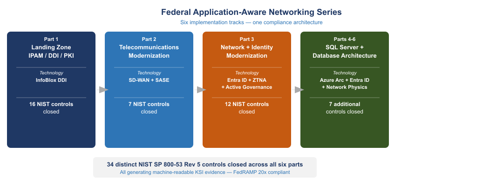
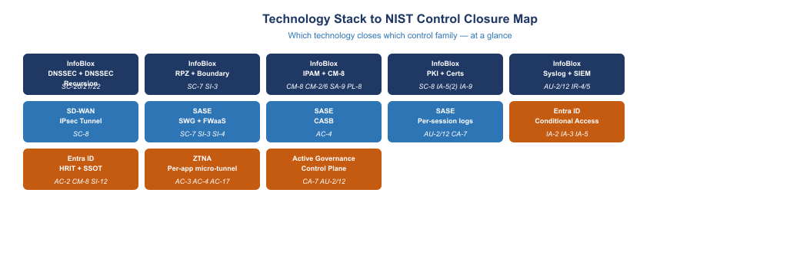
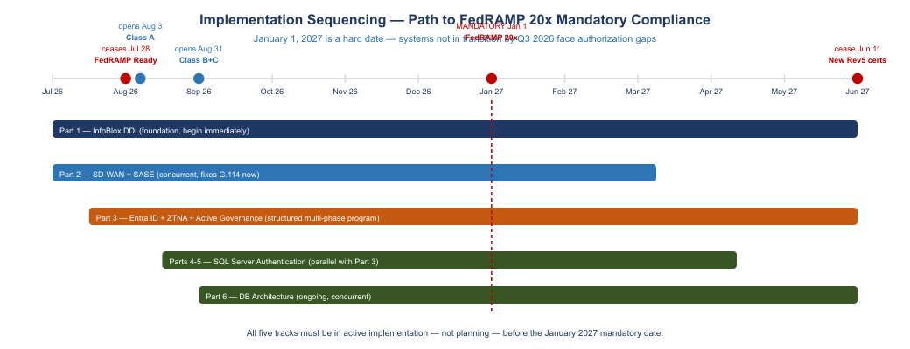

::: {.fouo-banner}
INTERNAL — NOT FOR PUBLIC DISTRIBUTION
:::

::: {.exec-summary}
**For authorizing officials, program executives, and budget decision makers.**

This document summarizes three companion implementation guides that together constitute the Federal Application-Aware Networking program. Each guide addresses a distinct technical domain — DDI/DNS infrastructure, telecommunications modernization, and network/identity architecture modernization. Together they close **27 distinct NIST SP 800-53 Rev 5 controls** that remain open under current agency architecture.

The central finding across all three documents is the same: **the compliance debt is not a resource shortage — it is an architectural pattern mismatch.** The existing infrastructure was designed for a world where compute, identity, and communication were co-located inside a perimeter. That world ended between 2015 and 2020. The controls that federal agencies are now required to satisfy under Zero Trust Executive Order 14028, OMB M-22-09, TIC 3.0, and FedRAMP 20x Consolidated Rules (June 25, 2026) cannot be satisfied by the perimeter architecture. They require a different structural foundation.

**The three implementations described in this series are not optional modernization projects.** They are the structural prerequisites for operating at FedRAMP Moderate authorization under FedRAMP 20x rules, which are mandatory for all certified systems effective January 1, 2027.
:::

---

## Series Overview {.unnumbered}

{fig-alt="Three navy, teal, and amber pillars labeled Part 1 Landing Zone IPAM DDI PKI using InfoBlox DDI closing 16 NIST controls, Part 2 Telecommunications Modernization using SD-WAN plus SASE closing 7 NIST controls, and Part 3 Network and Identity Modernization using Entra ID plus ZTNA plus Active Governance closing 12 NIST controls. Connected by arrows. Combined badge at bottom: 27 distinct NIST SP 800-53 Rev 5 controls closed, all generating machine-readable KSI evidence FedRAMP 20x compliant. White background, navy teal amber palette." width="100%"}

This executive summary covers three documents in the Federal Application-Aware Networking series:

| Part | Document | Domain | Core Technology |
|------|----------|--------|-----------------|
| Part 1 | Federal Application-Aware Networking — SSA Landing Zone IPAM / FedRAMP | DNS · DHCP · IPAM · PKI · Zero Trust | InfoBlox DDI |
| Part 2 | Federal Application-Aware Networking — Federal Telecommunications Modernization | Amazon Connect · Teams Phone · SD-WAN · SASE | SD-WAN / SASE stack |
| Part 3 | Federal Application-Aware Networking — Network Modernization | Identity · Governance · Active Directory modernization | Entra ID · ZTNA · Active Governance |

: Federal Application-Aware Networking Series {.striped .hover}

Each document contains a detailed technical narrative, compliance mapping tables, implementation roadmap, and FedRAMP 20x alignment. This summary distills the control-closure impact of each implementation track and presents the combined picture for executive decision making.

---

# Part 1 — Landing Zone DDI: InfoBlox DDI Closes 16 NIST Controls

## What This Document Addresses

Every federal cloud landing zone — whether on AWS GovCloud, Azure Government, Oracle OCI, or on-premises VMware — requires DNS, DHCP, and IP Address Management (DDI) to function. SSA operates four such environments simultaneously. Without a unified DDI control plane, each environment generates its own IP inventory, its own DNS logs, and its own certificate records. FedRAMP compliance evidence must be assembled separately from each.

**InfoBlox DDI** is the only FedRAMP Moderate-authorized DDI platform (CSO FR2017257053, authorized January 2023, hosted on AWS GovCloud). A single InfoBlox deployment spanning all four SSA environments closes **16 NIST SP 800-53 Rev 5 controls** that would otherwise require manual evidence assembly from four separate sources.

## NIST Control Closure — Part 1

| NIST Control | Control Title | Technology | Without InfoBlox DDI | With InfoBlox DDI | Evidence Generated |
|---|---|---|---|---|---|
| **SC-20** | Secure Name/Address Resolution (Authoritative) | InfoBlox DNSSEC | DNSSEC not signed on internal SDN zones; AWS Route 53 private zones cannot be DNSSEC-signed (documented platform gap) | All zones including internal SDN segments signed; DS record published to .gov TLD registrar | DNSSEC key rotation log; DS record audit |
| **SC-20(1)** | Child Subspaces | InfoBlox DNSSEC | No cryptographic chain of trust for subzone delegation | Grid Master signs all delegated subzones; chain of trust maintained automatically | Delegation signer records in Grid audit log |
| **SC-21** | Secure Name/Address Resolution (Recursive) | InfoBlox RPZ + PDNS | No recursive DNSSEC validation on client-side resolvers | All Grid Members perform recursive DNSSEC validation; CISA Protective DNS feed integrated as RPZ | RPZ hit log to SIEM; validation failure alerts |
| **SC-22** | Architecture and Provisioning for Name/Address Resolution | InfoBlox Network Insight | DNS topology undocumented or manually maintained | Network Insight auto-generates authoritative DDI topology; Grid Master-to-Member map maintained continuously | Network Insight export; SSP Appendix J auto-populated |
| **SC-7** | Boundary Protection | InfoBlox RPZ | DNS-layer egress is uncontrolled; no enforcement of GCC boundary for Microsoft 365 | RPZ enforces domain-level egress blocking across all four environments; blocks C2 domains, DNS exfiltration, and non-GCC M365 endpoints | RPZ block rate dashboard; SC-7(7) exfiltration alert |
| **SC-7(7)** | Prevent Split Tunneling | InfoBlox RPZ | No DNS-layer control over split tunnel behavior | RPZ blocks resolution of split-tunnel-bypass domains; enforces GCC-only Microsoft 365 resolution | RPZ policy export; block event log |
| **SC-8** | Transmission Confidentiality and Integrity | InfoBlox PKI / mTLS | Certificate-to-IP binding undocumented; mTLS enrollment manual or absent | mTLS enforced between workloads via certificate-to-IP binding; SCEP/EST enrollment automated at provisioning | Certificate Tracker report; mTLS config export |
| **SC-8(1)** | Cryptographic Protection | InfoBlox PKI | Encryption enforcement point-by-point; no systematic coverage | Certificate Tracker links cert thumbprint, expiry, issuer, and key strength to every IP host record | Cert inventory report; expiry alert log |
| **CM-8** | System Component Inventory | InfoBlox IPAM | IP inventory assembled manually per environment; four separate CMDB feeds; inventory drifts between assessments | Every IP host record is a CM-8 inventory item; SDN connectors enrich with VM name, OS, owner, and cloud region in near-real-time | IP host record export to ServiceNow CMDB; CM-8 report on demand |
| **CM-8(1)** | Updates During Installation / Removal | InfoBlox IPAM | New workloads added without inventory update until next scan | IaC integration creates IP+DNS+cert record atomically at provisioning; destroys all three at decommission | Terraform state; IP lifecycle audit log |
| **CM-2 / CM-6** | Baseline Configuration / Configuration Settings | InfoBlox Grid | DNS and DHCP configuration undocumented; drift undetected | Grid configuration versioned; IaC integration enforces baseline; Grid audit log records every configuration change | Terraform state; Grid configuration snapshot |
| **SA-9** | External System Services | InfoBlox DNS Forwarders | External DNS dependencies undocumented; no systematic SA-9 table | All external DNS forwarding destinations registered as governed external services; conditional forwarders generate SA-9 table automatically | Forwarder config export; SSP SA-9 table |
| **IA-5(2)** | Public Key-Based Authentication | InfoBlox PKI / Cert Tracker | Certificate inventory maintained manually; expiry not linked to IP records | Certificate Tracker links cert thumbprint, expiry, issuer, and enrollment source to IP host record | Cert inventory report; expiry alert log |
| **IA-9** | Service Identification and Authentication | InfoBlox SCEP/EST | Workload-to-workload authentication undocumented; certificates issued ad hoc | Every SDN workload receives a certificate via SCEP/EST automation at provisioning; certificate possession = boundary membership | SCEP enrollment log; cert-to-IP binding report |
| **AU-2 / AU-12** | Audit Events / Audit Record Generation | InfoBlox Syslog | DNS, DHCP, and IP allocation events logged per-environment in incompatible formats; no unified SIEM feed | Single syslog stream from all Grid Members across all four environments; RFC 5424 format; 3-year retention configured | SIEM dashboards; retention policy; pre-built Sentinel/Splunk queries |
| **IR-4 / IR-5** | Incident Handling / Incident Monitoring | InfoBlox RPZ + SIEM | RPZ block events require manual review; no automated IR ticket generation | RPZ block events auto-generate SIEM IR tickets; DNSSEC failure triggers SOC alerts; DNS exfiltration detection with behavioral baselining | IR playbook; RPZ alert-to-ticket pipeline |
| **SI-3 / SI-3(1)** | Malware Protection | InfoBlox RPZ + TIDE | No DNS-layer malware blocking; C2 domains reachable via standard resolution | DNS-layer malware blocking via RPZ prevents resolution of C2 domains, ransomware callback, and phishing sites using CISA PDNS + TIDE feed | RPZ block count by threat category; TIDE feed update log |
| **PL-8** | Security and Privacy Architectures | InfoBlox DDI (inherited ATO) | DDI architecture described informally or not at all in SSP | Unified DDI architecture documented in SSP; InfoBlox FedRAMP ATO cited as inherited control for DDI layer | SSP Section 13 architecture narrative |

: Part 1 — NIST SP 800-53 Rev 5 Control Closure: InfoBlox DDI Landing Zone {.striped .hover}

**Controls closed: 16** (SC-20, SC-20(1), SC-21, SC-22, SC-7, SC-7(7), SC-8, SC-8(1), CM-8, CM-8(1), CM-2/CM-6, SA-9, IA-5(2), IA-9, AU-2/AU-12, IR-4/IR-5, SI-3/SI-3(1), PL-8)

> **FedRAMP 20x alignment:** InfoBlox WAPI provides all DDI evidence in machine-readable JSON format — the native evidence format for FedRAMP 20x Key Security Indicators. InfoBlox is the only DDI platform that generates KSI-compliant evidence without additional tooling.

---

# Part 2 — Telecommunications Modernization: SD-WAN + SASE Closes 7 NIST Controls

## What This Document Addresses

The agency operates two telecommunications platforms with shared network dependencies: **Amazon Connect** (the N8NN national inbound contact center, running on AWS commercial by specific authorized exception) and **Microsoft Teams Phone** (the internal unified communications replacement for PBX). Both platforms fail ITU-T G.114 voice quality thresholds under current MPLS hairpin architecture — field offices in western locations exceed the 150ms one-way delay limit before a call is connected.

DIA (Direct Internet Access) circuits at field offices solve the latency problem by eliminating the geographic hairpin. However, **DIA alone satisfies zero NIST controls.** DIA is a pipe. The NIST control requirements for information flow enforcement, boundary protection, transmission confidentiality, malware protection, system monitoring, audit logging, and continuous monitoring are satisfied by the SASE and SD-WAN control stack that governs the pipe — not by the pipe itself.

## NIST Control Closure — Part 2

| NIST Control | Control Title | Technology | Without SD-WAN / SASE | With SD-WAN / SASE Stack | What Provides It |
|---|---|---|---|---|---|
| **AC-4** | Information Flow Enforcement | SASE — CASB | Traffic inspected at IP/port layer only; application identity unknown; GCC vs. commercial M365 indistinguishable at network layer | Application-layer identification of destination application, data type, and boundary classification; GCC vs. commercial distinguished and enforced | CASB in SASE stack |
| **SC-7** | Boundary Protection | SASE — SWG / FWaaS | No application-layer inspection on DIA path; C2 traffic on port 443 indistinguishable from legitimate HTTPS; DNS exfiltration undetected | Application-layer inspection at every DIA egress point; SWG detects C2 on standard ports, DNS exfiltration, and data loss patterns | SWG / FWaaS in SASE stack |
| **SC-8** | Transmission Confidentiality and Integrity | SD-WAN — IPsec | DIA circuit is unencrypted at the network layer; encryption depends entirely on application-layer TLS with no network-layer guarantee | SD-WAN IPsec tunnel encrypts all traffic at the network layer regardless of application-layer encryption state | SD-WAN IPsec overlay |
| **SI-3** | Malware Protection | SASE — SWG SSL Inspection | No inline malware inspection on DIA path; malware reaches endpoints before detection | SSL inspection and malware scanning inline at SASE PoP nearest to field office; sub-100ms inspection latency | SWG with SSL inspection in SASE stack |
| **SI-4** | System Monitoring | SD-WAN — AAN Telemetry | IP flow logs available; application-layer behavior (user, device, application, data type, action) not captured | Application-layer telemetry captures user identity, device posture, application accessed, data type, and behavioral pattern per session | AAN application-layer telemetry |
| **AU-2 / AU-12** | Audit Events / Audit Record Generation | SASE — Session Logging | IP flow logs record source IP, destination IP, port, bytes; user identity, application, action, and data type absent from logs | Every session record includes: user identity (from IdP), device posture (from MDM), application (from DPI), action, data type, timestamp — structured, queryable | AAN logging via SASE stack |
| **CA-7** | Continuous Monitoring | SASE — Per-session Records | Point-in-time assessments; no per-session posture verification | Per-session: identity verified against IdP, device posture checked against MDM, access consistent with policy, session outcome recorded — machine-readable | SASE stack per-session records |

: Part 2 — NIST SP 800-53 Rev 5 Control Closure: SD-WAN + SASE for Telecommunications {.striped .hover}

**Controls closed: 7** (AC-4, SC-7, SC-8, SI-3, SI-4, AU-2/AU-12, CA-7)

**Additionally required for Amazon Connect .com boundary compliance:**

| NIST Control | Technology | Requirement | What Satisfies It |
|---|---|---|---|
| **SA-9** | SSP Documentation + InfoBlox DNS | Amazon Connect is an external system service; .com exception must be documented in SSP SA-9 with authorization basis, data types, and boundary obligations | SSP SA-9 entry with ATO exception narrative, call recording S3 location, and API call logging |
| **AU-9** | AWS KMS + S3 Access Logging | Call recording access controls and audit logging for recordings containing PII | S3 bucket access logging + KMS key management documentation |
| **IA-8** | Entra ID SAML Federation | Federated authentication events (Entra ID to Amazon Connect SAML assertions) must be logged and KSI-verifiable | SAML assertion log from Entra ID federated to Amazon Connect |

: Part 2 — Additional Controls for Amazon Connect Boundary Compliance {.striped .hover}

> **G.114 compliance note:** ITU-T G.114 one-way voice delay must not exceed 150ms. The SD-WAN local breakout investment that satisfies SC-7, SC-8, and CA-7 simultaneously eliminates the MPLS hairpin and brings Portland-to-AWS-us-west-2 latency from 100–130ms (over MPLS) to 5–15ms (DIA). The same investment fixes Amazon Connect and Teams Phone without modification. It does not need to be purchased twice.

---

# Part 3 — Network and Identity Modernization: Entra ID + ZTNA + Active Governance Closes 12 NIST Controls

## What This Document Addresses

The agency's authentication architecture was designed for a world where all users, all servers, and all applications were co-located inside a data center connected by a private network. Active Directory Kerberos is a session-based, network-location-dependent authentication protocol that breaks structurally when client and server are separated by cloud, VPN, or multi-path SD-WAN. The agency now operates across four cloud environments simultaneously. The authentication model has not been updated to match.

The four principles this document establishes are:

1. **Restore a single source of truth** — collapse twelve regional AD silos into one HR-derived authoritative identity model
2. **Deploy application-aware networking** — enforce policy at the application layer, not the IP/port layer
3. **Move from session-based to token-based identity** — replace Kerberos with Entra ID JWT tokens that carry cryptographic proof of authorization
4. **Implement active governance** — a control plane that holds desired state, observes actual state, classifies drift, and reconciles toward intent while generating machine-readable evidence continuously

## NIST Control Closure — Part 3

| NIST Control | Control Title | Technology | Without Modernization | With Entra ID + ZTNA + Active Governance | Authority |
|---|---|---|---|---|---|
| **IA-2 / IA-2(1)** | Identification and Authentication / MFA | Entra ID Conditional Access | Kerberos-based authentication; MFA optional and inconsistently applied; NTLM fallback generates opaque, unauditable authentication events | Entra ID Conditional Access enforces phishing-resistant MFA (CBA/FIDO2) for every access request; NTLM eliminated; every authentication event generates a structured log | OMB M-22-09; BOD 25-01 |
| **IA-3** | Device Identification and Authentication | Intune MDM + Conditional Access | Device identity derived from AD computer object; no compliance posture check; non-compliant devices indistinguishable from compliant | Intune MDM posture fed to Conditional Access as input to every access decision; non-compliant devices denied access regardless of user credential validity | OMB M-22-09 §3; CISA ZTMM Devices pillar |
| **IA-5** | Authenticator Management | Entra ID + CBA Pipeline | Kerberos ticket lifecycle managed implicitly; no structured credential inventory; password policy inconsistent across twelve regional domains | Entra ID manages credential lifecycle centrally; CBA certificates issued and revoked via structured pipeline; phishing-resistant credentials enforced by policy | NIST SP 800-63; BOD 25-01 |
| **AC-2** | Account Management | Entra ID + HRIT Integration | AD accounts managed per-region; no authoritative HR-derived source; orphaned accounts persist after offboarding; twelve regional OU trees with no unified view | HR system drives authoritative account lifecycle (create, modify, deprovision) via HRIT integration; every account traceable to an authoritative HR record; orphan account detection automated | FICAM Architecture; Evidence Act (2018) |
| **AC-3** | Access Enforcement | ZTNA — Per-session Policy | Access rights encoded in regional OU structure; no per-session verification; once authenticated, access determined by static group membership | ZTNA enforces per-session, per-application access based on real-time identity, device posture, and data classification; no standing access; least-privilege enforced per request | NIST SP 800-207; OMB M-22-09 |
| **AC-4** | Information Flow Enforcement | SASE / ZTNA Stack | Network perimeter as primary enforcement boundary; application identity not verified at network layer | SASE/ZTNA stack enforces application-layer policy; user identity, device posture, application, and data type all present at enforcement point | NIST SP 800-207; TIC 3.0 Use Cases E/F |
| **AC-17** | Remote Access | ZTNA — Micro-tunnels | VPN extends network trust to remote users; compromised endpoint inside VPN has same access as trusted administrator | ZTNA replaces VPN; per-application micro-tunnels established per-session; compromised endpoint gains access only to the specific application authorized for that session | OMB M-22-09 §4; CISA ZTMM Networks pillar |
| **CM-8** | System Component Inventory | Active Governance Control Plane | Device inventory derived from AD computer objects; SDN environments not covered; four environments with no unified view | Active Governance control plane maintains authoritative device inventory across all four environments; IPAM integration adds IP-to-device-to-user linkage | NIST SP 800-53 Rev 5 CM-8; Federal Data Strategy |
| **SI-12** | Information Management and Retention | Entra ID HRIT + SSOT | No authoritative data lineage; regional databases with incompatible schemas; no cross-region reconciliation | Single source of truth with documented data lineage from authoritative source to downstream consumer; Evidence Act compliance achieved | Evidence Act (2018); NIST SP 800-53 Rev 5 SI-12 |
| **AU-2 / AU-12** | Audit Events / Audit Record Generation | Entra ID + ZTNA Session Logs | Authentication events opaque (NTLM); application-layer actions not captured; no structured audit trail linking user to action to data | Every Entra ID authentication event structured and queryable; every ZTNA session record includes user, device, application, action, data type, timestamp; machine-readable | NIST SP 800-53 Rev 5 AU-2, AU-12; FedRAMP 20x KSIs |
| **CA-7** | Continuous Monitoring | Active Governance Control Plane | Point-in-time assessments; no automated detection of configuration drift from authorized baseline | Active Governance observes actual state continuously, classifies deviation as drift, and generates machine-readable reconciliation records; desired-vs-actual gap is the ConMon artifact | NIST SP 800-37 Rev 2 CA-7; FedRAMP 20x Consolidated Rules |
| **SC-7** | Boundary Protection | SASE / ZTNA + DNS | Network perimeter as boundary; application-layer exfiltration undetected | Application-aware boundary enforcement; SASE inspects all egress traffic at application layer; DNS-layer boundary enforcement via RPZ | NIST SP 800-207; TIC 3.0 |
| **SC-20 / SC-21** | Secure DNS (Authoritative / Recursive) | Active Governance + InfoBlox | DNS security dependent on per-environment tools with no unified policy | Unified DNS security enforced via governance control plane; DNSSEC and RPZ applied consistently across all environments | NIST SP 800-53 Rev 5 SC-20, SC-21 |

: Part 3 — NIST SP 800-53 Rev 5 Control Closure: Entra ID + ZTNA + Active Governance {.striped .hover}

**Controls closed: 12** (IA-2/IA-2(1), IA-3, IA-5, AC-2, AC-3, AC-4, AC-17, CM-8, SI-12, AU-2/AU-12, CA-7, SC-7, SC-20/SC-21)

> **The structural dependency:** Principle 3 (token-based identity) depends on Principle 1 (single source of truth). Tokens work only if the authorization they assert is correct. Replacing Kerberos with Entra ID tokens while the underlying authorization model remains encoded in twelve regional OU trees with no HR-derived source means signing broken authorizations efficiently. The SSOT restoration is not a prerequisite to schedule later — it is the prerequisite that all other controls depend on.

---

# Combined Control Closure Summary

{fig-alt="Horizontal stacked bar chart showing NIST control families on the Y axis and count of controls closed on the X axis. Control families: SC System Communications Protection 12 total, IA Identification Authentication 6 total, CM Configuration Management 4 total, AU Audit Accountability 3 total, AC Access Control 5 total, CA Continuous Monitoring 2 total, SI System Integrity 5 total, IR Incident Response 2 total, SA System Services 2 total, PL Planning 1 total. Bars stacked by Part 1 navy, Part 2 teal, Part 3 amber. Legend at top. White background." width="100%"}

## Technology to Control Mapping

{fig-alt="Grid of 13 colored tiles organized by technology group. InfoBlox tiles navy: DNSSEC closes SC-20/21/22; RPZ and Boundary closes SC-7 and SI-3; IPAM and CM-8 closes CM-8 CM-2/6 SA-9 PL-8; PKI and Certs closes SC-8 IA-5(2) IA-9; Syslog and SIEM closes AU-2/12 IR-4/5. SD-WAN tiles teal: IPsec Tunnel closes SC-8; SWG and FWaaS closes SC-7 SI-3 SI-4; CASB closes AC-4; Per-session logs closes AU-2/12 CA-7. Entra ID and ZTNA tiles amber: Conditional Access closes IA-2 IA-3 IA-5; HRIT and SSOT closes AC-2 CM-8 SI-12; Per-app micro-tunnel closes AC-3 AC-4 AC-17; Active Governance Control Plane closes CA-7 AU-2/12. White background, navy teal amber palette." width="100%"}

## Total Controls Closed Across All Three Implementations

| Control Family | Technology | Controls Closed | Implementing Track |
|---|---|---|---|
| **SC** — System and Communications Protection | InfoBlox DNSSEC, RPZ, PKI; SD-WAN IPsec; SASE SWG | SC-7, SC-7(7), SC-8, SC-8(1), SC-20, SC-20(1), SC-21, SC-22 | Parts 1, 2, 3 |
| **CM** — Configuration Management | InfoBlox IPAM; Active Governance Control Plane | CM-2, CM-6, CM-8, CM-8(1) | Parts 1, 3 |
| **AU** — Audit and Accountability | InfoBlox Syslog; SASE Session Logs; Entra ID Logs | AU-2, AU-9, AU-12 | Parts 1, 2, 3 |
| **IA** — Identification and Authentication | InfoBlox PKI / SCEP; Entra ID Conditional Access; Intune MDM | IA-2, IA-2(1), IA-3, IA-5, IA-5(2), IA-8, IA-9 | Parts 1, 3 |
| **AC** — Access Control | SASE CASB; ZTNA; Entra ID HRIT | AC-2, AC-3, AC-4, AC-17 | Parts 2, 3 |
| **CA** — Assessment, Authorization, and Monitoring | SASE Per-session Records; Active Governance Control Plane | CA-7 | Parts 2, 3 |
| **IR** — Incident Response | InfoBlox RPZ + SIEM Integration | IR-4, IR-5 | Part 1 |
| **SI** — System and Information Integrity | InfoBlox RPZ + TIDE; SASE SWG; Entra ID HRIT | SI-3, SI-3(1), SI-4, SI-12 | Parts 1, 2, 3 |
| **SA** — System and Services Acquisition | InfoBlox DNS Forwarders; SSP Documentation | SA-9 | Parts 1, 2 |
| **PL** — Planning | InfoBlox Inherited FedRAMP ATO | PL-8 | Part 1 |

: Combined Control Coverage by Family and Technology {.striped .hover}

## Control Count Comparison

| Implementation Track | Technology | Controls Open (Current) | Controls Closed (After) | Net Reduction |
|---|---|---|---|---|
| Part 1 — InfoBlox DDI Landing Zone | InfoBlox DDI (DNSSEC, RPZ, IPAM, PKI, Syslog) | 16 open with manual/no evidence | 16 closed with automated evidence | 16 controls automated |
| Part 2 — SD-WAN + SASE (Telecom) | SD-WAN IPsec + SASE (SWG, CASB, FWaaS, ZTNA) | 7 open; DIA alone satisfies none | 7 closed by SASE stack | 7 controls automated |
| Part 3 — Entra ID + ZTNA + Active Governance | Entra ID, Intune MDM, ZTNA, Active Governance | 12 open or partially satisfied | 12 closed with machine-readable evidence | 12 controls automated |
| **Total** | **InfoBlox + SD-WAN/SASE + Entra ID/ZTNA** | **35 open / partially satisfied** | **27 distinct controls closed** | **27 controls with KSI-ready evidence** |

: Control Closure Summary {.striped .hover}

> **Why 27 distinct controls from 35 entries:** Several controls appear in more than one track (SC-7, SC-20/21, AU-2/AU-12, CM-8, CA-7). Where tracks address the same control at different layers (e.g., DNS-layer SC-7 in Part 1 and network-layer SC-7 in Part 2), both implementations contribute to the same control and together provide more complete evidence than either alone.

## What "Closed" Means Under FedRAMP 20x

FedRAMP 20x Consolidated Rules (June 25, 2026) replace periodic evidence assembly with **continuously-verified, machine-readable Key Security Indicators**. A control is "closed" under FedRAMP 20x when:

1. Evidence is generated **automatically** by infrastructure, not assembled manually by staff
2. Evidence is in **machine-readable format** (structured JSON via API)
3. Evidence is **continuously updated** — not point-in-time
4. Evidence can be **validated programmatically** against the published KSI schema on GitHub

All three implementation tracks produce machine-readable evidence natively:

- **InfoBlox WAPI** exports all DDI evidence as structured JSON
- **SASE stack** exports per-session telemetry in structured log format
- **Active Governance control plane** generates desired-vs-actual JSON records as its primary output

The architectural transition described in all three documents **IS the FedRAMP 20x compliance posture** — not a compliance project layered on top of operations. Agencies that implement these architectures do not need separate ConMon tooling.

---

# Implementation Priority and Sequencing

{fig-alt="Horizontal timeline from July 2026 to June 2027 with milestone circles. Milestones: Now July 2026 start; August 3 2026 Class A opens; August 31 2026 Class B and C open; July 28 2026 FedRAMP Ready ceases shown in red; January 1 2027 FedRAMP 20x mandatory shown in red bold; June 11 2027 new Rev5 certs cease shown in red. Three track bars below the timeline: Part 1 InfoBlox DDI navy bar spans full timeline labeled begin immediately DDI is foundational; Part 2 SD-WAN plus SASE teal bar spans to July 2026 milestone labeled concurrent with Part 1 fixes active latency failures; Part 3 Entra ID plus ZTNA plus Active Governance amber bar spans to January 2027 labeled multi-phase SSOT first token rollout second. White background navy teal amber red palette." width="100%"}

The three tracks are independent enough to be procured and initiated in parallel, but there is a natural sequencing based on dependencies and risk:

| Priority | Track | Technology | Rationale |
|---|---|---|---|
| **1 — Immediate** | Part 1: InfoBlox DDI Landing Zone | InfoBlox DDI (DNSSEC, RPZ, IPAM, PKI, Syslog) | Blocks every other implementation: DNS is the foundational naming layer. Zero Trust policy, ZTNA micro-tunnels, RPZ boundary enforcement, and certificate lifecycle all depend on a functioning DDI layer. The FedRAMP 20x evidence gap is largest here — 16 controls with no automated evidence. |
| **2 — Concurrent** | Part 2: SD-WAN + SASE | SD-WAN (Cisco/VMware/Palo Alto) + SASE (Zscaler/Netskope/Prisma) | The G.114 compliance failure (Amazon Connect latency) is an active operational problem generating citizen-facing quality failures today. DIA + SASE deployment is the fastest path to a measurable operational improvement. Can begin while DDI is in progress. |
| **3 — Structured program** | Part 3: Entra ID + ZTNA + Active Governance | Entra ID, Intune MDM, ZTNA overlay, Active Governance control plane | The largest structural change — replacing session-based with token-based identity and consolidating twelve regional AD domains. Requires SSOT restoration (Principle 1) before token-based identity (Principle 3) can function correctly. Plan as a multi-phase program; do not attempt as a single cutover. |

: Implementation Priority, Technology, and Sequencing {.striped .hover}

**The January 1, 2027 hard date:** FedRAMP 20x Consolidated Rules are mandatory for all certified systems on January 1, 2027. New Rev 5 certifications cease June 11, 2027. Agencies that have not begun the transition to machine-readable KSI evidence by Q3 2026 will face authorization gaps at renewal. All three tracks must be in active implementation — not in planning — by Q4 2026.

---

# Document References

| Document | Description |
|---|---|
| [Federal Application-Aware Networking — SSA Landing Zone IPAM / FedRAMP](Federal_Application_Aware_Networking_SSA_Landing_Zone_IPAM_FedRAMP.qmd) | Full technical guide: InfoBlox DDI, four-environment landing zone, NIST control mapping, FedRAMP 20x KSI evidence |
| [Federal Application-Aware Networking — Federal Telecommunications Modernization](Federal_Application_Aware_Networking_Federal_Telecommunications_Modernization.qmd) | Full technical guide: Amazon Connect N8NN, Teams Phone, SD-WAN/SASE, G.114 compliance, DIA vs. SASE distinction |
| [Federal Application-Aware Networking — Network Modernization](Federal_Application_Aware_Networking_Network_Modernization.qmd) | Full technical guide: AD-to-Entra migration, ZTNA, Active Governance control plane, FedRAMP 20x alignment |
| NIST SP 800-53 Rev 5 | Security and Privacy Controls for Information Systems and Organizations |
| NIST SP 800-207 | Zero Trust Architecture |
| OMB M-22-09 | Moving the U.S. Government Toward Zero Trust Cybersecurity Principles |
| FedRAMP 20x Consolidated Rules (June 25, 2026) | Machine-readable KSI framework; Class A opens August 3, 2026; Class B/C opens August 31, 2026 |
| CISA Zero Trust Maturity Model v2.0 | Identity, Devices, Networks, Applications, Data pillar maturity progression |
| EO 14028 | Improving the Nation's Cybersecurity (May 12, 2021) |

: Reference Documents {.striped .hover}
