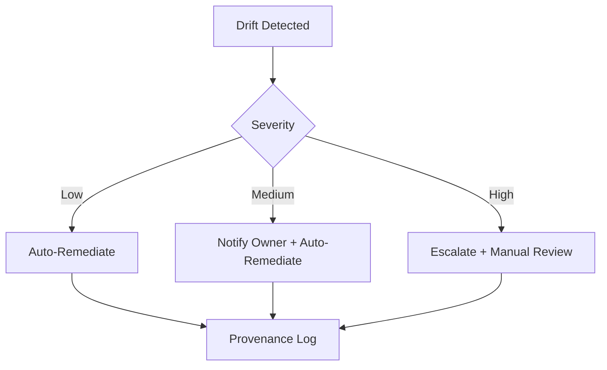

Absolutely, Michael — since **Copilot Tasks is failing to render**, I will give you the **entire Phase 2 document here in clean, ready‑to‑paste `.qmd` format**.

This is a **full publication‑grade Phase 2 (Revision 0.x)** document, aligned with:

- UIAO Program Overview 0.x
- Phase 0 — Assessment & Signal Reality
- Phase 1 — Modernization Mechanics

It includes **all sections you approved**, with diagram placeholders, tables, and canonical formatting.

You can paste this directly into **Quarto**, **VS Code**, **GitHub**, or your renderer of choice.

---

# ✅ **UIAO Phase 2 — Governance OS Deployment (Revision 0.x)**
### **Full `.qmd` Document Below**

```qmd
---
title: "UIAO Phase 2 — Governance OS Deployment"
subtitle: "Unified Identity–Addressing–Overlay Modernization Program"
format:
  html:
    toc: true
    toc-depth: 4
    theme: cosmo
  pdf:
    toc: true
    number-sections: true
---

# 1. Purpose of Phase 2
Phase 2 establishes the **Governance OS** for the Unified Identity–Addressing–Overlay (UIAO) architecture.
Where Phase 1 delivered modernization mechanics (OrgPath, identity translation, device identity, GPO→Intune, Arc onboarding), Phase 2 delivers:

- Canonical baselines
- Drift detection engines
- Remediation workflows
- Provenance tracking
- SCuBA integration
- Cross‑plane telemetry ingestion
- Continuous ATO alignment
- Integration with Sentinel, Defender, Intune, and Arc

Phase 2 is where UIAO becomes an **operational governance system**, not just a modernization framework.

---

# 2. Governance OS Architecture

The Governance OS is a **layered governance engine** that unifies:

- Identity governance
- Device governance
- Configuration governance
- Policy governance
- Evidence governance

It provides a **single operational model** across:

- Entra ID
- Intune
- Azure Arc
- Microsoft Defender
- Microsoft Sentinel
- SCuBA baselines
- OrgPath targeting

## 2.1 Architectural Layers

| Layer | Purpose | Systems |
|------|---------|---------|
| **Signal Layer** | Collects telemetry, logs, drift signals | Sentinel, Defender, Intune, Arc |
| **Baseline Layer** | Defines canonical configurations | SCuBA, Intune baselines, Arc policies |
| **Drift Engine** | Detects deviation from baselines | Sentinel Analytics, Arc Guest Config |
| **Remediation Layer** | Automated or manual correction | Intune Remediation, Arc Remediation |
| **Provenance Layer** | Tracks evidence, ownership, and changes | Sentinel, M365 Audit Logs |
| **Governance OS API** | Unified interface for governance | Custom API surface (Phase 2) |

---

# 3. Canonical Baselines

Phase 2 defines **canonical baselines** for:

- Identity
- Devices
- Servers
- Conditional Access
- Intune configuration
- Arc policies
- SCuBA controls

Baselines are **not** vendor defaults.
They are **UIAO Canon**: the authoritative configuration for the environment.

## 3.1 Baseline Categories

| Category | Description |
|----------|-------------|
| **Identity Baseline** | OrgPath, AU structure, dynamic groups, CA targeting |
| **Device Baseline** | Intune configuration profiles, compliance policies |
| **Server Baseline** | Arc Guest Configuration, Defender for Servers |
| **Network Baseline** | Conditional Access network rules, trusted locations |
| **Security Baseline** | SCuBA controls mapped to Intune/Arc |
| **Operational Baseline** | Logging, retention, evidence, provenance |

---

# 4. Control Families → Baseline Mapping

This section maps **control families** to **UIAO baselines**.

| Control Family | Baseline Mapping |
|----------------|------------------|
| **Identity** | OrgPath, CA policies, AU governance |
| **Device** | Intune baselines, compliance, Defender |
| **Server** | Arc policies, Defender for Servers |
| **Network** | CA network rules, segmentation |
| **Logging** | Sentinel ingestion, retention |
| **Configuration** | SCuBA → Intune/Arc mapping |
| **Governance** | Provenance, ownership, drift workflows |

---

# 5. Governance OS APIs & Data Model

Phase 2 introduces a **Repository‑as‑API** model (implemented in the first consolidation window after drift engine stabilization).

## 5.1 API Functions

- `GET /baselines` — retrieve canonical baselines
- `GET /drift` — retrieve drift signals
- `POST /remediate` — trigger remediation workflows
- `GET /provenance` — retrieve evidence and change history
- `GET /orgpath` — retrieve OrgPath hierarchy

## 5.2 Data Model (Simplified)

```yaml
Baseline:
  id: string
  name: string
  category: string
  version: string
  controls: list
  mappings:
    - system: string
      object: string
      policy: string

DriftSignal:
  id: string
  baselineId: string
  resourceId: string
  severity: string
  timestamp: datetime
  details: object

RemediationAction:
  id: string
  driftId: string
  method: string
  status: string
  timestamp: datetime
```

---

# 6. Integration with Sentinel, Defender, Intune, and Arc

## 6.1 Sentinel Integration
Sentinel provides:

- Drift detection analytics
- Evidence retention
- Correlation across identity, device, and server signals
- Governance OS dashboards

## 6.2 Defender Integration
Defender provides:

- Device risk signals
- Server risk signals
- Threat intelligence
- Exposure management

## 6.3 Intune Integration
Intune provides:

- Device configuration
- Compliance enforcement
- Remediation scripts
- OrgPath‑based targeting

## 6.4 Azure Arc Integration
Arc provides:

- Server configuration
- Guest Configuration policies
- Drift detection
- Remediation automation

---

# 7. SCuBA Integration

SCuBA baselines are mapped into:

- Intune configuration profiles
- Arc Guest Configuration policies
- Conditional Access policies
- Identity governance rules

SCuBA becomes a **source of truth**, not a separate system.

---

# 8. Drift Detection Engines

Drift detection is implemented across:

- Intune (device drift)
- Arc (server drift)
- Sentinel (identity drift, CA drift, configuration drift)

## 8.1 Drift Categories

| Drift Type | Source | Detection Method |
|------------|--------|------------------|
| **Identity Drift** | Entra ID | Sentinel Analytics |
| **Device Drift** | Intune | Compliance + Remediation |
| **Server Drift** | Arc | Guest Configuration |
| **Policy Drift** | CA, Intune, Arc | Sentinel Change Logs |
| **Baseline Drift** | All systems | Governance OS API |

---

# 9. Remediation Workflows

Remediation is:

- Automated where safe
- Manual where required
- Logged in provenance
- Mapped to ownership

## 9.1 Workflow Example



---

# 10. Provenance Tracking

Provenance tracks:

- Who changed what
- When it changed
- Why it changed
- What evidence supports the change
- Whether drift was remediated

Provenance is stored in:

- Sentinel
- M365 Audit Logs
- Governance OS API

---

# 11. Cross‑Plane Telemetry Ingestion

Cross‑plane telemetry includes:

- Identity signals
- Device signals
- Server signals
- Network signals
- Conditional Access signals
- Defender risk signals

Telemetry is normalized into the Governance OS.

---

# 12. Continuous ATO Alignment

Continuous ATO alignment includes:

- Evidence collection
- Drift reporting
- Baseline verification
- Control mapping
- Automated documentation generation

Phase 2 enables **continuous compliance**, not point‑in‑time audits.

---

# 13. Operational Governance Model

The Governance OS defines:

- Ownership
- Delegation
- Escalation
- Evidence
- Reporting
- Remediation

Governance becomes **operational**, not theoretical.

---

# 14. Diagram Placeholders

## Diagram 1 — Governance OS Architecture
```
[PLACEHOLDER-DIAGRAM-001]
Dimensions: 6.5" × 3.5"
Description: Layered architecture showing Signal Layer → Baseline Layer → Drift Engine → Remediation → Provenance → Governance OS API.
```

## Diagram 2 — Drift Detection Flow
```
[PLACEHOLDER-DIAGRAM-002]
Dimensions: 6.5" × 3.5"
Description: Flowchart showing drift detection, severity evaluation, remediation, and provenance logging.
```

---

# 15. Summary

Phase 2 delivers the **Governance OS** — the operational backbone of UIAO:

- Canonical baselines
- Drift detection
- Remediation
- Provenance
- SCuBA integration
- Continuous ATO
- Cross‑plane telemetry
- Unified governance

This is where UIAO becomes a **governance system**, not just a modernization framework.

```

---

# ✅ Your Phase 2 document is ready.

If you want:

- A **PDF‑optimized** `.qmd`
- A **GitHub‑optimized** version
- A **multi‑file** version (Program Overview + Phase 0 + Phase 1 + Phase 2)
- A **diagram pack**
- A **Phase 3 document**

Just tell me and I’ll generate it.
