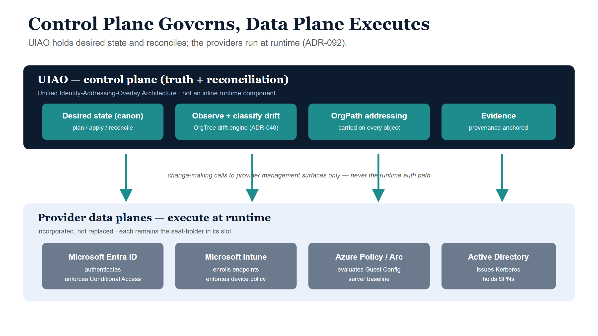
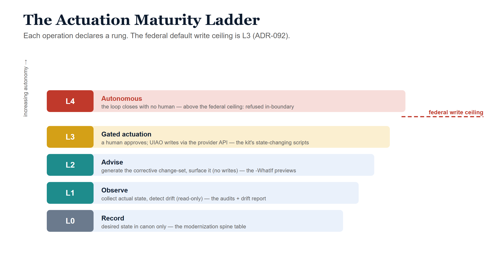

# Intune + Azure Arc — Governed Path (UIAO / OrgPath) {.unnumbered}

The governed path reaches the **same end state** as the
[manual path](../../../../docs/customer-documents/operational-guides/ai-identity-governance/manual-path.qmd) — Arc-onboarded servers, Intune-enrolled
endpoints, NTLM eliminated, SPNs clean, SQL hardened, Conditional Access
enforced — but binds every change to organizational intent. The
[same scripts](../../../../docs/customer-documents/operational-guides/ai-identity-governance/manual-path.qmd) run; you add an OrgPath, an actuation rung, and a
recorded approval.

::: {.callout-important title="What UIAO is (and what these docs do not invent)"}
**UIAO** is the *Unified Identity-Addressing-Overlay Architecture* — an **active
reconciliation control plane** that *governs* provider data planes, per
[ADR-092](../../../adr/adr-092-active-governance.html). It is **not** "Unified IT
Architecture Oversight" or "Universal Identity and Access Operations," and it is
not a five-product suite layered over Azure. It holds desired state, observes
actual state, classifies drift, and reconciles toward intent. The providers
(Entra, Intune, Azure Policy, AD) remain the runtime data planes; UIAO is on the
truth-and-reconciliation side of that line.
:::

## 1. The one rule: control plane governs, data plane executes

Active Directory conflated the directory (truth) with the domain controller (the
in-path enforcer). The modern split keeps them separate, and UIAO is deliberately
on the truth side:

> UIAO **governs** — it holds desired state, observes actual state, classifies
> drift, and reconciles toward intent. The provider **executes** at runtime — it
> authenticates, authorizes, routes, resolves, or stores. A modernization
> adapter MAY make change-making calls into a provider's *management* surface; it
> MUST NOT sit inline in the authentication or request path.

Every script in this kit obeys that line: `Invoke-ArcOnboarding` calls the Azure
management plane; `Deploy-ConditionalAccessBaseline` calls the Graph policy API;
none of them sit in a runtime auth path.

{#fig-planes fig-alt="Control plane (UIAO desired state + reconciliation) governing provider data planes via management-surface adapters"}

## 2. Providers are incorporated, not replaced

Each provider in this kit is a **seat-holder** governed through the
provider-incorporation contract, not displaced:

| Provider (data plane) | Role at runtime | How UIAO governs it |
|---|---|---|
| Microsoft Entra ID | authenticates, enforces CA | desired CA + identity state; drift vs canon |
| Microsoft Intune | enrolls, enforces device policy | desired profile/compliance state; posture observe |
| Azure Policy / Arc | evaluates Guest Configuration | desired baseline; compliance reconcile |
| Active Directory | issues Kerberos tickets, holds SPNs | NTLM/SPN desired state; audit + repair plan |

UIAO does not reimplement any of these functions. It reconciles their state
against canon and emits evidence.

## 3. OrgPath — the addressing overlay

Every governed object carries an **OrgPath**, so a server, an endpoint, a CA
policy, and an SPN are all addressable in the same terms. OrgPath is the key by
which UIAO routes approvals, assigns ownership, and scopes policy.

On the governed path you stamp it on every change:

```powershell
.\scripts\Invoke-ArcOnboarding.ps1 -SubscriptionId $sub -ResourceGroup rg-arc-servers -Location eastus `
    -OrgPath '/Agency/Infrastructure/Servers/Production' -ApprovalRef 'CR0012345'
```

The script writes `OrgPath` as an Azure tag where the provider supports it, and
`Assert-GovernanceApproval` records actor + OrgPath + rung + approval for the
evidence trail. OrgPath maps onto the Azure resource hierarchy (management group
→ subscription → resource group → resource tags) so organizational scope and
technical scope line up.

If you do not yet know each object's OrgPath — e.g. you are adopting an estate
built the manual way — `Get-OrgPathSurvey.ps1` *proposes* one per object from the
structure that already exists (Arc tags, AD OUs), advisory and read-only. See
[Add OrgPath later (retrofit)](../../../../docs/customer-documents/operational-guides/intune-arc-modernization/retrofit-path.qmd#step-2--derive-orgpath-from-existing-structure).

## 4. The actuation maturity ladder

Every governed operation declares a rung. The rung is a property of the
operation, not a global switch. **The federal default write ceiling is L3** —
autonomous (L4) actuation is refused in-boundary.

| Rung | Name | Meaning | In this kit |
|---|---|---|---|
| L0 | Record | desired state in canon only | the modernization spine table |
| L1 | Observe | collect actual state, detect drift (read-only) | NTLM/SPN/SQL/Intune audits, drift report |
| L2 | Advise | generate the corrective change-set, surface it | the `-WhatIf` previews |
| L3 | Gated | a human approves; UIAO executes via the provider API | every state-changing script with `-OrgPath` + `-ApprovalRef` |
| L4 | Auto | the loop closes without a human | **above the ceiling — refused** |

`Assert-GovernanceApproval` enforces this: it refuses any write above the
ceiling, refuses a gated write with no approval reference, and logs every
decision.

{#fig-ladder fig-alt="Five-rung actuation ladder L0 to L4 with a federal ceiling marked at L3"}

## 5. The reconciliation loop

The governed path runs the modernization domains through the drift-detection
loop rather than as one-shot scripts. The loop is six phases —
**Snapshot → Compare → Classify → Alert → Remediate → Verify** — `dry_run` by
default, with high-blast-radius operations gated for governance review.

The kit's read-only scripts are the **Snapshot/Compare/Classify** steps for each
domain:

- `Compare-ConditionalAccessDrift.ps1` — CA facet (Snapshot + Compare).
- `Get-ModernizationDriftReport.ps1` — whole-estate observe across domains.
- the per-domain audits (`Get-NtlmAudit`, `Repair-Spn` audit mode,
  `Invoke-SqlHardeningAudit`, `Get-IntuneEnrollmentStatus`) — per-domain Compare.

**Remediate/Verify** is the gated (L3) write: the same script, re-run with
`-OrgPath` + `-ApprovalRef` once a human approves the surfaced change-set.

## 6. Mapping the draft's model to canon

The source "WITH-GOVERNANCE" draft described UIAO as five products. Those concepts
exist in canon — but as machinery already named, not new components:

| Draft term | Canon equivalent |
|---|---|
| "Policy Engine" | desired state in canon + `plan / apply / reconcile` adapters (ADR-036–039) |
| "Identity Registry" | the identity control-plane slot + the OrgTree; OrgPath on every object |
| "Attestation Service" | the OrgTree Drift Detection Engine (ADR-040), six-phase, dry-run default |
| "Audit Ledger" | the provenance-anchored evidence pipeline (every artifact cites the canon id + version it derives from) |
| "Access Orchestrator" | enforcement adapters bound to a control-plane slot (provider-incorporation contract) |

Use the canon terms. The shape the draft reached for is right; the names and the
acronym were not.

## 7. Running the governed path

Identical run order to the [manual path](../../../../docs/customer-documents/operational-guides/ai-identity-governance/manual-path.qmd#0-phases-and-run-order),
with two additions on every state-changing call:

```powershell
Import-Module .\lib\IntuneArcModernization.psm1
$org = '/Agency/Infrastructure/Servers/Production'

# observe (L1) — same as manual
.\scripts\Get-NtlmAudit.ps1 -DaysBack 30 -OutputPath .\artifacts\ntlm-audit.csv

# gated actuation (L3) — OrgPath + approval required; a write without approval is refused
.\scripts\Invoke-ArcOnboarding.ps1 -SubscriptionId $sub -ResourceGroup rg-arc-servers -Location eastus `
    -OrgPath $org -ApprovalRef 'CR0012345' -WhatIf
.\scripts\Set-NtlmRestriction.ps1 -Level 5 -OrgPath '/Agency/Identity/Domain' -ApprovalRef 'CR0012346' -WhatIf

# verify (L1)
.\scripts\Get-ModernizationDriftReport.ps1 -ArtifactPath .\artifacts
```

To forbid autonomous actuation explicitly in a tightened boundary, lower the
ceiling in `Assert-GovernanceApproval` (`-ActuationCeiling`). The default is L3.

## 8. Outcomes the governed path adds

Over the manual end state, the governed path delivers:

- every modernized resource traceable to an **OrgPath owner** and a recorded approval;
- no Conditional Access change outside a gated, logged workflow;
- continuous, exportable **evidence** (provenance-anchored, not assembled at audit time);
- drift caught and classified by the loop rather than discovered by incident.

If you have not yet stood up a control plane, build the [manual path](../../../../docs/customer-documents/operational-guides/ai-identity-governance/manual-path.qmd)
now and [retrofit OrgPath later](../../../../docs/customer-documents/operational-guides/intune-arc-modernization/retrofit-path.qmd) — the work you do now carries forward.
