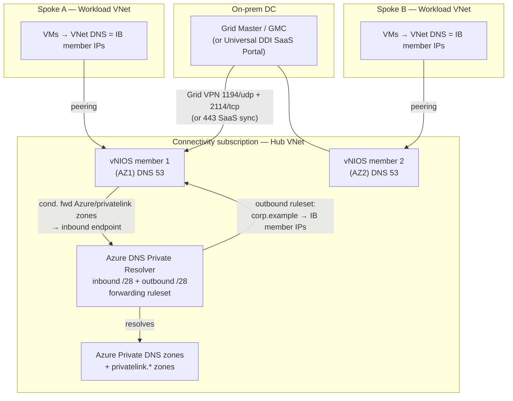

# Chapter 1 — Microsoft Azure

## 1. Overview — where DDI fits in the Azure landing zone

Azure ships a usable-but-partial DDI baseline. **Azure DNS** provides public zones
and **Azure Private DNS** zones for internal name resolution; **DHCP** is a
platform-managed function of the VNet (you cannot run a classic DHCP scope or hand
out custom options the way you would on-prem); and there is **no first-class IPAM** —
the "Azure IPAM" solution is a sample application you self-host, not a managed
service. For a single subscription this is adequate. It stops being adequate the
moment you have a hub-and-spoke landing zone spanning many subscriptions, hybrid
links back to on-prem, and a second cloud — because Azure Private DNS zones do not
conditionally forward on their own, do not natively answer queries coming *from*
on-premises, and give you no authoritative record of which CIDRs are allocated where.

The Azure **Cloud Adoption Framework (CAF)** landing zone anticipates exactly this
gap. Its *connectivity* subscription hosts a **hub VNet** carrying the shared network
services — Azure Firewall, VPN/ExpressRoute gateways, Azure Bastion, and DNS — with
workload **spoke VNets** peered to it. DNS resolution is explicitly called out as a
design area, and Microsoft's own reference pattern places an **Azure DNS Private
Resolver** in that hub to bridge on-prem and Azure name resolution.

Infoblox slots into that hub as the **authoritative DDI and DNS-security layer**. It
does not replace the CAF landing zone or its governance; it provides the one
consistent IPAM, the one recursive/authoritative DNS fabric, and the DNS threat
protection (RPZ, threat feeds) that span every subscription, both directions of
hybrid, and any other cloud. Azure DNS Private Resolver remains in the picture — but
as the *hand-off point* between Azure-native private zones and the Infoblox Grid,
not as the system of record. This chapter keeps that framing: **Infoblox supplies the
DDI layer inside the Azure landing zone, not the landing zone itself.**

## 2. Reference architecture

The recurring book pattern specializes cleanly on Azure. Infoblox DNS members live in
the **connectivity subscription's hub VNet**. Spoke workload VNets are configured
(via VNet DNS settings) to send queries to the Infoblox members' private IPs. The
members conditionally forward Azure-service and Private DNS names to the **Azure DNS
Private Resolver inbound endpoint**, and the resolver's **outbound endpoint** forwards
corporate namespaces back to Infoblox. Grid/SaaS control traffic ties everything to a
single authoritative control plane.



**Control-plane placement:** hub, always. **Management vs. data path:** Grid
management (1194/udp VPN + 2114/tcp) and SaaS sync (443/tcp outbound) are separate
from the DNS data path (53). **Resolution flow:** spoke VM → Infoblox member →
(corporate/on-prem answered locally or forwarded to GM domain) or (Azure/privatelink
names → Private Resolver inbound endpoint → Azure Private DNS).

## 3. Infoblox product options for Azure

| Option | What it is | Marketplace / licensing |
|---|---|---|
| **vNIOS Grid (self-managed)** | NIOS virtual appliances forming a Grid you operate; extend an existing on-prem Grid into Azure | `infoblox.infoblox_nios_on_azure` listing; BYOL or private offer. Public **and Azure Government** cloud only |
| **Universal DDI (SaaS)** | Infoblox operates the control plane (Infoblox Portal / CSP); you deploy lightweight **NIOS-X servers** in Azure under SaaS management | NIOS-X server images from Azure Marketplace; subscription licensing; requires outbound 443 to the Portal |
| **Cloud discovery & automation** | The integration layer (Cloud Network Automation for NIOS, or Universal Cloud discovery for SaaS) that discovers Azure VNets/subnets/zones and syncs IPAM | Included with either control plane; driven by an Entra ID app registration |

**Default for Azure:** enterprises already running an on-prem Infoblox Grid almost
always **extend that Grid** into the Azure hub with vNIOS (sovereign control plane,
one Grid database across on-prem + cloud). Greenfield multi-cloud teams that want to
avoid operating Grid Masters choose **Universal DDI** with NIOS-X servers. Both use
the same Entra ID app-registration credential for discovery.

## 4. Prerequisites

| Category | Requirement |
|---|---|
| Tenancy | Access to the **connectivity subscription**; contributor on its hub VNet resource group |
| Identity | An **Entra ID app registration** (service principal) with a client secret/cert for discovery (see §6) |
| VM size | **Esv3-series** (NIOS < 9.0.6); **Esv5-series** supported from NIOS 9.0.5+; **DS-series** for reporting members |
| Disks | **Premium LRS** (SSD); **≥250 GB** data disk, plus **≥250 GB** more for reporting members |
| Network | Hub VNet with **≥2 subnets** (management + LAN/service); two more dedicated **/28** subnets for the Private Resolver inbound and outbound endpoints |
| Accel. networking | Enable **Accelerated Networking** on member NICs for line-rate DNS where the VM size supports it (region/SKU-dependent — verify per size) |
| Availability | Spread members across **Availability Zones** (or an Availability Set where zones are unavailable in-region) |
| Quota | vCPU quota for the chosen Esv5/Esv3 family in the target region |
| Licensing | vNIOS BYOL/token or Universal DDI subscription; DNS/DHCP/Threat Defense grid licenses |

### Required NSG ports

Apply on the NSGs protecting the member subnets. DHCP rows apply only if you serve
DHCP from vNIOS (uncommon in Azure, since VNet DHCP is platform-managed).

| Port | Proto | Direction | Purpose |
|---|---|---|---|
| 53 | tcp + udp | in/out | DNS queries/zone transfer |
| 1194 | udp | between members & GM | Grid VPN tunnel (configurable) |
| 2114 | tcp | between members & GM | Grid CRAM auth (precedes VPN) |
| 123 | udp | out | NTP time sync |
| 443 | tcp | in / out | HTTPS management; **outbound to `csp.infoblox.com` / `csp.eu.infoblox.com`** for Universal DDI SaaS |
| 22 | tcp | in (restricted) | SSH/admin |
| 161 | udp | in (restricted) | SNMP monitoring |
| 67–68 | udp | in | DHCP (only if vNIOS serves DHCP) |

## 5. Step-by-step deployment

1. **Deploy members from the Marketplace.** In the connectivity subscription, deploy
   the `infoblox.infoblox_nios_on_azure` offer into the hub VNet. Choose an
   **Esv5** (or Esv3) size, **Premium LRS** disks, a ≥250 GB data disk, and place
   NIC(s) on the management and LAN subnets. Enable **Accelerated Networking** and
   assign the VM to an **Availability Zone**. Repeat for the second member in a
   different zone.
2. **Initial control-plane setup.**
   - *vNIOS Grid:* on the first member, configure it as **Grid Master** (or join it
     to your existing on-prem GM as a member — the usual Azure pattern). Set the Grid
     shared secret, VIP, and NTP. Second member joins the Grid over 1194/udp + 2114/tcp.
   - *Universal DDI:* deploy **NIOS-X servers** from the Marketplace, then **join
     them to the Infoblox Portal (CSP)** with a join token; management happens in the
     SaaS Portal over outbound 443.
3. **Networking & NSG.** Attach the NSGs with the port table above. On each **spoke
   VNet**, set the VNet **Custom DNS servers** to the Infoblox members' private IPs so
   workloads resolve through Infoblox. Ensure hub-spoke **VNet peering** allows
   forwarded traffic.
4. **HA pairing.** For vNIOS, pair the two members (anycast or member-VIP failover)
   across zones; for DNS, assign an **anycast** service IP advertised from both
   members so spoke VMs use one stable resolver address. For Universal DDI, run ≥2
   NIOS-X servers for the same DNS service.
5. **Deploy the Azure DNS Private Resolver** in the hub VNet with an inbound endpoint
   (dedicated **/28**, subnet delegated to `Microsoft.Network/dnsResolvers`) and an
   outbound endpoint (its own dedicated **/28**, delegated likewise, no other service
   in the subnet). Create a **forwarding ruleset** and link it to the hub/spoke VNets
   (§7).

```bash
# Sketch: Private Resolver + outbound rule forwarding corp domain to Infoblox
az dns-resolver create -g rg-hub-conn -n pdr-hub -l eastus --virtual-network vnet-hub
az dns-resolver inbound-endpoint create  -g rg-hub-conn --resolver-name pdr-hub -n in-ep  --ip-configurations '[{"private-ip-allocation-method":"Dynamic","id":"<subnet-in-/28>"}]'
az dns-resolver outbound-endpoint create -g rg-hub-conn --resolver-name pdr-hub -n out-ep --id "<subnet-out-/28>"
az dns-resolver forwarding-ruleset create -g rg-hub-conn -n rs-corp -l eastus --outbound-endpoints '[{"id":"<out-ep-id>"}]'
az dns-resolver forwarding-rule create -g rg-hub-conn --ruleset-name rs-corp -n corp \
  --domain-name "corp.example." --forwarding-rule-state Enabled \
  --target-dns-servers '[{"ip-address":"10.10.0.4","port":53},{"ip-address":"10.10.1.4","port":53}]'
```

## 6. Cloud integration adapter (discovery & automation)

Infoblox discovers Azure through **vDiscovery** (Cloud Network Automation for NIOS) or
**Universal Cloud discovery** (SaaS). The credential in both cases is an **Entra ID
(Azure AD) app registration / service principal**: register the app, create a client
secret (or certificate), and grant it Azure RBAC role assignments at subscription
scope. Infoblox uses the app's tenant ID, client ID, and secret to enumerate
subscriptions, VNets, subnets, and VMs and to (optionally) synchronize DNS records.

Apply least privilege:

| Role | Scope | Why |
|---|---|---|
| **Reader** | Each subscription to be discovered | Enumerate VNets, subnets, VMs, tags for IPAM sync — read-only, no write |
| **DNS Zone Contributor** | Only the resource group(s)/zones where Infoblox writes records | Required **only** where Infoblox syncs records into Azure DNS/Private DNS; omit if discovery is read-only |

Grant **Reader on every subscription** you want discovered (vDiscovery for Azure spans
multiple subscriptions with one app registration). Add **DNS Zone Contributor** only
on the specific zones needing bidirectional record sync — do not grant it
subscription-wide. Discovered Azure **tags import into Infoblox as extensible
attributes (EAs)**, which then drive smart folders, filters, and tag-based allocation.

## 7. DNS integration with native Azure DNS

Two conditional-forwarding paths meet at the Private Resolver, giving split-horizon
resolution without either side becoming authoritative for the other:

- **Azure → Infoblox (outbound):** the resolver's **outbound endpoint** carries a
  **forwarding ruleset** whose rule for `corp.example.` (and reverse zones) targets the
  Infoblox member IPs on port 53. Link the ruleset to the hub and spoke VNets so
  Azure workloads resolve corporate/on-prem names via Infoblox.
- **Infoblox → Azure (inbound):** on the Infoblox members, configure **conditional
  forwarders** for Azure Private DNS namespaces — the **`privatelink.*` zones**
  (e.g. `privatelink.blob.core.windows.net`, `privatelink.database.windows.net`) and
  any custom private zones — pointing at the resolver's **inbound endpoint** IP. This
  lets on-prem and other-cloud clients resolve Azure Private Endpoints through the
  Infoblox fabric.

A forwarding ruleset holds up to **1,000 rules**, each specifying a domain name plus
one or more target IP/port pairs — ample for a large privatelink footprint. Keep the
**`privatelink` zones centralized in the connectivity subscription** with VNet links
to hub and spokes (the CAF-recommended pattern), and let Infoblox be the single entry
point that on-prem conditional forwarders target.

## 8. IPAM discovery & automation

Onboard by pointing the app registration at each subscription; vDiscovery/Universal
Cloud then walks **subscriptions → VNets → subnets** and populates Infoblox IPAM as
networks/network-containers, with discovered VMs as host/fixed records. Because the
Azure **tags** arrive as **extensible attributes**, you get **tag-driven allocation**:
allocation policies and Smart Folders keyed on `environment`, `owner`, `costcenter`,
etc., let you carve the next free subnet from the right container automatically and
keep ownership visible. Run discovery on a schedule so IPAM tracks Azure reality and
**drift** (a subnet created directly in Azure, an overlapping CIDR) surfaces as a
reconciliation event rather than a silent conflict. Where Infoblox holds
DNS-Zone-Contributor rights, forward/reverse records stay consistent with the
discovered addresses; otherwise discovery is read-only and Azure DNS remains the
writer for those zones.

## 9. High availability, sizing & scaling

- **Member roles:** at minimum two DNS members in the hub; for a self-managed Grid,
  keep the **Grid Master on-prem** (or a GM/GMC pair) and run Azure members as Grid
  members so the control plane survives an Azure regional event.
- **Cross-AZ:** place the two members in **different Availability Zones** in-region;
  use an **Availability Set** only where the region lacks zones. For multi-region,
  add members in a second region's hub and use **anycast** so clients follow the
  nearest healthy member.
- **Anycast:** advertise a shared DNS service IP from both members for a single stable
  resolver address across spokes.
- **Sizing:** pick the Esv5/Esv3 size by query rate and role; **DS-series** for
  reporting members; Premium LRS throughout. Model-specific vCPU/RAM and the exact
  Esv5 minimum version are release-dependent — confirm against the NIOS version's
  supported-appliance list before you fix a size.
- **Universal DDI:** scale by adding NIOS-X servers behind the same service; the SaaS
  Portal handles config distribution.

## 10. Security & compliance considerations

- **Hardening/RBAC:** least-privilege app registration (§6); scope DNS Zone
  Contributor to specific zones; use Infoblox granular admin roles for delegated
  cloud/DNS admins; restrict 22/443/161 to management sources via NSG.
- **Encryption:** Premium LRS supports platform/CMK encryption at rest; Grid comms are
  carried inside the 1194/udp VPN tunnel; enable DNS-over-TLS/HTTPS where required.
- **DNS security:** layer **Infoblox Threat Defense** — RPZ, threat-intel feeds, and
  DNS tunneling/DGA detection — on the hub members so every spoke's egress DNS is
  inspected. This is a primary reason to route spoke DNS through Infoblox rather than
  straight to Azure DNS.
- **Logging/audit:** forward Infoblox syslog/audit to Azure Monitor / a SIEM; enable
  DNS query logging on the members.
- **Sovereignty / Gov cloud:** vNIOS for Azure is deployable from the Marketplace on
  **Azure public and Azure Government** clouds only. For Universal DDI, the SaaS
  Portal dependency (outbound 443) matters for air-gapped/sovereign estates — a
  fully self-contained **vNIOS Grid** is the sovereign-friendly choice there.

## 11. Validation & Day-2 operations

**Validation checklist**

1. From a spoke VM, `nslookup app.corp.example` → answered by an Infoblox member.
2. From the same VM, resolve a `privatelink.*` Private Endpoint name → returns the
   private IP via the resolver inbound path.
3. From on-prem, resolve an Azure private name via the conditional forwarder → answer
   through Infoblox → resolver inbound endpoint.
4. Confirm **discovery**: Azure VNets/subnets and tags appear in Infoblox IPAM as
   networks and EAs.
5. **Failover test:** stop/deallocate one member; confirm the anycast/second member
   keeps answering and the Grid stays converged.

**Day-2**

- Re-run/schedule vDiscovery; review drift and reconcile overlapping CIDRs.
- Patch NIOS/NIOS-X on the vendor cadence; upgrade the on-prem GM before Azure members
  in a Grid.
- Monitor member health, query rates, and Threat Defense hits; alert on Grid VPN or
  SaaS-sync (443) loss.
- Review app-registration secret expiry and role assignments periodically.

## Sources

- [Infoblox — Deploying vNIOS for Azure from the Marketplace](https://docs.infoblox.com/space/vniosazure/37486729/Deploying+vNIOS+for+Azure+from+the+Marketplace)
- [Infoblox — Supported vNIOS for Azure Appliances (VM sizes, disks)](https://infoblox-docs.atlassian.net/wiki/spaces/vniosazure/pages/37486676/Supported+vNIOS+for+Azure+Appliances)
- [Infoblox — Deployment Guide: vNIOS for Microsoft Azure (PDF)](https://www.infoblox.com/wp-content/uploads/infoblox-deployment-guide-infoblox-vnios-for-microsoft-azure.pdf)
- [Infoblox — Permissions required in Azure DNS (Universal DDI)](https://docs.infoblox.com/space/BloxOneDDI/365461702/Permissions+required+in+Azure+DNS)
- [Infoblox — Performing vDiscovery on Virtual Networks](https://docs.infoblox.com/space/vniosazure/37486690/Performing+vDiscovery+on+Virtual+Networks)
- [Infoblox — NIOS-X Server Connectivity and Service Requirements (firewall/443)](https://docs.infoblox.com/space/BloxOneInfrastructure/873660456/Firewall+Requirements+for+Infoblox+Cloud+Services)
- [Infoblox — Source and Destination Ports for Services (1194/2114/53)](https://docs.infoblox.com/space/nios90/1327530037/Source+and+Destination+Ports+for+Services)
- [Infoblox — Manage Network Services for Microsoft Azure (partner page)](https://www.infoblox.com/partners/microsoft-azure/)
- [Azure Marketplace — Infoblox NIOS on Azure](https://azuremarketplace.microsoft.com/en-us/marketplace/apps/infoblox.infoblox_nios_on_azure?tab=overview)
- [Microsoft — Azure DNS Private Resolver overview](https://learn.microsoft.com/en-us/azure/dns/dns-private-resolver-overview)
- [Microsoft — Private Resolver endpoints and rulesets](https://learn.microsoft.com/en-us/azure/dns/private-resolver-endpoints-rulesets)
- [Microsoft — Resolve Azure and on-premises domains (hybrid DNS)](https://learn.microsoft.com/en-us/azure/dns/private-resolver-hybrid-dns)
- [Microsoft — Private Link and DNS integration at scale (CAF)](https://learn.microsoft.com/en-us/azure/cloud-adoption-framework/ready/azure-best-practices/private-link-and-dns-integration-at-scale)
- [Microsoft — DNS for on-premises and Azure resources (CAF)](https://learn.microsoft.com/en-us/azure/cloud-adoption-framework/ready/azure-best-practices/dns-for-on-premises-and-azure-resources)
- [Microsoft — What is an Azure landing zone? (CAF)](https://learn.microsoft.com/en-us/azure/cloud-adoption-framework/ready/landing-zone/)
