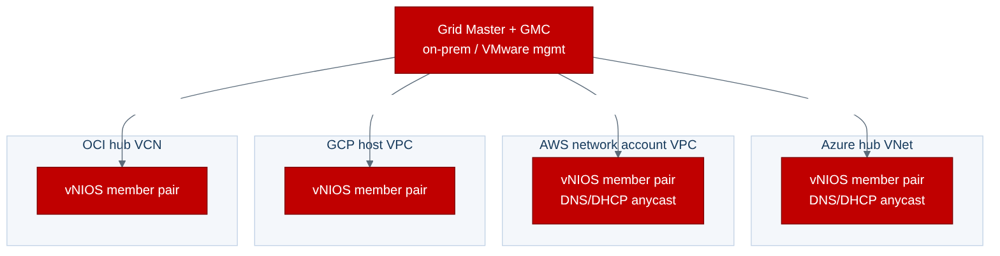
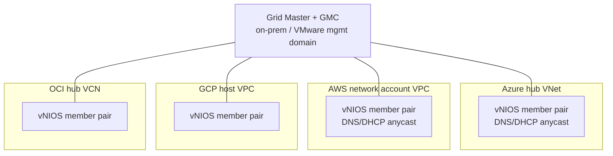

# Chapter 6 — Cross-Platform Operations & Multi-Cloud Governance

The previous chapters each stand up Infoblox DDI inside one platform's landing zone.
This chapter is the part that only makes sense once you have more than one: how to make
Azure, AWS, GCP, OCI, and VMware behave as a **single DDI fabric** with one
authoritative IPAM, one consistent resolution path, and one security and governance
posture — instead of five disconnected islands that happen to run the same vendor.

## 6.1 The organizing principle: one authoritative IPAM

The single most important design rule in this volume: **there is exactly one authoritative
source of truth for IP space and name records across the entire estate.** Every platform
chapter feeds *into* it; none of them owns a private copy.

- **NIOS/Grid model** — the Grid Master (with a Grid Master Candidate) holds the
  authoritative distributed database. vNIOS members in each cloud and in VMware are
  members of that one Grid. IPAM is unified by construction.
- **Universal DDI model** — the Infoblox Portal (Cloud Services Portal) is the single
  control plane; every cloud's hosts and discovery jobs report into it.

Either way, the cloud-discovery adapters described in each chapter (Azure service
principal, AWS IAM role, GCP service account, OCI API key, vCenter service account) are
what keep that one source of truth synchronized with reality. Discovery is not optional
polish — it is the mechanism that prevents the drift the whole volume exists to eliminate.

**Non-overlapping address plan.** Before any cloud is onboarded, carve the enterprise
supernet into non-overlapping blocks per platform/region/environment and model it in
IPAM *first*. Overlapping CIDRs across clouds are the number-one cause of failed
transit/peering and un-routable hybrid connectivity, and they are nearly impossible to
unwind after workloads land. Let IPAM allocate cloud subnets; do not let each cloud team
pick CIDRs independently.

```
Enterprise supernet 10.0.0.0/8  (authoritative in Infoblox IPAM)
├── 10.0.0.0/12   On-prem / VMware (VCF)
├── 10.16.0.0/12  Azure   ── per-region /16 ── per-VNet /20 ── subnets
├── 10.32.0.0/12  AWS     ── per-region /16 ── per-VPC  /20 ── subnets
├── 10.48.0.0/12  GCP     ── per-region /16 ── per-VPC  /20 ── subnets
└── 10.64.0.0/12  OCI     ── per-region /16 ── per-VCN  /20 ── subnets
```

## 6.2 Grid / control-plane topology across clouds

A recommended layout for the self-managed Grid model:





Design rules that apply regardless of platform:

- **Grid Master lives where your operational gravity is.** For most enterprises that is
  on-prem or the VMware management domain (Chapter 5), extended outward into cloud. A
  fully cloud-native org may host the Grid Master in a primary cloud's hub instead.
- **Members are local to the workloads they serve.** Put a member pair in each cloud's
  hub/connectivity network so DNS/DHCP resolution stays in-region and survives a WAN cut.
  Never make a spoke traverse the internet or a congested transit link for every lookup.
- **Grid communication** rides your existing private connectivity (ExpressRoute, Direct
  Connect, Cloud Interconnect, FastConnect, and inter-cloud transit) — not the public
  internet. Grid comms use 1194/udp (VPN) and 2114/tcp; keep them on private paths.
- **Universal DDI equivalent:** deploy a host (or HA pair) per cloud hub; the only WAN
  dependency is outbound 443 to the Portal. This is simpler to run but requires that
  outbound path from every cloud (a blocker in fully air-gapped gov environments — use
  the self-managed Grid there).

## 6.3 Consistent resolution across the estate

The goal is that any workload in any cloud can resolve any name — cloud-service private
names, other clouds' private zones, on-prem AD, and the internet — deterministically.


| Name type | Resolved by | Mechanism (per-chapter detail) |
|---|---|---|
| Cloud-native private (e.g. `*.privatelink`, blob/S3 private endpoints) | Native cloud DNS | Infoblox conditional-forwards to the cloud resolver (Azure Private Resolver, Route 53 Resolver inbound, Cloud DNS inbound policy, OCI private resolver) |
| Enterprise zones (`corp.example`) | Infoblox (authoritative) | Members answer directly; cloud VMs point DNS at the local member/anycast VIP |
| Other cloud's private zones | Infoblox → that cloud | Cross-forwarding via the Grid; one member set forwards to each cloud's resolver |
| On-prem AD (`ad.corp.example`) | On-prem DC / Infoblox | Conditional forwarding to AD DNS or AD-integrated members |
| Internet | Infoblox recursive + threat feeds | Recursion with RPZ / DNS threat intelligence applied uniformly |

**Anycast** the DNS service VIP so every VM uses the same DNS address everywhere and the
nearest healthy member answers. This removes per-cloud DNS-server IP sprawl from VM
images and DHCP scopes, and gives instant failover if a member dies.

## 6.4 One DNS-security posture, everywhere

DDI is also the enforcement point for DNS-layer security, and it should be *uniform*:

- **Response Policy Zones (RPZ) / threat intelligence** applied identically on every
  cloud's members so a malicious domain is blocked whether the query originates in Azure,
  AWS, GCP, OCI, or on VMware. Divergent policy per cloud is a security gap.
- **DNS tunneling / data-exfil detection** at the resolver — the same detection on every
  egress path.
- **Centralized DNS query logging** shipped to one SIEM. Because Infoblox sees every
  lookup, this is often the most complete east-west and egress telemetry you have; do not
  let each cloud keep its own siloed logs.

## 6.5 Automation, IaC, and the pipeline

Treat DDI as code, consistently across platforms:

- **IPAM-driven provisioning.** Wire the landing-zone pipeline so that creating a subnet
  in any cloud *requests* the CIDR from Infoblox IPAM (via WAPI / Universal DDI API /
  Terraform provider) rather than hard-coding it. Infoblox becomes the allocator; the
  cloud gets told what to use.
- **Terraform.** The Infoblox `infoblox/infoblox` (NIOS) and Universal DDI providers let
  you manage networks, ranges, host records, and fixed addresses in the same plan that
  builds the cloud resources — one `terraform apply` that allocates and records.
- **VM lifecycle hooks.** On create, allocate + register (A/PTR); on destroy, reclaim the
  address and delete records. Chapter 5's Aria Automation plugin does this for VMware; the
  cloud chapters do it via discovery + pipeline hooks. Reclaim-on-delete is what keeps
  IPAM from silently filling with ghosts.
- **Tag/label governance.** Standardize a tag schema (owner, environment, app, cost-center)
  across every cloud and have discovery map those tags into IPAM extensible attributes, so
  one query answers "what is this IP, who owns it, and where does it live" across all five
  platforms.

## 6.6 Resilience & disaster recovery

- **Grid Master Candidate** in a *different* failure domain than the Grid Master (different
  region, or on-prem GM with a cloud GMC). Promotion restores the control plane if the
  primary site is lost.
- **Member pairs per cloud** so no single cloud's DNS depends on another cloud being up.
- **Database backups** of the Grid Master exported off-platform on a schedule.
- **Test failover deliberately:** promote the GMC in a game-day, kill a member and confirm
  anycast reconverges, and validate that each cloud still resolves with its upstream WAN
  severed. A DR plan for DNS that has never been exercised is a hope, not a plan.

## 6.7 Governance, RBAC & compliance across tenancies

- **Single RBAC model** in Infoblox mapping to each cloud team's scope (per-cloud, per-BU
  admin roles) so delegation is consistent and audited in one place.
- **Change audit** centralized — every record/allocation change is attributable, which is
  exactly what auditors ask for in a multi-cloud estate.
- **Sovereignty:** where a platform has a gov/sovereign region (Azure Government, AWS
  GovCloud, Google Assured Workloads, OCI Government/National Security regions), keep those
  members and their control-plane in the matching boundary. For fully air-gapped
  boundaries, use the self-managed Grid (no outbound Portal dependency) — see each
  chapter's security section.

## 6.8 Rollout sequence (recommended)

1. **Model IPAM first** — build the non-overlapping address plan in Infoblox before any
   cloud subnet exists (§6.1).
2. **Anchor the control plane** — stand up the Grid Master/GMC (or Universal DDI Portal
   onboarding), typically in the VMware/on-prem management domain (Chapter 5).
3. **Onboard clouds one at a time** — per the platform chapters, each adding a member pair
   in that cloud's hub plus its discovery adapter. Validate resolution and discovery before
   moving to the next.
4. **Unify resolution** — wire cross-forwarding and anycast so every cloud can resolve
   every zone (§6.3).
5. **Apply uniform security** — push the same RPZ/threat policy and centralize query logging
   everywhere (§6.4).
6. **Automate** — hook IPAM into the landing-zone pipelines so new subnets and VMs allocate
   and register automatically (§6.5).
7. **Prove DR** — game-day the control-plane and member failovers (§6.6).

---

## Sources

- [Infoblox — Universal DDI](https://www.infoblox.com/products/universal-ddi/)
- [Infoblox — NIOS / Grid documentation](https://docs.infoblox.com/space/nios)
- [Infoblox — Response Policy Zones (RPZ) / DNS security](https://www.infoblox.com/products/threat-defense/)
- [Infoblox Terraform provider (NIOS)](https://registry.terraform.io/providers/infobloxopen/infoblox/latest/docs)
- [Infoblox — Anycast DNS with NIOS](https://docs.infoblox.com/space/nios)
