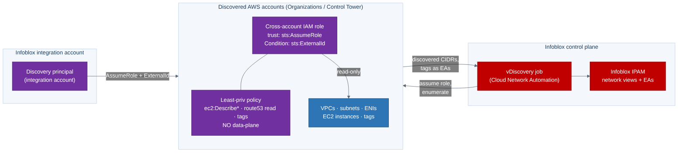
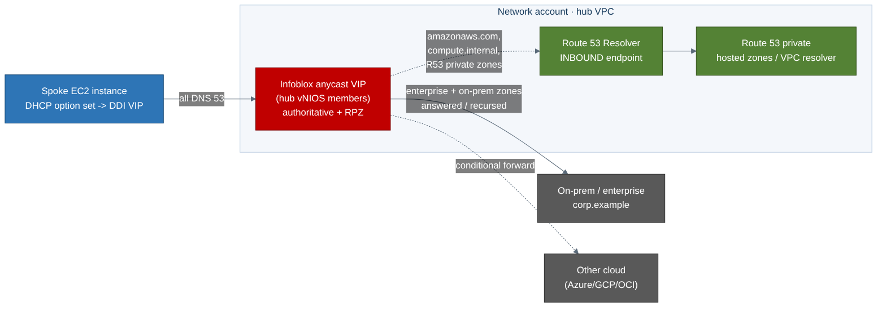

# AWS Landing Zone + Infoblox DDI — Step-by-Step Deployment Runbook

> **Companion to** [`AWS-LZ-Infoblox-DDI-Automation-Guide.md`](./AWS-LZ-Infoblox-DDI-Automation-Guide.md).
> That guide explains *why* the architecture is shaped the way it is; this runbook
> is the **"do exactly this, then this"** operational sequence that deploys it with
> the IaC package in this directory. Every command, variable name, resource name,
> port, IAM action, and output below is taken from the real module and its
> [`_module-contract.md`](./_module-contract.md) — nothing is invented. Where a
> value is genuinely environment-specific (AMI ID, instance type, region, CIDR)
> the runbook says **"supply your own"** rather than guessing.
>
> **Posture (fixed):** GCC-Moderate operating posture on the **commercial AWS
> partition (`.com` endpoints)** — `sts.amazonaws.com`, `s3.amazonaws.com`,
> `secretsmanager.<region>.amazonaws.com`. **Not** AWS GovCloud (`us-gov-*`). Do
> **not** target a `us-gov-*` region.
>
> **Default path:** `deployment_model = "grid"` (vNIOS Grid, control plane inside
> the ATO boundary). The `universal_ddi` (Infoblox Portal / SaaS) path is shown in
> clearly-marked **⚠ UNIVERSAL DDI** callout boxes and always honors the
> `acknowledge_saas_boundary` guard.
>
> **Status of the IaC:** a coherent starter skeleton — structurally correct and
> guardrail-bearing, *not* a certified production module. Pin your own versions,
> confirm the Marketplace AMI, and test in a sandbox account first.

---

## Prerequisites checklist

Confirm **all** of these before Phase 0.

- [ ] **Stage-1 landing zone already deployed.** AWS Control Tower + the Landing
      Zone Accelerator on AWS (organization, guardrails, the Network-account
      shared-services hub VPC with a Transit Gateway and — ideally — Route 53
      Resolver endpoints) exists and publishes outputs. This module is **Stage 2**;
      it never builds Stage 1.
- [ ] **Stage-1 outputs available:** `network_account_id`, `hub_vpc_id`,
      `transit_gateway_id`, and (optional) `r53_resolver_inbound_ip` /
      `dns_query_log_group_arn`.
- [ ] **Permissions.** You (or the pipeline role) can create subnets/SG/EC2/IAM in
      the Network account, and create the cross-account discovery role. Discovery
      uses a *separate, least-privileged* role (Phase 4).
- [ ] **Tooling:** `aws` CLI ≥ 2.15, Terraform ≥ 1.5 (`>= 1.5.0, < 2.0.0` for
      `precondition`/`check` blocks), `jq`, `dig`/`nslookup`.
- [ ] **AWS Marketplace subscription** to *Infoblox NIOS for AWS* (BYOL or PayGo),
      accepted in the target account, plus the DNS/DHCP/Grid/Threat-Defense and
      **Cloud Network Automation** licenses.
- [ ] **Free, non-overlapping CIDRs** inside the hub VPC — one per AZ — for the
      dedicated DDI subnets (`ddi_subnet_cidrs`).
- [ ] **Explicit CIDRs** for SG scoping — mgmt, DNS clients (spokes/on-prem), Grid
      peers/GM, monitoring. **Never `0.0.0.0/0`** (the module hard-fails on it).
- [ ] **A strong ExternalId** string for the discovery role's cross-account trust.

---

## Phase 0 — Decisions & inventory

### Step 0.1 — Choose the control-plane model

The single most consequential decision. It sets **where the control plane lives
relative to your ATO boundary**.

| | `deployment_model = "grid"` (default) | `deployment_model = "universal_ddi"` |
|---|---|---|
| Control plane | vNIOS **Grid**, self-operated in-account | Infoblox **Portal / CSP** (SaaS) |
| Vs. ATO boundary | **Inside** | **Outside** |
| Data-plane members | vNIOS DNS members | NIOS-X servers |
| Outbound dependency | Grid VPN `1194/udp` + `2114/tcp` | **outbound `443` to `csp.infoblox.com`** |
| GCC-Moderate fit | **Boundary-clean — recommended default** | Requires authorization review |
| Code guard | none | hard-fails unless `acknowledge_saas_boundary = true` |

**Decision:** For a boundary-clean GCC-Moderate landing zone, choose **`grid`**.
Only choose `universal_ddi` after completing the FedRAMP/authorization review for
the SaaS control-plane egress.

**Verify:** Write the chosen `deployment_model` value down; it must match across
`terraform.tfvars` and the pipeline env (`DEPLOYMENT_MODEL`).

> **⚠ UNIVERSAL DDI callout.** If you selected `universal_ddi`, you must also set
> `acknowledge_saas_boundary = true` **and** be able to justify the outbound-443
> dependency to `csp.infoblox.com`. Leaving the ack `false` (the default) is a
> deliberate hard-fail — see Phase 6.

### Step 0.2 — Gather Stage-1 outputs into shell variables

```bash
# Fill these from your Stage-1 Control Tower / LZA outputs.
export REGION="us-east-1"                              # supply your own commercial region
export NETWORK_ACCOUNT_ID="000000000000"              # network_account_id
export HUB_VPC_ID="vpc-0123456789abcdef0"             # hub_vpc_id
export TGW_ID="tgw-0123456789abcdef0"                 # transit_gateway_id
export R53_INBOUND_IP="10.10.2.4"                     # Route 53 Resolver inbound endpoint (Stage-1/existing)
export DDI_SUBNET_CIDRS='["10.10.4.0/27","10.10.4.32/27"]'  # one per AZ; supply your own
export AZS='["us-east-1a","us-east-1b"]'              # supply your own AZs
```

**Verify:** `echo "$HUB_VPC_ID"` matches `vpc-...` and `echo "$TGW_ID"` matches
`tgw-...` — the module's validation rejects anything else.

---

## Phase 1 — Tooling & auth

### Step 1.1 — Install and check tooling

```bash
aws --version
terraform version          # expect >= 1.5.0, < 2.0.0
jq --version ; dig -v 2>&1 | head -1
```

**Verify:** `terraform version` prints a 1.5+ build; `aws --version` prints the CLI.

### Step 1.2 — Authenticate to the Network account (commercial partition)

```bash
# Commercial partition (aws). Do NOT use a us-gov-* profile/region.
aws sts get-caller-identity --query '{acct:Account, arn:Arn}' --output table
# If you run from a tooling account, assume the deploy role into the Network account:
# aws sts assume-role --role-arn arn:aws:iam::$NETWORK_ACCOUNT_ID:role/DeployRole --role-session-name ddi
```

**Verify:** `acct` equals `$NETWORK_ACCOUNT_ID` (or you have assumed a role into it).

> **Troubleshooting — wrong partition.** If any ARN shows `arn:aws-us-gov:`, you
> are in GovCloud — switch to a commercial-partition profile/region. The `us-gov-*`
> boundary is explicitly out of scope; the module rejects a `us-gov-*` region.

### Step 1.3 — Create the Terraform remote-state backend (S3 + DynamoDB)

State lives in an S3 bucket (SSE-KMS, versioned) with a DynamoDB lock table.

```bash
export TFSTATE_BUCKET="my-tfstate-$RANDOM"   # must be globally unique
export TFSTATE_LOCK_TABLE="tf-lock"

aws s3api create-bucket --bucket "$TFSTATE_BUCKET" --region "$REGION" \
  $( [ "$REGION" = "us-east-1" ] || echo --create-bucket-configuration LocationConstraint=$REGION )
aws s3api put-bucket-versioning --bucket "$TFSTATE_BUCKET" \
  --versioning-configuration Status=Enabled
aws s3api put-bucket-encryption --bucket "$TFSTATE_BUCKET" \
  --server-side-encryption-configuration '{"Rules":[{"ApplyServerSideEncryptionByDefault":{"SSEAlgorithm":"aws:kms"}}]}'
aws s3api put-public-access-block --bucket "$TFSTATE_BUCKET" \
  --public-access-block-configuration BlockPublicAcls=true,IgnorePublicAcls=true,BlockPublicPolicy=true,RestrictPublicBuckets=true
aws dynamodb create-table --table-name "$TFSTATE_LOCK_TABLE" \
  --attribute-definitions AttributeName=LockID,AttributeType=S \
  --key-schema AttributeName=LockID,KeyType=HASH \
  --billing-mode PAY_PER_REQUEST --region "$REGION"
```

**Verify:** `aws s3api get-bucket-versioning --bucket "$TFSTATE_BUCKET"` returns
`Enabled`; `aws dynamodb describe-table --table-name "$TFSTATE_LOCK_TABLE" --query
'Table.TableStatus'` returns `ACTIVE`.

---

## Phase 2 — Consume Stage-1 outputs

The module learns about the hub **only** through Stage-1 outputs — it never queries
or mutates Stage-1-owned resources.

### Step 2.1 — Option A: `terraform_remote_state` (preferred)

`examples/hub-integration/main.tf` reads the LZA state directly:

```hcl
data "terraform_remote_state" "lza" {
  backend = "s3"
  config  = { bucket = "my-tfstate-bucket", key = "lza/network.tfstate", region = "us-east-1" }
}
# then:  hub_vpc_id = data.terraform_remote_state.lza.outputs.hub_vpc_id
```

**Verify:** `terraform console` → `data.terraform_remote_state.lza.outputs.hub_vpc_id`
prints the hub VPC ID.

### Step 2.2 — Option B: `aws` lookups (provider-agnostic)

If Stage 1 doesn't share Terraform state, resolve the same facts with `aws`:

```bash
# hub_vpc_id (by Name tag, adjust to your LZA convention)
aws ec2 describe-vpcs --filters Name=tag:Name,Values=shared-services --query 'Vpcs[0].VpcId' --output text
# transit_gateway_id
aws ec2 describe-transit-gateways --query 'TransitGateways[0].TransitGatewayId' --output text
# Route 53 Resolver inbound endpoint IP (Stage-1/existing)
aws route53resolver list-resolver-endpoints \
  --filters Name=Direction,Values=INBOUND --query 'ResolverEndpoints[0].Id' --output text
# then: aws route53resolver list-resolver-endpoint-ip-addresses --resolver-endpoint-id <id> \
#         --query 'IpAddresses[0].Ip' --output text
# or read a published SSM parameter:
aws ssm get-parameter --name /lza/network/hub_vpc_id --query Parameter.Value --output text
```

**Verify:** each command prints a value; feed them into the tfvars in Phase 5. These
map to `hub_vpc_id`, `transit_gateway_id`, and `r53_resolver_inbound_ip`.

---

## Phase 3 — Secrets in Secrets Manager / SSM

The module **reads existing** secrets (`data.aws_secretsmanager_secret_version` or
`data.aws_ssm_parameter`); it never creates them and never emits them as plaintext
outputs. Pick a store with `secrets_store_type` and create the secrets under the
names the module expects.

### Step 3.1 — Store the module secrets (Secrets Manager, default)

```bash
# Admin password (bootstrapped into vNIOS/NIOS-X via user-data).
aws secretsmanager create-secret --name ddi/vnios-admin-password \
  --secret-string '<STRONG_ADMIN_PASSWORD>'

# vNIOS temporary license bundle for first boot.
aws secretsmanager create-secret --name ddi/vnios-temp-license \
  --secret-string 'vnios dns dhcp grid enterprise'

# Grid shared secret used to join AWS members to the Grid (grid path).
aws secretsmanager create-secret --name ddi/grid-shared-secret \
  --secret-string '<GRID_SHARED_SECRET>'
```

> **⚠ UNIVERSAL DDI callout.** For `universal_ddi`, also store the Portal join
> token (NIOS-X hosts phone home to `csp.infoblox.com` over 443 with it):
> ```bash
> aws secretsmanager create-secret --name ddi/uddi-join-token \
>   --secret-string '<PORTAL_JOIN_TOKEN>'
> ```

**Verify:**
`aws secretsmanager list-secrets --query "SecretList[?starts_with(Name,'ddi/')].Name"`
lists the secret names you set.

> **SSM alternative.** With `secrets_store_type = "ssm_parameter_store"` store the
> same values as **SecureString** parameters instead:
> ```bash
> aws ssm put-parameter --name ddi/vnios-admin-password --type SecureString --value '<...>'
> ```

---

## Phase 4 — Discovery cross-account IAM role + ExternalId

The AWS→Infoblox IPAM sync uses a **separate, least-privileged cross-account IAM
role** (`ddi-disco-role`) assumed by the Infoblox integration account, with an
**ExternalId** condition. The module creates it in the account it runs in; you
replicate it to each discovered account.



| Capability | Actions | When |
|---|---|---|
| VPC/subnet/instance discovery | `ec2:DescribeVpcs/Subnets/Instances/NetworkInterfaces/AvailabilityZones/Regions` | always |
| Tags | `ec2:DescribeTags` | always |
| Route 53 read | `route53:ListHostedZones/ListResourceRecordSets/GetHostedZone` | only if `enable_record_read` |
| Cross-account trust | `sts:AssumeRole` from integration account + `Condition sts:ExternalId` | always |

### Step 4.1 — The module creates the role for you

With `discovery_identity_type = "iam_role"`, `discovery_integration_account_id`, and
`discovery_external_id` set (Phase 5), `terraform apply` creates `ddi-disco-role`,
its custom policy, and the ExternalId-gated trust. No manual step in the deploy
account.

**Verify (after Phase 6 apply):**

```bash
aws iam get-role --role-name ddi-disco-role \
  --query 'Role.AssumeRolePolicyDocument.Statement[0].Condition' --output json
```

The condition shows `sts:ExternalId` = your value. This role ARN becomes the module
output `discovery_identity_id`.

### Step 4.2 — Replicate the role into each discovered account

A Terraform apply targets one account. For **Organizations/Control Tower**, deploy
the same role (trust + ExternalId + policy) into every `discovered_account_ids`
account with **CloudFormation StackSets** (service-managed, org-wide) or a
per-account apply.

```bash
# Illustrative: deploy the discovery role stack to an OU via StackSets.
aws cloudformation create-stack-instances --stack-set-name ddi-disco-role \
  --deployment-targets OrganizationalUnitIds=<ou-id> \
  --regions "$REGION"
```

**Verify:** in a member account, `aws iam get-role --role-name ddi-disco-role`
returns the role with the same ExternalId condition.

> **Troubleshooting — discovery enumerates nothing.** Usual cause: the role is
> missing in a target account (Step 4.2) or the ExternalId in Infoblox's discovery
> config doesn't match `discovery_external_id`. Confirm both.

---

## Phase 5 — Configure the module (`terraform.tfvars`)

Start from `examples/hub-integration/main.tf`, then externalize the values into a
`terraform.tfvars` next to the module. Every variable below is real.

```hcl
# terraform.tfvars — Stage-2 Infoblox DDI (grid, commercial .com, GCC-Moderate)

# --- Basics / boundary ---
name_prefix        = "ddi"                 # -> ddi-sg, ddi-subnet-use1a, ddi-vnios-use1a, ddi-disco-role
region             = "us-east-1"           # supply your own commercial region
environment        = "prod"                # dev | test | prod
deployment_model   = "grid"                # boundary-clean default
compliance_profile = "gcc-moderate"
# acknowledge_saas_boundary left false — not needed for grid.

# --- From Stage-1 outputs ---
network_account_id = "000000000000"
hub_vpc_id         = "vpc-0123456789abcdef0"
transit_gateway_id = "tgw-0123456789abcdef0"

# --- Dedicated DDI subnets (one per AZ; must fit hub VPC, not overlap) ---
ddi_subnet_cidrs   = ["10.10.4.0/27", "10.10.4.32/27"]
availability_zones = ["us-east-1a", "us-east-1b"]

# --- Members: 2 across two AZs (HA) ---
member_count = 2

# --- Instance type + Marketplace AMI: supply your own (do NOT invent) ---
vnios_instance_type = "m7i.xlarge"           # M7i/R7i for NIOS 9.0.5+; verify supported list + vCPU quota
vnios_ami_id        = "ami-0123456789abcdef0" # discover: aws ec2 describe-images (see Phase 6)

# --- Secrets ---
secrets_store_type = "secrets_manager"       # or ssm_parameter_store

# --- SG source scoping (never 0.0.0.0/0) ---
mgmt_source_cidrs = ["10.10.0.0/24"]                     # jumpbox/bastion subnet
dns_client_cidrs  = ["10.20.0.0/16", "10.30.0.0/16"]     # spoke ranges permitted to query 53 (via TGW)
grid_peer_cidrs   = ["10.10.4.0/26", "192.168.100.0/24"] # DDI subnets + on-prem GM (grid only)

# --- Grid join (usual pattern: join AWS members to the on-prem GM) ---
grid_name       = "CorpGrid"
grid_master_vip = "192.168.100.10"           # on-prem Grid Master VIP; null => first member is GM (lab only)

# --- DNS integration (§8) ---
r53_resolver_inbound_ip = "10.10.2.4"        # Stage-1 Route 53 Resolver inbound endpoint
ddi_anycast_vip         = "10.10.4.10"        # advertised from both members
# aws_service_forward_domains defaults to ["amazonaws.com","compute.internal"]

# --- Cross-account discovery role (§5) ---
discovery_identity_type          = "iam_role"
discovery_integration_account_id = "111122223333"        # Infoblox integration account
discovery_external_id            = "REPLACE-strong-external-id"
discovered_account_ids           = ["444455556666"]
enable_record_read               = false     # EC2/IPAM discovery only by default

# --- Spoke DHCP-option-set write-through (opt-in) ---
spoke_vpc_ids          = []                   # e.g. ["vpc-0aaa...","vpc-0bbb..."]
enable_spoke_dns_write = false

# --- Secret names (match Phase 3) ---
admin_password_secret_name = "ddi/vnios-admin-password"
temp_license_secret_name   = "ddi/vnios-temp-license"
grid_shared_secret_name    = "ddi/grid-shared-secret"

tags = { owner = "network-platform", costcenter = "cc-1234" }
```

**What the key variables do (all real):**

- `deployment_model` / `acknowledge_saas_boundary` — the boundary switch + its guard.
- `ddi_subnet_cidrs` + `availability_zones` — one subnet per AZ; a `check` block
  fails the plan if the lists don't line up 1:1.
- `member_count` — members are round-robined over the AZs; ≤ one member per AZ
  yields the clean `ddi-vnios-use1a` / `ddi-vnios-use1b` names.
- `grid_peer_cidrs` — **required for grid** (an SG precondition fails the plan if
  `grid` is selected and it's empty).
- `mgmt_source_cidrs` / `dns_client_cidrs` — enforced non-empty and **must not**
  contain `0.0.0.0/0` (variable `validation`).
- `ddi_anycast_vip` — becomes real only after Grid formation (Phase 7); until then
  outputs fall back to `dns_server_ips` (member LAN1 IPs).

> **⚠ UNIVERSAL DDI callout — tfvars deltas.** To run the SaaS path:
> ```hcl
> deployment_model            = "universal_ddi"
> acknowledge_saas_boundary   = true            # REQUIRED — false hard-fails the plan
> saas_join_token_secret_name = "ddi/uddi-join-token"
> infoblox_portal_url         = "https://csp.infoblox.com"   # outbound 443 required
> # grid_master_vip / grid_shared_secret_name are unused on this path
> ```
> With ack `false`, `terraform plan` aborts with the `BOUNDARY VIOLATION` message
> pointing to the authorization review — resources `ddi-niosx-*` and
> `null_resource.portal_enroll` never plan.

---

## Phase 6 — Deploy

### Step 6.1 — Subscribe to the Marketplace listing & discover the AMI

Subscribe to *Infoblox NIOS for AWS* in AWS Marketplace (console), then discover the
AMI for your region (a launch fails otherwise, and AMIs are region-specific):

```bash
aws ec2 describe-images --owners aws-marketplace \
  --filters 'Name=name,Values=*Infoblox*NIOS*' \
  --query 'reverse(sort_by(Images,&CreationDate))[].{Id:ImageId,Name:Name}' --output table
# Take the ImageId for your subscribed listing/version -> vnios_ami_id.
```

**Verify:** `aws ec2 describe-images --image-ids <ami-id> --query 'Images[0].Name'`
returns the Infoblox NIOS image name. Do **not** invent an AMI ID.

### Step 6.2 — `init` with the remote backend

```bash
cd infoblox-ddi-book/aws-lz-automation/terraform
terraform init \
  -backend-config="bucket=$TFSTATE_BUCKET" \
  -backend-config="key=ddi-prod.tfstate" \
  -backend-config="region=$REGION" \
  -backend-config="dynamodb_table=$TFSTATE_LOCK_TABLE" \
  -backend-config="encrypt=true"
```

**Verify:** `Terraform has been successfully initialized!` and the `aws`,
`infobloxopen/infoblox`, and `null` providers resolve (per `versions.tf`).

### Step 6.3 — `plan` (guards are evaluated here)

```bash
terraform plan -input=false -out=tfplan
```

**Expected:** the plan creates the DDI subnets (`ddi-subnet-use1a`/`-use1b`), the
route table + TGW routes, `ddi-sg` + rules, the member ENIs (MGMT + LAN1) and
`aws_instance` members (`ddi-vnios-use1a`/`-use1b`), the `ddi-disco-role` +
policy + trust, and the `infoblox_zone_forward` objects (if `r53_resolver_inbound_ip`
set). The boundary guard, the subnet/AZ `check`, and SG CIDR scoping are checked at
**plan** time.

**Verify:** plan summary shows the expected adds and **no** `0.0.0.0/0` ingress
sources (the only `0.0.0.0/0` allowed is the `universal_ddi` Portal *egress*).

### Step 6.4 — `apply`

```bash
terraform apply -input=false -auto-approve tfplan
```

**Expected outputs (contract §7):**

```bash
terraform output
# ddi_subnet_ids        = ["subnet-...","subnet-..."]
# dns_server_ips        = ["10.10.4.4", "10.10.4.36"]   # member LAN1 IPs
# ddi_anycast_vip       = "10.10.4.10"                    # null until Grid advertises it
# grid_master_ip        = "192.168.100.10"               # on-prem GM (grid only)
# discovery_identity_id = "arn:aws:iam::000000000000:role/ddi-disco-role"
```

**Cross-AZ members:** confirm the two members landed in different AZs:

```bash
aws ec2 describe-instances --filters Name=tag:workload,Values=infoblox-ddi \
  --query 'Reservations[].Instances[].{Name:Tags[?Key==`Name`]|[0].Value, AZ:Placement.AvailabilityZone}' --output table
```

**Verify:** `ddi-vnios-use1a` shows `us-east-1a`, `ddi-vnios-use1b` shows `us-east-1b`.

> **Troubleshooting — AMI not accessible.** Apply fails with *"not authorized"* or
> *"AMI not found"* → you haven't subscribed to the Marketplace listing in this
> account, or the AMI ID is from another region. Re-run Step 6.1.
>
> **Troubleshooting — grid plan fails immediately.** *"deployment_model='grid'
> requires grid_peer_cidrs"* → set `grid_peer_cidrs` (Grid members/GM ranges).
>
> **Troubleshooting — subnet/AZ mismatch.** The `check "subnet_az_alignment"` block
> fails when `ddi_subnet_cidrs` and `availability_zones` differ in length — provide
> exactly one CIDR per AZ.
>
> **Troubleshooting — DNS-object apply fails.** `infoblox_zone_forward` needs a
> reachable Grid/NIOS WAPI endpoint. Members are not yet Grid-joined at first apply;
> either configure the `infoblox` provider `server` to the on-prem GM, or run the
> DNS-object resources in a **second phase** after Phase 7 (use `-target` or a
> dependent module). This ordering is by design.

---

## Phase 7 — Grid formation / Universal DDI onboarding

The instances exist, but the **control plane is not yet formed**. `ddi_anycast_vip`
and `grid_master_ip` become operationally real only after this phase.

### Step 7.1 — Grid path: form / join the Grid

Each member booted with `user_data` (`#infoblox-config`) carrying the temp license,
admin password, and grid-join parameters from Secrets Manager. Complete formation:

- **Usual AWS pattern:** the on-prem Grid Master (`grid_master_vip`) is
  authoritative; the AWS members join as **Grid members** over `1194/udp` +
  `2114/tcp`. Confirm each member appears in the Grid Manager UI under your
  `grid_name` (e.g. `CorpGrid`).
- **Lab/greenfield:** if `grid_master_vip = null`, the first member
  (`ddi-vnios-use1a`) initializes the Grid as GM; the second joins it.
- **Assign the anycast VIP** (`ddi_anycast_vip`, e.g. `10.10.4.10`) as a shared DNS
  service address advertised from both members (source/dest check is off on the
  LAN1 ENIs), so spokes use one stable resolver.

**Verify (WAPI, from a mgmt host):**

```bash
export GRID_MASTER="<gm-mgmt-ip-or-fqdn>"          # your Grid Master (grid_master_ip)
export INFOBLOX_USERNAME="admin"
export INFOBLOX_PASSWORD="<from-secrets-manager>"
curl -fsS -u "$INFOBLOX_USERNAME:$INFOBLOX_PASSWORD" \
  "https://$GRID_MASTER/wapi/v2.12/member?_return_fields%2B=host_name,service_status"
```

Both AWS members show `service_status` running for DNS. Confirm the exact WAPI
object/field names against `<grid-master>/wapidoc/` for your NIOS version.

> **⚠ UNIVERSAL DDI callout — enroll NIOS-X to the Portal.** Instead of Grid
> formation, each `ddi-niosx-*` host self-enrolls to `csp.infoblox.com` over 443
> using the join token from `user_data`. The `null_resource.portal_enroll` is the
> explicit API seam — replace its placeholder with the real CSP REST call, then
> confirm in the Portal inventory (using `$INFOBLOX_CSP_TOKEN` from Secrets Manager).

**Verify:** members/hosts report healthy in the Grid Manager UI or the Portal, and
the anycast VIP answers (tested in Phase 11).

---

## Phase 8 — Cloud discovery adapter

AWS IAM (Phase 4) grants the credential; the **Infoblox side** of discovery is
configured on the control plane — there is no `infoblox_vdiscovery_job` provider
resource, so this is an explicit API/UI handoff (the module documents the seam in
`discovery.tf`).

### Step 8.1 — Grid path: create a vDiscovery job (WAPI)

Point Cloud Network Automation at each account/region, authenticating by **assuming
the cross-account role** (`discovery_identity_id`) with the ExternalId. A single job
can span multiple accounts of an Organization (NIOS 9.0.4+). Illustrative WAPI
handoff:

```bash
curl -fsS -u "$INFOBLOX_USERNAME:$INFOBLOX_PASSWORD" \
  -X POST "https://$GRID_MASTER/wapi/v2.12/vdiscoverytask" \
  -H 'Content-Type: application/json' \
  -d '{"name":"aws-disco","member":"infoblox.localdomain","credential_type":"AWS"}'
```

Schedule it on a cadence (e.g. hourly) so IPAM tracks AWS reality. Confirm the exact
object/fields against `<grid-master>/wapidoc/` for your NIOS version.

> **⚠ UNIVERSAL DDI callout.** Configure a Portal **Universal Cloud** AWS source
> using the same role + ExternalId via the CSP API/UI; the discovery job lives in
> the SaaS control plane.

**Verify:** run the Stage-3 discovery check (Phase 11) — it asserts the job exists,
is not in `ERROR`/`WARNING`, and ran within `STALE_THRESHOLD_MIN`.

---

## Phase 9 — DNS integration

Two conditional-forwarding paths meet at the Route 53 Resolver.



### Step 9.1 — Infoblox → AWS (inbound): conditional forwarders

`dns.tf` creates one `infoblox_zone_forward` per domain in
`aws_service_forward_domains` (default: `amazonaws.com`, `compute.internal`), each
pointing `forward_to.address` at `r53_resolver_inbound_ip`. This runs only when
`deployment_model = "grid"` **and** `r53_resolver_inbound_ip != null`.

**Verify (after the DNS-object phase applies):**

```bash
curl -fsS -u "$INFOBLOX_USERNAME:$INFOBLOX_PASSWORD" \
  "https://$GRID_MASTER/wapi/v2.12/zone_forward?fqdn=amazonaws.com"
```

Returns the forward zone targeting the inbound endpoint IP.

### Step 9.2 — AWS → Infoblox (outbound): spoke DHCP option sets

Point spoke VPC `domain-name-servers` at the DDI resolver. The module writes a DHCP
option set and associates it **only** when `spoke_vpc_ids` is non-empty **and**
`enable_spoke_dns_write = true`. Manual equivalent:

```bash
DOPT=$(aws ec2 create-dhcp-options \
  --dhcp-configuration "Key=domain-name-servers,Values=10.10.4.10" \
  --query 'DhcpOptions.DhcpOptionsId' --output text)
aws ec2 associate-dhcp-options --dhcp-options-id "$DOPT" --vpc-id <spoke-vpc-id>
```

**Verify:**
`aws ec2 describe-vpcs --vpc-ids <spoke-vpc-id> --query 'Vpcs[0].DhcpOptionsId'`
returns `$DOPT` (instances pick up the resolver on DHCP lease renewal).

### Step 9.3 — (Optional) Reverse direction: Resolver outbound endpoint + rules

Forward the enterprise domain back to the DDI members (not all deployments automate
this — the platform team may own the resolver):

```bash
# outbound endpoint (2 AZ subnets) + a FORWARD rule targeting the DDI VIP:
aws route53resolver create-resolver-rule --name corp --rule-type FORWARD \
  --domain-name corp.example --resolver-endpoint-id <outbound-ep-id> \
  --target-ips 'Ip=10.10.4.10,Port=53'
# then associate the rule with the VPC(s), sharing across accounts via AWS RAM.
```

**Verify:** from an AWS spoke instance, a `corp.example` name resolves via the DDI
VIP (tested in Phase 11).

> **Troubleshooting — SG blocking 53/1194/2114.** If DNS times out or Grid members
> won't converge, confirm the `ddi-sg` rules exist and sources match your CIDRs:
> `aws ec2 describe-security-groups --filters Name=group-name,Values=ddi-sg
> --query 'SecurityGroups[0].{In:IpPermissions,Out:IpPermissionsEgress}'`.
> Egress is default-deny except the managed allows — confirm NTP(123/udp),
> DNS-out(53), and (grid) 1194/2114 egress are present.

---

## Phase 10 — IPAM automation

Because discovery imports AWS **tags as extensible attributes (EAs)**, IPAM becomes
an API the platform consumes.

### Step 10.1 — Onboard accounts & confirm networks appear

vDiscovery walks accounts → VPCs → subnets and populates Infoblox IPAM as
networks/containers with discovered instances as records.

**Verify:**

```bash
curl -fsS -u "$INFOBLOX_USERNAME:$INFOBLOX_PASSWORD" \
  "https://$GRID_MASTER/wapi/v2.12/network?_return_fields%2B=network,comment&network_view=default"
```

AWS VPC/subnet CIDRs (including the DDI subnets `10.10.4.0/27` etc.) appear as
`network` objects.

### Step 10.2 — Tag-driven allocation & VPC IPAM coexistence

Keyed on `environment`/`owner`/`costcenter` EAs, provisioning pipelines carve the
next free subnet from the correct container (WAPI `nextavailablenetwork` or the
`infoblox_ipv4_network` / `infoblox_network_view` provider resources) and feed that
CIDR into the workload's IaC. Where you use the **Amazon VPC IPAM ↔ Infoblox**
integration, designate Infoblox as the authority for a VPC IPAM **private scope**
and pull CIDRs via **BYOIP** — private scopes only.

**Verify:** the IPAM conflict gate (Phase 11) reports no overlaps after a sync.

---

## Phase 11 — Validation gates

Run each `validation/*.sh` with its env-var contract. Any non-zero exit fails the
Stage-3 pipeline gate.

### Step 11.1 — DNS resolution (`dns-validation.sh`)

```bash
cd infoblox-ddi-book/aws-lz-automation/validation
export DDI_VIP="10.10.4.10"                                  # ddi_anycast_vip
export TEST_FQDN="app01.corp.example.com"                    # enterprise A record
export EXPECTED_IP="10.20.5.10"                              # its expected answer
export PRIVATELINK_FQDN="myendpoint.<region>.amazonaws.com"  # optional: AWS-service/forwarded name
bash dns-validation.sh
```

**Proves:** the DDI VIP answers an enterprise A record with `EXPECTED_IP`, and an
AWS-service/forwarded name resolves through the conditional-forward path to a
**private** (RFC1918) IP. **Verify:** ends with `All DNS validation checks passed.`

### Step 11.2 — Discovery-sync freshness (`discovery-sync-check.sh`)

```bash
export DDI_API_FLAVOR="nios"                # grid default; "universal_ddi" for SaaS
export GRID_MASTER="<grid-master>"          # WAPI host (grid_master_ip)
export INFOBLOX_USERNAME="admin"            # from Secrets Manager
export INFOBLOX_PASSWORD="<from-secrets-manager>"
export STALE_THRESHOLD_MIN="1440"           # 24h
bash discovery-sync-check.sh
```

**Proves:** the vDiscovery task completed successfully and recently. **Verify:** ends
with `Discovery-sync freshness check passed.`

> **⚠ UNIVERSAL DDI callout.** Set `DDI_API_FLAVOR=universal_ddi` and provide
> `INFOBLOX_CSP_TOKEN` (from Secrets Manager); the check queries `csp.infoblox.com`
> cloud-discovery jobs. Only exercise this when `acknowledge_saas_boundary = true`.

### Step 11.3 — IPAM conflict (`ipam-conflict-check.sh`)

```bash
export GRID_MASTER="<grid-master>"
export INFOBLOX_USERNAME="admin"
export INFOBLOX_PASSWORD="<from-secrets-manager>"
export NETWORK_VIEW="default"
# optional: export CANDIDATE_NETWORK="10.10.4.0/27"   # test one CIDR for overlap
bash ipam-conflict-check.sh
```

**Proves:** no overlapping/duplicate `network` objects. **Verify:** ends with
`IPAM conflict check passed.`

> **Troubleshooting — anycast not converging.** If `dns-validation.sh`
> intermittently fails, the anycast VIP may not be advertised from both members yet
> (Phase 7), or a member is unhealthy. Confirm both members answer directly:
> `dig +short @10.10.4.4 app01.corp.example.com` and `@10.10.4.36` (the two
> `dns_server_ips`) before blaming the VIP.

---

## Phase 12 — Wire into GitOps

The pipeline (`pipelines/github-actions-aws-ddi.yml`, plus the CodePipeline note)
runs the same three stages — **LZA (read Stage-1) → DDI (Stage-2 apply) → Validate
(Stage-3)** — with **OIDC** and **no stored access keys**.

### Step 12.1 — Create the OIDC provider + deploy role (GitHub)

```bash
# One-time: the GitHub OIDC identity provider in the deploy account.
aws iam create-open-id-connect-provider \
  --url https://token.actions.githubusercontent.com \
  --client-id-list sts.amazonaws.com \
  --thumbprint-list <github-oidc-thumbprint>

# A role the pipeline assumes, trust scoped to the repo/environment (no secret).
cat > trust.json <<'JSON'
{ "Version":"2012-10-17","Statement":[{
  "Effect":"Allow",
  "Principal":{"Federated":"arn:aws:iam::<acct>:oidc-provider/token.actions.githubusercontent.com"},
  "Action":"sts:AssumeRoleWithWebIdentity",
  "Condition":{"StringEquals":{"token.actions.githubusercontent.com:aud":"sts.amazonaws.com"},
    "StringLike":{"token.actions.githubusercontent.com:sub":"repo:<org>/<repo>:environment:prod"}}}]}
JSON
aws iam create-role --role-name gha-aws-ddi --assume-role-policy-document file://trust.json
```

Grant the role least-privilege permissions on the deploy scope (create the DDI
subnets/SG/instances; read Stage-1 state). This is a **separate, more-privileged**
identity than the discovery `ddi-disco-role`.

**Verify:** `aws iam get-role --role-name gha-aws-ddi --query
'Role.AssumeRolePolicyDocument.Statement[0].Condition'` shows the
`repo:<org>/<repo>:environment:prod` subject.

### Step 12.2 — Store the role ARN & wire variables

Set repo/environment **secrets** `AWS_DEPLOY_ROLE_ARN` (the role ARN) and
`DISCOVERY_EXTERNAL_ID`, plus vars `TFSTATE_BUCKET`/`TFSTATE_LOCK_TABLE`,
`LZA_STATE_BUCKET`/`LZA_STATE_KEY`, and the DNS test inputs. The job sets
`permissions: id-token: write`; `aws-actions/configure-aws-credentials` fetches
temporary creds via `AssumeRoleWithWebIdentity`. Infoblox WAPI creds come from
Secrets Manager (`infoblox/wapi-username`/`infoblox/wapi-password`) at run time.

### Step 12.3 — The boundary gate & promotion flow

The pipeline carries `DEPLOYMENT_MODEL` (`grid`) and `ACKNOWLEDGE_SAAS_BOUNDARY`
(`false`). A gate step **hard-fails before init** if
`deployment_model = universal_ddi` and the ack is not `true` — so the SaaS path is
never even planned without a review (the Terraform guard enforces it again).

Promotion: **PR → plan-only** (validate skipped); **dev sandbox →**
`workflow_dispatch` with `apply=true` + full validation; **test →** same with
environment approval; **prod →** required reviewers / approval gate. Each env uses a
distinct state key `ddi-<env>.tfstate`.

**Verify:** open a PR touching `terraform/**` — the `ddi` job runs `plan` only and
`validate` is skipped; merge to `main` (or dispatch `apply=true`) runs `apply` then
the three validation scripts.

> **Troubleshooting — boundary guard tripping in CI.** A red "Enforce SaaS boundary
> acknowledgement" step means `DEPLOYMENT_MODEL=universal_ddi` with
> `ACKNOWLEDGE_SAAS_BOUNDARY!=true`. This is intended — complete the authorization
> review and set the ack, or switch back to `grid`.

---

## Phase 13 — Day-2 & rollback

- **Upgrades.** Patch NIOS/NIOS-X on the vendor cadence; in a Grid, **upgrade the
  on-prem Grid Master before the AWS members**. Universal DDI scales by adding
  NIOS-X hosts (raise `member_count`, re-apply).
- **GMC failover game-day.** Exercise Grid Master Candidate promotion; confirm the
  anycast VIP keeps answering when one member is stopped:
  `aws ec2 stop-instances --instance-ids <ddi-vnios-use1a-id>` then re-run
  `dns-validation.sh` against the VIP. Restart with `aws ec2 start-instances`.
- **Drift detection.** A scheduled pipeline re-runs `terraform plan`; any non-empty
  plan is drift (a hand-made subnet, an edited SG rule, a forwarder changed in the
  Grid UI) and raises a reconcile PR.
- **Secret rotation.** Rotate the admin password / temp license in Secrets Manager
  after first Grid setup. Note `grid.tf`/`universal_ddi.tf` set
  `lifecycle { ignore_changes = [user_data_base64] }`, so a secret rotation does
  **not** silently recreate running members — re-bootstrap is a deliberate action.
- **Teardown cautions.** `terraform destroy` removes the members, the DDI subnets,
  the route table, `ddi-sg`, and `ddi-disco-role`. **Before destroying:** revert any
  spoke DHCP option sets you pointed at the VIP (Phase 9.2) or those spokes lose
  resolution; drain the members from the Grid first; and confirm no workload still
  depends on the anycast VIP. Destroy is scoped to Stage-2 only — it must **never**
  touch Stage-1 hub/TGW/guardrail resources.

---

## End-to-end validation checklist

Run top-to-bottom after Phase 11; every item should pass before calling the layer
production-ready.

- [ ] `terraform output` shows `ddi_subnet_ids`, `dns_server_ips`, `ddi_anycast_vip`,
      `grid_master_ip` (grid), `discovery_identity_id`.
- [ ] Members `ddi-vnios-use1a` / `ddi-vnios-use1b` are in **different AZs** and
      Grid-joined (or NIOS-X hosts enrolled to the Portal), each with MGMT + LAN1 ENIs.
- [ ] `ddi-sg` carries exactly the contract ports; no **ingress** source is
      `0.0.0.0/0`; egress is default-deny except the managed allows.
- [ ] `ddi-disco-role` trusts only the integration account with the ExternalId and
      carries only `ec2:Describe*` (+ tags, + optional route53 read) — nothing broader.
- [ ] Secrets Manager/SSM holds the admin password, temp license, grid shared secret
      (and Portal join token for uddi) — none in Terraform state as plaintext.
- [ ] `dns-validation.sh` passes (enterprise A + AWS-service forward path).
- [ ] `discovery-sync-check.sh` passes (job fresh, not errored).
- [ ] `ipam-conflict-check.sh` passes (no overlapping CIDRs).
- [ ] Failover: stopping one member leaves the anycast VIP answering.
- [ ] Pipeline: PR = plan-only; merge/apply = apply + validate; prod behind approval.
- [ ] `universal_ddi` selected? — `acknowledge_saas_boundary = true`, the
      authorization review is on file, and outbound 443 to `csp.infoblox.com` is documented.

---

## Optional: run this runbook through ServiceNow (governed path)

Every manual step here can be driven from a **ServiceNow Service Catalog item** instead of a shell: request → approval / separation-of-duties gate → **CPG Terraform Connector** apply of [`terraform/`](./terraform/README.md) on an in-boundary MID Server → **IntegrationHub REST** allocate/register over Infoblox WAPI/Universal DDI → the [`validation/`](./validation/README.md) scripts run by the MID Server as a **pass/fail gate** → **Service Graph Connector** CMDB reconcile → close with a full audit trail. Wire it per [`servicenow/ServiceNow-Orchestration.md`](./servicenow/ServiceNow-Orchestration.md) and stand up the importable records from [`servicenow-app/`](../servicenow-app/README.md); the model and control mapping are in [Chapter 7](../07-servicenow-orchestration.md). Secrets stay in AWS Secrets Manager; the MID Server and credential path stay inside the ATO boundary.

---

## Appendix A — Variable Worksheets (fill-in forms)

Copy each block, replace every `____` (and any `REPLACE_ME…`) with your value, and
keep the rest. Fields marked **REQUIRED** have no default — the plan/deploy fails
without them. The trailing comment gives the **source** of each value:

- **you choose** — a design decision (region, CIDRs, names)
- **Stage-1 output** — comes from Control Tower / LZA (Phase 2)
- **generated** — a command produces it (`aws …`) or a Stage-2 output does (Phase 6)
- **existing** — an already-provisioned resource / subscription

### A.1 Terraform — `terraform/terraform.tfvars`

```hcl
# ---- REQUIRED (no default) ----
region              = "____"   # you choose — commercial region (e.g. us-east-1); NOT us-gov-*
network_account_id  = "____"   # Stage-1 output: network_account_id (12 digits)
hub_vpc_id          = "____"   # Stage-1 output: hub_vpc_id (vpc-...)
transit_gateway_id  = "____"   # Stage-1 output: transit_gateway_id (tgw-...)
ddi_subnet_cidrs    = ["____"] # you choose — one CIDR per AZ (e.g. ["10.10.4.0/27","10.10.4.32/27"])
availability_zones  = ["____"] # you choose — one per subnet (e.g. ["us-east-1a","us-east-1b"])
vnios_instance_type = "____"   # you choose — M7i/R7i per NIOS version/region (+ vCPU quota)
vnios_ami_id        = "____"   # generated — aws ec2 describe-images --owners aws-marketplace ...
mgmt_source_cidrs   = ["____"] # you choose — jumpbox/bastion/mgmt CIDRs (NEVER 0.0.0.0/0)
dns_client_cidrs    = ["____"] # you choose — spoke + on-prem CIDRs allowed to query DNS (53)

# ---- OPTIONAL (defaults shown — change as needed) ----
name_prefix               = "ddi"
environment               = "prod"          # dev | test | prod
deployment_model          = "grid"          # grid | universal_ddi
acknowledge_saas_boundary = false           # MUST be true if deployment_model = "universal_ddi"
compliance_profile        = "gcc-moderate"
member_count              = 2               # >= 2 for HA
secrets_store_type        = "secrets_manager"   # or ssm_parameter_store
discovery_identity_type   = "iam_role"      # or instance_profile
tags                      = {}

# SG / networking
monitoring_source_cidrs   = []              # REQUIRED only if enable_snmp = true
grid_peer_cidrs           = ["____"]        # grid only — on-prem GM subnet + DDI subnets (1194/udp, 2114/tcp)
enable_ssh                = false           # prefer SSM Session Manager
enable_dhcp               = false
enable_snmp               = false
enable_source_dest_check  = false           # false = anycast/HA friendly

# DNS integration
r53_resolver_inbound_ip     = null          # Stage-1/existing — Resolver inbound IP (null = skip forwarders)
aws_service_forward_domains = ["amazonaws.com", "compute.internal"]
ddi_anycast_vip             = null          # set once you own the anycast VIP
enable_spoke_dns_write      = false         # true writes spoke VPC DHCP option sets
spoke_vpc_ids               = []            # spokes to point at the DDI VIP

# Cross-account discovery role (§5)
discovery_integration_account_id = "____"   # Infoblox integration account (12 digits) — REQUIRED for iam_role
discovery_external_id            = "____"   # strong ExternalId — REQUIRED for iam_role (treat as a secret)
discovered_account_ids           = ["____"] # accounts to discover (replicate the role into each)
enable_record_read               = false    # true grants route53 read
existing_instance_profile_role_arn = null   # only if discovery_identity_type = "instance_profile"

# Secret NAMES (values go into Secrets Manager/SSM — see A.2)
admin_password_secret_name  = "ddi/vnios-admin-password"
temp_license_secret_name    = "ddi/vnios-temp-license"
grid_shared_secret_name     = "ddi/grid-shared-secret"
saas_join_token_secret_name = "ddi/uddi-join-token"

# Grid join (deployment_model = "grid")
grid_name       = "Infoblox"
grid_master_vip = "____"                    # on-prem GM VIP (null only for a lab where the first member IS the GM)

# Universal DDI (deployment_model = "universal_ddi")
infoblox_portal_url = "https://csp.infoblox.com"

# EC2 access
ssh_key_name = null                         # optional key pair (only matters if enable_ssh = true)
```

### A.2 Secrets — Secrets Manager / SSM (the values referenced by A.1)

| Secret (default name) | Content to store | Source | Applies to |
|---|---|---|---|
| `ddi/vnios-admin-password` | vNIOS `admin` password to set at first boot | you choose (strong) | both |
| `ddi/vnios-temp-license` | temp license string, e.g. `vnios dns dhcp grid enterprise` | Infoblox licensing | both |
| `ddi/grid-shared-secret` | Grid shared secret used to join members | your Grid config | `grid` |
| `ddi/uddi-join-token` | Infoblox Portal (CSP) join token | Infoblox Portal | `universal_ddi` |
| `infoblox/wapi-username` / `infoblox/wapi-password` | WAPI creds for the provider + validation | your Grid config | both |
| `infoblox/csp-token` | CSP API token for discovery/validation | Infoblox Portal | `universal_ddi` |
| `infoblox/discovery-external-id` | ExternalId for the discovery role trust | you choose (strong) | both |

**Secrets Manager (default):**

```bash
aws secretsmanager create-secret --name ddi/vnios-admin-password --secret-string '____'
aws secretsmanager create-secret --name ddi/vnios-temp-license   --secret-string '____'
aws secretsmanager create-secret --name ddi/grid-shared-secret   --secret-string '____'   # grid
aws secretsmanager create-secret --name ddi/uddi-join-token      --secret-string '____'   # universal_ddi only
aws secretsmanager create-secret --name infoblox/wapi-username   --secret-string 'admin'
aws secretsmanager create-secret --name infoblox/wapi-password   --secret-string '____'
aws secretsmanager create-secret --name infoblox/csp-token       --secret-string '____'   # universal_ddi only
aws secretsmanager create-secret --name infoblox/discovery-external-id --secret-string '____'
```

**SSM Parameter Store alternative (`secrets_store_type = "ssm_parameter_store"`):**

```bash
aws ssm put-parameter --name ddi/vnios-admin-password --type SecureString --value '____'
aws ssm put-parameter --name ddi/vnios-temp-license   --type SecureString --value '____'
aws ssm put-parameter --name ddi/grid-shared-secret   --type SecureString --value '____'   # grid
aws ssm put-parameter --name ddi/uddi-join-token      --type SecureString --value '____'   # universal_ddi
```

### A.3 Validation scripts — environment forms

**`validation/dns-validation.sh`**

```bash
export DDI_VIP="____"                 # REQUIRED — anycast VIP or a member IP (Stage-2 output ddi_anycast_vip)
export TEST_FQDN="____"               # REQUIRED — an authoritative A record (e.g. host.corp.example)
export EXPECTED_IP="____"             # REQUIRED — the IP TEST_FQDN must resolve to
export DNS_PORT="53"                  # default 53
export DNS_TIMEOUT="5"                # default 5 (seconds)
export PRIVATELINK_FQDN="____"        # optional — AWS-service/forwarded name (e.g. <ep>.<region>.amazonaws.com)
export PRIVATELINK_EXPECTED_IP="____" # optional — expected private IP for the forwarded name
```

**`validation/discovery-sync-check.sh`**

```bash
export DDI_API_FLAVOR="nios"          # nios | universal_ddi (default nios)
export STALE_THRESHOLD_MIN="1440"     # default 1440 (24h)
# --- NIOS (deployment_model = grid) ---
export GRID_MASTER="____"             # REQUIRED (nios) — Grid Master host/IP
export INFOBLOX_USERNAME="____"       # REQUIRED (nios)
export INFOBLOX_PASSWORD="____"       # REQUIRED (nios) — inject from Secrets Manager, not literal
export WAPI_VERSION="v2.12"           # default v2.12
export WAPI_CA_BUNDLE="____"          # optional — path to CA bundle for TLS verification
export DISCOVERY_TASK_NAME="____"     # optional — filter to a named vDiscovery task
# --- Universal DDI (deployment_model = universal_ddi) ---
export INFOBLOX_CSP_URL="https://csp.infoblox.com"  # default
export INFOBLOX_CSP_TOKEN="____"      # REQUIRED (universal_ddi) — Portal API token
```

**`validation/ipam-conflict-check.sh`**

```bash
export GRID_MASTER="____"             # REQUIRED — Grid Master host/IP
export INFOBLOX_USERNAME="____"       # REQUIRED
export INFOBLOX_PASSWORD="____"       # REQUIRED — inject from a secret
export WAPI_VERSION="v2.12"           # default v2.12
export WAPI_CA_BUNDLE="____"          # optional — CA bundle path
export NETWORK_VIEW="____"            # optional — limit to a network view
export CANDIDATE_NETWORK="____"       # optional — pre-check one CIDR before allocating (e.g. 10.10.4.64/27)
```

### A.4 Pipeline — GitHub Actions (`pipelines/github-actions-aws-ddi.yml`)

Set under **Settings → Secrets and variables → Actions** (or a repo Environment).

**Secrets** (OIDC — no access keys stored):

| Secret | Value | Source |
|---|---|---|
| `AWS_DEPLOY_ROLE_ARN` | ARN of the OIDC role-to-assume | generated (Phase 12) |
| `DISCOVERY_EXTERNAL_ID` | the discovery role ExternalId | you choose |

**Variables** (`vars.*`):

| Variable | Value | Source |
|---|---|---|
| `TFSTATE_BUCKET` / `TFSTATE_LOCK_TABLE` | S3 bucket + DynamoDB lock table | you create (Phase 1) |
| `LZA_STATE_BUCKET` / `LZA_STATE_KEY` | Stage-1 state location | Stage-1 |
| `TEST_FQDN` / `EXPECTED_IP` / `PRIVATELINK_FQDN` | validation inputs (A.3) | you choose |

**Env in the workflow** (edit at the top of the YAML): `AWS_REGION`,
`DEPLOYMENT_MODEL` (`grid`), `ACKNOWLEDGE_SAAS_BOUNDARY` (`false`). Infoblox WAPI
creds and the CSP token come from **Secrets Manager** at run time — never put
`INFOBLOX_PASSWORD` / `INFOBLOX_CSP_TOKEN` in plain pipeline variables.

### A.5 Pipeline — CodePipeline / CodeBuild (`pipelines/codepipeline-aws-ddi.md`)

Set as CodeBuild env vars + Secrets Manager references:

| Variable | Value |
|---|---|
| (CodeBuild service role) | assumes a role into the Network account |
| `TFSTATE_BUCKET` / `TFSTATE_LOCK_TABLE` | Terraform backend |
| `AWS_REGION` | commercial region (NOT us-gov-*) |
| `DEPLOYMENT_MODEL` / `ACKNOWLEDGE_SAAS_BOUNDARY` | `grid` / `false` |
| `DISCOVERY_EXTERNAL_ID` | Secrets Manager `infoblox/discovery-external-id` |
| `INFOBLOX_USERNAME` / `INFOBLOX_PASSWORD` | Secrets Manager `infoblox/wapi-*` |
| `TEST_FQDN` / `EXPECTED_IP` / `PRIVATELINK_FQDN` | validation inputs |

> Never put `INFOBLOX_PASSWORD`, `INFOBLOX_CSP_TOKEN`, the vNIOS admin password, or
> the discovery ExternalId in plain pipeline variables — reference them from Secrets
> Manager (`secrets-manager:` in the buildspec) so they inject at run time only.

---

## Sources

- [Landing Zone Accelerator on AWS (GitHub)](https://github.com/awslabs/landing-zone-accelerator-on-aws)
- [Infoblox — terraform-provider-infoblox (GitHub)](https://github.com/infobloxopen/terraform-provider-infoblox)
- [Terraform Registry — hashicorp/aws provider docs](https://registry.terraform.io/providers/hashicorp/aws/latest/docs)
- [Terraform Registry — infobloxopen/infoblox provider docs](https://registry.terraform.io/providers/infobloxopen/infoblox/latest/docs)
- [AWS — Amazon VPC User Guide](https://docs.aws.amazon.com/vpc/latest/ipam/integrate-infoblox-ipam.html)
- [AWS — Route 53 Resolver (Developer Guide)](https://docs.aws.amazon.com/Route53/latest/DeveloperGuide/resolver-forwarding-outbound-queries.html)
- [Infoblox — Firewall Requirements for Infoblox Cloud Services (NIOS-X / 443)](https://docs.infoblox.com/space/BloxOneInfrastructure/873660456/Firewall+Requirements+for+Infoblox+Cloud+Services)
- Module contract: [`_module-contract.md`](./_module-contract.md)
- Architecture guide: [`AWS-LZ-Infoblox-DDI-Automation-Guide.md`](./AWS-LZ-Infoblox-DDI-Automation-Guide.md)
- Deploy chapter (click/CLI mechanics): [`../02-aws.md`](../02-aws.md)
```
