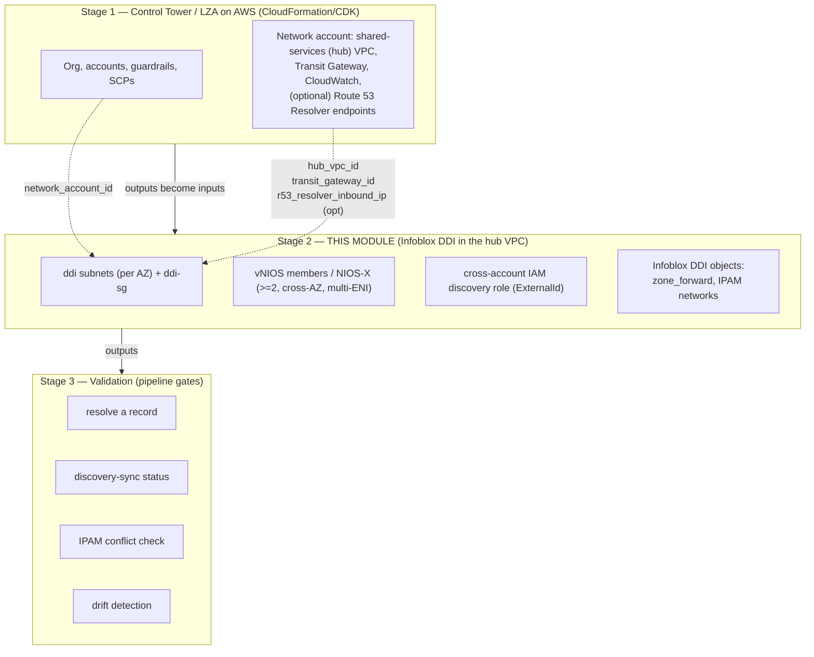

# Automating Infoblox DDI on an AWS Landing Zone — Implementation Guide

> **Layer:** Stage 2 (shared-services-hub DDI extension) on top of AWS Control
> Tower / the Landing Zone Accelerator on AWS. **Posture:** GCC-Moderate on the
> **commercial AWS partition (`.com`)**, not AWS GovCloud (`us-gov-*`). **Status:**
> the IaC referenced here is a **coherent starter skeleton** — structurally correct
> and guardrail-bearing, *not* a certified production module. Pin your own
> versions, subscribe to the Marketplace listing and supply your own AMI and
> instance type, and test in a sandbox account first.
>
> This guide is the **automation layer** above the deploy-oriented runbook in
> [`../02-aws.md`](../02-aws.md). It references that runbook for click/CLI
> mechanics rather than repeating them. Every variable name, port, IAM scope, and
> boundary rule here conforms to [`_module-contract.md`](./_module-contract.md).

---

## 1. Overview & scope

AWS ships a competent set of native name and address primitives — **Route 53**
(public DNS), **Route 53 Resolver** (the `.2` VPC resolver plus inbound/outbound
endpoints), **Route 53 private hosted zones**, VPC **DHCP option sets**, and
**Amazon VPC IPAM** — but they are deliberately per-service rather than a unified
DDI platform. The gaps show up at enterprise scale and at the edge of AWS: private
hosted zones don't federate cleanly across hundreds of accounts, resolver rules
must be authored and shared (AWS RAM) per VPC, there is no single authoritative
record of every CIDR across every cloud plus on-prem, and DHCP option sets can't
express reservations or option policies. The moment the landing zone spans
**multiple accounts under Organizations/Control Tower, plus other clouds, plus
on-prem**, you need one authoritative IPAM and one consistent, secure resolution
fabric across all of it.

This guide describes how to add **Infoblox DDI** to that hub as an
*automation-grade*, IaC-driven, drift-resistant component — the missing seam
between two vendor toolchains that each ignore the other:

- **AWS** ships Control Tower and the Landing Zone Accelerator on AWS — they build
  the org + guardrails + the Network-account hub VPC and Transit Gateway, but know
  nothing about Infoblox.
- **Infoblox** ships the official `infobloxopen/infoblox` Terraform provider and a
  vNIOS-on-AWS deployment path — they manage Infoblox but know nothing about the
  Landing Zone Accelerator.

**Scope discipline (unchanged from the volume).** Infoblox does **not** build the
landing zone — no organization, accounts, guardrails, or compute platform. Those
are Stage 1. This module owns exactly one thing: the **DDI + DNS-security layer
inside the Network-account shared-services (hub) VPC**, consuming Stage-1 outputs
as inputs.

**What this guide adds beyond the deploy runbook.** The runbook (`02-aws.md`) tells
you how to launch a vNIOS AMI into a hub and wire up Route 53 Resolver. This guide
tells you how to make that *repeatable, reviewable, and gated*: a parameterized
module, a `deployment_model` switch with a compliance-boundary guard, a
least-privilege cross-account discovery role expressed as code, a multi-stage
GitOps pipeline with OIDC auth, drift detection, self-service IPAM, and an explicit
FedRAMP-Moderate control mapping.

---

## 2. Reference architecture & the layered model

Infoblox members sit in the **Network/connectivity account's shared-services VPC**,
spread across at least two Availability Zones, behind the **Transit Gateway** that
all spokes attach to. The control plane is either an on-prem/in-cloud **Grid
Master** (vNIOS) or the **Infoblox Portal** SaaS (Universal DDI). Workload VPCs
resolve against the hub members, which own recursion, RPZ/threat feeds, and
conditional forwarding.


Three stages. This module is **Stage 2** and never reaches up into Stage 1's remit.



**Stage 1 → Stage 2 handoff (the contract's layering model).** The Accelerator's
network deployment emits network facts; this module consumes them via **remote
state**, **SSM parameters**, or plain variables, never by re-creating them:

| Stage-1 output | Stage-2 input variable | Used for |
|---|---|---|
| `network_account_id` | `network_account_id` | tag/assert the target account |
| `hub_vpc_id` | `hub_vpc_id` | DDI subnets are added *into* this VPC |
| `transit_gateway_id` | `transit_gateway_id` | DDI subnets route spoke/on-prem CIDRs here |
| `r53_resolver_inbound_ip` (optional) | `r53_resolver_inbound_ip` | conditional-forward target |
| `dns_query_log_group_arn` (optional) | (audit reference) | DNS query logging / audit (AU-*) |

**Stage 2 → Stage 3 handoff.** This module's canonical outputs — `ddi_anycast_vip`,
`dns_server_ips`, `grid_master_ip` (grid only), `discovery_identity_id`,
`ddi_subnet_ids` — are what the validation stage asserts against.

---

## 3. Choosing the control-plane model

The single most consequential decision is the `deployment_model` variable, because
it determines **where the control plane physically lives relative to your ATO
boundary**.

| | `deployment_model = "grid"` (default) | `deployment_model = "universal_ddi"` |
|---|---|---|
| **Control plane** | vNIOS **Grid**, self-operated inside your account | Infoblox **Portal / CSP** (SaaS), operated by Infoblox |
| **Location vs. ATO boundary** | **Inside** the boundary | **Outside** the boundary |
| **Data-plane members** | vNIOS DNS members | NIOS-X servers |
| **Outbound dependency** | Grid VPN `1194/udp` + `2114/tcp` between members/GM | **Outbound `443` to `csp.infoblox.com`** for Portal sync |
| **GCC-Moderate fit** | **Boundary-clean. Recommended default.** | SaaS control plane outside boundary — **requires authorization review** |
| **Code guard** | none | hard-fails unless `acknowledge_saas_boundary = true` |
| **Best for** | Enterprises extending an existing on-prem Grid; sovereign/air-gap-leaning estates | Greenfield multi-cloud teams who don't want to operate Grid Masters |

**The GCC-Moderate boundary rule (enforced in code).** Because Universal DDI's
control plane is SaaS *outside* the authorization boundary, the module refuses to
plan the `universal_ddi` path unless the operator explicitly sets
`acknowledge_saas_boundary = true`. The default (`false`) triggers a Terraform
`precondition` hard-fail whose message points to the FedRAMP/authorization review.
Grid needs no such gate — its control plane stays in-boundary. This is a deliberate
"secure by default, opt-in to the SaaS boundary" design.

For most GCC-Moderate landing zones the answer is **Grid**: one authoritative
database across on-prem + AWS, no SaaS egress in the boundary. Reach for Universal
DDI only when you've run the boundary/authorization review and accept the
outbound-443 dependency. Both models use the same AWS-side integrations
(cross-account discovery role, Route 53 Resolver wiring).

---

## 4. Mapping the 11-section skeleton to automation artifacts

The volume's chapter convention has 11 sections. Here is what each becomes as a
concrete automation artifact in this package.

| # | Chapter section | Automation artifact(s) |
|---|---|---|
| 1 | **Overview / where DDI fits** | This guide §1; `README.md`; the layering diagram. No resources — framing. |
| 2 | **Reference architecture** | `terraform/main.tf` topology (subnets + members in hub) + the figures in `figs/`. |
| 3 | **Product options** | `deployment_model` variable (`grid` \| `universal_ddi`) + `vnios_ami_id` / `vnios_instance_type`; branch logic in `grid.tf` / `universal_ddi.tf`. |
| 4 | **Prerequisites** | `terraform/main.tf` (subnets + route table), `securitygroups.tf` (`ddi-sg` port rules), `variables.tf` validation, secret refs; see §5. |
| 5 | **Deployment** | `terraform/grid.tf` (members, multi-ENI, AZs, encrypted EBS) / `universal_ddi.tf`; `pipelines/` Stage-2 apply. |
| 6 | **Cloud discovery adapter** | `terraform/discovery.tf` — cross-account IAM role + least-priv policy + ExternalId trust; vDiscovery handoff; see §5. |
| 7 | **Native-DNS integration** | `terraform/dns.tf` — `infoblox_zone_forward` to the Route 53 Resolver inbound endpoint; spoke DHCP option sets; see §9. |
| 8 | **IPAM automation** | `terraform/dns.tf` (+ IPAM notes) — `infoblox_network_view`, `infoblox_ipv4_network`; VPC IPAM coexistence; §10 self-service. |
| 9 | **HA / sizing** | `member_count`, `availability_zones`, `vnios_instance_type` variables; cross-AZ placement + source/dest-check for anycast in `grid.tf`. |
| 10 | **Security / compliance** | `ddi-sg` default-deny, discovery least-privilege, Secrets Manager/SSM secrets, encrypted EBS, query logging → CloudWatch; §11 mapping. |
| 11 | **Validation & Day-2** | `validation/` scripts + `pipelines/` validate stage: resolve a record, discovery-sync status, conflict check, drift. |

---

## 5. Prerequisites as code

Everything the runbook lists as a manual prerequisite becomes a declarative
resource or an input variable. The pattern: **consume Stage-1 hub outputs, create
only the DDI-scoped resources, wire secrets from Secrets Manager/SSM, never invent
AMIs or instance types.**

**Consuming LZA hub outputs.** Point a `terraform_remote_state` data source (or read
SSM parameters) at the Stage-1 state to read `network_account_id`, `hub_vpc_id`,
`transit_gateway_id`, and the Route 53 Resolver inbound IP. These are the *only* way
Stage 2 learns about the hub — it does not query or mutate Stage-1-owned resources.

**DDI subnets.** The module creates one dedicated subnet **per AZ** in the hub VPC
(`ddi-subnet-<azcode>`), plus a route table sending spoke/on-prem CIDRs to the
Transit Gateway. It does **not** create the hub VPC's TGW attachment or the Route 53
Resolver endpoint subnets — those are Stage-1/existing; the module only *references*
the inbound endpoint IP for conditional forwarding.

**Security-Group ports (the contract's port table).** The module attaches `ddi-sg`
to the member ENIs with **default-deny ingress *and* egress** (AWS's implicit
allow-all egress is replaced by the managed egress set) plus exactly these rules —
sources scoped to explicit CIDR variables, never `0.0.0.0/0`:

| Service | Port | Proto | Direction | When |
|---|---|---|---|---|
| DNS | 53 | tcp+udp | ingress from spokes/on-prem | always |
| DHCP | 67–68 | udp | ingress | only if module serves DHCP (off by default) |
| Grid VPN | 1194 | udp | in/out to Grid members/GM | `deployment_model = grid` |
| Grid comms | 2114 | tcp | in/out | `deployment_model = grid` |
| NTP | 123 | udp | egress | always |
| HTTPS mgmt | 443 | tcp | ingress (mgmt CIDR) | always |
| Portal sync | 443 | tcp | **egress to Infoblox Portal** | `deployment_model = universal_ddi` only |
| SNMP | 161 | udp | ingress (monitoring CIDR) | optional |
| SSH | 22 | tcp | ingress (mgmt CIDR) | optional (prefer SSM Session Manager) |

The Grid rows and the egress-Portal row are toggled by `deployment_model`, so a
Grid deployment never opens the SaaS egress and a Universal DDI deployment never
opens the Grid VPN.

**Least-privilege discovery identity.** The discovery credential is a
**cross-account IAM role** (`ddi-disco-role`) assumed by the Infoblox integration
account with an **`ExternalId`** condition, carrying a *custom* least-privilege
policy — never the broad AWS-managed read-only policies:

| Capability | Actions | When |
|---|---|---|
| VPC/subnet/instance discovery | `ec2:DescribeVpcs/Subnets/Instances/NetworkInterfaces/AvailabilityZones/Regions` | always |
| Tags | `ec2:DescribeTags` | always |
| Route 53 read | `route53:ListHostedZones/ListResourceRecordSets/GetHostedZone` | only if `enable_record_read` |

No `*:*`, **zero data-plane access** (no `s3:GetObject`). The role is created in the
account the module runs in; **replicate it** to each discovered account (StackSets /
per-account apply) with the same trust + ExternalId.

**Secrets.** The admin password, Grid shared secret / join token, and temp license
are referenced from **AWS Secrets Manager** or **SSM Parameter Store** (chosen by
`secrets_store_type`) — never hard-coded and never emitted as plaintext outputs. The
pipeline reads them at apply time (§8).

---

## 6. Terraform path

`terraform/` is the primary artifact: a `hashicorp/aws` + `infobloxopen/infoblox`
module driven by the contract's canonical variables.

**File layout (illustrative-but-coherent skeleton):** `versions.tf` (provider
pins), `variables.tf` (every canonical variable with `validation`), `main.tf`
(locals, tags, DDI subnets + route table, boundary guard, secret reads),
`securitygroups.tf` (`ddi-sg` + rules), `grid.tf` (vNIOS members, multi-ENI),
`universal_ddi.tf` (NIOS-X + Portal handoff), `discovery.tf` (cross-account IAM
role), `dns.tf` (conditional forwarders + spoke DHCP option sets), `outputs.tf`.

**Provider pins (`versions.tf`).** Pin both providers explicitly — do not float. Use
a current `aws` (5.x line) and the current `infobloxopen/infoblox` (2.x line, e.g.
`~> 2.13`). Treat exact versions as **operator-supplied**.

```hcl
terraform {
  required_providers {
    aws      = { source = "hashicorp/aws",            version = "~> 5.0"  }
    infoblox = { source = "infobloxopen/infoblox",    version = "~> 2.13" }
  }
}
```

**The SaaS guard, in code.** A `precondition` on `terraform_data.boundary_guard` in
`main.tf` hard-fails `universal_ddi` unless `acknowledge_saas_boundary = true`,
evaluated at **plan** time.

**Where the Infoblox provider manages DDI objects.** AWS resources (`aws`) build the
plumbing — subnets, SG, EC2 members, IAM. The **`infoblox` provider** manages the
DDI *objects* inside NIOS: `infoblox_zone_forward` (conditional forwarders to the
Route 53 Resolver inbound endpoint, §9) and `infoblox_network_view` /
`infoblox_ipv4_network` (IPAM). This split matters: the provider needs a reachable
Grid/NIOS WAPI endpoint, so DDI-object resources typically apply in a **second
phase** (or a dependent module) after the members are up and the Grid is joined —
`depends_on` and staged targets keep the ordering honest.

**Do not invent AMIs.** `vnios_ami_id` and `vnios_instance_type` have no defaults —
subscribe to the Infoblox NIOS Marketplace listing, then discover the AMI with
`aws ec2 describe-images` (AMIs are region-specific).

---

## 7. Multi-account discovery & the cross-account role

Infoblox discovers AWS via **vDiscovery** driven by **Cloud Network Automation**
(license on the Grid Master). The credential is an **IAM role**. For
**Organizations/Control Tower**, create a **least-privilege role in each member
account** with a **cross-account trust** back to the Infoblox integration account —
**always with an `ExternalId` condition** to prevent confused-deputy attacks. From
NIOS 9.0.4+, a single vDiscovery job can span **multiple accounts of an AWS
Organization across one or many regions**.

`discovery.tf` creates the role, its custom policy, and the ExternalId-gated trust
in the account the module runs in, and records the intended scope in
`discovered_account_ids`. Because a Terraform apply targets one account, the role is
**replicated** to the other discovered accounts via CloudFormation **StackSets** or
a per-account apply — the guide marks this seam explicitly. The Infoblox-side
vDiscovery job (there is no first-class provider resource) is an API/UI handoff,
sketched in `discovery.tf`.

---

## 8. Pipeline & GitOps

`pipelines/` provides a **GitHub Actions** workflow and an **AWS CodePipeline**
design note, both following the same three-stage shape and auth model.

**Stages:** (1) **LZA (Stage 1)** — read-only handoff of Stage-1 outputs
(referenced, not owned); (2) **DDI (Stage 2)** — `terraform init/plan/apply` of this
module, `plan` as a PR gate, `apply` on merge/dispatch; (3) **Validate (Stage 3)** —
runs the `validation/` checks and fails the pipeline on any red gate.

**OIDC federated auth to AWS (commercial `.com`).** Do **not** store long-lived
access keys. Configure an **IAM OIDC provider** trusting the pipeline's issuer and a
role whose trust scopes the `sub` claim to the repo/branch/environment; the runner
exchanges its OIDC token for temporary credentials
(`AssumeRoleWithWebIdentity`) against `sts.amazonaws.com` — the commercial
partition. GitHub Actions uses `aws-actions/configure-aws-credentials` with
`role-to-assume`; CodePipeline uses a CodeBuild service role that assumes a role in
the Network account.

**Remote state + secrets.** Terraform state lives in an **S3 bucket** (SSE-KMS,
versioned) with a **DynamoDB** lock table; Grid/admin secrets and the discovery
ExternalId live in **Secrets Manager** and are fetched at apply time by the same
role — never printed, never committed. The `.com` endpoints
(`sts.amazonaws.com`, `s3.amazonaws.com`) match the GCC-Moderate-on-commercial
boundary; nothing here touches `us-gov-*`.

**GitOps loop.** Git is the desired-state source of record. PRs run `plan`; merges
run `apply`; scheduled runs re-plan to surface **drift** (§10).

---

## 9. DNS integration

The DNS wiring is the reason Infoblox sits in the hub at all. Two
conditional-forwarding paths meet at the Route 53 Resolver, giving split-horizon
resolution without either side becoming authoritative for the other. This is
implemented in `terraform/dns.tf`.

**Infoblox → AWS (inbound path).** On the Infoblox members, create **conditional
forwarders** for AWS-service and private-zone namespaces — `amazonaws.com`,
`<region>.compute.internal`, and any Route 53 private-hosted-zone domains —
targeting the **Route 53 Resolver inbound endpoint IP**. In code this is
`infoblox_zone_forward`, one per domain in `aws_service_forward_domains`, pointing
`forward_to.address` at `r53_resolver_inbound_ip`. This lets on-prem and other-cloud
clients resolve AWS names through the Infoblox fabric.

**AWS → Infoblox (outbound path).** Spoke VPC **DHCP option sets**
`domain-name-servers` are set to the DDI **anycast VIP** (`ddi_anycast_vip`, or the
`dns_server_ips` list) so AWS workloads resolve corporate/on-prem names through
Infoblox. The module writes the option set **only** when `spoke_vpc_ids` is provided
*and* `enable_spoke_dns_write = true` — otherwise it emits the VIP as an output and
leaves the write to the platform team.

**Reverse direction (outbound endpoint + rules).** A Route 53 Resolver **outbound**
endpoint plus forwarding **rules** (one per enterprise domain, e.g. `corp.example`)
target the Infoblox member IPs on port 53, shared across accounts via **AWS RAM**.
The runbook shows the CLI for this; **not every deployment automates it** (some
platform teams own the resolver), so the module documents it and optionally manages
it, rather than assuming ownership.

Net effect: spoke instance → Infoblox member → answered locally (corp/on-prem) or
conditionally forwarded to the resolver inbound endpoint
(`amazonaws.com`/`compute.internal`/private zones) → Route 53. One VIP for clients,
one authoritative fabric, Threat Defense inline on every spoke's egress DNS.

---

## 10. Validation & Day-2

`validation/` holds Day-0/Day-2 scripts; the Stage-3 pipeline job runs them as
**gates** — a red check blocks promotion.

**Pipeline gates:** (1) **Resolve a record** — the DDI VIP must answer an enterprise
A record, and an AWS-service/forwarded name must resolve to a private IP via the
resolver inbound path. (2) **Discovery-sync status** — assert the vDiscovery run
completed and AWS VPCs/subnets + tags appear in Infoblox IPAM as networks and
extensible attributes (EAs). (3) **IPAM conflict check** — assert no overlapping
CIDRs / duplicate allocations between discovered AWS reality and Infoblox IPAM.

**Drift detection via GitOps.** A scheduled pipeline re-runs `terraform plan` (and
re-reads Grid object state); any non-empty plan is drift — a subnet created directly
in AWS, an SG rule changed by hand, a forwarder edited in the Grid UI — and raises
an alert/PR to reconcile.

**Self-service IPAM in provisioning pipelines.** Because discovery imports AWS tags
as EAs, application/landing-zone provisioning pipelines can call Infoblox to **carve
the next free subnet** from the correct network container keyed on
`environment`/`owner`/`costcenter`, then feed that CIDR into the workload's own IaC.
IPAM becomes an API the platform consumes, not a spreadsheet — and every allocation
is recorded, tagged, and conflict-checked centrally.

**VPC IPAM coexistence.** In the **visibility** model Infoblox discovers VPC CIDRs
and stays authoritative IPAM while AWS allocates in-VPC. In the newer
**authoritative** model (the 2025 *Amazon VPC IPAM ↔ Infoblox* integration), you
designate Infoblox as the management authority for a VPC IPAM **private scope** and,
via **BYOIP**, pull non-overlapping CIDRs from Infoblox Universal IPAM into the AWS
IPAM top-level pool. Private scopes only.

**Other Day-2 items:** re-run/schedule discovery as accounts are added under Control
Tower; patch NIOS/NIOS-X on the vendor cadence (upgrade the on-prem GM before AWS
members in a Grid); monitor member health/query rates via SNMP (161/udp) and
CloudWatch; keep threat feeds current; periodically re-audit the discovery IAM
policy against any newly required read actions.

---

## 11. GCC-Moderate / FedRAMP-Moderate control mapping

This maps the DDI layer's artifacts to relevant **FedRAMP Moderate** control
families. It is a *mapping aid for an authorization package*, not a certification —
the IaC is a starter skeleton, and control satisfaction depends on your full
environment and assessor.

| Control family | How the DDI layer contributes | Artifact |
|---|---|---|
| **AC-3 / AC-6** (access enforcement, least privilege) | Discovery role limited to `ec2:Describe*` + tags (route53 read opt-in); ExternalId-gated cross-account trust; no `*:*`, zero data-plane. SG sources scoped to explicit CIDRs. | `discovery.tf`; `securitygroups.tf` |
| **SC-7** (boundary protection) | Dedicated DDI subnets with a default-deny `ddi-sg` (ingress *and* egress managed); only the contract's ports open, sources CIDR-scoped, never `0.0.0.0/0`; Grid vs. SaaS egress toggled by `deployment_model`. | `securitygroups.tf`; `main.tf` |
| **SC-8 / SC-13 / SC-28** (transmission + at-rest crypto) | Grid comms inside the `1194/udp` VPN tunnel; management over HTTPS `443`; secrets in **Secrets Manager/SSM** (never in state); **EBS encryption** (KMS) on root + data volumes; OIDC (no stored keys) for CI. | `securitygroups.tf`; `grid.tf`; `pipelines/` |
| **SC-20 / SC-21 / SC-22** (secure name resolution) | Infoblox authoritative fabric + conditional forwarders to the Route 53 Resolver; split-horizon integrity; Threat Defense (RPZ, threat feeds) inline on hub members; HA resolvers via anycast. | `dns.tf`; §9 |
| **AU-2 / AU-6 / AU-12** (audit events, review, generation) | Route 53 query logging + Infoblox syslog/audit forwarded to **CloudWatch** / a SIEM. | query logging → `dns_query_log_group_arn` |
| **CM-2 / CM-3 / CM-6** (baseline, change control, config settings) | Entire DDI layer is IaC in Git; PRs gate `plan`; scheduled drift detection reconciles unauthorized change back to baseline. | `terraform/`, `pipelines/`, §10 |
| **CP-9 / CP-10** (backup, recovery) | Grid Master (on-prem or a GM/GMC pair) provides Grid DB backup/restore; ≥2 members cross-AZ; anycast failover; Universal DDI scales by adding NIOS-X behind the service. | `member_count`, `availability_zones`; §3 |

**Universal DDI SaaS boundary caveat (explicit).** When `deployment_model =
"universal_ddi"`, the Infoblox Portal control plane sits **outside** the ATO
boundary and requires outbound `443` to `csp.infoblox.com`. This is a
**boundary-crossing SaaS dependency** that must be covered by an authorization
review (data-flow, third-party service, and SA-9 external-services considerations)
before use. The module enforces the pause: the plan hard-fails unless
`acknowledge_saas_boundary = true`. For a boundary-clean GCC-Moderate posture,
**Grid is the default and recommended path**.

---

## Sources

- [Landing Zone Accelerator on AWS (GitHub)](https://github.com/awslabs/landing-zone-accelerator-on-aws)
- [Infoblox — terraform-provider-infoblox (GitHub)](https://github.com/infobloxopen/terraform-provider-infoblox)
- [Terraform Registry — hashicorp/aws provider docs](https://registry.terraform.io/providers/hashicorp/aws/latest/docs)
- [Terraform Registry — infobloxopen/infoblox provider docs](https://registry.terraform.io/providers/infobloxopen/infoblox/latest/docs)
- [AWS — Amazon VPC User Guide](https://docs.aws.amazon.com/vpc/latest/ipam/integrate-infoblox-ipam.html)
- [AWS — Route 53 Resolver (Developer Guide)](https://docs.aws.amazon.com/Route53/latest/DeveloperGuide/resolver-forwarding-outbound-queries.html)
- [Infoblox — Firewall Requirements for Infoblox Cloud Services (NIOS-X / 443)](https://docs.infoblox.com/space/BloxOneInfrastructure/873660456/Firewall+Requirements+for+Infoblox+Cloud+Services)
- Deploy chapter (click/CLI mechanics): [`../02-aws.md`](../02-aws.md)
