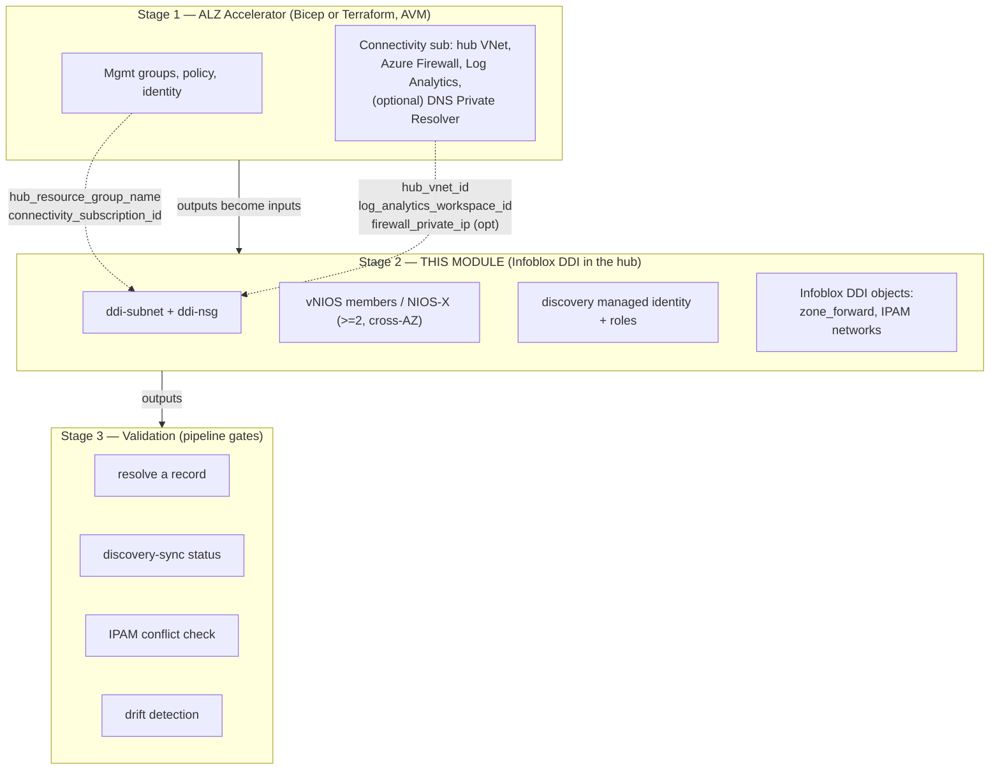

# Automating Infoblox DDI on an Azure Landing Zone — Implementation Guide

> **Layer:** Stage 2 (Connectivity-hub DDI extension) on top of Microsoft's ALZ
> Accelerator. **Posture:** GCC-Moderate on **commercial Azure (`.com`)**, not Azure
> Government (`.us`). **Status:** the IaC referenced here is a **coherent starter
> skeleton** — structurally correct and guardrail-bearing, *not* a certified production
> module. Pin your own versions, supply your own Marketplace image and VM SKU, and test in
> a sandbox ALZ first.
>
> This guide is the **automation layer** above the deploy-oriented runbook in
> [`../01-azure.md`](../01-azure.md). It references that runbook for click-by-click
> mechanics rather than repeating them. Every variable name, port, IAM scope, and boundary
> rule here conforms to [`_module-contract.md`](./_module-contract.md).

---

## 1. Overview & scope

Microsoft's **Azure Landing Zone (ALZ) Accelerator** builds the *governed platform*:
management-group hierarchy, policy, identity, and — in the connectivity subscription — a
hub-and-spoke network with Azure Firewall, gateways, and (optionally) an Azure DNS Private
Resolver. What it does **not** build is a DDI layer. As the runbook explains, Azure ships a
usable-but-partial DDI baseline: Azure Private DNS zones do not conditionally forward on
their own, do not natively answer queries arriving *from* on-premises, and there is no
first-class IPAM. Those gaps become operationally painful the moment a landing zone spans
many subscriptions, a hybrid link, and a second cloud.

This guide describes how to add **Infoblox DDI** to that hub as an *automation-grade*,
IaC-driven, drift-resistant component — the missing seam between two vendor toolchains that
each ignore the other:

- **Microsoft** ships the ALZ Bicep/Terraform Accelerators and Azure Verified Modules (AVM)
  — they build the platform + hub but know nothing about Infoblox.
- **Infoblox** ships the official `infobloxopen/infoblox` Terraform provider and a
  vNIOS-on-Azure deployment path — they manage Infoblox but know nothing about the ALZ
  Accelerator.

**Scope discipline (unchanged from the volume).** Infoblox does **not** build the landing
zone — no management groups, no identity, no governance, no compute platform. Those are
Stage 1. This module owns exactly one thing: the **DDI + DNS-security layer inside the
Connectivity hub**, consuming Stage-1 outputs as inputs.

**What this guide adds beyond the deploy runbook.** The runbook (`01-azure.md`) tells you
how to click a vNIOS member into a hub and wire up a Private Resolver. This guide tells you
how to make that *repeatable, reviewable, and gated*: a parameterized module, a
`deployment_model` switch with a compliance-boundary guard, a least-privilege discovery
identity expressed as code, a multi-stage GitOps pipeline with OIDC auth, drift detection,
self-service IPAM, and an explicit FedRAMP-Moderate control mapping.

---

## 2. The layered model

Three stages. This module is **Stage 2** and never reaches up into Stage 1's remit.



**Stage 1 → Stage 2 handoff (the contract's layering model).** The Accelerator's connectivity
deployment emits network facts; this module consumes them via **remote state** or **module
outputs**, never by re-creating them:

| Stage-1 output | Stage-2 input variable | Used for |
|---|---|---|
| `hub_resource_group_name` | `hub_resource_group_name` | where to place the DDI subnet/NSG |
| `hub_vnet_id` | `hub_vnet_id` | subnet is added *into* this VNet |
| `connectivity_subscription_id` | (provider `subscription_id`) | target subscription |
| `log_analytics_workspace_id` | (diagnostic settings target) | DNS query logging / audit (AU-*) |
| `firewall_private_ip` (optional) | (route/forwarding reference) | egress path awareness |

**Stage 2 → Stage 3 handoff.** This module's canonical outputs — `ddi_anycast_vip`,
`dns_server_ips`, `grid_master_ip` (grid only), `discovery_identity_id`, `ddi_subnet_id` —
are what the validation stage asserts against.

---

## 3. Choosing the control-plane model

The single most consequential decision is the `deployment_model` variable, because it
determines **where the control plane physically lives relative to your ATO boundary**.

| | `deployment_model = "grid"` (default) | `deployment_model = "universal_ddi"` |
|---|---|---|
| **Control plane** | vNIOS **Grid**, self-operated inside your tenant | Infoblox **Portal / CSP** (SaaS), operated by Infoblox |
| **Location vs. ATO boundary** | **Inside** the boundary | **Outside** the boundary |
| **Data-plane members** | vNIOS DNS members | NIOS-X servers |
| **Outbound dependency** | Grid VPN `1194/udp` + `2114/tcp` between members/GM | **Outbound `443` to `csp.infoblox.com`** for Portal sync |
| **GCC-Moderate fit** | **Boundary-clean. Recommended default.** | SaaS control plane outside boundary — **requires authorization review** |
| **Code guard** | none | hard-fails unless `acknowledge_saas_boundary = true` |
| **Best for** | Enterprises extending an existing on-prem Grid; sovereign/air-gap-leaning estates | Greenfield multi-cloud teams who don't want to operate Grid Masters |

**The GCC-Moderate boundary rule (enforced in code).** Because Universal DDI's control plane
is SaaS *outside* the authorization boundary, the module refuses to plan the `universal_ddi`
path unless the operator explicitly sets `acknowledge_saas_boundary = true`. The default
(`false`) triggers a Terraform `precondition`/`validation` hard-fail whose message points to
the FedRAMP/authorization review. Grid needs no such gate — its control plane stays
in-boundary. This is a deliberate "secure by default, opt-in to the SaaS boundary" design.

For most GCC-Moderate landing zones the answer is **Grid**: one authoritative database across
on-prem + Azure, no SaaS egress in the boundary. Reach for Universal DDI only when you've run
the boundary/authorization review and accept the outbound-443 dependency.

---

## 4. Mapping the 11-section skeleton to automation artifacts

The volume's chapter convention has 11 sections. Here is what each becomes as a concrete
automation artifact in this package.

| # | Chapter section | Automation artifact(s) |
|---|---|---|
| 1 | **Overview / where DDI fits** | This guide §1–2; `README.md`; the layering diagram. No resources — framing. |
| 2 | **Reference architecture** | `terraform/main.tf` topology (subnet + members in hub) / `bicep/main.bicep`; the mermaid diagram in §2. |
| 3 | **Product options** | `deployment_model` variable (`grid` \| `universal_ddi`) + `vnios_image` object; branch logic in `main.tf`. |
| 4 | **Prerequisites** | `terraform/network.tf` (subnet + `ddi-nsg` port rules), `variables.tf` validation, Key Vault refs; see §5. |
| 5 | **Deployment** | `terraform/main.tf` (members, disks, zones, accelerated networking) / `bicep/main.bicep`; `pipelines/` Stage-2 apply. |
| 6 | **Cloud discovery adapter** | `terraform/discovery.tf` — managed identity + `Reader` role assignments; discovery config; see §5. |
| 7 | **Native-DNS integration** | `terraform/dns.tf` — `infoblox_zone_forward` to the Private Resolver inbound endpoint; spoke `dns_servers`; see §9. |
| 8 | **IPAM automation** | `terraform/dns.tf`/`ipam.tf` — `infoblox_network_view`, `infoblox_ipv4_network`; discovery-driven EAs; §10 self-service. |
| 9 | **HA / sizing** | `member_count`, `availability_zones`, `vnios_vm_sku` variables; cross-AZ placement in `main.tf`. |
| 10 | **Security / compliance** | `ddi-nsg` default-deny, discovery least-privilege, Key Vault secrets, diagnostic settings → Log Analytics; §11 mapping. |
| 11 | **Validation & Day-2** | `validation/` scripts + `pipelines/` validate stage: resolve a record, discovery-sync status, conflict check, drift. |

---

## 5. Prerequisites as code

Everything the runbook lists as a manual prerequisite becomes a declarative resource or an
input variable. The pattern: **consume Stage-1 hub outputs, create only the DDI-scoped
resources, wire secrets from Key Vault, never invent CIDRs or SKUs.**

**Consuming ALZ hub outputs.** Point a `terraform_remote_state` data source (or pass module
outputs) at the Stage-1 state to read `hub_resource_group_name`, `hub_vnet_id`,
`connectivity_subscription_id`, and `log_analytics_workspace_id`. These are the *only* way
Stage 2 learns about the hub — it does not query or mutate Stage-1-owned resources.

**DDI subnet.** The module creates one dedicated subnet in the hub VNet at
`ddi_subnet_address_prefix` (named `ddi-subnet`). It does **not** carve the Private Resolver
`/28` inbound/outbound subnets — those are Stage-1/existing per the runbook; the module only
*references* the inbound endpoint IP for conditional forwarding.

**NSG ports (the contract's port table).** The module attaches `ddi-nsg` to `ddi-subnet` with
**default-deny** plus exactly these rules — sources scoped to explicit CIDR variables, never
`0.0.0.0/0`:

| Service | Port | Proto | Direction | When |
|---|---|---|---|---|
| DNS | 53 | tcp+udp | inbound from spokes/on-prem | always |
| DHCP | 67–68 | udp | inbound | only if module serves DHCP (off by default; Azure DHCP is platform-managed) |
| Grid VPN | 1194 | udp | in/out to Grid members/GM | `deployment_model = grid` |
| Grid comms | 2114 | tcp | in/out | `deployment_model = grid` |
| NTP | 123 | udp | outbound | always |
| HTTPS mgmt | 443 | tcp | inbound (mgmt CIDR) | always |
| Portal sync | 443 | tcp | **outbound to Infoblox Portal** | `deployment_model = universal_ddi` only |
| SNMP | 161 | udp | inbound (monitoring CIDR) | optional |

The Grid rows and the outbound-Portal row are toggled by `deployment_model`, so a Grid
deployment never opens the SaaS egress and a Universal DDI deployment never opens the Grid
VPN.

**Least-privilege discovery identity.** Prefer a **user-assigned managed identity**
(`discovery_identity_type = "user_assigned_mi"`, resource `ddi-disco-mi`); fall back to an
app-registration service principal only where a managed identity can't carry the credential
Infoblox consumes. Role assignments are scoped to the subscriptions/RGs actually discovered:

| Role | Scope | Why |
|---|---|---|
| `Reader` | discovered subscription(s) | enumerate VNets, subnets, NICs, tags for IPAM sync |
| `Private DNS Zone Contributor` | RG(s) holding private zones | **only if** Infoblox writes records into Azure Private DNS |
| `Network Contributor` | spoke VNet(s) | **only if** the module writes `dns_servers` on spokes |

No `Owner`. No `Contributor` at subscription scope. The record-write and spoke-write roles are
opt-in, granted only when the corresponding feature is enabled.

**Key Vault secrets.** The admin password, Grid join token / shared secret, and any discovery
credential are referenced from an existing Key Vault (`key_vault_id`) — never hard-coded and
never emitted as plaintext outputs. The pipeline reads them at apply time (§8).

---

## 6. Terraform path

`terraform/` is the primary artifact: an `azurerm` + `infobloxopen/infoblox` module driven by
the contract's canonical variables.

**File layout (illustrative-but-coherent skeleton):**

- `versions.tf` — provider pins (see below).
- `variables.tf` — every canonical variable from the contract, each documented, with
  `validation` blocks (e.g. the `acknowledge_saas_boundary` guard).
- `network.tf` — `ddi-subnet` + `ddi-nsg` with the port rules from §5.
- `main.tf` — the vNIOS/NIOS-X members: `member_count`, cross-AZ placement over
  `availability_zones`, `vnios_vm_sku`, `vnios_image`, Premium LRS disks, accelerated
  networking. `deployment_model` branches Grid vs. Universal DDI wiring.
- `discovery.tf` — `ddi-disco-mi` managed identity + the least-privilege role assignments.
- `dns.tf` — the Infoblox provider objects: conditional forwarders and IPAM (see §9).
- `outputs.tf` — the canonical outputs (`ddi_anycast_vip`, `dns_server_ips`,
  `grid_master_ip`, `discovery_identity_id`, `ddi_subnet_id`).

**Provider pins (`versions.tf`).** Pin both providers explicitly — do not float. Use a
current `azurerm` (4.x line) and the current `infobloxopen/infoblox` (2.x line, e.g. `~>
2.13`). Treat the exact versions as **operator-supplied**; the skeleton pins conservatively
and you re-pin to what you've tested:

```hcl
terraform {
  required_providers {
    azurerm  = { source = "hashicorp/azurerm",       version = "~> 4.0"  }
    infoblox = { source = "infobloxopen/infoblox",    version = "~> 2.13" }
  }
}
```

**Key variables** are exactly the contract's set — `name_prefix`, `location`, `environment`,
`deployment_model`, `acknowledge_saas_boundary`, `compliance_profile`,
`hub_resource_group_name`, `hub_vnet_id`, `ddi_subnet_address_prefix`, `member_count`,
`availability_zones`, `vnios_vm_sku`, `vnios_image`, `key_vault_id`,
`discovery_identity_type`, `spoke_vnet_ids`, `tags`.

**The SaaS guard, in code.** In `variables.tf`:

```hcl
variable "deployment_model" {
  type    = string
  default = "grid"
  validation {
    condition     = contains(["grid", "universal_ddi"], var.deployment_model)
    error_message = "deployment_model must be 'grid' or 'universal_ddi'."
  }
}

variable "acknowledge_saas_boundary" {
  type    = bool
  default = false
}
# In main.tf, a precondition hard-fails universal_ddi unless acknowledged:
# condition = var.deployment_model != "universal_ddi" || var.acknowledge_saas_boundary
# error_message points to the FedRAMP/authorization review.
```

**Example invocation:**

```hcl
module "infoblox_ddi" {
  source = "./terraform"

  name_prefix              = "ddi"
  location                 = "eastus"
  environment              = "prod"
  deployment_model         = "grid"        # boundary-clean default
  compliance_profile       = "gcc-moderate"

  # from Stage-1 remote state
  hub_resource_group_name  = data.terraform_remote_state.alz.outputs.hub_resource_group_name
  hub_vnet_id              = data.terraform_remote_state.alz.outputs.hub_vnet_id

  ddi_subnet_address_prefix = "10.10.8.0/27"
  member_count              = 2
  availability_zones        = ["1", "2"]
  vnios_vm_sku              = "Standard_E8s_v5"   # region/NIOS-version dependent — verify
  vnios_image = {                                  # never invent versions — parameterize
    publisher = "infoblox"
    offer     = "infoblox_nios_on_azure"
    sku       = "<your-plan-sku>"
    version   = "<tested-version>"
  }
  key_vault_id  = data.terraform_remote_state.alz.outputs.key_vault_id
  spoke_vnet_ids = []   # set + grant Network Contributor to auto-write spoke dns_servers
  tags = { costcenter = "netops" }
}
```

**Plan/apply flow.** `terraform init` (with remote-state backend) → `terraform plan` (the
SaaS guard and NSG scoping are evaluated here) → review → `terraform apply`. In CI this is the
Stage-2 job (§8).

**Where the Infoblox provider manages DDI objects.** Azure resources (`azurerm`) build the
plumbing — subnet, NSG, VMs, identity. The **`infoblox` provider** manages the DDI *objects*
inside NIOS: `infoblox_zone_forward` (conditional forwarders to the Private Resolver, §9) and
`infoblox_network_view` / `infoblox_ipv4_network` (IPAM containers and networks). This split
is important: the provider needs a reachable Grid/NIOS WAPI endpoint, so DDI-object resources
typically apply in a **second phase** (or a dependent module) after the members are up and the
Grid is joined — Terraform `depends_on` and staged targets keep the ordering honest.

---

## 7. Bicep path

`bicep/` mirrors the Terraform variables as `param`s (`name_prefix`, `location`,
`deployment_model`, `acknowledgeSaasBoundary`, `ddiSubnetAddressPrefix`, `memberCount`,
`availabilityZones`, `vniosVmSku`, `vniosImage`, `keyVaultId`, etc.) and deploys the same
Azure plumbing: `ddi-subnet`, `ddi-nsg` with the §5 port rules, the members, and the
`ddi-disco-mi` identity with its role assignments. The SaaS guard is expressed as a
`param acknowledgeSaasBoundary bool` plus an `assert`/conditional that fails the deployment
when `deployment_model == 'universal_ddi'` and it isn't `true`.

**The honest limitation.** There is **no Bicep-native Infoblox resource type.** Bicep can
build all the Azure-side infrastructure, but it cannot declaratively create an
`infoblox_zone_forward` or an IPAM network the way the Terraform provider can. So the DDI-object
configuration is a **handoff**, implemented with a `Microsoft.Resources/deploymentScripts`
resource that runs *after* the members are reachable and calls out to one of:

- the **NIOS WAPI** directly (Azure CLI / `curl` REST against the Grid), or
- **Ansible** (the Infoblox `nios` collection), or
- the **Terraform `infoblox` provider** invoked from the script (Bicep builds Azure; Terraform
  finishes the DDI objects).

The `deploymentScript` pulls its Grid credentials from Key Vault (`keyVaultId`) via a
user-assigned identity, so no secret lands in the template. Mark this boundary clearly in the
Bicep README: **Bicep owns Azure plumbing; DDI-object state is an API/Ansible/Terraform-provider
handoff.** For teams that want end-to-end declarative DDI objects, the Terraform path (§6) is
the cleaner choice; Bicep is offered for shops standardized on it for the Azure layer.

---

## 8. Pipeline & GitOps

`pipelines/` provides multi-stage examples for **GitHub Actions** and **Azure DevOps**, both
following the same three-stage shape and the same auth model.

**Stages:**

1. **ALZ (Stage 1)** — the Accelerator's own bootstrap/run pipeline provisions/updates the
   platform + hub and publishes outputs to remote state. (Referenced, not owned here.)
2. **DDI (Stage 2)** — `terraform init/plan/apply` (or `az deployment` for Bicep) for this
   module, consuming Stage-1 remote state. The `plan` step is a PR gate; `apply` runs on merge
   to the environment branch.
3. **Validate (Stage 3)** — runs the `validation/` checks (§10) and fails the pipeline if a
   record won't resolve, discovery isn't syncing, or an IPAM conflict is detected.

**OIDC federated auth to Azure (commercial `.com`).** Do **not** store an Azure client secret
in the CI system. Configure a **federated credential** on a workload identity (app
registration or user-assigned MI) trusting the pipeline's OIDC issuer, and let the runner
exchange its OIDC token for an Azure access token against `login.microsoftonline.com` /
`management.azure.com`:

- **GitHub Actions:** `azure/login@v2` with `client-id`, `tenant-id`, `subscription-id` and
  `permissions: id-token: write` — no secret. The federated credential's subject is scoped to
  the repo/environment/branch.
- **Azure DevOps:** a **Workload Identity Federation** service connection — same secretless
  exchange.

**Remote state + Key Vault.** Terraform state lives in an Azure Storage account
(`*.blob.core.windows.net`) with state locking; Grid/admin secrets and the discovery
credential live in **Key Vault** and are fetched at apply time by the same workload identity —
never printed, never committed. The `.com` endpoints (`management.azure.com`,
`login.microsoftonline.com`, `*.blob.core.windows.net`) match the GCC-Moderate-on-commercial
boundary; nothing here touches `.us`.

**GitOps loop.** Git is the desired-state source of record. PRs run `plan`; merges run `apply`;
scheduled runs re-plan to surface **drift** (§10). This is what makes the DDI layer
drift-resistant rather than a one-time deploy.

---

## 9. DNS integration

The DNS wiring is the reason Infoblox sits in the hub at all. Two conditional-forwarding paths
meet at the Azure DNS Private Resolver, giving split-horizon resolution without either side
becoming authoritative for the other. This is implemented in `terraform/dns.tf`.

**Infoblox → Azure (inbound path).** On the Infoblox members, create **conditional
forwarders** for Azure-service and Private DNS namespaces — the `privatelink.*` zones (e.g.
`privatelink.blob.core.windows.net`, `privatelink.database.windows.net`) and any custom
private zones — targeting the **Private Resolver inbound endpoint IP**. In code this is
`infoblox_zone_forward`:

```hcl
resource "infoblox_zone_forward" "privatelink_blob" {
  fqdn = "privatelink.blob.core.windows.net"
  forward_to {
    name    = "azure-private-resolver-inbound"
    address = var.private_resolver_inbound_ip   # Stage-1 / existing
  }
  forwarders_only = true
}
```

This lets on-prem and other-cloud clients resolve Azure Private Endpoints through the Infoblox
fabric.

**Azure → Infoblox (outbound path).** Spoke and hub VNet `dns_servers` are set to the DDI
**anycast VIP** (`ddi_anycast_vip`, or the `dns_server_ips` list) so Azure workloads resolve
corporate/on-prem names through Infoblox. The module writes `dns_servers` on spokes **only**
when `spoke_vnet_ids` is provided *and* `Network Contributor` is granted (contract §8) —
otherwise it emits the VIP as an output and leaves the write to the platform team.

**Reverse direction (outbound ruleset).** The Azure DNS Private Resolver **outbound** endpoint
carries a forwarding ruleset whose rule for the enterprise domain (e.g. `corp.example.`) and
reverse zones targets the Infoblox member IPs on port 53. A ruleset holds up to 1,000 rules,
ample for a large privatelink footprint. The runbook shows the `az dns-resolver` CLI for this;
**not every deployment automates the outbound ruleset** (some platform teams own the resolver),
so the module documents it and optionally manages it, rather than assuming ownership.

Net effect: spoke VM → Infoblox member → answered locally (corp/on-prem) or forwarded to the
resolver inbound endpoint (`privatelink`/Azure private) → Azure Private DNS. One VIP for
clients, one authoritative fabric, Threat Defense inline on every spoke's egress DNS.

---

## 10. Validation & Day-2

`validation/` holds Day-0/Day-2 scripts; the Stage-3 pipeline job runs them as **gates** — a
red check blocks promotion.

**Pipeline gates:**

1. **Resolve a record.** From a hub/spoke context, `nslookup app.corp.example` must be answered
   by an Infoblox member, and a `privatelink.*` name must return a private IP via the resolver
   inbound path. A failure fails the stage.
2. **Discovery-sync status.** Assert that the discovery run completed and Azure VNets/subnets +
   tags appear in Infoblox IPAM as networks and extensible attributes (EAs). Stale or errored
   sync fails the gate.
3. **IPAM conflict check.** Assert no overlapping CIDRs / duplicate allocations between
   discovered Azure reality and Infoblox IPAM; surface conflicts as a reconciliation event, not
   a silent overwrite.

**Drift detection via GitOps.** A scheduled pipeline re-runs `terraform plan` (and re-reads
Grid object state); any non-empty plan is drift — a subnet created directly in Azure, an NSG
rule changed by hand, a forwarder edited in the Grid UI — and raises an alert/PR to reconcile.
Because Git is the source of record (§8), remediation is "revert to desired state," not
archaeology.

**Self-service IPAM in provisioning pipelines.** Because discovery imports Azure tags as EAs,
application/landing-zone provisioning pipelines can call Infoblox to **carve the next free
subnet** from the correct network container keyed on `environment`/`owner`/`costcenter`, then
feed that CIDR into the workload's own IaC. IPAM becomes an API the platform consumes, not a
spreadsheet — and every allocation is recorded, tagged, and conflict-checked centrally.

**Other Day-2 items (from the runbook, now pipeline-assisted):** re-run/schedule discovery and
reconcile drift; patch NIOS/NIOS-X on the vendor cadence (upgrade the on-prem GM before Azure
members in a Grid); monitor member health, query rates, Threat Defense hits, and Grid-VPN /
SaaS-sync (443) loss; review discovery-credential expiry and role assignments periodically.

---

## 11. GCC-Moderate / FedRAMP-Moderate control mapping

This maps the DDI layer's artifacts to relevant **FedRAMP Moderate** control families. It is a
*mapping aid for an authorization package*, not a certification — the IaC is a starter
skeleton, and control satisfaction depends on your full environment and assessor.

| Control family | How the DDI layer contributes | Artifact |
|---|---|---|
| **AC-3 / AC-6** (access enforcement, least privilege) | Discovery identity limited to `Reader`; record-write (`Private DNS Zone Contributor`) and spoke-write (`Network Contributor`) opt-in and scope-limited; no `Owner`/subscription `Contributor`. NSG sources scoped to explicit CIDRs. | `discovery.tf`; `ddi-nsg` |
| **SC-7** (boundary protection) | Dedicated `ddi-subnet` with default-deny `ddi-nsg`; only the contract's ports open, sources CIDR-scoped, never `0.0.0.0/0`; Grid vs. SaaS egress toggled by `deployment_model`. | `network.tf` |
| **SC-8 / SC-13** (transmission confidentiality, cryptographic protection) | Grid comms inside the `1194/udp` VPN tunnel; management over HTTPS `443`; secrets in **Key Vault** (never in state/templates); Premium LRS with platform/CMK encryption at rest; OIDC (no stored secrets) for CI. | Key Vault refs; `main.tf`; `pipelines/` |
| **SC-20 / SC-21 / SC-22** (secure name resolution) | Infoblox authoritative fabric + conditional forwarders to the Private Resolver; split-horizon integrity; Threat Defense (RPZ, threat feeds) inline on hub members; HA resolvers via anycast. | `dns.tf`; §9 |
| **AU-2 / AU-6 / AU-12** (audit events, review, generation) | DNS query logging + Infoblox syslog/audit forwarded to the Stage-1 **Log Analytics workspace** / Sentinel via diagnostic settings. | diagnostic settings → `log_analytics_workspace_id` |
| **CM-2 / CM-3 / CM-6** (baseline, change control, config settings) | Entire DDI layer is IaC in Git; PRs gate `plan`; scheduled drift detection reconciles unauthorized change back to baseline. | `terraform/`, `bicep/`, `pipelines/`, §10 |
| **CP-9 / CP-10** (backup, recovery) | Grid Master (kept on-prem or as a GM/GMC pair) provides Grid DB backup/restore; ≥2 members cross-AZ; anycast failover; Universal DDI scales by adding NIOS-X behind the service. | `member_count`, `availability_zones`; §3 |

**Universal DDI SaaS boundary caveat (explicit).** When `deployment_model = "universal_ddi"`,
the Infoblox Portal control plane sits **outside** the ATO boundary and requires outbound
`443` to `csp.infoblox.com`. This is a **boundary-crossing SaaS dependency** that must be
covered by an authorization review (data-flow, third-party service, and SA-9 external-services
considerations) before use. The module enforces the pause: the plan hard-fails unless
`acknowledge_saas_boundary = true`. For a boundary-clean GCC-Moderate posture, **Grid is the
default and recommended path**, keeping the entire control plane inside the boundary.

---

## Sources

- [Azure Landing Zones — IaC accelerator](https://azure.github.io/Azure-Landing-Zones/accelerator/)
- [Azure Landing Zones — Starter modules](https://azure.github.io/Azure-Landing-Zones/accelerator/startermodules/)
- [Azure Landing Zones Accelerators for Bicep and Terraform — GA announcement](https://techcommunity.microsoft.com/blog/azuretoolsblog/azure-landing-zones-accelerators-for-bicep-and-terraform-announcing-general-avai/4029866)
- [Release of Bicep Azure Verified Modules for Platform Landing Zone](https://techcommunity.microsoft.com/blog/azuretoolsblog/release-of-bicep-azure-verified-modules-for-platform-landing-zone/4487932)
- [AVM pattern module — ALZ connectivity hub-and-spoke VNet (Terraform Registry)](https://registry.terraform.io/modules/Azure/avm-ptn-alz-connectivity-hub-and-spoke-vnet/azurerm/latest)
- [Microsoft — What is an Azure landing zone? (CAF)](https://learn.microsoft.com/en-us/azure/cloud-adoption-framework/ready/landing-zone/)
- [Microsoft — Platform landing zone implementation options (CAF)](https://learn.microsoft.com/en-us/azure/cloud-adoption-framework/ready/landing-zone/implementation-options)
- [Infoblox — `infobloxopen/infoblox` Terraform provider (Registry)](https://registry.terraform.io/providers/infobloxopen/infoblox/latest/docs)
- [Infoblox — `infoblox_zone_forward` resource](https://registry.terraform.io/providers/infobloxopen/infoblox/latest/docs/resources/infoblox_zone_forward)
- [Infoblox — `infoblox_network_view` resource](https://registry.terraform.io/providers/infobloxopen/infoblox/latest/docs/resources/infoblox_network_view)
- [Infoblox — `infoblox_ipv4_network` resource](https://registry.terraform.io/providers/infobloxopen/infoblox/latest/docs/resources/infoblox_ipv4_network)
- [Infoblox — terraform-provider-infoblox (GitHub)](https://github.com/infobloxopen/terraform-provider-infoblox)
- [Infoblox — Deploying vNIOS for Azure from the Marketplace](https://docs.infoblox.com/space/vniosazure/37486729/Deploying+vNIOS+for+Azure+from+the+Marketplace)
- [Infoblox — Terraform Resources deployment guide (NIOS provider)](https://docs.infoblox.com/space/DeploymentGuideTerraformNIOSProvider/807896547/Terraform+Resources)
- [Infoblox — Firewall Requirements for Infoblox Cloud Services (NIOS-X / 443)](https://docs.infoblox.com/space/BloxOneInfrastructure/873660456/Firewall+Requirements+for+Infoblox+Cloud+Services)
- [Microsoft — Azure DNS Private Resolver overview](https://learn.microsoft.com/en-us/azure/dns/dns-private-resolver-overview)
- [Microsoft — Private Resolver endpoints and rulesets](https://learn.microsoft.com/en-us/azure/dns/private-resolver-endpoints-rulesets)
- [Microsoft — Resolve Azure and on-premises domains (hybrid DNS)](https://learn.microsoft.com/en-us/azure/dns/private-resolver-hybrid-dns)
- [Microsoft — Private Link and DNS integration at scale (CAF)](https://learn.microsoft.com/en-us/azure/cloud-adoption-framework/ready/azure-best-practices/private-link-and-dns-integration-at-scale)
- [Microsoft — Configure a GitHub Actions workflow to authenticate with OIDC / azure/login](https://learn.microsoft.com/en-us/azure/developer/github/connect-from-azure-openid-connect)
- [Microsoft — Workload identity federation](https://learn.microsoft.com/en-us/entra/workload-id/workload-identity-federation)
