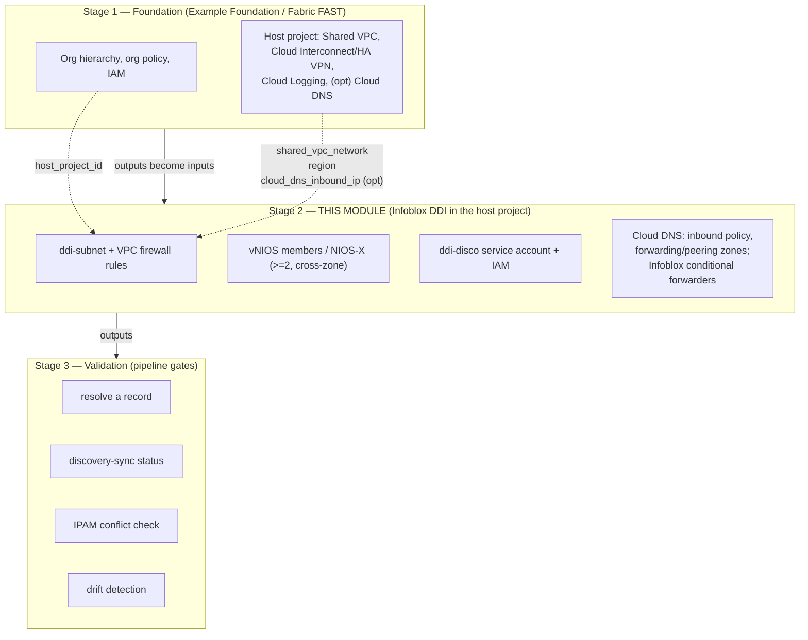

# Automating Infoblox DDI on a Google Cloud Landing Zone — Implementation Guide

> **Layer:** Stage 2 (Shared-VPC-hub DDI extension) on top of a Google Cloud landing-zone
> foundation. **Posture:** GCC-Moderate-equivalent on **commercial Google Cloud**.
> **Status:** the IaC referenced here is a **coherent starter skeleton** — structurally
> correct and guardrail-bearing, *not* a certified production module. Pin your own versions,
> supply your own image and machine type, and test in a sandbox project first.
>
> This guide is the **automation layer** above the deploy-oriented runbook in
> [`../03-gcp.md`](../03-gcp.md). It references that chapter for click-by-click mechanics
> rather than repeating them. Every variable name, port, IAM scope, and boundary rule here
> conforms to [`_module-contract.md`](./_module-contract.md). It is the Google Cloud sibling
> of `azure-alz-automation/`'s guide and mirrors it section-for-section.

---

## 1. Overview & scope

A Google Cloud landing-zone **foundation** — the [Terraform Example
Foundation](https://github.com/terraform-google-modules/terraform-example-foundation) or [Cloud
Foundation Fabric / FAST](https://github.com/GoogleCloudPlatform/cloud-foundation-fabric) —
builds the *governed platform*: the resource-hierarchy (org → folders → projects), org
policy, IAM, logging, and a **Shared VPC** in a connectivity/host project. What it does
**not** build is a DDI layer. As the chapter explains, Google Cloud ships a
usable-but-partial DDI baseline: **Cloud DNS** private zones, forwarding zones, peering
zones, and per-VPC server policies; DHCP is entirely platform-managed via the metadata
resolver `169.254.169.254`; and there is **no first-class IPAM**. Those gaps become
operationally painful the moment a landing zone spans many service projects, a hybrid link,
and a second cloud.

This guide describes how to add **Infoblox DDI** to the Shared VPC host project as an
*automation-grade*, IaC-driven, drift-resistant component — the missing seam between two
toolchains that each ignore the other:

- **Google** ships the landing-zone foundations and Terraform blueprints — they build the
  platform + Shared VPC but know nothing about Infoblox.
- **Infoblox** ships the official `infobloxopen/infoblox` Terraform provider and a
  vNIOS-for-Google-Cloud deployment path — they manage Infoblox but know nothing about the
  foundation.

**Scope discipline (unchanged from the volume).** Infoblox does **not** build the landing
zone — no org hierarchy, no projects, no org policy, no Shared VPC. Those are Stage 1. This
module owns exactly one thing: the **DDI + DNS-security layer inside the Shared VPC host
project**, consuming Stage-1 outputs as inputs.


**What this guide adds beyond the deploy chapter.** The chapter (`03-gcp.md`) tells you how
to launch a vNIOS member from Marketplace and wire Cloud DNS server policies. This guide tells
you how to make that *repeatable, reviewable, and gated*: a parameterized module, a
`deployment_model` switch with a compliance-boundary guard, a least-privilege discovery
service account expressed as code, a multi-stage GitOps pipeline with Workload Identity
Federation, drift detection, self-service IPAM, and an explicit FedRAMP-Moderate control
mapping.

---

## 2. The layered model

Three stages. This module is **Stage 2** and never reaches up into Stage 1's remit.



**Stage 1 → Stage 2 handoff (the contract's layering model).** The foundation emits network
facts; this module consumes them via **remote state** or **module outputs**, never by
re-creating them:

| Stage-1 output | Stage-2 input variable | Used for |
|---|---|---|
| `host_project_id` | `host_project_id` | where to place the DDI subnet/firewall/members |
| `shared_vpc_network` | `shared_vpc_network` | subnet is added *into* this VPC |
| `region` | `region` | member zones are `${region}-${letter}` |
| `secret_project_id` (or host) | `secret_project_id` | Secret Manager secret reads |
| `cloud_dns_inbound_ip` (optional) | `cloud_dns_inbound_ip` | Infoblox conditional-forward target |

**Stage 2 → Stage 3 handoff.** This module's canonical outputs — `ddi_anycast_vip`,
`dns_server_ips`, `grid_master_ip` (grid only), `discovery_service_account_email`,
`ddi_subnet_id` — are what the validation stage asserts against.

---

## 3. Choosing the control-plane model

The single most consequential decision is the `deployment_model` variable, because it
determines **where the control plane physically lives relative to your ATO boundary**.

| | `deployment_model = "grid"` (default) | `deployment_model = "universal_ddi"` |
|---|---|---|
| **Control plane** | vNIOS **Grid**, self-operated inside your projects | Infoblox **Portal / CSP** (SaaS), operated by Infoblox |
| **Location vs. ATO boundary** | **Inside** the boundary | **Outside** the boundary |
| **Data-plane members** | vNIOS DNS members | NIOS-X servers |
| **Outbound dependency** | Grid VPN `1194/udp` + `2114/tcp` between members/GM | **Outbound `443` to `csp.infoblox.com`** for Portal sync |
| **GCC-Moderate fit** | **Boundary-clean. Recommended default.** | SaaS control plane outside boundary — **requires authorization review** |
| **Code guard** | none | hard-fails unless `acknowledge_saas_boundary = true` |
| **Best for** | Enterprises extending an existing on-prem Grid; sovereign/air-gap-leaning estates | Greenfield multi-cloud teams who don't want to operate Grid Masters |

**The GCC-Moderate boundary rule (enforced in code).** Because Universal DDI's control plane
is SaaS *outside* the authorization boundary, the module refuses to plan the `universal_ddi`
path unless the operator explicitly sets `acknowledge_saas_boundary = true`. The default
(`false`) triggers a Terraform `precondition` hard-fail whose message points to the
FedRAMP/authorization review (and to the Assured Workloads / Portal-region question). Grid
needs no such gate — its control plane stays in-boundary. This is a deliberate "secure by
default, opt-in to the SaaS boundary" design.

For most GCC-Moderate landing zones the answer is **Grid**: one authoritative database across
on-prem + GCP, no SaaS egress in the boundary. Reach for Universal DDI only when you've run
the boundary/authorization review and accept the outbound-443 dependency. An air-gapped or
strict-sovereignty posture (Assured Workloads folders) favors the self-contained vNIOS Grid.

---

## 4. Mapping the 11-section skeleton to automation artifacts

The volume's chapter convention has 11 sections. Here is what each becomes as a concrete
automation artifact in this package.

| # | Chapter section | Automation artifact(s) |
|---|---|---|
| 1 | **Overview / where DDI fits** | This guide §1–2; `README.md`; the layering diagram. No resources — framing. |
| 2 | **Reference architecture** | `terraform/main.tf` topology (subnet + members in host VPC); the mermaid diagrams (`figs/gcp-01`). |
| 3 | **Product options** | `deployment_model` variable (`grid` \| `universal_ddi`) + `vnios_image` object; branch logic in `grid.tf`/`universal_ddi.tf`. |
| 4 | **Prerequisites** | `terraform/firewall.tf` (VPC firewall port rules), `variables.tf` validation, Secret Manager refs; see §5. |
| 5 | **Deployment** | `terraform/grid.tf` (members, disks, zones, one NIC per VPC) / `universal_ddi.tf`; `pipelines/` Stage-2 apply. |
| 6 | **Cloud discovery adapter** | `terraform/discovery.tf` — service account + `compute.networkViewer`/`dns.reader` bindings; discovery config; see §5. |
| 7 | **Native-DNS integration** | `terraform/dns.tf` — inbound server policy, forwarding/peering zones, `infoblox_zone_forward`; see §9. |
| 8 | **IPAM automation** | `terraform/dns.tf` IPAM discussion + `discovery.tf`; discovery-driven networks/EAs; §10 self-service. |
| 9 | **HA / sizing** | `member_count`, `zones`, `machine_type` variables; cross-zone placement in `main.tf`/`grid.tf`. |
| 10 | **Security / compliance** | firewall default-deny, discovery least-privilege, Secret Manager secrets, flow/query logs → Cloud Logging; §11 mapping. |
| 11 | **Validation & Day-2** | `validation/` scripts + `pipelines/` validate stage: resolve a record, discovery-sync status, conflict check, drift. |

---

## 5. Prerequisites as code

Everything the chapter lists as a manual prerequisite becomes a declarative resource or an
input variable. The pattern: **consume Stage-1 host outputs, create only the DDI-scoped
resources, wire secrets from Secret Manager, never invent CIDRs, machine types, or image
names.**

**Consuming foundation outputs.** Point a `terraform_remote_state` data source (or pass
module outputs) at the Stage-1 state to read `host_project_id`, `shared_vpc_network`,
`region`, and (optionally) a Cloud DNS inbound forwarder IP. These are the *only* way Stage 2
learns about the host VPC — it does not query or mutate Stage-1-owned resources.

**DDI subnet.** The module creates one dedicated subnet in the host VPC at `ddi_subnet_cidr`
(named `ddi-subnet`), with **Private Google Access** (so members reach `googleapis.com`
without external IPs) and VPC **flow logs** (AU-* audit). It does **not** create the Shared
VPC or the members' second-VPC subnets.

**Firewall ports (the contract's port table).** The module attaches VPC firewall rules scoped
by the `ddi-member` network tag with **default-deny** (an explicit deny-all egress overrides
GCP's implied allow-all egress) plus exactly these rules — sources scoped to explicit CIDR
variables, never `0.0.0.0/0`:

| Service | Port | Proto | Direction | When |
|---|---|---|---|---|
| DNS | 53 | tcp+udp | ingress from clients/on-prem | always |
| DHCP | 67–68 | udp | ingress | only if module serves DHCP (off by default; GCP DHCP is platform-managed) |
| Grid VPN | 1194 | udp | in/out to Grid members/GM | `deployment_model = grid` |
| Grid comms | 2114 | tcp | in/out | `deployment_model = grid` |
| NTP | 123 | udp | egress | always |
| HTTPS mgmt | 443 | tcp | ingress (mgmt CIDR) | always |
| Portal sync | 443 | tcp | **egress to Infoblox Portal** | `deployment_model = universal_ddi` only |
| SNMP | 161 | udp | ingress (monitoring CIDR) | optional |

The Grid rows and the egress-Portal row are toggled by `deployment_model`, so a Grid
deployment never opens the SaaS egress and a Universal DDI deployment never opens the Grid
VPN. Two GCP facts the rules account for: egress to the **metadata server
`169.254.169.254`** stays open under default-deny (VMs/members resolve via it), and a member
uses **one NIC per VPC** — a member spanning two VPCs needs two NICs (03-gcp.md §2).

**Least-privilege discovery identity.** A dedicated **service account** (`ddi-disco`) gets
scoped read roles on the projects actually discovered:

| Role | Scope | Why |
|---|---|---|
| `roles/compute.networkViewer` | discovered project(s) | enumerate VPCs, subnets, instances, addresses |
| `roles/dns.reader` | discovered project(s) | read Cloud DNS zones/records for DNS discovery |
| `roles/dns.admin` | project(s) holding zones | **only if** Infoblox writes records into Cloud DNS |

No `roles/owner`, no `roles/editor`, no broad `roles/viewer`. Prefer a **custom role** scoped
to the exact `compute.*`/`dns.*` list/get permissions; the module uses the two predefined read
roles for clarity and includes a custom-role sketch. The record-write role is opt-in. In a
Shared VPC, grant read on the **host project** (shared networks/subnets) *and* each **service
project** you want VM-level discovery for.

**Secret Manager secrets.** The admin password, temp license, Grid shared secret, and any
Portal join token are referenced from Secret Manager (`secret_project_id` + `*_secret_id`) —
never hard-coded and never emitted as plaintext outputs. Terraform reads the secret *versions*
at plan time and injects them via instance metadata (§8).

---

## 6. Terraform path

`terraform/` is the primary (and only) artifact: a `hashicorp/google` +
`infobloxopen/infoblox` module driven by the contract's canonical variables.

**File layout (illustrative-but-coherent skeleton):**

- `versions.tf` — provider pins (see below).
- `variables.tf` — every canonical variable from the contract, each documented, with
  `validation` blocks (e.g. the `0.0.0.0/0` rejection and the `vnios_image` family/name XOR).
- `firewall.tf` — VPC firewall rules with the port set from §5.
- `main.tf` — locals, labels, the DDI subnet, the boundary hard-fail, the member SA, and the
  Secret Manager reads.
- `grid.tf` / `universal_ddi.tf` — the vNIOS/NIOS-X members: `member_count`, cross-zone
  placement over `zones`, `machine_type`, `vnios_image`, one NIC per VPC, first-boot
  startup-script. `deployment_model` selects which file's resources exist.
- `discovery.tf` — `ddi-disco` service account + the least-privilege IAM bindings.
- `dns.tf` — the Cloud DNS + Infoblox provider objects (see §9).
- `outputs.tf` — the canonical outputs.

**Provider pins (`versions.tf`).** Pin both providers explicitly — do not float. Use a current
`google` (6.x line) and the current `infobloxopen/infoblox` (2.x line, e.g. `~> 2.13`). Treat
the exact versions as **operator-supplied**; the skeleton pins conservatively and you re-pin to
what you've tested:

```hcl
terraform {
  required_providers {
    google   = { source = "hashicorp/google",    version = "~> 6.0"  }
    infoblox = { source = "infobloxopen/infoblox", version = "~> 2.13" }
  }
}
```

**The SaaS guard, in code.** In `main.tf`, a `precondition` on `terraform_data.boundary_guard`
hard-fails `universal_ddi` unless acknowledged:

```hcl
# condition = !(var.deployment_model == "universal_ddi" && var.acknowledge_saas_boundary == false)
# error_message points to the FedRAMP/authorization review.
```

**Where the Infoblox provider manages DDI objects.** Google resources (`google`) build the
plumbing — subnet, firewall, instances, service account, Cloud DNS policy/zones. The
**`infoblox` provider** manages the DDI *objects* inside NIOS: `infoblox_zone_forward`
(conditional forwarders to the Cloud DNS inbound IP, §9) and IPAM objects. This split matters:
the provider needs a reachable Grid/NIOS WAPI endpoint, so DDI-object resources typically apply
in a **second phase** (or a dependent module) after the members are up and the Grid is joined —
Terraform `depends_on` and staged targets keep the ordering honest.

---

## 7. Why Terraform-only (no Bicep/DM sibling)

The Azure package ships a parallel Bicep module because Azure teams frequently standardize on
Bicep for the Azure layer. On Google Cloud the equivalent legacy tool (Deployment Manager) is
deprecated in favor of Terraform, and both the Google landing-zone foundations and the Infoblox
provider are Terraform-native. So this package is **Terraform-only** — there is no second IaC
dialect to keep in sync. The honest limitation the Azure Bicep path called out (no
Bicep-native Infoblox resource) does not arise here; instead, the two genuinely non-declarative
seams — **vDiscovery job creation** and **Universal DDI Portal enrollment** — are handled by a
clearly-marked API/Ansible handoff (`null_resource`/local-exec in `discovery.tf` and
`universal_ddi.tf`), exactly as they would be on any platform.

---

## 8. Pipeline & GitOps

`pipelines/` provides a **GitHub Actions** workflow and a concise **Cloud Build** rendering,
both following the same three-stage shape and the same auth model.

**Stages:**

1. **Foundation (Stage 1)** — the foundation's own pipeline provisions/updates the platform +
   Shared VPC and publishes outputs to remote state. (Referenced, not owned here.)
2. **DDI (Stage 2)** — `terraform init/plan/apply` for this module, consuming Stage-1 remote
   state. The `plan` step is a PR gate; `apply` runs on merge to the environment branch.
3. **Validate (Stage 3)** — runs the `validation/` checks (§10) and fails the pipeline if a
   record won't resolve, discovery isn't syncing, or an IPAM conflict is detected.

**Workload Identity Federation (no exported keys).** Do **not** export a service-account JSON
key into the CI system. Configure a **Workload Identity Pool + Provider** trusting the
pipeline's OIDC issuer and let the runner impersonate a deploy service account:

- **GitHub Actions:** `google-github-actions/auth@v2` with `workload_identity_provider` +
  `service_account` and `permissions: id-token: write` — no key. The provider's attribute
  condition scopes to the repo/branch/environment.
- **Cloud Build:** the build runs *as* a service account directly — the same keyless model.

**Remote state + Secret Manager.** Terraform state lives in a **GCS bucket** with object
versioning + state locking; Grid/admin secrets and the discovery credential live in **Secret
Manager** and are fetched at apply time by the same workload identity — never printed, never
committed.

**GitOps loop.** Git is the desired-state source of record. PRs run `plan`; merges run `apply`;
scheduled runs re-plan to surface **drift** (§10). This is what makes the DDI layer
drift-resistant rather than a one-time deploy.

---

## 9. DNS integration

The DNS wiring is the reason Infoblox sits in the host project at all. Two conditional paths
meet at Cloud DNS, giving split-horizon resolution without either side becoming authoritative
for the other. Implemented in `terraform/dns.tf`.


**Inbound (Cloud DNS reachable from Infoblox).** An **inbound DNS server policy**
(`google_dns_policy` with `enable_inbound_forwarding`) on the Shared VPC. Cloud DNS then
allocates **inbound forwarder IPs** from the VPC's subnet ranges; the Infoblox members (and
on-prem) target those IPs to resolve Cloud DNS private-zone / `*.googleapis.com` names. On the
Infoblox side this is matched by conditional forwarders:

```hcl
resource "infoblox_zone_forward" "gcp_service" {
  fqdn = "googleapis.com"
  forward_to {
    name    = "cloud-dns-inbound"
    address = var.cloud_dns_inbound_ip   # a Cloud DNS inbound forwarder IP
  }
}
```

**Outbound (VMs resolve via Infoblox).** Two mechanisms (03-gcp.md §7): **Cloud DNS forwarding
zones** (`google_dns_managed_zone`, forwarding type) for enterprise/on-prem domains (e.g.
`corp.example.com.`, reverse zones) whose `target_name_servers` are the Infoblox member IPs —
the surgical default — or an **outbound server policy with alternative name servers** that
overrides all resolution for the VPC (offered as a commented option). Cloud DNS classifies each
alternative/target name server by IP: an RFC 1918 address on an authorized VPC is Type 1/Type 2
(private routing); for **Type 2** private routing to members reached over Interconnect/HA VPN,
the VPC must **return-route `35.199.192.0/19`** — a Stage-1 network concern.

**Split-horizon & scale-out.** Service-project VPCs consume the hub's resolution via **peering
zones** (`google_dns_managed_zone`, peering type) so every project funnels corp/on-prem queries
through the hub to the Infoblox members. One VIP for clients, one authoritative fabric, Threat
Defense inline on every spoke's egress DNS.

Net effect: workload VM → `169.254.169.254` → Cloud DNS → forwarded to an Infoblox member
(corp/on-prem/reverse) **or** answered natively (`googleapis`/Cloud DNS private) → and, from the
other direction, Infoblox forwards Google-service names back through the inbound forwarder IPs.

---

## 10. Validation & Day-2

`validation/` holds Day-0/Day-2 scripts; the Stage-3 pipeline job runs them as **gates** — a
red check blocks promotion.

**Pipeline gates:**

1. **Resolve a record.** From a host/spoke context, an enterprise A record must be answered by
   an Infoblox member, and a Google-service / Cloud DNS private name must resolve through the
   inbound-forward path to a private IP. A failure fails the stage. (`dns-validation.sh`.)
2. **Discovery-sync status.** Assert the vDiscovery run completed and GCP VPCs/subnets + labels
   appear in Infoblox IPAM as networks and extensible attributes. Stale or errored sync fails
   the gate. (`discovery-sync-check.sh`.)
3. **IPAM conflict check.** Assert no overlapping CIDRs between discovered GCP reality and
   Infoblox IPAM; surface conflicts as a reconciliation event, not a silent overwrite.
   (`ipam-conflict-check.sh`.)

**Discovery / IPAM sync.** The GCP-side sync uses the least-privilege `ddi-disco` service
account; the figure below shows the flow.


**Drift detection via GitOps.** A scheduled pipeline re-runs `terraform plan` (and re-reads
Grid object state); any non-empty plan is drift — a subnet created directly in GCP, a firewall
rule changed by hand, a forwarding zone edited in the console — and raises an alert/PR to
reconcile. Because Git is the source of record (§8), remediation is "revert to desired state."

**Self-service IPAM in provisioning pipelines.** Because discovery imports GCP labels as EAs,
application/landing-zone provisioning pipelines can call Infoblox to **carve the next free
subnet** from the correct network container keyed on `env`/`owner`/`app`, then feed that CIDR
into the workload's own IaC. IPAM becomes an API the platform consumes, not a spreadsheet.

**Other Day-2 items (from the chapter, now pipeline-assisted):** re-run/schedule vDiscovery and
reconcile drift; patch NIOS/NIOS-X on the vendor cadence (upgrade the Grid Master before GCP
members, rolling zone by zone); monitor member health, query rates, RPZ/Threat-Defense hits,
and Grid-VPN / SaaS-sync (443) loss via Cloud Monitoring; keep the `35.199.192.0/19` return
route and forwarding/peering config under change control; review discovery-credential expiry
and IAM bindings periodically.

---

## 11. GCC-Moderate / FedRAMP-Moderate control mapping

This maps the DDI layer's artifacts to relevant **FedRAMP Moderate** control families. It is a
*mapping aid for an authorization package*, not a certification — the IaC is a starter skeleton,
and control satisfaction depends on your full environment and assessor.

| Control family | How the DDI layer contributes | Artifact |
|---|---|---|
| **AC-3 / AC-6** (access enforcement, least privilege) | Discovery SA limited to `compute.networkViewer` + `dns.reader`; record-write (`dns.admin`) opt-in and scope-limited; no `owner`/`editor`/broad `viewer`. Firewall sources scoped to explicit CIDRs. | `discovery.tf`; `firewall.tf` |
| **SC-7** (boundary protection) | Dedicated `ddi-subnet` with default-deny VPC firewall (explicit deny-all egress over GCP's implied allow); only the contract's ports open, sources CIDR-scoped, never `0.0.0.0/0`; Grid vs. SaaS egress toggled by `deployment_model`; metadata-server egress kept explicit. | `firewall.tf` |
| **SC-8 / SC-13** (transmission confidentiality, cryptographic protection) | Grid comms inside the `1194/udp` VPN tunnel; management over HTTPS `443`; secrets in **Secret Manager** (never in state/templates); Google-managed / CMEK encryption at rest; Workload Identity Federation (no exported keys) for CI. | Secret Manager refs; `grid.tf`; `pipelines/` |
| **SC-20 / SC-21 / SC-22** (secure name resolution) | Infoblox authoritative fabric + conditional forwarders to the Cloud DNS inbound IP; inbound/outbound split-horizon integrity; Threat Defense (RPZ, threat feeds) inline on host members; DNS Armor (Infoblox-powered) as a Google-native option; HA resolvers via anycast. | `dns.tf`; §9 |
| **AU-2 / AU-6 / AU-12** (audit events, review, generation) | VPC flow logs + Cloud DNS query logging + Infoblox syslog forwarded to **Cloud Logging**; Cloud Audit Logs on the discovery SA's read activity. | subnet/`google_dns_policy` logging; `discovery.tf` |
| **CM-2 / CM-3 / CM-6** (baseline, change control, config settings) | Entire DDI layer is IaC in Git; PRs gate `plan`; scheduled drift detection reconciles unauthorized change back to baseline. | `terraform/`, `pipelines/`, §10 |
| **CP-9 / CP-10** (backup, recovery) | Grid Master (kept on-prem or as a GM/GMC pair) provides Grid DB backup/restore; ≥2 members cross-zone; anycast failover; Universal DDI scales by adding NIOS-X behind the service. | `member_count`, `zones`; §3 |

**Universal DDI SaaS boundary caveat (explicit).** When `deployment_model = "universal_ddi"`,
the Infoblox Portal control plane sits **outside** the ATO boundary and requires outbound `443`
to `csp.infoblox.com`. This is a **boundary-crossing SaaS dependency** that must be covered by an
authorization review (data-flow, third-party service, SA-9 external-services considerations,
and — for regulated workloads — whether the Portal region satisfies the Assured Workloads
residency posture) before use. The module enforces the pause: the plan hard-fails unless
`acknowledge_saas_boundary = true`. For a boundary-clean GCC-Moderate posture, **Grid is the
default and recommended path**, keeping the entire control plane inside the boundary.

---

## 12. Governed self-service via ServiceNow

This section puts a **governed front door** on the IPAM API and the Terraform apply: a ServiceNow Service Catalog item, an approval / separation-of-duties gate, the **CPG Terraform Connector** applying [`terraform/`](./terraform/README.md) on an **in-boundary MID Server**, **IntegrationHub REST** driving the Infoblox allocate/register calls, the three `validation/` scripts run as a **pass/fail gate**, and the **Service Graph Connector for Infoblox** reconciling into the CMDB. It is assembly of certified products, not custom glue.


The platform-specific wiring is in [`servicenow/ServiceNow-Orchestration.md`](./servicenow/ServiceNow-Orchestration.md) and [`servicenow/integrationhub-actions.md`](./servicenow/integrationhub-actions.md). The shared model, certified pieces, and FedRAMP control mapping are in [Chapter 7](../07-servicenow-orchestration.md); the importable scoped-app records are in [`servicenow-app/`](../servicenow-app/README.md). Boundary discipline is unchanged: MID Server in-boundary, secrets in Secret Manager, Universal DDI SaaS path gated by `acknowledge_saas_boundary`.

---

## Sources

- [Terraform Example Foundation (Google Cloud landing zone)](https://github.com/terraform-google-modules/terraform-example-foundation)
- [Cloud Foundation Fabric / FAST](https://github.com/GoogleCloudPlatform/cloud-foundation-fabric)
- [Infoblox — `infobloxopen/infoblox` Terraform provider (Registry)](https://registry.terraform.io/providers/infobloxopen/infoblox/latest/docs)
- [Infoblox — terraform-provider-infoblox (GitHub)](https://github.com/infobloxopen/terraform-provider-infoblox)
- [HashiCorp — `hashicorp/google` provider (Registry)](https://registry.terraform.io/providers/hashicorp/google/latest/docs)
- [Infoblox — Firewall Requirements for Infoblox Cloud Services (NIOS-X / 443)](https://docs.infoblox.com/space/BloxOneInfrastructure/873660456/Firewall+Requirements+for+Infoblox+Cloud+Services)
- [Google Cloud — Cloud DNS documentation](https://docs.cloud.google.com/dns/docs/server-policies-overview)
- [Google Cloud — landing zone / architecture](https://cloud.google.com/architecture/landing-zones)
- Deploy chapter (click/CLI mechanics): [`../03-gcp.md`](../03-gcp.md)
