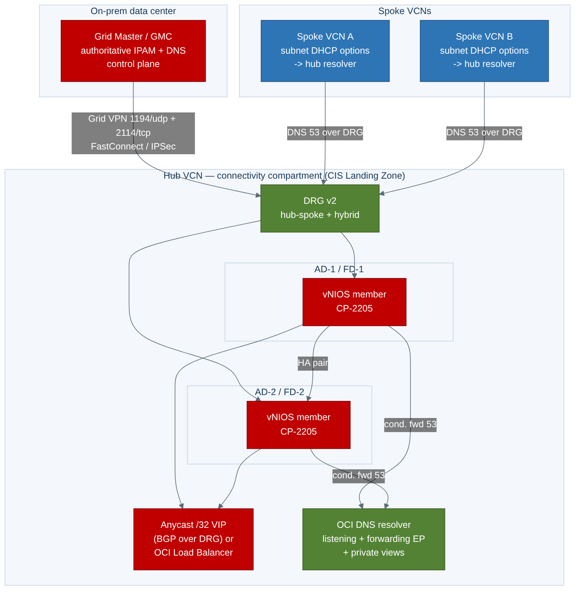
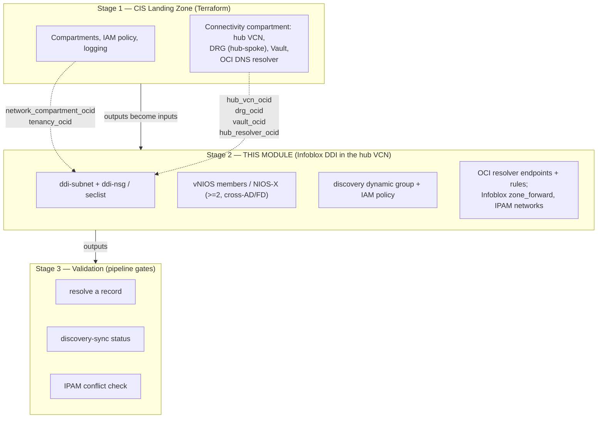

# Automating Infoblox DDI on an OCI Landing Zone — Implementation Guide

> **Layer:** Stage 2 (hub-VCN DDI extension) on top of the OCI **CIS / Core Landing
> Zone**. **Posture:** FedRAMP Moderate-equivalent on **commercial OCI (the OC1 realm,
> `*.oraclecloud.com`)**, not OCI Government (OC2/OC3) or National-Security realms.
> **Status:** the IaC referenced here is a **coherent starter skeleton** —
> structurally correct and guardrail-bearing, *not* a certified production module. Pin
> your own versions, import and supply your own vNIOS custom image, choose a flexible
> shape, and test in a sandbox landing zone first.
>
> This guide is the **automation layer** above the deploy-oriented runbook in
> [`../04-oci.md`](../04-oci.md). It references that chapter for click-by-click
> mechanics rather than repeating them. Every variable name, port, IAM scope, and
> boundary rule here conforms to [`_module-contract.md`](./_module-contract.md).

---

## 1. Overview & scope

Oracle's **CIS Landing Zone** (and the OCI Core Landing Zone) builds the *governed
platform*: the compartment topology, IAM policies, logging, and — in the connectivity
compartment — a hub-and-spoke network with a **hub VCN and a DRG**. What it does **not**
build is a DDI layer. As the chapter explains, OCI ships a usable-but-partial DDI
baseline: OCI DNS private views resolve within and between VCNs, but there is **no
multi-cloud IPAM**, **DHCP is platform-managed** (no reservations/option policy), and OCI
private DNS is not a DNS-security control plane (no RPZ/threat feeds). Those gaps become
operationally painful the moment a landing zone spans many compartments, a hybrid link,
and a second cloud.

This guide describes how to add **Infoblox DDI** to that hub as an *automation-grade*,
Terraform-driven, drift-resistant component — the missing seam between two vendor
toolchains that each ignore the other:

- **Oracle** ships the CIS Landing Zone Terraform and the OCI Terraform provider — they
  build the platform + hub but know nothing about Infoblox.
- **Infoblox** ships the official `infobloxopen/infoblox` Terraform provider and a
  vNIOS-on-OCI custom-image deployment path — they manage Infoblox but know nothing about
  the CIS Landing Zone.

**Scope discipline (unchanged from the volume).** Infoblox does **not** build the landing
zone — no tenancy, no compartments, no IAM foundations, no hub network. Those are Stage 1.
This module owns exactly one thing: the **DDI + DNS-security layer inside the hub VCN**,
consuming Stage-1 outputs as inputs.

**Candor on the thinner discovery story.** Be honest where OCI is a later, thinner
integration target than the hyperscalers (mirroring `04-oci.md`): there is **no
Marketplace vNIOS listing** (you import a custom image) and **no deep, event-driven
discovery connector** (IPAM sync is API/SDK/Terraform-driven). This guide does not paper
over that — it gives the API-driven pattern that works and marks every seam in code.

---

## 2. The layered model

Three stages. This module is **Stage 2** and never reaches up into Stage 1's remit.



**Stage 1 → Stage 2 handoff (the contract's layering model).** The CIS Landing Zone's
network deployment emits facts; this module consumes them via **remote state** or **stack
outputs**, never by re-creating them:

| Stage-1 output | Stage-2 input variable | Used for |
|---|---|---|
| `network_compartment_ocid` | `network_compartment_ocid` | where to place the DDI subnet/NSG/instances |
| `hub_vcn_ocid` | `hub_vcn_ocid` | subnet is added *into* this VCN |
| `drg_ocid` | `drg_ocid` | spoke + on-prem reachability reference |
| `vault_ocid` | `vault_ocid` | secrets (admin pw, license, grid secret, join token) |
| hub resolver OCID / subnet | `hub_resolver_ocid` / `resolver_endpoint_subnet_ocid` | attach LISTENING/FORWARDING endpoints (AU-*/SC-20) |

**Stage 2 → Stage 3 handoff.** This module's canonical outputs — `ddi_anycast_vip`,
`dns_server_ips`, `grid_master_ip` (grid only), `discovery_identity_id`, `ddi_subnet_id` —
are what the validation stage asserts against.



---

## 3. Choosing the control-plane model

The single most consequential decision is the `deployment_model` variable, because it
determines **where the control plane physically lives relative to your ATO boundary**.

| | `deployment_model = "grid"` (default) | `deployment_model = "universal_ddi"` |
|---|---|---|
| **Control plane** | vNIOS **Grid**, self-operated inside your tenancy | Infoblox **Portal / CSP** (SaaS), operated by Infoblox |
| **Location vs. ATO boundary** | **Inside** the boundary | **Outside** the boundary |
| **Data-plane members** | vNIOS DNS members (CP-2205) | NIOS-X servers |
| **Outbound dependency** | Grid VPN `1194/udp` + `2114/tcp` to members/GM over the DRG | **Outbound `443` to `csp.infoblox.com`** for Portal sync |
| **FedRAMP-Moderate fit** | **Boundary-clean. Recommended default.** | SaaS control plane outside boundary — **requires authorization review** |
| **Gov / sovereign realms** | Works — control plane stays in-tenancy | Portal typically **unreachable**; do not use |
| **Code guard** | none | hard-fails unless `acknowledge_saas_boundary = true` |

**The boundary rule (enforced in code).** Because Universal DDI's control plane is SaaS
*outside* the authorization boundary, the module refuses to plan the `universal_ddi` path
unless the operator explicitly sets `acknowledge_saas_boundary = true`. The default
(`false`) triggers a Terraform `precondition` hard-fail whose message points to the
authorization review. Grid needs no such gate — its control plane stays in-boundary. This
is a deliberate "secure by default, opt-in to the SaaS boundary" design.

For most FedRAMP-Moderate landing zones the answer is **Grid**: one authoritative database
across on-prem + OCI, no SaaS egress in the boundary. Reach for Universal DDI only when
you've run the boundary/authorization review and accept the outbound-443 dependency — and
never in an OC2/OC3/air-gapped realm.

---

## 4. Mapping the 11-section skeleton to automation artifacts

The volume's chapter convention has 11 sections. Here is what each becomes as a concrete
automation artifact in this package.

| # | Chapter section | Automation artifact(s) |
|---|---|---|
| 1 | **Overview / where DDI fits** | This guide §1–2; `README.md`; the layering diagram. No resources — framing. |
| 2 | **Reference architecture** | `terraform/main.tf` topology (subnet + members in hub VCN); `figs/oci-01-reference-architecture.mmd`. |
| 3 | **Product options** | `deployment_model` variable (`grid` \| `universal_ddi`) + `vnios_image_ocid`/`import_image`; branch logic in `grid.tf` / `universal_ddi.tf`. |
| 4 | **Prerequisites** | `terraform/security.tf` (NSG/Security-List port rules), `variables.tf` validation, OCI Vault refs; see §5. |
| 5 | **Deployment** | `terraform/grid.tf` (custom-image import, instances, ADs/FDs, block volumes); `pipelines/` Stage-2 apply. |
| 6 | **Cloud discovery adapter** | `terraform/discovery.tf` — dynamic group / IAM user + least-privilege read policy; the API/SDK sync handoff; see §5/§10. |
| 7 | **Native-DNS integration** | `terraform/dns.tf` — OCI resolver LISTENING/FORWARDING endpoints + rules; `infoblox_zone_forward`; see §9. |
| 8 | **IPAM automation** | `terraform/discovery.tf` + `dns.tf` + `infoblox` provider — networks/containers, tag→EA mapping, §10 self-service. |
| 9 | **HA / sizing** | `member_count`, `availability_domains`, `fault_domains`, `vnios_shape`/`ocpus`/`memory`; cross-AD/FD placement in `grid.tf`. |
| 10 | **Security / compliance** | NSG/Security-List default-deny, discovery least-privilege, OCI Vault secrets, logging to OCI Logging; §11 mapping. |
| 11 | **Validation & Day-2** | `validation/` scripts + `pipelines/` validate stage: resolve a record, discovery-sync status, conflict check. |

---

## 5. Prerequisites as code

Everything the chapter lists as a manual prerequisite becomes a declarative resource or an
input variable. The pattern: **consume Stage-1 hub outputs, create only the DDI-scoped
resources, wire secrets from OCI Vault, never invent OCIDs or shapes.**

**Consuming CIS Landing Zone outputs.** Point a `terraform_remote_state` data source (or
pass stack outputs) at the Stage-1 state to read `network_compartment_ocid`, `hub_vcn_ocid`,
`drg_ocid`, `vault_ocid`, and the hub resolver OCID. These are the *only* way Stage 2
learns about the hub — it does not query or mutate Stage-1-owned resources.

**DDI subnet.** The module creates one dedicated private subnet in the hub VCN at
`ddi_subnet_cidr` (named `ddi-subnet`, `prohibit_public_ip_on_vnic = true`). It does **not**
carve the resolver-endpoint subnet — that is Stage-1/existing; the module only *references*
it for endpoint placement.

**Security rules (the contract's port table).** The module attaches an **NSG** (preferred,
per-VNIC) or a **Security List** (subnet-wide) — selected by `security_model` — with exactly
these rules, sources scoped to explicit CIDR variables, never `0.0.0.0/0`:

| Service | Port | Proto | Direction | When |
|---|---|---|---|---|
| DNS | 53 | tcp+udp | ingress from spokes/on-prem | always |
| DHCP | 67–68 | udp | ingress | only if module serves DHCP (off by default; OCI DHCP is platform-managed) |
| Grid VPN | 1194 | udp | in/out to Grid members/GM | `deployment_model = grid` |
| Grid comms | 2114 | tcp | in/out | `deployment_model = grid` |
| NTP | 123 | udp | egress | always |
| HTTPS mgmt / WAPI | 443 | tcp | ingress (mgmt CIDR) | always |
| Portal sync | 443 | tcp | **egress to Infoblox Portal** | `deployment_model = universal_ddi` only |
| SNMP | 161 | udp | ingress (monitoring CIDR) | optional |
| SSH | 22 | tcp | ingress (mgmt CIDR) | optional |

OCI NSGs/Security Lists are **stateful and default-deny**, so — unlike Azure — there is no
explicit "deny-all" rule to add; only the allows are declared. The Grid rows and the
outbound-Portal row are toggled by `deployment_model`, so a Grid deployment never opens the
SaaS egress and a Universal DDI deployment never opens the Grid VPN.

**vNIOS via custom-image import (no Marketplace).** The chapter's manual image step becomes
either a supplied `vnios_image_ocid` (you imported it once) or, with `import_image = true` +
`image_source_uri`, an `oci_core_image` resource that drives the import from Object Storage.
Never invent an image OCID; never hard-code a shape — `vnios_shape` has no default.

**Least-privilege discovery identity.** Prefer an **instance principal** (a dynamic group
matching the automation/vNIOS instances, `discovery_identity_type = "instance_principal"`,
resource `ddi-disco-dg`); fall back to an **IAM user + group** (`api_key_user`). The policy
(`ddi-disco-policy`) is scoped to the discovered compartments:

| Statement | Scope | Why |
|---|---|---|
| `read virtual-network-family` | discovered compartment(s) | enumerate VCNs, subnets, VNICs, CIDRs for IPAM sync |
| `read dns` | discovered compartment(s) | read private views/zones for reconciliation |
| `inspect tag-namespaces` | tenancy | read defined tags → Infoblox extensible attributes |
| `manage dns` | discovered compartment(s) | **only if** `enable_record_write` (Infoblox writes OCI zones) |

No `manage` of network/compute, no tenancy-admin. The record-write statement is opt-in.

**OCI Vault secrets.** The admin password, temp license, Grid shared secret, and any Portal
join token are referenced by **secret OCID** and read via `oci_secrets_secretbundle` — never
hard-coded and never emitted as plaintext outputs. The pipeline supplies them at apply time.

---

## 6. Terraform path (the only IaC path)

`terraform/` is the sole first-class artifact: an `oracle/oci` + `infobloxopen/infoblox`
module driven by the contract's canonical variables. Unlike the Azure package there is **no
parallel declarative path** — OCI **Resource Manager** *is* Terraform, so the same module
runs there (see §8 and `pipelines/resource-manager-oci-ddi.md`).

**File layout (illustrative-but-coherent skeleton):**

- `versions.tf` — provider pins (`oracle/oci ~> 6.0`, `infobloxopen/infoblox ~> 2.13`, `tls`, `null`).
- `variables.tf` — every canonical variable from the contract, each documented, with
  `validation` blocks (CIDRs reject `0.0.0.0/0`; the boundary guard).
- `main.tf` — locals, freeform tags, `ddi-subnet`, the boundary hard-fail, Vault reads.
- `security.tf` — `ddi-nsg` (or Security List) with the §5 port rules.
- `grid.tf` — the custom-image import + vNIOS members: `member_count`, cross-AD/FD placement,
  flexible shape, metadata `user_data`, optional data block volume.
- `universal_ddi.tf` — NIOS-X hosts + Portal-enrollment handoff.
- `discovery.tf` — the dynamic group / IAM user + the least-privilege policy + the API/SDK
  sync handoff.
- `dns.tf` — OCI resolver endpoints + rules and Infoblox conditional forwarders (see §9).
- `outputs.tf` — the canonical outputs.

**Provider pins (`versions.tf`).** Pin both providers explicitly — do not float. Use a
current `oci` (6.x line) and the current `infobloxopen/infoblox` (2.x line, e.g. `~> 2.13`).
Treat the exact versions as **operator-supplied**:

```hcl
terraform {
  required_providers {
    oci      = { source = "oracle/oci",            version = "~> 6.0"  }
    infoblox = { source = "infobloxopen/infoblox", version = "~> 2.13" }
  }
}
```

**The SaaS guard, in code.** `variables.tf` declares `acknowledge_saas_boundary` (default
`false`); `main.tf` hosts a `terraform_data.boundary_guard` whose `precondition` hard-fails
`universal_ddi` unless acknowledged, with a message pointing to the authorization review.

**Example invocation** — see `terraform/examples/hub-integration/main.tf`. The important
shape: Stage-1 OCIDs flow in; `vnios_image_ocid` (or `import_image` + `image_source_uri`)
and `vnios_shape`/`vnios_ocpus`/`vnios_memory_gbs` are operator-supplied; every CIDR is
scoped.

**Where the Infoblox provider manages DDI objects.** OCI resources (`oci`) build the
plumbing — subnet, NSG, instances, IAM, resolver endpoints. The **`infoblox` provider**
manages the DDI *objects* inside NIOS: `infoblox_zone_forward` (conditional forwarders to the
OCI resolver LISTENING endpoint, §9) and IPAM networks/containers. This split matters: the
provider needs a reachable Grid/NIOS WAPI endpoint, so DDI-object resources typically apply
in a **second phase** (or a dependent module) after members are up and Grid-joined —
`depends_on` and staged targets keep the ordering honest.

---

## 7. Custom-image import & the discovery reality (OCI-specific candor)

Two things are genuinely different on OCI and this package refuses to hide them.

**Image import, not Marketplace.** There is no `azurerm_marketplace_agreement` equivalent
because there is no vNIOS Marketplace listing. You obtain the vNIOS OCI image (qcow2/VMDK)
from Infoblox Support, upload it to Object Storage, and import it as a custom image
(paravirtualized). `grid.tf` includes both the optional `oci_core_image` import resource and
the `oci compute image import` CLI handoff. Because image OCIDs are per-tenancy and
per-region, the module never invents one — you supply `vnios_image_ocid` or the import URI.

**Discovery is API/SDK-driven, not a connector.** Infoblox ships no deep, event-driven OCI
discovery adapter. The IAM policy in `discovery.tf` only *grants* the identity; the actual
OCI→IPAM sync is code you run:

- a scheduled **OCI-SDK job** (under the instance principal) that lists VCNs/subnets/VNICs in
  each onboarded compartment and pushes them into Infoblox IPAM as networks/containers,
  tagging each with the VCN/compartment OCID; or
- **pipeline-time reconciliation** — the `infoblox` provider allocates the next free IP and
  creates the A/PTR record in the *same* `terraform apply` that provisions the OCI resource,
  closing the IPAM-to-cloud gap without a connector.

Because vNIOS on OCI (CP-2205) exposes a **direct member API**, Terraform/Ansible pipelines
can drive allocation without traversing the Grid Master. The module marks this seam
explicitly (`discovery.tf` bottom) rather than pretending a connector exists.


---

## 8. Pipeline & GitOps

`pipelines/` provides a **GitHub Actions** three-stage pipeline and an **OCI Resource
Manager** note (`resource-manager-oci-ddi.md`), both following the same three-stage shape.

**Stages:**

1. **LZ (Stage 1)** — the CIS Landing Zone's own pipeline provisions/updates the platform +
   hub and publishes outputs to remote state. (Referenced, not owned here.)
2. **DDI (Stage 2)** — `terraform init/plan/apply` of this module, consuming Stage-1 remote
   state. The `plan` step is a PR gate; `apply` runs on merge to the environment branch.
3. **Validate (Stage 3)** — runs the `validation/` checks and fails the pipeline if a record
   won't resolve, discovery isn't syncing, or an IPAM conflict is detected.

**Auth to OCI (candid).** OCI's OIDC-to-GitHub federation is limited compared with Azure's,
so the GitHub Actions pipeline authenticates with an **OCI API-key config assembled from
GitHub secrets** (tenancy/user/fingerprint/region + the private key), commented honestly in
the workflow. **OCI Resource Manager** is the cleaner native option: as a managed Terraform
service it injects credentials automatically and needs no key in CI — see
`resource-manager-oci-ddi.md`. Remote state lives in **OCI Object Storage** (the S3-compatible
Terraform backend); secrets live in **OCI Vault** and are fetched at apply time — never
printed, never committed.

**GitOps loop.** Git is the desired-state source of record. PRs run `plan`; merges run
`apply`; scheduled runs re-plan to surface **drift**. This is what makes the DDI layer
drift-resistant rather than a one-time deploy.

---

## 9. DNS integration

The DNS wiring is the reason Infoblox sits in the hub at all. Two conditional-forwarding
paths meet at the **hub VCN OCI resolver**, giving split-horizon resolution without either
side becoming authoritative for the other. This is implemented in `terraform/dns.tf`.

**Infoblox → OCI (conditional forwarding).** On the Infoblox members, create **conditional
forwarders** for OCI-owned namespaces — `*.oraclevcn.com` and any OCI private zones —
targeting the **OCI resolver LISTENING endpoint IP** (which consumes 1 private IP). In code
this is `infoblox_zone_forward` (grid path):

```hcl
resource "infoblox_zone_forward" "oci_service" {
  fqdn = "oraclevcn.com"
  forward_to {
    name    = "oci-resolver-listening"
    address = var.oci_listening_endpoint_ip   # Stage-1 / created here
  }
}
```

This lets on-prem and other-cloud clients resolve OCI private names through the Infoblox
fabric.

**OCI → Infoblox (forwarding endpoint + rules).** On the hub VCN resolver create a
**FORWARDING endpoint** (consumes 2 private IPs — one used, one reserved) and add
**forwarding rules** sending corporate domains (`corp.example`, reverse `10.in-addr.arpa`)
and, if you choose, a **catch-all** to the vNIOS member IPs (or the anycast VIP). Spoke VCNs
reach enterprise/on-prem names by forwarding to the hub via **associated private views** or
a spoke→hub forwarding rule over the DRG. The module writes these rules and attaches views
(`oci_dns_resolver` + `oci_dns_resolver_endpoint`), gated on `manage_resolver_endpoints` and,
for spokes, `enable_spoke_dns_write`.

**Reverse zones.** Delegate OCI CIDR reverse zones to Infoblox so PTRs live in the
authoritative IPAM.


Net effect: spoke VM → VCN resolver (`169.254.169.254`) → forwarded to Infoblox member →
answered locally (corp/on-prem) or conditionally forwarded to the OCI resolver LISTENING
endpoint (`*.oraclevcn.com`/private zones) → OCI DNS. One resolution path, one authoritative
fabric, Threat Defense inline on every spoke's egress DNS.

---

## 10. Validation & Day-2

`validation/` holds Day-0/Day-2 scripts; the Stage-3 pipeline job runs them as **gates** — a
red check blocks promotion.

**Pipeline gates:**

1. **Resolve a record.** From a hub/spoke context, an enterprise A record must be answered by
   an Infoblox member, and an `*.oraclevcn.com` name must resolve through the conditional
   forward path. A failure fails the stage.
2. **Discovery-sync status.** Assert that the OCI→IPAM sync completed and OCI VCNs/subnets +
   tags appear in Infoblox IPAM as networks and extensible attributes (EAs). Because the sync
   is API/SDK-driven (not a connector), the check reads the WAPI (grid) / Universal DDI API
   (SaaS) job/state your sync writes. Stale or errored sync fails the gate.
3. **IPAM conflict check.** Assert no overlapping CIDRs / duplicate allocations between
   discovered OCI reality and Infoblox IPAM; surface conflicts as a reconciliation event, not
   a silent overwrite.

**Drift detection via GitOps.** A scheduled pipeline re-runs `terraform plan` (and re-reads
Grid object state); any non-empty plan is drift — a subnet created directly in OCI, an NSG
rule changed by hand, a forwarder edited in the Grid UI — and raises an alert/PR to reconcile.

**Self-service IPAM in provisioning pipelines.** Because the sync imports OCI **defined tags**
as EAs, application/landing-zone provisioning pipelines can call Infoblox to **carve the next
free subnet** from the correct network container keyed on `environment`/`owner`/`costcenter`,
then feed that CIDR into the workload's own IaC — *before* the OCI VNIC is attached, so no
address is used in OCI that IPAM doesn't already know about.

**Other Day-2 items (from the chapter, now pipeline-assisted):** re-run/schedule the OCI→IPAM
sync and reconcile drift; patch NIOS/NIOS-X on the vendor cadence (upgrade the Grid Master
before OCI members in a Grid); monitor member health, query rates, Threat Defense hits, and
Grid-VPN / SaaS-sync (443) loss; review the discovery credential (instance principal / API
key) and policy periodically.

---

## 11. FedRAMP-Moderate control mapping

This maps the DDI layer's artifacts to relevant **FedRAMP Moderate** control families. It is
a *mapping aid for an authorization package*, not a certification — the IaC is a starter
skeleton, and control satisfaction depends on your full environment and assessor.

| Control family | How the DDI layer contributes | Artifact |
|---|---|---|
| **AC-3 / AC-6** (access enforcement, least privilege) | Discovery identity limited to `read virtual-network-family` / `read dns` / `inspect tag-namespaces`; record-write (`manage dns`) opt-in; instance principals preferred over stored keys; no tenancy-admin. NSG/SL sources scoped to explicit CIDRs. | `discovery.tf`; `security.tf` |
| **SC-7** (boundary protection) | Dedicated private `ddi-subnet` with default-deny NSG/Security List; only the contract's ports open, sources CIDR-scoped, never `0.0.0.0/0`; Grid vs. SaaS egress toggled by `deployment_model`; DRG hub-spoke keeps DDI reachability internal. | `security.tf`; `main.tf` |
| **SC-8 / SC-13** (transmission confidentiality, cryptographic protection) | Grid comms inside the `1194/udp` VPN tunnel; management over HTTPS `443`; secrets in **OCI Vault** (never in state); `is_pv_encryption_in_transit_enabled`; block-volume encryption (Oracle-managed or your Vault key). | OCI Vault refs; `grid.tf` |
| **SC-20 / SC-21 / SC-22** (secure name resolution) | Infoblox authoritative fabric + conditional forwarders to the OCI resolver LISTENING endpoint; split-horizon integrity; Threat Defense (RPZ, threat feeds) inline on hub members; HA resolvers via anycast/LB. | `dns.tf`; §9 |
| **AU-2 / AU-6 / AU-12** (audit events, review, generation) | DNS query logging + Infoblox syslog/audit forwarded to **OCI Logging** / SIEM; Grid audit centralised. | resolver + Infoblox logging → OCI Logging |
| **CM-2 / CM-3 / CM-6** (baseline, change control, config settings) | Entire DDI layer is Terraform in Git; PRs gate `plan`; scheduled drift detection reconciles unauthorized change back to baseline; OCI Resource Manager as the managed-state option. | `terraform/`, `pipelines/`, §10 |
| **CP-9 / CP-10** (backup, recovery) | Grid Master (on-prem or a GM/GMC pair) provides Grid DB backup/restore; ≥2 members cross-AD/FD; anycast/LB failover; boot/block-volume snapshots before upgrades. | `member_count`, `availability_domains`, `fault_domains`; §3 |
| **SA-9** (external information services) | The `universal_ddi` SaaS dependency is gated behind `acknowledge_saas_boundary` and documented as a boundary-crossing external service; Grid keeps it internal. | `main.tf` boundary guard; §3 |

**Universal DDI SaaS boundary caveat (explicit).** When `deployment_model = "universal_ddi"`,
the Infoblox Portal control plane sits **outside** the ATO boundary and requires outbound
`443` to `csp.infoblox.com`. This is a **boundary-crossing SaaS dependency** that must be
covered by an authorization review (data-flow, third-party service, SA-9 external-services)
before use. The module enforces the pause: the plan hard-fails unless
`acknowledge_saas_boundary = true`. For a boundary-clean FedRAMP-Moderate posture — and in
any OCI Government / National-Security realm — **Grid is the default and recommended path**,
keeping the entire control plane inside the tenancy.

---

## 12. Governed self-service via ServiceNow

This section puts a **governed front door** on the IPAM API and the Terraform apply: a ServiceNow Service Catalog item, an approval / separation-of-duties gate, the **CPG Terraform Connector** applying [`terraform/`](./terraform/README.md) on an **in-boundary MID Server**, **IntegrationHub REST** driving the Infoblox allocate/register calls, the three `validation/` scripts run as a **pass/fail gate**, and the **Service Graph Connector for Infoblox** reconciling into the CMDB. It is assembly of certified products, not custom glue.


The platform-specific wiring is in [`servicenow/ServiceNow-Orchestration.md`](./servicenow/ServiceNow-Orchestration.md) and [`servicenow/integrationhub-actions.md`](./servicenow/integrationhub-actions.md). The shared model, certified pieces, and FedRAMP control mapping are in [Chapter 7](../07-servicenow-orchestration.md); the importable scoped-app records are in [`servicenow-app/`](../servicenow-app/README.md). Boundary discipline is unchanged: MID Server in-boundary, secrets in OCI Vault, Universal DDI SaaS path gated by `acknowledge_saas_boundary`.

---

## Sources

- [OCI CIS Landing Zone quickstart (Terraform)](https://github.com/oracle-quickstart/oci-cis-landingzone-quickstart)
- [Oracle — OCI Terraform provider (Registry docs)](https://registry.terraform.io/providers/oracle/oci/latest/docs)
- [Oracle — OCI DNS (private views, resolvers, endpoints)](https://docs.oracle.com/en-us/iaas/Content/DNS/Tasks/privatedns.htm)
- [Infoblox — `infobloxopen/infoblox` Terraform provider (Registry docs)](https://registry.terraform.io/providers/infobloxopen/infoblox/latest/docs)
- [Infoblox — terraform-provider-infoblox (GitHub)](https://github.com/infobloxopen/terraform-provider-infoblox)
- [Infoblox — Firewall Requirements for Infoblox Cloud Services (NIOS-X / 443)](https://docs.infoblox.com/space/BloxOneInfrastructure/873660456/Firewall+Requirements+for+Infoblox+Cloud+Services)
- Module contract: [`_module-contract.md`](./_module-contract.md)
- Deploy chapter (click/CLI mechanics): [`../04-oci.md`](../04-oci.md)
