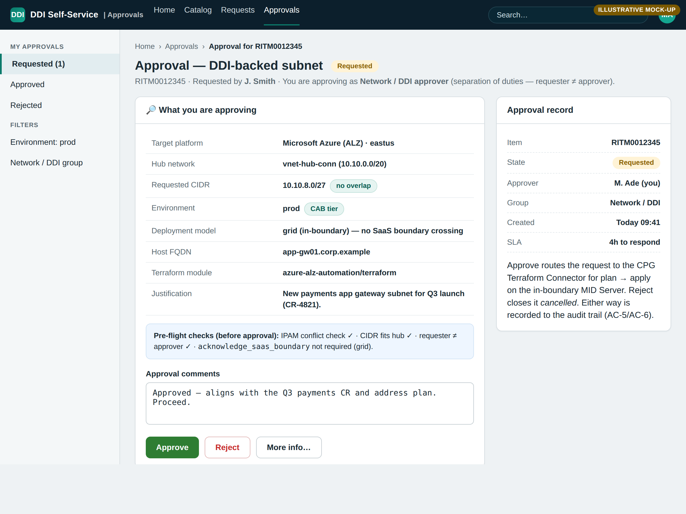
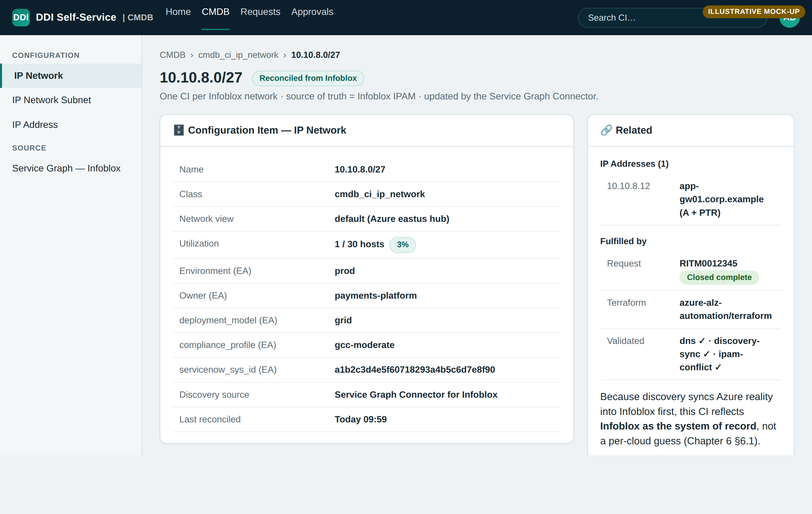

# Playbook — Build the Infoblox DDI Front Door, ServiceNow-First

This is a step-by-step build playbook for standing up the Infoblox DDI
self-service front door with **ServiceNow leading the implementation**. You build
the *governed experience layer first* — the catalog request, the approval/SoD
gate, and the Flow that defines the closed loop — so the **contract exists before
any automation does**. Only once that experience is real do you wire the
Terraform/Infoblox automation *behind* it. This deliberately inverts the
platform-first (automation-first) build order that [Chapter 7](../07-servicenow-orchestration.md)
and the per-platform packages describe.

> The screens embedded below are **illustrative mock-ups, not real screenshots**
> (see [`mockups/README.md`](mockups/README.md)). They communicate the intended
> Next Experience look-and-feel; field values (RITM numbers, IPs, names) are
> fictional. The scoped-app records under `servicenow-app/` are a labeled
> **starter skeleton**, not a signed, production-certified store app.

---

## Why ServiceNow-led

Both build orders assemble the *same* certified pieces — the difference is
sequence, and sequence changes where governance and rework land.

| Concern | Platform-led (automation-first) | ServiceNow-led (experience-first) |
|---|---|---|
| First artifact built | Terraform module + validation scripts | Catalog item + approval + Flow contract |
| When governance appears | Retrofitted once a UI is bolted on | Baked in at step 1 (approval/SoD is the trigger's neighbor) |
| Contract owner | The module's `tfvars` surface | The catalog variable set the requester actually sees |
| Typical rework | Re-shape the catalog to match a module built in isolation | Wire automation to a contract that is already agreed |
| Pilot risk | "It provisions" long before "it's requestable/auditable" | Requestable + auditable from the first pass; automation slots in behind |
| Boundary posture | Boundary considered at MID/execution layer | Boundary is a *form field* (`acknowledge_saas_boundary`) from the start |

Experience-first means the approval gate, the audit trail, and the SaaS-boundary
acknowledgement are **properties of the front door itself**, so nothing has to be
back-filled. The automation is then built to satisfy a contract that stakeholders
have already seen and approved.

---

## Phase 0 — Prerequisites

1. **FedRAMP-authorized ServiceNow instance.** Use a FedRAMP-authorized
   (GovCloud) ServiceNow instance so the whole experience sits in an authorized
   boundary (Chapter 7 §7.4).
2. **MID Server inside the ATO boundary.** Register a MID Server **inside the ATO
   boundary**, alongside where the DDI subnet will live, so execution and the
   credential path never leave the boundary.
3. **Install the two certified store apps** from the ServiceNow Store:
   - **Cloud Provisioning & Governance: Terraform Connector** — fronts each
     package's `terraform/` module as a catalog task (`plan` → approve → `apply`
     on the MID Server).
   - **Service Graph Connector for Infoblox** — IPAM → CMDB sync.
4. **Connection & Credential alias `x_infoblox_ddi.infoblox`.** Create the alias
   pointing at your Grid Master (WAPI) or Universal DDI base URL, with the
   in-boundary MID Server selected. Secrets live in the platform vault; ServiceNow
   holds the *reference*, never the secret material.

---

## Phase 1 — Stand up the scoped app `x_infoblox_ddi`

The scoped app is the container the front door lives in. Import it before the
form so the Script Includes the Flow calls already resolve.

1. Create the scoped application `x_infoblox_ddi` (or import the records below as
   an update set) — see [`README.md`](README.md) for the record model.
2. Add the two Script Includes:
   - [`script-includes/InfobloxDDIClient.js`](script-includes/InfobloxDDIClient.js)
     — server-side Infoblox client (next-available-IP, create host A+PTR,
     delete/reclaim; NIOS WAPI **and** Universal DDI branches).
   - [`script-includes/InfobloxDDIGate.js`](script-includes/InfobloxDDIGate.js)
     — post-apply validation gate that dispatches the MID wrapper and parses its
     JSON verdict.
3. Import the outbound REST definition
   [`update-set/sys_rest_message_infoblox.xml`](update-set/sys_rest_message_infoblox.xml)
   (`sys_rest_message` + `_fn`), routed via the MID Server, auth from the
   credential alias.
4. Set the app properties:
   - `x_infoblox_ddi.api_flavor` — `nios` | `universal_ddi`
   - `x_infoblox_ddi.wapi_version` — pin your WAPI version
   - `x_infoblox_ddi.mid_server` — the in-boundary MID Server
   - `x_infoblox_ddi.mid_scripts_dir` — where the MID scripts are deployed

---

## Phase 2 — Build the catalog item (the request form)

This is the front door itself, and in a ServiceNow-led build it is the **first
functional artifact**. The variable set *is* the contract: everything downstream
(Flow inputs, Terraform `tfvars`, Infoblox calls) is shaped to satisfy it.

1. Create the catalog item **"Request a DDI-backed subnet"**.
2. Build the **variable set** so each field maps to exactly one canonical module
   variable. Use the per-platform mapping table as the authority — for Azure, see
   the "Catalog item → tfvars mapping" table in
   [`../azure-alz-automation/servicenow/ServiceNow-Orchestration.md`](../azure-alz-automation/servicenow/ServiceNow-Orchestration.md);
   each other package carries the equivalent under its own `servicenow/` folder.
3. **Mark required vs. defaulted** per that table: fields with no module default
   (region, hub VNet ID, DDI subnet CIDR, VM SKU, Key Vault ID, mgmt/DNS CIDRs)
   are mandatory; fields the module defaults (name prefix, member count, zones)
   are optional/advanced.
4. **Pre-populate Stage-1 fields.** Fields sourced from Stage-1 (ALZ Accelerator)
   outputs — e.g. `hub_resource_group_name`, `hub_vnet_id` — should be reference
   lookups, **not free-typed**, so requesters can't invent hub identifiers.
5. **Add the `acknowledge_saas_boundary` conditional.** Show/require it only when
   `deployment_model = universal_ddi`; it must be `true` to allow the SaaS path
   and it drives an extra approval in Phase 3.
6. **Keep secrets off the form.** The item collects only the vault *reference*
   (e.g. `key_vault_id`); admin password, grid shared secret, join token, and
   discovery credentials stay in the platform vault, resolved on the MID Server.

---

## Phase 3 — Build the Flow + approval

Now build the Flow that turns a submitted form into the closed loop. Follow
[`flow/flow-blueprint.md`](flow/flow-blueprint.md) step-by-step — the blueprint
carries the exact inline Action scripts.

1. **Trigger — Catalog item submitted.** Inputs are the Phase-2 variables mapped
   to the target platform's `tfvars`.
2. **Pre-flight validation (before approval).** Action → Script step: a **read-only**
   check on the *requested* CIDR — that it fits the chosen hub and does not overlap
   an existing Infoblox network — so a bad request fails fast and the approver reads
   a real result, not a promise. (Add the read-only helpers to `InfobloxDDIClient`;
   it currently ships allocate/register/delete.) The *enforced* check is the
   post-apply gate (step 6).
3. **Approval — Ask for approval (SoD gate).** Approvers = the network/DDI group;
   requester ≠ approver. Route on `environment` (prod needs change-advisory
   approval) and on `deployment_model` (selecting `universal_ddi` requires
   `acknowledge_saas_boundary = true` and an **extra approval**). Reject → close
   request *cancelled*.

   

4. **CPG Terraform apply** — call the **Cloud Provisioning & Governance Terraform
   Connector** catalog task for the platform's module, passing the catalog inputs
   as `tfvars` and `inputs.requested_cidr` as `ddi_subnet_address_prefix`.
   Speculative plan → the approval above → apply, on the MID Server. (The module
   itself is ingested in Phase 5 — the Flow references the task that Phase 5 wires up.)
5. **Allocate + register** — Action → Script step calling
   `x_infoblox_ddi.InfobloxDDIClient`: *after* apply has created the subnet,
   `nextAvailableIp(...)` allocates the next-available **host** IP (not the gateway)
   and `createHostRecord(fqdn, allocated_ip, dns_view)` registers the A + PTR.
6. **Validation gate** — Action → Script step calling
   `InfobloxDDIGate.runGate({...})` (`SCRIPTS_DIR = inputs.platform`, `DDI_VIP`,
   `TEST_FQDN`, `EXPECTED_IP`, `GRID_MASTER`; `DDI_VIP`/`GRID_MASTER` from app
   properties). **If `overall != 'pass'`**, post the detail to work-notes and route
   back to the **approval step** (or open a task) — do **not** close the change.
   This is wired to the MID script in Phase 4.
7. **CMDB reconcile** — trigger the **Service Graph Connector for Infoblox**
   import so the new `cmdb_ci_ip_network` / `_subnet` CIs appear; attach them to
   the request.
8. **Close** — set request *closed complete*; the change record + approvals + gate
   output are the audit trail (Chapter 7 §7.4).

Also build the two companion flows from the blueprint: the **retirement flow**
(*Decommission DDI subnet* → approval → `terraform destroy` →
`InfobloxDDIClient.deleteObject` reclaim → CMDB retire → close) and the
**scheduled staleness→Incident** job.

---

## Phase 4 — Wire the MID validation gate + IntegrationHub REST

The Flow's gate and DNS steps need real execution paths on the in-boundary MID
Server.

1. **Deploy the MID validation wrapper.** Copy
   [`mid/infoblox-ddi-validate.sh`](mid/infoblox-ddi-validate.sh) to the MID host
   under `mid_scripts_dir`, and copy each package's validation scripts under
   `mid_scripts_dir/<platform>/` — for Azure those are in
   [`../azure-alz-automation/validation/`](../azure-alz-automation/validation/)
   (`dns-validation.sh`, `discovery-sync-check.sh`, `ipam-conflict-check.sh`). The
   wrapper runs the three checks and emits **one JSON verdict line** that
   `InfobloxDDIGate` parses.
2. **Confirm the env contract.** `InfobloxDDIGate` sets `SCRIPTS_DIR`, `DDI_VIP`,
   `TEST_FQDN`, `EXPECTED_IP`, `GRID_MASTER`, and the Infoblox credentials from
   the request + credential alias, matching the wrapper's expected env vars.
3. **Wire the IntegrationHub REST actions** to Infoblox WAPI / Universal DDI via
   the imported [`update-set/sys_rest_message_infoblox.xml`](update-set/sys_rest_message_infoblox.xml):
   allocate-next-available-IP, create host/A (+PTR), and delete-on-reclaim. The
   concrete method/path/body per platform (and the NIOS vs. Universal DDI
   differences) live in each package's `servicenow/` doc. All calls run on the
   in-boundary MID Server; credentials resolve from the platform vault.

---

## Phase 5 — Connect the automation behind the front door

Only now do you ingest the Terraform module — deliberately **last**, because the
experience already defined the contract the module must satisfy.

1. In the **CPG Terraform Connector**, ingest each package's `terraform/` module
   as a catalog task — for Azure, the module documented at
   [`../azure-alz-automation/terraform/README.md`](../azure-alz-automation/terraform/README.md).
2. Map the catalog task's inputs to the **same variables** the Phase-2 form
   already collects (the `tfvars` surface is derived from the contract, not the
   other way around).
3. Point the Phase-3 "CPG Terraform apply" step at this task. Because the form,
   approval, and gate already exist, the module drops in behind an experience that
   is already requestable and auditable — no catalog rework.

---

## Phase 6 — Service Graph Connector → CMDB

1. Configure the **Service Graph Connector for Infoblox** against your Grid /
   Universal DDI source.
2. **Schedule the IPAM → CMDB import** so Infoblox networks/subnets/IPs land as
   `cmdb_ci_ip_network` / `cmdb_ci_ip_network_subnet` (and `cmdb_ci_ip_address`
   where available), with extensible attributes mapped to CI fields for
   correlation (`servicenow_sys_id`, `environment`, `deployment_model`, …).
3. Confirm the Phase-3 reconcile step (step 7) can find and attach the CIs the
   import creates.

---

## Phase 7 — Pilot & validate

Run the whole loop end-to-end in a sub-prod catalog before promoting.

1. **Submit** a test *Request a DDI-backed subnet* against a dev environment.
2. **Approve** it as the network/DDI group (confirm requester ≠ approver is
   enforced).
3. **Watch the closed loop** on the request status timeline: allocate → apply →
   register → gate → reconcile → close, with work-notes at each step.

   

4. **Confirm the CMDB CI** exists and is correlated back to the request.

**Pass checklist**

- [ ] Catalog item submits; Stage-1 fields were pre-populated, not free-typed.
- [ ] Approval fired; a `universal_ddi` request without `acknowledge_saas_boundary = true` is blocked and a prod request routed to change-advisory.
- [ ] CPG plan posted for approval, then applied on the in-boundary MID Server.
- [ ] IP allocated and A/PTR registered via IntegrationHub REST.
- [ ] Validation gate returned `overall: pass`; a forced failure routes back to approval and does **not** close the change.
- [ ] Service Graph import created the `cmdb_ci_ip_network` CI, correlated by `servicenow_sys_id`.
- [ ] Request closed *complete* with plan, approvals, and gate JSON as the audit trail.
- [ ] Retirement flow reclaims the IP, deletes records, and retires the CI.

---

## Boundary & governance

- **MID Server in-boundary.** Terraform apply, IntegrationHub REST callouts, and
  the validation gate all execute on a MID Server registered inside the ATO
  boundary; execution and credentials never leave it.
- **Secrets in the platform vault, never in ServiceNow.** The catalog collects
  only a vault reference (e.g. `key_vault_id`); the MID Server resolves the actual
  Infoblox/WAPI and grid secrets at run time. ServiceNow holds references, not
  secret material.
- **Universal DDI SaaS path is gated.** `deployment_model = grid` keeps every call
  WAPI-to-Grid and in-boundary. The Portal (CSP) API path is the out-of-boundary
  case, gated by `acknowledge_saas_boundary = true` (default `false` hard-fails)
  plus an extra approval — an explicit, reviewed exception, not the default.
- **Control mapping inherited from Chapter 7 §7.4:** catalog approval + SoD →
  AC-5/AC-6; change record + immutable audit trail → AU-2/AU-6/AU-12 and
  CM-3/CM-5; validation gates → CM-6; reclaim-on-delete → CM-8. The starter
  skeleton here supplies the structure; you complete and certify it in your own
  instance.

---

## Sources

- [Service Graph Connector for Infoblox — ServiceNow Store](https://store.servicenow.com/store/app/eeb927621b246a50a85b16db234bcbf1)
- [Cloud Provisioning & Governance: Terraform Connector — ServiceNow Store](https://store.servicenow.com/store/app/6ff8ef2e1be06a50a85b16db234bcbcb)

Cross-references (this repo):

- [`./README.md`](README.md) — the `x_infoblox_ddi` app skeleton and record model.
- [`../07-servicenow-orchestration.md`](../07-servicenow-orchestration.md) —
  Chapter 7, the platform-led framing, certified pieces, and §7.4 control mapping.
- [`flow/flow-blueprint.md`](flow/flow-blueprint.md) — the Flow steps and inline
  Action scripts this playbook builds in Phase 3.
- [`../08-servicenow-led-implementation.md`](../08-servicenow-led-implementation.md) —
  Chapter 8, the companion narrative that walks this experience-first sequence in prose.
- [`./USER-GUIDE.md`](USER-GUIDE.md) — the requester / approver / admin end-user
  documentation for the front door this playbook builds.
