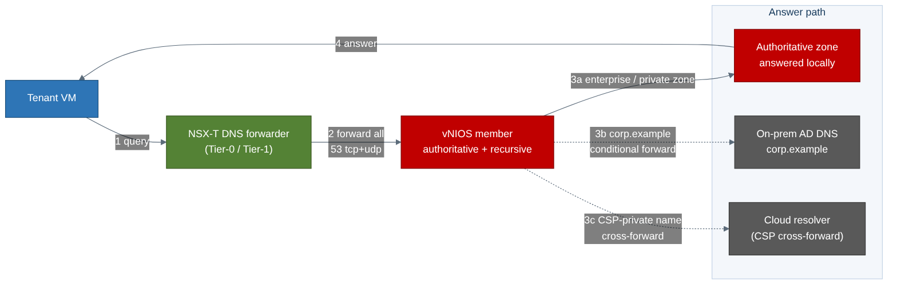

# Automating Infoblox DDI on a VMware (VCF / vSphere / NSX-T) Landing Zone — Implementation Guide

> **Layer:** Stage 2 (DDI extension in the management/edge domain) on top of an existing
> VMware Cloud Foundation SDDC. **Posture:** FedRAMP-Moderate on a **self-contained VCF
> private cloud** (air-gap-friendly — the Grid runs inside the SDDC). **Status:** the IaC
> referenced here is a **coherent starter skeleton** — structurally correct and
> guardrail-bearing, *not* a certified production module. Pin your own versions, supply your
> own vNIOS OVA build and appliance model, and test in a sandbox vSphere cluster first.
>
> This guide is the **automation layer** above the deploy-oriented runbook in
> [`../05-vmware.md`](../05-vmware.md). It references that chapter for click-by-click
> mechanics rather than repeating them. Every variable name, port, discovery scope, and
> boundary rule here conforms to [`_module-contract.md`](./_module-contract.md).

---

## 1. Overview & scope

VMware Cloud Foundation (VCF) is the **private-cloud landing zone** this volume anchors to: a
**management domain** (vCenter, NSX Manager, SDDC Manager) plus one or more **workload
domains**, stitched together by an **NSX-T** overlay of Tier-0/Tier-1 gateways. What VCF does
**not** give you is a DDI layer. NSX ships deliberately thin: a **DNS forwarder** (a stub,
not an authoritative server) and a **DHCP service / relay** — and **no enterprise IPAM at
all**. Those gaps become operationally painful the moment address space spans domains,
clusters, a hybrid link, and a second cloud.

This guide describes how to add **Infoblox DDI** to the management/edge domain as an
*automation-grade*, IaC-driven, drift-resistant component — the missing seam between two
toolchains that each ignore the other:

- **VMware / Broadcom** ship VCF, vSphere, and NSX-T — they build the SDDC and the overlay
  but ship no IPAM and know nothing about Infoblox.
- **Infoblox** ships the official `infobloxopen/infoblox` Terraform provider, the
  vNIOS-for-VMware OVA, Cloud Network Automation, and the Aria Automation IPAM plug-in —
  they manage Infoblox but know nothing about your SDDC topology.

**The anchor role.** Because most enterprises adopting VMware already run an on-prem Infoblox
Grid, the VMware layer is the **private-cloud/on-prem anchor** of this volume: the Grid Master
(and often the whole control plane) frequently lives right here, and the CSP layers *extend*
this Grid rather than standing up parallel ones.

**The sharpest VMware difference — DHCP is genuinely Infoblox's job.** On Azure/AWS/GCP/OCI
the platform owns DHCP and you cannot replace it, so Infoblox provides DNS + IPAM and consumes
the platform's leases. On VMware **you own the data path end to end**, so vNIOS members are the
*authoritative DHCP servers* for tenant segments (via NSX DHCP relay) **and** the authoritative
DNS servers the NSX forwarder points at. The module reflects this: `enable_dhcp` defaults
**true** and `67-68/udp` is open by default.

**Scope discipline (unchanged from the volume).** Infoblox does **not** build the SDDC — no
VCF domains, no vCenter, no NSX fabric, no compute. Those are Stage 1. This module owns exactly
one thing: the **DDI + DNS-security layer inside the management/edge domain**, consuming
Stage-1 inventory as inputs.

**What this guide adds beyond the deploy chapter.** The chapter tells you how to click a vNIOS
OVA into a cluster and point the NSX forwarder at it. This guide tells you how to make that
*repeatable, reviewable, and gated*: a parameterized module, a `deployment_model` switch with
a compliance-boundary guard, a least-privilege discovery credential expressed as code, a
multi-stage GitOps pipeline, drift detection, self-service IPAM via the Aria plug-in, and an
explicit FedRAMP-Moderate control mapping.

---

## 2. The layered model

Three stages. This module is **Stage 2** and never reaches up into Stage 1's remit.


**Stage 1 → Stage 2 handoff (the contract's layering model).** The SDDC exposes inventory
facts; this module consumes them as inputs, never by re-creating them:

| Stage-1 fact | Stage-2 input variable | Used for |
|---|---|---|
| vSphere datacenter | `vsphere_datacenter` | scope for all lookups |
| management/edge cluster | `compute_cluster` | where the members run |
| datastore | `datastore` | member OS/DB disks |
| management dvPortGroup | `management_portgroup` | member VMXNET3 vNICs |
| ESXi host names | `esxi_hosts` | anti-affinity placement |
| Tier-1 gateway paths | `workload_tier1_ids` | DNS forwarder targets |
| read-only vCenter SA / NSX API user | `discovery_vcenter_user` / `discovery_nsx_user` | CNA discovery |

**Stage 2 → Stage 3 handoff.** This module's canonical outputs — `ddi_anycast_vip`,
`dns_server_ips`, `grid_master_ip` (grid only), `discovery_identity_id`, `ddi_member_vm_ids` —
are what the validation stage asserts against.

**"Hub" ≡ the management/edge domain.** Where the Azure package says "Connectivity hub VNet,"
here it means the VCF management (or a dedicated edge/services) domain — the cluster + mgmt
port group where the Grid Master and primary members live, reachable across the NSX fabric.

---

## 3. Choosing the control-plane model

The single most consequential decision is the `deployment_model` variable, because it
determines **where the control plane physically lives relative to your ATO boundary**.

| | `deployment_model = "grid"` (default) | `deployment_model = "universal_ddi"` |
|---|---|---|
| **Control plane** | vNIOS **Grid**, self-operated inside the SDDC | Infoblox **Portal / CSP** (SaaS), operated by Infoblox |
| **Location vs. ATO boundary** | **Inside** the boundary (the natural VMware fit) | **Outside** the boundary |
| **Data-plane members** | vNIOS DNS/DHCP members | NIOS-X hosts (still VMs on vSphere) |
| **Outbound dependency** | Grid VPN `1194/udp` + `2114/tcp` between members/GM | **Outbound `443` to the Infoblox Portal** for sync |
| **FedRAMP-Moderate fit** | **Boundary-clean. Recommended default.** | SaaS control plane outside boundary — **requires authorization review**; often disallowed on sovereign VCF |
| **Code guard** | none | hard-fails unless `acknowledge_saas_boundary = true` |
| **Best for** | Enterprises extending an existing on-prem Grid; sovereign/air-gapped estates | Greenfield/low-ops teams who don't want to operate Grid Masters |

**The boundary rule (enforced in code).** Because Universal DDI's control plane is SaaS
*outside* the authorization boundary, the module refuses to plan the `universal_ddi` path
unless the operator explicitly sets `acknowledge_saas_boundary = true`. The default (`false`)
triggers a Terraform `precondition` hard-fail whose message points to the authorization
review. Grid needs no such gate — its control plane stays in-boundary. This is a deliberate
"secure by default, opt-in to the SaaS boundary" design.

For most VCF landing zones the answer is **Grid**: one authoritative database across on-prem +
VMware, no SaaS egress in the boundary, and the Grid Master usually already lives in the
management domain. Reach for Universal DDI only when you've run the review and can accept the
outbound-443 dependency.

---

## 4. Mapping the 11-section skeleton to automation artifacts

The volume's chapter convention has 11 sections. Here is what each becomes as a concrete
automation artifact in this package.

| # | Chapter section | Automation artifact(s) |
|---|---|---|
| 1 | **Overview / where DDI fits** | This guide §1–2; `README.md`; the reference-architecture figure. No resources — framing. |
| 2 | **Reference architecture** | `terraform/main.tf` topology (members in the mgmt domain, DFW, forwarder, relay); the mermaid figure in §2. |
| 3 | **Product options** | `deployment_model` variable (`grid` \| `universal_ddi`) + `vnios_ovf`/`vnios_appliance_model`; branch logic in `grid.tf` / `universal_ddi.tf`. |
| 4 | **Prerequisites** | `terraform/firewall.tf` (NSX-T DFW port rules), `variables.tf` validation, Vault/CI secrets; see §5. |
| 5 | **Deployment** | `grid.tf` (OVA/OVF deploy, VMXNET3, disk, anti-affinity, vApp first-boot); `pipelines/` Stage-2 apply. |
| 6 | **Cloud integration adapter** | `discovery.tf` — read-only vCenter role/permission + NSX API user; CNA vDiscovery handoff; see §5. |
| 7 | **Native-DNS integration** | `dns.tf` — NSX-T DNS forwarder zone → DDI VIP; Infoblox conditional forwarders to on-prem AD; see §9. |
| 8 | **IPAM automation** | `dns.tf` DHCP relay + the **Aria Automation IPAM plug-in** (`pipelines/aria-automation-ipam-vmware.md`); discovery-driven EAs; §10. |
| 9 | **HA / sizing** | `member_count`, `esxi_hosts`, anti-affinity rule, `vnios_appliance_model`/`vnios_num_cpus`/`vnios_memory_mb`; cross-host placement in `grid.tf`. |
| 10 | **Security / compliance** | `firewall.tf` default-deny DFW, discovery least-privilege, secrets from Vault/CI, syslog to SIEM; §11 mapping. |
| 11 | **Validation & Day-2** | `validation/` scripts + `pipelines/` validate stage: resolve a record, discovery-sync status, conflict check, drift. |

---

## 5. Prerequisites as code

Everything the chapter lists as a manual prerequisite becomes a declarative resource or an
input variable. The pattern: **consume Stage-1 SDDC inventory, create only the DDI-scoped
objects, wire secrets from Vault/CI, never invent CIDRs, OVA builds, or appliance models.**

**Consuming SDDC inventory.** Data sources (`vsphere_datacenter`, `vsphere_compute_cluster`,
`vsphere_resource_pool`, `vsphere_datastore`, `vsphere_network`, `vsphere_host`) read the
existing management/edge domain. The module does not create the datacenter, cluster,
datastore, or port group — it only references them.

**NSX-T DFW ports (the contract's port table).** `firewall.tf` builds a member group and a
**default-deny** security policy with exactly these rules — sources scoped to explicit CIDR
variables, never `0.0.0.0/0`:

| Service | Port | Proto | Direction | When |
|---|---|---|---|---|
| DNS | 53 | tcp+udp | inbound from tenant/forwarder | always |
| DHCP | 67–68 | udp | inbound from NSX DHCP relay | **ON by default** (`enable_dhcp = true`) |
| Grid VPN | 1194 | udp | in/out to Grid members/GM | `deployment_model = grid` |
| Grid comms | 2114 | tcp | in/out | `deployment_model = grid` |
| NTP | 123 | udp | outbound | always |
| HTTPS / WAPI | 443 | tcp | inbound (mgmt CIDR: admins, Aria, CNA) | always |
| Portal sync | 443 | tcp | **outbound to Infoblox Portal** | `deployment_model = universal_ddi` only |
| SNMP | 161 | udp | inbound (monitoring CIDR) | optional |

The Grid rows and the outbound-Portal row are toggled by `deployment_model`, so a Grid
deployment never opens the SaaS egress and a Universal DDI deployment never opens the Grid VPN.
**DHCP is the marquee difference** from the hyperscalers — it is open by default here because
Infoblox is the authoritative DHCP server.

**Least-privilege discovery identity.** Discovery is Cloud Network Automation (CNA) connecting
to vCenter (and NSX Manager). The credentials are least-privilege — a **read-only** vCenter
service account and an NSX-T API user with read on segments/gateways:

| Credential | Where | Least-privilege permission |
|---|---|---|
| vCenter service account | vCenter SSO | **read-only** role scoped to the datacenter/cluster — enumerate clusters, VMs, port groups, IPs. No write. |
| NSX-T API user | NSX Manager | **read** of segments/gateways (read/write only if NSX creates networks/records via Infoblox) |
| Infoblox admin group | Grid | custom group: cloud-API access + IPAM/DNS/DHCP/Grid (+ Tenant when CNA licensed) |

Creating the vCenter/NSX principals is an SSO/AD/NSX task, **not** a Terraform resource. The
module can *optionally* create the read-only **vSphere role + permission**
(`manage_discovery_role = true`) as a convenience; the CNA vDiscovery job itself is an API/UI
handoff (`discovery.tf`).

**Secrets from Vault/CI (no cloud KMS).** The admin password, temp license, Grid shared
secret / Portal join token, and the vCenter/NSX passwords are **sensitive variables sourced
from HashiCorp Vault or the CI secret store** at apply time — never hard-coded, never emitted
as plaintext outputs. There is no Key Vault analog on-prem; this is a deliberate contract
difference (§9).

---

## 6. Terraform path

`terraform/` is the primary artifact: a `vsphere` + `nsxt` + `infobloxopen/infoblox` module
driven by the contract's canonical variables.

**File layout (illustrative-but-coherent skeleton):**

- `versions.tf` — provider pins (see below) + minimal provider blocks (creds from Vault/CI).
- `variables.tf` — every canonical variable from the contract, each documented, with
  `validation` blocks (the CIDR rejects, the `vnios_ovf` XOR, the member-IP-count check).
- `main.tf` — locals, tags, the Stage-1 SDDC data lookups, and the boundary hard-fail +
  secret preconditions.
- `firewall.tf` — the NSX-T DFW member group + default-deny security policy (§5).
- `grid.tf` — the vNIOS members: `vsphere_virtual_machine` `ovf_deploy`, VMXNET3, thick/thin
  disk, `esxi_hosts` placement, first-boot vApp properties, DRS anti-affinity.
- `universal_ddi.tf` — NIOS-X hosts + the Portal-enrollment handoff.
- `discovery.tf` — the optional read-only vSphere role/permission + the CNA handoff.
- `dns.tf` — NSX DNS forwarder zone, Infoblox conditional forwarders, DHCP relay (§9).
- `outputs.tf` — the canonical outputs.

**Provider pins (`versions.tf`).** Pin all three providers explicitly — do not float. Use a
current `hashicorp/vsphere` (2.x), `vmware/nsxt` (3.x), and `infobloxopen/infoblox` (2.x line,
e.g. `~> 2.13`). Treat the exact versions as **operator-supplied**; the skeleton pins
conservatively and you re-pin to what you've tested:

```hcl
terraform {
  required_providers {
    vsphere  = { source = "hashicorp/vsphere",      version = "~> 2.6"  }
    nsxt     = { source = "vmware/nsxt",             version = "~> 3.7"  }
    infoblox = { source = "infobloxopen/infoblox",   version = "~> 2.13" }
  }
}
```

**The SaaS guard, in code.** In `main.tf` a `precondition` on `terraform_data.boundary_guard`
hard-fails `universal_ddi` unless `acknowledge_saas_boundary = true`, with a message pointing
to the authorization review. The same block enforces that the model's required secret
(`grid_shared_secret` for grid, `saas_join_token` for uddi) is present.

**Where the Infoblox provider manages DDI objects.** vSphere/NSX resources build the plumbing —
member VMs, DFW, forwarder, relay. The **`infoblox` provider** manages DDI *objects* inside
NIOS: `infoblox_zone_forward` (conditional forwarders to on-prem AD, §9) and IPAM containers.
This split matters: the provider needs a reachable Grid/NIOS WAPI endpoint, so DDI-object
resources typically apply in a **second phase** (or a dependent module) after the members are
up and the Grid is joined — Terraform `depends_on` and staged targets keep the ordering honest.

**OVA/OVF, not Marketplace.** There is no "accept Marketplace terms" step. Members deploy from
the vNIOS **OVA/OVF** you upload to a vSphere **content library** (preferred, repeatable) or a
local `.ova`, via `vsphere_virtual_machine` `ovf_deploy`. First-boot config (temp license,
admin password, static IP, grid-join) rides in the OVF **vApp properties**. VMXNET3 vNICs and
DRS anti-affinity across `esxi_hosts` are set explicitly.

---

## 7. Discovery & the Aria plug-in (the VMware automation surface)

Two complementary integrations run on VMware, and both matter:

**Cloud Network Automation (CNA) — discovery (§5).** With the CNA license, Infoblox connects
to vCenter (and NSX) using the read-only service account and syncs the virtual estate —
clusters/hosts, VMs, port groups/segments, assigned IPs — into IPAM as networks/tenants, so
IPAM reflects vSphere reality instead of drifting. This is the *inbound* direction (reality →
IPAM). The `discovery-sync-check.sh` gate proves it stays fresh.

**Aria Automation IPAM plug-in — self-service (§10).** The Aria plug-in makes the Grid
*consumable from the VMware catalog*: a blueprint requests address space/IPs, and on deploy the
plug-in **allocates the IP, creates the A/PTR record, and injects gateway/netmask/DNS into the
VM**; on delete it **releases the IP and removes the records**. This is the *outbound* direction
(catalog → IPAM). See [`pipelines/aria-automation-ipam-vmware.md`](./pipelines/aria-automation-ipam-vmware.md)
for the full flow, prerequisites (Aria 8.9.1+, plug-in 1.5+, WAPI v2.7+), and config values.

Together they close the loop: CNA keeps IPAM honest about what exists, the plug-in lets the
catalog request what's next, and every allocation is EA-tagged and conflict-checked centrally.

---

## 8. Pipeline & GitOps

`pipelines/github-actions-vmware-ddi.yml` provides a three-stage example following the same
shape as the hyperscaler packages — **inventory → DDI → validate** — but with the honest
VMware auth model.

**Stages:**

1. **Inventory (Stage 1 handoff)** — reads the SDDC facts (datacenter, cluster, datastore,
   management port group) and passes them to Stage 2. The SDDC itself is built elsewhere.
2. **DDI (Stage 2)** — `terraform init/plan/apply` of `terraform/`. The `plan` step is a PR
   gate; `apply` runs on merge to the environment branch.
3. **Validate (Stage 3)** — runs the `validation/` checks and fails the pipeline if a record
   won't resolve, discovery isn't syncing, or an IPAM conflict is detected.

**Auth — no cloud OIDC (the honest difference).** The hyperscaler packages use OIDC /
workload-identity federation so no long-lived secret is stored. **VMware has no such token
service**, so the `vsphere`/`nsxt`/`infoblox` providers use **username + password from
secrets**, ideally fronted by HashiCorp Vault and run on a **self-hosted runner inside the
management network** so credentials and the vCenter/NSX/Grid endpoints never traverse the
public internet. Use least-privilege service accounts and rotate on schedule.

**Remote state + secrets.** State lives on a **shared on-prem backend** (S3-compatible like
MinIO, HTTP, Consul, or Terraform Enterprise) with locking — there is no cloud object store
here. Grid/admin secrets and the discovery credential live in **Vault** and are injected at
apply time as `TF_VAR_*` — never printed, never committed.

**GitOps loop.** Git is the desired-state source of record. PRs run `plan`; merges run `apply`;
scheduled runs re-plan to surface **drift**. This is what makes the DDI layer drift-resistant
rather than a one-time OVA deploy.

---

## 9. DNS / DHCP integration

The DNS/DHCP wiring is the reason Infoblox sits in the management domain at all. This is
implemented in `terraform/dns.tf`.



**NSX-T DNS forwarder → Infoblox.** NSX's DNS is a **forwarder**, not an authoritative server,
so the integration is simply "point the forwarder at Infoblox." On the Tier-0/Tier-1 gateway,
the DNS forwarder's upstream is the DDI member VIP; tenant VMs use the forwarder as their
resolver. In code this is `nsxt_policy_dns_forwarder_zone` (`upstream_servers = the DDI VIP`),
attached to each workload Tier-1's DNS forwarder (a per-gateway step, documented in `dns.tf`).

**Infoblox → on-prem AD DNS (conditional forwarding).** The Grid **conditionally forwards**
`corp.example` (and reverse zones) to the **on-prem AD DNS** servers, so AD-integrated names
resolve without Infoblox becoming authoritative for AD zones. In code this is
`infoblox_zone_forward` per `ad_forward_domains`, each pointing `forward_to.address` at
`ad_dns_servers` — the mirror of the Azure package's forward-to-Private-Resolver path.

**DHCP served by Infoblox.** NSX **DHCP relay** on tenant segments points at the vNIOS DHCP
members (`67-68/udp`); Infoblox allocates from the IPAM-authoritative range and can write the
A/PTR record. In code this is `nsxt_policy_dhcp_relay` (`server_addresses = member IPs`),
attached to the tenant segments (a per-segment step). This is where VMware genuinely differs
from the hyperscalers — the module opens DHCP by default and owns the lease path.

**Split-horizon & cross-cloud.** Grid **DNS Views** present internal answers to the private
cloud while public zones are served separately. Where the Grid extends into a CSP, the private
cloud cross-forwards that cloud's private namespaces to its resolver (documented, not always
automated here).

Net effect: tenant VM → NSX forwarder → vNIOS member → answered locally (enterprise/private),
conditionally forwarded to on-prem AD (`corp.example`), or cross-forwarded to a CSP resolver.
One VIP for clients, one authoritative fabric, Threat Defense inline on every resolver.

---

## 10. Validation & Day-2

`validation/` holds Day-0/Day-2 scripts; the Stage-3 pipeline job runs them as **gates** — a
red check blocks promotion.

**Pipeline gates:**

1. **Resolve a record.** From a tenant context, an enterprise A record must be answered by a
   vNIOS member, and an AD-integrated name must resolve through the conditional-forward path to
   on-prem AD DNS. A failure fails the stage.
2. **Discovery-sync status.** Assert that the CNA/vDiscovery run completed and vSphere
   clusters/VMs/port groups + tags appear in IPAM. Stale or errored sync fails the gate.
3. **IPAM conflict check.** Assert no overlapping CIDRs / duplicate allocations — which on
   VMware also means no ambiguous **DHCP scope** for an NSX-relayed segment.

**Self-service IPAM via Aria (§7).** Because discovery imports vSphere metadata as EAs, the
Aria Automation IPAM plug-in carves the next free subnet/IP from the correct container keyed on
`environment`/`tenant`/`zone`, creates the DNS record, injects it into the VM, and reclaims it
on delete — IPAM becomes an API the catalog consumes, every allocation recorded and
conflict-checked.

**Failover game-day.** Power off the active HA member; confirm VRRP moves the VIP and DNS/DHCP
continue, and that DRS anti-affinity kept the pair on separate ESXi hosts.

**Drift detection via GitOps.** A scheduled pipeline re-runs `terraform plan` (and re-reads
Grid object state); any non-empty plan is drift — a member reconfigured by hand, a DFW rule
changed in NSX, a forwarder edited in the Grid UI — and raises an alert/PR to reconcile.

**Other Day-2 items (from the chapter, now pipeline-assisted):** patch/upgrade NIOS via the
Grid (rolling, GM-coordinated — snapshot/back up the Grid DB first); monitor member health,
query rate, DHCP pool utilization, Threat Defense hits, and Grid-VPN / SaaS-sync (443) loss;
periodically reconcile CNA discovery against vCenter; rotate the vCenter/NSX/Grid API
credentials on the enterprise schedule.

---

## 11. FedRAMP-Moderate control mapping

This maps the DDI layer's artifacts to relevant **FedRAMP Moderate** control families. It is a
*mapping aid for an authorization package*, not a certification — the IaC is a starter
skeleton, and control satisfaction depends on your full environment and assessor.

| Control family | How the DDI layer contributes | Artifact |
|---|---|---|
| **AC-3 / AC-6** (access enforcement, least privilege) | Discovery limited to a **read-only** vCenter SA + read NSX API user; the Infoblox admin group is scoped to IPAM/DNS/DHCP/Grid; no vCenter Administrator, no NSX Enterprise Admin. DFW sources scoped to explicit CIDRs. | `discovery.tf`; `firewall.tf` |
| **SC-7** (boundary protection) | NSX-T **DFW** micro-segmentation with default-deny; only the contract's ports open, sources CIDR-scoped, never `0.0.0.0/0`; Grid vs. SaaS egress toggled by `deployment_model`; Grid comms confined to a management segment. | `firewall.tf` |
| **SC-8 / SC-13** (transmission confidentiality, cryptographic protection) | Grid comms inside the `1194/udp` VPN tunnel; management/WAPI over HTTPS `443`; secrets in **HashiCorp Vault / CI** (never in state/templates); TLS verification on for vCenter/NSX (`allow_unverified_ssl` default false). | Vault refs; `versions.tf`; `pipelines/` |
| **SC-20 / SC-21 / SC-22** (secure name resolution) | Infoblox authoritative fabric + conditional forwarders to on-prem AD; split-horizon via DNS Views; Threat Defense (RPZ, threat feeds) inline on members — a capability the bare NSX forwarder cannot offer; HA resolvers via VRRP/anycast. | `dns.tf`; §9 |
| **AU-2 / AU-6 / AU-12** (audit events, review, generation) | NIOS syslog + DNS/DHCP query/lease logs shipped to the SIEM; IPAM change history is an auditable allocation trail. | §10; ../05-vmware.md §10 |
| **CM-2 / CM-3 / CM-6** (baseline, change control, config settings) | Entire DDI layer is IaC in Git; PRs gate `plan`; scheduled drift detection reconciles unauthorized change back to baseline. | `terraform/`, `pipelines/`, §10 |
| **CP-9 / CP-10** (backup, recovery) | Grid Master + GM Candidate provide Grid DB backup/restore; ≥2 members as a VRRP HA pair with **DRS anti-affinity**; vSphere HA restarts a failed node; Universal DDI scales by adding NIOS-X. | `member_count`, `esxi_hosts`, anti-affinity rule; §3 |

**Universal DDI SaaS boundary caveat (explicit).** When `deployment_model = "universal_ddi"`,
the Infoblox Portal control plane sits **outside** the ATO boundary and requires outbound `443`
to the Portal. On a **sovereign / air-gapped VCF** this egress is frequently disallowed. It is a
**boundary-crossing SaaS dependency** that must be covered by an authorization review
(data-flow, third-party service, SA-9 external-services) before use. The module enforces the
pause: the plan hard-fails unless `acknowledge_saas_boundary = true`. For a boundary-clean
FedRAMP-Moderate posture, **Grid is the default and recommended path**, keeping the entire
control plane inside the SDDC.

---

## Sources

- [Infoblox — `infobloxopen/infoblox` Terraform provider (Registry)](https://registry.terraform.io/providers/infobloxopen/infoblox/latest/docs)
- [Infoblox — terraform-provider-infoblox (GitHub)](https://github.com/infobloxopen/terraform-provider-infoblox)
- [Infoblox Docs — Introduction, IPAM Plug-In for VMware (Aria/vRA)](https://docs.infoblox.com/space/ipamvmware8x/52048987/Introduction)
- [Infoblox Docs — Installing Infoblox IPAM Plug-In for VMware](https://docs.infoblox.com/space/ipamvmware8x/52593807/Installing+Infoblox+IPAM+Plug-In+for+VMware)
- [Infoblox Docs — About Infoblox NIOS Virtual Appliance for VMware](https://docs.infoblox.com/space/NVIG/35786250/About+Infoblox+NIOS+Virtual+Appliance+for+VMware)
- [Infoblox Docs — Installing the NIOS Virtual or Reporting Virtual Appliance](https://docs.infoblox.com/space/NVIG/35483668/Installing+the+NIOS+Virtual+or+Reporting+Virtual+Appliance)
- [Infoblox Docs — Cloud Network Automation (NIOS 9.0)](https://docs.infoblox.com/space/nios90/280407487)
- [Infoblox — Firewall Requirements for Infoblox Cloud Services (NIOS-X / 443)](https://docs.infoblox.com/space/BloxOneInfrastructure/873660456/Firewall+Requirements+for+Infoblox+Cloud+Services)
- [Terraform Registry — hashicorp/vsphere provider docs](https://registry.terraform.io/providers/hashicorp/vsphere/latest/docs)
- [Terraform Registry — vmware/nsxt provider docs](https://registry.terraform.io/providers/vmware/nsxt/latest/docs)
- Broadcom TechDocs (not linked — the deep pages gate/redirect): "Register Infoblox NIOS DDI
  with NSX" (VCF 9.x), "Download and deploy an external IPAM provider package" (Aria
  Automation), "Configure DHCP Relay on an NSX Segment", and "Attach a DHCP Profile to a
  Tier-0/Tier-1 Gateway".
- Module contract: [`_module-contract.md`](./_module-contract.md)
- Deploy chapter (OVA/CLI mechanics): [`../05-vmware.md`](../05-vmware.md)
