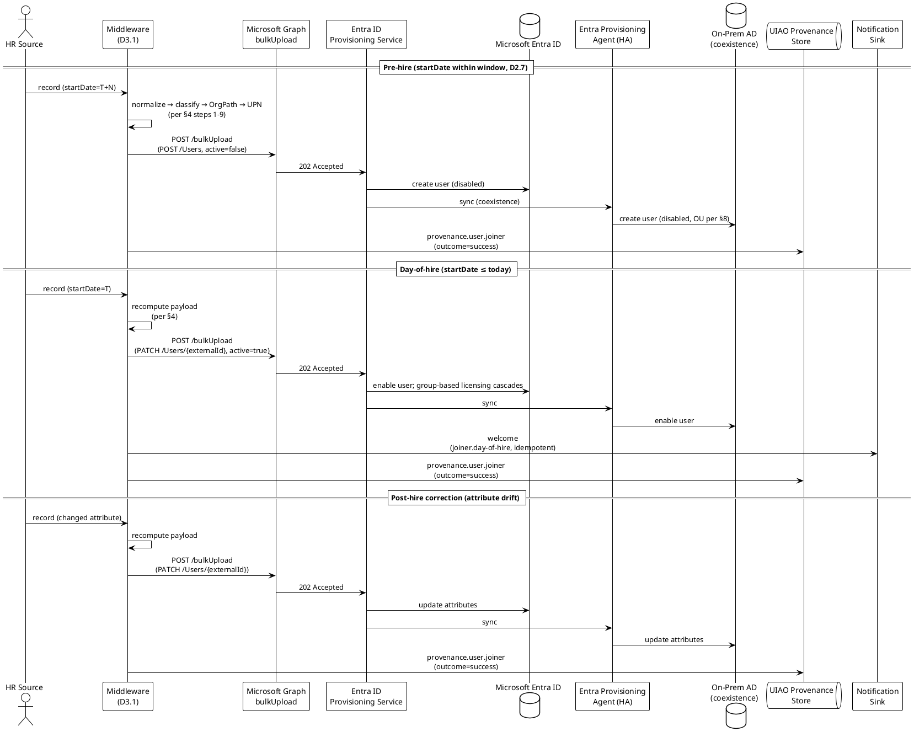

# Spec 2 — D2.1: Joiner Workflow Specification

> **Status (v0.2, 2026-05-01):** Initial verification pass against
> Microsoft Learn LCW reference complete. Confirmed: LCW joiner
> trigger category exists; LCW execution-condition trigger types
> include attribute-change + sign-in-activity + on-demand;
> per-user Entra ID Governance license is a prerequisite to RUN
> LCW workflows but NOT to operate the D2.1 substrate (LCW is a
> consumer, not a prerequisite). No corrections required.
> Workday inbound tutorial attribute mapping table remains
> unverified — see frontmatter `remaining_unverified`.

## 1. Purpose, Scope, and Reference

This deliverable is the canonical Joiner workflow specification called
for in
[`UIAO_136`](../UIAO_136_priority1-transformation-project-plans.md)
§SPEC 2 → Phase 2 → D2.1:

> *Complete joiner workflow: trigger conditions (hire date = today or
> pre-hire window), attribute population sequence, UPN generation,
> OrgPath assignment, OU placement (AD coexistence), group membership
> assignment, license assignment, manager link, welcome notification
> trigger. Include pre-hire vs. day-of-hire vs. post-hire timing.*

The Joiner workflow consumes the SCIM event vocabulary defined by
[`Spec2-D3.1`](./Spec2-D3.1-APIDrivenInboundProvisioningArchitecture.md)
§5.5 and operates on the canonical user shape from §5.2 of that same
document. D3.1 is the substrate; D2.1 is the joiner-side behavior.

### 1.1 Scope

In scope:

- The Joiner trigger surface — pre-hire window, day-of-hire,
  post-hire correction.
- The attribute-population sequence the middleware MUST execute
  before the SCIM event is emitted.
- The SCIM operation choice (POST vs. PATCH) and the `active` flag
  semantics across the joiner lifecycle.
- Manager link establishment, including the manager-not-yet-in-Entra
  case.
- License assignment timing and group-driven licensing interaction.
- AD-coexistence OU placement during the transition period.
- Welcome-notification trigger and integration points.
- The provenance event the Joiner workflow MUST emit
  (`provisioning.user.joiner` per D3.1 §8.2).

Out of scope:

- HR-system internals (handled by per-source schema normalizers per
  D3.1 §3.2).
- Lifecycle-Workflows-side joiner orchestration when Entra ID
  Governance is licensed — this spec describes the substrate
  guaranteed by UIAO; LCW is one consumer of the substrate, not a
  replacement for it.
- Mover / Leaver / Rehire / Conversion logic — see D2.2 / D2.3 /
  D2.4 / D2.5 respectively.
- Quarantine queue mechanics — see D2.6.

### 1.2 Audience

- Identity engineers wiring the middleware joiner branch.
- Service-desk and HR-system operators who need to understand the
  end-to-end timing of a new-hire account.
- Auditors verifying that joiner-class provisioning emits the
  control-evidence (AC-2, IA-4) required by NIST SP 800-53 Rev 5.

## 2. Joiner Trigger Surface

The Joiner workflow has three temporal modes, each with a distinct
trigger:

| Mode | Trigger condition | SCIM event | `active` value |
|---|---|---|---|
| Pre-hire | HR record present; `startDate` is in the future and within the pre-hire window (D2.7) | POST `/Users` | `false` |
| Day-of-hire | `startDate` ≤ today (UTC); record not yet `active: true` in Entra | PATCH `/Users/{externalId}` (or POST if no pre-hire pass) | `true` |
| Post-hire correction | HR record changed retroactively for a record already `active: true` | PATCH `/Users/{externalId}` | unchanged |

The middleware MUST evaluate the mode at the start of every record's
processing pass; the same record can transition pre-hire →
day-of-hire on a later sync cycle without re-evaluation by an
operator.

## 3. Pre-Conditions

Before a record is eligible for joiner processing, all of the
following MUST hold:

1. The HR source record satisfies the canonical schema from D1.1
   (required fields populated, validation rules passed).
2. The record passes the provisioning scope filter from D2.8
   (worker type, location, employment-status include rules).
3. `employeeId` is present and non-empty (the SCIM `externalId`
   correlation anchor — D3.1 §5.4).
4. `startDate` is parseable as a calendar date.
5. The pre-hire window (D2.7) is configured for the deployment.

Any record failing pre-conditions is routed to the quarantine queue
(D2.6 §3) with `failure_reason: schema-validation` or
`failure_reason: scope-filter` as appropriate. The middleware MUST
NOT silently skip such records.

## 4. Attribute Population Sequence

The middleware MUST populate the SCIM payload in the following order.
The order is normative because each step depends on the prior step's
output:

1. **Schema normalization (D3.1 §3.2 step 1).** HR-native record →
   canonical schema (D1.1).
2. **Worker-type classification (D1.6).** Determines license tier,
   group set, retention period, and OU placement under AD coexistence.
3. **OrgPath calculation (ADR-035 + ADR-048).** Department / division
   / location / cost-center → OrgPath. Stored in
   `extensionAttribute1` per D3.1 §5.2.
4. **UPN generation (D1.5).** First / last / domain → UPN, with
   diacritic transliteration and collision suffix. Stored in
   `userName` and `mail`.
5. **Display name composition.** Per tenant policy (default:
   `lastName, firstName`).
6. **Manager link resolution.** Look up the manager's `externalId` in
   Entra ID. If not found, see §6.
7. **Address / phone passthrough.** Optional fields from D1.1 are
   passed through unchanged; empty values are OMITTED, not written
   as empty strings (D3.1 §5.4).
8. **`active` flag computation.** Pre-hire → `false`; day-of-hire →
   `true`; post-hire correction → unchanged.
9. **SCIM payload assembly + canonical hash.** D3.1 §5.2 shape; the
   SHA-256 hash is captured for the provenance record (D3.1 §8.2).

Steps 1–8 are pure transformations on the in-memory record. Step 9
is the boundary at which the record is committed to the bulk batch.

## 5. SCIM Operation Choice

| Joiner mode | Existing record in Entra? | SCIM method | Path | `active` |
|---|---|---|---|---|
| Pre-hire (first pass) | No | POST | `/Users` | `false` |
| Pre-hire (subsequent pass, no changes) | Yes | _(no operation; record is up-to-date)_ | — | — |
| Pre-hire (subsequent pass, attribute change) | Yes | PATCH | `/Users/{externalId}` | unchanged (`false`) |
| Day-of-hire (first event for this record) | Yes (from pre-hire) | PATCH | `/Users/{externalId}` | `true` |
| Day-of-hire (no pre-hire pass occurred) | No | POST | `/Users` | `true` |
| Post-hire correction | Yes | PATCH | `/Users/{externalId}` | unchanged |

The middleware MUST use `externalId` (the HR `employeeId`), NOT the
Entra ID `id`, as the path parameter in PATCH operations. This
preserves the source-of-truth contract from D3.1 §5.4.

## 6. Manager Link Resolution

The HR record carries a `managerEmployeeId`. The middleware MUST
resolve it to a Microsoft Graph manager reference:

```json
"urn:ietf:params:scim:schemas:extension:enterprise:2.0:User": {
  "manager": { "value": "<manager externalId>" }
}
```

Resolution rules:

1. If the manager's `externalId` is present in the current bulk
   batch, the link is established by Entra's reconciliation pass
   after the batch processes — no special handling.
2. If the manager exists in Entra ID from a prior batch, the link
   resolves immediately on the next sync cycle.
3. If the manager is **not yet provisioned** (e.g., a new manager
   hired into the same wave), the middleware MUST still emit the
   `manager.value` reference. Entra ID's provisioning service
   tolerates dangling references and reconciles them on the next
   pass.
4. If `managerEmployeeId` is **empty or null** (e.g., agency head
   with no manager), the `manager` block is OMITTED entirely.
5. If `managerEmployeeId` references an `externalId` that has been
   `active: false` for longer than the tenant-configured stale
   window (default: 90 days), the record is routed to quarantine
   with `failure_reason: manager-stale`. The HR feed has a data
   quality issue.

The middleware MUST NOT block joiner provisioning on manager
resolution. A user with a dangling manager reference is still
provisionable; the link reconciles asynchronously.

## 7. License Assignment

License assignment is the responsibility of Entra ID group-based
licensing, NOT the middleware. The middleware's role:

1. Stamp the worker-type-derived **license-affinity attribute**
   (`employeeType` per D3.1 §5; or a tenant-specific
   `extensionAttribute2`).
2. Stamp the OrgPath in `extensionAttribute1`.
3. Emit the SCIM event.

Group-based licensing rules in Entra ID (defined out of band — they
are a tenant configuration, not a UIAO canonical artifact)
recompute group membership when these attributes change, and license
assignment cascades from group membership.

Timing: license assignment occurs on the `active: true` transition
(day-of-hire), NOT during pre-hire. Pre-hire accounts are
`active: false` and are excluded from group-based licensing rules
that filter on `accountEnabled eq true` (the canonical filter
template).

## 8. AD-Coexistence OU Placement

During the AD coexistence period (UIAO_007 sequencing), provisioned
records MUST also land in the on-prem AD via the Entra Provisioning
Agent (D3.1 §3.5). OU placement is determined by:

| HR attribute | AD OU path component |
|---|---|
| `workerType` (D1.6) | Top-level OU (`OU=Employees`, `OU=Contractors`, …) |
| `location` | Second-level OU (`OU=US-DC`, `OU=US-VA`, …) |
| `department` | Third-level OU (`OU=HRIT`, `OU=Finance`, …) |

The middleware MUST emit the OU placement as a `distinguishedName`
hint that the provisioning agent honors during AD writeback. The
mapping rules are the canonical artifact in D1.4. This document
binds the joiner-side timing: OU placement is computed at step 4 of
§4 (after worker-type classification) and is part of the SCIM
payload from the first POST onward.

## 9. Welcome Notification Trigger

The Joiner workflow MUST emit a welcome-notification event on the
day-of-hire transition (NOT on pre-hire creation):

| Field | Value |
|---|---|
| `event_type` | `joiner.day-of-hire` |
| `external_id` | HR `employeeId` |
| `upn` | The middleware-computed UPN |
| `manager_upn` | Resolved manager UPN (if available) |
| `start_date` | HR-side start date |

The notification sink is tenant-configurable: email, Teams, or a
queue consumed by an HR operations bot. The middleware MUST emit
exactly one welcome notification per `externalId` lifetime; idempotency
is keyed on `(externalId, joiner.day-of-hire)` and stored in the
provenance store (D3.1 §8.4) so retries do not re-notify.

## 10. Provenance Emission

The Joiner workflow emits the canonical provenance record from
[D3.1 §8.2](./Spec2-D3.1-APIDrivenInboundProvisioningArchitecture.md#82-provenance-record-shape)
with `event_type` set to `provisioning.user.joiner`. The
correlation block MUST include `external_id`, `upn`, and `orgpath`.

Control evidence emitted:

- **AC-2** — Account Management. Joiner is the canonical
  account-creation event.
- **IA-4** — Identifier Management. UPN and `externalId`
  registration.
- **AU-2** — Audit Events. The provenance record itself satisfies
  AU-2.

## 11. Sequence Diagram

The PlantUML source for the joiner sequence diagram lives at
[`docs/diagrams/spec2-d2.1-joiner-sequence.puml`](../../../../docs/diagrams/spec2-d2.1-joiner-sequence.puml).
The same source is reproduced inline so this document is
self-contained for review:



## 12. Failure Modes

The Joiner workflow delegates failure handling to D2.6. The
joiner-specific failure modes that the middleware MUST recognize are:

| Failure | `failure_reason` | Routing |
|---|---|---|
| Required attribute missing (D1.1 violation) | `schema-validation` | Quarantine (D2.6 §3) |
| UPN collision unresolvable | `upn-collision` | Quarantine; SLA: 1 business day |
| Manager `externalId` stale > 90 days | `manager-stale` | Quarantine; HR data quality issue |
| Worker type not in D1.6 taxonomy | `worker-type-unknown` | Quarantine; canonical taxonomy update required |
| Department not in OrgPath codebook (ADR-035) | `orgpath-codebook-miss` | Quarantine; codebook update required |
| HR `startDate` unparseable | `start-date-invalid` | Quarantine |
| Pre-hire window misconfigured | `prehire-window-config` | Operator alert; not record-specific |
| Graph 4xx (auth, permission, schema) | per D3.1 §6.1 | Retry-then-quarantine |
| Graph 429 / 5xx | per D3.1 §6.1 | Exponential backoff (D3.1 §6.2) |

## 13. Idempotency

The Joiner workflow MUST be idempotent:

1. The same HR record processed twice in the same sync cycle MUST
   produce exactly one SCIM operation (deduplication on `externalId`).
2. A pre-hire record processed N times across N sync cycles before
   the start date MUST result in exactly one POST `/Users` and zero
   or more PATCH operations only when an attribute actually
   changed.
3. The day-of-hire transition MUST occur exactly once per
   `(externalId)` lifetime, even if the start date is reprocessed
   (e.g., HR feed replay, operational backfill).
4. The welcome notification MUST fire exactly once per `externalId`
   lifetime per §9.

Idempotency is enforced by the provenance store (D3.1 §8.4). A
joiner.day-of-hire record with `outcome: success` for a given
`external_id` is the lock that prevents re-emission.

## 14. References

### 14.1 Primary canon

- [ADR-003 — API-Driven Inbound Provisioning as HR-Agnostic Canonical Path](../adr/adr-003-api-driven-inbound-provisioning.md)
- [ADR-035 — OrgPath Codebook Binding](../adr/adr-035-orgpath-codebook-binding.md)
- [ADR-048 — OrgPath Attribute Selection](../adr/adr-048-orgpath-attribute-storage-decision.md)
- [ADR-050 — D3.1 Reference Middleware Implementation Choices](../adr/adr-050-reference-middleware-implementation-choices.md)

### 14.2 UIAO docs

- [UIAO_007 — OrgTree Modernization (AD → Entra)](../UIAO_007_OrgTree_Modernization_AD_to_EntraID_v1.0.md)
- [UIAO_135 — Identity & Directory Transformation Inventory](../UIAO_135_identity-directory-transformation-inventory.md)
- [UIAO_136 — Priority 1 Transformation Project Plans](../UIAO_136_priority1-transformation-project-plans.md) — §SPEC 2 → Phase 2 → D2.1 (this deliverable's home).

### 14.3 Spec 2 sister deliverables

- [Spec2-D3.1 — API-Driven Inbound Provisioning Architecture](./Spec2-D3.1-APIDrivenInboundProvisioningArchitecture.md) — substrate this workflow runs on.
- [Spec2-D2.6 — Error Handling & Quarantine Specification](./Spec2-D2.6-ErrorHandlingQuarantineSpecification.md) — failure routing per §12.
- [Spec2-D2.7 — Pre-Hire Provisioning Window Specification](./Spec2-D2.7-PreHireProvisioningWindowSpecification.md) — pre-hire timing per §2.
- [Spec2-D2.8 — Provisioning Scope Filter Rules](./Spec2-D2.8-ProvisioningScopeFilterRules.md) — pre-condition #2.
- Spec2-D1.1 — canonical HR attribute schema (forthcoming).
- Spec2-D1.5 — UPN generation rules.
- Spec2-D1.6 — worker-type classification taxonomy.

### 14.4 Microsoft documentation (verification pending in v0.2)

- Microsoft Learn — Entra ID Lifecycle Workflows (joiner trigger
  semantics; for reconciliation against §2):
  `https://learn.microsoft.com/en-us/entra/id-governance/what-are-lifecycle-workflows`
- Microsoft Learn — Group-based licensing concepts (for §7 timing):
  `https://learn.microsoft.com/en-us/entra/identity/users/licensing-groups-assign`
- Microsoft Learn — Workday inbound provisioning tutorial (joiner
  attribute mapping reference):
  `https://learn.microsoft.com/en-us/entra/identity/saas-apps/workday-inbound-tutorial`

### 14.5 Drift, governance, and compliance

- NIST SP 800-53 Rev 5 controls cited in §10: AC-2, IA-4, AU-2.
