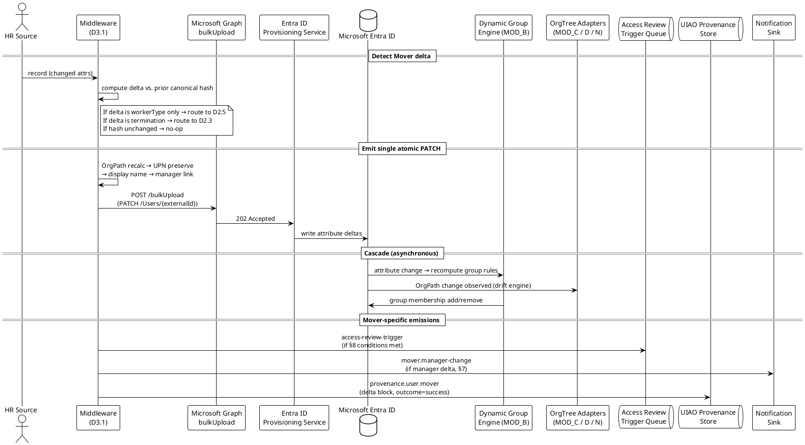

# Spec 2 — D2.2: Mover Workflow Specification

> **Status (v0.2, 2026-05-01):** Initial verification pass complete.
> Confirmed: LCW Mover trigger category exists; Attribute-changes
> trigger type substrate-aligns with §2 delta detection; GBL
> recomputes on attribute change. **Posture clarification:**
> disabled users are NOT auto-blocked from manual group
> assignments, so static-assigned-group postures MUST explicitly
> filter on `accountEnabled` for license-cost protection. No
> body corrections. Access Reviews trigger wire format remains
> unverified.

## 1. Purpose, Scope, and Reference

This deliverable is the canonical Mover workflow specification called
for in
[`UIAO_136`](../UIAO_136_priority1-transformation-project-plans.md)
§SPEC 2 → Phase 2 → D2.2:

> *Complete mover workflow: trigger conditions (department change,
> title change, location change, manager change, worker type change),
> attribute update sequence, OrgPath recalculation, dynamic group
> membership cascade, access review trigger, license reassignment
> (if tier changes), notification to old/new manager.*

The Mover workflow is the steady-state attribute-update path. It
operates on records that are already `active: true` in Entra ID and
emits PATCH operations against `externalId`. The workflow is
distinguished from the Conversion workflow (D2.5) by scope:
worker-type changes invoke D2.5; everything else stays in D2.2.

### 1.1 Scope

In scope:

- Mover trigger surface (which HR attribute deltas constitute a
  mover event).
- Attribute-update sequence and the PATCH payload contract.
- OrgPath recalculation rules.
- Dynamic group membership cascade (the OrgTree adapters react to
  the OrgPath write — D2.2 is not responsible for the cascade
  itself).
- Access review trigger conditions.
- License reassignment timing under group-based licensing.
- Old-manager / new-manager notification.

Out of scope:

- Worker-type changes — those are Conversion (D2.5).
- Termination — that is Leaver (D2.3).
- Pre-hire / day-of-hire — those are Joiner (D2.1).
- The OrgTree adapters' internal logic (entra-dynamic-groups,
  entra-admin-units, entra-device-orgpath, entra-policy-targeting).
  D2.2 emits the OrgPath; the adapters react.

## 2. Mover Trigger Surface

A Mover event is defined as a non-empty delta on **any** of the
following HR attributes for a record that is already `active: true`:

| HR attribute | Delta semantics | Cascade |
|---|---|---|
| `department` | Change in HR department code | OrgPath recalculation; dynamic group membership cascade |
| `division` | Change in HR division | OrgPath recalculation; dynamic group membership cascade |
| `jobTitle` | Change in HR title | Title-driven group memberships; access review may trigger |
| `location` | Change in HR work location | OrgPath recalculation; named-location-bound CA policies; license region (if `usageLocation` changes) |
| `costCenter` | Change in cost center code | OrgPath recalculation if cost-center is a codebook component (per ADR-035) |
| `managerEmployeeId` | Change in manager | Access review on direct-report subtree; old/new manager notification |
| `displayName` source fields (`firstName`, `lastName`, legal-name fields) | Change due to legal name change | UPN regeneration consideration (D1.5); display-name update |
| `phoneNumbers`, `addresses` | Pass-through update | None beyond attribute write |

The middleware MUST compute deltas against the **last successful
canonical payload hash** (per D3.1 §8.2) for that `externalId`. A
record whose canonical hash matches the prior pass is NOT a mover
event — no PATCH is emitted.

A change to `workerType` is **out of scope** for Mover: the worker
type change drives the Conversion workflow (D2.5). The middleware
MUST detect worker-type deltas and route them to D2.5 BEFORE
evaluating D2.2 trigger conditions on the same record.

## 3. Pre-Conditions

Before a record is eligible for Mover processing, all of the
following MUST hold:

1. The record is currently `active: true` in Entra ID (`accountEnabled
   eq true`).
2. The HR record passes scope filter rules (D2.8).
3. The HR record is **not** a worker-type delta (route to D2.5
   instead).
4. The HR record is **not** a termination event (route to D2.3
   instead).
5. The canonical payload hash differs from the prior pass.

Records failing pre-conditions are either no-ops (hash unchanged) or
routed to the appropriate sister workflow.

## 4. Attribute Update Sequence

When a Mover event is detected, the middleware MUST execute the
update sequence in the following order:

1. **OrgPath recalculation.** Department / division / location /
   cost-center change → OrgPath recompute per ADR-035 codebook +
   ADR-048 attribute selection.
2. **UPN reconsideration.** Legal-name-change branches of D1.5 may
   produce a new UPN. The default UIAO posture is **UPN
   immutability** during a mover event — the legacy UPN is preserved
   and the new name is reflected only in `displayName`. Tenant
   policy MAY override, with explicit ADR-level approval. v0.1
   defaults to UPN preservation.
3. **Display name composition.** Recompute per tenant policy.
4. **Manager link refresh.** `managerEmployeeId` change → resolve
   new manager's `externalId` reference; emit old/new manager
   notification (§7).
5. **Address / phone passthrough.** Update non-empty values; OMIT
   empty values (D3.1 §5.4).
6. **`active` flag.** Unchanged for Mover (always `true`).
7. **Canonical payload hash.** SHA-256 of the new payload; this is
   the basis for future delta detection.

## 5. SCIM Operation

| Mover sub-event | SCIM method | Path | Notes |
|---|---|---|---|
| Any Mover delta | PATCH | `/Users/{externalId}` | Single PATCH per record per sync cycle, even if multiple attributes changed simultaneously |

The middleware MUST NOT issue multiple PATCH operations per record
per sync cycle. The PATCH body carries all delta fields atomically.
Atomic update is necessary because dynamic group membership
recompute happens on attribute write — a stream of partial PATCHes
would cause membership churn.

PATCH payload shape (illustrative, against the SCIM 2.0 wire format
in D3.1 §5.3):

```json
{
  "schemas": ["urn:ietf:params:scim:api:messages:2.0:PatchOp"],
  "Operations": [
    { "op": "replace", "path": "displayName", "value": "Doe, Jane (Smith)" },
    { "op": "replace",
      "path": "urn:scim:schemas:extension:Microsoft:2.0:User:extensionAttribute1",
      "value": "GOV/EXEC/OPM/SECURITY" },
    { "op": "replace",
      "path": "urn:ietf:params:scim:schemas:extension:enterprise:2.0:User:department",
      "value": "Office of the Chief Information Security Officer" },
    { "op": "replace",
      "path": "urn:ietf:params:scim:schemas:extension:enterprise:2.0:User:manager.value",
      "value": "EMP-04412" }
  ]
}
```

## 6. OrgPath Recalculation

OrgPath recalculation is the load-bearing Mover effect. The OrgTree
adapters (MOD_B / C / D / N — ADR-036 through ADR-039) read
`extensionAttribute1` on every attribute-change event and recompute
their downstream state:

| Adapter | Recompute on OrgPath change |
|---|---|
| `entra-dynamic-groups` (MOD_B / ADR-036) | Re-evaluate dynamic group rules; add/remove user from groups |
| `entra-admin-units` (MOD_D / ADR-037) | Move user between AUs if AU is OrgPath-bound |
| `entra-device-orgpath` (MOD_C / ADR-038) | Propagate OrgPath to device records owned by the user |
| `entra-policy-targeting` (MOD_N / ADR-039) | Re-evaluate policy assignments (Intune, Azure Policy, CA) bound to OrgPath |

D2.2 does NOT directly invoke any of these adapters. The middleware
emits the OrgPath write; Entra ID's dynamic group engine drives MOD_B
and MOD_D natively, and the device + policy adapters react via the
drift engine (ADR-040) on the next observation pass.

The middleware MUST emit a single provenance record per Mover event
with the **old and new OrgPath** captured in the delta block:

```yaml
delta:
  orgpath:
    before: "GOV/EXEC/OPM/HRIT"
    after:  "GOV/EXEC/OPM/SECURITY"
  manager:
    before: "EMP-00789"
    after:  "EMP-04412"
```

This is the audit anchor for the dynamic group cascade. Drift
investigation (per ADR-040) correlates the membership change in
MOD_B against the OrgPath delta in this record.

## 7. Manager Change & Notification

A `managerEmployeeId` delta triggers an old-manager / new-manager
notification:

| Field | Value |
|---|---|
| `event_type` | `mover.manager-change` |
| `external_id` | HR `employeeId` of the moved user |
| `old_manager_upn` | UPN of prior manager |
| `new_manager_upn` | UPN of new manager |
| `effective_date` | HR-side mover effective date |

Notification timing: the notification fires on the same sync cycle
as the SCIM PATCH. The middleware MUST emit it through the same
notification sink as Joiner welcome notifications (D2.1 §9). Same
idempotency rule: keyed on
`(externalId, mover.manager-change, effective_date)` so retries do
not re-notify.

Manager-not-yet-provisioned: same posture as D2.1 §6 — the link
emits, Entra reconciles asynchronously. Quarantine only on stale
manager (default 90 days inactive).

## 8. Access Review Trigger

The Mover workflow MUST emit an **access-review trigger event** for
the moved user under the following conditions:

| Condition | Reason |
|---|---|
| `department` or `division` changed | Access scope likely changed |
| `jobTitle` changed AND title is in tenant's "elevated-title" list | Privileged access may need review |
| `managerEmployeeId` changed | Direct-report subtree access may need review |
| `location` changed across regions (e.g., US → EU) | Data-residency-bound access may need review |

The trigger is a queue event consumed by Entra ID Governance Access
Reviews (when the `entra-id-governance` adapter is active per
ADR-049) or by a tenant-specific access-review-orchestration tool.
The middleware does NOT directly start the review; it emits the
trigger.

Trigger event shape:

```yaml
event_type: mover.access-review-trigger
external_id: <employeeId>
upn: <UPN>
trigger_reasons:
  - department-change
  - manager-change
old_state:
  department: "HRIT"
  manager: "EMP-00789"
new_state:
  department: "Security"
  manager: "EMP-04412"
suggested_review_scope:
  - direct-report-tree
  - department-bound-groups
  - elevated-role-assignments
```

When `entra-id-governance` is reserved (current state per
ADR-049 / ADR-027 lifecycle), the middleware MUST still emit the
trigger event into the provenance store. It will be replayed when
the adapter activates.

## 9. License Reassignment

License reassignment under Mover follows the same posture as Joiner
(D2.1 §7): group-based licensing is the canonical mechanism, and
the middleware's role is to write the OrgPath / department / title /
worker-type attributes that drive group membership.

Mover-specific cases:

| Mover delta | License effect |
|---|---|
| Department change → new dynamic group → new license bundle | Automatic (group-based licensing) |
| Location change crossing license region | `usageLocation` change → license re-eval; some SKUs are region-restricted |
| Title change moving user into / out of an "elevated-license" group | Automatic via group-based licensing rule |

The middleware MUST ensure `usageLocation` reflects the new HR
location code on a Mover. Without this, region-restricted SKUs do
not reassign correctly. This is an explicit data-quality
requirement: the HR feed MUST emit a country code per D1.1; if
absent, the record is quarantined with `failure_reason: usage-
location-missing`.

## 10. Provenance Emission

The Mover workflow emits the canonical provenance record (D3.1
§8.2) with:

- `event_type: provisioning.user.mover`
- `delta` block with old/new values for the changed attributes (§6
  example)
- Control evidence: AC-2, AC-6 (least privilege — for the access
  review trigger), AU-2

Per-record provenance: one record per sync cycle per moved user
(consistent with the single-PATCH rule in §5).

## 11. Sequence Diagram

PlantUML source at
[`docs/diagrams/spec2-d2.2-mover-sequence.puml`](../../../../docs/diagrams/spec2-d2.2-mover-sequence.puml),
reproduced inline:



## 12. Failure Modes

Delegated to D2.6. Mover-specific failure surface:

| Failure | `failure_reason` | Routing |
|---|---|---|
| OrgPath recompute fails (codebook miss) | `orgpath-codebook-miss` | Quarantine; codebook update required |
| `usageLocation` missing on region-crossing mover | `usage-location-missing` | Quarantine; HR data quality issue |
| Manager `externalId` stale > 90 days | `manager-stale` | Quarantine |
| Department code not in OrgPath codebook | `orgpath-codebook-miss` | Quarantine |
| Concurrent Mover + Leaver in same cycle | `event-collision` | Mover is dropped; Leaver wins (per D2.3 precedence) |
| Graph errors | per D3.1 §6 | Standard retry / quarantine |

## 13. Idempotency

1. The same canonical payload hash MUST produce zero SCIM
   operations.
2. Replaying a Mover event (same delta, same record) MUST emit a
   single PATCH and a single provenance record per sync cycle.
3. Notification + access-review-trigger emissions MUST be idempotent
   on `(externalId, event_type, effective_date)`.

## 14. References

### 14.1 Primary canon

- [ADR-003 — API-Driven Inbound Provisioning](../adr/adr-003-api-driven-inbound-provisioning.md)
- [ADR-035 — OrgPath Codebook Binding](../adr/adr-035-orgpath-codebook-binding.md)
- [ADR-036 — entra-dynamic-groups (MOD_B)](../adr/adr-036-dynamic-group-provisioning.md)
- [ADR-037 — entra-admin-units (MOD_D)](../adr/adr-037-admin-unit-provisioning.md)
- [ADR-038 — entra-device-orgpath (MOD_C)](../adr/adr-038-device-plane-orgpath.md)
- [ADR-039 — entra-policy-targeting (MOD_N)](../adr/adr-039-policy-targeting.md)
- [ADR-048 — OrgPath Attribute Selection](../adr/adr-048-orgpath-attribute-storage-decision.md)
- [ADR-049 — Microsoft Modernization Adapter Coverage Expansion](../adr/adr-049-microsoft-adapter-coverage-expansion.md)

### 14.2 UIAO docs

- [UIAO_007](../UIAO_007_OrgTree_Modernization_AD_to_EntraID_v1.0.md)
- [UIAO_135](../UIAO_135_identity-directory-transformation-inventory.md)
- [UIAO_136](../UIAO_136_priority1-transformation-project-plans.md) — §SPEC 2 → Phase 2 → D2.2.

### 14.3 Spec 2 sister deliverables

- [Spec2-D3.1](./Spec2-D3.1-APIDrivenInboundProvisioningArchitecture.md) — substrate.
- [Spec2-D2.1 — Joiner](./Spec2-D2.1-JoinerWorkflowSpecification.md).
- [Spec2-D2.5 — Conversion](./Spec2-D2.5-ConversionWorkflowSpecification.md) — worker-type-change branch.
- [Spec2-D2.6 — Error Handling & Quarantine](./Spec2-D2.6-ErrorHandlingQuarantineSpecification.md).
- [Spec2-D2.8 — Provisioning Scope Filter Rules](./Spec2-D2.8-ProvisioningScopeFilterRules.md).

### 14.4 Microsoft documentation (verification pending in v0.2)

- Microsoft Learn — Lifecycle Workflows mover triggers.
- Microsoft Learn — Access Reviews on attribute change.
- Microsoft Learn — Group-based licensing region behavior.

### 14.5 Compliance

- NIST SP 800-53 Rev 5: AC-2, AC-6, AU-2.
