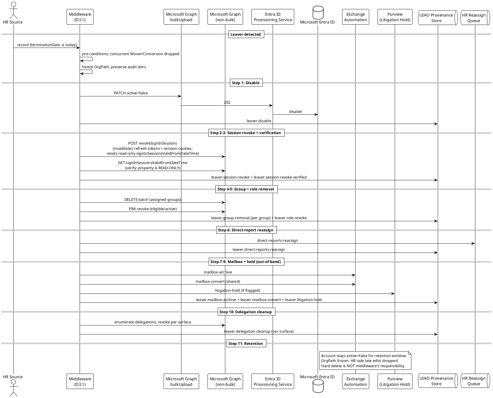

# Spec 2 — D2.3: Leaver Workflow Specification

> **Status (v0.2, 2026-05-01):** Initial verification pass against
> Microsoft Graph `revokeSignInSessions` reference + user resource
> type complete. **Material correction:** v0.1 named the user
> property `refreshTokensValidFromDateTime` (incorrect) and
> prescribed it as the step-3 write target (read-only per Microsoft
> Graph). v0.2 corrects the property name to
> `signInSessionsValidFromDateTime` and reframes step 3 as a
> verification read-back, since `revokeSignInSessions` (step 2) is
> the only canonical update path. Implementations following v0.1
> would have failed with read-only-property errors. Exchange
> shared-mailbox conversion, Purview litigation hold, and CAE
> propagation latency remain unverified — see frontmatter
> `remaining_unverified` block.

## 1. Purpose, Scope, and Reference

This deliverable is the canonical Leaver workflow specification called
for in
[`UIAO_136`](../UIAO_136_priority1-transformation-project-plans.md)
§SPEC 2 → Phase 2 → D2.3:

> *Complete leaver workflow: trigger conditions (termination date =
> today or pre-term window), account disable sequence (disable → sign
> out all sessions → revoke refresh tokens → remove from groups →
> archive mailbox → convert to shared mailbox → retain for litigation
> hold → delete after retention), OrgPath preservation for audit
> trail, manager reassignment of direct reports, delegated access
> cleanup.*

The Leaver workflow is the canonical termination path. It is the
**only** UIAO-canonical path that drives an account from `active:
true` to `active: false`. Hard delete is explicitly **out of scope**
(per D3.1 §5.5: the middleware never issues SCIM DELETE; retention
expiry is governed by tenant policy or Lifecycle Workflows).

### 1.1 Scope

In scope:

- Leaver trigger surface (termination date semantics, voluntary vs.
  involuntary, immediate-walk-out edge cases).
- The strict-ordered disable sequence (disable → revoke sessions →
  revoke refresh tokens → remove from access-granting groups →
  mailbox archival → shared-mailbox conversion → litigation-hold
  preservation → retention expiry).
- OrgPath preservation rules for audit traceability after `active:
  false`.
- Direct-report reassignment for the leaver's manager-link subtree.
- Delegated access cleanup (mailbox delegation, calendar
  delegation, SharePoint delegation chains).
- The provenance event the Leaver workflow MUST emit
  (`provisioning.user.leaver`).

Out of scope:

- Hard delete and retention expiry (governed by tenant policy /
  Lifecycle Workflows; D2.3 emits `active: false`, not DELETE).
- Rehire of a previously-leaver record — see D2.4.
- LOA / sabbatical — those are scope-filter cases (D2.8), not
  termination.
- Litigation-hold orchestration internals (the Exchange / Purview
  features that implement the hold).

## 2. Leaver Trigger Surface

The Leaver workflow has two temporal modes plus an out-of-band
emergency path:

| Mode | Trigger condition | Timing |
|---|---|---|
| Pre-term | HR `terminationDate` ≤ pre-term window threshold (typically `T - 0` to `T - 1` business day) | Account disabled at start of business on `terminationDate` |
| Day-of-term | HR `terminationDate` = today | Disable executes within the next sync cycle |
| Emergency / immediate | Out-of-band signal (HR-side flag `terminateImmediately: true` or operator-initiated quarantine) | Highest-priority dequeue; bypass batch wait |

The middleware MUST treat HR `terminationDate` as the source of
truth for non-emergency paths. Emergency path bypasses the HR feed
and is initiated through a dedicated middleware control endpoint
(implementation defined; out of scope for v0.1 of this spec — to
be covered in the runbook deliverable).

## 3. Pre-Conditions

Before a record is eligible for Leaver processing:

1. The record is currently `active: true` in Entra ID.
2. The HR record is **not** transitioning to a different
   `workerType` (that's D2.5 Conversion).
3. The HR record is **not** in an LOA / sabbatical state (those are
   D2.8 scope-filter cases — they remain `active: true` but with
   restricted access; UIAO does NOT treat LOA as a leaver).
4. `terminationDate` is parseable as a calendar date.

Concurrent Joiner / Mover deltas in the same cycle: **Leaver wins**.
A record receiving `terminationDate <= today` is processed only
through D2.3 in that cycle; any pending Mover / Conversion deltas
are dropped (and re-evaluable post-leaver only via the Rehire path).

## 4. The Strict-Ordered Disable Sequence

The disable sequence is normative. Each step has an audit purpose,
and reordering changes the security posture. The middleware MUST
execute the steps in this order, completing each before the next:

### Step 1: Disable account (`active: false`)

SCIM PATCH:

```json
{
  "schemas": ["urn:ietf:params:scim:api:messages:2.0:PatchOp"],
  "Operations": [
    { "op": "replace", "path": "active", "value": false }
  ]
}
```

This is the load-bearing security-posture change. From this point
forward, the user cannot acquire NEW tokens (interactive sign-in
fails). Existing tokens remain valid until step 3.

### Step 2: Sign out all sessions (refresh tokens + session cookies)

Microsoft Graph: `POST /users/{externalId}/revokeSignInSessions`.
This invalidates **both** refresh tokens issued to applications
**and** session cookies in the user's browser, by resetting the
user's `signInSessionsValidFromDateTime` property to the current
date-time. Access tokens already issued and in flight remain
valid until their own expiry (typically ≤1 hour, per Entra
defaults); CAE-aware applications observe the revocation event in
near-real-time.

Required Microsoft Graph permissions on the middleware's service
principal (least to most privileged): `User.RevokeSessions.All`,
`User.ReadWrite.All`, or `Directory.ReadWrite.All`. UIAO's default
posture is to grant `User.RevokeSessions.All` for the leaver
workflow specifically and avoid the broader scopes.

The middleware MUST issue this call separately from the SCIM
bulkUpload PATCH — it is a discrete Graph call against the user
resource.

### Step 3: Verify revocation took effect

`signInSessionsValidFromDateTime` is **read-only** on the user
resource per the Microsoft Graph schema; the only canonical write
path is `revokeSignInSessions` (step 2). The middleware MUST NOT
attempt to PATCH this property directly — Graph rejects the write
with a read-only-property error.

Step 3 is therefore a **verification step**, not a redundant
write: the middleware reads the user's
`signInSessionsValidFromDateTime` after step 2 and confirms it is
within an acceptable window of the operation's start time
(typically ≤30 seconds, accounting for replication latency). If
the read-back value precedes the operation start time, step 2 did
not take effect and step 1 (disable) is the only operative
revocation — the middleware MUST escalate to security incident per
§10 (`session-revoke-failed` failure_reason).

### Step 4: Remove from access-granting groups

The middleware MUST remove the user from all **statically-assigned**
groups (`group.assignmentType: assigned`). Dynamic groups self-
correct on the `active: false` write (membership rule normally
filters on `accountEnabled eq true`).

The removal pass uses a Graph batch:

```http
POST /$batch
{ "requests": [ { "id": "1", "method": "DELETE", "url": "/groups/{groupId}/members/{userId}/$ref" }, ... ] }
```

Group-removal scope is enumerated by reading
`/users/{externalId}/memberOf` filtered to assigned groups. The
removal pass MUST exclude:

- Distribution lists where the user is an active subscriber and
  removal would lose audit context (tenant-policy override).
- Groups marked `isAssignableToRole: true` (Privileged Identity
  Management requires explicit role removal — covered by step 5).

### Step 5: Revoke privileged role assignments

If the user holds any role assignments via PIM or directly:

- Eligible-role assignments → remove via Graph PIM API.
- Active-role assignments → expire immediately.

This step is a no-op for the typical end-user record; it applies
only to administrative accounts.

### Step 6: Reassign direct reports

If the user is a manager of N other records, those records' manager
links become dangling. The middleware MUST emit a
`leaver.direct-reports-reassign` event for each direct report,
with `suggested_new_manager_employee_id` set to the leaver's
manager (the leaver's chain-up).

The middleware does NOT directly write the new manager link on
the direct reports — that is an HR-side action. The HR feed is
expected to update the direct reports' `managerEmployeeId` within
a tenant-defined SLA (default: 5 business days). Until then, the
middleware tracks the reassignment in an open-ticket queue
visible to HR operations.

### Step 7: Mailbox archival

Out-of-band action via Exchange (or the messaging-platform
equivalent). The middleware emits a `leaver.mailbox-archive`
event consumed by an Exchange-side automation (out of scope for
v0.1; expected in the messaging adapter family per ADR-049
reserved slots).

### Step 8: Convert to shared mailbox

After archival, the mailbox is converted to a shared mailbox
(retains content; consumes no license). The middleware emits a
`leaver.mailbox-convert` event.

### Step 9: Apply litigation hold

If the leaver is subject to litigation hold per HR / legal flag,
apply the Purview litigation-hold policy. Emit
`leaver.litigation-hold` with the case reference.

### Step 10: Delegated access cleanup

For each of the following, enumerate and revoke:

- Mailbox delegations (Send-As, Send-On-Behalf, Full Access).
- Calendar delegations.
- SharePoint shared items (where the leaver is the share grantor).
- OneDrive shared items.
- Teams ownership transfers.

This is the **highest-noise** step — it requires a per-tenant
catalog of delegation surfaces. v0.1 establishes the requirement;
the per-surface enumeration runbook is a follow-on artifact.

### Step 11: Retention preservation

The account stays `active: false` for the tenant-defined
retention window (default: 90 days for federal civilian; agency
records may require longer per NARA schedule). Hard delete is
explicitly NOT issued by the middleware; that is governed by
tenant policy or Lifecycle Workflows after retention.

OrgPath preservation: `extensionAttribute1` is **frozen at
termination**. It is NOT recalculated on subsequent attribute
changes during retention (e.g., department reorg of a
terminated user's former org). This preserves audit traceability
of the user's last known organizational placement.

## 5. SCIM Operation Choice

| Sub-event | SCIM method | Path | Notes |
|---|---|---|---|
| Disable (step 1) | PATCH | `/Users/{externalId}` | `active: false` |
| Group removal (step 4) | Graph DELETE batches | `/groups/{groupId}/members/{userId}/$ref` | Not SCIM — Graph |

The middleware MUST emit step 1 as a single PATCH per leaver. The
Graph-only operations in steps 2–6 are out of band relative to the
SCIM bulkUpload contract.

## 6. OrgPath Preservation

OrgPath preservation under retention is a hard rule:

| Attribute | Preserved during retention? | Reason |
|---|---|---|
| `extensionAttribute1` (OrgPath) | YES | Audit traceability |
| `department` | YES | Audit traceability |
| `manager.value` | YES (frozen at termination) | Audit traceability |
| `displayName` | YES | Audit traceability |
| `usageLocation` | YES | License residue audit |
| `employeeId` / `externalId` | YES (immutable always) | Correlation anchor |
| `accountEnabled` (`active`) | NO — this is the change being made | The point of the workflow |

The middleware MUST NOT issue PATCH operations against a
`active: false` record's preserved attributes during the retention
window. Any HR-side delta against a terminated record during
retention is **dropped**. This protects against late-arriving HR
edits causing audit-trail revision.

## 7. Direct-Report Reassignment

Per step 6 above. The reassignment event shape:

```yaml
event_type: leaver.direct-reports-reassign
leaver:
  external_id: <employeeId>
  upn: <UPN>
  termination_date: <date>
direct_reports:
  - external_id: <emp1>
    upn: <upn1>
    suggested_new_manager_external_id: <leaver's manager's employeeId>
  - external_id: <emp2>
    upn: <upn2>
    suggested_new_manager_external_id: <leaver's manager's employeeId>
sla_business_days: 5
```

## 8. Provenance Emission

The Leaver workflow emits **one provenance record per executed
step** in the disable sequence. This is the only D2.x workflow where
multiple provenance records correspond to a single business event;
the granularity is required because each step is independently
auditable:

| Step | `event_type` | Control evidence |
|---|---|---|
| 1 | `provisioning.user.leaver.disable` | AC-2, AU-2 |
| 2 | `provisioning.user.leaver.session-revoke` | AC-12 (session termination) |
| 3 | `provisioning.user.leaver.session-revoke-verified` | AC-12 |
| 4 | `provisioning.user.leaver.group-removal` (one per group) | AC-2, AC-6 |
| 5 | `provisioning.user.leaver.role-revoke` | AC-2, AC-6 |
| 6 | `provisioning.user.leaver.direct-reports-reassign` | AC-2 |
| 7 | `provisioning.user.leaver.mailbox-archive` | AU-2 |
| 8 | `provisioning.user.leaver.mailbox-convert` | AU-2 |
| 9 | `provisioning.user.leaver.litigation-hold` | AU-11 (audit retention) |
| 10 | `provisioning.user.leaver.delegation-cleanup` (one per surface) | AC-2, AC-6 |

All records share the same `correlation` block (same `external_id`,
`upn`, `orgpath` at termination) so the leaver lifecycle can be
reassembled in the audit trail by querying that `external_id`.

## 9. Sequence Diagram

PlantUML source at
[`docs/diagrams/spec2-d2.3-leaver-sequence.puml`](../../../../docs/diagrams/spec2-d2.3-leaver-sequence.puml),
reproduced inline:



## 10. Failure Modes

Delegated to D2.6. Leaver-specific failure surface:

| Failure | `failure_reason` | Effect |
|---|---|---|
| Step 1 fails (Graph error on disable) | per D3.1 §6 | Retry; **subsequent steps blocked until step 1 succeeds**. The leaver record is effectively quarantined as `partial-disable` until resolved. |
| Step 2 fails (session revoke) | `session-revoke-failed` | Retry; tenant security alert if not resolved within 15 minutes |
| Step 4 fails on a single group | `group-removal-failed` | Per-group retry; record lists incomplete groups in quarantine |
| Direct-report reassignment SLA exceeded | `reassign-sla-breach` | Operator alert; HR escalation |
| Mailbox conversion failure | `mailbox-convert-failed` | Operator alert; mailbox remains in archive state |
| Late HR edit during retention | `late-edit-dropped` | Logged; not quarantined |

Critical: **partial leaver is the worst possible state.** A user
disabled in step 1 but not session-revoked in step 2 is a security
gap. The middleware MUST surface partial-leaver state to monitoring
within one sync cycle, and the runbook MUST require step-2 retry
before any new HR records process.

## 11. Idempotency

1. A leaver event for an already-`active: false` record is a no-op
   (no SCIM PATCH; provenance records are NOT re-emitted).
2. Each step's provenance record is idempotent on
   `(externalId, event_type, step_number)`.
3. Replaying the leaver workflow on a partially-leaver record MUST
   resume from the first incomplete step, not restart from step 1.
   The provenance store is the source of truth for which steps
   completed.

## 12. References

### 12.1 Primary canon

- [ADR-003 — API-Driven Inbound Provisioning](../adr/adr-003-api-driven-inbound-provisioning.md)
- [ADR-035 — OrgPath Codebook Binding](../adr/adr-035-orgpath-codebook-binding.md)
- [ADR-048 — OrgPath Attribute Selection](../adr/adr-048-orgpath-attribute-storage-decision.md)
- [ADR-049 — Microsoft Modernization Adapter Coverage Expansion](../adr/adr-049-microsoft-adapter-coverage-expansion.md)

### 12.2 UIAO docs

- [UIAO_007](../UIAO_007_OrgTree_Modernization_AD_to_EntraID_v1.0.md)
- [UIAO_135](../UIAO_135_identity-directory-transformation-inventory.md)
- [UIAO_136](../UIAO_136_priority1-transformation-project-plans.md) — §SPEC 2 → Phase 2 → D2.3.

### 12.3 Spec 2 sister deliverables

- [Spec2-D3.1](./Spec2-D3.1-APIDrivenInboundProvisioningArchitecture.md) — substrate; §5.5 establishes the no-DELETE rule.
- [Spec2-D2.4 — Rehire Workflow](./Spec2-D2.4-RehireWorkflowSpecification.md) — the inverse path during retention.
- [Spec2-D2.6 — Error Handling & Quarantine](./Spec2-D2.6-ErrorHandlingQuarantineSpecification.md).
- [Spec2-D2.7 — Pre-Hire Provisioning Window](./Spec2-D2.7-PreHireProvisioningWindowSpecification.md) — the timing-symmetric Joiner-side spec.

### 12.4 Microsoft documentation (verification pending in v0.2)

- Microsoft Graph — `revokeSignInSessions` API.
- Microsoft Graph — `signInSessionsValidFromDateTime` user-property semantics (read-only; verified 2026-05-01).
- Microsoft Graph — group `$ref` membership DELETE batch.
- Microsoft Learn — Continuous Access Evaluation (CAE) revocation.
- Microsoft Learn — Lifecycle Workflows leaver tasks.
- Microsoft Learn — Exchange shared-mailbox conversion.
- Microsoft Purview — litigation-hold policy reference.

### 12.5 Compliance

- NIST SP 800-53 Rev 5: AC-2, AC-6, AC-12, AU-2, AU-11.
- NARA records-retention schedules (federal civilian) inform the
  retention-window default.
