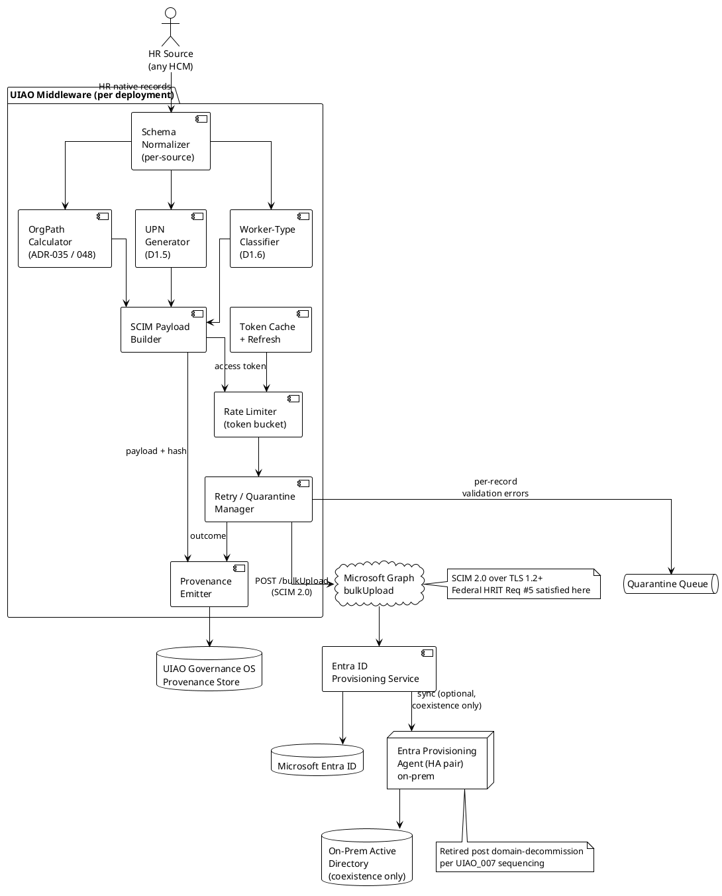

# Spec 2 — D3.1: API-Driven Inbound Provisioning Architecture

> **Verification status (v0.2):** Microsoft Learn-confirmed and
> deferred items are itemized in the `verification_history` block in
> the frontmatter above. **Material correction in v0.2:** §7.1
> throttling envelope was overstated by 5× in v0.1 (cited "~40 req/sec";
> actual published limit is 40 calls per 5-second window plus a
> tenant-daily cap). Implementations sized against the v0.1 figure
> need to revisit capacity assumptions.

## 1. Purpose, Scope, and Reference

This deliverable is the canonical technical architecture document
called for in
[`UIAO_136`](../UIAO_136_priority1-transformation-project-plans.md)
§SPEC 2 → Phase 3 → D3.1:

> *Canonical architecture diagram: HR System → Middleware/Integration
> Layer → Microsoft Graph bulkUpload API → Entra ID Provisioning
> Service → Entra ID (cloud) + Provisioning Agent → On-Prem AD
> (coexistence). Include: authentication flow, retry logic, rate
> limiting, payload format.*

The architectural decision is fixed by canon:
[`ADR-003`](../adr/adr-003-api-driven-inbound-provisioning.md) (status:
ACCEPTED) chose API-driven inbound provisioning via Microsoft Graph
`bulkUpload` as the UIAO canonical HR provisioning path. The
build-vs.-buy evidence is documented in
[`Spec2-D1.7-HRConnectorComparisonMatrix`](../../../../tools/discovery/Spec2-D1.7-HRConnectorComparisonMatrix.md).

The purpose of D3.1 is to make that decision concrete enough to
implement: every component, interface, message, and failure mode the
middleware layer must handle, and the canonical contract every UIAO
deployment must satisfy.

### 1.1 Scope

In scope:

- The end-to-end pipeline from HR system to Entra ID and on-prem AD
  (coexistence).
- The middleware layer's contract — inputs, outputs, transformations,
  failure modes, observability.
- Authentication flow against Microsoft Graph (service principal +
  certificate).
- SCIM 2.0 payload format constraints required by `bulkUpload`.
- Retry logic, rate limiting, quarantine handling.
- Provenance emission to UIAO Governance OS.
- HA, monitoring, and disaster-recovery posture.
- Federal HRIT (Solicitation 24322626R0007) Appendix A Req #5
  traceability.

Out of scope:

- HR system internals (Workday / Oracle HCM / SAP SuccessFactors data
  models) — covered by per-source schema-normalizer adapters that
  conform to the middleware's input contract.
- The OrgPath calculation algorithm itself — defined by
  [`ADR-035`](../adr/adr-035-orgpath-codebook-binding.md) and
  [`ADR-048`](../adr/adr-048-orgpath-attribute-selection.md).
- The JML workflow logic (Joiner / Mover / Leaver / Rehire /
  Conversion) — Spec 2 Phase 2 deliverables (D2.1–D2.8).
- The dynamic-group / admin-unit / device-plane / policy-targeting
  consumers downstream of provisioning — already governed by ADR-036
  through ADR-040 (the OrgTree MOD_B/C/D/N/M chain).

### 1.2 Audience

Implementation engineers building the middleware layer; UIAO
architecture reviewers; agency identity teams; auditors verifying
provisioning posture against NIST SP 800-53 controls (AC-2, IA-4, AU-2,
CM-8 in particular).

---

## 2. Architecture Overview

### 2.1 The canonical pipeline

```
┌────────────┐    ┌──────────────────┐    ┌─────────────────────┐
│ HR System  │ →  │ Middleware Layer │ →  │ Microsoft Graph     │
│ (any HCM)  │    │ (per-source      │    │  /bulkUpload        │
│            │    │  schema norm.    │    │  endpoint           │
│            │    │  + OrgPath calc  │    │                     │
│            │    │  + UPN gen       │    │                     │
│            │    │  + provenance    │    │                     │
│            │    │  emission)       │    │                     │
└────────────┘    └──────────────────┘    └──────────┬──────────┘
                                                     │
                          ┌──────────────────────────▼──────────┐
                          │ Entra ID Provisioning Service       │
                          │ (attribute mapping, quarantine,     │
                          │  Lifecycle Workflows trigger)       │
                          └─────┬───────────────────────┬───────┘
                                │                       │
                                ▼                       ▼
                       ┌─────────────────┐   ┌──────────────────────┐
                       │ Microsoft Entra │   │ Entra Provisioning   │
                       │ ID (cloud)      │   │ Agent (on-prem)      │
                       │  - User objects │   │  - HA pair (2+)      │
                       │  - Groups       │   │  - gMSA              │
                       │  - Licenses     │   └──────────┬───────────┘
                       │  - Manager link │              │
                       └─────────────────┘              ▼
                                                ┌─────────────────┐
                                                │ On-Prem Active  │
                                                │ Directory       │
                                                │ (coexistence    │
                                                │  only — write   │
                                                │  back during    │
                                                │  hybrid window) │
                                                └─────────────────┘
```

### 2.2 Why this shape

The shape is dictated by four constraints simultaneously:

1. **HR-vendor independence** (ADR-003 §Rationale §1). The middleware
   layer is the HR-specific seam; everything downstream of the
   `bulkUpload` call is identical regardless of HR source.
2. **OrgPath calculation in maintainable code** (ADR-035, ADR-048).
   OrgPath logic lives in the middleware, not in Entra provisioning
   expressions. Spec2-D1.7 §4.2 enumerates this as the primary
   structural advantage of API-driven over native connectors.
3. **Coexistence with on-prem AD** (UIAO_007). The Entra Provisioning
   Agent provides AD writeback during the hybrid window without
   requiring a parallel pipeline. The middleware never speaks to AD
   directly.
4. **UIAO Governance OS provenance** (UIAO_007 §3, UIAO_136 Cross-Cutting
   X4). Every provisioning event must produce a provenance record
   before the Graph API call returns. The middleware is the natural
   site for provenance emission because it is where the canonical
   payload is constructed.

### 2.3 What lives where (responsibility table)

| Concern | Owner | Surface |
|---|---|---|
| HR data extraction | Per-source schema-normalizer adapter | HR-system-specific code (one adapter per HR source) |
| Schema normalization to canonical attribute set | Middleware | Shared library; canonical schema defined in Spec2-D1.1 |
| OrgPath calculation | Middleware (calls OrgPath calculator) | Per ADR-035 codebook + Spec2-D1.2 translation rules |
| UPN generation (with collision resolution + diacritic transliteration) | Middleware (calls UPN generator) | Per Spec2-D1.5 rules; ~80-character transliteration table |
| Worker-type taxonomy enforcement | Middleware | Per Spec2-D1.6 taxonomy; rejects unknown types |
| Pre-hire / Joiner / Mover / Leaver / Rehire / Conversion logic | Middleware (event dispatchers) | Per Spec 2 Phase 2 (D2.1–D2.8) workflow specs |
| Microsoft Graph authentication | Middleware (token cache + refresh) | Service principal with certificate auth |
| `bulkUpload` SCIM payload construction | Middleware | Per §5 of this document |
| Entra ID attribute writes, JML enforcement | Entra ID Provisioning Service | Microsoft-managed; configured via attribute-mapping JSON |
| AD writeback (during coexistence) | Entra Provisioning Agent (on-prem) | Microsoft-managed; HA pair |
| Quarantine on systematic failure | Entra ID Provisioning Service (built-in) | Configured via the `bulkUpload` synchronization job |
| Provenance emission for governance | Middleware | One record per provisioning event; emitted before the Graph call returns |
| Drift detection across the pipeline | UIAO Governance OS (`substrate drift`) | Reads provenance + Entra audit log + AD audit log |

---

## 3. Component Specifications

### 3.1 HR system (any source)

The architecture is HR-system-agnostic by construction. The middleware
treats HR systems through a uniform contract: the middleware's input
is a stream of canonical worker records conforming to the
[Spec2-D1.1 canonical HR attribute schema](../UIAO_136_priority1-transformation-project-plans.md).

A per-source schema-normalizer adapter sits between the HR system and
the middleware. Each adapter has the same shape:

- **Input**: HR-system-native data (Workday WWS SOAP, Oracle HCM ATOM
  feed, SuccessFactors OData, generic CSV / SCIM, custom REST, etc.).
- **Output**: a stream of records in the canonical schema (D1.1).
- **Required fields**: every required field from D1.1 must be
  populated; missing fields go to quarantine (§6.3).
- **Optional fields**: passed through if present, omitted otherwise.

Spec 2 Phase 1 deliverables D1.1, D1.3, D1.4 define the canonical
schema and the per-source attribute mappings that adapters must
satisfy. Spec2-D1.7 §3 enumerates the four mainstream HR sources
(Workday, Oracle HCM, SAP SuccessFactors, any custom source).

### 3.2 Middleware layer

The middleware is the only UIAO-built component in the pipeline.
Microsoft does not provide it; UIAO does.

**Responsibilities:**

1. Accept canonical worker records from a schema-normalizer adapter.
2. Validate against the canonical schema (D1.1). Reject records with
   missing required fields to quarantine.
3. Compute OrgPath per ADR-035 + ADR-048 + D1.2.
4. Compute UPN per D1.5 (including diacritic transliteration and
   collision resolution).
5. Classify worker type per D1.6 taxonomy.
6. Construct the SCIM 2.0 `bulkUpload` payload per §5 of this
   document.
7. Authenticate to Microsoft Graph (§4) and call `bulkUpload`.
8. Handle retries (§6) and rate limits (§7).
9. Emit a UIAO Governance OS provenance record (§8) for every
   record processed (success or quarantine).
10. Surface monitoring telemetry (§10.2).

**Deployment options** (architecturally equivalent — pick per
operational fit):

| Option | When to choose |
|---|---|
| **Azure Functions** (Consumption / Premium plan) | Burst-driven (HR change events arrive sporadically); no sustained throughput floor; cheapest at low volume. |
| **Azure Logic Apps** (Standard) | Connector-rich (built-in HR connectors for Workday / SAP); preference for low-code; tolerance for higher latency. |
| **Containerized service** (ACA / AKS) | Sustained throughput; complex transformation logic; existing container investment; cross-cloud portability. |
| **Power Automate** (cloud flow) | Simple flows only; not recommended for production scale due to throttling. |

The architecture is functions-vs-containers-agnostic. The middleware
contract (§3.2 responsibilities) is what's canonical; the runtime is
not.

**Stateless invariant.** The middleware MUST be stateless. Every
record it processes is self-contained — the middleware does not
maintain a worker correlation index or attribute history. Stateful
services (correlation, deduplication) live in either the HR adapter
(upstream) or Entra ID itself (downstream).

### 3.3 Microsoft Graph `bulkUpload` API

The Graph API entry point for inbound provisioning. Microsoft-managed.

- **Endpoint**: a `bulkUpload` job under the synchronization API. The
  exact path is versioned by Microsoft; the middleware's HTTP client
  MUST resolve the endpoint via Graph metadata rather than hardcode
  the path. See §11.3 References for Microsoft Learn.
- **Wire protocol**: SCIM 2.0 (RFC 7643 / RFC 7644) over HTTPS. This
  is the load-bearing federal compliance point — Federal HRIT Req #5
  (SCIM 2.0 near-real-time provisioning) is satisfied here and only
  here.
- **TLS**: TLS 1.2 minimum; TLS 1.3 preferred. FIPS 140-2 required for
  GCC-Moderate operation.
- **Authentication**: OAuth 2.0 client credentials with a service
  principal. See §4.

The middleware does not call Entra ID or AD directly. All writes go
through `bulkUpload`. This single-entry-point invariant is what makes
SCIM 2.0 compliance and provenance emission tractable — there is one
egress point to instrument.

### 3.4 Entra ID Provisioning Service

The Microsoft-managed service that consumes the `bulkUpload` payload
and applies it to Entra ID + (via the Provisioning Agent) on-prem AD.

**What the middleware MUST configure on the synchronization job:**

1. **Attribute mapping JSON.** The mapping from canonical SCIM
   attributes (the middleware's output) to Entra ID user properties.
   This is configured once per tenant; it is not per-record.
2. **Scoping filter.** Per D1.6 worker-type taxonomy — agencies may
   choose to exclude certain worker types (interns, contractors)
   from JML automation by scoping the provisioning job.
3. **Quarantine threshold.** The number of repeated failures before
   the synchronization job auto-pauses. Default per Microsoft Learn;
   override per UIAO_136 §3.6 if deployment requires a tighter
   threshold.
4. **Lifecycle Workflows hook.** Optionally trigger LCW automation
   on Joiner / Leaver events. This is the integration point for
   per-tenant license assignment, group cascade, etc.

**What the service does on each `bulkUpload` call:**

1. Validates the SCIM payload against the configured schema.
2. Computes the diff against current Entra state (per worker).
3. Applies Entra-side attribute updates per the mapping JSON.
4. If AD writeback is configured, the Entra Provisioning Agent picks
   up the change and writes it to on-prem AD on its next sync cycle.
5. Emits provisioning logs (visible in the Entra portal and via Graph
   `provisioningObjectSummary`).

**What the middleware MUST NOT do:** override or duplicate any of the
above. The provisioning service is the authoritative seam for
Entra-side state; the middleware's role ends when the `bulkUpload`
call returns successfully.

### 3.5 Entra Provisioning Agent (on-prem, coexistence only)

For deployments with on-prem AD coexistence (the UIAO_007 hybrid
window), the Entra Provisioning Agent writes back to AD.

**Deployment requirements:**

| Requirement | Specification |
|---|---|
| HA pair count | 2+ agents minimum (3+ recommended for production) |
| Service account | gMSA (group Managed Service Account) |
| AD permissions | Create / Modify / Delete user objects in designated OUs. NOT domain admin. |
| Network path | Outbound HTTPS to `*.servicebus.windows.net` and the appropriate Microsoft Graph endpoint. No inbound. |
| OS | Windows Server 2019 or later; auto-updated via Microsoft Update. |
| Sizing | Per Microsoft Learn capacity guidance — TODO: verify against current Microsoft Learn during D3.1 v0.1 → v1.0 promotion. |

**Coexistence sunset.** The Provisioning Agent is required only during
the hybrid window. Once on-prem AD is decommissioned per the UIAO_007
domain-retirement sequencing, the agents are retired. The middleware
itself is not affected — it continues to call `bulkUpload` exactly as
before, with the synchronization job's AD writeback configuration
disabled.

---

## 4. Authentication Flow

### 4.1 Identity model

The middleware authenticates to Microsoft Graph as a **service
principal** using **certificate-based** OAuth 2.0 client credentials.

- **Service principal**: one per UIAO deployment. Created in the
  Entra ID tenant as part of the deployment runbook (D5.1 production
  cutover).
- **Authentication credential**: an X.509 certificate enrolled to the
  service principal. Client secrets MUST NOT be used. This is
  consistent with the
  [`entra-workload-identity`](../modernization-registry.yaml) reserved
  adapter slot's posture (per ADR-049) and ADR-004's
  workload-identity-federation-default doctrine.
- **Certificate rotation**: per UIAO_136 Spec 3 §Phase 4 governance.
  Default 90-day rotation; the middleware MUST handle in-flight
  rotation without provisioning downtime (overlap window of at least
  one rotation cycle).
- **Cert storage**: Azure Key Vault (recommended) or the runtime's
  native managed-identity-backed cert store (Azure Functions managed
  identity → Key Vault). The middleware MUST NOT read certs from the
  filesystem in production.

### 4.2 Required Microsoft Graph permissions

Application (not delegated) permissions on the service principal,
**verified against Microsoft Learn 2026-04-30**:

| Permission | Required | Purpose |
|---|---|---|
| `SynchronizationData-User.Upload` | **Required** | Submit SCIM payloads to `bulkUpload`. The core permission that makes API-driven provisioning work. |
| `ProvisioningLog.Read.All` | **Required** | Read provisioning logs to track per-record outcomes. Microsoft Learn lists this as part of the required permission set, not optional — the middleware needs it to surface success/failure status to monitoring (§10.2). |
| `SynchronizationData-User.Upload.OwnedBy` | Required for ISVs | Used when the API client is an ISV servicing tenants it doesn't own. Not required for first-party UIAO middleware in agency tenants. |
| `User.Read.All` | Optional | Only if the middleware does correlation pre-checks before bulkUpload. Default UIAO posture is to let Entra handle correlation, so this can usually be omitted. |
| `Application.Read.All` | Optional | Health checks against the synchronization job state. Useful for monitoring; not load-bearing for provisioning itself. |

**Principle of least privilege.** The middleware MUST NOT request
broader permissions (e.g., `Directory.ReadWrite.All`,
`User.ReadWrite.All`). The service principal's permissions surface IS
the security boundary; over-scoping it is the most common provisioning
security incident pattern. NIST controls AC-6, AC-6(2) apply.

**Tenant license requirement.** Microsoft Learn states API-driven
inbound provisioning requires Microsoft Entra ID P1, P2, or Microsoft
Entra ID Governance license. The Governance license raises the daily
throttling limit (§7.1) — relevant for large-tenant deployments.

### 4.3 Token acquisition flow

```
Middleware                       Entra ID v2.0 token endpoint
   │                                       │
   │  POST /{tenant}/oauth2/v2.0/token     │
   │     grant_type=client_credentials     │
   │     client_id={sp-app-id}             │
   │     client_assertion_type=...:jwt-bearer
   │     client_assertion={signed JWT}     │
   │     scope=https://graph.microsoft.com/.default
   ├──────────────────────────────────────►│
   │                                       │ verify cert chain
   │                                       │ verify JWT signature
   │                                       │ check SP enabled + scoped
   │                                       │ issue access_token (~1 hr TTL)
   │◄──────────────────────────────────────┤
   │  { access_token, expires_in }         │
   │                                       │
   │ cache token in-memory (per process)   │
   │ refresh @ 80% of TTL                  │
```

**Implementation requirements:**

1. **Token cache**: in-memory only, per middleware process. Tokens MUST
   NOT be persisted to disk or shared across processes.
2. **Refresh policy**: refresh proactively at 80% of declared TTL (a
   typical 60-min token refreshes at 48 min remaining). Never wait for
   the token to expire and a 401 to come back.
3. **Concurrent refresh**: single-flight (one refresh in flight per
   process at a time). Use a mutex or async lock to prevent
   thundering-herd refreshes under load.
4. **Failure mode**: if token acquisition fails, the middleware MUST
   surface the failure to monitoring (§10.2) and retry per §6.1
   (transient-failure handling). Provisioning calls MUST NOT proceed
   without a valid token.

### 4.4 Audit emission

Every successful token acquisition emits a debug-level log entry. Every
token-acquisition failure emits an error-level entry that flows to
UIAO Governance OS (§8). Token contents (the access token itself) MUST
NOT be logged.

---

## 5. Payload Format

### 5.1 SCIM 2.0 baseline

The `bulkUpload` endpoint accepts SCIM 2.0 payloads per RFC 7643
(schema) and RFC 7644 (protocol). Each payload represents a batch of
provisioning operations against `User` resources.

The middleware constructs payloads in the canonical SCIM 2.0 user
schema with Microsoft-specific extensions. The schema declared on the
synchronization job determines which extensions are accepted.

### 5.2 Canonical user object shape

A typical user payload element looks like:

```json
{
  "schemas": [
    "urn:ietf:params:scim:schemas:core:2.0:User",
    "urn:ietf:params:scim:schemas:extension:enterprise:2.0:User"
  ],
  "externalId": "EMP-12345",
  "userName": "jane.doe@agency.gov",
  "name": {
    "givenName": "Jane",
    "familyName": "Doe"
  },
  "displayName": "Doe, Jane",
  "active": true,
  "emails": [
    { "value": "jane.doe@agency.gov", "type": "work", "primary": true }
  ],
  "phoneNumbers": [
    { "value": "+1-202-555-0100", "type": "work" }
  ],
  "addresses": [
    {
      "type": "work",
      "streetAddress": "1800 G Street NW",
      "locality": "Washington",
      "region": "DC",
      "postalCode": "20006",
      "country": "US"
    }
  ],
  "urn:ietf:params:scim:schemas:extension:enterprise:2.0:User": {
    "employeeNumber": "EMP-12345",
    "department": "Office of Personnel Management",
    "manager": { "value": "EMP-00789" }
  },
  "urn:scim:schemas:extension:Microsoft:2.0:User": {
    "extensionAttribute1": "GOV/EXEC/OPM/HRIT",
    "usageLocation": "US",
    "preferredLanguage": "en-US"
  }
}
```

Notable canonical bindings:

- `externalId` MUST be the `employeeId` from the canonical schema
  (D1.1). It is the correlation anchor between HR and Entra.
- `userName` MUST be the UPN computed by the UPN generator (D1.5).
- `extensionAttribute1` MUST be the OrgPath computed per ADR-035 +
  ADR-048. This is the load-bearing field for the OrgTree
  (`entra-dynamic-groups` MOD_B, `entra-admin-units` MOD_D,
  `entra-device-orgpath` MOD_C, `entra-policy-targeting` MOD_N all
  read it).
- `active` MUST reflect the worker's HR-side employment status (true
  for active, false for terminated / on-leave / pre-hire-not-yet-
  active).

### 5.3 Bulk envelope shape

Multiple users are bundled per `bulkUpload` request (the API is
explicitly bulk-oriented, not single-record):

```json
{
  "Operations": [
    {
      "method": "POST",
      "bulkId": "op-1",
      "path": "/Users",
      "data": { /* user object as in §5.2 */ }
    },
    {
      "method": "PATCH",
      "bulkId": "op-2",
      "path": "/Users/EMP-67890",
      "data": { /* attribute updates */ }
    }
  ],
  "schemas": [
    "urn:ietf:params:scim:api:messages:2.0:BulkRequest"
  ]
}
```

**Batch sizing.** Per Microsoft Learn (verified 2026-04-30):

> *"ensure that your SCIM bulk payloads are optimized to include up to
> 50 operations per API call."*

The middleware MUST:

1. Target 50 operations per `bulkUpload` call as the optimal batch
   size (the Microsoft-recommended ceiling).
2. Spill to the next batch when 50 operations is reached.
3. Treat 50 as the optimization target, not a hard limit. If
   Microsoft raises the limit in a future version, the middleware
   reads it from the synchronization job's metadata at startup
   rather than hardcoding the value.
4. Recognize that the batch size interacts with §7.1 throttling: at
   50 ops/call, the daily tenant limit (2,000 or 6,000 calls per 24h)
   imposes a daily worker-record ceiling of 100,000 (P1/P2 license)
   or 300,000 (Governance license). For deployments larger than that,
   the initial bulk load must be spread across multiple days.

### 5.4 Required field set

Per the Spec2-D1.1 canonical schema, the following SCIM fields MUST be
populated on every record:

| SCIM field | Canonical source (D1.1) | Notes |
|---|---|---|
| `externalId` | `employeeId` | Correlation anchor; immutable across record updates. |
| `userName` | UPN generator output (D1.5) | Includes diacritic transliteration + collision suffix where required. |
| `name.givenName` | `firstName` | Diacritics preserved (transliteration is for UPN, not display name). |
| `name.familyName` | `lastName` | Same. |
| `displayName` | `displayName` (HR) or `lastName, firstName` (computed) | Tenant policy decides format. |
| `active` | derived from HR `employmentStatus` | True/false; pre-hire-not-yet-active is `false`. |
| `extensionAttribute1` | OrgPath calculator output | Per ADR-035 codebook + ADR-048 attribute selection. |
| `usageLocation` | `country` (HR) | Required for M365 license assignment. |
| `enterprise:User.employeeNumber` | `employeeId` | Same source as `externalId`. Both required by Microsoft. |

Optional fields (passed through if present): department, manager,
phone numbers, address fields, jobTitle, preferredLanguage. The
middleware MUST NOT inject empty-string values for unset optional
fields — omit the key entirely.

### 5.5 Provisioning intent (write-vs-disable)

The middleware encodes intent through `active` and the SCIM operation
method:

| HR event | SCIM operation | `active` value |
|---|---|---|
| Pre-hire (account before start date) | POST `/Users` | `false` (until start date) |
| Joiner (start date reached) | PATCH (or POST if not yet created) | `true` |
| Mover (attribute change) | PATCH `/Users/{externalId}` | `true` (unchanged) |
| Leaver (termination) | PATCH `/Users/{externalId}` | `false` |
| Rehire | PATCH `/Users/{externalId}` | `true` |

The middleware MUST NOT issue DELETE operations. Hard delete is the
purview of Entra Lifecycle Workflows (or per-tenant retention policy)
operating on `active: false` accounts after the tenant-defined
retention window. This is consistent with UIAO_136 §Spec 2 Phase 2
Leaver workflow specification (D2.3).

---

## 6. Retry Logic

### 6.1 Failure taxonomy

Three classes of `bulkUpload` failure, with distinct handling:

| Class | HTTP signal | Cause | Middleware response |
|---|---|---|---|
| **Transient** | 429, 503, network timeout, 5xx | Throttling, transient service issue, network blip | Retry with exponential backoff (§6.2). Up to 5 attempts. |
| **Per-record validation** | 200 with per-`bulkId` error in response | Required field missing, invalid value, schema violation on a single record | Quarantine just that record (§6.3). Other records in the batch succeed. |
| **Authorization** | 401, 403 | Token expired, permission revoked, service principal disabled | Force token refresh; if still 401/403, page on-call (§10.2). Do not retry indefinitely. |

The single-failure-mode trap to avoid: treating a 429 as a per-record
validation error, or treating a per-record validation error as a
transient failure. The retry envelope must distinguish these
classes — a misclassified 429 will burn the retry budget on records
that are actually fine; a misclassified validation error will retry a
record that will never succeed.

### 6.2 Exponential backoff

For transient failures (Class 1):

| Attempt | Delay before retry |
|---|---|
| 1 (initial call) | n/a |
| 2 | 1 second + jitter (0–500 ms) |
| 3 | 4 seconds + jitter |
| 4 | 16 seconds + jitter |
| 5 | 64 seconds + jitter |
| 6 (if reached) | escalate; do not retry further automatically |

**Honor `Retry-After`.** When the response includes a `Retry-After`
header (typical for 429 throttling), the middleware MUST wait at
least that long, even if the exponential schedule would have retried
sooner.

**Jitter is required.** Without jitter, multiple middleware instances
that hit the same throttle will retry at the same instant and
re-throttle. The 0–500 ms uniform jitter is the minimum acceptable
spread.

### 6.3 Quarantine

For per-record validation errors (Class 2):

1. The failing record is logged to the **quarantine queue** — a UIAO-
   maintained store (Azure Storage Queue, Service Bus, or equivalent;
   choice is operational, not architectural).
2. The remaining records in the batch are committed normally.
3. A UIAO Governance OS provenance record is emitted for the
   quarantined record with the per-`bulkId` error from Microsoft as
   the failure reason.
4. The quarantine is monitored (§10.2). A threshold of N records
   within a rolling window triggers an alert; default N is 10
   records / 1 hour, override per tenant.
5. Quarantined records are remediated through the Spec 2 Phase 2
   D2.6 quarantine remediation workflow — manual review, fix the
   upstream HR data or transformation logic, re-submit.

The middleware's `bulkUpload` synchronization job ALSO has a
Microsoft-managed quarantine-on-systematic-failure mode (the whole
sync job auto-pauses if too many records fail in succession). This is
distinct from the per-record quarantine above; the two are
complementary, not redundant.

---

## 7. Rate Limiting

### 7.1 Microsoft Graph throttling envelope

Microsoft enforces per-tenant and per-application throttling on
`bulkUpload`. Per Microsoft Learn (verified 2026-04-30) the published
envelope has **two distinct limits** that the middleware must respect:

**Burst limit (per 5-second window):**

> *"There is a limit of 40 API calls within any 5-second window. If
> this threshold is exceeded, the service returns an HTTP 429 (Too
> Many Requests) response."*

That is **40 calls / 5 seconds = 8 calls/sec average peak** —
materially tighter than ADR-003 §Consequences §Negative's earlier
"~40 requests/second" planning estimate. **The earlier estimate was
incorrect by a factor of 5; this section supersedes it.** ADR-003 is
not amended (the Decision field is immutable per CR-003), but
implementations MUST use the verified figure here.

**Daily tenant limit:**

> *"There is a tenant-level limit of 2,000 API calls per 24-hour
> period under the Entra ID P1/P2 license, and 6,000 API calls under
> the Entra ID Governance license. Exceeding these limits results in
> an HTTP 429 (Too Many Requests) response."*

At the §5.3 batch optimization target of 50 operations/call:

| License tier | Daily call cap | Daily worker-record cap (50 ops/call) |
|---|---|---|
| Entra ID P1 / P2 | 2,000 | 100,000 |
| Entra ID Governance | 6,000 | 300,000 |

Practical implications:

- **Daily delta sync** for typical agency populations (a 100k-worker
  agency with ~1% daily churn = ~1,000 events/day) sits well within
  either tier.
- **Initial bulk load** for large tenants requires planning. A
  400,000-worker tenant on Entra ID Governance license needs at least
  ~1.5 days for initial sync; on P1/P2 license, ~4 days. The
  middleware MUST handle multi-day initial sync gracefully (resume on
  daily-limit reset, not fail).
- **The Governance license tier is a real operational difference**,
  not just a feature gate. For large federal tenants the tier choice
  shapes the cutover timeline.

### 7.2 Middleware-side throttle

The middleware MUST implement two complementary rate limiters, sized
at 80% of each published limit (§7.1) to leave headroom for monitoring
calls, jitter, and Microsoft's actual-vs-published-envelope variance:

| Limiter | Sized at | Equivalent |
|---|---|---|
| Burst (token bucket) | 32 calls per 5-second window | ~6.4 calls/sec average peak |
| Daily (sliding window) | 1,600 calls/24h (P1/P2) or 4,800 calls/24h (Governance) | ~80% of the §7.1 daily cap |

Both limiters are required because the daily limit is independently
enforced — burst-staying-under-budget alone does not prevent hitting
the daily cap on a high-churn day.

When either limiter denies a call, the middleware MUST queue the next
`bulkUpload` request rather than spin-wait or fail. Queue depth is a
key health signal (§10.2):

- **Burst-limiter queue depth growth** → deployment is undersized for
  current arrival rate; horizontal scale-out or batching efficiency
  improvements help.
- **Daily-limiter queue depth growth** → either an unexpected mass
  HR-side change (a reorganization), a license-tier mismatch (large
  tenant on P1/P2 needs Governance), or a stuck retry storm
  consuming the daily budget. Different remediation in each case;
  monitoring MUST distinguish them.

### 7.3 Bulk batching as a throughput multiplier

`bulkUpload` is bulk; the throughput envelope is calls-per-second, not
records-per-second. Batching N records into one call multiplies
effective throughput by N (subject to the §5.3 batch ceiling).

A correctly-sized middleware therefore:

1. Buffers incoming canonical records in a short-window queue (typical:
   5–30 seconds).
2. Constructs the largest batch the §5.3 ceiling allows when the
   buffer flushes.
3. Flushes on either time threshold (the 5–30 sec window) or size
   threshold (the §5.3 ceiling), whichever fires first.
4. Surfaces buffer depth and flush-latency metrics to monitoring.

This is the difference between a deployment that handles 100,000-worker
agency loads on a single function-app instance and one that requires
horizontal scaling. Get the batching right.

### 7.4 Backpressure

If the middleware cannot drain the buffer fast enough (sustained
arrival rate exceeds sustained drain rate even with batching), it MUST
exert backpressure on the HR adapter rather than drop records. The
adapter pauses extraction; HR-side state is durable, so the records
remain available for retry.

The middleware MUST NOT silently drop records under load. Lost
provisioning events are the worst possible failure mode — they manifest
days later as missing user accounts or accounts that fail to disable.

---

## 8. Provenance Emission

### 8.1 Why provenance lives in the middleware

UIAO Governance OS requires every provisioning event to produce a
provenance record (UIAO_007 §3, UIAO_136 Cross-Cutting X4). Three
candidate sites for that emission:

| Site | Pro | Con |
|---|---|---|
| HR adapter (upstream) | Sees raw HR data | Pre-transformation; cannot record OrgPath / UPN final values |
| **Middleware** | Sees full canonical record + final transformations + Graph response | UIAO-built (the easiest place to instrument) |
| Entra audit log (downstream) | Microsoft-maintained | Doesn't see the canonical record; fields like middleware-computed OrgPath are not directly traceable |

The middleware is the only site that sees both the canonical input AND
the final transformed output AND the success/failure outcome. UIAO
Governance OS provenance is therefore emitted from the middleware, one
record per provisioning event, before the call returns to the HR
adapter.

### 8.2 Provenance record shape

Each provenance record SHALL include:

```yaml
provenance_id: <UUIDv4>
emitted_at: <ISO-8601 UTC timestamp>
event_type: provisioning.user.<joiner|mover|leaver|rehire|conversion|prehire>
correlation:
  external_id: <employeeId from HR>
  upn: <middleware-computed UPN>
  orgpath: <middleware-computed OrgPath>
source:
  hr_system: <Workday|OracleHCM|SAPSF|generic|...>
  adapter_version: <semver>
  hr_record_extracted_at: <timestamp>
middleware:
  version: <semver>
  orgpath_calculator_version: <semver>
  upn_generator_version: <semver>
  worker_type_taxonomy_version: <semver>
graph_call:
  endpoint: <bulkUpload URL resolved at runtime>
  http_status: <int>
  request_id: <Microsoft request id from response header>
  bulk_id: <SCIM bulkId for this record>
outcome: <success|quarantine|retry-exhausted|auth-failure>
failure_reason: <string, present only on non-success>
control_evidence:
  - AC-2     # account management
  - IA-4     # identifier management
  - AU-2     # audit events
  - CM-8     # information system component inventory
canonical_payload_hash: <SHA-256 of the SCIM payload>
```

The `canonical_payload_hash` is the integrity anchor. The full SCIM
payload is logged to a tenant-scoped audit store; the hash in the
provenance record proves which payload corresponds to this provisioning
event, even if the audit store is purged on retention rotation.

### 8.3 Emission timing

The middleware MUST emit the provenance record:

1. **Before** the `bulkUpload` HTTP call returns to the caller. The
   record is part of the synchronous transaction; if provenance
   emission fails, the provisioning event is treated as failed.
2. **After** the canonical payload is fully constructed (so the hash
   is final).
3. **In the same atomic operation** as the Graph call where possible.
   If Graph fails, the provenance record records that failure; if
   provenance emission fails, the Graph call is rolled back (in
   practice: surface to monitoring and let the retry path re-attempt
   the whole transaction).

The middleware MUST NOT batch provenance records across multiple
provisioning events. One record per event is non-negotiable for
auditability.

### 8.4 Sink

The provenance sink is configurable per deployment:

| Sink | When to choose |
|---|---|
| Azure Storage Append Blob | Default. Cheap, durable, immutable per blob. |
| Azure Event Hub | When provenance feeds a downstream SIEM stream. |
| UIAO Governance OS native sink | Once the Governance OS provenance API is GA (currently in progress per UIAO_007). |

The sink contract is write-only-append; the middleware MUST NOT update
or delete prior records. Retention is governed by the deployment's
audit retention policy (default 7 years per Spec 2 §Phase 5 §D5.3).

---

## 9. Architecture Diagram (PlantUML)

The canonical PlantUML source for the architecture diagram lives at
[`docs/diagrams/spec2-d3.1-architecture.puml`](../../../../docs/diagrams/spec2-d3.1-architecture.puml).

The same PlantUML source is reproduced inline here so this document
is self-contained for review:



The diagram is descriptive, not load-bearing; the canonical contract
is in §2–§8 of this document. The diagram is included in this version
of D3.1 as inline PlantUML source so the document is self-contained
during initial review. The standalone `.puml` file is added in a
follow-up commit so it can be rendered by the existing UIAO PlantUML
tooling chain.

---

## 10. Operational Considerations

### 10.1 High availability

The middleware MUST be horizontally scalable and stateless (per §3.2).
Concrete posture:

| Concern | Posture |
|---|---|
| Instance count | 2+ for production; 3+ in regions with active-active expectation |
| Failover | Stateless instances allow cold replacement; in-flight `bulkUpload` calls are idempotent (Entra dedupes by `externalId`), so replays are safe |
| Token cache | Per-instance; cold start re-acquires; this is a 1–2 second one-time cost |
| Queue durability | The HR-side input queue + the quarantine queue MUST survive instance restart. Use durable Azure Storage / Service Bus, not in-memory only |
| Region | Single GCC-Moderate region; cross-region failover is out of scope for v0.1 of this architecture |

### 10.2 Monitoring

Required telemetry surface (every metric SHOULD have alerting):

| Metric | Alert threshold | Why |
|---|---|---|
| `bulkUpload` success rate | < 99% over 1 hour | Indicates systemic issue (auth, schema, throttling) |
| Per-record quarantine rate | > 10 / hour | Indicates HR data quality issue |
| Token-acquisition failures | > 0 in 5 min | Indicates cert / SP / Entra issue |
| Rate limiter queue depth | sustained > 50% capacity | Indicates undersized deployment |
| HR-side input queue depth | sustained growth | Indicates middleware drain rate insufficient |
| End-to-end latency (HR record received → Graph response) | p99 > 60 sec | Indicates either throttling or middleware capacity issue |
| Cert expiry countdown | 30 days remaining | Indicates rotation should be scheduled |
| Provisioning Agent health (when used) | any agent offline > 5 min | Indicates AD writeback at risk |

The metric set is deliberately small. More metrics is not better; the
question is what would page on-call at 3 AM and what would not.

### 10.3 Disaster recovery

| Failure | Recovery posture |
|---|---|
| Middleware instance crash | Auto-restart; queues are durable; in-flight idempotent |
| All middleware instances offline | HR adapter pauses extraction (backpressure §7.4); HR state remains; resume on middleware return; SLA budget: 4 hours |
| Microsoft Graph regional outage | `bulkUpload` returns 5xx; retry per §6.2; if outage > 1 hour, page on-call; SLA budget: 8 hours (Microsoft-controlled) |
| Entra Provisioning Agent failure (single agent) | Other agent in HA pair takes over; alert on agent-offline metric |
| Entra Provisioning Agent failure (all agents) | AD writeback paused; cloud writes continue; remediation: bring agents back, replay catch-up sync |
| Service principal cert compromise | Revoke cert in Entra; rotate to new cert per §4.1; replay any failed provisioning during outage; security-incident response per agency runbook |
| HR data corruption / mass mis-provisioning | Pause middleware via feature flag; remediate HR-side; replay corrected records; downstream Entra changes may require manual review (NOT auto-rollback) |

The "downstream Entra changes may require manual review" row is the
hard-corner case. Provisioning is fundamentally lossy with respect to
auto-rollback — once a Joiner's group memberships are computed
downstream of OrgPath, rolling back the OrgPath value does not
automatically un-do the group cascade. UIAO_007 + ADR-040 (drift
engine) handle drift detection across the cascade; they do not handle
auto-rollback. This is a known boundary of the architecture and a
candidate for future ADR work.

---

## 11. Federal HRIT Requirements Traceability

This section traces Appendix A Requirements Checklist items from the
Federal HRIT Modernization Solicitation (24322626R0007, Amd 2/3/4) that
bear on the provisioning architecture. Spec2-D1.7 §6 has the
connector-level traceability; this section is the architecture-level
counterpart.

### 11.1 Req #5 — SCIM 2.0 near-real-time provisioning

**Compliant.** This architecture satisfies Req #5 by construction:

- **SCIM 2.0 wire protocol**: §3.3 + §5. The `bulkUpload` endpoint
  accepts SCIM 2.0 (RFC 7643 / RFC 7644) natively. Every payload the
  middleware constructs is a valid SCIM bulk request.
- **Near-real-time**: §7.3 + §3.2. The middleware is push-driven (HR
  events flow through the middleware on arrival, not on a polling
  cycle). Median end-to-end latency target: < 30 seconds (HR record
  received → user record updated in Entra). Polling-based native
  connectors (Workday native, SAP SF native) cannot achieve this
  without supplementation.

### 11.2 Other relevant Appendix A items

A complete Appendix A → architecture traceability table is a candidate
for D3.1 v1.0 promotion (see §13.4). The summary view:

| Requirement area | Architecture provision |
|---|---|
| Data residency (US sovereign) | All components run in GCC-Moderate (Workday Govt Cloud / Oracle Govt Cloud / SAP NS2 / Entra GCC). Middleware deploys to Azure Government. §3.2. |
| Encryption in transit (FIPS 140-2) | TLS 1.2+ on every hop. §3.3. |
| Audit log retention | UIAO Governance OS provenance, 7-year retention. §8.4. |
| JML lifecycle automation | §5.5 maps every JML event to a SCIM operation. Detailed workflow specs in Spec 2 Phase 2 (D2.1–D2.8). |
| Attribute mapping flexibility | §3.2 + §5.2. Canonical schema D1.1 + per-source adapters. |
| Multi-source HR federation | §3.1. Architecture is HR-system-agnostic by construction. |
| Quarantine + remediation | §6.3. Per-record quarantine + Microsoft-managed sync-job quarantine. |
| Real-time provisioning | §7.3. Push-driven; median < 30 sec target. |
| Service-account-free workload identity | §4.1. Service principal + cert auth, no shared secrets. |

---

## 12. Downstream Consumers

D3.1 output (provisioning events landing in Entra ID) feeds the
following downstream UIAO components. Implementation of those
components is governed by separate canon; this section names the
contracts D3.1 must honor.

### 12.1 Spec 2 Phase 2 — JML workflows (D2.1–D2.8)

Each JML workflow operates against the user records this architecture
provisions. The Phase 2 specifications enumerate:

| Phase 2 deliverable | What it consumes from D3.1 |
|---|---|
| D2.1 Joiner | `active: true` + start-date trigger |
| D2.2 Mover | PATCH operations with attribute deltas |
| D2.3 Leaver | `active: false` + termination-date trigger |
| D2.4 Rehire | PATCH on existing `externalId` after period of `active: false` |
| D2.5 Conversion | Worker-type change → atomic attribute update |
| D2.6 Error / quarantine | The quarantine queue from §6.3 |
| D2.7 Pre-hire window | POST with `active: false` ahead of start date |
| D2.8 Provisioning scope filter | Synchronization job scoping (§3.4) |

D3.1 is the substrate; D2.x is the behavior. Both must agree on the
canonical event-type vocabulary used in the provenance records (§8.2).

### 12.2 OrgTree adapters (MOD_B / C / D / N) — ADR-036 through ADR-039

Every user record this architecture provisions carries an OrgPath in
`extensionAttribute1` (§5.4). That value is read by:

- **`entra-dynamic-groups` (MOD_B / ADR-036)** — dynamic-group
  membership recomputation on attribute change.
- **`entra-admin-units` (MOD_D / ADR-037)** — administrative-unit
  scoping for delegated admin.
- **`entra-device-orgpath` (MOD_C / ADR-038)** — device-plane OrgPath
  propagation (Entra device + Arc machine ARM tag).
- **`entra-policy-targeting` (MOD_N / ADR-039)** — policy targeting
  (Intune profiles, Azure Policy assignments) by OrgPath.

The OrgPath the middleware writes IS the OrgPath those adapters read.
Conformance with ADR-035 (codebook binding) and ADR-048 (attribute
selection) is the load-bearing contract.

### 12.3 OrgTree drift engine — ADR-040

The drift engine observes the OrgTree consumers above and reports
DRIFT-SCHEMA / DRIFT-SEMANTIC / DRIFT-PROVENANCE / DRIFT-AUTHZ /
DRIFT-IDENTITY findings. D3.1's contract with the drift engine is the
provenance record (§8.2): the drift engine reads canonical-payload-hash
+ outcome to determine whether a drift in downstream state corresponds
to a genuine provisioning event or a sympathetic failure.

### 12.4 Reserved adapters (ADR-049)

Three adapters proposed by ADR-049 consume D3.1 output:

| Adapter (status: reserved) | Consumption point |
|---|---|
| [`entra-id-governance`](../modernization-registry.yaml) | Access Reviews / Entitlement Mgmt / LCW / PIM operate on the user records this architecture provisions |
| [`entra-workload-identity`](../modernization-registry.yaml) | Workload identity decisions reference the same canonical OrgPath / department / worker-type that drives user provisioning |
| [`intune` (modernization side)](../modernization-registry.yaml) | Intune compliance + configuration policies target dynamic groups whose membership is derived from the OrgPath this architecture writes |

Activation of those adapters (per ADR-027 lifecycle) is the natural
sequencing follow-on to D3.1's implementation.

---

## 13. References

### 13.1 Primary canon

- [ADR-003 — API-Driven Inbound Provisioning as HR-Agnostic Canonical Path](../adr/adr-003-api-driven-inbound-provisioning.md) (status: ACCEPTED) — the architectural decision this document instantiates.
- [ADR-004 — Workload Identity Federation as Default](../adr/adr-004-workload-identity-federation-default.md) — informs §4.1 service-principal posture.
- [ADR-035 — OrgPath Codebook Binding](../adr/adr-035-orgpath-codebook-binding.md) — OrgPath calculation contract for §3.2.
- [ADR-048 — OrgPath Attribute Selection](../adr/adr-048-orgpath-attribute-storage-decision.md) — `extensionAttribute1` mapping for §5.2.
- [ADR-049 — Microsoft Modernization Adapter Coverage Expansion](../adr/adr-049-microsoft-adapter-coverage-expansion.md) (status: ACCEPTED) — names downstream consumers in §12.4.

### 13.2 UIAO docs

- [UIAO_007 — OrgTree Modernization (AD → Entra)](../UIAO_007_OrgTree_Modernization_AD_to_EntraID_v1.0.md) — broader identity transformation context.
- [UIAO_135 — Identity & Directory Transformation Inventory](../UIAO_135_identity-directory-transformation-inventory.md) — federal HR procurement context.
- [UIAO_136 — Priority 1 Transformation Project Plans](../UIAO_136_priority1-transformation-project-plans.md) — §SPEC 2 Phase 3 (this deliverable's home); §Next Implementation Tracks Track B (the strategic roadmap entry).

### 13.3 Spec 2 sister deliverables

- [Spec2-D1.7 — HR Source System Connector Comparison Matrix](../../../../tools/discovery/Spec2-D1.7-HRConnectorComparisonMatrix.md) — build-vs.-buy evidence base; cited in §1, §2.2, §11.1.
- Spec2-D1.1 (canonical HR attribute schema) — referenced throughout §5; deliverable forthcoming.
- Spec2-D1.2 (HR-to-OrgPath translation rules) — referenced in §3.2; deliverable forthcoming.
- Spec2-D1.5 (UPN generation rules) — referenced in §3.2 + §5.4; the PowerShell generator at [`Spec2-D1.5-New-UPNGenerationRules.ps1`](../../../../tools/discovery/Spec2-D1.5-New-UPNGenerationRules.ps1) is in flight.
- Spec2-D1.6 (worker-type classification taxonomy) — referenced in §3.2 + §5.4.

### 13.4 Microsoft documentation — verification status (v0.2)

Items verified against Microsoft Learn 2026-04-30 (page-update date
2026-02-05 for the API-driven inbound provisioning concepts page):

- ✅ `bulkUpload` endpoint exists at `/bulkUpload` via Microsoft Graph
  synchronization API. §3.3, §5.3.
- ✅ SCIM schema constructs as wire format; processed asynchronously.
  §3.3, §5.
- ✅ Returns HTTP 202 Accepted on success; processed in near
  real-time. §5, §7.1.
- ✅ Required Graph permissions: `SynchronizationData-User.Upload`
  + `ProvisioningLog.Read.All` (the `ProvisioningLog.Read.All`
  requirement was added in v0.2; v0.1 missed it). ISVs also need
  `SynchronizationData-User.Upload.OwnedBy`. §4.2.
- ✅ Throttling: 40 calls per 5-second window + daily tenant limit
  (2,000 P1/P2 or 6,000 Governance). §7.1. **The v0.1 estimate of
  "~40 req/sec" was incorrect by 5×; v0.2 supersedes it.**
- ✅ Batch payload optimization: 50 operations per API call. §5.3.
- ✅ License: Entra ID P1, P2, or Entra ID Governance. §4.2, §7.1.

Items still requiring verification (deferred to deployment runbook
and v0.2 → v1.0 promotion):

- ⏳ Entra Provisioning Agent capacity / sizing guidance. §3.5. Lives
  on a separate Microsoft Learn page; not fetched in the 2026-04-30
  verification pass. Defer to deployment-runbook validation (D5.1).
- ⏳ Workday native connector polling default interval (the "40 min
  default poll" figure carried in D1.7 §3.1). The Workday inbound
  tutorial page does not state a specific minute-value default;
  verification deferred to deployment validation against the
  customer's tenant configuration.

Authoritative sources at v0.2:

- Microsoft Learn — API-driven inbound provisioning concepts (page
  updated 2026-02-05; verified 2026-04-30):
  `https://learn.microsoft.com/en-us/entra/identity/app-provisioning/inbound-provisioning-api-concepts`
- Microsoft Learn — `bulkUpload` API reference:
  `https://learn.microsoft.com/en-us/graph/api/synchronization-synchronizationjob-post-bulkupload`
- Microsoft Learn — Workday inbound provisioning tutorial (page
  updated 2026-02-26; partial verification 2026-04-30):
  `https://learn.microsoft.com/en-us/entra/identity/saas-apps/workday-inbound-tutorial`
- GitHub — AzureAD/entra-id-inbound-provisioning samples: `https://github.com/AzureAD/entra-id-inbound-provisioning`.
- IETF RFC 7643 (SCIM 2.0 Core Schema): `https://datatracker.ietf.org/doc/html/rfc7643`.
- IETF RFC 7644 (SCIM 2.0 Protocol): `https://datatracker.ietf.org/doc/html/rfc7644`.

Authoritative sources at v0.1:

- Microsoft Learn — API-driven inbound provisioning concepts:
  `https://learn.microsoft.com/en-us/entra/identity/app-provisioning/inbound-provisioning-api-concepts`
- Microsoft Learn — `bulkUpload` API reference (search "synchronization API bulk upload").
- Microsoft Learn — Entra Provisioning Agent: HA, sizing, network requirements.
- GitHub — AzureAD/entra-id-inbound-provisioning samples: `https://github.com/AzureAD/entra-id-inbound-provisioning`.
- IETF RFC 7643 (SCIM 2.0 Core Schema): `https://datatracker.ietf.org/doc/html/rfc7643`.
- IETF RFC 7644 (SCIM 2.0 Protocol): `https://datatracker.ietf.org/doc/html/rfc7644`.

### 13.5 Federal procurement source

- OPM Federal HRIT Modernization Solicitation 24322626R0007 (Amendments
  2, 3, 4); Appendix A Requirements Checklist Req #5 (SCIM 2.0
  near-real-time provisioning). Public listing at sam.gov solicitation
  24322626R0007.

### 13.6 Drift, governance, and compliance

- [`drift-engine-config.yaml`](../data/orgpath/drift-engine-config.yaml) — drift engine configuration this architecture is observed by.
- NIST SP 800-53 Rev 5 controls cited in §8.2: AC-2, IA-4, AU-2, CM-8.
- NIST SP 800-137 Appendix D — automation domains (configuration-management for the OrgTree-related downstream adapters per ADR-049).
